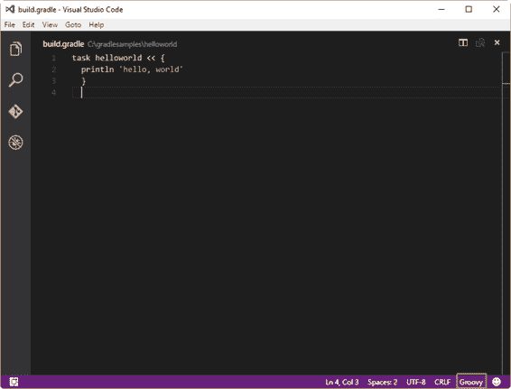
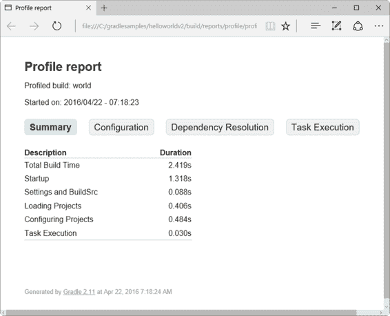

# 三、从 Gradle 开始

## 永远存在的 Hello World

与 Gradle 的第一次会议将通过创建和运行传统的 Hello World 文件来进行。为此，请使用文本编辑器键入以下示例。

代码清单 2

```groovy
  task helloworld << {
     println 'hello, world'
  }

```

现在，要运行前面的代码，用户需要保存文件，将其命名为**build . grade le**。出于本书的目的，所有样本将保存在一个名为**的文件夹中，每个样本都有一个子文件夹。在这种情况下，将创建一个名为 **helloworld** 的子文件夹来存储该文件。**



图 8:用 Visual Studio 代码编辑的文件

前面提到的文件被称为构建脚本，它是所有 Gradle 构建语句的容器。正如第 1 章中提到的，所有这些语句都对应于 Groovy 语言。这可以在图 8 的突出显示区域中注意到。

在本例中，构建脚本除了打印出一条示例消息之外，没有做什么。要运行 Hello World 示例，请打开命令提示符窗口，进入**C:\ grade samples \ Hello World**文件夹。之后，发出以下命令。

代码清单 3

```groovy
  gradle -q helloworld

```

下图显示了该命令产生的输出。


图 Hello World 示例的输出

## 构建脚本和构建

就本书而言，*构建脚本*将引用示例中使用的每个 **build.gradle** 文件， *build* 将表示这些脚本的执行过程。

## 与 Hello World 更进一步

查看 Hello World 示例，您可以看到第一行代码以`task`语句开始。这种说法将在本书后面详细解释。就目前而言，知道`task`是 Gradle 所坐的两个基本概念之一就足够了。

对于下一个示例，您需要创建一个名为**hello world dv 2**的文件夹。然后，文件 **build.gradle** 将在该文件夹中创建，代码如下。

代码清单 4

```groovy
  // hello world v2
  task hello << {
    print 'hello, '
  }

  task world(dependsOn: hello) << {
    println 'world'
  }

```

要运行此构建脚本，请通过发出以下命令来执行第二个任务(`world`)。

代码清单 5

```groovy
  gradle -q world

```

输出类似于第一个示例。不同之处在于，执行两个任务会产生相同的输出。

当执行`world`任务时，`dependsOn`语句(在括号内声明)告诉 Gradle 一个名为`hello`的任务应该在`world`任务之前执行。然后，`hello`任务产生“你好”输出。`print`命令将光标留在同一行，在空白位置之后。现在，执行`world`任务，产生“世界”输出和一个换行，然后是回车。

代码中声明的`dependsOn`语句意味着*依赖项*正被用于这个构建脚本。依赖性将在本书后面更详细地解释。

## 使用 Gradle 命令行

前面的示例是从命令提示符窗口执行的。换句话说，`gradle`命令行被用来运行这些构建脚本。本书将使用`gradle`命令行，下表解释了立即提高效率所需的选项。

表 1:渐变命令行选项

| [计]选项 | 描述 |
| --- | --- |
| `--help or -h` | 显示描述所有命令行选项的帮助消息。 |
| `--info or -i` | 将渐变日志级别设置为`INFO`，这将导致在构建脚本执行期间显示更多的信息消息。 |
| `-Dproperty=value` | 定义系统属性；这是一种从命令行将参数传递到构建中的机制。 |
| `--debug or -d` | 打开生成脚本的调试日志记录。这产生了大量的输出，但是对于诊断构建问题非常有用。 |
| `--dry-run or -m` | 评估并运行生成脚本，但不执行任何任务操作。 |
| `--quiet or -q` | 抑制大多数输出，仅显示错误消息。 |
| `--gui` | 启动 Gradle 图形用户界面。 |
| `properties` | 显示构建的`Project`对象的所有属性。`Project`对象表示当前构建的结构和状态。 |
| `tasks --all` | 显示当前生成脚本中所有可用任务的列表。插件可能会引入自己的任务，所以这个列表可能会更长。 |
| `--profile` | 编写包含生成脚本执行时间信息的报告。 |

### 显示帮助信息

要显示与命令行选项相关联的所有帮助文本，请发出以下命令。

代码清单 6

```groovy
  gradle -h

```

输出应该如下所示:

代码清单 7

```groovy
  USAGE: gradle [option...] [task...]

  -?, -h, --help          Shows this help message.
  -a, --no-rebuild        Do not rebuild project dependencies.
  -b, --build-file        Specifies the build file.
  -c, --settings-file     Specifies the settings file.
  --configure-on-demand   Only relevant projects are configured in
  this build run. This means faster build for large multi-project builds.
  [incubating]
  --console               Specifies which type of console output to
  generate. Values are 'plain', 'auto' (default) or 'rich'.
  --continue              Continues task execution after a task
  failure.
  -D, --system-prop       Set system property of the JVM (e.g.
  -Dmyprop=myvalue).
  -d, --debug             Log in debug mode (includes normal
  stacktrace).
  --daemon                Uses the Gradle daemon to run the build.
  Starts the daemon if not running.
  --foreground            Starts the Gradle daemon in the
  foreground. [incubating]
  -g, --gradle-user-home  Specifies the gradle user home directory.
  --gui                   Launches the Gradle GUI.
  -I, --init-script       Specifies an initialization script.
  -i, --info              Set log level to info.
  -m, --dry-run           Runs the builds with all task actions
  disabled.
  --max-workers           Configure the number of concurrent workers
  Gradle is allowed to use. [incubating]
  --no-color              Do not use color in the console output.
  [deprecated - use --console=plain instead]
  --no-daemon             Do not use the Gradle daemon to run the
  build.
  --offline               The build should operate without accessing
  network resources.
  -P, --project-prop      Set project property for the build script
  (e.g. -Pmyprop=myvalue).
  -p, --project-dir       Specifies the start directory for Gradle.
  Defaults to current directory.
  --parallel              Build projects in parallel. Gradle will
  attempt to determine the optimal number of executor threads to use.
  [incubating]
  --parallel-threads      Build projects in parallel, using the
  specified number of executor threads. [deprecated - Please use --parallel,
  optionally in conjunction with --max-workers.] [incubating]
  --profile               Profiles build execution time and
  generates a report in the <build_dir>/reports/profile directory.
  --project-cache-dir     Specifies the project-specific cache
  directory. Defaults to .gradle in the root project directory.
  -q, --quiet             Log errors only.
  --recompile-scripts     Force build script recompiling.
  --refresh-dependencies  Refresh the state of dependencies.
  --rerun-tasks           Ignore previously cached task results.
  -S, --full-stacktrace   Print out the full (very verbose)
  stacktrace for all exceptions.
  -s, --stacktrace        Print out the stacktrace for all
  exceptions.
  --stop                  Stops the Gradle daemon if it is running.
  -t, --continuous        Enables continuous build. Gradle does not
  exit and will re-execute tasks when task file inputs change. [incubating]
  -u, --no-search-upward  Don't search in parent folders for a
  settings.gradle file.
  -v, --version           Print version info.
  -x, --exclude-task      Specify a task to be excluded from
  execution.

```

### 简单一点:任务名称缩写

当在命令行中指定任务时，用户不必键入这些任务的全名。提供任务名称的一部分就足够了，它在构建脚本中唯一地标识了这个任务。

对于 helloworldv2 示例，可以使用以下命令来运行构建脚本。

代码清单 8

```groovy

gradle -q wo

```

如果缩写在构建脚本中不是唯一的，Gradle 将抛出一个警告。例如，考虑如下构建脚本。

代码清单 9

```groovy
  task helloTask << {
     println 'helloTask output'
  }

  task hello << {
    print 'hello, '
  }

  task world(dependsOn: hello) << {
    println 'world'
  }

```

如果用户执行以下命令。

代码清单 10

```groovy
  gradle -q h

```

Gradle 将抛出以下输出。

代码清单 11

```groovy
  FAILURE: Build failed with an exception.

  * What went wrong:
  Task 'h' is ambiguous in root project 'helloworldv2'. Candidates
  are: 'hello', 'help'.

  * Try:
  Run gradle tasks to get a list of available tasks. Run with
  --stacktrace option to get the stack trace. Run with --info or --debug option
  to get more log output.

```

|  | 提示:为了利用任务缩写来命名任务是很有用的。 |

### 列出构建脚本的任务

通过执行以下命令，可以获得属于构建脚本的所有任务的报告。

代码清单 12

```groovy
  gradle -q tasks --all

```

输出应该如下所示。

代码清单 13

```groovy
  ------------------------------------------------------------
  All tasks runnable from root project
  ------------------------------------------------------------

  Build Setup tasks
  -----------------
  init - Initializes a new Gradle build. [incubating]
  wrapper - Generates Gradle wrapper files. [incubating]

  Help tasks
  ----------
  buildEnvironment - Displays all buildscript dependencies declared
  in root project 'helloworldv2'.
  components - Displays the components produced by root project 'helloworldv2'.
  [incubating]
  dependencies - Displays all dependencies declared in root project
  'helloworldv2'.
  dependencyInsight - Displays the insight into a specific
  dependency in root project 'helloworldv2'.
  help - Displays a help message.
  model - Displays the configuration model of root project
  'helloworldv2'. [incubating]
  projects - Displays the sub-projects of root project
  'helloworldv2'.
  properties - Displays the properties of root project
  'helloworldv2'.
  tasks - Displays the tasks runnable from root project
  'helloworldv2'.

  Other tasks
  -----------
  helloTask
  world
      hello

```

### 获取任务的详细信息

通过使用`help`选项结合`--task`开关，可以获得特定任务的详细信息。要获取有关 helloworldv2 示例中的任务`world`的信息，请执行以下命令。

代码清单 14

```groovy
  gradle help --task world

```

该命令的输出应该如下。

代码清单 15

```groovy
  :help
  Detailed task information for world

  Path
       :world

  Type
       Task (org.gradle.api.Task)

  Description
       -

  Group
       -

  BUILD SUCCESSFUL

  Total time: 2.863 secs

```

### 获取构建脚本的概要文件

`--profile`命令行选项允许您获取包含构建信息的报告。该报告被写入**构建\报告\配置文件**文件夹。该报告将使用运行构建脚本的日期和时间命名，并将以 HTML 格式保存。

此报告列出了配置阶段和任务执行的汇总时间和详细信息。所有操作都被排序，最昂贵的操作(就耗时而言)排在第一位。结果还表明是否有任何任务被跳过，发生这种情况的原因，以及没有跳过的任务是否不起作用。



图 helloworldv2 构建脚本的概要报告示例

## 章节总结

本章已经展示了如何开始使用 Gradle。传统的 Hello World 示例用于理解基本的工作概念。

出于本书的目的，所有样本将保存在一个名为**C:\ grade samples**的文件夹中，并且将在其中为每个示例创建一个子文件夹。对于 Hello World 示例，将创建名为 **helloworld** 的子文件夹，并在该子文件夹中创建名为 **build.gradle** 的文件。这个文件被称为构建脚本，它是所有 Gradle 构建语句的容器，这些语句是 Groovy 语言语句。

**build.gradle** 文件的第一行代码以`task`语句开始。`Task`是 Gradle 所立足的两个基本概念之一。

一个构建脚本可以包含几个任务，一个任务可以依赖另一个任务来执行。这可以通过在括号内的`task`声明中使用`dependsOn`子句来实现。像`task world(dependsOn: hello)`这样的声明告诉 Gradle 勒，名为`hello`的任务必须在名为`world`的任务之前执行。

`gradle`命令行将贯穿本书。其中包含了一些选项，可以用来立即提高工作效率。例如，`-h`选项用于显示与命令行选项相关联的所有帮助文本，`tasks --all`选项用于获取构建脚本中所有任务的报告，`help --task`选项用于获取任务的详细信息，`--profile`选项生成关于构建执行的报告。

从命令行执行任务时，您不必键入任务的全名—Gradle 允许您提供任务名称的一部分，它在构建脚本中唯一标识任务。这种机制被称为缩写。建议在使用缩写时以避免不明确引用的方式命名任务，因为如果发生这种情况，Gradle 将在构建过程中抛出警告。