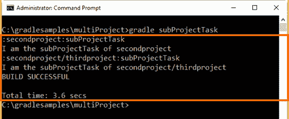
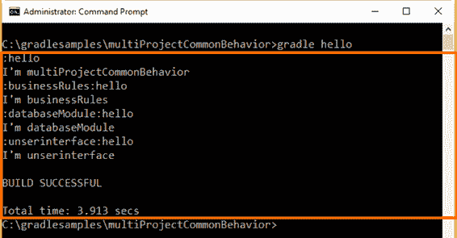
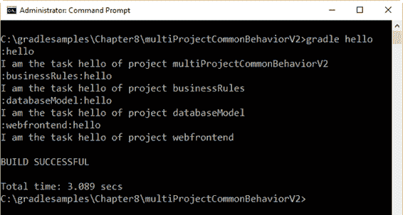
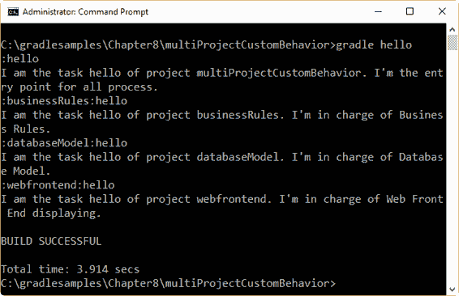
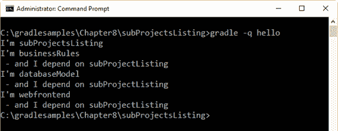
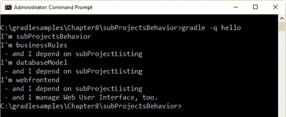
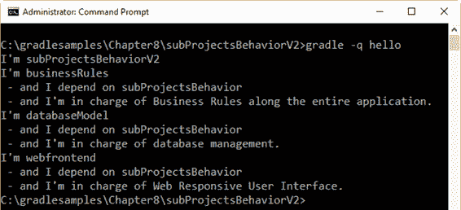
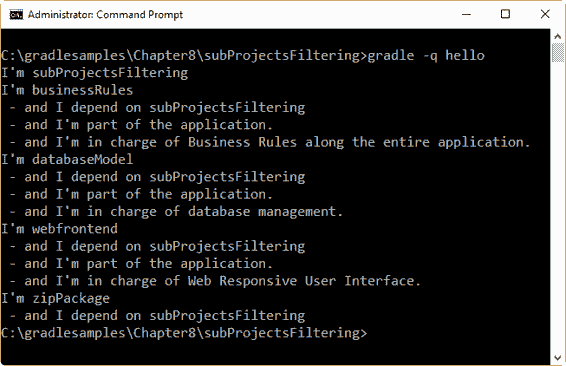
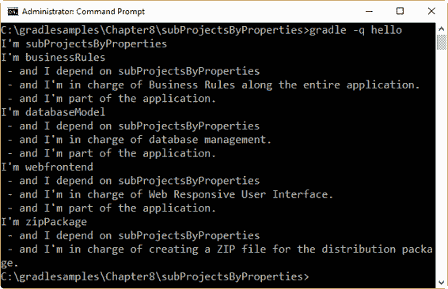
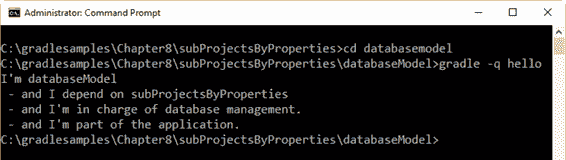

# 八、多项目构建

在 Gradle 中，多项目生成由一个根项目和一个或多个可能也有子项目的子项目组成。这个场景对于将一个项目组织和理解为一组更小的、相互依赖的模块非常有用。在这种情况下，所有模块都链接在一起。

## 多项目建筑的结构

多项目构建应该遵循一致的结构，该结构具有以下特征:

*   根项目目录中的一个 **settings.gradle** 文件。
*   根项目目录中的一个 **build.gradle** 文件。
*   拥有自己的 **build.gradle** 文件的子目录(一些多项目构建可能会省略子项目的构建脚本)。

**settings . Gradle**文件告诉 grade le 项目和子项目是如何组织的。以下命令显示项目的结构。

代码清单 75

```groovy
  gradle
  -q projects

```

输出应该如下所示。

代码清单 76

```groovy

  ------------------------------------------------------------
  Root
  project
  ------------------------------------------------------------

  Root
  project 'multiProject'
  \---
  Project ':secondproject'

  To
  see a list of the tasks of a project, run gradle <project-path>:tasks
  For
  example, try running gradle :secondproject:tasks

```

这告诉我们`multiProject`有一个直接的子项目，名为`secondproject`。子项目的名称以项目的路径格式显示(如第 5 章所述)。如果一个子项目有子项目，这些子项目会以树形结构显示在其名称下。该输出映射到所有项目的目录结构。所以，`secondproject`可以在**多项目\第二项目**目录中找到。

通常，每个项目都有自己的**build . grade le**文件。在某些情况下，这是不必要的(例如，当一个子项目只是其他子项目的容器时)，但是根项目有一个。

根项目的 **build.gradle** 文件通常用于在子项目之间共享公共配置。例如，可能需要对所有插件应用相同的插件集。如果最好将所有项目的配置集中在一个地方，它也可以用于配置单个子项目。这意味着查看根构建文件是发现特定子项目是如何配置的好方法。

## 执行多项目构建

多项目构建仍然是 Gradle 可以运行的任务的集合。区别在于用户可能想要控制应该执行哪个项目的任务。以下选项适用于多项目生成执行。

*   可以换到你要运行的项目对应的目录，然后照常执行`gradle <taskname>`。
*   您可以从根项目的目录中指定一个合格的任务名称。例如，`gradle :ftputils:build`将构建`fptutils`子项目及其所依赖的任何子项目。
*   您可以通过发出`gradle <taskname>`命令，指定可以在根项目或其所依赖的任何子项目中找到的任务名称。

第一个和第三个选项类似于单项目用例，但是 Gradle 在多项目用例中的工作方式略有不同。以下命令…

代码清单 77

```groovy
  gradle
  hello

```

……将在相对于当前目录具有任务的任何子项目中执行`hello`任务。

第二个选项提供了对执行内容的更多控制。以下命令…

代码清单 78

```groovy
  gradle
  :secondproject:subProjectTask

```

……将执行`secondproject`子项目的`subProjectTask`任务及其所有依赖项。

注意以下项目结构…

代码清单 79

```groovy

  ------------------------------------------------------------
  Root
  project
  ------------------------------------------------------------

  Root
  project 'multiProject'
  +---
  Project ':secondproject'
  \---
  Project ':secondproject/thirdproject'

  To
  see a list of the tasks of a project, run gradle <project-path>:tasks
  For
  example, try running gradle :secondproject:tasks

```

…如果用户执行以下命令…

代码清单 80

```groovy
  gradle
  subProjectTask

```

……任务`subProjectTask`将在定义它的每个项目中执行。Gradle 将从根项目开始寻找这个任务，并在最后一个包含在 **settings.gradle** 文件中的项目中结束。

根项目的代码如下。

代码清单 81

```groovy
  task
  hello << {

  println "I'm $project.name"
  }

```

这是`secondproject`项目的代码:

代码清单 82

```groovy
  task
  hello << {

  println "I'm $project.name"
  }

  task
  subProjectTask << {

  println 'I am the subProjectTask of secondproject'
  }

```

`secondproject/thirdproject`的代码是:

代码清单 83

```groovy
  task
  hello << {

  println "I'm $project.name"
  }

  task
  subProjectTask << {

  print "I am the subProjectTask of $project.name"
  }

```



图 37:渐变子任务命令的输出

## 定义常见行为

正如本章前面所解释的，在多项目构建中，子项目没有必要拥有自己的 **build.gradle** 文件。也就是说，构建脚本在多项目构建中是可选的。但这并不意味着您不能为每个相关子项目定义特定的行为。考虑到以下项目结构…

代码清单 84

```groovy
  ------------------------------------------------------------
  Root
  project
  ------------------------------------------------------------

  Root
  project 'multiProjectCommonBehavior'
  +---
  Project ':businessRules'
  +---
  Project ':databaseModule'
  \---
  Project ':unserinterface'

  To
  see a list of the tasks of a project, run gradle <project-path>:tasks
  For
  example, try running gradle :businessRules:tasks

```

…以及根项目的 **build.gradle** 文件中的以下构建脚本…

代码清单 85

```groovy
  Closure
  cl = { task -> println "I'm $task.project.name" }
  allprojects
  {

  task hello << cl
  }

```

…上一个构建脚本的输出显示在下图中。



图 38:常见行为示例的输出

Gradle 在其应用编程接口中提供了一个名为`allprojects`的属性。此属性返回当前项目及其下所有子项目的列表。如果用户用闭包调用`allprojects`，闭包的所有语句都被委托给与该属性相关联的项目。因此，尽管子项目没有 **build.gradle** 文件，但是示例中的任务`hello`是从根项目的`build.gradle`文件中为每个子项目委派的。

可以通过`allprojects.each`进行迭代，如下例所示。

代码清单 86

```groovy
  Closure
  cl = {task -> println "I am the task $task.name of project
  $task.project.name"}

  allprojects.each
  {

  project("$it.path") {

  task hello << cl
      }

  }

```

前面的代码为对象变量赋值一个闭包。然后，当通过`allprojects.each`的迭代完成时，闭包被分配给一个名为`hello`的任务，该任务使用`project`方法被分配给每个项目，该方法接收项目的路径作为参数。

现在，当用户执行以下命令时…

代码清单 87

```groovy
  gradle
  hello

```

…显示的输出如下图所示。



图 39:所有项目的输出

## 定义特定行为

`allprojects.each`迭代对于根据项目的路径为项目分配不同的闭包非常有用。假设项目结构如下…

代码清单 88

```groovy
  ------------------------------------------------------------
  Root
  project
  ------------------------------------------------------------

  Root
  project 'multiProjectCustomBehavior'
  +---
  Project ':businessRules'
  +---
  Project ':databaseModel'
  \---
  Project ':webfrontend'

  To
  see a list of the tasks of a project, run gradle <project-path>:tasks
  For
  example, try running gradle :businessRules:tasks

```

...下面代码片段中显示的代码应该用于实现这个目标。

代码清单 89

```groovy
  /*
  Four closures are defined. */
  Closure
  clbr = {task -> println "I am the task $task.name of project
  $task.project.name. I'm in charge of Business Rules."}
  Closure
  cldm = {task -> println "I am the task $task.name of project
  $task.project.name. I'm in charge of Database Model."}
  Closure
  clwf = {task -> println "I am the task $task.name of project
  $task.project.name. I'm in charge of Web Front End displaying."}
  Closure
  clroot = {task -> println "I am the task $task.name of project
  $task.project.name. I'm the entry point for all process."}

  /*
  Depending on the project's path, a different closure is assigned to the task
  hello. 

  This produces a specific behavior for the same task, depending on which
  project is 

  executed.                                                                          */
  allprojects.each
  {

  project("$it.path") {

  switch (it.path) {

  case ":businessRules" : task hello << clbr ; break;

  case ":databaseModel" : task hello << cldm ; break;

  case ":webfrontend" : task hello << clwf ; break ;

  default: task hello << clroot;

  }
      }
  }

```

代码将构建脚本开始时声明的四个闭包之一分配给`hello`任务。这项任务取决于正在执行的项目。构建脚本使用`project`对象的`path`属性评估项目的名称，该属性存储在由`each`循环创建的隐式`it`变量中。放置在`project`方法的花括号内的`switch`语句进行所有需要的比较，以便为任务分配适当的闭包。在某种程度上，前面的代码使用了面向对象编程的多态性能力。

如果您执行以下命令…

代码清单 90

```groovy
  gradle
  hello

```

…输出应该如下图所示。



图 40:多项目定制行为的输出

## 子项目配置

### 子项目属性

还有一种方法可以只访问子项目。这可以通过使用`subprojects`属性来完成。此属性仅在生成的子项目中执行迭代。下面的代码显示了如何执行这个迭代。

代码清单 91

```groovy
  allprojects
  {

  task hello << {task -> println "I'm $task.project.name"}
  }

  subprojects
  {

  hello << {println " - and I depend on subProjectListing"}
  }

```

下图显示了此构建的输出。



图 41:子项目列表输出

项目的执行顺序可以通过查看图 41 中显示的输出来确定。首先，在配置阶段，`allprojects`循环将`hello`任务分配给根项目及其依赖项。当这个动作完成时，`subprojects`循环为属于每个任务的每个`hello`任务分配一个新的动作。由于`allprojects`首先分配了一个动作，所以添加到每个子项目的动作将在分配的第一个动作之后执行。然后，执行阶段产生如图所示的结果。

### 给定子项目添加特定行为

像`allprojects`属性一样，`subprojects`有一个`each`迭代，允许用户单独访问子项目。如果您想要将特定行为添加到任何相关子项目中，此迭代可能会很有用。

代码清单 92

```groovy
  allprojects
  {

  task hello << {task -> println "I'm $task.project.name"}
  }

  subprojects.each
  {

  project("$it.path").hello << {

  println " - and I depend on subProjectsBehavior"
      }

  if (it.path == ":webfrontend")
      {

  project("$it.path").hello << {

  println " - and I manage Web User Interface, too."

  }

  }    
  }

```

这段代码源自上一节讨论的示例。使用`subproject`属性的`each`迭代来学习每个相关子项目的名称。每个子项目的`hello`任务都会收到一个闭包，显示短语“-我依赖于子项目行为”，当`:webfrontend`子项目被评估时，只有它的`hello`任务会收到一个新的闭包，显示“-我也管理网络用户界面。”声明。

当执行以下命令时…

代码清单 93

```groovy
  gradle
  -q hello

```

…将显示以下输出。



图 42:子项目的输出行为构建脚本

### 使用 build.gradle 文件添加特定行为

向子项目添加特定行为的另一种方法是创建自己的 **build.gradle** 构建脚本文件。假设项目结构如下…

代码清单 94

```groovy
  ------------------------------------------------------------
  Root
  project
  ------------------------------------------------------------

  Root
  project 'subProjectsBehaviorV2'
  +---
  Project ':businessRules'
  +---
  Project ':databaseModel'
  \---
  Project ':webfrontend'

  To
  see a list of the tasks of a project, run gradle <project-path>:tasks
  For
  example, try running gradle :businessRules:tasks

```

…将为每个子项目创建一个 **build.gradle** 文件。

代码清单 95

```groovy
  /*
  businessRules\build.gradle */
  hello.doLast
  {

  println " - and I'm in charge of Business Rules along the entire
  application."
  }

```

代码清单 96

```groovy
  /*
  databaseModel\build.gradle */
  hello.doLast
  {

  println " - and I'm in charge of database management."
  }

```

代码清单 97

```groovy
  /*
  webfrontend\build.gradle */
  hello.doLast
  {

  println " - and I'm in charge of Web Responsive User Interface."
  }

```

代码清单 98

```groovy
  /* build.gradle
  */
  allprojects
  {

  task hello << {task -> println "I'm $task.project.name"}
  }

  subprojects.each
  {

  project("$it.path").hello << {

  println " - and I depend on subProjectsBehavior"
      }
  }

```

`doLast`方法用于每个子项目构建脚本。此方法在根项目的构建脚本中为每个子项目中的`hello`任务添加一个闭包，该闭包将在分配给同一任务的所有以前的闭包之后执行。请记住，根项目是在配置阶段评估的第一个项目。然后，每个子项目按照**设置.Gradle**文件中建立的顺序进入配置阶段。之后，每个子项目的 **build.file** 将进入配置模式——这就是为什么在每个子项目的 **build.gradle** 文件中声明的闭包被添加到执行链的末尾。

即使用户可以从根的构建脚本访问所有子项目，建议将特定于项目的行为放在单独的 **build.gradle** 文件中，用于每个子项目。这使得项目维护不那么复杂。

现在，运行以下命令…

代码清单 99

```groovy
  gradle
  -q hello

```

…将显示以下输出。



图 43:子项目行为 2 的输出

### 按名称过滤

控制项目行为的另一种方法是在根项目的构建脚本中使用`configure`方法。此方法将一个包含一系列项目对象的列表作为参数。然后，该方法将配置应用于列表中的项目。

代码清单 100

```groovy
  allprojects
  {

  task hello << {task -> println "I'm $task.project.name"}
  }

  subprojects.each
  {

  project("$it.path").hello << {

  println " - and I depend on subProjectsFiltering"
      }
  }

  configure(subprojects.findAll
  {it.name != 'zipPackage'}) {

  hello << {println " - and I'm part of the application."}
  }

```

这段代码和这个构建脚本的项目结构是从上一节的示例项目中派生出来的。区别在于一个名为`zipPackage`的新子项目，它也有自己的 **build.gradle** 文件。

以下代码片段显示了`zipPackage`项目的 **build.gradle** 文件。

代码清单 101

```groovy
  /* zipPackage\build.gradle
  */
  hello.doLast
  {

  println " - and I'm in charge of creating a ZIP file for the
  distribution package."
  }

```

一旦执行了以下命令…

代码清单 102

```groovy
  gradle
  -q hello

```

…显示的输出如下。



图 44:子项目过滤的输出

在图 44 中，您可以看到在`zipPackage`的构建脚本中声明的闭包没有被执行。为什么呢？`configure`方法对此负责。同样，在配置了`allprojects`和`subprojects`方法之后，每个子项目的构建脚本都进入了配置阶段。但是在这个构建脚本中，已经声明了`configure`方法。因此，这个方法负责处理所有子项目的配置阶段。该方法接收一个参数，该参数是一个包含所有要配置的项目的列表，然后在执行项目的 **build.gradle** 文件(如果有)中包含的语句之前，对列表中的每个项目执行花括号内的语句。

`subprojects`对象的`findAll`方法创建了一个包含所有项目的子列表，它符合花括号中声明的条件。在这种情况下，条件告诉`findAll`方法，当一个项目的名称不同于`zipPackage`时，应该将其添加到这个子列表中。一旦创建了子列表，它就作为参数传递给`configure`方法。由于`findAll`方法规定的条件，不包括`zipPackage`项目。因此，没有配置应用于项目，这包括其自己的 **build.gradle** 文件的配置。

### 按属性过滤

可以使用额外的项目属性建立过滤器。要定义一个额外的属性，这个属性应该在项目的构建脚本中声明，它的名称前面是关键字`ext`，后面是一个点。额外的属性应该如下所示:

代码清单 103

```groovy
  ext.software
  = true

```

在前面的代码中，声明了一个名为`software`的额外属性，并为其分配了`true`的值。

现在，这个额外的属性应该在多项目目录结构中的所有构建脚本中声明(将使用上一节的示例，做一些更改)。该属性的值将始终为`true`，除了`zipPackage’s`子项目，其中该属性将包含一个`false`值。

根项目的 **build.gradle** 文件应该如下所示:

代码清单 104

```groovy
  allprojects
  {

  task hello << {task -> println "I'm $task.project.name"}
  }

  subprojects
  {

  hello {

  doLast {println " - and I depend on $rootProject.name"}

  }

  afterEvaluate {Project project ->

  if (project.software) { hello.doLast {println " - and I'm part of the
  application."} }   
     }
  }

```

在前面的代码中，当`subprojects`方法进入配置阶段时，每个子项目的`hello`任务会一个接一个地增加一个闭包。此闭包使用`rootProject`对象的`name`属性显示子项目所依赖的项目名称。之后，子项目的 **build.gradle** 文件也被配置，`doLast`方法为`hello`任务添加了另一个闭包。然后，为正在配置的每个子项目触发`afterEvaluate`建议操作，将`subproject`对象作为参数传递。此建议操作评估为目录结构中的每个项目声明的`software`扩展属性，如果该属性的值为`true`，则为`hello`任务添加一个闭包。对`zipPackage`构建脚本的建议是将`software`属性的值设置为`false`。所以`afterEvaluate`的建议不会给`zipPackage`的`hello`任务增加关闭。最后，Gradle 进入执行阶段。



图 45:子项目属性示例的输出

## 多项目构建的执行规则

当执行来自根项目目录的`hello`任务时，一个直观的行为自动发生:执行不同项目的所有`hello`任务。如果用户切换到`databaseModel`目录并执行…

代码清单 105

```groovy
  gradle
  -q hello

```

…将显示以下输出。



图 46:从数据库模型目录执行 hello 任务

格雷尔的行为背后有一个基本规则。Gradle 从当前目录开始向下查找所有名为 hello 的任务并执行它们。有一点需要注意:Gradle 总是评估多项目构建中的每个项目，并创建所有现有的任务对象。然后，Gradle 根据任务名称参数和当前目录过滤应该执行的任务。每一个项目都必须在任务执行前进行评估。

## 一个真实的 Java 例子

下面的示例由一个构建两个 Java 应用程序的父项目组成，然后创建一个包含这两个应用程序的分布。

代码清单 106

```groovy
  defaultTasks
  'build', 'copyDist', 'packageDistribution'

  allprojects
  {

  apply plugin: 'java'

  group = 'hello'

  version = '1.0'
  }

  project(':helloWorld').jar
  {

  manifest {

  attributes 'Specification-Title'    : 'Gradle Succinctly'

  attributes 'Specification-Version'  : '1.0'

  attributes 'Specification-Vendor'   : 'Syncfusion, Inc.'

  attributes 'Implementation-Title'   : 'hello.HelloWorld'

  attributes 'Implementation-Version' : 'build02'

  attributes 'Implementation-Vendor'  : 'Syncfusion, Inc.'

  attributes 'Main-Class': 'hello.HelloWorld'
      }
  }

  project(':sendMessage').jar
  {

  manifest {

  attributes 'Specification-Title'    : 'Gradle Succinctly'

  attributes 'Specification-Version'  : '1.0'

  attributes 'Specification-Vendor'   : 'Syncfusion, Inc.'

  attributes 'Implementation-Title'   : 'hello.HelloWorld'

  attributes 'Implementation-Version' : 'build02'

  attributes 'Implementation-Vendor'  : 'Syncfusion, Inc.'

  attributes 'Main-Class': 'hello.SendMessage'

  }   
  }

  task
  copyDist(type: Copy) {

  into "$buildDir\\libs"

  subprojects {

  from tasks.withType(Jar)
      }
  }

  /*
  This task will be executed after the copyDist task

  and will create a zip file with the contents of

  the build\libs directory (the jar programs). 

  The zip file will be saved in the 

  build\distributions folder, and will be named

  distPackage-1.0.zip                              */
  task
  packageDistribution(type: Zip){

  from 'build\\libs'

  baseName = 'distPackage'

  version = '1.0'
  }

```

首先，构建脚本声明了三个默认任务，它们将按顺序执行，从左边开始。为了这个例子的目的，应该首先执行`build`任务。然后，`copyDist`任务将在 Gradle 完成两个 Java 应用程序的构建后执行。该任务将两个应用程序复制到根项目的 **build\libs** 文件夹中。最后，`packageDistribution`任务将获取根项目的 **build\libs** 文件夹的内容并创建一个压缩的。两个应用程序的 zip 文件。该文件将保存在根项目的**构建\分发**文件夹中。

在前面的例子中，多项目构建由两个子项目组成:`helloWorld`和`sendMessage`。`allprojects`方法将 Java 插件应用于构建中包含的所有项目。它还为两个应用程序(`hello`)分配了版本号(`1.0`)和通用组名。之后，`jar`对象用于两个项目，以声明应用程序的入口点并设置包信息。当用户发出没有任务名称的`gradle`命令时，首先执行`build`任务。然后，当构建 Java 应用程序时，`copyDist`获取由构建创建的所有`Jar`类型的工件(在这种情况下，是两个 Java 应用程序)，并将它们复制到根项目的**构建\libs** 目录中。现在，`packageDistribution`任务获取保存在 **build\libs** 目录中的所有文件，并在根项目的**build \ distributes**目录中创建一个. zip 压缩文件。

## 章节总结

在 Gradle 中，多项目生成由一个根项目和一个或多个可能也有子项目的子项目组成。在这种情况下，所有项目都链接在一起。

多项目构建应该遵循一致的结构，它有一个主目录，称为根项目的目录。每个子项目都由根目录下的子目录组成。一个 **settings.gradle** 文件和一个 **build.gradle** 文件应该在项目的根目录下。**设置. gradle** 文件告诉 gradle 项目和子项目是如何组织的。

多项目构建仍然是 Gradle 可以运行的任务的集合。区别在于用户可能想要控制应该执行哪个项目的任务。以下选项适用于多项目生成执行:

*   可以换到你要运行的项目对应的目录，然后照常执行`gradle <taskname>`。
*   您可以从根项目的目录中指定一个合格的任务名称。例如，`gradle :ftputils:build` 将构建 **fptutils** 子项目及其所依赖的任何子项目。

通过发出`gradle <taskname>`命令，您可以指定可以在根项目或其所依赖的任何子项目中找到的任务名称。

在多项目构建中，有时子项目没有必要拥有自己的**构建.Gradle**文件。也就是说，构建脚本在多项目构建中是可选的。Gradle 在其 API 中提供了一个名为`allprojects`的属性，该属性返回一个包含当前项目及其下所有子项目的列表。如果在调用`allprojects`时使用闭包，那么闭包的所有语句都被委托给与该属性相关联的项目。

`allprojects.each`迭代对于根据项目的路径为项目分配不同的闭包非常有用。

还有一种方法可以只访问子项目。这可以通过使用`subprojects`属性来完成。像`allprojects`属性一样，`subprojects`有一个`each`迭代，允许你单独访问子项目。

向子项目添加特定行为的另一种方法是在子项目目录中创建一个 **build.gradle** 文件。此外，可以使用根项目的构建脚本中的`configure`方法来控制项目的行为。该方法以一个包含一系列`project`对象的列表作为参数。然后，该方法将配置应用于列表中的项目。

可以使用额外的属性为子项目建立过滤器。要定义一个额外的属性，它应该在项目的构建脚本中声明，其名称前面是关键字`ext`，后面是一个点(例如`ext.software`)。

当执行来自根项目目录的任务时，一个直观的行为会自动发生:执行具有相同任务名称的不同项目的所有任务。格雷尔的行为背后有一个基本规则。Gradle 从当前目录开始，向下查找所有同名的任务并执行它们。需要注意的是，Gradle 总是评估多项目构建中的每个项目，并创建所有现有的`task`对象。然后，Gradle 根据任务`name`参数和当前目录过滤出应该执行的任务。每一个项目都必须在任务执行前进行评估。