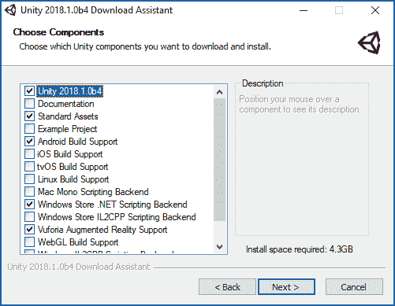
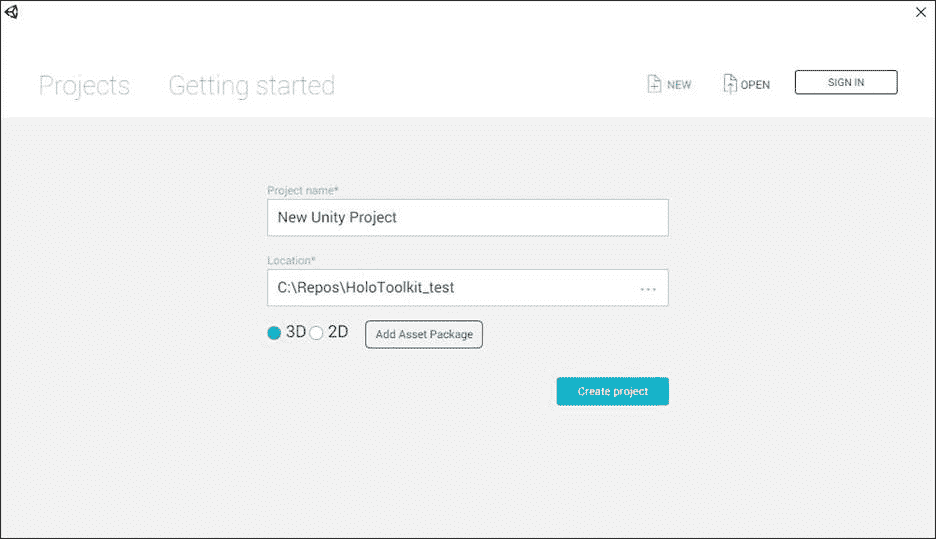
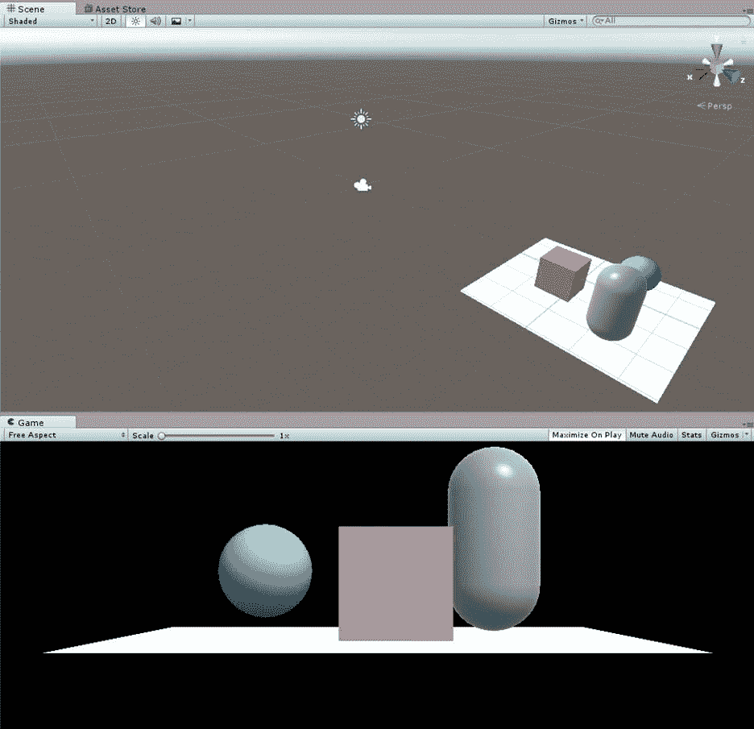
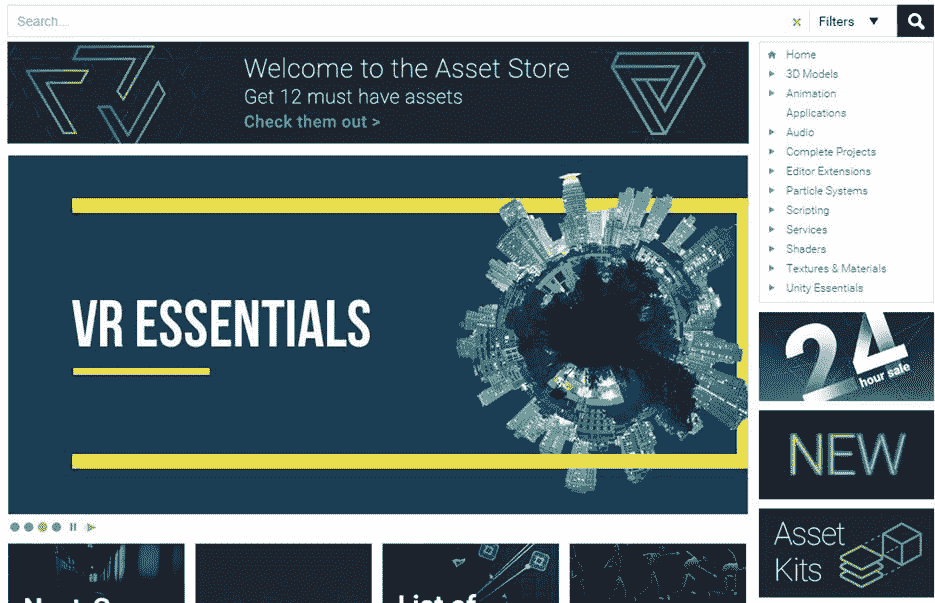
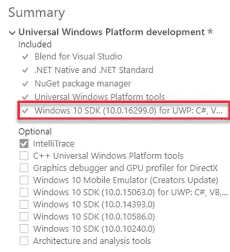
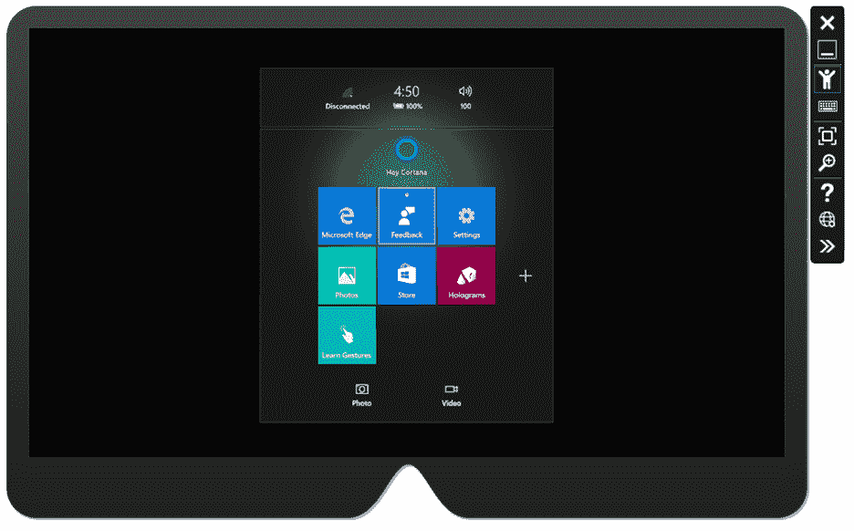
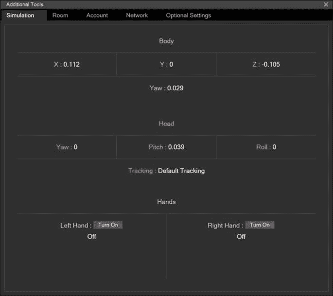

# 二、工具

创建 MR 体验的工具对于微软堆栈上的开发人员来说是熟悉的，尤其是如果你做过任何移动开发的话。该工具基于用于设置 3D 空间的统一 3D，以及用于管理代码和业务逻辑的 Visual Studio。对于没有物理设备的开发人员来说，还有一个尽可能真实的仿真器。

工具都是免费的，这大大降低了进入的障碍。事实上，你不需要有一个物理全息镜头设备来开发它——尽管有一个会让它变得更有趣！正如您将在本章中了解到的，该工具可以立即下载并用于为 UWP 创建全息镜头应用程序。

传统上，作为一个跨平台的游戏开发引擎，统一 3D 是一个建模 3D 体验或一系列体验的工具。它目前支持 27 种不同的平台，是任天堂和微软 HoloLens 等公司的首选开发工具。

为了开发全息镜头的体验，你必须使用统一 3D 来设计所谓的场景。当然，您不需要使用 Unity 来开发 HoloLens，但是集成和工具的布局方式，如果不使用它，您的生活会变得更加困难。在本书的剩余部分，我们将只使用 Unity 在我们的应用程序中创建和处理场景。

获得统一 3D 就像任何其他标准软件一样。这是一个简单的安装程序，可以从统一 3D 网站下载。[【3】](HoloLens_Succinctly_0014.htm#_ftn3)

完成安装向导并选择要安装的组件时，请选择默认设置。如果您打算为其他平台开发 Unity 项目，您可能希望选择其他组件。

图 7: Unity 3D 安装屏幕—选择组件

安装程序将下载所需的组件，一旦安装了 Unity，它就可以运行了。

在 Unity 3D 中创建新项目很简单。您可以从开始屏幕创建一个新项目，也可以在 Unity 成功加载后从**文件**菜单创建一个新项目，这又会调出开始屏幕。

图 8:统一启动屏幕

如果您有在线个人资料，您可以登录，任何项目都将链接到您的个人资料。

对于新的全息镜头项目，请始终选择 **3D** 选项。这会将场景视图(您的工作空间)设置为 3D，将照明设置为符合 3D，正确设置相机，并且通常确保环境是 3D 就绪的。

HoloLens 开发和创建混合现实体验的主要目标之一是为最终用户提供自然体验。这个目标的一部分是通过真实可信的三维模型来实现的。如果你像我一样(一个没有任何设计技能的开发人员)，你将依赖于来自资产商店、设计师和其他地方的 3D 模型。当您等待图稿到达时，请使用基本的 Unity 3D 形状作为占位符。一旦你得到了真实的资产，你就可以用简单的形状替换它，并为真实的模型编写脚本和行为。

图 9:统一三维对象

构建和设计三维模型是一项远远超出软件开发的工作。如果你不是一个设计师或者对三维物体和模型有很好理解的人，最好把这个留给有这种理解的人。有许多方法可以为您的项目获得出色的 3D 模型，例如搜索 Unity 3D 资产商店和其他在线 3D 资产商店，使用自由建模师，或者只是与从事 3D 视觉工作的人合作。

图 10:统一资产商店

与 Unity 一样，如果您正在进行 HoloLens 开发，那么将 Visual Studio 作为开发的主要编辑器和工具是极其困难的。如果你以前没有使用过 Visual Studio，那你就有机会了。乍一看，这令人望而生畏，有些令人困惑，但投入到产品中的深度和思想是惊人的。它是在微软栈(和其他非微软技术)上开发任何东西的工具。

|  | 注意:这本书描述了用 Visual Studio 2017 开发混合现实体验。 |

Visual Studio 2017 的社区版是免费的，完全支持 HoloLens 开发。你可以从[这里](https://www.visualstudio.com/downloads/)下载，然后在 15 分钟内安装完毕，就可以上路了。

图 11: Visual Studio 2017 安装

安装时，在**工作负载**选项卡中选择**通用视窗平台开发**包。这是你构建和编译视窗全息应用程序所需要的。因为 HoloLens 本身运行在 Windows 10 上，所以您构建的应用程序是 Universal Windows Platform 应用程序(如第 1 章所述)，Windows 10 SDK 为您提供了构建 Windows 10 应用程序的最新头文件、库和工具。如果已经安装了 VS 2017，启动 Visual Studio Installer 程序，点击**安装** > **修改**，然后选择**通用 Windows 平台开发**包。

图 12:选择 Windows 10 软件开发工具包

你可能没有物理 HoloLens。首先，它们在许多国家并不容易买到，其次，它们非常昂贵。除非你有购买全息镜头的特定目的或项目(或其他人正在付费)，否则它不是你“刚刚得到”的物品幸运的是，HoloLens 模拟器是完全免费的。这是你能得到的最接近没有 HoloLens 的真实 HoloLens。

|  | 注意:HoloLens 模拟器是你需要一个带有 Hyper-V 的 Windows 10 版本的主要原因。如果你有一个物理 HoloLens，Hyper-V 是不需要的，但是确实让开发变得更容易。 |

图 13:HoloLens 模拟器

模拟器附带工具，帮助您尽可能多地模拟真实设备。除了设备入口(参见第 9 章“测试 HoloLens 体验”)，还有一个用于仿真器输入和输出的第二个工具屏幕。您可以在身体、头部和手(手势)的仿真中监控演员的仿真坐标。您还可以更改位置的空间映射(换句话说，更改房间布局)，并使用 Microsoft 帐户登录模拟器并查看网络配置值。

图 14:仿真器工具—仿真

## 全息图

我们正在谈论 HoloLens 的开发，当然，拥有一个物理 HoloLens 是最好的部分。该设备是开创性的，亲身体验混合现实是真正独特的。没有物理设备，你没有理由不能开发全息镜头应用程序，但是有一个可用的设备确实会让整个体验更加愉快。如果你不使用设备进行开发，我建议在将你的应用发布到野外之前，在真实的设备上进行测试。