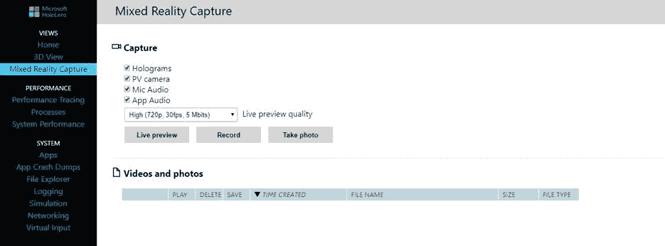
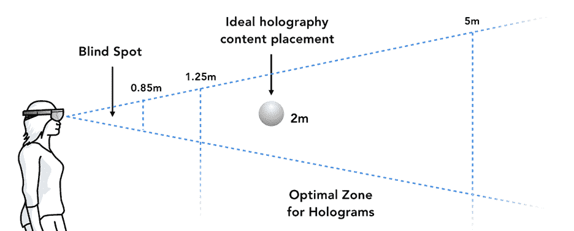

# 九、测试 HoloLens 体验

HoloLens 体验是一个软件项目，不管硬件有多酷，空间映射有多不可思议。最终，您创建的应用程序将在您无法控制的某人的机器上运行。就像任何其他软件一样，你需要测试你的工作。

正如您将看到的，测试 HoloLens 开发工作与传统软件测试有很大不同。你突然需要管理真实世界的交互，以及你的脚本和性能。当然，这需要不同的方法。

在测试 HoloLens 体验时，你最好的朋友和工具是设备入口。您可以使用指向 HoloLens 在本地网络上分配的 IP 地址的网络浏览器来访问它。该门户提供了对一系列统计数据、实时监控以及开发体验时可以使用的工具的深入了解。


图 40:HoloLens 设备入口

|  | 提示:开发人员门户可以在模拟器和物理设备上工作。 |

你会发现使用门户会加快你的开发和质量保证阶段，因为它有针对这两个阶段的工具。

因为设备门户是在设备(或仿真器)本身上运行的，所以您也可以直接从设备访问三维信息。打开三维视图，您可以看到设备相对于当前空间映射的准确位置。这真的很酷，也是一个可视化用户体验的好方法。


图 41:更新按钮

如果单击**三维视图**屏幕上的**更新**按钮，将在与用户相关的平面上以三维方式绘制空间映射。这是由设备创建的瞬时 3D 模型的表示。

|  | 注意:如果您使用模拟器，房间的空间映射是预先加载的，不会实时更新。 |

3D 视图还有一些功能也派上了用场。您可以实时查看稳定平面的位置，这将有助于调试任何稳定问题。有一个复选框显示空间锚，这是非常有用的，如果全息图开始漂移或你有识别房间特征的问题。如果您真的想体验空间映射的影响，您可以使用第一人称视图来查看用户将看到的 3D 环境模型。

|  | 提示:使用三维视图更新空间模型，直到它足够详细以供您使用，然后将其保存到磁盘。其他团队成员可以在模拟器中加载同一个房间，使得团队测试更加准确。 |

虽然三维视图可以显示空间映射的多边形，但您也可以捕捉用户看到的整个体验。混合现实捕捉允许您选择想要捕捉的体验部分，包括全息图、设备上的相机、麦克风音频和应用程序音频。您也可以选择您想要的录制质量。一般来说，您会希望质量设置为高，但是如果本地网络(您接收信号的网络)的带宽不是很大，它可以在较低的分辨率下工作得更好。

能够访问混合现实体验的直播有几个好处。您可以准确记录用户在体验中看到的[<sup>【7】</sup>](HoloLens_Succinctly_0014.htm#_ftn7)，这可以揭示任何问题，如漂移和抖动。确切地看到问题是什么使得调试和性能改进变得容易得多。你可以准确地指出问题所在，并测试输入和移动的特定组合，然后记录下来。您可以与需要分析和解决错误的团队或开发人员共享录音。



图 42:混合现实捕捉

实时预览对于向观众实时显示或再现 bug 或症状也非常有用。能够在动作和交互上获得输入以重现特定场景通常会导致更准确的方法。

### 追踪

有时很难直观地指出性能问题，您可能需要更多的信息来调查错误。设备门户有一个非常方便的性能跟踪功能，可以在保存大量事件的事件跟踪日志(ETL)文件中记录跟踪。


图 43:性能跟踪

您可以在 Windows 性能分析器[<sup>【8】</sup>](HoloLens_Succinctly_0014.htm#_ftn8)工具中打开该文件，该工具根据文件中的性能跟踪事件绘映射形并创建数据表。这将为应用程序的性能挑战提供更多的洞察力，但它确实需要大量的挖掘，并且有一个学习曲线。


图 44: Windows 性能分析器

|  | 提示:如果你成为性能优化专家，你将极大地提高你的应用程序的成功，因为用户对性能良好的应用程序反应非常好。 |

“进程”屏幕相当于标准 Windows 安装中的任务管理器。它显示了当前正在运行的进程，更重要的是，显示了当前的 CPU 和内存使用情况。如果您的体验存在性能问题，您可以实时监控 CPU 和内存。

这也是一个很好的工具，当系统因为这样或那样的原因运行缓慢时，可以确认你的应用程序运行良好。“进程”屏幕显示系统和用户应用程序都在运行，因此您可以排除其中一个。


图 45:HoloLens 设备门户中的进程

要获得设备运行情况的实时指示，请使用设备门户的系统性能屏幕。您可以监控平均超过一分钟的瞬时片上系统(SoC)功耗。如果您在使用应用程序时耗尽了电池电量，这很可能会显示在 SoC 指标或整体系统功耗图中。

您还可以监控实时帧速率，以了解您的应用程序是没有提供必要的每秒 60 帧，还是帧速率在波动。如帧率一节所述，帧率不一致会严重影响应用的体验，并引发一系列问题。

您还可以实时监控图形处理器使用情况、中央处理器使用情况、输入/输出读写情况、网络使用情况和内存使用情况。如果你的应用程序有问题，深入了解这些指标是很有价值的。系统性能是任何全息镜头应用程序测试套件的一部分。

通常，请遵循以下基本步骤:

1.  为你的经历制定一个测试计划。
2.  至少，为应用程序或新功能的每次更新运行测试计划。
3.  在设备上测试时监控系统性能。
4.  重复一遍。


图 46:HoloLens 系统性能图

除了特定的工具，在设备入口中还有许多额外的系统屏幕。您可以侧面加载[<sup>【9】</sup>](HoloLens_Succinctly_0014.htm#_ftn9)应用程序，获取应用程序崩溃时的转储(它们会)，管理 kiosk 模式(将设备锁定到单个应用程序)，设置与各种框架的日志集成，以及监控网络。

一个很酷的功能是“模拟”选项卡，您可以在该选项卡上捕获设备上当前的空间映射。您可以将它保存为一个文件，然后团队中的其他人可以重用它。

正如我们所看到的，最重要的性能测量是确保每秒钟有 60 帧传送到操作系统。这确保了第 8 章“全息图质量”中描述的大多数症状不会发生。为了测试产品的帧速率性能，您需要一个真实的 HoloLens 设备和系统性能工具。尽管模拟器很好，但来自其他进程的系统资源会对运行模拟器的 Hyper-V 映像产生影响。不过，仿真器上的初始测试对于给出性能指标很有价值。

帧率并不是唯一的性能问题。如果您有过多的处理量来维持帧速率，那么您的功耗也会上升。使用开发人员门户中的系统性能工具来监控功耗。

测试性能的第三个主要部分是内存使用。全息镜头设备总共只有 2GB，所以从一开始就没有太多东西可以使用。任何时候，你都必须知道自己在内存中存储了什么，并尽可能利用硬件加速。

HoloLens 应用程序是用熟悉的工具，使用熟悉的方法编写的软件应用程序。不同的是，它们运行在与用户周围的物理环境交互的设备上。对于传统软件开发人员来说，这是一个全新的测试领域。

测试 HoloLens 应用程序如何与物理环境交互不是通过单元或集成测试来完成的。你必须身体力行，设身处地为用户着想。

|  | 提示:让实际用户和非开发人员都来测试体验。对没有参与开发过程的人进行测试通常会得到更自然的结果。 |

HoloLens 使用红外光创建空间 3D 模型，这反过来意味着自然光可以影响映射。测试光线时，需要检查以下一些场景:

*   **灯光昏暗**:完全或大部分关灯。HoloLens 传感器在黑暗中工作不太好，值得了解您的体验会有什么反应。
*   **不同颜色**:找各种颜色作为光源进行测试。红色尤其有问题。
*   **动态光**:以各种速度改变色源和强度。例如，你的应用程序在闪烁的灯光下会有什么反应？
*   **数码灯**:如果你在体验中定义了自己的光源，那在现实世界中是如何工作的？它看起来不合适吗？是不是太亮了？

空间声音是 HoloLens 体验的关键部分，很容易与现实世界的声音混淆。毕竟这才是重点！你希望你的数字声音与现实世界融合。你不想要的是压倒性的或“肮脏”的声音。要测试的一些场景包括:

*   **环境噪音**:交通或音乐等背景噪音会降低您设计的音频效果。这也会让使用语音命令变得更加困难。
*   **对话**:任何后台对话都有可能被识别为语音命令，否则可能会污染预期的语音命令。
*   **空间音频**:确保附在全息图上的空间音频按预期执行。在全息图周围移动，检查声音在空间模型中是否 100%准确。
*   **遮挡**:正如“声音设计”一节所讨论的，为了充分展现混合现实的幻觉，声音必须表现得自然，包括当它隐藏在物理和数字物体后面的时候。

每个人都是不同的，这意味着你的用户也是不同的。他们会有不同的高度，有不同的习惯，在房间里以非常不同的方式移动。您必须确保您的体验能够为尽可能多的用户持续工作。尽可能在测试中包含这些场景:

*   **头部**:用户总是以不同的方式移动头部。有些人在走路、说话等时候有一种独特的移动头部的方式。尽可能多地测试你的头部动作。
*   **身体**:每个人都不一样。不同的高度。不同的体型。不同的姿势。尽可能多地测试。
*   **词条**:当用户与全息图交互时，全息图表现如何？如果有人走进全息图会发生什么？

使 HoloLens 与众不同的是你周围的物理环境。当你设计和开发你的应用程序时，你不可能预测用户将使用你的应用程序的所有位置，但是你可以采取措施预测其中的一些位置。测试周围环境时，请记住以下几点:

*   **变化**:现实世界不断变化。门打开了，椅子移动了，窗帘拉上了，等等。测试如果你把一个全息图放在一个移动或消失的表面上会发生什么。
*   **杂乱**:如果一个房间没有任何空的或者平坦的表面会发生什么？如果到处都是不平整的物体，比如玩具或者盒子，你的 app 还能正常工作吗？
*   **缺失映射**:holo lens 只会映射它能看到的，那么如果空间映射的 3D 模型中有部分缺失了会怎么样呢？
*   **材质**:某些材质与设备的红外贴图配合不好，会产生意想不到的效果。玻璃几乎总是看不见的，而镜子是进入另一个维度的魔法入口(不是真的，它只是有点看不见)。

你如何着手在实践中测试环境？如果你有一个合适的空间，设置一个专用的测试位置是值得的。它必须代表应用程序的用户是谁，以及他们如何与您的应用程序交互。如果你知道某些设备或家具会出现在用户会在的地方，创建一个形状的模型。模拟预期的灯光、墙壁和门道的形状，并获得背景音频。它可能是人群的低语，机器的嗡嗡声，或者任何适合预期环境的声音。

你在测试地点越精确，到投入生产的时候你就越好。例如，如果您正在设计和构建帮助技术人员修理电梯的体验，那么请设置您可以管理的电梯部分。这可能只是需要维护的部分，或者如果资源允许，一个更完整的测试位置。

HoloLens 的自动化测试很困难，因为现实世界一直在变化。设置一个指定的测试位置会有所帮助，但它不能解决进行可重复测试的需求。一个独特的工具(仅适用于 HoloLens)是感知模拟。

您可以模拟用户可以执行的任何动作，但只能用代码来模拟。该库向您的应用程序发送虚假的人类和世界输入数据，以便您可以自动执行测试。一开始使用可能会很奇怪，因为它会接管真实的设备或仿真器，任何“真实”的输入都会被忽略。您可以模拟头部运动和手势以及语音命令。

感知模拟绕过设备上的实时传感器，向设备上运行的应用程序发送模拟输入。这些应用程序通过它们一直使用的相同 API 接收所有模拟的(假的)输入事件，并且它们无法区分使用真实传感器运行和使用感知模拟运行之间的区别。

以下是您的设置方式:

1.  确保您已经安装了 HoloLens 模拟器。[<sup>【10】</sup>](HoloLens_Succinctly_0014.htm#_ftn10)
2.  添加对以下二进制文件的引用:

1.  `PerceptionSimulationManager.Interop.dll`–感知模拟的托管 C# 包装器。
2.  `PerceptionSimulationRest.dll`-用于建立到 HoloLens 或仿真器的网络套接字通信通道的库。
3.  `SimulationStream.Interop.dll`–用于模拟的共享类型。

1.  将二进制`PerceptionSimulationManager.dll`添加到您的项目中。

代码清单 10:感知模拟示例(基于微软的示例)

```cs

  RestSimulationStreamSink sink = await RestSimulationStreamSink.Create(
      // use
  the IP address for your device/emulator
      new Uri("http://169.254.94.136/"),
      // no
  credentials are needed for the emulator
      new System.Net.NetworkCredential("", ""),
      //
  normal priority
      true,
      //
  cancel token
      new System.Threading.CancellationToken());

  IPerceptionSimulationManager manager =
  PerceptionSimulationManager.CreatePerceptionSimulationManager(sink);

  // Simulate Bloom gesture, which should cause Shell to disappear.
  manager.Human.RightHand.PerformGesture(SimulatedGesture.Home);
  Thread.Sleep(2000);

  // Simulate Bloom gesture again... this time, Shell should
  reappear.
  manager.Human.RightHand.PerformGesture(SimulatedGesture.Home);
  Thread.Sleep(2000);

  // Simulate a Head rotation down around the X axis.
  // This should cause gaze to aim about the center of the screen.
  manager.Human.Head.Rotate(new
  Rotation3(0.04f, 0.0f, 0.0f));
  Thread.Sleep(300);

  // Simulate a finger press & release.
  manager.Human.RightHand.PerformGesture(SimulatedGesture.FingerPressed);
  Thread.Sleep(300);
  manager.Human.RightHand.PerformGesture(SimulatedGesture.FingerReleased);
  Thread.Sleep(2000);

  // Simulate a second finger press & release.
  manager.Human.RightHand.PerformGesture(SimulatedGesture.FingerPressed);
  Thread.Sleep(300);
  manager.Human.RightHand.PerformGesture(SimulatedGesture.FingerReleased);
  Thread.Sleep(5000);

  // Simulate a Head rotation towards the upper-right corner.
  manager.Human.Head.Rotate(new
  Rotation3(-0.14f, 0.17f, 0.0f));
  Thread.Sleep(300);

  // Simulate a third finger press & release.
  manager.Human.RightHand.PerformGesture(SimulatedGesture.FingerPressed);
  Thread.Sleep(300);
  manager.Human.RightHand.PerformGesture(SimulatedGesture.FingerReleased);
  Thread.Sleep(2000);

  // Simulate Bloom gesture again... bringing the Shell back once
  more.
  manager.Human.RightHand.PerformGesture(SimulatedGesture.Home);
  Thread.Sleep(2000);

```

用户舒适度的问题由作为开发者的你来处理——没有微软内置的 API 函数。相反，重要的是要记住混合现实体验的舒适性。这与识别全息图质量问题的部分密切相关，如抖动、抖动、漂移和其他可能导致用户不适的问题。

一个小而重要的细节是管理体验的剪辑平面。剪裁平面是全息图停止渲染时与用户的距离。对于 HoloLens 应用，微软推荐的距离是 0.85 米。这意味着，一旦用户距离全息图 0.85 米或更短，它就不会呈现给用户，并且会消失。



图 47:全息图的推荐距离

在某些情况下，剪裁平面可能大于或小于建议的距离，但请确保您有意识地决定更改它。用户将期望体验与其他全息镜头应用保持一致。将全息图呈现在用户的盲点上(图 47)会导致不安感和对体验失去信心。

HoloLens 的电池时间平均为 2-3 小时。你的应用程序不应该影响这个基准。除非你的体验只需要运行几分钟，否则一定要对应用的电池消耗进行一些压力测试。

您还需要确保关闭全息镜头并再次打开它将允许用户以有意义的方式继续体验。如果你的应用程序依赖多个会话来完成一个目标，不要让用户每次启动时都执行相同的一组操作。相反，让他们继续前进。