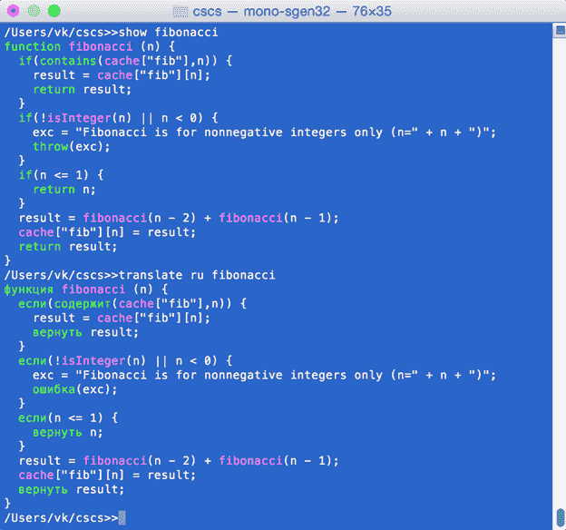

# 七、本地化

在这一章中，我们将看到如何编写 CSCS 程序，以便它们可以本地化为任何人类语言。您将看到我们如何在配置文件中提供关键字翻译，以便不同语言的关键字可以互换使用。不仅如此，我们还将看到如何将一个用人类语言编写的 CSCS 程序翻译成另一种语言。

## 关键词添加翻译

要添加关键字的翻译，我们使用配置文件。可以从 Visual Studio(或 Xamarin Studio)自动创建的那个开始；它通常被称为 **App.config** 。代码清单 68 显示了 CSCS 配置文件的摘录。

代码清单 68:配置文件的摘录

```cs
  <?xml version="1.0" encoding="utf-8" ?>
  <configuration>
    <configSections>
      <section name="Languages" 

  type="System.Configuration.NameValueSectionHandler" />
      <section name="Synonyms"
               type="System.Configuration.NameValueSectionHandler" />
      <section name="Spanish"
               type="System.Configuration.NameValueSectionHandler" />
      <section name="Russian"
               type="System.Configuration.NameValueSectionHandler" />
    </configSections>
    <appSettings>
      <add key="maxLoops" value="100000" />
      <add key="dictionaryPath" value="scripts/" />
      <add key="errorsPath" value="scripts/errors.txt" />
      <add key="language" value="ru" />
    </appSettings>
    <Languages>
      <add key="languages" value="Synonyms,Spanish, Russian" />
    </Languages>
    <Synonyms>
      <add key="copy"     value ="cp" />
      <add key="del"      value ="rm" />
      <add key="dir"      value ="ls" />
      <add key="include"  value ="import" />
      <add key="move"     value ="mv" />
      <add key="print"    value ="writenl" />
      <add key="read"     value ="scan" />
    </Synonyms>
    <Spanish>
      <add key="if"       value ="si" />
      <add key="else"     value ="sino" />
      <add key="for"      value ="para" />
      <add key="while"    value ="mientras" />
      <add key="function" value ="función" />
      <add key="size"     value ="tamaño" />
      <add key="print"    value ="imprimir" />
    </Spanish>
    <Russian>
      <add key="if"       value ="если" />
      <add key="else"     value ="иначе" />
      <add key="for"      value ="для" />
      <add key="while"    value ="пока" />
      <add key="return"   value ="вернуть" />
      <add key="function" value ="функция" />
      <add key="include"  value ="включить" />
      <add key="return"   value ="вернуться" />
    </Russian>
  </configuration>

```

配置文件将关键字翻译成西班牙语和俄语，以及“同义词”它让我们在英语中使用同义词作为关键词。任何同时使用 Windows 和 macOS(或任何其他基于 Unix 的系统)的人都会经常将`dir`与`ls`、`copy`与`cp`以及`grep`与`findstr`混淆。配置文件中的同义词部分允许它们互换使用。

为了使它工作，我们引入了一个新的模块，翻译，以支持所有的本地化概念。对于配置文件中我们要添加的每个关键字(但不一定要添加)，我们称之为 **`Translation.Add`** 静态方法。参见代码清单 69 中 **`Interpreter.ReadConfig`** 和 **`Translation.Add`** 方法的短版本的实现。

代码清单 69:解释器的实现。读取配置和翻译。添加方法

```cs
  void ReadConfig()
  {
    if (ConfigurationManager.GetSection("Languages") == null) {
      return;
    }
    var languagesSection = ConfigurationManager.GetSection("Languages") as

   NameValueCollection;
    if (languagesSection.Count == 0) {
      return;
    }

    string errorsPath = ConfigurationManager.AppSettings["errorsPath"];
    Translation.Language = ConfigurationManager.AppSettings["language"];
    Translation.LoadErrors(errorsPath);

    string dictPath = ConfigurationManager.AppSettings["dictionaryPath"];
    string baseLanguage = Constants.ENGLISH;
    string languages = languagesSection["languages"];
    string[] supportedLanguages = languages.Split(",".ToCharArray());

    foreach(string lang in supportedLanguages) {
      string language = Constants.Language(lang);
      Dictionary<string, string> tr1 = 
          Translation.KeywordsDictionary(baseLanguage, language);
      Dictionary<string, string> tr2 =
          Translation.KeywordsDictionary(language, baseLanguage);

      Translation.TryLoadDictionary(dictPath, baseLanguage, language);
      var languageSection = ConfigurationManager.GetSection(lang) as

   NameValueCollection;

      Translation.Add(languageSection, Constants.IF, tr1, tr2);
      Translation.Add(languageSection, Constants.FOR, tr1, tr2);
      Translation.Add(languageSection, Constants.WHILE, tr1, tr2);
      Translation.Add(languageSection, Constants.BREAK, tr1, tr2);
      Translation.Add(languageSection, Constants.CONTINUE, tr1, tr2);
      // More
  keywords go here...

      // Special dealing for else, catch,
  etc. since they are not separate
      // functions but are part of the if
  and try statement blocks.
      Translation.AddSubstatement(languageSection, Constants.ELSE,

      Constants.ELSE_LIST, tr1, tr2);
      Translation.AddSubstatement(languageSection, Constants.ELSE_IF,

   Constants.ELSE_IF_LIST, tr1, tr2);
      Translation.AddSubstatement(languageSection, Constants.CATCH,

     Constants.CATCH_LIST, tr1, tr2);
    }
  }

  // Incomplete
  definition of the Translation.Add method: 
  public static void Add(NameValueCollection langDictionary, string origName,
         Dictionary<string, string> tr1,
  Dictionary<string, string> tr2)
  {
    ParserFunction origFunction = ParserFunction.GetFunction(origName);
    ParserFunction.RegisterFunction(translation, origFunction);
  }

```

**`Translation.Add`** 方法注册一个函数，之前(已经)向解析器注册了(使用 **`origName`** 字符串变量)，但是使用了一个新名称( **`translation`** )。因此，如果我们得到一个 **`origName`** 令牌，或者一个 **`translation`** 令牌，同样的功能会被调用。

代码清单 70 包含一个在 CSCS 使用西班牙语关键字的例子。那里的 CSCS 代码包含一个大小函数(西班牙语中的“tama no”)。我们还没有展示 size 函数的实现，但它只是返回数组中的元素数量。

代码清单 70:在 CSCS 使用西班牙语关键字的例子

```cs
  números = {"uno", "dos", "tres", "quatro", "cinco", "seis"};
  para (i = 1; i <= tamaño(números); i++) {
    si (i % 2 == 0) {
      imprimir(números[i - 1], " es par");
    } sino {
      imprimir(números[i - 1], " es impar");   
    }
  }

  //
  Output:
  uno
  es impar
  dos
  es par
  tres
  es impar
  quatro
  es par
  cinco
  es impar
  seis
  es par

```

## 主体添加翻译

现在让我们看看如何向解析器添加翻译，以翻译错误消息和 CSCS 关键字以外的单词。完整版本的 **`Translation.Add`** 方法在代码清单 71 中显示了它。

代码清单 71:向解析器添加翻译

```cs
  public class Translation
  {
    private static HashSet<string> s_nativeWords = new HashSet<string>();
    private static HashSet<string> s_tempWords  
  = new HashSet<string>();

    private static Dictionary<string, string>
      s_spellErrors  = new Dictionary<string, string>();
    private static Dictionary<string, Dictionary<string, string>>
      s_keywords     = new Dictionary<string, Dictionary<string, string>>();
    private static Dictionary<string, Dictionary<string, string>>
      s_dictionaries = new Dictionary<string, Dictionary<string, string>>();
    private static Dictionary<string, Dictionary<string, string>>
      s_errors =       new Dictionary<string, Dictionary<string, string>>();

    // The default user language. Can be changed in settings.
    private static string s_language = Constants.ENGLISH;
    public static string Language { set { s_language = value; } }

    public static void Add(NameValueCollection langDictionary,
                           string origName,
                           Dictionary<string, string> translations1,
                           Dictionary<string, string> translations2)
  {
      AddNativeKeyword(origName);

      string translation = langDictionary[origName];
      if (string.IsNullOrWhiteSpace(translation)) {
        // No translation is provided for this function.
        translations1[origName] = origName;
        translations2[origName] = origName;
        return;
      }

  AddNativeKeyword(translation);
      translations1[origName] = translation;
      translations2[translation] = origName;

      if (translation.IndexOfAny((" \t\r\n").ToCharArray()) >= 0) {
        throw new ArgumentException("Translation of [" + translation +
                                    "] contains white spaces");
      }
      ParserFunction origFunction = ParserFunction.GetFunction(origName);
      Utils.CheckNotNull(origName, origFunction);
      ParserFunction.RegisterFunction(translation, origFunction);

      // Also add the translation to the list
  of functions after which
      // there
  can be a space (besides a parenthesis).
      if (Constants.FUNCT_WITH_SPACE.Contains(origName)) {
          Constants.FUNCT_WITH_SPACE.Add(translation);
      }
      if (Constants.FUNCT_WITH_SPACE_ONCE.Contains(origName)) {
          Constants.FUNCT_WITH_SPACE_ONCE.Add(translation);
      }
    }

    public static void AddNativeKeyword(string word) {
      s_nativeWords.Add(word);
      AddSpellError(word);
    }

    public static void AddTempKeyword(string word) {
      s_tempWords.Add(word);
      AddSpellError(word);
    }

    public static void AddSpellError(string word) {
      if (word.Length > 2) {
        s_spellErrors[word.Substring(0, word.Length - 1)] = word;
        s_spellErrors[word.Substring(1)] = word;
      }
    }
  }

```

对于每一对语言，我们都有两个字典，每个字典将单词从一种语言映射到另一种语言。除了关键字，您还可以向配置文件中的任何单词添加翻译。我们跳过加载自定义翻译，但可以在附带的源代码中查阅。

代码清单 72 显示了 **`TranslateFunction`** 的实现，它将任何自定义函数翻译成所提供的语言。

代码清单 72:函数翻译的实现

```cs
  class TranslateFunction : ParserFunction
  {
    protected override Variable Evaluate (ParsingScript script)
    {
      string language = Utils.GetToken(script, Constants.TOKEN_SEPARATION);
      string funcName = Utils.GetToken(script, Constants.TOKEN_SEPARATION);

      ParserFunction function = ParserFunction.GetFunction(funcName);
      CustomFunction custFunc = function as CustomFunction;
      Utils.CheckNotNull(funcName, custFunc);

      string body = Utils.BeautifyScript(custFunc.Body, custFunc.Header);
      string translated = Translation.TranslateScript(body, language);
      Translation.PrintScript(translated);

      return new Variable(translated);
    }
  }

  public class Translation
  {
    public static string TranslateScript(string script, string fromLang,

   string toLang) {
      StringBuilder result = new StringBuilder();
      StringBuilder item = new StringBuilder();

      Dictionary<string, string> keywordsDict =

   KeywordsDictionary(fromLang, toLang);
      Dictionary<string, string> transDict =
                                 TranslationDictionary(fromLang, toLang);
      bool inQuotes = false;

      for (int i = 0; i < script.Length; i++) {
        char ch = script [i];
        inQuotes = ch == Constants.QUOTE ? !inQuotes : inQuotes;

        if (inQuotes) {
          result.Append (ch);
          continue;
        }

        if (!Constants.TOKEN_SEPARATION.Contains(ch)) {
          item.Append(ch);
          continue;
        }

        if (item.Length > 0) {
          string token = item.ToString();
          string translation = string.Empty;
          if (toLang == Constants.ENGLISH) {
            ParserFunction func = ParserFunction.GetFunction(token);
            if (func != null) {
              translation = func.Name;
            }
          }

          if (string.IsNullOrEmpty(translation) &&
              !keywordsDict.TryGetValue(token, out translation) &&
              !transDict.TryGetValue(token, out translation)) {
            translation = token;
          }
          result.Append(translation);
          item.Clear();
        }

        result.Append(ch);
      }

      return result.ToString();
    }
  }

```

图 7 显示了在 CSCS 运行 **`show`** 和 **`translate`** 命令的示例。你可以在那里看到不同的颜色；这是在 **`Translate.PrintScript`** 法中完成的。这就是 **`Variable.IsNative`** 属性的用法:所有“原生”(用 C# 实现)函数都用一种颜色打印，所有其他函数和变量(用 CSCS 实现)都用另一种颜色打印。 **`show`** 函数的实现与 **`translate`** 函数的实现非常相似，如代码清单 72 所示，所以我们也跳过它。



 7:显示和翻译在 CSCS 运行的功能

## 消息的翻译

现在让我们看看如何为错误消息向解析器添加翻译。我们还将添加可能的拼写错误。在这里，我们使用一个简化的版本，其中有一个不正确的或缺失的第一个或最后一个字母的单词。代码清单 73 显示了不同语言的错误消息的加载，以及英语和德语的示例文件。

代码清单 73:加载不同语言的错误消息

```cs
  public class Translation
  {
    public static void LoadErrors(string filename)
    {
      if (!File.Exists(filename)) {
        return;
      }

      Dictionary<string, string> dict = GetDictionary(Constants.ENGLISH,

   s_errors);
      string [] lines = Utils.GetFileLines (filename);
      foreach (string line in lines) {
        string[] tokens = line.Split("=".ToCharArray (),

  StringSplitOptions.RemoveEmptyEntries);
        if (tokens.Length < 1 || tokens[0].StartsWith("#")) {
          continue;
        }
        if (tokens.Length == 1) {
          dict = GetDictionary(tokens[0], s_errors);
          continue;
        }
        dict[tokens[0].Trim()] = tokens[1].Trim();
      }
    }
  }

  // Sample
  contents of the errors.txt file in English and German.
  en
  parseToken        = Couldn't
  parse [{0}] (not registered as a function).
  parseTokenExtra   = Did
  you mean [{0}]?
  errorLine         =
  Line {0}: [{1}]
  errorFile         =
  File: {0}.
  de
  parseToken        =
  [{0}] konnte nicht analysiert werden (nicht als Funktion registriert).
  parseTokenExtra   =
  Meinen Sie [{0}]?
  errorLine         =
  Zeile {0}: [{1}]
  errorFile         =
  Datei: {0}.

```

代码清单 8 使用了 **`Utils.ThrowException`** 函数，该函数以属性文件中配置为用户语言的语言抛出异常。 **`Utils.ThrowException`** 函数的实现在代码清单 74 中。

代码清单 74:Utils 的实现。ThorowException 和 Translation。GetErrorString

```cs
  public class Utils
  {
    public static void ThrowException(ParsingScript script, string excName1,
                           string errorToken = "", string excName2 = "") 
    {
      string msg = Translation.GetErrorString(excName1);

      if (!string.IsNullOrWhiteSpace(errorToken)) {
        msg = string.Format(msg, errorToken);
        string candidate = Translation.TryFindError(errorToken, script);

        if (!string.IsNullOrWhiteSpace(candidate) &&
            !string.IsNullOrWhiteSpace(excName2)) {
          string extra = Translation.GetErrorString(excName2);
          msg += " " + string.Format(extra, candidate);
        }
      }

      if (!string.IsNullOrWhiteSpace(script.Filename)) {
        string fileMsg = Translation.GetErrorString("errorFile");
        msg += Environment.NewLine + string.Format(fileMsg, script.Filename);
      }

      int lineNumber = -1;
      string line = script.GetOriginalLine(out lineNumber);
      if (lineNumber >= 0) {
        string lineMsg = Translation.GetErrorString("errorLine");
        msg += string.IsNullOrWhiteSpace(script.Filename) ?

   Environment.NewLine : " ";
        msg += string.Format(lineMsg, lineNumber + 1, line.Trim());
      }
      throw new ArgumentException(msg);
    }
  }

  public class Translation
  {
    public static string GetErrorString(string key)
    {
      string result = null;
      Dictionary<string, string> dict = GetDictionary(s_language, s_errors);
      if (dict.TryGetValue (key, out result)) {
          return result;
      }
      if (s_language != Constants.ENGLISH) {
        dict = GetDictionary(Constants.ENGLISH, s_errors);
        if (dict.TryGetValue(key, out result)) {
          return result;
        }
      }
      return key;
    }
  }

```

考虑下面的脚本，它在“斐波那契”中有一个错别字(末尾有一个附加的“I”):

`b = 10;`

`c = fibonaccii(b);`

下面是我们的解析器在使用配置为德语的用户语言(参见代码清单 68 中配置文件中的“language”参数)运行该脚本并加载代码清单 73 中所示的 **errors.txt** 文件时打印的内容:

`[fibonaccii] konnte nicht analysiert werden (nicht als Funktion registriert).`

`Meinen Sie [fibonacci]?`

`Zeile 2: [c = fibonaccii(b);]`

您可以实现捕捉更高级的拼写错误，而不仅仅是第一个和最后一个字母的问题，例如，通过在字符串中使用 Levenshtein 距离[【15】](8.html#_ftn15)。

我们如何知道错误发生在哪一行？(“ **Zeile 2** 德语中的意思是“**2 号线**”)。大部分信息已经在 **`char2Line`** 数据结构中，该数据结构是在 **`Utils.CovertToScript`** 方法中加载的(参见代码清单 42)。但是我们仍然需要知道我们在什么线上，只知道当错误发生时我们在脚本的哪个字符处停止。代码清单 75 使用二分搜索法实现了这一点。

我对这种寻找行号的方法并不特别自豪(尽管它很有效)，所以希望你能想出一个更好的主意。

代码清单 75:解析脚本的实现。GetOriginalLineNumber 函数

```cs
  public int GetOriginalLineNumber()
  {
    if (m_char2Line == null || m_char2Line.Count == 0) {
      return -1;
    }

    int pos = m_scriptOffset + m_from;
    List<int> lineStart = m_char2Line.Keys.ToList();
    int lower = 0;
    int index = lower;

    if (pos <= lineStart[lower]) { // First line.
      return m_char2Line[lineStart[lower]];
    }

    int upper = lineStart.Count - 1;
    if (pos >= lineStart[upper]) { // Last line.
      return m_char2Line[lineStart[upper]];
    }

    while (lower <= upper) {
      index = (lower + upper) / 2;
      int guessPos = lineStart[index];

      if (pos == guessPos) {
        break;
      }

      if (pos < guessPos) {
        if (index == 0 || pos > lineStart[index - 1]) {
          break;
        }
        upper = index - 1;
      } else {
        lower = index + 1;
      }
    }

    return m_char2Line[lineStart[index]];
  }

```

在本章中，我们看到了如何使用不同的配置文件用任何语言编写 CSCS 脚本。我们也看到了如何在不同的语言中为编程错误提供错误信息。

在下一章中，我们将讨论测试以及如何从 shell 提示符运行 CSCS。