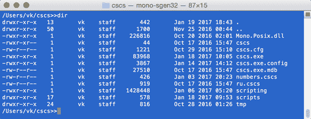
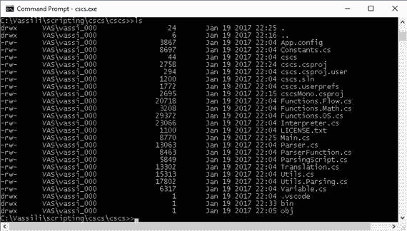

# 八、测试和高级话题

在这一章中，我们最终将讨论测试。当然，测试本身并不能提高软件质量。但是它有助于确保在任何新代码更改后功能仍然正确。

代码清单 76 显示了一个在 CSCS 编写的测试脚本。我自己用它来做不同语言特性的单元测试。

代码清单 76:CSCS 的一个测试函数

```cs
  function test (x, expected)
  {
    if (x == expected) {
      printgreen (x, " as expected. OK");
      return;
    }
    if (type (expected) != "NUMBER") {
      printred ("[", x, "] but expected [", expected, "]. ERROR");
      return;
    }

    epsilon = 0.000001;
    if ((expected == 0 && abs(x) <= epsilon) ||
         abs(x - expected) / expected <= epsilon) {
      printgray (x, " within epsion to ", expected, ". almost OK");
    } else {
      diff = expected - x;
      printred (x, " but expected ", expected, ", diff=", diff, ". ERROR");
    }
  }

```

代码清单 77 显示了我的测试脚本的一个片段。它大量使用代码清单 76 中定义的测试函数。基本上，对于我在 CSCS 引入的任何新特性，我都试图编写至少一个单元测试，非常像代码清单 77 中所示的测试。

代码清单 77:在 CSCS 使用测试函数的测试脚本

```cs
  print ("Testing math operators");
  test (2.0E+15 + 3e+15 - 1.0e15, 4e+15);
  test (cos(pi/2), 0);
  a = 10;
  test ((a++)-(--a)-a--, a - 2 * a - 1);
  test ((a++)-(--a)-a--, a - 2 * a - 1);

  print ("Testing factorial");
  test (factorial(5), 120);

  print ("Testing strings");
  txt = "lu";
  txt += txt + substr (txt, 0, 1) + "_" + 1;
  test (txt, "lulula_1");
  ind = indexof (txt, "_");
  test (ind, 5);

  print ("Testing short circuit evaluation");
  function f (x) {
    counter++;
    return x;
  }
  counter = 0; test (f(0) && f(1), 0); test (counter, 1);
  counter = 0; test (f(1) && f(0), 0); test (counter, 2);
  counter = 0; test (f(1) || f(2), 1); test (counter, 1);
  counter = 0; test (f(0) || f(3), 1); test (counter, 2);

  print ("Testing arrays and maps");
  arr[2] = 10; arr[1] = "str";
  test (type(arr),     "ARRAY");
  test (type(arr [0]), "NONE");
  test (type(arr [1]), "STRING");
  test (type(arr [2]), "NUMBER");

  x["bla"]["blu"]=113;
  test (contains (x["bla"], "blu"), 1);
  test (contains (x["bla"], "bla"), 0);
  x["blabla"]["blablu"]=125;
  test (--x["bla"]["blu"] + x["blabla"]["blablu"]--, 250);

```

图 8 显示了在 Mac 上运行代码清单 77 的结果。

``

 8:运行 CSCS 测试脚本

## 否定

另一个需要单独考虑的情况是布尔表达式的否定。逻辑否定的定义很简单:应用于一个表达式，如果它是真的，它就把它转换成假的，如果它是假的，它就转换成真的。在大多数编程语言中，这种否定由符号`!`或`¬`表示，或者由`NOT`关键字表示。我们将使用感叹号，但是您可以在`Constants`类中随意重新定义它:

`public``const``string`NOT =`"!"`；

我们将布尔否定的实现添加到 **`Parser.Split`** 方法中(如代码清单 4 所示)。参见代码清单 78 中的细节。请注意，我们的实现支持多个否定。比如`!!!a`相当于`!a`。但是`!!a`不一定等同于`a`，因为应用逻辑否定将数字转换为布尔值，在 CSCS 表示为 0 或 1，所以`!!a`将是 0 或 1。

代码清单 78:解析器中布尔否定的实现。分割方法

```cs
  int negated = 0;

  do { // Main processing cycle of the first part.
    string negateSymbol = Utils.IsNotSign(script.Rest);
    if (negateSymbol != null) {
      negated++;
      script.Forward(negateSymbol.Length);
      continue;
    } 
    // Code as before...

    Variable current = func.GetValue(script);

    if (negated > 0 && current.Type == Variable.VarType.NUMBER) {
      // If there has been a NOT sign, this is a Boolean.
      // Use XOR (true if exactly one of the arguments is true).
      bool neg = !((negated % 2 == 0) ^ Convert.ToBoolean(current.Value));
      current = new Variable(Convert.ToDouble(neg));
      negated = 0;
    }
    // Code as before...
  }

  // Implementation
  of the Utils.IsNotSign:
  public static string IsNotSign(string data)
  {
    return data.StartsWith(Constants.NOT) ? Constants.NOT : null;
  }

```

**`Parser.Split`** 方法的完整代码可以在附带的源代码中查阅。它还处理引号(代码清单 4 中的 **`Parser.Split`** 方法的原始版本处理引号内的所有表达式，而不是将它们作为字符串的一部分)。

## 程序

代码清单 79 显示了 Main.cs 的摘录。有两种操作模式——如果您提供了一个文件，将执行包含该文件的整个脚本。这将在 **`Main.ProcessScript`** 方法中完成，与代码清单 40 中的 **`IncludeFile`** 功能非常相似。否则，调用 **`Main.RunLoop`** 方法，该方法将逐个处理输入的命令。

代码清单 79 中显示了 **`Main.RunLoop`** 的摘录，但是这里有比你看到的更多的内容。特别是，如果您按下 Tab 键，有一个自动完成文件或目录名称的功能。这超出了本书的范围，但我们诚挚地邀请您查看随附的源代码。

代码清单 79:摘自 Main.cs

```cs
  static void Main(string[] args)
  {
    Console.OutputEncoding = System.Text.Encoding.UTF8;
    ProcessScript("include(\"scripts/functions.cscs\");");
    string script = null;

    if (args.Length > 0) {
      if (args[0].EndsWith(EXT)) {
        string filename = args[0];
        Console.WriteLine("Reading script from " + filename);
        script = GetFileContents(filename);
      } else {
        script = args[0];
      }
    }

    if (!string.IsNullOrWhiteSpace(script)) {
      ProcessScript(script);
      return;
    }

    RunLoop();
  }

  private static void RunLoop()
  {
    List<string> commands = new List<string>();
    StringBuilder sb = new StringBuilder();
    int cmdPtr = 0;
    int tabFileIndex = 0;
    bool arrowMode = false;
    string start = "", baseCmd = "", startsWith = "", init = "", script;
    string previous = "";

    while (true) {
      sb.Clear();
      script = 
  GetConsoleLine(ref nextCmd, init).Trim();

      if (!script.EndsWith(Constants.END_STATEMENT.ToString())) {
        script += Constants.END_STATEMENT;
      }

      ProcessScript(script);
    }
  }

```

使用 Mono 框架[【16】](#_ftn16)和 Xamarin Studio 社区，[【17】](#_ftn17)你现在可以开发了。Unix 系统上的. NET 应用程序，尤其是在 macOS 上。对于非视窗系统来说，情况变得更加光明。微软于 2016 年收购 Xamarin Inc .后的 NET 开发人员。带有 Mono 框架的 Xamarin 工作室是我以前在 macOS 上移植 CSCS 的地方。代码在 macOS 和 Windows 上基本相同，除非您正在编写 GUI 应用程序。即使是非图形用户界面开发也有一些怪癖，其中一些我们将在本节中看到。

有时我们需要知道正在执行的代码是在 Windows 上还是在另一个平台上。运行时很容易理解——你可以使用 **`Environment.OSVersion`** 属性。但是如果你想知道你的操作系统是什么，你会怎么做。. NET 代码正在编译？您可能想知道，为了在不同的操作系统上编译不同的代码。以前你可以使用 **`#ifdef __MonoCS__`** 宏，但是在最新的 Mono 版本中，这个宏似乎不再被设置了。我所做的如下:我在 Xamarin Studio 中的项目属性中定义了 **`__MonoCS__`** 符号，所以在 macOS 上编译时仍然可以使用。

一旦用 Xamarin Studio 编译了项目，如何从命令行运行它？

代码清单 80 包含一个包装脚本；我叫它 CSCS，所以你可以运行那个脚本。

代码清单 80: cscs 文件:Unix 上的 cscs 启动脚本

```cs
  #!/bin/sh
  /usr/local/bin/mono
  cscs.exe "$@"

```

脚本应该放在与**cscs.exe**文件相同的目录中。它假设 Mono 框架安装在`/usr/local/bin/mono.` 注意，这个脚本将把所有的参数传递给**cscs.exe**。

## 条目

作为不同操作系统上不同 C# 代码的一个例子，让我们看看目录列表函数。目录列表在 Windows 上俗称 **`dir`** ，在 Unix 上俗称 **`ls`** 。

文件系统和用户权限在 Windows 和 Unix 上的实现方式不同。例如，在 Unix 上有一个用户、用户所属组的用户以及所有其他用户的概念。这些实体中的每一个都具有对文件或目录的读、写和执行权限的组合(例如，写权限并不自动意味着读权限)。你不能把这样的概念一一翻译成 Windows。

我们可以有两个函数名， **`ls`** 和 **`dir`** ，指向同一个实现函数(代码清单 68 展示了如何做到这一点)。代码清单 81 实现了获取文件或目录的详细信息。我们在循环中为每个目录条目调用这个函数。对于好奇的读者:我们在这里实现的是 **`ls –la`** Unix 命令，而不仅仅是 **`ls`** 。

代码清单 81:Utils 的实现。获取路径详细信息

```cs
  public static string GetPathDetails(FileSystemInfo fs, string name)
  {
    string pathname = fs.FullName;
    bool isDir = (fs.Attributes & FileAttributes.Directory) != 0;
    char d = isDir ? 'd' : '-';

    string last  = fs.LastWriteTime.ToString("MMM dd yyyy HH:mm");
    string user = string.Empty;
    string group = string.Empty;
    string links = null;
    string permissions = "rwx";
    long size = 0;

    #if __MonoCS__
      Mono.Unix.UnixFileSystemInfo info;
      if (isDir) {
        info = new Mono.Unix.UnixDirectoryInfo(pathname);
      } else {
        info = new Mono.Unix.UnixFileInfo(pathname);
      }
      char ur = (info.FileAccessPermissions &
           Mono.Unix.FileAccessPermissions.UserRead)     != 0 ? 'r' : '-';
      char uw = (info.FileAccessPermissions &
           Mono.Unix.FileAccessPermissions.UserWrite)    != 0 ? 'w' : '-';
      char ux = (info.FileAccessPermissions &
           Mono.Unix.FileAccessPermissions.UserExecute)  != 0 ? 'x' : '-';
      char gr = (info.FileAccessPermissions &
           Mono.Unix.FileAccessPermissions.GroupRead)    != 0 ? 'r' : '-';
      char gw = (info.FileAccessPermissions &
           Mono.Unix.FileAccessPermissions.GroupWrite)   != 0 ? 'w' : '-';
      char gx = (info.FileAccessPermissions &
           Mono.Unix.FileAccessPermissions.GroupExecute) != 0 ? 'x' : '-';
      char or = (info.FileAccessPermissions &
           Mono.Unix.FileAccessPermissions.OtherRead)    != 0 ? 'r' : '-';
      char ow = (info.FileAccessPermissions &
           Mono.Unix.FileAccessPermissions.OtherWrite)   != 0 ? 'w' : '-';
      char ox = (info.FileAccessPermissions &

  Mono.Unix.FileAccessPermissions.OtherExecute) != 0 ? 'x' : '-';

      permissions = string.Format("{0}{1}{2}{3}{4}{5}{6}{7}{8}",
          ur, uw, ux, gr, gw, gx, or, ow, ox);

      user  = info.OwnerUser.UserName;
      group = info.OwnerGroup.GroupName;
      links = info.LinkCount.ToString();

      size = info.Length;

      if (info.IsSymbolicLink) {
        d = 's';
      }
    #else
      if (isDir) {
        user = Directory.GetAccessControl(fs.FullName).GetOwner(
          typeof(System.Security.Principal.NTAccount)).ToString();
        DirectoryInfo di = fs as DirectoryInfo;
        size = di.GetFileSystemInfos().Length;
      } else {
        user = File.GetAccessControl(fs.FullName).GetOwner(
          typeof(System.Security.Principal.NTAccount)).ToString();
        FileInfo fi = fs as FileInfo;
        size = fi.Length;

        string[] execs = new string[] { "exe", "bat", "msi"};
        char x = execs.Contains(fi.Extension.ToLower()) ? 'x' : '-';
        char w = !fi.IsReadOnly ? 'w' : '-';
        permissions = string.Format("r{0}{1}", w, x);
      }
    #endif

    string data = string.Format("{0}{1} {2,4} {3,8} {4,8} {5,9} {6,23} {7}",

   d, permissions, links, user, group, size, last, name);
    return data;
  }

```

要使用 Unix 特定的功能，您必须参考 Mono.Posix.dll 图书馆。解决方案之一是有两个项目配置文件——一个带有 **`__MonoCS__`** 符号和 Mono.Posix.dll 库引用(在 Unix 系统上使用)，另一个没有它们，在 Windows 上使用。您可能想看看我是如何在附带的源代码中做到这一点的。



 9:在苹果电脑上运行目录命令



 10:在 Windows 上运行 ls (dir)命令

图 9 显示了在 macOS 上运行的 CSCS 代码，图 10 显示了在 Windows 上运行的 CSCS 代码。如您所见，结果取决于平台。

类似于上一节中开发的目录列表命令，可以实现许多其他命令。代码清单 82 显示了一个清除控制台的命令的实现。它还具有向解析器注册该命令并允许在配置文件中翻译该命令的必要步骤。

代码清单 ClearConsole 类的实现

```cs
  // 1.
  Definition in Constants class.
  public const string CONSOLE_CLR = "clr";

  // 2.
  Registration with the parser in Interpreter.Init().
  ParserFunction.RegisterFunction(Constants.CONSOLE_CLR, new ClearConsole());

  // 3.
  Registration for keyword translations in Interpreter.ReadConfig().
  Translation.Add(languageSection, Constants.CONSOLE_CLR, tr1, tr2);

  // 4\. Implementation
  of a class deriving from the ParserFunction class.
  class ClearConsole : ParserFunction
  {
    protected override Variable Evaluate(ParsingScript script)
    {
      Console.Clear();
      return Variable.EmptyInstance;
    }
  }

```

同样，我们可以实现更多的命令。我建议您参考源代码区域，在这里您可以找到以下命令提示符命令的实现:复制、移动和删除文件、更改目录、启动和终止进程、列出正在运行的进程、搜索文件等。

现在您有了一个工具，可以用它来创建自己的编程语言。为了扩展语言，您只需添加自己的函数，类似于代码清单 82。

为了继续探索这个主题，我建议下载附带的源代码并开始玩它:添加一些功能，从非常简单的功能开始(比如将特定的消息打印到文件中)。然后你可以逐渐增加复杂性，走向函数式语言。例如，您可以实现一个可以从 CSCS 读取和操作大型 Excel 文件的函数。[这里有一个例子](https://msdn.microsoft.com/en-us/library/office/gg575571.aspx)说明如何用 C# 实现。

我非常期待您对可以改进的地方和您在 CSCS 实施的功能的反馈！

[1]参见[https://www.wired.com/2010/10/1014cplusplus-released/](https://www.wired.com/2010/10/1014cplusplus-released/)

[见](http://en.wikipedia.org/wiki/Compiler)[http://en . Wikipedia . org/wiki/compiler](http://en.wikipedia.org/wiki/Compiler)

[【3】](1.html#_ftnref3)参见

[【4】](1.html#_ftnref4)见[http://en.wikipedia.org/wiki/Lexical_analysis](http://en.wikipedia.org/wiki/Lexical_analysis)

[【5】](1.html#_ftnref5)参见[http://en.wikipedia.org/wiki/Parsing-计算机语言](http://en.wikipedia.org/wiki/Parsing#Computer_languages)

[【6】](1.html#_ftnref6)见 https://en . Wikipedia . org/wiki/canonical _ lr _ parser

[【7】](1.html#_ftnref7)见 http://qntm.org/top《自上而下和自下而上解析的区别》

[【8】](1.html#_ftnref8)见 http://en.wikipedia.org/wiki/Top-down_parsing

[【9】](1.html#_ftnref9)见 http://en.wikipedia.org/wiki/Context-free_grammar

[【10】](1.html#_ftnref10)见 http://en . Wikipedia . org/wiki/antlr

[【11】](2.html#_ftnref11)见 http://msdn.microsoft.com/en-us/magazine/mt573716.aspx

[【12】](2.html#_ftnref12)见 http://accu.org/index.php/journals/2252

[【13】](2.html#_ftnref13)见 http://www.codemag.com/Article/1607081

[【14】](2.html#_ftnref14)詹姆斯·科普林，*高级 C++编程风格和习惯用法*(第 140 页)，爱迪生-韦斯利，1992。

[【15】](7.html#_ftnref15)见 https://en . Wikipedia . org/wiki/levensstein _ distance

[[16]](#_ftnref16) Mono 框架是的开源多平台实现。Net 框架。看 http://www.mono-project.com

[【17】](#_ftnref17)Xamarin Studio Community 是一个免费的 IDE，可以使用 Mono Framework 在 Mac 上开发 C# 应用程序。看 https://www.xamarin.com/download