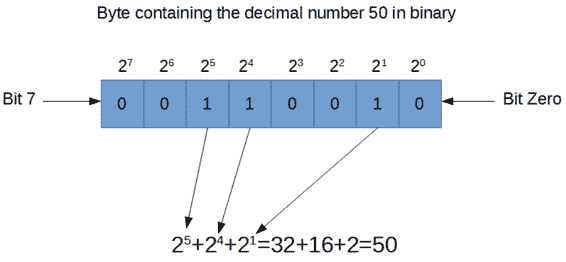
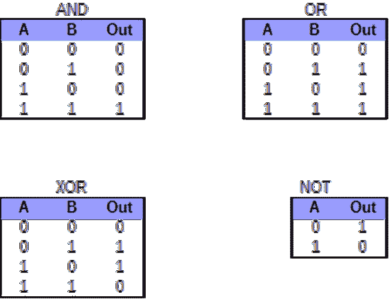

# 六、运算符和表达式

计算机可以极快地对数字进行加减乘除运算。但是基本的数字运算只是计算机擅长的计算类型之一。在本节中，我们将了解通过使用运算符和表达式来计算结果和其他变量值的各种方法。

我们还将研究计算机执行算术的方式和算术在数学中的工作方式之间的一些非常重要的区别。

## 运算符和操作数

运算符是用于指示一个或两个操作数之间的某些特定动作的符号(在 Java 中，运算符都取一个或两个操作数)。算术运算符是加法、减法、乘法和除法等操作。每个运算符都有一个特定的符号，例如用于加法的“+”和用于乘法的“*”。

操作数是运算符的参数或数据。每个运算符都需要一些预定义数量的操作数。例如，加法需要两个数字，如 5+6。操作数可以是变量、对象或文字(具体取决于运算符是什么)。操作数指定运算符操作的数据。JVM 读取操作数和运算符，它根据运算符的规范执行一些位操作，这导致一些值——例如，5+6 导致值 11。

运算符和操作数用括号“(”和“)”组合在一起形成表达式。表达式类似于基本算术，但是在 Java 中，我们比基本算术有更多的灵活性。我们可以形成算术、逻辑、布尔和字符串表达式。

每个运算符都有一个预定义的优先级，该优先级规定了运算符在表达式中组合时的执行顺序，括号用于覆盖运算符的正常优先级规则。

我们在算术和 Java 编程中使用的通用系统叫做中缀符号。在这个系统中，具有较高优先级的操作符首先被执行，然后是具有较低优先级的操作符。例如，4+5*3 是等于 19 的表达式。乘法运算符的优先级高于加法运算符的优先级，因此我们首先执行 5*3，然后将 4 相加，结果是 19。在中缀符号中，无论运算符的优先级如何，任何被括号括起来的操作都会首先发生。因此，我们可以编写(4+5)*3，它具有与之前相同的运算符，但是由于括号，首先执行 4+5，最终结果是 27。

## 算术运算符

表 2:算术运算符

| 名字 | 标志 | 操作数 | 优先 |
| --- | --- | --- | --- |
| 添加 | + | Two | one |
| 减法 | - | Two | one |
| 后缀增量 | i++ | one | one |
| 后缀减量 | 异 | one | one |
| 增加 | * | Two | Two |
| 分开 | / | Two | Two |
| 系数 | % | Two | Two |
| 一元负数 | ［构成来自拉丁语、结尾为-us 的名词的复数］ | one | three |
| 一元正 | +i | one | three |
| 前缀增量 | ++i | one | four |
| 前缀减量 | ［构成来自拉丁语、结尾为-us 的名词的复数］ | one | four |

表 2 显示了 Java 中可用的算术运算符。许多人会从常规算术中熟悉，但有些人需要更多的解释。首先，我为在某个位置需要变量的操作符添加了一个伪变量名 I(例如，Postfix decade 在变量 I 的右边使用了两个减号，比如:i -)。

表 2 还显示了算术运算符的相对优先级。这不是编译器在解析表达式时使用的真正优先级，而只是相对优先级，这样您就可以知道哪些操作将首先发生。您应该始终使用括号来直接指定复杂表达式中的操作顺序。

加法、减法、乘法和除法的表现方式与它们的算术对应物相似。但是 Java 的运算符和它们的算术计数器部分之间有一个重要的区别——所有的 Java 算术都是有限的。这就引出了在整数算术和舍入误差部分中描述的一些要点。

后缀和前缀增量和减量各只接受一个参数。递增等于加一，递减等于减一。这些运算符只能用于变量，不能递增文本。运算符将变量的值加 1 和减 1，并相应地设置变量(它们实际上是赋值运算符，但通常与算术运算符一起引入。).例如，如果 j 是一个以 5 为值的整数，那么 j++将使 j 变成 6。后缀和前缀增量仅在优先级上不同。后缀增量出现在其他操作之前，因为它具有高优先级，前缀增量出现在之后，因为它具有低优先级。代码清单 6.0 说明了后缀和前缀之间的区别。

代码清单 6.0:后缀与前缀增量

```java
  int j = 10;
  int b = ++j; // j increment to 11.
                     // b is set to 11.

  int p = 10;
  int g = p++; // b is set to 10.
                     // p increments to 11.

```

一元负数和一元正数不同于它们的标准数学定义。在本文中，一元简单地表示“单个操作数”，二元表示“两个操作数”一元负数是在单个数字或变量旁边使用的减号，例如-9。在正规数学中，一元负数-7 和二元负数 5-6 的优先顺序没有明确的区别，可以解读为 5+-6 的简写。在编程语言中，两者通常用一元版本比二进制版本具有更高的优先级来实现。这是因为像 Java 这样的编程语言有负数的概念，而不是应用具有某些预定义优先级的负运算符。当编译器读取-7 时，它不会取 7 并将其从 0 中减去。它将该值读取为负整数。

还值得一提的是模数运算符:%。模数返回除法后的余数。例如，67%5 等于 2，因为我们用 67 除以 5 时剩下 2。模数是一个非常重要的算子。如果一个变量 j 可以被另一个 k 整除，那么 j%k=0。也就是说，如果 j 除 k，那么 j%k 就不留余数。

代码清单 6.1 展示了一些使用算术运算符的表达式示例。在执行这些行时，我加入了描述变量值的注释。

代码清单 6.1:算术运算符

```java
  public  class MainClass {
        public  static  void main(String[] args) {
               int j = 190;       // j gets 190
               j++;                      // j gets 191
               j = j - 89;               // j gets 102
               int b = 78 * j;           // b gets 7956
               int c = b + (9*j) / 12;   // c gets 8032
               b--;                      // b gets 7955
               c = c % b + (j / 2);    // c gets 128
               c = --b;                  // c and b get 7954
               int h = (j + b) % 210;  // h gets 76
        }
  }

```

### 整数运算:溢出

在 Java 中，整数的大小不是无限的。当结果在数量上太大而无法放入指定的变量时，它们会绕回。这是计算机使用的算术和现实世界的数学之间非常重要的区别。如果我们不小心，会导致一些奇怪的结果。

代码清单 6.2:溢出示例

```java
  public class MainClass {
        public static void main(String[] args) {

               // Causing overflow of
  a byte:
               byte myByte = 127;
               myByte++; // Results in -128
               System.out.println("Byte says 127+1=" + myByte);
               myByte = -128;
               myByte--; // Results in 127
               System.out.println("Byte says -128-1=" + myByte);

               // Causing overflow of
  a short. 
               short myShort = 32767;    // This is the maximum
  for short!
               System.out.println("Short is " + myShort + " before ++.");
               myShort++;
               System.out.println("Short is " + myShort + " after ++.");
               myShort--;
               System.out.println("Short is " + myShort + " after --.");
        }
  }

```

在代码清单 6.2 中，我们将变量 myByte 设置为 127，这是一个字节可以容纳的最大正值。在下一行中，我们使用++运算符来增加变量。将变量设置为 127 通常会得到答案 128。但是值 128 超出了字节范围，即从-128 到 127。因此，结果实际上会绕回，我们得到的是 127+1=-128。除非我们敏锐地意识到这种环绕行为，否则当我们计算正整数时，它会很快导致代码中出现错误，并突然弹出具有非常大负值的另一面。

类似地，在下一行，我们将 myByte 的值设置为-128，然后尝试从这个变量中减去 1。同样，结果通常为-129，但-129 不在字节范围内，结果将绕回正 127。

代码清单 6.2 的输出如下:

字节表示 127+1=-128

字节表示-128-1=127

在++之前 Short 是 32767。

c++后的 Short 是-32768。

做空是 32767 之后-。

字节和短字节的范围非常有限，这种溢出很容易说明。但是我们必须记住，当我们使用任何整数类型，甚至是长整型时，都会出现这种情况。int 的范围远大于字节，但它不是无限的。

### 整数运算:截断

除了溢出之外，在存储之前，两个整数的除法总是将结果四舍五入为零。起初这似乎是一个糟糕的选择，但这是一种比常规舍入(即舍入到最接近的整数)更有用的算术方法。基本的舍入规则是砍掉小数点右边的任意位数，也就是说 6.7 变成 6，89.23678 变成 89，-2773.223 变成-2773。这是一种称为截断的舍入。

代码清单 6.3:整数舍入

```java
  int a = 24/5;       // Results in 4
  int b = -24/5;      // Results in -4

```

代码清单 6.3 展示了 24 和-24 除以 5。在第一行，我们将 24 除以 5，并将结果存储在变量 a 中。24/5 的结果实际上是 4.8——或者 4 和 4/5。但是因为整数是整数，所以 4/5 被丢弃了。请注意，4.8 不是向上舍入到 5，而是向 0 舍入。小数点右边的数字被简单地砍掉了。

同样，在代码清单 6.3 的第二行，我们看到-24 除以 5 的结果是-4。通常，结果会是-4.8，但是整数只能存储整数，小数点左边的数字会被截断。

截断在划分整数时特别有用，因为我们有模数运算符可以与除法结合使用。如果我们想确切地知道 24/5 是什么，我们就不能使用浮点数，因为(我们稍后会看到)浮点数只能准确地表示少数有理数，4.8 不是其中之一。但是我们可以用除法和模数来创造分数。代码清单 6.4 展示了一个简短的例子，说明我们如何维护整数除法的精确结果。

代码清单 6.4:整数算术和分数

```java
  public  class MainClass {
        public  static  void main(String[] args) {
               int numerator = 24;
               int denominator = 5;

               int wholeResult = numerator / denominator;
               int fractionalResult = numerator % denominator;

               System.out.println("The result is
  " + wholeResult + " and " +
                     fractionalResult + "/" + denominator);
        }
  }

```

### 浮点运算:舍入误差

浮点变量(双精度和浮点)似乎是无限的，因为它们的范围非常大，而且它们似乎可以表示非常精确的小数值。但是浮点变量和整数一样有限，而且，和整数一样，您应该注意关于浮点运算的几个注意事项。使用浮点运算时要记住的最重要的事情是——对浮点值执行的操作越多，结果中的错误就越多。

浮点变量只能存储一组特定的理性结果。我们可能假设任何实数都可以存储在浮点数或双精度浮点数中，但这不是真的。浮点数或双精度浮点数唯一能存储的数字是二的完美幂和零(0.0)。诸如 256、或 4096.1875 之类的数字都是完美存储的，浮点变量中没有舍入。其他看似简单的数字，如 1/5 或 0.3333…，被四舍五入到接近其真实值。这意味着我们用 1/5 和 1/3 这样的数字计算的次数越多，最终结果引入的误差就越大。

还要记住，浮点变量(浮点和双精度)在精度上受到另一种方式的限制。浮点数越高，我们计算精确结果的精度就越低。最多六位数的整数都用浮点数精确表示，如 18.0f、27837.0 等。但是超过六位数，只有每秒的整数才有一个可表示的值。浮点使用一种称为 IEEE 754([https://en.wikipedia.org/wiki/IEEE_floating_point](https://en.wikipedia.org/wiki/IEEE_floating_point))的规范，该规范将精度与范围进行交换。所有整数都精确地表示一个数字，但是在浮点变量的高位有间隙，一些整数不能存储。

所有这些都意味着，我们对浮点变量执行的每一次计算都有可能引入和/或放大舍入误差。浮点变量通常只存储实数的近似值——它们几乎从不精确存储分数。

代码清单 6.5:浮点运算中的舍入误差

```java
  public  class MainClass {
        public  static  void main(String[] args) {
               float j = 901.0f/13.0f;
               float q = (53.0f / 13.0f)*17.0f;

               System.out.println("J: " + j + " Q:" + q);

               if(j != q)
                     System.out.println("The two are not
  equal!");
        }
  }

```

代码清单 6.5 展示了使用浮点数计算 901/13 的两种方法。清单中使用了 if 语句，我们将在查看控制结构时讨论它。这里的重点是，两个浮点数 j 和 q 理论上应该有完全相同的值。通过一些基本的算术运算，我们可以从用于设置 j 和 q 的表达式中计算出相同的答案:

901/13 = 69 和 4/13

(53/13)*17 = 69 和 4/13

然而，没有办法将 4/13 表示为两次幂的有限和，因此当使用浮点数时，计算机将在上述两种计算中引入一些舍入误差。这意味着这两个表达式在 Java 中不会得到完全相同的答案，“两者不完全相等！”将被打印到控制台。第二个结果可能不如第一个结果准确，因为它使用了更多的操作，但两个结果都不正确。当我们比较浮点数时，记住这一点非常重要，因为这意味着我们经常需要一些小程度的误差。

代码清单 6.6:比较浮动和错误

```java

public  class MainClass {
        public static void main(String[] args) {
               float j = 901.0f/13.0f;
               float q = (53.0f / 13.0f)*17.0f;

               System.out.println("J: " + j + " Q:" + q);

               if(Math.abs(j - q) > 0.001f)
                     System.out.println("The two are not
  equal!");
        }
  }

```

代码清单 6.6 说明了使用 Math.abs 方法允许两个浮点结果之间有很小的误差。如果两个浮点值之间的差值小于 0.001，我们假设它们“试图”表示相同的结果。Math.abs 函数接受单个数字参数并返回绝对值(即如果参数为正，则返回不变，如果为负，则改为正)。

|  | 提示:如果您需要执行一个常见的数学函数，很有可能该函数包含在 Java 的 Math 库中。代码清单 6.6 展示了如何从数学库中调用一个函数，方法是调用 Math.abs 并在括号中传递一个参数。数学库包含三角函数，如数学正弦和数学余弦、对数函数、最小值、最大值和许多其他函数。它还包含非常精确的常数，如数学。π，是π值的双常数，和数学。e，这是 e 值的另一个双常数。 |

## 赋值运算符

赋值运算符用于改变或设置变量的值。最常见的赋值运算符是赋值运算符本身，在 Java 中用一个等号“=”表示。这与双等号“==”非常不同，双等号是一个条件运算符，询问两个值是否相等。如果我们想将一个名为 someVariable 的变量设置为整数 78，我们可以使用“someVariable = 78”。

在 equals 运算符之后，剩余的赋值运算符(+=，-=，/=，*=，%=，&=，！、=、和^=)是为了方便而提供的。它们有时被称为复合赋值运算符，是一种特别常见的表达式的简写形式。当我们有一个变量时，我们经常需要对它执行一些操作，并将结果值存储回同一个变量中。这在数学上没有意义，但在编程语言中这是完全正常的。下面是一个复合赋值运算符的示例:

var1+= 1；

上述陈述扩展到以下意思:

var1 = var1+1；

所以，变量 Var1 的值加了 1。如果 Var1 以值 25 开始，则在这一行代码执行后，它将被设置为 26。只有当操作特定于每个运算符时，其他赋值运算符才是相似的。不是相加，-=从变量中减去，^=执行按位异或等操作。代码清单 6.7 展示了复合赋值运算符的一些例子。

代码清单 6.7:复合运算符

```java
  Var1 -= 7; // Means
  Var1 = Var1 – 7;
  Var1 ^= 7; // Means
  Var1 = Var1 ^ 7;
  Var1 /= 7; // Means Var1 = Var1 /
  7;

```

我们将查看这些运算符的每个未修饰版本的确切含义(即^，与赋值版本^=).相反我们也可以在表达式中使用复合赋值运算符:

Var1 += 5 + (2* Var2)的值：

上面一行代码将扩展到 Var1 = Var1+5+(2 * Var2)；。如果 Var1 是 10，Var2 是 5，那么 Var1 将变成 10+5+(2*5)或 25。

## 绕行:二进制数

在我们看按位运算符之前，我们将绕一小段路，看看计算机存储整数的方式。计算机对 0 和 1 的集合进行所有计算。计算机中最小的内存量是一个可以设置为 0 或 1 的位，它构成二进制中的一个位数。变量，如 int 和 byte(甚至 double 和 float)是由二进制位的集合组成的。



图 40:包含 50 的字节

图 40 显示了一个包含十进制整数 50 的字节。这些位是蓝色框，每个位设置为 1 或 0(蓝色框内的值)。每个位都有一个索引。左边的位 7 是最高有效位，右边的位 0 是最低有效位。这和小数完全一样——如果我们有一个小数，比如 345，左边的 3 比右边的 5 更有意义。

为了计算出一个二进制数的精确数值，你必须将二进制数中对应于 1 的每 2 次幂相加。在图 40 中，一个 1 在 2 <sup class="calibre66">5</sup> 位置，另一个在 2 <sup class="calibre66">4</sup> 位置，另一个在 2 <sup class="calibre66">1</sup> 位置。因此，该位序列表示 50，这是两个幂相加的结果:2<sup class="calibre66">5</sup>+2<sup class="calibre66">4</sup>+2<sup class="calibre66">1</sup>= 50。请注意，这在十进制中是相同的，除了十进制的幂的基数是 10 而不是 2。

负数比正数稍微复杂一些。Java 使用二进制补码(2 的补码)。这意味着如果最左边的位设置为 1，则该数字为负。但是负数的值是按位补码加 1，例如，一个字节中的位序列 10000011 通常是 2<sup class="calibre66">7</sup>+2<sup class="calibre66">1</sup>+2<sup class="calibre66">0</sup>，但是因为位 7 是一个字节中的符号位，并且因为它被设置为 1，所以这个序列表示的实际值是补码+1。补码是相同的字符串，每一位都翻转(参见下面的~运算符)。因此，10000011 实际上意味着 01111100+1=01111101，或者十进制中的-125。因此，每个整数数据类型中最左边的位称为符号位。对于字节，这个最左边的位是位 7，简而言之，它是位 15。在 int 中，它是位 31，在 long 中，它是位 63。

## 按位运算符

Java 中的几个操作符被设计用来直接操作变量的位。这些运算符通常组合在一起，称为按位运算符。按位运算符借用了一种叫做布尔代数的逻辑数学(这也是我们得到真/假变量的关键字“布尔”和我们将很快看到的布尔运算符的地方)。

布尔代数由变量和运算符组成，就像在常规代数中一样，我们也可以使用括号来覆盖运算符的正常优先级。在布尔代数中，变量只能是真或假，1 或 0——没有其他值。在许多方面，布尔代数比常规算术简单得多，但人们很容易低估这套看似简单的逻辑规则的力量。布尔代数可以用来计算任何可计算的东西。事实上，现代计算机只不过是数十亿个晶体管，它们连接在一起，执行基本的布尔代数。

布尔代数中只有三种基本运算符——“与”、“或”和“非”。除了这三种，大多数编程语言还提供第四种运算符——异或，它是异或的简称。

在 Java 中，我们使用符号&表示布尔 AND，|表示布尔 or，~表示布尔 NOT(或按位补码)，^表示 XOR。



图 41:布尔运算符的真值表

图 41 显示了 Java 中四个按位运算符的真值表。这些表也是布尔运算符的真值表，我们将很快看到。真值表列出了可能的输入状态，并且在每个状态旁边列出了操作符返回的结果。

例如，如果我们有 and 运算符，并且我们的两个输入(A 和 B)被设置为 1 和 0，我们可以沿着 AND 真值表的第三行(对应于 A 为 1，B 为 0)进行读取，并看到 Out 列显示 0。这意味着 1 和 0=0。同样，如果我们需要知道当 a 为 0，b 为 1 时 A^B 是什么，我们可以沿着 XOR 真值表的第二行查看，结果将返回 1。

在真正的布尔代数中，运算只需要一位操作数，因此我们可以从“真与假”或“假或假”计算结果然而，计算机通常不在单个位上运行，因为这会太慢。相反，计算机将位组合成字符串，形成字节、短整型、整型等。Java 中的一个字节有八位宽。这意味着从 00000000 到 11111111 的任何二进制值都适合一个字节的八位。当我们在两个变量之间执行按位运算时，我们实际上执行了八次相同的布尔运算——在两个变量的每个对应位之间执行一次。

例如，假设我们有两个字节变量，a 和 b，分别设置为 203(假设该字节是无符号的，尽管通常使用 2 的补码将其读取为负数)和 166。在二进制中，数字 203 和 166 由位模式 11001011 和 10100110 表示。如果我们在这些变量之间执行按位运算，并将结果存储在第三个变量 c 中，代码清单 6.8 显示了将会发生什么。

代码清单 6.8:位操作

```java
  c = a & b;   // c will be set to 10000010
  c = a | b;   // c will be set to 11101111
  c = a ^ b;   // c will be set to 01101101

```

请注意，无论正在执行什么操作(&、|、或^)，结果 c 值右侧的第一位都是在两个输入操作数的最右侧位之间执行的操作的结果。最后一个例子是，如果我们对 a 变量执行按位补码，我们只需将所有 1 翻转为 0，将所有 0 翻转为 1:

c = ~ a；// c 将设置为 00110100，这是 a 的补码

### 移位运算符

除了基于布尔代数的按位运算，我们还可以在 Java 中执行移位。移位被认为是按位运算符，因为它们让我们可以直接访问变量的位。Java 中有三种换挡方式——左移(操作符符号为<>)，右移零填(操作符为> > >)。

移位操作各取两个操作数。它们将第一个操作数中的位向左或向右移动(取决于运算符)第二个操作数中指定的量。例如，对于一个名为 a 的变量，我们可以使用以下语句将位向右移动一个空格:a = a < < 1；。

将整数的位向左移动的效果与将整数的值乘以相应的 2 的幂相同。例如，如果我们取位模式三，并将其存储在一个名为 a:

a = 3 < < 4；//3 乘以 2 的 4 次方，或者 16 次方，a 将变成 00110000。

同样，将一个变量向右移动一定量，就等于将该变量除以 2 的幂:

a = 48 > > 4；//48 除以 2 的 4 次方，或者 16 次方，a 将变成 00000011。

对于计算机来说，移位比除法和乘法容易得多，所以它被用来优化代码(即使其运行得更快)。

当我们向右移动时，当比特从右边移出时，新的比特必须从左边进入。当使用常规右移(>>)时，左边输入的位将是符号位的副本(即最左边的位将被保留)。这使我们能够使用上述移位技术来划分负数，并保持否定答案。而右移和零填充运算符(>>>)将在左侧移入 0。当我们不希望 Java 将我们的数字视为有符号时，右移和零填充运算符非常有用。

## 关系运算符

关系运算符允许我们将数值变量的值与其他变量或文字值进行比较。例如，我们可以测试整数变量 A 的值是否小于 100。或者我们可以测试变量 B 和 C 是否等于语句 B==C。

关系运算符各取两个操作数。它们比较操作数并返回真或假的布尔结果。关系运算符最常用于条件语句，如 if 语句和循环(将在“控制结构”一章中介绍)。我们可以使用逻辑运算符将许多带有参数的关系运算符串在一起，形成复杂的表达式(有关逻辑运算符的描述，请参见下一节)。

表 3:关系运算符

| 操作员 | 名字 | 例子 |
| == | 等于 | a = = B；//A 等于 B 吗？ |
| ！= | 不等于 | a！= B；//A 和 B 不同吗？ |
| < | 不到 | a < B；//A 小于 B 吗？ |
| > | 大于 | 甲>乙；//A 是否大于 B？ |
| <= | 小于或等于 | a < = B；//A 小于等于 B 吗？ |
| >= | 大于或等于 | a > = B；//A 是否大于或等于 B？ |

表 3 显示了 Java 中可用的关系运算符。请注意，双等号==，是运算符的关系等号。它询问两个变量是否具有相同的值。而单个等号(=)是赋值运算符。它将第一个操作数的值设置为第二个操作数的值。代码清单 6.9 展示了一些例子，说明我们如何根据逻辑运算的结果设置布尔变量。当我们在控制结构中使用关系运算符时，它们通常不设置布尔值，但是当结果评估为真时，它们会执行代码块。

代码清单 6.9:关系运算符示例

```java
  int var1 = 100, var2 = 30;
  boolean ans1 = var1 == var2; //
  ans1 becomes false, 100 does not equal 30
  boolean ans2 = var1 > var2; //
  ans2 becomes true, 100 is greater than 30
  boolean ans3 = var2 <= var1; //
  ans3 becomes true, 30 is less than or equal to 100
  boolean ans4 = var2 != var1; //
  ans4 becomes true, 30 is not equal 100

  int v1 = 100, v2 = 30, v3 = 200;
  boolean ans1 = (v1 < v2) || (v3
  > v1); // Using logical OR

```

## 逻辑运算符

逻辑运算符(有时称为布尔运算符)处理布尔参数。它们用于形成逻辑语句。每个逻辑运算符都有两个操作数，并且两个操作数都是布尔型的。我们通常将逻辑运算符与 if 语句、循环和其他需要条件的情况结合使用。

三个逻辑运算符是 AND，用符号&&表示；或，用符号| |；而 NOT，用感叹号表示！。逻辑运算符用于将多个简单的布尔条件串在一起，以创建更复杂的表达式。每个逻辑运算符的工作方式与我们在按位运算符中看到的“与”、“或”和“非”的布尔真值表完全相同。逻辑运算符和按位运算符之间的唯一区别是，逻辑运算符严格意义上是布尔参数，而按位运算符设计用于 int 的所有 32 位或 long 的所有 64 位等。

作为我们如何使用逻辑运算符的一个简单例子，假设我们有一个希望在程序中建模的环境。我们控制着一扇车库门。门可以打开或关闭。晚上，为了帮助防止窃贼，门应该关上，但是如果下雨，门应该关上，这样雨水就不会进入车库。

您可以用几个变量对上面的系统建模:布尔 doorClosed，boolean nightTime，还有布尔潇潇；。

为了确定门是否应该关闭，我们可以说类似 doorOpen = nightTime | | raining。

这意味着变量 doorClosed 应该被设置为在变量 night 和 raining 之间执行 OR 的逻辑结果。如果是夜间，夜间变量将为 1，否则为假。如果下雨，那么 raining 变量将设置为 1，否则为假。

我们可以添加另一个条件。我们可以说，当晚上的时候，除非灯亮着，否则门应该是关着的。因为如果灯亮着，也许这意味着有人在车库里工作，看起来像这样:doorOpen =(！night & &！下雨)||(夜间& & lightIsOn)；。

前面的语句完全符合我们的条件，doorOpen 变量将按照我们上面指定的方式进行设置。如果从文本到布尔表达式的转换看起来令人生畏，请记住，在数学或计算机科学中，没有已知的简单方法可以有效地将文本转换为最简单的布尔表达式。逻辑语句可以变得任意复杂，并且很难准确有效地描述表示某些逻辑语句的最佳方法。

## 字符串串联

当我们在两个字符串之间使用+时，它意味着将它们连接在一起。这个术语叫做串联。

代码清单 6.10:字符串连接

```java
               String s1 = "This is";
               String s2 = " a string";
               String s3 = "!";
               String concatenated = s1 + s2 + s3;
               String str1 = "Concatenating integers is
  fine! "
  + 278;
               String str2 = "And floats/doubles
  too!" +
  45.678;
               System.out.println(concatenated);
               System.out.println(str1);
               System.out.println(str2);

```

代码清单 6.10 显示，将整数、浮点变量和文字连接到字符串是使用+运算符的问题。在添加到字符串之前，int 或浮点文本将被转换为字符串。也可以用同样的方式将字符(如 A)或布尔文字(如 false)连接到字符串。

但是，要小心:如果不调用 Integer.parseInt 方法，就不可能将字符串转换为整数！

## 其他操作员

我们现在将研究另外两个操作符，当我们在面向对象部分研究控制结构和继承层次结构时，它们会更有意义。简而言之，条件运算符只是一个特别常见的 if 语句的简写；instanceof 运算符是一种测试对象是否是特定类的实例的机制。

### 条件运算符

条件运算符(有时称为三元运算符)是编写具有两种可能结果的条件的简写方式。在关于控制结构的一章中，我们将看到如何编写执行与函数运算符完全相同的功能的 if 语句。但是，现在请注意，条件运算符需要更少的代码。

代码清单 6.11:条件运算符

```java
  public  class MainClass {
        public  static  void main(String[] args) {
               int a = 25, b = 60;
               int larger = (a > b)? a : b;
               System.out.println(larger); 
        }
  }

```

代码清单 6.11 展示了条件运算符的使用。 **`int`** `larger` = ( `a` > `b`)？`a`:`b`；是运算符的调用。运算符有三个部分—条件、条件为真时的值和条件为假时的值。根据条件(a > b)的结果，操作员将返回 a 或 b。为了使用运算符，我们在条件表达式后面加上一个问号，然后在条件为真时放置结果。之后，我们使用冒号:,并在条件为假时放置结果。

如果我们运行前面的程序，我们会看到条件(a > b)实际上是假的，因为 a 是 25，b 是 60，25 不大于 60。因此，运算符返回的值将是 b，我们将其设置为较大的变量，并随后打印到屏幕上。

上面的条件运算符可以很容易地写成 if 语句，如代码清单 6.12 所示(我们将在控制结构一节中查看 if 语句)。

代码清单 6.12:等效的 If 语句

```java
  public  class MainClass {
        public  static  void main(String[] args) {
               int a = 25, b = 60;

               int larger;

               if(a > b)
                     larger = a;
               else
                     larger = b;

               System.out.println(larger); 
        }
  }

```

### 运算符的实例

Java 中的最后一个运算符是 instanceof 运算符。当我们设计一个类层次结构时，测试一个特定的对象是否属于某个类通常是有用的。例如，如果我们在屏幕上有一个控件，并且用户点击了该控件，我们可能想知道该控件是否是一个按钮。

运算符接受两个属于某个类层次结构的操作数，并确定左操作数是否是右操作数指定的类的实例。

代码清单 6.13:示例实例

```java
  public  class MainClass {
        public  static  void main(String[] args) {
               MyClass
  someInstance = new MyClass();
               if(someInstance instanceof MyClass)
                     System.out.println("someInstance is
  of MyClass!");
               else
                     System.out.println("someInstance is
  not of MyClass...");
        }
  }

```

代码清单 6.13 展示了一个如何测试对象 someInstance 是否是特定类 MyClass 的实例的基本示例。请注意，这段代码不会作为独立的应用程序运行，因为我没有包含类 MyClass 的声明。

|  | 提示:尽可能避免使用 instanceof 运算符。有更好的方法来编程结构，否则可能会使用 instanceof 运算符。假设我们需要用这个请求来编程一个方法:如果对象是 t 类型，就做某某；否则，如果对象是 q 类型的，就做别的事情。在这种情况下，我们可能会以更有效的方式使用多态性。编译器和 JVM 能够检测和维护对象类型，我们可以专门对我们的类层次结构进行编程，这样我们就永远不需要问对象 t 是否是类 c 的实例。 |

## 挑战

**挑战 6.0:** 一位农民从他农场的鸡群中收集了 792，671 个鸡蛋，他希望用纸箱将鸡蛋卖给昆士兰北部地区的商业购物中心和超市。这个农民有多少装满鸡蛋的纸箱(假设一个纸箱装 12 个鸡蛋)？他自己的早餐还剩几个鸡蛋(提示:使用模数运算符)？

**挑战 6.1:** 从数字四开始。从中减去二。把这个乘以 12。增加你的答案。将您的答案添加到它本身。除以七，剩下的就扔掉。把你的答案乘以它本身。将你的答案立方(即升到三次方)。减少你的答案。最后的结果是什么？你剩下的数不能被下列素数整除——哪一个？

A) 2

B) 3

C) 17

D) 19

E) 43

## 挑战解决方案

### 挑战 6.0

代码清单 6.14:挑战 6.0 的解决方案

```java
  public  class MainClass {
        public  static  void main(String[] args) {
               int eggsTotal = 792671;
               int cartons = eggsTotal / 12;
               int eggsLeftOver = eggsTotal % 12;
               System.out.println("The farmer has
  " + cartons + " cartons of eggs,
  "
                            +
  "and
  " + eggsLeftOver + " eggs left over
  for breakfast.");

        }
  }

```

### 挑战 6.1

代码清单 6.15:挑战 6.1 的解决方案

```java
  public  class MainClass {
        public  static  void main(String[] args) {
               int result = 4;
               result = result - 2;
               result = result * 12;
               result++;
               result = result + result;
               result = result / 7;
               result = result * result;
               result = result * result * result;
               result--;
               // To work out if a
  number evenly divides another, use mod:
               int mod2 = result % 2;
               int mod3 = result % 3;
               int mod17 = result % 17;
               int mod19 = result % 19;
               int mod43 = result % 43;
               System.out.println("The final result
  is " + result);
               System.out.println("Division by 2
  leaves: "
  + mod2 + " remainder.");
               System.out.println("Division by 3
  leaves: "
  + mod3 + " remainder.");
               System.out.println("Division by 17
  leaves: "
  + mod17 + " remainder.");
               System.out.println("Division by 19
  leaves: "
  + mod19 + " remainder.");
               System.out.println("Division by 43
  leaves: "
  + mod43 + " remainder.");
        }
  }

```

代码清单 6.15 在运行时向控制台产生以下输出:

最终结果是 117648。

除以 2 剩下:0 余数。

除以 3 剩下:0 余数。

除以 17 剩下 8 个余数。

除以 19 剩下:0 余数。

除以 43 剩下:0 余数。

从这个输出中我们可以看到，我们的最终结果除以 17 会得到 8 的余数，但是除以其他四个素数中的任何一个都不会得到余数。这意味着最终结果可以被 2、3、19 和 43 整除，但不能被 17 整除。在编程中，通常有许多好的方法来解决任何特定的问题。也可以将挑战 6.1 的结果计算为一个表达式(事实上，如果我们在一个实际应用程序中编程这个表达式，我们可能会先计算整个事情，只留下字面上的答案)。代码清单 6.16 展示了几个可以解决这个问题的表达式示例。

代码清单 6.16:计算挑战 6.1 的其他解决方案

```java
  //
  The first example shows computing the result without simplifying
  //
  the expression:
  int result1 =
  (((((((4-2)*12)+1)*2)/7)*(((((4-2)*12)+1)*2)/7))*
  ((((((4-2)*12)+1)*2)/7)*(((((4-2)*12)+1)*2)/7))*
  ((((((4-2)*12)+1)*2)/7)*(((((4-2)*12)+1)*2)/7)))-1;
  System.out.println("Final result is
  " + result1);

  //
  The second example shows that all we're really doing is raising
  //
  7 to the power of 6 and subtracting 1:
  int result2 = 7*7*7*7*7*7-1;
  System.out.println("Final result is
  " + result2);

```