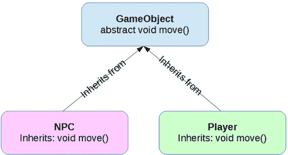

# 三、多态

多态是一个术语，指的是每次执行时行为可能不同的代码。编程中有许多类型的多态，但是这个术语经常被用来指面向对象编程中的特定机制。我们的目标是用一些特定的方法定义一个父类，然后定义多个继承并为这些方法定义不同代码的子类。然后，当我们使用子类执行方法时，我们可以使用相同的代码。但是，子类将各自执行自己特定版本的方法。

为了说明相同的代码如何表现不同，假设我们正在创建一个游戏(我们将在本电子书的最后一章实现一个游戏)。在游戏中，通常有一个由物体、非玩家角色和玩家组成的虚拟世界。游戏中的每个对象都可以移动，这意味着我们可以用一个名为`move`的抽象方法创建一个通用的`GameObject` 类(如代码清单 15 所示)。

## 抽象类

代码清单 3.0:游戏对象类

```java
  //
  Abstract parent class:
  public abstract class GameObject {
        // Abstract method:
        public abstract void move();
  }

```

注意`GameObject`类标有`abstract`关键字。这是一个安全措施——我们不想从通用的`GameObject`类中创建任何实例，所以我们将其标记为`abstract`，以防止实例被创建。任何具有一个或多个`abstract`方法的类都必须标记为`abstract`本身。这个班有`move`法，也就是`abstract`，所以整个班必须是`abstract`。如果你试图创建一个`GameObject`类的实例，Eclipse 会给你一个错误:*不能实例化类型游戏对象*。我称之为安全措施，因为我们可以在`GameObject`中为`move`定义一个主体，并完全移除`abstract`关键词，但这可能并不明智——为了让我们游戏中的对象有用，它必须是某种特定的类型，而不仅仅是一个通用的无名“对象”。

还要注意的是`move`方法没有体。它只包含一个带有分号的函数声明。我们是说存在另一个类，或者多个类，能够执行功能`move`。我们可能希望将这些其他类的实例称为`GameObject`对象，但是它们必须指定`move`方法做什么，否则它们本身就是`abstract`。

现在让我们定义一些继承自`GameObject`类的类。当 NPC 移动时，我们必须在玩家移动时执行不同的代码。NPC 由计算机控制，它们通常采用某种形式的人工智能，以便与玩家交谈或在城镇中游荡。另一方面，玩家不受电脑控制。玩家需要用户的输入。因此，根据代码清单 3.1 和 3.2，我们可以从名为`NPC`和`Player`的`GameObject`类创建两个派生类。

代码清单 3.1: NPC 类

```java
  public class NPC extends GameObject {
        public void move() {
               System.out.println(
  "The
  shopkeeper wanders around aimlessly...");
        }
  }

```

代码清单 3.2:玩家类

```java
  public class Player extends GameObject {
        public void move() {
               System.out.println("It is the player's
  move...");
               // Poll the keyboard or read the
  mouse movements, etc.
        }
  }

```

在代码清单 3.1 和 3.2 中，我们使用`extends`关键字定义了从`GameObject`类继承的子类。`extends`关键字意味着`GameObject`类中的所有成员变量和成员方法也属于这个类。我们所创建的叫做类层次结构，类似于家谱。父类位于顶部，定义了较低类继承的所有元素(参见图 9)。较低的类比父类描述更具体的项目。在我们的例子中，父类描述了一个通用的移动方法，子类定义了它的含义。



图 9:游戏对象类层次结构

我们现在可以将游戏中的所有对象存储在一个集合中，并且可以通过调用`move`方法来迭代集合——这两种方法都是从类层次结构中获得的优势。我们可以创建`NPC`和`Player`的实例，并将它们存储在`GameObjects`的集合中。所有`NPC`都是`GameObjects`，所有`Player`类的实例也都是`GameObjects`。代码清单 3.3 显示了一个示例`main`方法，该方法使用了`GameObjects`的集合，但是使用多态来调用两个不同版本的`move`。

代码清单 3.3:多态

```java
  public class MainClass {
        public static void main(String[] args) {
              // Create 5 objects in our game.
              GameObject[] gameObjects = new GameObject[5];

              // First object is the player.
              gameObjects[0] = new Player();

              // Other objects are NPCs.
              for(int i = 1; i < 5; i++) {
                    gameObjects[i] = new NPC();
              }

              // Call move for all objects in the game.
              for(int i = 0; i < 5; i++) {
                    gameObjects[i].move();
              }
        }
  }

```

代码清单 3.3 中用黄色突出显示的那一行是多态的一个例子。循环第一次迭代时，局部变量`i`将被设置为`0`，这一行将导致方法`Player.move()`被调用，因为`gameObject`数组的第一个元素是`Player`类型的。但是`gameObjects`数组中的其他对象都是`NPC` s，这意味着这个循环的下一次迭代将调用`NPC.move()`。同一行代码(即“`gameObjects[i].move();`”)用于调用两个不同的方法。我们应该理解，我们没有直接从`GameObject`类创建任何实例。我们不能这样做，因为`GameObject`班是`abstract`。我们创建了`NPC`和`Player`类的实例，但是我们使用了通用术语`GameObject`来存储它们并调用它们的方法。

运行代码清单 3.3 中的应用程序后，输出如下:

这是玩家的行动...

店主漫无目的地四处闲逛...

店主漫无目的地四处闲逛...

店主漫无目的地四处闲逛...

店主漫无目的地四处闲逛...

|  | 注意:在 Java 中，子类只能有一个父类。有些语言允许多个父类，称为多重继承，但 Java 只允许一个。然而，Java 确实允许一个子类实现多个接口(参见下一节)。 |

## 覆盖方法

抽象父类可以包含成员方法和变量。在前面的例子中，`GameObject`类可能包含指定对象所在位置的`x`和`y`变量。我们可以定义一个名为 print 的方法，输出一些关于对象的信息(参见代码清单 3.4)。

代码清单 3.4:非抽象父方法

```java
  // Abstract parent class:
  public abstract class GameObject {
        // Member variables:
        int x,
  y;

        // Nonabstract method:
        public void
  print() {
              System.out.println("Position:
  " + x + ",
  " + y);
        }

        // Abstract method:
        public abstract void move();
  }

```

从代码清单 3.4 中的`GameObject`类继承的任何子类都将自动拥有其父类的`x`和`y`变量。他们也会继承`print`法，不是`abstract`。如果我们给我们的主方法添加一个循环，用我们的五个对象中的每一个调用`print`(代码清单 3.4)，它们将各自使用到目前为止定义的打印方法的唯一版本——父方法的`print`方法。

代码清单 3.5:调用父打印方法

```java
  public class MainClass {
        public static void main(String[] args) {
              // Same code as before

              // Call print for all objects in
  the game.
              for(int i
  = 0; i < 5; i++)
  {
                    gameObjects[i].print();
              }
        }
  }

```

代码清单 3.5 的输出如下:

位置:0，0

位置:0，0

位置:0，0

位置:0，0

位置:0，0

但是，如果我们在其中一个子类中定义一个与父类方法具有相同签名的打印方法，我们将看到子类可以覆盖父类的方法。代码清单 3.6 显示了与原始`Player`类相同的代码，只是这次我覆盖了父类的 print 方法。

代码清单 3.6:重写父方法

```java
  public class Player extends GameObject {
        public void move() {
              System.out.println("It is the
  player's move...");
              // Poll the keyboard or read the mouse movements,
  etc.
        }

        @Override
        public void print() {
              System.out.println("Player
  position: " + x + ", " + y);
        }
  }

```

首先，注意`@Override`注释是可选的。代码清单 3.6 的`Player`类中的打印方法与父类的打印方法名称完全相同，参数和返回类型也完全相同。现在，当我们运行我们的`main`方法时，我们会看到`Player`对象调用它自己的特定版本的`print`，而`NPC`对象(它没有定义特定版本的`print`函数)调用父对象的`print`。我们说`Player`类已经覆盖了`print`方法。

## 构造函数

构造函数是用于创建对象的新实例的方法。一个`abstract`类可以提供一个构造函数，即使我们不允许创建它的实例。在代码清单 3.7 中，`GameObject`类定义了一个构造函数，将`x`和`y`的值设置为-1。

代码清单 3.7:抽象父级中的构造函数

```java
  // Abstract parent class:
  public abstract class GameObject {
        // Member variables:
        int x, y;

        // Constructor
        public GameObject() {
              // Set the x and y:
              x = y
  = -1;
        }

        // Nonabstract method:
        public void print() {
              System.out.println("Position:
  "
  + x + ", " + y);
        }

        // Abstract method:
        public abstract void move();
  }

```

如果我们不做任何更改并运行程序，我们将看到为每个子对象自动调用父对象的构造函数:

球员位置:-1，-1

位置:-1，-1

位置:-1，-1

位置:-1，-1 位置:-1，-1

但是，我们也可以为子类指定构造函数。代码清单 3.8 显示了带有自己的构造函数的`Player`类。

代码清单 3.8:播放器类的构造函数

```java
  public class Player extends GameObject {

        // Constructor
        public Player() {
              x = y
  = 100;      // Start the player at 100x100.
        }

        public void move() {
              System.out.println("It is the
  player's move...");
              // Poll the keyboard or read the mouse movements,
  etc.
        }

        @Override
        public void print() {
              System.out.println("Player
  position: " + x + ", " + y);
        }
  }

```

运行应用程序会显示`Player`构造函数被调用来实例化`Player`对象，`NPC`都调用父构造函数，因为它们没有定义自己的构造函数。

## 超级关键词

当我们需要从子类中引用父类时，我们使用`super`关键字。例如，代码清单 3.9 显示了如何从`Player`构造函数中调用`GameObject`构造函数。

代码清单 3.9:子构造函数调用超级构造函数

```java
        // Constructor
        public Player() {
              // Call the parent's constructor.
              super();

              x = y = 100;      // Start the player at 100x100.
        }

```

当我们使用`super()`调用父级的构造函数时，它必须是子级构造函数中的第一条语句。这只有在调用父级的构造函数时才成立。如果您想调用某个其他方法的父版本，可以在子方法的重写方法中的任何时候这样做。

## 关键字实例

在我们进入界面之前，`instanceof`关键字可以用来测试对象的类型。代码清单 3.10 中的`main`方法使用了与之前相同的类层次结构。

代码清单 3.10:使用实例进行测试

```java
  public class MainClass {
        public static void main(String[] args) {
              // Define some object:
              GameObject someObject = new Player();

              // Test if the first object is a GameObject.
              if(someObject instanceof GameObject) 
                    System.out.println("Object is a
  GameObject!");
              else
                    System.out.println("Not a
  GameObject...");

              // Test if it is a Player.
              if(someObject instanceof Player) 
                    System.out.println("Object is a
  Player!");
              else
                    System.out.println("Not a
  Player...");

              // Test if it is an NPC.
              if(someObject instanceof NPC) 
                    System.out.println("Object is a
  NPC!");
              else
                    System.out.println("Not an
  NPC...");
        }
  }

```

在代码清单 3.10 中，我们创建了一个名为`someObject`的`Player`对象。然后我们用`instanceof`测试型号是`GameObject`、`Player`还是`NPC`。请注意，对象的数据类型可以不止一种。前面`main`方法的输出显示`someObject`既是`Player`对象又是`GameObject`。然而，它不是 NPC:

对象是一个游戏对象！

对象是玩家！

不是 NPC...

## 接口

抽象方法有点像契约。我们说，从父类派生的任何类都能够执行它所继承的抽象方法。接口将抽象方法发挥到了极致。

接口类似于抽象的父类，除了它只包含抽象的方法(也就是说，在接口中根本没有指定方法，只有方法名)。接口不指定成员变量(尽管它们可以指定静态成员或类变量)。当我们从接口派生一个类时，我们说派生类必须执行接口中指定的一组方法(或者派生类本身必须是一个接口或抽象类)。

接口通常描述类层次结构的一些非常一般的方面。通常，接口是作为类的超抽象版本引入的。但是抽象类的典型使用方式和接口的典型使用方式之间有细微的区别。接口通常描述一些特定的活动可以使用类的实例来执行，而不是描述实例可以用来执行一些任务。例如，接口可能描述可排序的对象。许多类型的对象都是可排序的——例如，名字可以按字母顺序排序，如扑克牌和数字。虽然这些对象是可排序的，但是比较它们的确切机制是不同的。我们可以实现一个名为 Comparable 的接口，这意味着从该接口派生的任何两个对象都可以进行比较，因此可以对它们的列表进行排序。比较和排序对象是非常常见的，Java 已经包含了一个名为 Comparable 的接口。

|  | 注意:在 Java 中，不可能从多个父类继承。然而，从多个接口继承是完全合法的。 |

开始一个名为接口的新项目，并在代码清单 3.11 中添加`Point`类。

代码清单 3.11:点类

```java
  public class Point implements Comparable {
        // Member variables:
        public double x, y;

        // Constructor
        public Point(double x, double y) {
              this.x = x;
              this.y = y;
        }

        // Print out some info about the point:
        public void print() {
              System.out.println("X: " + x + " Y: " + y + " Mag:
  "
  +
                          Math.sqrt(x*x+y*y));
        }

        public int compareTo(Object o) {
              // Firstly, if the second object is not a point:
              if(!(o instanceof Point))
               return 0;

              // Cast the other point:
              Point otherPoint = (Point) o;

              // Compute the absolute magnitude of each point from
  the origin:
              Double thisAbsMag = Math.sqrt(x * x + y * y);
              Double otherPointAbsMag =Math.sqrt(otherPoint.x * otherPoint.x +
                          otherPoint.y * otherPoint.y); 

              return thisAbsMag.compareTo(otherPointAbsMag);

              /*
              // Note: Double.compareTo does something like the
  following:

                    // If this object has a greater magnitude:
                    if(thisAbsMag > otherPointAbsMag) return
  1;

                    // If this object a smaller magnitude:
                    if(thisAbsMag < otherPointAbsMag) return
  -1;

                    // If the object's magnitudes are equal:
                    return 0;
              */
        }
  }

```

注意代码清单 3.11 第一行的关键字`implements`，后面是界面`Comparable`。这就是我们从接口继承方法的方式。我们不像在课堂上那样使用`extends`这个术语。`Comparable`界面定义了一个签名为“`public int compareTo(Object o)`”的单一方法。因此，为了实现`Comparable`接口，我们必须在我们的类中提供这个方法。

当我们在课堂上提供`compareTo`方法时，我们必须理解参数和输出的含义。该方法采用一个参数，该参数可能与我们正在定义的类的数据类型相同(将点数与扑克牌等进行比较是没有意义的。；我们只对这里的排序点感兴趣)。我首先在`compareTo`方法中提供了一个测试，以确保我们比较的对象实际上是一个`Point`。如果对象不是`Point`，我们可以抛出一个异常，但是我在代码清单 3.11 中返回了`0`，这意味着两个对象是相等的。

接下来，我们需要具体说明比较对象意味着什么。如果`this`对象小于`o`，我们返回-1。如果`this`物体大于`o`，我们返回`1`，如果物体相同，我们返回`0`。对于实现`Comparable`接口的每个类，我们需要定义实例之间的大小是什么意思。我选择的含义是基于点的绝对大小(即二维平面上从 0 到的距离，它是(x*x+y*y)的平方根)。你会注意到我用的是盒装版本`Double`，因为原生`double`类型不实现`Comparable`接口，而盒装版本`Double`实现了。计算完`this` 和`o`之间的距离后，我们调用`Double.compareTo`并返回结果。我还在代码末尾添加了一条注释，大致显示了`Double.compareTo`方法的行为。

现在我们有了一个实现`Comparable`接口的类，我们可以从我们的`Point`类创建一个实例集合，并使用标准的 Java 排序对它们进行排序。接下来，让我们创建一个名为`MainClass`的新类。这个类的代码如代码清单 3.12 所示。

代码清单 3.12:对可比较对象列表进行排序

```java
  import java.util.ArrayList;
  import java.util.Collections;

  public class MainClass {
        public static void main(String[] args) {
              // The total number of points in the demo:
              int numberOfPoints = 5;

              // Create a list of random points:
              ArrayList<Point> points = new ArrayList<Point>();
              for(int i = 0; i < numberOfPoints; i++)
                    points.add(new Point(Math.random() * 100,
  Math.random() * 100));

              // Print the unsorted points:
              System.out.println("Unsorted:
  ");
              for(int i = 0; i < numberOfPoints; i++)
                    points.get(i).print();

              // Sorting a collection of Comparable objects:
              Collections.sort(points);

              // Print the sorted points:
              System.out.println("Sorted:
  ");
              for(int i = 0; i < numberOfPoints; i++)
                    points.get(i).print();

              // Sort the items in reverse order (from largest to
  smallest):
              points.sort(Collections.reverseOrder());

              // Print the points sorted in reverse:
              System.out.println("Sorted in
  Reverse: ");
              for(int i = 0; i < numberOfPoints; i++)
                    points.get(i).print();
        }
  }

```

在代码清单 3.12 中，我们使用`Collections.sort`和`points.sort(Collections.reverseOrder)`来对点进行排序，并以相反的顺序对它们进行排序。这些排序方法是为实现`Comparable`界面的任何对象设计的。这意味着我们不需要编写快速排序(或其他算法)和在数组中交换元素并在`ArrayList`中有效比较它们。相反，我们所需要做的就是实现`Comparable`界面，我们对象的任何列表都可以排序！