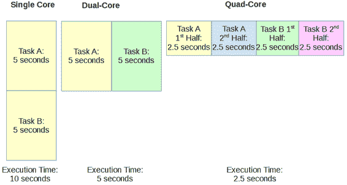
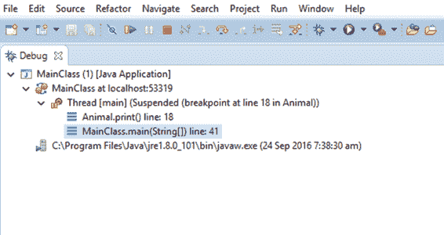
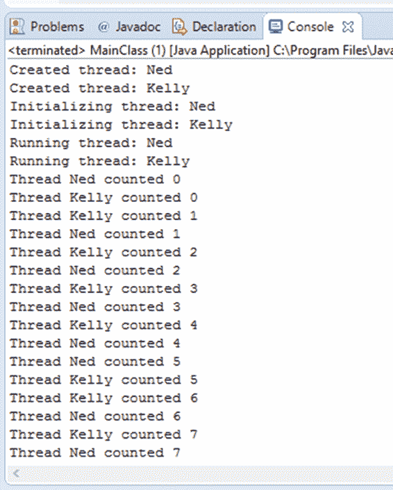
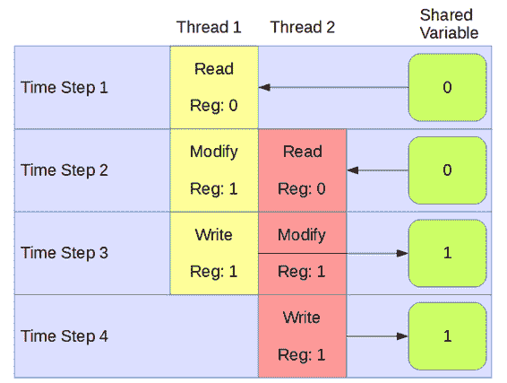

# 五、多线程

多线程是一种同时对多个执行单元进行编程的技术。传统上，计算机运行时只有一个执行代码的中央处理器。CPU 一个接一个地运行指令，跳转到各种方法。CPU 执行代码非常快，但是任何 CPU 的执行速度都是有限制的。现代的中央处理器每秒钟可以执行数十亿条指令，但是提高这种执行速度的成本非常高——硬件开始需要极端的措施来防止中央处理器熔化或着火(例如，水甚至液氮已经被用来冷却非常快的中央处理器)。

谢天谢地，我们可以在不增加单元时钟速度的情况下，大大提高我们的 CPU 的性能。取而代之的是，制造商将多个执行单元添加到单个芯片上(芯片只是计算机内部物理对象的一个词，中央处理器蚀刻在该物理对象上)。这些单元被称为核心，每个都可以被认为是一个完整的中央处理器。



图 10:多线程

图 10 显示了多核处理器的一个假设的最佳情况。在左侧，我们看到一个内核执行两项任务。单核先执行任务 A，任务 A 完成后执行任务 b，两个任务都需要 CPU 秒执行，因此总执行时间为 10 秒。

在图 10 的中间，双核中央处理器可以同时执行任务 A 和任务 B，方法是允许每个任务由它的两个核心之一执行。每个任务需要五秒钟来计算，但是任务是同时执行的，因此它们将同时完成，需要五秒钟(加上少量的开销时间)。

最后，图 10 的右侧显示了一个四核中央处理器。有时可以将任务分成几个部分，在图中，我们已经分配了四核 CPU 的四个核心之一来执行任务 A 或 b 的一半。执行任务的一半需要 2.5 秒，所有四个核心将在大约 2.5 秒后完成。这个速度代表了单核 CPU 性能的四倍。

图 10 显示了一个假设的情况。这是最好的情况，在实践中，任务通常不会这么容易地分成两半。但是，您可以看到，随着内核数量的增加，内核分担工作负载的能力变得非常有用。通过采用多线程和巧妙地将我们的工作负载分配给不同的内核，通常可以将我们的应用程序性能提高 200%甚至 400%。正如我们将看到的，通常内核需要相互通信和协调它们的动作，当我们添加另一个内核时，我们通常不会获得 100%的速度提升。

多线程是一个极其广泛和复杂的话题，我们在本文中只触及表面，但是您应该经常练习多线程技能，因为计算的未来非常依赖于高效的多线程。

### 线

线程是一个执行单元。例如，当用户运行我们的应用程序时，JVM 将为我们创建一个单一的主线程来开始执行`main`方法。它还可以为垃圾收集(删除后台不需要的对象)和其他后台任务创建几个后台线程。主线程从执行`main`方法的代码开始，正如我们多次看到的。

### 调用栈

当线程执行代码时，它会在调用方法时跳到代码中的各个点。这些方法调用可以嵌套(即一个方法可以自己调用；它可以调用方法)。方法可能需要传递参数，并且它们可以指定自己的局部变量。为了以正确的顺序从方法返回，向方法传递参数，跟踪方法的局部变量，分配了一个内存区域，称为“调用堆栈”每个线程都有自己的调用堆栈，线程可以潜在地调用不同方法的任何序列。

当程序在断点处暂停时，Eclipse 会显示程序调用堆栈的一个简单版本。图 11 显示了程序运行时调试窗口的屏幕截图。显示的信息是正在运行的应用程序类的名称(`MainClass`)。该线程被称为`[main]`，由于`Animal`类源代码文件中第 18 行的断点，该线程被挂起。下一行是调用堆栈。程序已经执行了`Animal.print`方法，以及之前的方法—`MainClass.main`方法(称为`Animal.print`方法)。



图 11:调试窗口

在 Java 中，线程是资源密集型的。系统创建和运行一个新的线程需要时间，创建一个新的线程会导致其他系统资源的分配(比如调用堆栈的内存)。我们不应该试图创建数百个线程，也不应该试图在一个紧密的循环中创建和终止线程。线程创建速度较慢，系统可以并发执行的线程数量始终受到物理硬件的限制(即系统内核数量、RAM 数量、CPU 速度等)。).在 Java 中可以创建多个线程的方法有几种，我们将看两种——实现`Runnable`接口和扩展`Thread`类。

|  | 注意:当我们创建一个新线程时，它通常会在中央处理器中的一个新内核上执行。然而，内核和线程并不总是直接相关的。通常，操作系统在内核之间切换线程，给每个线程少量的时间(称为时间片)来执行部分代码。即使是单核 CPU 也可以通过在线程之间快速切换来模拟多线程，在物理内核上为每个线程分配一些时间片。 |

## 实现可运行

为了使用多线程，我们可以创建一个实现`Runnable`接口的类。这允许我们创建一个带有私有成员线程的类。`Runnable`接口定义了一个名为`run`的抽象方法，我们必须在派生类中实现它。当我们创建一个新的线程时，它将执行这个方法(可能使用 CPU 中与执行`main`方法的内核不同的内核)。注意，我们可以创建两个、四个甚至八个线程，即使硬件只有一个双核 CPU。但是要小心——如前所述，线程是资源密集型的，如果你试图创建 100 或 1000 个线程，你的程序将不会运行得非常快，它将完全停止，并且可能会使程序崩溃，如果不是整个系统的话(需要重启)。

代码清单 5.0: MainClass

```java
  public class MainClass {
        public static void main(String[] args) {
              // Define Thready objects:
              Thready t1 = new Thready("Ned");
              Thready t2 = new Thready("Kelly");

              // Start the threads:
              t1.initThread();
              t2.initThread();
        }
  }

```

代码清单 5.1: Thready 类

```java
  public class Thready implements Runnable {

        // Private member variables:
        private Thread thread;
        private String name;

        // Constructor:
        public Thready(String name) {
              this.name = name;

              System.out.println("Created
  thread: " + name);
        }

        // Init and start thread method:
        public void initThread() {
              System.out.println("Initializing
  thread: " + name);

              thread = new Thread(this, name);

              thread.start();
        }

        // Overridden run method:
        public void run() {
              // Print initial message:
              System.out.println("Running
  thread: " + name);

              // Count to 10:
              for(int i = 0; i < 10; i++) {
                    System.out.println("Thread
  "
  + name + " counted
  "
  + i);

                    try {
                          // Wait for 1 second:
                          Thread.sleep(1000);
                    }
                    catch (Exception e) {
                          System.out.println("Error:
  "
  + e.getMessage());
                    }
              }
        }
  }

```



图 12:内德和凯利的输出

图 12 显示了代码清单 5.0 和 5.1 中程序的一个可能输出。代码清单 5.1 展示了实现`Runnable`接口的`Thready`类，它定义了实现`Runnable`所需的`run`方法。这个类定义了一个名为`thread`的`Thread`对象，我们用名为`initThread`的方法来实例化它。然后我们调用`Thread`对象的`start`方法，这又会调用`Runnable`接口的`run`方法。在`run`方法中，我们从 0 数到 9，在每个数字之间暂停一秒钟。运行应用程序时，您将看到两个线程(在代码清单 5.0 的`MainClass`中创建)慢慢数到九。

代码清单 5.0 和 5.1 中有几个关于这个程序的非常重要的事实:

*   线程同时计数，因此程序只需大约 10 秒钟即可执行。
*   我们不知道计数线程的确切时间和顺序(`Ned`可能会莫名其妙地比`Kelly`计数稍快，反之亦然)。
*   如果您在多核台式机上运行此应用程序，很有可能`Ned`和`Kelly`(我们的线程)将在机器内部的不同内核上运行。

### 并发

以上关于不知道确切执行顺序的观点很重要！当我们查看代码清单 5.0 和 5.1 中的代码时，我们不知道会发生什么。`Ned`可以更快地计数，或者`Kelly`可以更快地计数(两者将以大约每秒一个数字的速度计数，但是在纳秒级别上，一个线程将总是击败另一个线程)。

这两个线程可以完全随机计数——它们可以交换每个数字的 leader，这样每次我们执行应用程序时，我们可能会得到不同的输出。`Ned`和`Kelly`称为“并发”如果仅仅通过查看代码无法确定线程的执行顺序，那么代码就是并发的。假设并发线程的执行顺序是不安全的(事实上，并发意味着我们不能假设顺序！).当我们协调并发线程时，我们必须非常小心。当我们查看代码时，我们无法判断会发生什么，因为中央处理器的任务极其复杂——它正在执行操作系统和数百个后台任务。它执行每个线程的时间片，并在物理内核之间切换后台进程。在这个乱糟糟的指令中的某个地方，我们卑微的小`Ned`和`Kelly`线程将被给予一些时间在一个内核上执行，然后它们被置于休眠状态，等待其他程序在该内核上执行。我们无法猜测线程的执行顺序，因此我们的线程是并发的。一般来说，我们希望 CPU 不要太忙于执行后台任务，当我们创建线程时，我们的目标是让它们完整、不间断地同时执行，但我们不能保证这种情况会发生。

## 螺纹配合

当我们的线程执行的任务完全独立时，这个算法被称为令人尴尬的并行。令人尴尬的是，并行算法是多线程的最佳方案，因为我们可以完美地划分工作负载，线程不需要以任何方式进行通信或同步。这意味着每个线程都可以尽可能快地执行分配给它的任务，而不会中断，也不用担心其他线程在做什么。在现实世界的应用中，许多算法不能完美地分成两部分或更多部分。每个线程的工作负载通常不会 100%独立于其他线程。线程需要通信。

为了让一个线程与另一个线程通信，线程需要共享资源。想象一下`Ned`和`Kelly`希望执行两个任务——烧水和泡汤。问题是我们需要在倒咖啡之前把水烧开。所以，如果`Ned`被分配到烧水的任务，而`Kelly`被分配到倒咖啡的任务，那么`Ned`就需要某种方式向`Kelly`表明水已经烧开了。并且`Kelly`必须等待`Ned`的一些信号后才能倒咖啡。

### 低级并发陷阱

让我们花点时间来研究一下并发编程中涉及的一些重要概念和陷阱。这一部分可能看起来特别低级，但是在并发编程中没有什么是有意义的，除非我们知道为什么我们必须注意我们的步骤。

在当前环境下，资源是变量。共享资源是多个线程可以读写的变量。当我们在线程之间共享变量时，我们需要小心不要允许竞争条件。当两个线程可能同时改变一个变量时，就会出现争用情况。假设两个线程试图递增一个最初设置为 0 的共享资源。这个操作看起来很简单——我们需要两个线程来增加变量，所以结果应该是两个。问题是，增加变量的行为不是原子的。如果一个操作不是原子的，它可以分成几个步骤。这些步骤称为读/修改/写周期。线程首先从内存中读取变量的当前值，然后通过对变量的临时副本执行增量来修改它，最后将结果写回内存中的实际变量。

现代中央处理器使用读/修改/写周期对变量执行几乎所有操作，因为它们没有能力对内存中的数据执行算术运算。内存不是这样工作的——它允许两种操作:读取某个地址的值或向某个地址写入值。它不允许中央处理器将两个值相加或相减。因此，中央处理器向随机存取存储器请求一些变量，在其内部寄存器中存储一个副本(寄存器是中央处理器内部的一个变量)。然后，中央处理器对该副本执行算术运算，最后将结果发送回内存。

图 13 显示了一个竞争条件的例子。该示例显示两个线程试图同时将共享变量从 0 增加到 2。这两个线程一次执行一个步骤，时间列在图的左侧。两个线程都将共享变量的值读取为 0，使用其内部寄存器将其递增为 1，并将结果写入 1。我们可以看到时间-步骤 4 的最终结果是 1 而不是 2。但这并不是唯一的可能性 CPU 在安排线程执行时正在编造结果，结果超出了程序员的控制范围。



图 13:比赛状态

为了使用共享资源，我们必须非常小心，以确保没有种族条件。这通常意味着一次只允许一个线程访问共享资源。为了在 Java 中创建共享资源，我们可以使用`synchronized`关键字。任何标记为`synchronized`的方法一次只允许一个线程执行该方法。这意味着如果我们从一个`synchronized`代码块中修改一个变量，我们可以保证一次只允许一个线程访问。

## 互斥

互斥或互斥是一种并行原语。这是并行编程中使用的一种机制，一次只允许一个线程访问代码的某个部分。互斥体用于在我们的代码中构建关键部分，一次只允许一个线程执行。标准 Java 库中没有提供互斥体，因此，作为练习，我们将创建一个互斥体。

互斥体有两个关联的方法——`grabMutex`和`releaseMutex`。互斥的目的是一次只允许一个线程完成对`grabMutex`的调用。一旦一个线程拥有了互斥体(或者，换句话说，已经成功完成了对`grabMutex`的调用)，任何试图调用`grabMutex`的其他线程都将阻塞——它们将停止执行并等待互斥体被释放。因此，当线程拥有互斥体时执行的任何操作都是原子的。在互斥体被释放之前，它们不能被任何其他线程中断。

在 Java 中，我们必须在一个对象上同步。也就是说，为了成功地设计互斥的代码块，我们必须使用一些对象作为锁。

代码清单 5.2:互斥的主要方法

```java
  public class MainClass {
        public static void main(String[] args) {
              // Create three threads:
              Thready t1 = new Thready("Ned");
              Thready t2 = new Thready("Kelly");
              Thready t3 = new Thready("Pole");

              // init and run the threads.
              t1.initThread();
              t2.initThread();
              t3.initThread();

              // Wait for the threads to finish:
              while(t1.isRunning()) {
              }

              while(t2.isRunning()) {
              }

              while(t3.isRunning()) {
              }

              // Check what the counter is:
              System.out.println("All
  done!" +  Thready.getJ());
        }
  }

```

现在我们来看看`Thready`类的三个版本，每个版本的`run`方法略有不同。在第一个例子中，我将只包含完整类的代码，因为代码清单 5.3 显示了`Thready`类的完整代码，尽管在这段代码中，我特意设计了该类，以便线程易于出现争用情况。

代码清单 5.3:带有竞争条件的线程类

```java
  public class Thready implements Runnable {

        // A shared resource:
        public class Counter {
              private int j;

              public Counter() {
                    j = 0;
              }

              public int getJ() {
                    return j;
              }
        }

        // Thready member variables
        private Thread thread;
        private String name;
        private boolean running = true;

        // Static shared resource:
        private static Counter counter = null;

        // Getters:
        public static int getJ() {
              return counter.getJ();
        }

        public boolean isRunning() {
              return running;
        }

        // Constructor
        public Thready(String name) {
              // Create the shared resource
              if(counter == null)
                    counter = new Counter();

              // Assign name
              this.name = name;

              // Print message
              System.out.println("Created thread:
  "
  + name);
        }

        public void initThread() {
              // Print message
              System.out.println("Initializing
  thread: " + name);

              // Create thread
              thread = new Thread(this, name);

              // Call run
              thread.start();
        }

        public void run() {
              for(int q = 0; q < 10000; q++) {
                          counter.j++;      // RACE CONDITION!!!
              }

              running = false;  
        }
  }

```

注意代码清单 5.3 中标记有注释“`RACE CONDITION!!!`”的行。代码清单 5.2 中的 **`main`** 方法创建并执行三个线程:`Ned`、`Kelly`和`Pole`。所有三个线程都试图在它们的`run`方法中增加共享的`counter.j`变量，但是它们同时这样做，没有协调。比赛条件是灾难性的，为了证明它们不仅仅是理论，运行几次程序，见证`main`方法报告的最终价值。`main`方法几乎永远不会计算出 30，000 的预期值(即当三个线程各自增加一个变量 10，000 次时，我们期望的值)。它报告了 12，672 和 13，722 起。事实上，它似乎报告它想要的任何东西，我们知道为什么——线程正在增加它们自己的共享资源副本，并且只是偶尔写一个成功的更新！让我们花点时间来实现一个互斥体，看看我们能否修复对这个共享资源的访问。

代码清单 5.4:使用互斥体 1(慢速方式)

```java
        public void run() {
              for(int q = 0; q < 10000; q++) {
                    synchronized (counter) {
                          counter.j++;
                    }
              }
        running = false;  
        }

```

第二个版本的`run`方法稍微好一些(代码清单 5.4)。我们使用了`synchronized`关键字，并使用共享资源作为密钥将代码锁定在循环中(这个锁是我们的互斥锁)。`synchronized`关键字需要一个资源来同步，后面是一个代码块。一次只有三个线程中的一个能够在`synchronized`代码块内执行，因此代码行“`counter.j++`”是一个关键部分。线程会等到锁(或互斥体)被释放，轮流进入临界区，递增`counter.j`，然后释放锁。

抓住和松开锁需要时间。最终，我们希望线程在同步之前尽可能长时间地独立工作。如果您使用新版本的`run`方法运行应用程序(请不要这样做)，您可能需要等待非常长的时间，线程才会抛出锁大约 30，000 次，并将`counter.j`一直递增到 30，000。他们最终会完成，但可能需要 10 分钟或 1 小时。代码清单 5.5 展示了一种更好的方法。

|  | 注意:也可以用 synchronized 关键字标记一个方法。当我们将一个方法标记为同步时，我们是说该方法一次只能由一个线程使用。但是，我们必须非常小心，因为一个同步的方法实际上隐式地与作为锁对象的“this”关键字同步。也就是说，如果我们在一个类中有一个同步的方法，并且我们试图创建该类的多个线程，当我们调用该方法时，这些线程将不会同步，因为它们中的每一个都将自己用作锁。 |

代码清单 5.5:使用互斥体 2(快速方式)

```java
        public void run() {
              synchronized (counter) {
                    for(int q = 0; q < 10000; q++) {

                          counter.j++;
                    }
              }
              running = false;  
        }

```

在代码清单 5.5 中，我们将锁放在 for 循环之外。这是唯一的区别，但它在性能上有很大的不同。现在，当一个线程抓住锁时，它会在释放锁之前增加`counter.j` 10，000 次。这意味着锁被抓取三次而不是三万次，性能要好得多。

代码清单 5.5 可能看起来是我给出的例子中显而易见的选择，在目前的情况下，我建议这样做。但是这个项目有一个很大的缺点——增量现在是按顺序进行的。线程不会同时执行它们的工作负载，每个线程要么递增计数器，要么等待锁。以这种方式递增计数器是没有意义的，因为主线程可以在根本不分配任何新线程的情况下执行递增。并发编程是协调线程同时执行独立任务并允许它们同步/通信的一种杂耍行为，这样我们就避免了竞争条件，程序员也能控制结果。

这个例子有问题，因为递增计数器不适合多线程。选择程序中哪些任务适合并发设计是多线程最重要的方面之一。

## 扩展线程类

我们已经研究了为多线程实现`Runnable`。多线程的第二种方法是扩展`Thread`类。在代码清单 5.6 和 5.7 中，通过扩展`Thread`类并执行`Thread.start()`方法创建了一个新线程。我们线程的目标是找到共享号`x`的因素。线程通过将从`2`到`sqrt(x)`的值分成两部分来实现，每个线程检查该范围一半的因子。这个程序使用蛮力方法来寻找因子，它并不打算成为解决因子分解问题的有用程序。

代码清单 5.6:主方法

```java
  // MainClass.java
  public class MainClass {
        public static void main(String[] args) {
              // Define some threads:
              Thready thread0 = new Thready(0);
              Thready thread1 = new Thready(1);
              // Set the value to factor:
              Thready.x = 36847153;
              // Start the threads:
              thread0.start();
              thread1.start();

              // Wait for the threads to finish.
              while(thread0.isAlive()) { }
              while(thread1.isAlive()) { }
              // Print out the factors the threads found:
              System.out.println(
                          "Smallest Factor found by thread0:
  "
  + thread0.smallestFactor);
              System.out.println(
                          "Smallest Factor found by thread1:
  "
  + thread1.smallestFactor);
        }
  }

```

代码清单 5.7:扩展线程类

```java
  // The class Extends the Thread class. 
  public class Thready extends Thread {
        // Shared resource
        public static int x;
        public int id;
        // Smallest factor found by this thread:
        public int smallestFactor = -1;

        // Constructor
        public Thready(int id) {
              this.id = id;
        }

        // Run method
        public void run() {
              // Figure out the root:
              int rootOfX = (int)Math.sqrt(x) + 1;

              // Figure out the start and finish points:
              int start = (rootOfX / 2) * id;
              int finish = start + (rootOfX / 2);

              // If the number is even:
              if(x % 2 == 0) {
                    smallestFactor = 2;
                    return;
              }           
              // Don't check 0 and 1 as a factor:
              if(start == 0 || start == 1)
                    start = 3;

              // Only check odd numbers:
              if(start % 2 == 0)
                    start++;

              // Try to find a factor.
              for(int i = start; i < finish; i+=2) {
                    if(x % i == 0) {
                          smallestFactor = i;
                          break;
                    }
              }
        }
  }

```

一般来说，对于大多数场景，使用 Java `Runnable`机制比扩展`Thread`类更可取。对这两种技术的详细比较不在本电子书的讨论范围之内，但是你可以在 Stack Overflow([http://stackoverflow.com/](http://stackoverflow.com/))找到许多关于这个主题的有趣讨论。