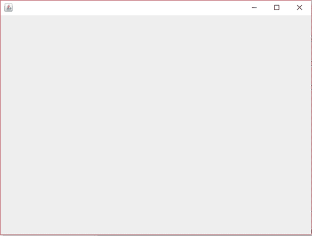
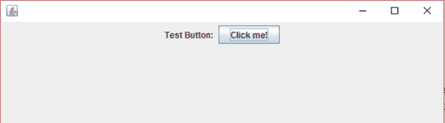
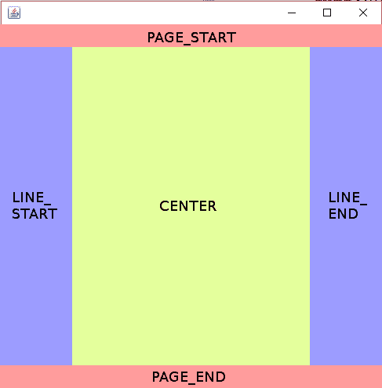
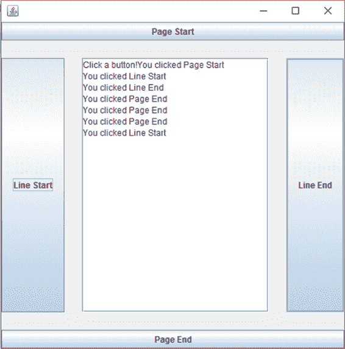

# 六、GUI 编程入门

在本章中，我们将研究 Java 提供的一些机制，这些机制允许我们设计和实现 GUI。在下一章中，我们将使用 WindowBuilder 创建一个带有 GUI 的应用程序，但是为了使代码有意义，我们必须研究如何手动构建简单的 GUI。

在 Java 中，我们可以使用两个包中的一个来为用户提供 GUI——抽象窗口工具包(AWT)或 Swing。AWT 在很大程度上已经被 Swing 所取代，本章介绍了使用 Swing 进行 GUI 编程。Swing 工具包是 AWT 的包器，这意味着在使用 Swing 工具包编程时，我们需要同时导入 Swing 和 AWT。

GUI 是通过放置控件来创建的，如按钮、图片框、组合框等。到一扇窗户上。用户使用鼠标、指针或键盘与控件交互。挥杆控制名称以字母 J 开头，如`JPanel`和`JButton`。

首先创建一个新项目。我称我的为`GUITesting`。添加一个扩展`JFrame`类的类，如代码清单 6.0 所示。A `JFrame`是一个窗口——它在左上角有一个控制框，允许用户关闭窗口，并且窗口可以像普通窗口一样在用户桌面上调整大小和移动。

代码清单 6.0: MainWindow.java

```java
  import java.awt.*;
  import javax.swing.*;

  public class MainClass extends JFrame{
        // Main method
        public static void main(String[] args) {
              MainClass mainWindow = new MainClass();
        }

        // Constructor
        public MainClass() {
              // Set the size of the window.
              this.setSize(640,  480);

              // Set the app to close when the window closes.
              this.setDefaultCloseOperation(EXIT_ON_CLOSE);

              // Set the window to visible.
              this.setVisible(true);
        }
  }

```

代码清单 6.0 显示了一个名为`MainClass`的简单类，它创建并显示了一个空白窗口(见图 14)。该类由`main`方法组成，该方法只创建一个名为`mainWindow`的新`MainClass`对象。在构造器中，我们将窗口的大小设置为`640`乘以`480`像素，并将窗口的可见性设置为`true`。注意`extends`类`JFrame`类。方法`setDefaultCloseOperation`使应用程序在我们关闭窗口时关闭。如果不调用`setDefaultCloseOperation`，即使在用户关闭窗口后，应用程序仍会在后台继续运行。



图 14:空白 JFrame

为了添加控件，我们可以创建一个新的`JPanel`对象。A `JPanel`是一个控制其他控件的控件。您也可以通过创建容器对象并调用`this.getContentPane()`方法直接向`JFrame`本身添加控件，但是我们将使用`JPanel`。代码清单 6.1 展示了如何创建一个新的`JPanel`和一些控件并将其添加到我们的项目中。

代码清单 6.1:向 JPanel 添加控件

```java
        // Constructor
        public MainClass() {
              // Create a JPanel
              JPanel panel = new JPanel(new FlowLayout());

              // Add some controls.
              panel.add(new JLabel("Test
  Button: "));
              panel.add(new JButton("Click
  me!"));

              // Set the current content pane to the panel.
              this.setContentPane(panel);

              // Set the size of the window.
              this.setSize(640,  480);

              // Set the app to close when the window closes.
              this.setDefaultCloseOperation(EXIT_ON_CLOSE);

              // Set the window to visible.
              this.setVisible(true);
        }

```

为了在代码清单 6.1 中添加标签和按钮，我们使用了`JPanel.add`方法。该方法需要一个控件，每个控件都有一个采用`String`的构造函数。当控件显示在屏幕上时，`String`通常用作控件的标题。图 15 显示了代码清单 6.1 中的标签和按钮。



图 15:向 JPanel 添加控件

请注意，在代码清单 6.1 中，我们创建了`JPanel`并在构造函数中指定了布局。当我们将控制添加到`JPanel`时，`JPanel`根据布局进行组织。`FlowLayout`实际上是`JPanels`的默认值。有了`FlowLayout`，所有的控件都被添加到一行中。表 2 包含所有布局和每个布局的简要描述。更多信息，请访问[https://docs . Oracle . com/javase/tutorial/ui wing/layout/visual . html](https://docs.oracle.com/javase/tutorial/uiswing/layout/visual.html)。

表 2:布局

| 布局 | 描述 |
| --- | --- |
| 边框布局 | 面板分为顶部、底部、左侧、右侧和中央。 |
| box layout-方块配置 | 将控件放在单行或单列中。 |
| 菜单布局 | 允许我们在几组控件之间切换。 |
| flow layout-流程配置 | 将控件排列在一行中。 |
| GridBagLayout | 在控件可以占据多个单元格的网格中布局控件。 |
| 网格布局 | 在网格中布局控件。 |
| GroupLayout | 分别提供水平和垂直布局；专为 GUI 构建者设计。 |
| SpringLayout | 根据其位置之间的关系进行控制；专为 GUI 构建者设计。 |

控件是 GUI 的关键。每种控件类型都有特定的用途。这些类通常为控件提供特定的方法，但是许多方法对所有控件都可用，如代码清单 6.2 所示。

代码清单 6.2:有用的控制方法

```java
              JButton btn = new JButton("Initial
  Text");

              // Useful control methods:
              btn.setText("New text!");      // Set the text
  on the button.
              String text = btn.getText();      // Read the
  current text.
              btn.setVisible(false);  // Hide the control from view.
              btn.setVisible(true);   // Show the control.
              btn.setMargin(new Insets(100, 100, 100, 100)); // Set margins.
              Dimension dim = btn.getSize();// Read the size
  of the control.
              btn.setBackground(Color.BLUE);// Set the
  background color.
              btn.setForeground(Color.WHITE);// Set the
  foreground/text color.
              btn.setEnabled(false);// Disable interactions with the
  control.
              btn.setEnabled(true); // Enable interactions with the
  control.

              // Depending on the layout manager, these may do
  nothing:
              btn.setSize(new Dimension(10, 10)); // Set size of
  the control.

              // Set size and position of the control:
              btn.setBounds(new Rectangle(20, 20, 200, 60));

```

## 事件和事件监听器

为了使我们的控件发挥作用，我们需要添加`ActionListeners`。

`ActionListeners`通常在与我们的主线程分离的线程上运行——它们只不过是等待用户与我们的控件交互，然后当用户这样做时，它们调用适当的方法。`ActionListeners`反复监控控件的状态，并提醒我们感兴趣的变化，例如当用户单击按钮或更改文本框中的文本时。这是事件驱动编程。我们设置一组控件，并为它们分配方法，当控件发生特定操作时，我们希望调用这些方法。我们不必自己专门检查控件的状态，因为 Java 为我们完成了所有的后端代码。你可以在[https://en.wikipedia.org/wiki/Event-driven_programming](https://en.wikipedia.org/wiki/Event-driven_programming)查阅维基百科关于事件驱动编程的页面，了解更多关于这个迷人话题的信息。

代码清单 6.3 展示了如何实现`ActionListener`界面并响应用户点击按钮。

代码清单 6.3:在 MainClass 中实现一个 ActionListener

```java
  import java.awt.*;
  import
  java.awt.event.ActionEvent;
  import
  java.awt.event.ActionListener;

  import javax.swing.*;

  public class MainClass extends JFrame implements
  ActionListener {
        // Main method
        public static void main(String[] args) {
              MainClass mainWindow = new MainClass();
        }

        // Constructor
        public MainClass() {
              // Create a JPanel.
              JPanel panel = new JPanel(new FlowLayout());

              // Add some controls:
              panel.add(new JLabel("Test
  Button: "));
              JButton btnClickMe
  = new JButton("Click
  me!");
              panel.add(btnClickMe);

              // Set the current content pane to the panel:
              this.setContentPane(panel);

              // Set this as the current action
  listener
  for the button
              btnClickMe.addActionListener(this);

              // Set the size of the window.
              this.setSize(640,  480);

              // Set the app to close when the window closes.
              this.setDefaultCloseOperation(EXIT_ON_CLOSE);

              // Set the window to visible.
              this.setVisible(true);
        }

        // Method inherited from the ActionListener
  interface:
        public void
  actionPerformed(ActionEvent e) {
              // Show a message box:
              JOptionPane.showMessageDialog(null,
                    "You clicked on
  the button!");
        }
  }

```

在代码清单 6.3 中，我已经将按钮更改为名为`btnClickMe`的局部变量。我们实现`ActionListener`接口，并将其作为按钮的`ActionListener`提供。`ActionListener`界面定义了`actionPerformed`功能，用户点击按钮时会执行该方法的代码。运行程序后，您应该能够单击按钮并看到弹出的消息框。

使用匿名类提供事件发生的代码通常比在一些现有类中实现`ActionListener`接口更实际。代码清单 6.4 显示了与代码清单 6.3 相同的示例，只是这次我使用了一个匿名类，当用户单击按钮时，向用户显示消息框。请注意，在代码清单 6.4 中，`MainClass`不再实现`ActionListener`接口。这种指定事件的方法是 windows builder 使用的，我们将在下一章中看到。

代码清单 6.4:带有匿名类的 ActionListener

```java
  import java.awt.*;
  import java.awt.event.ActionEvent;
  import java.awt.event.ActionListener;

  import javax.swing.*;

  public class MainClass
  extends JFrame {
        // Main method
        public static void main(String[] args) {
              MainClass mainWindow = new MainClass();
        }

        // Constructor
        public MainClass() {
              // Create a JPanel.
              JPanel panel = new JPanel(new FlowLayout());

              // Add some controls.
              panel.add(new JLabel("Test
  Button: "));
              JButton btnClickMe = new JButton("Click
  me!");
              panel.add(btnClickMe);

              // Set the current content pane to the panel.
              this.setContentPane(panel);

              // ActionListener as anonymous
  class.
              btnClickMe.addActionListener(new
  ActionListener() {
                    public void
  actionPerformed(ActionEvent e) {
                          // Show a message box.
                          JOptionPane.showMessageDialog(null,
                                "You
  clicked on the button!");
                    }
              });

              // Set the size of the window.
              this.setSize(640,  480);

              // Set the app to close when the window closes.
              this.setDefaultCloseOperation(EXIT_ON_CLOSE);

              // Set the window to visible.
              this.setVisible(true);
        }
  }

```

## 示例边框布局

作为手动 GUI 构建的最后一个例子，在本节中，我们将探索`BorderLayout`，向单个项目添加多个`ActionListener`，并通过改变`TextArea`的状态来响应事件。在我们继续使用 windows builder 之前，本节旨在提供一个额外的、稍微复杂一点的手动编写 GUI 的例子。至少练习一些手动 GUI 编程有所帮助，因为手动修复使用 windows builder 时创建的问题通常会更快，并且有助于我们理解 builder 提供的代码。一个`BorderLayout`管理器允许我们将控件添加到面板的五个区域— `PAGE_START`、`PAGE_END`、`LINE_START`、`LINE_END`和`CENTER`。图 16 显示了一个带有这些区域颜色和标签的示例面板。



图 16:边框分布区域

当我们向`BorderLayout`添加控件时，我们指定控件的位置(`PAGE_START` 或`CENTER`等)。)并且布局管理器负责调整控件的大小，以便它们填充整个区域(每个区域周围有一个可选的间隙)。

代码清单 6.5:使用边界布局

```java
  import java.awt.*;
  import java.awt.event.ActionEvent;
  import java.awt.event.ActionListener;
  import javax.swing.*;

  public class MainClass extends JFrame implements ActionListener {
        public static void main(String[] args) {
              MainClass m = new MainClass();
              m.run();
        }

        // Declare txtInput.
        private JTextArea txtInput;

        private void run() {
              // Create a new border layout and main panel for
  controls.
              BorderLayout layoutManager = new BorderLayout();
              JPanel mainPanel = new JPanel(layoutManager);
              this.setDefaultCloseOperation(EXIT_ON_CLOSE);
              this.setSize(500,  500);
              this.setContentPane(mainPanel);
              this.setVisible(true);

              // Set margins around control in layout.
              layoutManager.setHgap(25);
              layoutManager.setVgap(25);

              // Create buttons.
              JButton btnTop = new JButton("Page
  Start");
              JButton btnBottom = new JButton("Page
  End");
              JButton btnLeft = new JButton("Line
  Start");
              JButton btnRight = new JButton("Line
  End");

              // Add the buttons to panel.
              mainPanel.add(btnTop, BorderLayout.PAGE_START);
              mainPanel.add(btnBottom, BorderLayout.PAGE_END);
              mainPanel.add(btnLeft, BorderLayout.LINE_START);
              mainPanel.add(btnRight, BorderLayout.LINE_END);

              // Create and add a text area.
              txtInput = new JTextArea(5, 10);
              txtInput.setText("Click a button!");
              JScrollPane jsp = new JScrollPane(txtInput);
              txtInput.setEditable(false);
              mainPanel.add(jsp, BorderLayout.CENTER);

              // Add action listeners to respond to button clicks.
              btnTop.addActionListener(this);
              btnBottom.addActionListener(this);
              btnLeft.addActionListener(this);
              btnRight.addActionListener(this);

              // Redraw all controls to ensure all are visible.
              this.validate();
        }

        // Action performed prints the clicked button's text to the
        // txtOutput control.
        public void actionPerformed(ActionEvent arg0) {
              txtInput.append("You clicked " +
                          ((JButton)arg0.getSource()).getText() +
                          "\n");
        }
  }

```

使用`BorderLayout`，我们可以使用`BorderLayout`对象的`setHGap`和`setVGap`方法设置控件之间的水平和垂直间距。这会影响控件之间的边距。默认情况下，管理器会调整控件的大小以填充整个区域。在代码清单 6.5 中添加控件后，我们使用`this.validate()`来确保所有控件都被重绘。如果没有此调用，一个或多个控件可能不可见，直到用户调整面板的大小(或执行其他一些导致控件被验证的操作)。在面板中添加或移除控件时进行验证总是一个好主意。图 17 显示了代码清单 6.5 中的程序示例。



图 17:边框布局示例