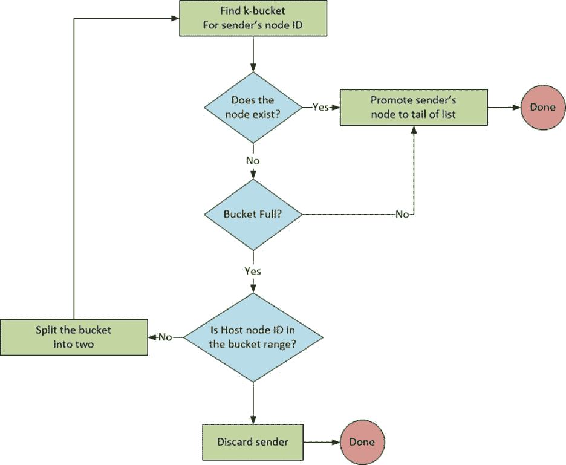
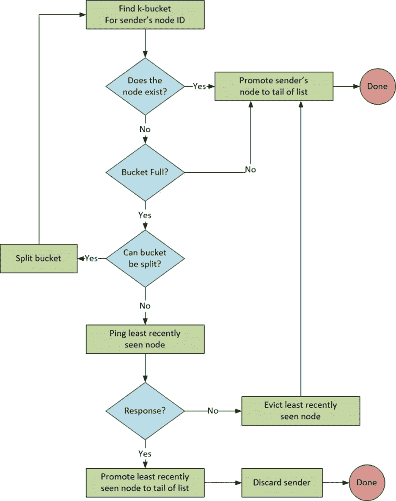
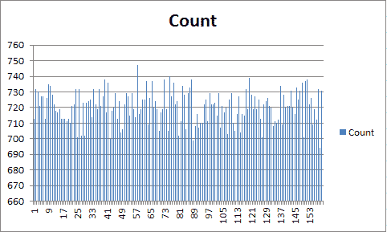
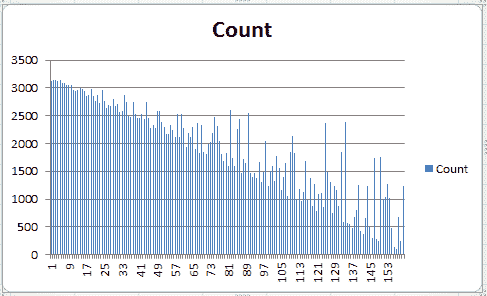

# 四、添加联系人

规范第 2 版第 2.2 节最初陈述了处理添加联系人的简单算法:

"*当 Kademlia 节点从另一个节点接收到任何消息(请求或回复)时，它会为发送者的节点 ID 更新适当的 k-bucket。如果发送节点已经存在于收件人的 k-bucket 中，收件人会将其移动到列表的尾部。如果该节点不在适当的 k-bucket 中，并且 bucket 的条目少于 k 个，则接收者只需在列表的尾部插入新的发送者。但是，如果适当的 k-bucket 已满，则接收者将 ping k-bucket 最近最少看到的节点，以决定要做什么。如果最近最少看到的节点没有响应，它将从 k-bucket 中被逐出，新的发送者将被插入尾部。否则，如果最近最少看到的节点响应，它将被移动到列表的尾部，并且新发件人的联系人将被丢弃。*”

为了清楚起见，让我们定义几个术语:

*   *列表头*:列表中的第一个条目。
*   *列表尾部*:列表最后一个条目。
*   *发送方节点标识的合适 k 桶*:发送方节点标识在 k 桶范围内的 k 桶。

图 2 是规格说明的流程图。


图 2:添加联系人算法

这似乎是合理的，规范接着说:

”*k-bucket 有效地实现了最近最少看到的驱逐策略，除了从不从列表中移除活动节点。这种对旧联系人的偏好是由我们对 Saroiu 等人收集的 Gnutella 跟踪数据的分析驱动的。艾尔。...节点运行的时间越长，就越有可能再运行一个小时。通过保留最早的实时联系人，k-bucket 最大化了它们包含的节点保持在线的概率。k 桶的第二个好处是，它们可以抵抗某些 DoS 攻击。不能通过用新节点淹没系统来刷新节点的路由状态。当旧节点离开系统时，Kademlia 节点将只在 k 桶中插入新节点。*”

我们还观察到，这与二叉树无关，这是规范第 2 版引入的内容。这基本上是规范版本 1 的后遗症。然而，第 2.4 节陈述了一些稍微不同的东西:

"*根据需要动态分配路由树中的节点。最初，节点 u 的路由树只有一个节点——一个 k 桶覆盖整个 ID 空间。当 u 得知一个新的联系人时，它会尝试将该联系人插入适当的 k-bucket 中。如果该存储桶未满，则简单地插入新的联系人。否则，如果 k-bucket 的范围包括 u 自己的节点 ID，则 bucket 被拆分成两个新的 bucket，旧的内容在两个 bucket 之间划分，插入尝试重复。如果具有不同范围的 k-bucket 已满，则新联系人将被直接删除。*”

同样，术语的定义是有用的:

*   *u 的路由树*:主机的桶列表。
*   *如果不同范围的 k 桶满了*:意思是不包括 u 自己节点 ID 的 k 桶。

## 拆桶

如果存储桶包含主机的节点标识，允许存储桶拆分的目的是为了让主机保留一个“靠近它”的节点列表——接近度本质上是由节点标识的整数差定义的，而不是异或差(稍后将详细介绍整个异或)。

因此，这个算法如图 3 所示。



图 3:桶拆分

ping 最不常见的联系人并替换它发生了什么？同样，规范接着说:

*高度失衡的树木会出现一种并发症。假设节点 u 加入了系统，并且是唯一一个 ID 以 000 开头的节点。进一步假设系统已经有超过 k 个前缀为 001 的节点。前缀为 001 的每个节点都有一个空的 k-bucket，u 应该插入其中，但是 u 的 bucket 刷新只会通知 k 个节点。为了避免这个问题，Kademlia 节点将所有有效的联系人保存在一个大小至少为 k 个节点的子树中，即使这需要拆分节点自己的 id 不驻留在其中的桶。图 5 展示了这些额外的拆分。*”

还有一些澄清:

*   *大小至少 k 个节点的子树*:子树包含“至少 k 个节点”的原因是，当父树被拆分时，它会创建两个子树，这两个子树的节点总数以 k 开头，但随着节点被添加到每个分支，可能会包含 k 个以上的节点(或者分支再次拆分为两个以上的分支。)
*   *即使这需要拆分节点自身 ID 不驻留的桶*:这不仅矛盾，而且没有解释“即使这需要”是什么意思。你怎么编码这个？

规范的这一部分显然造成了很多混乱——我发现了一些与询问这一部分的人相关的链接。不幸的是，原作者自己没有回答这些问题。吉姆·迪克森在《邮件档案》上有一个非常有趣的回应，我在这里完整地介绍了这个回应:

“混淆的来源是，13 页的卡德姆利亚版本使用了相同的术语来指代两种不同的数据结构。第一个定义明确:k 桶 I 包含 0 到 k 个接点，其 XOR 距离为[2^i..2^(i+1)).它不能被分割。如果当前节点存在，则它只能位于桶 0 中。事实上，它的存在毫无意义，甚至更糟。

第二个被称为 k 桶的东西没有相同的属性。具体来说，当前节点必须存在，它从一个 k-bucket 漫游到另一个 k-bucket，这些 k-bucket 可以被拆分，并且有时对 k-bucket 的子树的特性存在定义不明确的约束，例如要求“Kademlia 节点将所有有效的联系保持在至少 k 个节点大小的子树中，即使这需要拆分节点自己的 id 不驻留在其中的 bucket”(第 2.4 节，接近结尾)。

本着慷慨的精神，你可能会说这两种描述的逻辑内容是一样的。然而，对于试图实现卡德姆利亚的人来说，术语的混乱会引起头痛——并导致各种各样的事情被描述为卡德姆利亚的情况，因为如果你性格慷慨，它们可以说是。然而，毫不奇怪，它们不互操作。"

因此，鉴于规范的模糊性，我决定忽略这一点，因为正如您接下来将看到的，还有另一种版本的联系人添加方式。

在第 4.2 节“加速查找”中，我们对如何添加联系人有不同的说明:

”*第 2.4 节描述了当 k-bucket 已满且其范围包括节点自己的 ID 时，Kademlia 节点如何拆分 k-bucket。但是，该实现还拆分了不包含节点标识的范围，最高可达 b - 1 级。例如，如果 b = 2，不包含节点标识的标识空间的一半被分割一次(分成两个范围)；如果 b = 3，它在两个级别上被分成最多四个范围，等等。一般的拆分规则是，如果桶的范围包含节点自己的 ID 或者路由树中 k 桶的深度 d 满足 d (mod b)！= 0.*”

另一个要考虑的术语:

**深度**。根据规范:“*深度只是 k 桶范围内所有节点共享的前缀长度。*“不要与规范中的这句话混淆:“*将节点的深度 h 定义为 160 - i，其中 I 是非空桶的最小索引。*“前者指的是 k 桶的深度，后者指的是节点的深度。

关于*深度*的定义，这是指“驻留在 k 桶范围内的任何节点共享的前缀长度”，还是指“当前在 k 桶内的所有节点共享的前缀长度”？

如果我们看看 Brian Muller 在 Python 中的实现，我们会看到后一种情况。

代码清单 17:深度由共享前缀决定

```cs
  def depth(self):
    sp = sharedPrefix([bytesToBitString(n.id) for n in
  self.nodes.values()])
    return len(sp)

  def sharedPrefix(args):
    i = 0
    while i < min(map(len, args)):
     if len(set(map(operator.itemgetter(i), args))) != 1:
       break
      i += 1
    return args[0][:i]

```

这里，深度由节点中的共享前缀决定。所以，当我们用下面的算法来判断一个桶是否可以拆分时。

代码清单 18:桶拆分逻辑

```cs
  kbucket.HasInRange(ourID) ||
  ((kbucket.Depth() % Constants.B) != 0)

```

这到底在干什么？

*   首先`HasInRange`是测试我们的节点 ID 是否接近联系人的节点 ID。如果我们的节点标识在与联系人的节点标识相关联的桶的范围内，那么我们知道这两个节点在整数差方面是“接近的”。最初，范围跨越整个 2 <sup>160</sup> ID 空间，所以每个人都“接近”随着新联系人的增加，这种亲密度的测试也在不断完善。
*   关于深度 mod 5 的计算，我问了 Brian Muller 这个问题:“深度的目的是为了限制主机将维护的‘新’节点的数量吗(暂时忽略 ping 一个旧联系人以查看是否可以被替换的问题)？”他回答:“是的！想法是节点应该知道分布在网络上的节点，尽管肯定不是全部。深度被用来控制节点对网络的理解程度(以及它所知道的节点数量)。”

存储桶拆分的深度基于存储桶中联系人前缀中共享的位数。使用随机标识时，这个数字最初会很小，但是随着桶范围随着后续拆分变得越来越窄，更多的联系人将开始共享相同的前缀，并且桶在拆分时将导致新联系人的“空间”减少。最终，当桶范围变得足够窄时，桶中联系人前缀中共享的位数达到阈值 *b* ，规范称该值应为 5。

## 未能将自己加入同伴:自我纠正

假设你是一个新节点，你想向一个已知的对等点注册，但是该对等点在你的 ID 的特定桶中可以容纳的联系人数量已经达到最大值——深度为 *b* 。在这种情况下，您不会被添加到对等方的联系人列表中。卡德姆利亚规范指出，未能被添加到桶中的对等体将被放入待定联系人的队列中，这将在后面讨论。无论如何，不被添加到同行的遗愿清单中并不是一个真正的问题。无论您是否成功添加为联系人，您都将收到“附近”的同行回复。每当您联系这些对等方(例如，存储一个值)时，您联系的所有对等方都将尝试添加您的联系人。一次成功，你的联系方式会通过网络慢慢传播。

## 降级卡德姆利亚对等体

给定一个 ID 和单个联系人 ID 都小于 2 <sup>159</sup> 的对等方，它最初将为添加的 ID 大于 2 <sup>159</sup> 的 20 个联系人拆分一次。id 大于 2 <sup>159</sup> 的所有这 20 个触点将进入第二个桶。对等标识将不在第二个存储桶范围内。如果第二桶中的那些联系人具有共享位数为`b`的 id，因此为`b mod b == 0`，则不会添加第二桶范围内的任何新联系人。


图 4:降级添加联系人

我们可以通过单元测试来验证这一点。

代码清单 19:强制添加联系人失败

```cs
   [TestMethod]
  public void ForceFailedAddTest()
   {
    Contact
  dummyContact = new Contact(new VirtualProtocol(), ID.Zero);
     ((VirtualProtocol)dummyContact.Protocol).Node = 
      new Node(dummyContact, new VirtualStorage());

    IBucketList bucketList = SetupSplitFailure();

    Assert.IsTrue(bucketList.Buckets.Count
  == 2, "Bucket
  split should have occurred.");
    Assert.IsTrue(bucketList.Buckets[0].Contacts.Count
  == 1, 
      "Expected 1
  contact in bucket 0.");
    Assert.IsTrue(bucketList.Buckets[1].Contacts.Count
  == 20, 
      "Expected 20 contacts in bucket 1.");

    // This next contact should not split the bucket as depth == 5
  and therefore adding
    // the contact will fail.
    // Any unique ID >= 2^159 will do.
    byte[] id
  = new byte[20];
     id[19] = 0x80;
    Contact
  newContact = new Contact(dummyContact.Protocol, new ID(id));
     bucketList.AddContact(newContact);

    Assert.IsTrue(bucketList.Buckets.Count
  == 2, 
      "Bucket
  split should not have occurred.");
  Assert.IsTrue(bucketList.Buckets[0].Contacts.Count
  == 1, 
      "Expected 1 contact in bucket 0.");
  Assert.IsTrue(bucketList.Buckets[1].Contacts.Count
  == 20, 
      "Expected 20
  contacts in bucket 1.");

    // Verify CanSplit -> Evict did not happen.
    Assert.IsFalse(bucketList.Buckets[1].Contacts.Contains(newContact),

      "Expected
  new contact NOT to replace an older contact.");
   }

```

我们实际上做的是打破卡德姆利亚，因为对等体将不再接受可能的标识范围的一半。只要对等 ID 在共享前缀 mod `b`为`0`的桶的范围之外，我们就可以通过添加具有共享前缀的联系人来继续这个过程(假设`b==5``)`01xx、`001xx`、`0001x`和`00001`，并且每多一个`b`位就重复一次。如果一个对等方有一个“小”标识，您可以很容易地阻止它接受其桶范围一半内的新联系人。

有几种方法可以缓解这种情况:

*   用户不应创建标识；他们应该由图书馆指派。当然，考虑到所有这些实现的开源性质，执行这一点是不可能的。
*   联系人的标识对于其网络地址应该是唯一的，换句话说，恶意对等方不应该仅仅通过在其联系人请求中提供唯一的标识来创建多个联系人。
*   当 2 <sup>中的 i</sup> 增加时，可以考虑增加 b。这可能是有一定道理的，因为范围 2 <sup>159</sup> 到 2 <sup>160</sup> - 1 包含一半可能的接触，可以允许铲斗分离的深度大于推荐的 b = 5。

## 实施

图 5 显示了我们最初实现的流程图。



图 5:通过桶拆分添加联系人

由于我使用布莱恩·穆勒的实现作为规范的权威，我们将继续他如何编码算法，并将(最终)合并回退，在回退中，我们丢弃一个完整的 k 桶中不响应 ping 的节点，但这是稍后的事情。

`BucketList`类实现了添加联系人的算法。请注意，`lock`语句确保桶列表被同步操作，因为对等服务器将异步接收命令。

代码清单 AddContact 方法实现

```cs
  public void AddContact(Contact
  contact)
   {
    Validate.IsFalse<OurNodeCannotBeAContactException>(ourID == contact.ID, 
      "Cannot add
  ourselves as a contact!");
     contact.Touch();            // Update the LastSeen to now.

    lock (this)
     {
      KBucket kbucket = GetKBucket(contact.ID);

      if
  (kbucket.Contains(contact.ID))
       {
        // Replace the existing contact, updating the network info
  and 
        // LastSeen timestamp.
         kbucket.ReplaceContact(contact);
       }
      else if (kbucket.IsBucketFull)
       {
        if
  (CanSplit(kbucket))
         {
          // Split the bucket and try again.
           (KBucket k1, KBucket k2) = kbucket.Split();
          int idx = GetKBucketIndex(contact.ID);
          buckets[idx]
  = k1;
          buckets.Insert(idx
  + 1, k2);
          buckets[idx].Touch();
          buckets[idx
  + 1].Touch();
          AddContact(contact);
        }
        else
        {
          // TODO: Ping
  the oldest contact to see if it’s still
          // around and replace it if not.
         }
       }
      else
       {
        // Bucket isn’t full, so just add the contact.
         kbucket.AddContact(contact);
       }
     }
   }

```

稍后，这将被扩展以处理延迟驱逐，并向挂起队列中添加无法容纳的新联系人。

我们在这个类中也有一些辅助方法。

代码清单 21:助手方法

```cs
  protected virtual bool CanSplit(KBucket kbucket)
   {
    lock (this)
     {
      return
  kbucket.HasInRange(ourID) || ((kbucket.Depth() % Constants.B) != 0);
     }
   }

  protected int GetKBucketIndex(ID otherID)
   {
    lock (this)
     {
      return
  buckets.FindIndex(b => b.HasInRange(otherID));
     }
   }

  /// <summary>
  /// Returns
  number of bits that are in common across all contacts.
  /// If
  there are no contacts, or no shared bits, the return is 0.
  /// </summary>
  public int Depth()
   {
    bool[]
  bits = new bool[0];

    if
  (contacts.Count > 0)
     {
      // Start with the first contact.
       bits = contacts[0].ID.Bytes.Bits().ToArray();

       contacts.Skip(1).ForEach(c => bits = SharedBits(bits,
  c.ID));
     }

    return
  bits.Length;
   }

  /// <summary>
  /// Returns
  a new bit array of just the shared bits.
  /// </summary>
  protected bool[] SharedBits(bool[]
  bits, ID id)
   {
    bool[]
  idbits = id.Bytes.Bits().ToArray();

    // Useful for viewing the bit arrays.
    //string sbits1 = System.String.Join("",
  bits.Select(b => b ? "1" : "0"));
    //string sbits2 = System.String.Join("",
  idbits.Select(b => b ? "1" : "0"));

    int q = Constants.ID_LENGTH_BITS - 1;
    int n =
  bits.Length - 1;
    List<bool> sharedBits = new List<bool>();

    while (n
  >= 0 && bits[n] == idbits[q])
     {
       sharedBits.Insert(0, (bits[n]));
       --n;
       --q;
     }

    return
  sharedBits.ToArray();
   }

```

方法`CanSplit`是`virtual`，所以可以提供不同的实现。

剩下的大部分工作在`KBucket`班完成。

代码清单 22:分割方法

```cs
  public (KBucket, KBucket) Split()
   {
    BigInteger midpoint = (Low + High) / 2;
    KBucket
  k1 = new KBucket(Low, midpoint);
    KBucket
  k2 = new KBucket(midpoint, High);

     Contacts.ForEach(c =>
     {
      // <, because the High value is exclusive in the
  HasInRange test.
      KBucket k = c.ID < midpoint ? k1 : k2;
       k.AddContact(c);
     });

    return
  (k1, k2);
   }

```

回想一下，ID 是作为小端值存储的，前缀是最高有效位，所以我们必须向后处理 ID，`n-1`到`0`。还要注意 ID 类中`Bytes`属性的实现:

代码清单 23:标识。字节属性

```cs
  /// <summary>
  /// The
  array returned is in little-endian order (lsb at index 0)
  /// </summary>
  public byte[] Bytes
   {
    get
     {
      // Zero-pad msb's if ToByteArray length !=
  Constants.LENGTH_BYTES
      byte[]
  bytes = new byte[Constants.ID_LENGTH_BYTES];
      byte[]
  partial = id.ToByteArray().Take(Constants.ID_LENGTH_BYTES).ToArray();
      // remove msb 0 at
  index 20.
       partial.CopyTo(bytes, 0);

      return
  bytes;
     }
   }

```

## 单元测试

以下是一些基本的单元测试。`VirtualProtocol`和`VirtualStorage`课程将在后面讨论。还要注意的是，`Contact`的构造函数与前面显示的基本框架中的代码不匹配，因为这里的单元测试反映了代码库的最终实现。

代码清单 24:添加联系单元测试

```cs
   [TestMethod]
  public void UniqueIDAddTest()
   {
  Contact
  dummyContact = new Contact(new VirtualProtocol(), ID.Zero);
     ((VirtualProtocol)dummyContact.Protocol).Node = 
        new Node(dummyContact, new VirtualStorage());
    BucketList bucketList = new BucketList(ID.RandomIDInKeySpace, dummyContact);
    Constants.K.ForEach(() => bucketList.AddContact(
        new Contact(null, ID.RandomIDInKeySpace)));
    Assert.IsTrue(bucketList.Buckets.Count
  == 1, 
        "No split
  should have taken place.");
    Assert.IsTrue(bucketList.Buckets[0].Contacts.Count
  == Constants.K, 
        "K
  contacts should have been added.");                                  
   }

   [TestMethod]
  public void DuplicateIDTest()
   {
    Contact
  dummyContact = new Contact(new VirtualProtocol(), ID.Zero);
     ((VirtualProtocol)dummyContact.Protocol).Node = 
        new Node(dummyContact, new VirtualStorage());
    BucketList bucketList = new BucketList(ID.RandomIDInKeySpace, dummyContact);
    ID id
  = ID.RandomIDInKeySpace;
     bucketList.AddContact(new Contact(null,
  id));
     bucketList.AddContact(new Contact(null,
  id));
    Assert.IsTrue(bucketList.Buckets.Count
  == 1, "No split
  should have taken place.");
    Assert.IsTrue(bucketList.Buckets[0].Contacts.Count
  == 1, 
        "Bucket
  should have one contact.");
   }

   [TestMethod]
  public void BucketSplitTest()
   {
    Contact
  dummyContact = new Contact(new VirtualProtocol(), ID.Zero);
     ((VirtualProtocol)dummyContact.Protocol).Node = 
        new Node(dummyContact, new VirtualStorage());
    BucketList bucketList = new BucketList(ID.RandomIDInKeySpace, dummyContact);
    Constants.K.ForEach(() => bucketList.AddContact(
        new Contact(null, ID.RandomIDInKeySpace)));
     bucketList.AddContact(new Contact(null,
  ID.RandomIDInKeySpace));
    Assert.IsTrue(bucketList.Buckets.Count
  > 1, 
        "Bucket
  should have split into two or more buckets.");
   }

```

## 分布测试揭示随机性的重要性

如果我们基于*桶槽*的随机分布而不是简单的随机 ID 来随机化 ID，会发生什么呢？这里，我们指的是在桶空间中均匀分布标识，而不是标识空间。一些辅助方法:

代码清单 25:随机化位辅助方法

```cs
  public ID RandomizeBeyond(int bit, int minLsb = 0, bool
  forceBit1 = false)
   {
    byte[]
  randomized = Bytes;

    ID newid = new ID(randomized);

    // TODO:
  Optimize
    for (int i = bit + 1; i < Constants.ID_LENGTH_BITS; i++)
    {
       newid.ClearBit(i);
    }

    // TODO:
  Optimize
    for (int i = minLsb; i < bit; i++)
    {
      if
  ((rnd.NextDouble() < 0.5) || forceBit1)
      {
        newid.SetBit(i);
      }
    }

    return
  newid;
   }

  /// <summary>
  /// Clears
  the bit n, from the little-endian LSB.
  /// </summary>
  public ID ClearBit(int n)
   {
    byte[]
  bytes = Bytes;
    bytes[n /
  8] &= (byte)((1 << (n % 8)) ^ 0xFF);
    id = new BigInteger(bytes.Append0());

    // for
  continuations.
    return this;
   }

  /// <summary>
  /// Sets
  the bit n, from the little-endian LSB.
  /// </summary>
  public ID SetBit(int n)
   {
    byte[]
  bytes = Bytes;
    bytes[n /
  8] |= (byte)(1 << (n % 8));
    id = new BigInteger(bytes.Append0());

    // for
  continuations.
    return this;
   }

```

还有一个随机标识生成器，如代码清单 26 所示。

代码清单 26:随机化和随机化的关键字空间

```cs
  public static ID RandomIDInKeySpace
   {
    get
     {
      byte[]
  data = new byte[Constants.ID_LENGTH_BYTES];
      ID id = new
  ID(data);
      //
  Uniform random bucket index.
      int idx
  = rnd.Next(Constants.ID_LENGTH_BITS);
      // 0
  <= idx <= 159
      //
  Remaining bits are randomized to get unique ID.
      id.SetBit(idx);
      id =
  id.RandomizeBeyond(idx);

      return
  id;
     }
   }

  /// <summary>
  /// Produce
  a random ID.
  /// </summary>
  public static ID RandomID
   {
    get
    {
      byte[]
  buffer = new byte[Constants.ID_LENGTH_BYTES];
      rnd.NextBytes(buffer);

      return new ID(buffer);
     }
   }

```

让我们看看当我们将一个节点标识指定为 2 <sup>i</sup> 之一时会发生什么，其中 0 < = i < 160，并添加 3200 个整数随机联系人标识。这里是单元测试，它输出添加到 *i* 集合中每个节点标识的联系人计数。

代码清单 27:带有随机标识的分布

```cs
   [TestMethod]
  public void DistributionTestForEachPrefix()
   {
    Contact
  dummyContact = new Contact(new VirtualProtocol(), ID.Zero);
     ((VirtualProtocol)dummyContact.Protocol).Node = 
        new Node(dummyContact, new VirtualStorage());
    Random
  rnd = new Random();
    StringBuilder sb = new StringBuilder();

     160.ForEach((i) =>
     {
      BucketList bucketList = 
          new BucketList(new ID(BigInteger.Pow(new
  BigInteger(2), i)), dummyContact);

       3200.ForEach(() =>
       {
        Contact contact = new Contact(new VirtualProtocol(), ID.RandomID);
         ((VirtualProtocol)contact.Protocol).Node = 
            new Node(contact, new VirtualStorage());
         bucketList.AddContact(contact);
       });

      int
  contacts = bucketList.Buckets.Sum(b => b.Contacts.Count);
       sb.Append(i + "," + contacts + CRLF);
     });

    File.WriteAllText("prefixTest.txt", sb.ToString());
   }

```



图 6:随机身份分布

这看起来相当合理。

将此与从随机前缀中选择联系人标识时的联系人计数分布进行比较，随机前缀在前缀后带有随机位，而不是随机整数标识。

代码清单 28:带有随机前缀的分布

```cs
   [TestMethod]
  public void
  DistributionTestForEachPrefixWithRandomPrefixDistributedContacts()
   {
    Contact
  dummyContact = 
        new Contact(new VirtualProtocol(), ID.Zero);
     ((VirtualProtocol)dummyContact.Protocol).Node = 
        new Node(dummyContact, new VirtualStorage());
    StringBuilder sb = new StringBuilder();

     160.ForEach((i) =>
     {
      BucketList bucketList = 
          new BucketList(new ID(BigInteger.Pow(new
  BigInteger(2), i)), dummyContact);
      Contact contact = new Contact(new VirtualProtocol(), ID.RandomIDInKeySpace);
       ((VirtualProtocol)contact.Protocol).Node = 
          new Node(contact, new VirtualStorage());
       3200.ForEach(() => bucketList.AddContact(contact));
      int
  contacts = bucketList.Buckets.Sum(b => b.Contacts.Count);
       sb.Append(i + "," + contacts + CRLF);
     });

    File.WriteAllText("prefixTest.txt", sb.ToString());
   }

```



图 7:分布式前缀分布

如果有一个问题是，是基于前缀空间中的均匀分布选择节点标识，还是简单地选择随机整数标识，我认为这清楚地表明随机整数标识是最佳选择。