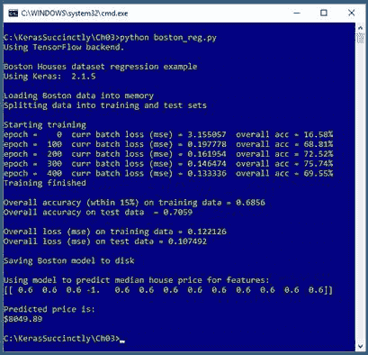
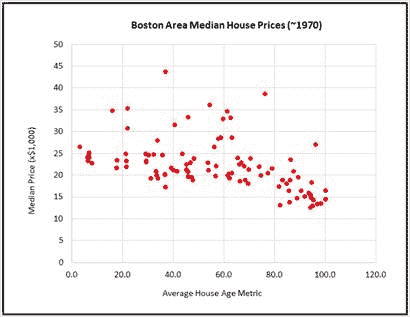

# 三、回归

回归问题的目标是进行预测，其中要预测的变量是单个数值。例如，你可能想根据一个人的年龄、性别、政党归属等等来预测他的年收入。



图 3-1:使用 Keras 的回归

图 3-1 中的截图显示了使用深度神经网络的回归演示。演示程序首先将 506 个数据项加载到内存中。每个项目代表波士顿附近 506 个城镇中的一个城镇的房价中位数。加载后，演示程序以编程方式将数据集分为训练集和测试集。

在幕后，演示程序创建了一个 13-(10-10-1)深度的神经网络。然后，使用 500 个时代训练网络。经过训练，回归模型对训练数据的准确率为 68.56%，对搁置测试数据的准确率为 70.59%。

演示程序最后预测了波士顿附近一个假想的、以前没有出现过的城镇。预测的房价中位数是 8049.89 美元(数据来自 20 世纪 70 年代，当时的房价比现在低得多)。

## 理解数据

波士顿住房数据集是回归问题的一个相当著名的基准。总共有 506 个项目。原始数据如下所示:

0.00632 18 2.31 0.538 6.575 65.2 4.09 1 296 15.3 396.9 4.98 24
0.02731 0 7.07 0.469 6.421 78.9 4.9671 2 242 17.8 396.9 9.14 21.6

每行有 14 个字段。前 13 个是预测值。最后一个值是该镇的房价中位数除以 1000，因此显示的第一个镇的房价中位数为 24000 美元。

前三个预测因子[0]至[2]是人均犯罪率、划作大型住宅用地的土地比例和非零售用地的比例。如果城镇与查尔斯河接壤，则预测值[3]为布尔值(0 =否，1 =是)。

简而言之，剩下的预测指标是:[4] =空气污染度量，[5] =每所房子的平均房间数，[6] =老房子的比例，[7] =到波士顿的加权距离，[8] =高速公路的可到达性指数，[9] =税率，[10] =师生比，[11] =黑人居民比例的衡量标准，以及[12] =社会经济地位较低居民的百分比。

因为数据有 14 个维度，所以不容易可视化。但是，您可以通过查看图 3-2 中的局部图来大致了解数据。



图 3-2:部分波士顿住房数据

该图只绘制了 506 个数据项目中前 100 个项目的中值价格与预测值[6]，即老房子比例的函数关系。从图表中可以看出，仅仅根据老房子比例变量是不可能建立一个准确的预测模型的。

原始数据经过预处理。布尔预测器[3]已从(0，1)虚拟编码转换为(-1，+1)编码。其他 12 个(数字)预测变量被最小-最大归一化，结果所有值都在 0.0 和 1.0 之间。目标中值房价变量已经除以 1000，再除以 10，所有数值都在 1.0 到 5.0 之间。结果数据如下所示:

`0.000000 0.180000 0.067815 -1 . . . 2.400000
0.000236 0.000000 0.242302 -1 . . . 2.160000`

有点幸运的是，除了预测器[3]，所有的预测器变量都是数字的，所以不需要对分类变量进行 1/1(N-1)或可能的一次编码。

## 波士顿计划

代码清单 3-1 显示了生成图 3-1 所示输出的完整程序。该程序首先对程序文件名以及所使用的 Python、TensorFlow 和 Keras 版本进行注释，然后导入 NumPy、Keras、TensorFlow 和 OS 包:

`# boston_reg.py
# Python 3.5.2, TensorFlow 2.1.5, Keras 1.7.0
import numpy as np
import keras as K
import tensorflow as tf
import os
os.environ['TF_CPP_MIN_LOG_LEVEL']='2'`

在非演示场景中，您可能希望在注释中包含更多细节。因为 Keras 和 TensorFlow 正在快速发展，所以您应该始终记录正在使用的版本。在使用 Keras 和其他开源软件时，版本不兼容可能是一个严重的问题。

代码清单 3-1:波士顿住房回归计划

```py
  #
  boston_reg.py
  #
  Python 3.5.2, TensorFlow 2.1.5, Keras 1.7.0

  #
  ==================================================================================

  import numpy as np
  import keras as K
  import tensorflow as tf
  import os
  os.environ['TF_CPP_MIN_LOG_LEVEL']='2'

  class MyLogger(K.callbacks.Callback):
    def __init__(self, n, data_x, data_y, pct_close):

  self.n = n 

  self.data_x = data_x

  self.data_y = data_y

  self.pct_close = pct_close

    def on_epoch_end(self, epoch, logs={}):

  if epoch % self.n == 0:

  curr_loss = logs.get('loss')

  total_acc = my_accuracy(self.model, self.data_x,

  self.data_y, self.pct_close)

  print("epoch =
  %4d  curr batch loss (mse) = %0.6f  overall acc = %0.2f%%" % \

  (epoch, curr_loss, total_acc * 100))

  def my_accuracy(model, data_x, data_y, pct_close):

  num_correct = 0; num_wrong = 0

  n = len(data_x)
    for i in range(n):

  predicted = model.predict(np.array([data_x[i]],
  dtype=np.float32))  # [[x]]

  actual = data_y[i]

  if np.abs(predicted[0][0] - actual) < np.abs(pct_close *
  actual):

  num_correct += 1

  else:

  num_wrong += 1
    return (num_correct * 1.0) / (num_correct + num_wrong)

  #
  ==================================================================================

  def main():
    # 0\. get started

  print("\nBoston
  Houses dataset regression example ")
    np.random.seed(2)
    tf.set_random_seed(3)

  kv = K.__version__

  print("Using
  Keras: ", kv, "\n")

    # 1\. load data

  print("Loading
  Boston data into memory ")

  data_file = ".\\Data\\boston_mm_tab.txt"

  all_data = np.loadtxt(data_file, delimiter="\t", skiprows=0, dtype=np.float32)

  N = len(all_data)

  indices = np.arange(N)
    np.random.shuffle(indices)

  n_train = int(0.80 * N)

  print("Splitting
  data into training and test sets \n")

  data_x = all_data[indices,:-1] 

  data_y = all_data[indices,-1]

  train_x = data_x[0:n_train,:]

  train_y = data_y[0:n_train]

  test_x = data_x[n_train:N,:]

  test_y = data_y[n_train:N]

    # 2\. define model

  init = K.initializers.RandomUniform(seed=1)

  simple_sgd = K.optimizers.SGD(lr=0.010)

  model = K.models.Sequential()

  model.add(K.layers.Dense(units=10,
  input_dim=13, kernel_initializer=init,

  activation='tanh'))  # hidden layer

  model.add(K.layers.Dense(units=10, kernel_initializer=init,

  activation='tanh'))  # hidden layer

  model.add(K.layers.Dense(units=1,
  kernel_initializer=init,
      activation=None))

  model.compile(loss='mean_squared_error', optimizer=simple_sgd, metrics=['mse'])

    # 3\. train model

  batch_size= 8
    max_epochs
  = 500

  my_logger = MyLogger(int(max_epochs/5), train_x, train_y, 0.15)

  print("Starting
  training ")

  h = model.fit(train_x, train_y, batch_size=batch_size, epochs=max_epochs,

  verbose=0, callbacks=[my_logger])

  print("Training
  finished \n")

    # 4\. evaluate model

  acc = my_accuracy(model, train_x, train_y, 0.15)

  print("Overall
  accuracy (wthin 15%%) on training data = %0.4f" % acc)

  acc = my_accuracy(model, test_x, test_y, 0.15) 

  print("Overall
  accuracy on test data  = %0.4f \n" % acc)

  eval = model.evaluate(train_x, train_y, verbose=0)

  print("Overall
  loss (mse) on training data = %0.6f" % eval[0])

  eval = model.evaluate(test_x, test_y, verbose=0)

  print("Overall
  loss (mse) on test data = %0.6f" % eval[0])

    # 5\. save model
    print("\nSaving Boston model to
  disk \n")

  mp = ".\\Models\\boston_model.h5"

  model.save(mp)

    # 6\. use model
    np.set_printoptions(precision=1)

  unknown = np.full(shape=(1,13), fill_value=0.6,
  dtype=np.float32)

  unknown[0][3] = -1.0  #
  binary feature

  predicted = model.predict(unknown)

  print("Using
  model to predict median house price for features: ")

  print(unknown)

  print("\nPredicted
  price is: ")

  print("$%0.2f" % (predicted * 10000))

  #
  ==================================================================================

  if __name__=="__main__":

  main()

```

程序导入整个 Keras 包并分配一个别名`K`。另一种方法是只导入您需要的模块，例如:

`from keras.models import Sequential
from keras.layers import Dense, Activation`

即使 Keras 使用 TensorFlow 作为其后端引擎，您也不需要显式导入 TensorFlow，除非是为了设置其随机种子。导入操作系统包只是为了抑制恼人的 TensorFlow 启动警告消息。

程序结构由一个单独的`main`函数加上助手类`MyLogger`和助手函数`my_accuracy()`组成。之所以需要这些，是因为在回归问题中，没有固有的精度定义——必须定义预测值与正确训练值的接近程度，才能被视为正确预测。

`MyLogger`类初始化器的定义如下:

`class MyLogger(K.callbacks.Callback):
def __init__(self, n, data_x, data_y, pct_close):
self.n = n
self.data_x = data_x
self.data_y = data_y
self.pct_close = pct_close
. . .`

该类继承自 Keras `Callback`基类。正如您将很快看到的，一个`Callback`对象是可以在训练期间通过`fit()`函数自动调用的东西。`MyLogger`初始值设定项函数(类似于其他编程语言中的构造函数)接受一个`pct_close`参数，该参数指定预测值与目标值的接近程度。

`MyLogger`类功能的定义如下:

`def on_epoch_end(self, epoch, logs={}):
if epoch % self.n == 0:
curr_loss = logs.get('loss')
total_acc = my_accuracy(self.model, self.data_x,
self.data_y, self.pct_close)
print("epoch = %4d curr batch loss (mse) = %0.6f overall acc = %0.2f%%" % \
(epoch, curr_loss, total_acc * 100))`

请注意，Python 使用反斜杠字符进行行延续。`on_epoch_end()`方法继承自基础`Callback`类。它将在每个训练周期结束后自动触发。程序使用模数(`%`)运算符将输出限制在每个`n`时期。

该方法从`logs`字典集合中获取内置的`loss`度量值。然后，该方法调用程序定义的`my_accuracy()`函数来计算整个训练数据(不仅仅是当前批次)的预测精度。logger 对象以百分比(如 85.12%)而不是比例(如 0.8512)显示准确性指标，但这是个人偏好的主观问题。

程序定义的精度函数是:

`def my_accuracy(model, data_x, data_y, pct_close):
num_correct = 0; num_wrong = 0
n = len(data_x)`

 `for i in range(n):
predicted = model.predict(np.array([data_x[i]], dtype=np.float32)) # [[x]]
actual = data_y[i]
if np.abs(predicted[0][0] - actual) < np.abs(pct_close * actual):
num_correct += 1
else:
num_wrong += 1
return (num_correct * 1.0) / (num_correct + num_wrong)`

有几个棘手的语法问题。`predict()`方法需要一个矩阵，但是`data_x[i]`是一个向量，所以这些值作为`[data_x[i]]`传递。使用 Keras 时，不要低估遇到各种物体形状问题的频率。

来自`predict()`的预测房价中值回报是存储在 NumPy 数组矩阵中的单个值，因此标量值本身位于`[0][0]`。

## 读取和拆分数据

演示程序开始执行，如下所示:

`def main():
# 0\. get started
print("\nBoston Houses dataset regression example ")
np.random.seed(2)
tf.set_random_seed(3)
kv = K.__version
print("Using Keras: ", kv, "\n")
. . .`

设置 NumPy 和 TensorFlow 全局随机种子是获得可再现结果的一种尝试。种子值`2`和`3`是任意的。演示打印了 Keras 版本，只是为了展示它是如何完成的。使用以下语句将整个 506 项规范化数据读入内存:

`# 1\. load data
print("Loading Boston data into memory ")
data_file = ".\\Data\\boston_mm_tab.txt"
all_data = np.loadtxt(data_file, delimiter="\t", skiprows=0, dtype=np.float32)`

NumPy `loadtxt()`功能简单，功能多样。演示程序使用的策略是将所有数据读入内存，然后将其分成训练矩阵和测试矩阵。主要的替代方法是在加载到内存之前拆分数据集。先读后分的优点是，以稍微多一点的程序代码为代价，保持数据文件更简单。

演示准备数据分割:

`N = len(all_data)
indices = np.arange(N)
np.random.shuffle(indices)
n_train = int(0.80 * N)`

应用于`n`维 NumPy 数组的`len()`函数返回第一维的项数。在这种情况下，这是训练数据中的行数。另一种方法是使用`size()`函数并明确指定尺寸:

`N = np.size(all_data, 0) # 0 = rows, 1 = cols`

对`arange(N)`(“数组-范围”，而不是“排列”)的调用返回从`0`到`N-1`的整数数组。`shuffle()`函数通过引用重新排列参数中的值，因此不需要赋值。训练项目的数量计算为总数的 80%，在本例中为 0.80 * 506 = 404 个项目，剩下 102 个项目用于测试。

拆分数据是通过以下语句完成的:

`data_x = all_data[indices,:-1]
data_y = all_data[indices,-1]
train_x = data_x[0:n_train,:]
train_y = data_y[0:n_train]
test_x = data_x[n_train:N,:]
test_y = data_y[n_train:N]`

索引`[indices,:-1]`是指所有的行，除最后一列之外的所有列。索引`[indices,-1]`指的是所有的行按照打乱的顺序排列，只有最后一列。索引`[0:n_train,:]`是指从第`0`行到第`n_train-1`行，包括所有列。索引`[0:n_train]`是一种替代语法，表示行`0`到`n_train-1`，包括所有列。索引`[n_train:N,:]`是指从`n_train`到`N-1`的行。索引`[n_train,N]`是另一种语法，意思是行`n_train`到`N-1`包括在内。咻！

就我个人而言，我觉得 NumPy 数组索引一点也不直观，当我使用索引时，我总是必须在在线文档中查找语法规则。

## 定义模型

深度神经回归模型由以下代码定义:

`init = K.initializers.RandomUniform(seed=1)
simple_sgd = K.optimizers.SGD(lr=0.010)
model = K.models.Sequential()
model.add(K.layers.Dense(units=10, input_dim=13, kernel_initializer=init,
activation='tanh'))
model.add(K.layers.Dense(units=10, kernel_initializer=init,
activation='tanh'))
model.add(K.layers.Dense(units=1, kernel_initializer=init,
activation=None))
model.compile(loss='mean_squared_error', optimizer=simple_sgd, metrics=['mse'])`

网络模型有 13 个输入节点、两个隐藏层(每个隐藏层有 10 个节点)和一个输出节点。因此，网络具有(13 * 10)+10+(10 * 10)+10+(10 * 1)+1 = 261 个权重和偏差。您可以在没有任何参数的情况下通过调用`model.summary()`函数以编程方式获取该信息。

演示程序通过使用种子值为 1 的`RandomUniform()`函数，加上`minval = -0.05`和`maxval = +0.05`的默认参数值，设置权重初始值来准备模型。演示使用随机梯度下降优化器。默认的学习率是 0.01，所以演示代码可能省略了显式赋值。其他默认参数值为`momentum = 0.0`(无动量)、`decay = 0.0`(无衰减)和`nesterov = False`(未使用内斯特罗夫动量)。

使用`Sequential()`层语法定义模型。没有显式输入图层，所以添加的第一个`Dense()`图层就是第一个隐藏图层。两个隐藏层上的激活都是`tanh`，常用于回归网络，但`relu`有时效果更好。两个隐藏层都有 10 个节点。为回归网络中的所有隐藏层指定相同数量的节点是常见的做法，但不是必需的。

输出层只有一个节点。因为输出节点代表房价中位数，所以可以取任意值，所以不应用激活。`None`的激活值是默认值，因此演示代码可能省略了`activation`参数。

在模型定义语句之后，模型被编译。需要一个`loss`参数值，演示通过`mean_squared_error`，这是回归网络最常见的选择。一种罕见的替代方案是输出节点值被强制到范围(0.0，1.0)，通常通过输出节点上的 sigmoid 激活，并且训练目标值也在范围(0.0，1.0)内，通常通过目标因变量值的最小-最大归一化。

`metrics`参数可选；使用时，它接受一个在训练期间要计算的数量列表。演示通过了“`mse'`，这是`mean_squared_error`的快捷别名。与通常通过`accuracy`的分类问题不同，在回归中没有固有的准确性定义。

您可以单独定义图层并将它们链接在一起，而不是使用`Sequential()`语法:

`init = K.initializers.RandomUniform(seed=1)
simple_sgd = K.optimizers.SGD(lr=0.010)
X = K.layers.Input(shape=(13,))
net = K.layers.Dense(units=10, kernel_initializer=init,
activation='tanh')(X)
net = K.layers.Dense(units=10, kernel_initializer=init,
activation='tanh')(net)
net = K.layers.Dense(units=1, kernel_initializer=init,
activation=None)(net)
model = K.models.Model(X, net)
model.compile(loss='mean_squared_error', optimizer=simple_sgd, metrics=['mse'])`

这两种方法创建了相同的模型并产生了相同的结果，因此选择纯粹是个人编码风格偏好之一。

## 培训和评估模型

演示程序使用以下语句准备培训:

`# 3\. train model
batch_size= 8
max_epochs = 500
my_logger = MyLogger(int(max_epochs/5), train_x, train_y, 0.15)`

批量大小和训练的最大时期数是超参数，好的值必须通过反复试验来确定。`my_logger`对象被实例化为每 max _ epoch/5 = 500/5 = 100 个 epoch 触发一次。由于`on_epoch_end()`方法是如何定义的，这意味着所有 404 个训练项目的当前均方误差损失和预测精度将每 100 个时期显示一次。回想一下，当计算准确度时，如果预测值是正确目标值的正负 15%，则预测是正确的。

通过调用`fit()`功能进行训练:

`print("Starting training ")
h = model.fit(train_x, train_y, batch_size=batch_size, epochs=max_epochs,
verbose=0, callbacks=[my_logger])
print("Training finished \n")`

请注意，演示使用了与参数名相同的参数值名`batch_size`。有些人一贯使用这种风格，而另一些人则不遗余力地避免使用相同的名字。

设置`verbose = 0`在训练期间抑制所有内置的进度消息，但是因为`callbacks`列表有`my_logger`对象，演示将显示自定义消息。

`fit()`函数返回一个保存`History`对象的对象，该对象包含训练期间计算的度量。演示没有使用返回值，但可以这样做:

`loss_list = h.history['loss'] # loss of last batch every epoch
print(loss_list)`

训练后，演示程序计算并打印模型的预测精度:

`# 4\. evaluate model` `acc = my_accuracy(model, train_x, train_y, 0.15)
print("Overall accuracy (within 15%%) on training data = %0.4f" % acc)
acc = my_accuracy(model, test_x, test_y, 0.15)
print("Overall accuracy on test data = %0.4f \n" % acc)`

通常，对测试数据的预测精度应该大致类似于对训练数据的预测精度。如果测试数据的准确性明显低于训练数据的准确性，那么很有可能是你训练模型过于激进，导致模型过度训练。

除了显示预测精度外，演示程序还显示损失值:

`eval = model.evaluate(train_x, train_y, verbose=0)
print("Overall loss (mse) on training data = %0.6f" % eval[0])
eval = model.evaluate(test_x, test_y, verbose=0)
print("Overall loss (mse) on test data = %0.6f" % eval[0])`

`evaluate()`函数返回一个值列表。索引`[0]` 处的第一个值始终是在`compile()`函数中指定的(必需的)`loss`函数的值，在这种情况下是均方误差。列表中的其他值是来自`compile()`功能的任意可选`metrics`。对于本例，以及一般的回归，通常不指定可选指标。

度量包括`mean_squared_error`、`categorical_crossentropy`等`loss`函数，以及分类问题的另外五个精度度量，如表 3-1 所示。

表 3-1:准确度度量函数

| **功能** | **描述** |
| --- | --- |
| `binary_accuracy(y_true, y_pred)` | 对于二分类 |
| `categorical_accuracy(y_true, y_pred)` | 对于多分类 |
| `sparse_categorical_accuracy(y_true, y_pred)` | 很少使用(参见文档) |
| `top_k_categorical_accuracy(y_true, y_pred, k=5)` | 很少使用(参见文档) |
| `sparse_top_k_categorical_accuracy(y_true, y_pred, k=5)` | 很少使用(参见文档)) |

也可以编写定制的、程序定义的度量函数。请注意，快捷别名`acc`可以用于二进制分类，也可以用于多分类。

## 保存和使用模型

演示程序将训练好的模型保存如下:

`# 5\. save model
print("\nSaving Boston model to disk \n")
mp = ".\\Models\\boston_model.h5"
model.save(mp)`

Keras 使用分层数据格式(HDF)版本 5 保存模型。它是二进制格式，所以保存的模型不能用文本编辑器检查。除了保存整个模型，您还可以只保存模型权重和偏差，这有时很有用。您也可以保存模型架构，但不能保存权重。Keras 不支持用 ONNX(开放神经网络交换)格式保存模型。

可以加载已保存的 Keras 模型，如下所示:

`print("Loading a saved model")
mp = ".\\Models\\boston_model.h5"
model = K.models.load_model(mp)`

演示程序使用训练好的模型来预测波士顿附近一个假想的、以前没有见过的城镇的房价中位数:

`# 6\. use model
np.set_printoptions(precision=1)
unknown = np.full(shape=(1,13), fill_value=0.6, dtype=np.float32)
unknown[0][3] = -1.0 # binary feature
predicted = model.predict(unknown)
print("Using model to predict median house price for features: ")
print(unknown)
print("\nPredicted price is: ")
print("$%0.2f" % (predicted * 10000))`

代码设置了 13 个预测变量。回想一下，13 个预测器中有 12 个被最小-最大归一化为 0.0 到 1.0 之间的值，因此在预测时，您也必须使用最小-最大归一化值。预测变量[3]是河流旁边的布尔值，因此必须编码为-1 或+1。

演示程序对所有最小-最大归一化预测值使用 0.6。在非演示场景中，您必须对原始输入数据执行规范化，这意味着您需要训练数据中每个规范化变量的最小值和最大值。这在训练数据和训练模型之间建立了紧密耦合的联系。关键是你必须保留你的训练数据。

## 摘要和资源

当执行神经回归时，您通常希望规范化您的数据。隐藏层的数量和每个隐藏层中的节点数量是必须通过反复试验确定的超参数。最常见的两个隐藏层激活功能是`tanh`和`relu`。输出层应具有单个节点，其激活功能应设置为`None`，除非在异常情况下。

因为回归问题没有固有的精度定义，所以必须定义自己的精度函数。为了在训练过程中监控预测精度，可以实现一个自定义回调类，并将其作为参数传递给`fit()`函数。回归问题的常见训练优化器函数是随机梯度下降和 Adam，但其他优化器的性能通常更好。

演示程序使用的 506 项规范化数据可以在[这里](https://github.com/jdmccaffrey/keras-succinctly/tree/master/Boston)找到。

演示程序使用自定义精度指标(用于回归)。您可以在这里找到关于内置准确性指标(用于分类)[的信息。](https://keras.io/metrics/)