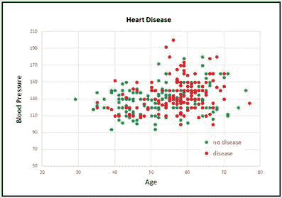
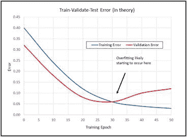

# 四、二分类

二分类的目标是进行预测，其中要预测的变量可以采用两个离散值中的一个。例如，您可能希望根据一个人的年龄、政党归属、年收入等来预测其性别(男性或女性)。二进制分类的工作方式与多分类有些不同，多分类中要预测的变量可以是三个或更多可能的离散值之一。


图 4-1:使用 Keras 的二分类

图 4-1 中的截图展示了二进制分类的演示。演示程序首先将 178 个训练数据项、59 个验证数据项和 60 个测试数据项加载到内存中。每一项代表一个有心脏病(`1`)或没有心脏病(`0`)的患者。原始数据中有 13 个预测变量。经过归一化和编码，有 18 个输入变量。

在幕后，演示程序创建了一个 18-(10-10)-1 深度的神经网络，即一个有 18 个输入值(每个预测值一个)，两个隐藏层都有 10 个节点，以及一个输出节点。演示程序使用 2000 个时代来训练神经网络模型。在训练期间，将显示训练数据和验证数据的损失和准确性值。

训练完成后，训练后的模型对测试数据的预测准确率达到 83.33%(60 分之 50 正确，10 分之 10 不正确)。演示最后预测了一个新的、假设的、以前没有见过的病人。预测概率为 0.0197，由于该值小于 0.5，输出映射到`0`，进而映射到预测“`no heart disease`”

## 理解数据

演示程序使用克利夫兰心脏病数据集，这是一个众所周知的统计和机器学习分类基准数据集。总共有 303 个项目。原始数据如下所示:

`56.0, 1, 2, 120.0, 236.0, 0, 0, 178.0, 0, 0.8, 1, 3, 3, 0
62.0, 0, 4, 140.0, 268.0, 0, 2, 160.0, 0, 3.6, 3, 1, 6, 3
63.0, 1, 4, 130.0, 254.0, 0, 1, 147.0, 0, 1.4, 2, 2, ?, 2
53.0, 1, 1, 140.0, 203.0, 1, 2, 155.0, 1, 3.1, 3, 0, 7, 1
[0] [1] [2] [3] [4] [5] [6] [7] [8] [9] [10] [11] [12] HD`

每行的前 13 个值是预测值。最后一个值是 0 到 4，其中 0 表示没有心脏病，1 到 4 表示某种心脏病。预测因子[0]是患者年龄。预测因子[1]是布尔性别(0 =女性，1 =男性)。预测因子[2]是编码为 1 到 4 的分类胸痛类型。

预测因子[3]是血压。预测因子[4]是胆固醇。预测因子[5]是一个与血糖相关的布尔值(0 =低，1 =高)。预测因子[6]是编码为(0，1，2)的分类心电图结果。预测值[7]是最大心率。预测值[8]是心绞痛的布尔值(0 =否，1 =是)。预测因子[9]是 ST(“S 波，T 波”)图压低。

预测因子[10]是编码为(1，2，3)的分类 ST 度量。预测因子[11]是编码为(0，1，2，3)的彩色荧光血管的分类计数。预测因子[12]是一个与地中海贫血相关的分类值，编码为(3，6，7)。

数据准备的第一步是处理有一个或多个缺失值的六个数据项。我采用了最简单的方法，即删除任何缺少数据的行，留下 297 个数据项。在我看来，提供平均列值之类的替代方法通常不是一个好主意。



图 4-2:部分克利夫兰心脏病数据

原始数据是通过最小-最大标准化五个数值预测变量值，通过(-1，+1)编码三个布尔预测值，以及通过 1-of-(N-1)编码五个分类预测值来准备的。要预测的类别值被编码为 0 表示没有心脏病的迹象，1 表示某种疾病的迹象。我用制表符替换了逗号分隔符。

在处理了缺失值、规范化和编码后，297 个项目的数据集被随机分成三个文件:178 个项目(60%)的训练集、59 个项目(20%)的验证集和 60 个项目(20%)的测试集。

因为克利夫兰心脏病数据集有 13 个维度，所以不可能在二维图形中轻松可视化。但是您可以从图 4-2 中的局部图中大致了解数据。该图仅显示了整个数据集前 160 项的患者年龄和血压。如您所见，使用简单的线性技术(如逻辑回归或基本支持向量机线性模型)不可能获得好的预测模型。

## 克利夫兰计划

代码清单 4-1 显示了生成图 4-1 所示输出的完整程序。程序以注释程序文件名(`_bnn`不是标准约定，只是代表二进制神经网络)和使用的 Python、TensorFlow 和 Keras 版本开始，然后导入 NumPy、Keras、TensorFlow 和 OS 包:

`# iris_dnn.py
# Python 3.5.2, TensorFlow 2.1.5, Keras 1.7.0
import numpy as np
import keras as K
import tensorflow as tf
import os
os.environ['TF_CPP_MIN_LOG_LEVEL']='2'`

在非演示场景中，您可能希望在注释中包含更多细节。因为 Keras 和 TensorFlow 正在快速发展，所以最好记录下正在使用的版本。使用 Keras 和开源软件时，版本不兼容可能是一个严重的问题。

代码清单 4-1:克利夫兰心脏病二分类计划

```py
  #
  cleveland_bnn.py
  #
  Python 3.5.2, TensorFlow 2.1.5, Keras 1.7.0

  #
  ==================================================================================

  import numpy as np
  import keras as K
  import tensorflow as tf
  import os
  os.environ['TF_CPP_MIN_LOG_LEVEL']='2'

  class MyLogger(K.callbacks.Callback):
    def __init__(self, n):

  self.n = n 

    def on_epoch_end(self, epoch, logs={}):

  if epoch % self.n == 0:

  t_loss = logs.get('loss')

  t_accu = logs.get('acc')

  v_loss = logs.get('val_loss')

  v_accu = logs.get('val_acc')

  print("epoch =
  %4d  t_loss = %0.4f  t_acc = %0.2f%%  v_loss = %0.4f  \
  v_acc
  = %0.2f%%" % (epoch, t_loss, t_accu*100, v_loss, v_accu*100))

  #
  ==================================================================================

  def main():
    # 0\. get started

  print("\nCleveland
  binary classification dataset using Keras/TensorFlow ")
    np.random.seed(1)
    tf.set_random_seed(2)

    # 1\. load data

  print("Loading
  Cleveland data into memory \n")

  train_file = ".\\Data\\cleveland_train.txt"

  valid_file = ".\\Data\\cleveland_validate.txt"

  test_file = ".\\Data\\cleveland_test.txt"

  train_x = np.loadtxt(train_file, usecols=range(0,18),

  delimiter="\t",  skiprows=0, dtype=np.float32)

  train_y = np.loadtxt(train_file, usecols=[18],

  delimiter="\t", skiprows=0, dtype=np.float32)

  valid_x = np.loadtxt(valid_file, usecols=range(0,18),

  delimiter="\t",  skiprows=0, dtype=np.float32)

  valid_y = np.loadtxt(valid_file, usecols=[18],

  delimiter="\t", skiprows=0, dtype=np.float32)

  test_x = np.loadtxt(test_file, usecols=range(0,18),

  delimiter="\t",  skiprows=0, dtype=np.float32)

  test_y = np.loadtxt(test_file, usecols=[18],

  delimiter="\t", skiprows=0, dtype=np.float32)

    # 2\. define model

  init = K.initializers.RandomNormal(mean=0.0,
  stddev=0.01, seed=1)

  simple_adadelta = K.optimizers.Adadelta()

  X = K.layers.Input(shape=(18,))
    net
  = K.layers.Dense(units=10,
  kernel_initializer=init,

  activation='relu')(X)

  net = K.layers.Dropout(0.25)(net)  # dropout for layer above

  net = K.layers.Dense(units=10,
  kernel_initializer=init,

  activation='relu')(net) 

  net = K.layers.Dropout(0.25)(net)  # dropout for layer above

  net = K.layers.Dense(units=1,
  kernel_initializer=init,

  activation='sigmoid')(net)

  model = K.models.Model(X, net) 

  model.compile(loss='binary_crossentropy', optimizer=simple_adadelta,

  metrics=['acc'])

    # 3\. train model

  bat_size = 8

  max_epochs = 2000

  my_logger = MyLogger(int(max_epochs/5))

  print("Starting
  training ")

  h = model.fit(train_x, train_y, batch_size=bat_size, verbose=0,

  epochs=max_epochs, validation_data=(valid_x,valid_y),

  callbacks=[my_logger])

  print("Training
  finished \n")

    # 4\. evaluate model

  eval = model.evaluate(test_x, test_y, verbose=0)

  print("Evaluation
  on test data: loss = %0.4f  accuracy = %0.2f%% \n" \

  % (eval[0], eval[1]*100) )

    # 5\. save model

  print("Saving
  model to disk \n")

  mp = ".\\Models\\cleveland_model.h5"

  model.save(mp)

    # 6\. use model

  unknown = np.array([[0.75, 1, 0, 1, 0, 0.49,
  0.27, 1, -1, -1, 0.62, -1, 0.40,

  0, 1, 0.23, 1, 0]], dtype=np.float32)
  # .0197

  predicted = model.predict(unknown)

  print("Using
  model to predict heart disease for features: ")

  print(unknown)

  print("\nPredicted
  (0=no disease, 1=disease) is: ")

  print(predicted)

  #
  ==================================================================================

  if __name__=="__main__":
    main()

```

程序导入整个 Keras 包并分配一个别名`K`。另一种方法是只导入您需要的模块，例如:

`from keras.models import Sequential
from keras.layers import Dense, Activation`

即使 Keras 使用 TensorFlow 作为其后端引擎，您也不需要显式导入 TensorFlow，除非是为了设置其随机种子。导入操作系统包只是为了抑制恼人的 TensorFlow 启动警告消息。

程序结构由一个单独的`main`函数组成，带有一个程序定义的助手类`MyLogger`，用于自定义日志记录。类别定义为:

`class MyLogger(K.callbacks.Callback):
def __init__(self, n):
self.n = n`

 `def on_epoch_end(self, epoch, logs={}):
if epoch % self.n == 0:
t_loss = logs.get('loss')
t_accu = logs.get('acc')
v_loss = logs.get('val_loss')
v_accu = logs.get('val_acc')
print("epoch = %4d t_loss = %0.4f t_acc = %0.2f%% v_loss = %0.4f \
v_acc = %0.2f%%" % (epoch, t_loss, t_accu*100, v_loss, v_accu*100))`

`MyLogger`类仅用于显示自动计算的损失和准确性度量，因此类初始化器不需要接受对训练数据的引用。大多数程序定义的回调会像这样传递信息:

`def __init__(self, n, data_x, data_y):
self.n = n
self.data_x = data_x
self.data_y = data_y`

`on_epoch_end()`方法从内置的`logs`字典中提取当前损耗和精度指标并显示出来。演示程序这样做只是为了使日志显示消息可以减少到每 400 个纪元一次，而不是每个纪元一次。Keras 计算每个训练批次的损失和精度，并在每个时期结束时对所有批次的值进行平均。如果你想要更多的粒度信息，你可以使用`on_batch_end()`方法。

`main()`功能开始于:

`def main():
# 0\. get started
print("\nCleveland binary classification dataset using Keras/TensorFlow ")
np.random.seed(1)
tf.set_random_seed(2)`

`# 1\. load data
print("Loading Cleveland data into memory \n")
train_file = ".\\Data\\cleveland_train.txt"
valid_file = ".\\Data\\cleveland_validate.txt"
test_file = ".\\Data\\cleveland_test.txt"
. . .`

在大多数情况下，你希望你的结果是可复制的。Keras 库使用 NumPy 和 TensorFlow 全局随机数生成器，因此设置`seed`值是一个很好的做法。程序中使用的值`1`和`2`是任意的。但是，请注意，由于并行任务的数值舍入顺序，Keras 程序结果通常不完全可再现。

程序假设训练、验证和测试数据文件位于名为`Data`的子目录中。验证数据的目的是在训练期间监控其丢失和准确性，以防止模型训练过多，这可能导致模型过度拟合。

基本思想如图 4.3 所示。该图表明，随着时间的推移，训练数据的损失/误差将稳步下降。如果您在一组保留的验证数据上测量损失/误差，您可能能够识别模型过度拟合何时开始发生，然后您可以停止训练(称为“提前停止”)。

虽然训练-验证-测试的想法在原则上是好的，但在实践中它通常不太好用。问题是损失/误差值很少以图表上显示的良好、平滑的方式下降。相反，这些值倾向于不规则地跳跃，这使得识别模型过度拟合的开始变得非常困难。



图 4-3:理论上的训练-验证-测试

此外，出于验证目的而保留数据会减少您用于培训的数据量。由于这些原因，训练-验证-测试并不常见。演示程序向您展示了如何使用该技术，因为有时它是有用的，因此如果您看到它被使用，您可以理解它。

演示程序没有任何关于数据文件结构的信息。我建议您在程序中包含注释，解释诸如有多少预测变量、使用的编码和规范化类型等等。这种信息在你写程序的时候很容易记住，但是几周后就很难记住了。

训练、验证和测试数据通过以下语句读入内存:

`train_x = np.loadtxt(train_file, usecols=range(0,18),
delimiter="\t", skiprows=0, dtype=np.float32)
train_y = np.loadtxt(train_file, usecols=[18],
delimiter="\t", skiprows=0, dtype=np.float32)` 

`valid_x = np.loadtxt(valid_file, usecols=range(0,18),
delimiter="\t", skiprows=0, dtype=np.float32)
valid_y = np.loadtxt(valid_file, usecols=[18],
delimiter="\t", skiprows=0, dtype=np.float32)`

`test_x = np.loadtxt(test_file, usecols=range(0,18),
delimiter="\t", skiprows=0, dtype=np.float32)
test_y = np.loadtxt(test_file, usecols=[18],
delimiter="\t", skiprows=0, dtype=np.float32)`

一般来说，Keras 需要将特征数据和标签数据存储在单独的 NumPy 阵列样式矩阵中。将数据读入内存的方法有很多，但`loadtxt()`功能的通用性足以满足大多数问题场景。一种常见的替代方法是使用 Pandas(“Python 数据分析库”)包中的`read_csv()`函数。例如:

`import pandas as pd
train_x = pd.read_csv(train_file, usecols=range(0,18),
delimiter="\t", header=None, dtype=np.float32).values
train_y = pd.read_csv(train_file, usecols=[18],
delimiter="\t", header=None, dtype=np.float32).values`

注意`usecols`可以接受`[0,1,2,3]`这样的列表或者`range(0,4)`这样的 Python 范围。如果使用`range()`功能，注意记住第一个参数是包含的，第二个参数是排他的。

除了逗号字符外，`delimiter`参数的常用值是“\t”(制表符)和“”(单个空格)默认参数值是`None`，表示任何空格。

默认`dtype`参数值为`numpy.float`，是 Python `float`的别名，与`numpy.float64`完全相同。几乎所有 Keras 函数的默认数据类型都是`numpy.float32`，所以程序指定了这种类型。其思想是，对于大多数机器学习问题，使用 64 位值获得的精度优势不值得内存和性能损失。

## 定义神经网络模型

演示程序使用以下代码定义了一个 18-(10-10-1)深度的神经网络:

`# 2\. define model
init = K.initializers.RandomNormal(mean=0.0, stddev=0.01, seed=1)
simple_adadelta = K.optimizers.Adadelta()
X = K.layers.Input(shape=(18,))
net = K.layers.Dense(units=10, kernel_initializer=init,
activation='relu')(X)
net = K.layers.Dropout(0.25)(net) # dropout for layer above
net = K.layers.Dense(units=10, kernel_initializer=init,
activation='relu')(net)
net = K.layers.Dropout(0.25)(net) # dropout for layer above
net = K.layers.Dense(units=1, kernel_initializer=init,
activation='sigmoid')(net)`

 `model = K.models.Model(X, net)
model.compile(loss='binary_crossentropy', optimizer=simple_adadelta,
metrics=['acc'])`

演示设置随机高斯初始权重。深度神经网络通常对权重和偏差的初始值非常敏感，因此 Keras 有几种不同的初始化函数可供您使用。

训练优化器的对象是`Adadelta()`(“自适应增量”)，这是基本随机梯度下降的许多高级变体之一。选择一个 Keras 优化器可能有点吓人。表 4-1 列出了五种最常用的优化器。

表 4-1:五种常见的 Keras 优化器

| **优化器** | **描述** |
| --- | --- |
| `SGD(lr=0.01, momentum=0.0, decay=0.0, nesterov=False)` | 简单神经网络的基本优化器 |
| `RMSprop(lr=0.001, rho=0.9, epsilon=None, decay=0.0)` | 经常与递归神经网络一起使用，非常类似于 Adadelta |
| `Adagrad(lr=0.01, epsilon=None, decay=0.0)` | 通用自适应算法 |
| `Adadelta(lr=1.0, rho=0.95, epsilon=None, decay=0.0)` | Adagrad 的高级版本，类似于 RMSprop |
| `Adam(lr=0.001, beta_1=0.9, beta_2=0.999, epsilon=None, decay=0.0, amsgrad=False)` | 优秀的通用自适应算法 |

Keras 优化器的优势之一是它们都有合理的默认参数值，因此您可以非常容易地尝试不同的优化器。

演示程序分别指定每一层，然后使用`Model()`方法进行组合。另一种方法是使用`Sequntial()`方法。这两种方法创建了完全相同的神经网络，但是在语法方面有很大的不同。这是个人的选择。

演示使用`Dropout()`层。`Dropout`的目的是减少模型过拟合的可能性。从语法的角度来看，您可以在想要应用的图层之后立即放置一个`Dropout()`图层*。单个参数是受影响层中的节点在每次训练迭代中随机下降的百分比。使用`Dropout()`的好处是，它通常可以有效地防止过度拟合。缺点是，您必须处理额外的超参数来定义在哪里应用辍学率，以及使用什么辍学率..*

请注意，可以对神经网络输入层应用 dropout 这有时被称为抖动。然而，在神经网络输入层使用 dropout 是非常罕见的，您应该谨慎使用它。

演示程序使用`relu`(整流线性单元)激活隐藏节点。`relu`激活功能通常比`tanh`或`sigmoid`激活更能抵抗消失梯度问题，该问题会导致训练停滞。

输出层具有单个节点，使用`sigmoid`激活。这将输出节点强制为 0.0 到 1.0 之间的单个值，这可以解释为目标类为 1 的概率(此问题中存在心脏病)。换句话说，如果输出节点值小于 0.5，则预测为 class = 0(无心脏病)；否则，预测为 class = 1(心脏病)。

模型以`binary_crossentropy`为损失函数编制。对于多分类，可以使用`categorical_crossentropy`或者`mean_squared_error`，但是对于二分类问题，可以使用`binary_crossentropy`或者`mean_squared_error`。

`compile()`的`metrics`参数是可选的。演示程序传递一个只包含`'acc'`的 Python 列表，以指示在训练期间应该为每个批次计算分类精度(正确预测的百分比)。

## 培训和评估模型

将训练数据读入存储器并创建神经网络后，程序使用以下语句训练网络:

`# 3\. train model
bat_size = 8
max_epochs = 2000
my_logger = MyLogger(int(max_epochs/5))
print("Starting training ")
h = model.fit(train_x, train_y, batch_size=bat_size, verbose=0,
epochs=max_epochs, validation_data=(valid_x,valid_y),
callbacks=[my_logger])
print("Training finished \n")`

批量是一个超参数，一个好的值必须通过反复试验来确定。`max_epochs`参数也是一个超参数。较大的值通常会导致较低的损失和较高的训练数据准确性，从而有可能过度拟合测试数据。

训练被配置为每 2000 / 5 = 400 个时期显示训练数据和验证数据的损失和准确性。在非演示场景中，您会希望更频繁地看到信息显示。

`fit()`函数返回一个保存完整日志信息的对象。这对于分析拒绝训练的模型有时很有用。演示程序没有使用`h`对象，所以可以省略。

经过培训后，对模型进行评估:

`# 4\. evaluate model
eval = model.evaluate(test_x, test_y, verbose=0)
print("Evaluation on test data: loss = %0.4f accuracy = %0.2f%% \n" \
% (eval[0], eval[1]*100) )`

`evaluate()`函数返回一个 Python 列表。索引[0]处的第一个值是在`compile()`函数中指定的所需损失函数的始终值，在本例中为`binary_crossentropy`。列表中的其他值是来自`compile()`功能的任意可选`metrics`。在本例中，快捷字符串`'acc'`被传递，因此索引【1】处的值保持分类精度。该程序乘以 100，将精度从比例(如 0.8234)转换为百分比(如 82.34%)。

## 保存和使用模型

在大多数情况下，你会想要保存一个训练好的模型，尤其是如果训练花费了几个小时甚至更长的时间。演示程序将训练好的模型保存如下:

`# 5\. save model
print("Saving model to disk \n")
mp = ".\\Models\\cleveland_model.h5"
model.save(mp)`

Keras 使用分层数据格式(HDF)版本 5 保存一个训练好的模型。它是二进制格式，所以保存的模型不能用文本编辑器检查。除了保存整个模型，您还可以只保存模型权重和偏差，这有时很有用。您还可以保存没有权重的公正模型架构。

可以从不同的程序加载保存的 Keras 模型，如下所示:

`print("Loading a saved model")
mp = ".\\Models\\cleveland_model.h5"
model = K.models.load_model(mp)`

保存完全训练好的模型的另一种方法是在训练模型时保存模型的不同版本。您可以将保存代码添加到程序定义的`MyLogger`对象的`on_epoch_end()`方法中，例如:

`def on_epoch_end(self, epoch, logs={}):
if epoch % self.n == 0:
m_name = ".\\Models\\cleveland_" + str(epoch) + "_model.h5"
self.model.save(m_name)`

Keras 还有一个内置的`ModelCheckpoint`回调，它有一些参数允许你做一些事情，比如只有当一个指定的度量提高时才保存(更低的损失，更高的精度)。

演示程序最后做了一个预测:

`# 6\. use model
unknown = np.array([[0.75, 1, 0, 1, 0, 0.49, 0.27, 1, -1, -1, 0.62, -1, 0.40,
0, 1, 0.23, 1, 0]], dtype=np.float32)
predicted = model.predict(unknown)
print("Using model to predict heart disease for features: ")
print(unknown)
print("\nPredicted (0=no disease, 1=disease) is: ")
print(predicted)`

因为模型是使用规范化和编码的数据进行训练的，所以您必须以相同的方式传递规范化和编码的输入值。请注意，要素预测值是作为 NumPy 数组对象传递的。

输出预测是原始的，因为它只是 0.0 到 1.0 之间的一个值，因此，由您来解释其含义。您可以按照以下方式通过编程实现:

`labels = ["no indication of heart disease", "indication of heart disease"]
if predicted < 0.50:
result = labels[0]
else:
result = labels[1]
print(result)`

请注意，可以通过将两个要预测的类编码为(1，0)和(0，1)，然后将问题视为多分类(softmax 输出层激活和分类交叉熵损失)来执行二进制分类。

## 摘要和资源

要执行二进制分类，可以使用 0 或 1 编码对目标标签进行编码。输入图层中的节点数量由规范化和编码数据的结构决定。输出节点数应为 1，输出层上的激活函数应设置为`sigmoid`，因此节点值在 0.0 到 1.0 之间，其中小于 0.5 的值表示类= 0 的预测；否则，预测为 class = 1。

`loss`功能应该设置为`binary_crossentropy`，但是如果愿意的话可以使用`mean_squared_error`。一般来说，您应该将`accuracy`传递给`compile()`功能的可选`metrics`列表。

二进制分类的自由参数包括隐藏层的数量和每个隐藏层中的节点数量、优化器算法(Adagrad、Adadelta 和 Adam 通常是不错的选择)、批处理大小以及要使用的最大训练时期数。

您可以在这里找到演示程序[使用的训练、验证和测试数据。](https://github.com/jdmccaffrey/keras-succinctly/tree/master/Cleveland)

演示程序使用一个自定义的、程序定义的回调类。在此查看关于 Keras 内置回调[的信息。](https://keras.io/callbacks/)

本章描述了五种最常用的训练优化器算法。在此查看所有优化器的信息[。](https://keras.io/optimizers/)