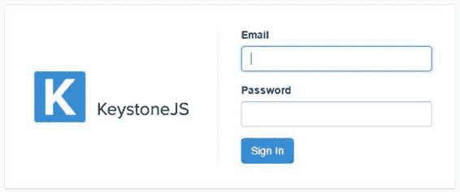
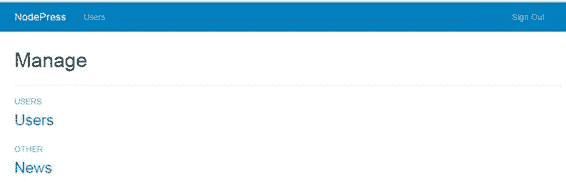
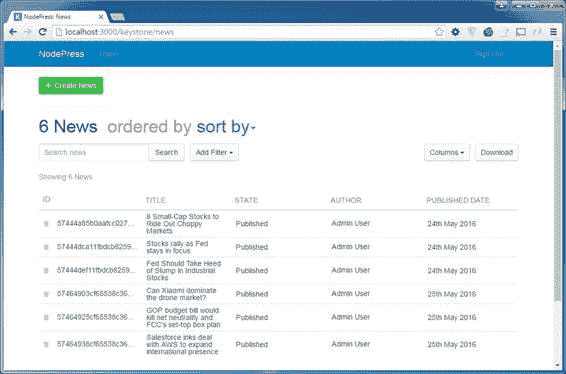
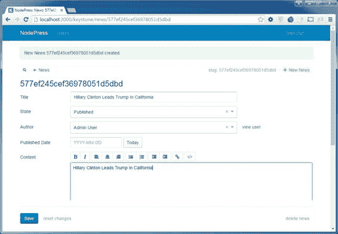
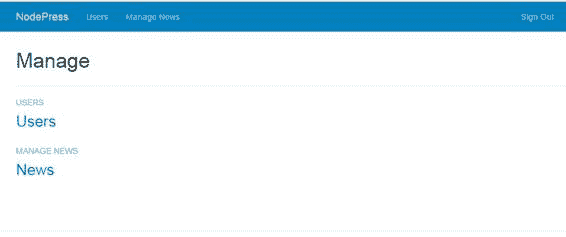
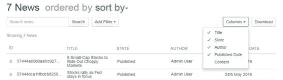
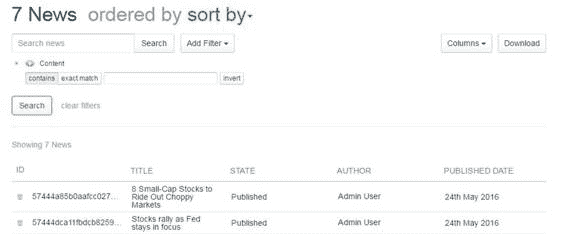
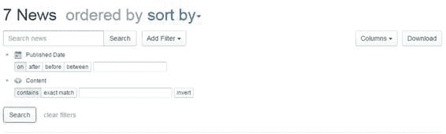

# 八、管理界面

Keystone.js 提供的管理界面可能是 Keystone.js 比其他类似的 Node.js web 框架受欢迎的最好原因。管理界面用最少的配置为开发人员做了很多繁重的工作。它为模型上的创建、更新、删除操作提供了一个功能齐全且极其定制的内容管理系统。在本章中，让我们了解配置和定制管理界面以获得我们想要的功能是多么容易。

可以通过导航至[http://localhost:3000/keystone](http://localhost:3000/keystone)进入管理界面。您将获得一个如图 23 所示的登录界面。



图 23:管理员登录屏幕

要登录到管理面板，请使用在使用 Yeoman 创建项目期间设置的凭据。默认凭据是电子邮件的 [**用户@keystone.js**](mailto:user@keystone.js) 和密码的**管理员**。登录后，您应该会看到类似这样的内容。



图 24:管理界面

在这个屏幕上需要注意的一些事情。首先，默认情况下，Keystone.js 会在导航菜单中添加管理用户的链接。其次，我们保存到**模型**文件夹中的任何模型都将显示在管理区域中，并被分组到**其他**标签下。因此，管理新闻的链接显示在标签**其他**下。

让我们试着编辑一下 MongoDB 数据库中的一个新闻条目。点击**新闻**链接，应该会看到类似如下的画面。



图 25:新闻管理界面

点击顶部绿色的**创建新闻**按钮，填写表格添加新的新闻项目。将创建一个自动生成的表单，如下图所示。通过动态检查模型和模型选项来创建表单。



图 26:添加一个新闻项目

只要确保将**状态**字段设置为**已发布**就可以显示在网站的新闻页面上。**删除新闻**按钮可用于删除不需要的条目。“作者”输入字段会自动显示一个自动完成文本框，因为它在代码中的模型定义过程中被标记为关系字段类型。

管理站点中的菜单项可以在 keystone.js 文件中轻松配置。菜单项存储在以`nav`为键的配置中的一个对象中。让我们将`news`菜单项添加到菜单中。

代码清单 80:更新导航菜单

```js
  keystone.set('nav', {

  'users': 'users',

  'manageNews': 'news'
  });

```

更新后的导航菜单如下图所示。



图 27:修改后的导航菜单

在“管理新闻”屏幕上，我们看到一个组织有序的新闻项目列表。自从我们在`News`模型上配置了相应的选项(`defaultColumns`)后，标题、状态、作者和发布日期都会出现在界面中。回忆一下`News`模型中的以下代码行。

代码清单 81:管理界面上的默认列

```js
  News.defaultColumns
  = 'title, state|20%,
  author|20%, publishedDate|20%';

```

默认列选项是以逗号分隔的默认列列表，显示在管理用户界面列表视图中。您可以在|管道字符后以像素或百分比指定宽度。

我们还可以使用右侧的列下拉菜单选择其他列或从列表视图中删除列，如下图所示。



图 28:动态列

已经定义的列旁边会显示一个复选标记。下拉菜单允许我们选择附加列或动态删除现有列。

大多数管理面板允许用户搜索和过滤内容。Keystone.js 提供了强大的搜索和过滤选项。默认情况下，管理面板中提供的搜索框会对新闻标题进行搜索。我们可以通过在模型上设置`searchFields`选项来指定需要搜索的其他列。



图 29:动态过滤器

图 29 显示了一个添加的过滤器，允许我们搜索内容和标题。我们可以选择搜索完全匹配的内容或包含我们的关键字的内容。反转选项用于否定搜索查询。

Keystone.js 根据字段类型提供了直观而强大的过滤器选项。例如，在图 30 中，我们已经为发布日期启用了过滤器，Keystone.js 自动显示了在两个日期上、之后、之前和之间按日期进行过滤的选项。



图 30:直观的日期过滤器

我们已经介绍了 Keystone.js 管理界面，它让我们几乎可以免费处理常规的创建、读取、更新和删除操作。我们有一种强大而友好的方法来创建测试数据，如果我们愿意，这种方法可以很好地为我们的生产服务。