# 五、使用 LINQ-To-SQL 查询数据库

本章将解释如何使用 LINQPad 执行数据库查询。默认的 LINQ-To-SQL 驱动程序将用于运行这些查询。本章中介绍的所有示例都使用一个数据库，该数据库将填充所有美国邮政编码。该数据库的名称为 **uspostalcodes** 。

## 从 LINQPad 创建数据库

如第 4 章“管理 SQL 连接”一节所述，可以从 LINQPad 创建一个 SQL 数据库。2.

要创建 **uspostalcodes** 数据库，用户应点击**添加连接**超链接，然后从**选择数据上下文**对话框中选择 **LINQ 到 SQL** 驱动程序。单击**下一步**调出 **LINQ 到 SQL 连接**对话框，在此可以创建数据库。

要创建 **uspostalcodes** 数据库(选择其余连接参数后)，请从**数据库**选项组中选择**指定新的或现有的数据库**选项，然后在该选项下方的组合框中键入名称 **uspostalcodes** 。姓名输入完成后，将启用**创建数据库**按钮；点击此按钮，让 LINQPad 创建数据库。在数据库创建后，LINQPad 将在“创建数据库”按钮旁边显示消息“已创建 uspostalcodes”。点击**确定**保存连接信息并显示在用户界面中。

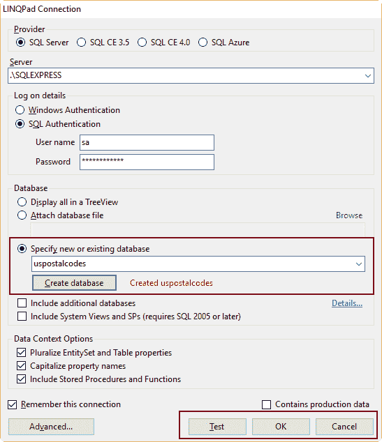

图 33:创建数据库后出现 LINQPad 连接对话框

## 创建数据库的实体

如果您查看用户界面中显示的连接，您会注意到树视图中没有出现任何实体。这意味着 LINQPad 只创建了数据库。数据库的实体创建取决于用户。不幸的是，没有简单的方法可以用 LINQ-To-SQL 来创建数据库的实体。对于这本书，我们将使用微软的 SQL Server 管理工作室。

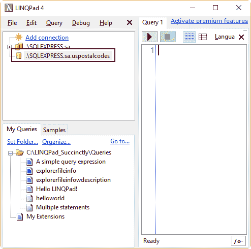

图 34:带 uspostalcodes 连接的 LINQPad 用户界面

您可以通过键入 **ssms** 从**运行**对话框启动 SQL Server 管理工作室。然后，您应该登录到 SQL Server 管理工作室，并在**对象浏览器**中选择 **uspostalcodes** 数据库。然后，点击工具栏中的**新建查询**按钮，打开一个查询选项卡窗口。键入并执行以下代码。

代码清单 10

```cs
  CREATE
  TABLE states
  (state_id
  INT IDENTITY NOT NULL,
   state_name
  VARCHAR(100) NOT NULL DEFAULT '',
   state_abbr
  VARCHAR(4) NOT NULL DEFAULT '');

  ALTER
  TABLE states ADD CONSTRAINT pk_states PRIMARY KEY (state_id);
  CREATE
  INDEX idx01_states ON states (state_name);

  CREATE
  TABLE counties
  (county_id
  INT IDENTITY NOT NULL,
   county_name
  VARCHAR(100) NOT NULL DEFAULT '',
   state_id
  INT NOT NULL DEFAULT 0);

  ALTER
  TABLE counties ADD CONSTRAINT pk_counties PRIMARY KEY (county_id);
  CREATE
  INDEX idx01_counties ON counties (county_name);
  ALTER
  TABLE counties ADD CONSTRAINT fk01_counties FOREIGN KEY (state_id) REFERENCES
  states (state_id);

  CREATE
  TABLE places
  (

  place_id INT IDENTITY NOT NULL,

  place_name VARCHAR(200) NOT NULL DEFAULT '',

  postal_code CHAR(5) NOT NULL DEFAULT '',

  latitude DECIMAL(12,4) NOT NULL DEFAULT 0,

  longitude DECIMAL(12,4) NOT NULL DEFAULT 0,

  county_id INT NOT NULL DEFAULT 0
  );

  ALTER
  TABLE places ADD CONSTRAINT pk_places PRIMARY KEY (place_id);
  CREATE
  INDEX idx01_places ON places (place_name);
  ALTER
  TABLE places ADD CONSTRAINT fk01_places FOREIGN KEY (county_id) REFERENCES
  counties (county_id);

```

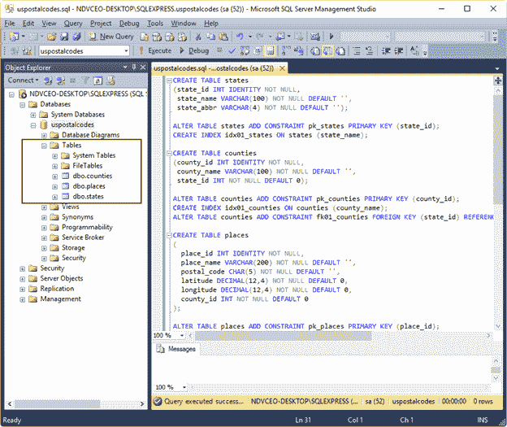

图 35:创建了实体的 Uspostalcodes 数据库，显示在 SQL Server 管理工作室中

### 填充数据库

现在，数据库需要填充数据。将使用三个数据集。

*   包含所有国家/地区的 SQL 脚本。
*   包含属于每个州的所有县的 SQL 脚本。
*   包含所有地点、邮政编码及其地理参考的 SQL 脚本。

由于本书的篇幅限制，这里不可能显示这些脚本。这三个脚本(`states:table,sql`、`us_counties.sql`、`us_places.sql`)都在代码样本包中，可以在[这里](https://bitbucket.org/syncfusiontech/linqpadsuccinctly)下载。

下图显示了用脚本填充后的状态表。

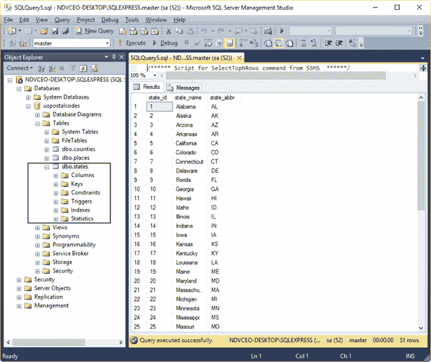

图 36:填充数据后的状态表

### 在 LINQPad 显示数据库变化

如第 4 章的“连接上下文菜单”一节所述，一组上下文菜单命令可用于 LINQPad 用户界面中显示的任何连接。为了查看对 **uspostalcodes** 数据库所做的所有更改，用户应该在窗口中的任意位置单击鼠标右键，然后从上下文菜单中选择**刷新**命令。现在，在 SQL Server 管理工作室中创建的实体将出现在屏幕上。

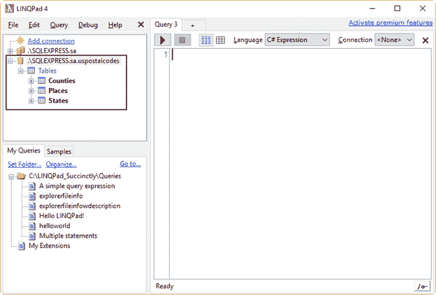

图 37: Uspostalcodes 数据库实体，显示在 LINQPad 用户界面中

## 从表中检索行

此时，假设所有的表都被数据填满了。但是，本节讨论的所有示例都使用`States`表。

### 返回一定数量的行

`Take`方法返回的行集与作为参数传递的整数值一样大。要从`States`表中获取前 15 行，从**语言**选择器中选择 **C# 表达式**，并选择**。\ SQLEXPRESS . sa . uspostal codes**连接来自**连接**选择器。之后，键入并执行以下代码。

代码清单 11

```cs
  States.Take(15)

```

前面代码的输出如图 38 所示。

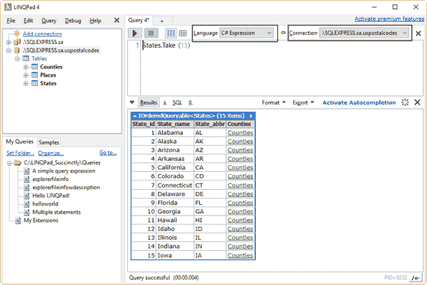

图 38:状态表的前 15 行

尽管`States`表只有三列，但请注意，在上图中，结果中显示了第四列，值为`Counties`。查看在数据库中创建所有实体的脚本，您可以看到有一个带有外键定义的 SQL 语句使用了`Counties`表。该外键使用名为`State_id`的列引用表`States`。因此，当执行`Take`方法时，LINQ-To-SQL 会自动找到引用，LINQPad 会创建一个指向`Counties`表的超链接。该超链接是为方法检索的每一行创建的。如果用户点击这些超链接中的任何一个，LINQPad 将显示从`Counties`表中设置的行，其中`State_id`列值在`States`和`Counties`表中都匹配。

|  | 注意:当使用 LINQ-To-SQL 时，LINQPad 会自动查找作为查询一部分的表的所有引用。这意味着，当用户单击相关的表超链接并且显示该表的行时，如果找到另一个关系，则可能会显示嵌套的引用超链接。 |

### 使用λ表达式

术语*λ表达式*来自λ演算，这是一种用于定义函数的数学符号。这些表达式是使用以下语法创建的。

代码清单 12

```cs
  (input
  parameters) => statement block or expression

```

下面的代码片段显示了 lambda 表达式的一个示例。

代码清单 13

```cs
  y
  => y * 3

```

在上一个示例中，lambda 表达式指定了一个名为`y`的参数，该表达式的语句将参数值乘以`3`。

当在查询运算符中使用 lambda 表达式时，它将根据需要由该查询运算符进行计算。该布尔查询评估应用于输入序列中的所有元素，并且只有那些满足过滤条件的元素被传递到附加函数中。下面的示例从给定的数组中获取奇数，并计算所有这些值的平均值。

代码清单 14

```cs
  int[]
  numbers = {1,1,2,3,5,8,13,21,34};
  double
  average = numbers.Where(number => number % 2 == 1).Average();
  Console.WriteLine(average);

```

在前面的例子中，`Where`方法中的 lambda 表达式是为列表中的所有数字计算的。这些数字中的每一个都被用来得到除以 2 后的余数。如果运算结果等于`1`，则`Average`方法将考虑评估的数字。获得的结果显示在下面的代码片段中。

代码清单 15

```cs
  7.3333333

```

### 排序行

如同在`Average`计算示例中一样，LINQ-To-SQL 查询运算符可以使用 lambda 表达式。下面的代码从`States`表中获取前 15 行，并使用存储在`State_name`列中的值对这些行进行排序。

代码清单 16

```cs
  States.Take(15).OrderBy(row
  => row.State_name)

```

在这种情况下，`OrderBy`方法中使用的 lambda 表达式采用名为`row`的参数，该参数以逐个序列的方式接收由`Take`方法返回的 15 行中的每一行。表达式中执行的语句将每一行的`State_name`列的值发送给`OrderBy`方法。当行序列结束时，`OrderBy`方法根据收到的值对所有行执行字母排序。

前面代码的输出如图 39 所示。

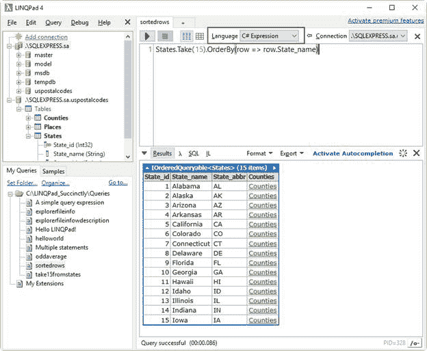

图 39:对行进行排序的查询结果

### 使用聚合函数

LINQPad 允许您使用 SQL 聚合函数，如`Count`、`Sum`或`Avg`(平均值)，作为 LINQ 到 SQL 的查询方法。这些方法中的每一个都被视为模型中每个表的扩展方法。假设所有表都已经填充了数据，下面的示例将检索`Places`表的总行数。

代码清单 17

```cs
  Places.Count()

```

显示的输出应该如下所示。

代码清单 18

```cs
  Places.Count(row => row.County_id == 1926)

```

Lambda 表达式也可以用来限制查询返回的结果。例如，如果你需要知道属于`id 1926`县的地方数量，你应该执行下面的代码。

代码清单 19

```cs
   Places.Count(row
  => row.County_id == 1926)

```

同样，lambda 表达式接受一个行参数并执行一个布尔比较语句，该语句将为在`County_id`列中具有值`1926`的每一行返回`true`。每次返回真值时，`Count`方法将其结果增加`1`。如果没有与布尔语句匹配的行，LINQPad 将不返回任何内容。

显示的输出应该如下:

代码清单 20

```cs
  24

```

|  | 注意:Sum 和 Average(平均值)查询方法需要使用 lambda 表达式。 |

## 过滤和分组行

LINQPad 允许您使用以下方法使用 LINQPad 到-SQL 表达式来筛选和分组行。

*   `Where`:取一个 lambda 表达式，该表达式返回一个布尔值`true`或`false`值，该值将告诉方法哪些元素必须包含在查询结果中。
*   `GroupBy`:接受一个 lambda 表达式，该表达式返回一个值来对行进行分组。然后，返回一组`IGrouping`对象。也就是群体的集合。名为`Key`的特殊属性被添加到这些组中的每一个。此属性保存用于对行进行分组的值。组本身是从使用方法的实体获取的数据行的集合。

### 过滤行的例子

假设需要一个属于一个县的所有地方的列表，并带有`id` `1926`，则应执行以下代码。

代码清单 21

```cs
  Places.Where(row => row.County_id == 1926)

```

`Where`方法将按顺序迭代`Places`表，lambda 表达式将接收每一行作为参数。然后，它将为那些“T3”列的值等于“T4”的行返回一个“T2”值。一个`true`值告诉`Where`方法将该行包含在查询结果中。一个`false`值将导致`Where`方法丢弃该行。

前面代码的结果如图 40 所示。

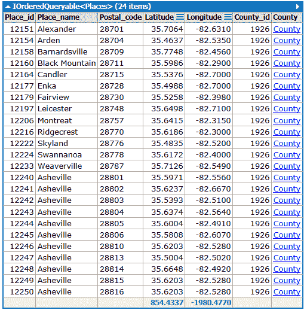

图 40:过滤后的查询结果

### 分组行的例子

上一节中解释的示例根据`County_id`列的值返回一个行集。现在，假设用户想要从`Places`表中检索所有行，但是按县分组。这可以通过执行以下代码来实现。

代码清单 22

```cs
  Places.GroupBy(row
  => row.County_id)

```

该示例对`Places`表使用`GroupBy`方法。该方法采用 lambda 表达式，该表达式返回`County_id`列的值。该值将用于对整个表的行进行分组。因此，对于`County_id`具有相同值的所有行将被收集在同一个集合中。集合的总数取决于表中`County_id`有多少不同的值。图 41 显示了查询的部分结果。

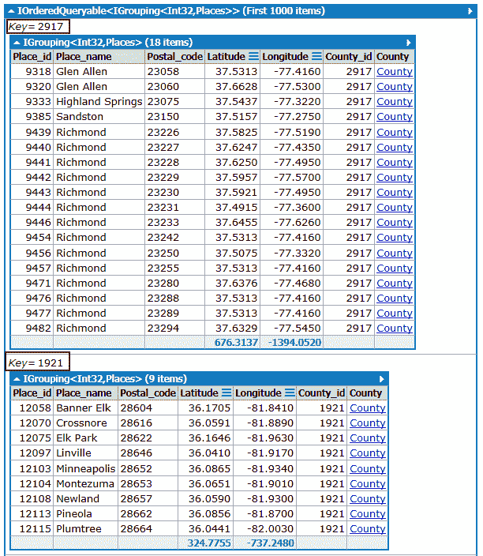

图 41:分组方法的结果

请注意，在图 41 中，`Key`属性的值高亮显示。由于`County_id`柱为`integer`型，物业也采用这种类型。因此，查询返回的结果是一个`IGrouping<Int32, Places>`集合，如同一图所示。

## 查询具体栏目

到目前为止讨论的所有查询都显示属于查询表的所有列。但是 LINQ-To-SQL 允许我们选择一组特定的由查询返回的列。这个任务可以用`Select`方法完成。以下示例从`Places`表中返回`Place_id`、`Place_name`和`Postal_code`。

代码清单 23

```cs
  Places.Select(row
  => new {row.Place_id, row.Place_name, row.Postal_code})

```

`Select`方法使用一个 lambda 表达式来查询一个表作为序列，在这种情况下就是`Places`表。lambda 表达式的`row`参数一次从表中取一行。lambda 表达式中的语句针对传递给参数的每一行执行，并为`IOrderedQueryTable<>`集合创建一个新项。该项目填充有`Place_id`、`Place_name`和`Postal_code`列的内容。

上一个查询的部分结果如图 42 所示。

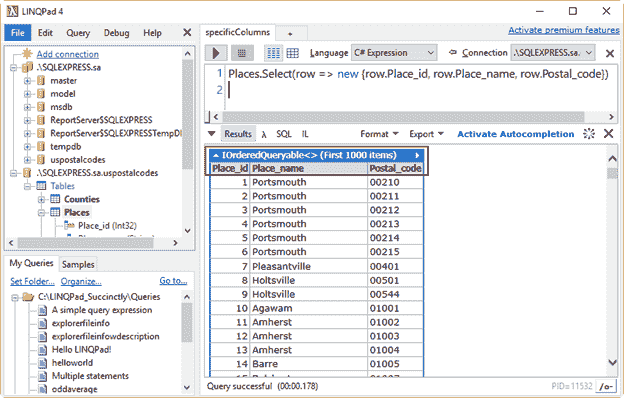

图 42:带有特定列的查询

## 把所有放在一起

前面几节中解释的所有方法都可以一起使用，以便检索更复杂的结果。

以下代码返回属于县的所有地方的`Place_id`、`Place_name`和`Postal_code`列，其`id`为`1926`。

代码清单 24

```cs
  Places.Where(row
  => row.County_id == 1926).Select(row => new {row.Place_id,
  row.Place_name, row.Postal_code})

```

前面的例子使用了`Where`和`Select`两种方法来合成结果。在这种情况下，`Where`方法将确保`Select`方法只查询那些值为`1926`的行的`County_id`列。如前一节所述，`Select`方法将按顺序读取表格，并进行`IOrderedQueryTable<>`收集。该集合的所有项目将填充`Place_id`、`Place_name`和`Postal_code`列的值。

上一次查询显示的结果不以任何方式排序，因此可以使用`OrdeBy`方法显示按任意给定列排序的结果。

以下代码将根据`Place_name`列的值对结果进行排序。

代码清单 25

```cs
  Places.Where(row
  => row.County_id == 1926).OrderBy(row => row.Place_name).Select(row
  => new {row.Place_id, row.Place_name, row.Postal_code})

```

上一个示例使用`OrderBy`方法对`Where`方法返回的行进行排序。`Select`方法在排序后读取行，用`Place_id`、`Place_name`和`Postal_code`列的值创建一个`IOrderedQueryTable<>`集合。

## LINQ-to-SQL 用多条语句

LINQPad 还允许您使用多条语句执行 LINQPad 到-SQL 查询。要执行这些类型的查询，您应该从**语言选择器**组合框中选择 **C# 语句**。

代码清单 26

```cs
  var
  places = Places.GroupBy(row => row.County_id);
  var
  placesSorted = from place in places orderby place.Key

  select place;
  placesSorted.Dump();

```

前面的代码返回了一个行集合，这些行通过使用`County_id`列中包含的值进行分组。该集合存储在`places`变量中。第二行代码中使用的`from`语句以一个接一个的顺序从 places 变量中获取每个组。每个组都存储在`place`变量中，`select`语句将该组添加到集合中。集合存储在`placesSorted`变量中。`orderby`语句使用每个`place`组的`Key`属性值对集合进行排序。

## 表语构建器类

LINQPad 包含一个名为`PredicateBuilder`的特殊类。这个类是一个强大的 LINQ 表达式，当使用太多的过滤器参数时，它简化了查询编程。该类通过基于 lambda 表达式的结果编写动态查询语句来解决这个问题，lambda 表达式被提供给一组旨在充当逻辑比较运算符的特殊方法。`PredicateBuilder`是一个泛型类，这意味着它可以接收连接使用的数据库的任何实体引用。`PredicateBuilder`类的使用带来了更好的性能，并最小化了为过滤器实现而编写的代码量。

使用`PredicateBuilder`类编写查询需要在 LINQPad 中引用该类。为此，按下 **F4** 并选中**包含预测生成器**复选框，如下图所示。

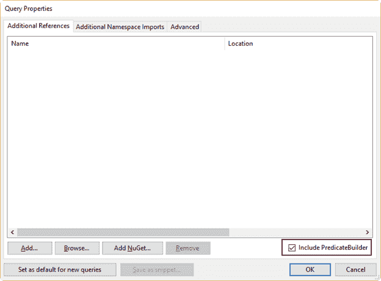

图 43:查询属性对话框，包括预测生成器类

接下来，点击**确定。**LinkPad 现在可以在当前查询中使用该类。

|  | 注意:每次写入新查询时，都必须选中包含预测生成器复选框。 |

### 一个使用谓词构建器的查询

下面的示例假设用户想要获取在`State_id` 列中值在`1`和`19`之间的所有县。

代码清单 27

```cs
  var
  resultSet = Counties.Where(row => (row.State_id > 0 &&
  row.State_id < 20));
  resultSet.Dump();

```

前面的代码看起来像本书前面讨论过的任何一个示例，对于获得期望的结果来说，它工作得很好。但是如果用户想要应用更复杂的过滤条件，`Where`方法中的 lambda 表达式将在代码中增加。此时，查询将变得更加难以维护。

`PredicateBuilder`类通过负责为`Where`子句动态构建 lambda 表达式来解决上一段中陈述的问题。因此，用户不需要在`Where`子句中对表达式进行硬编码。相反，`PredicateBuilder`类的一个实例被传递给`Where`方法，这个实例创建了该方法工作所需的 lambda 表达式。现在，上一个查询的代码看起来像下面的示例。

代码清单 28

```cs
  var
  predicate = PredicateBuilder.False<Counties>();
  predicate
  = predicate.Or(row => row.State_id > 0);
  predicate
  = predicate.And(row => row.State_id < 20);
  var
  resultSet = Counties.Where(predicate);
  resultSet.Dump();

```

如前面的代码所示，第一行创建了`PredicateBuilder`类的实例，引用了`Counties`表。然后，查询调用`PredicateBuilder`类的`Or`方法，并向其传递一个 lambda 表达式。该表达式为`State_id`列返回大于`0`值的每一行。下一行使用`And`方法建立过滤条件的另一部分。在这种情况下，表达式将为`State_id`列返回值小于`20`的每一行。现在`PredicateBuilder`类的实例被传递给`Where`方法，而不是 lambda 表达式，因为这个实例将在方法执行时负责构建那个表达式。

|  | 注意:为了正确构建 lambda 表达式，必须首先调用`"`或`"`方法。 |

也许对于一个简单的表达式，就像本节示例中讨论的，使用`PredicateBuilder`类将代码变成更多的行。但是随着过滤条件变得越来越复杂，代码变得越来越简单。下面的代码将另一个筛选条件添加到查询中。

代码清单 29

```cs
   var
  predicate = PredicateBuilder.False<Counties>();
  predicate
  = predicate.Or(row => row.State_id > 0);
  predicate
  = predicate.And(row => row.State_id < 20);
  predicate
  = predicate.Or(row => row.County_name.Contains("Orange"));
  var
  resultSet = Counties.Where(predicate);
  resultSet.Dump();

```

如前一个示例中所述，查询结果将返回在`County_name`列中包含短语`Orange`的所有行，除了其中`State_id`列的值大于`0`且小于`20`的所有行。谓词实例将创建的 lambda 表达式如下。

代码清单 30

```cs
  row
  => (row.State_id > 0 && row.State_id < 20) ||
  row.County_name.Contains("Orange")

```

如前一个示例中所述，该表达式稍微复杂一点，如果用户想要检索匹配更多筛选条件的行，则该表达式会更大。所以，重复调用`And`或`Or`方法比创建复杂的表达式更容易。

### 一个多关键词搜索

有时，您希望基于一个或多个关键字在数据库中搜索行。为此使用 lambda 表达式可能会使查询的代码变得复杂且难以维护。因此，可以使用`PredicateBuilder`实例来动态执行搜索，而不是对 lambda 表达式进行硬编码，如下例所示。

代码清单 31

```cs
  var
  keywords = new List<string>
  {"Orange","York","Fernando"};
  var
  predicate = PredicateBuilder.False<Counties>();

  foreach
  (string keyword in keywords)
  {

  predicate = predicate.Or(row => row.County_name.Contains(keyword));
  }
  var
  resultSet = Counties.Where(predicate);
  resultSet.Dump();

```

前面的代码基于存储在`keywords`变量中的关键字在`Counties`表中执行搜索，该变量是字符串列表。创建一个`PredicateBuilder`实例，并使用`foreach`循环重复调用`Or`方法。对于列表中的每一项，`Or`方法接收一个 lambda 表达式，该表达式返回一个`true`或一个`false`值，无论该关键字是否包含在`County_name`列中。

谓词由与`Counties`表相关联的`Where`方法使用，并作为结果返回包含列表中任何关键字的所有行。

## 章节总结

本章讨论了如何使用默认的 LINQPad 到-SQL 驱动程序用 LINQPad 创建数据库查询。本章中解释的所有样本都使用名为 **uspostalcodes** 的数据库。要创建该数据库，使用**添加连接**超链接调用**选择数据上下文**对话框来选择 LINQ 到 SQL 驱动程序。然后，LINQ 到 SQL 连接对话框允许您创建 **uspostalcodes** 数据库。

没有办法使用 LINQ-To-SQL 来创建数据库实体，所以您将使用 Microsoft SQL Server Management Studio 来创建数据库表。一旦它们被创建，您将使用一系列脚本来用数据填充表。

LINQ-To-SQL 有一系列从给定表中检索行的方法。例如，`Take`方法返回一个行集，该行集与作为参数传递给该方法的整数参数的值一样大，`OrderBy`方法允许您对查询返回的行进行排序。

有些方法需要 lambda 表达式才能正常工作。术语*λ表达式*来自*λ*微积分，这是一种用于定义函数的数学符号。lambda 表达式由一个参数和一个接受该参数并使用它返回值的表达式组成。

使用 lambda 表达式的方法有:`OrderBy`(对行进行排序)、`Where`(根据条件表达式筛选行)、`Sum`(汇总给定列的值)、`Average`(从给定列的一系列值中获取平均值)和`GroupBy`(根据给定列的值对行进行分组)。

根据用户的需要，LINQ-To-SQL 查询可以写成一个 C# 表达式或几个 C# 语句。

LINQPad 提供了一个名为`PredicateBuilder`的特殊类。当需要复杂的筛选条件时，这个类旨在简化查询编写。该类通过提供一组用作逻辑比较运算符的特殊方法来解决这个问题。因为`PredicateBuilder`是一个泛型类，所以它可以接收连接使用的数据库的任何实体引用。

当类的实例被传递给任何 LINQ-To-SQL 方法时，`PredicateBuilder`类的价值来自于它动态构建任何 lambda 表达式的能力。使用传递给类实例的值，使用`And`或`Or`方法创建表达式，在使用实例之前应重复调用这些方法。

编写使用`PredicateBuilder`类的查询需要在 LINQPad 中引用这个类。这可以通过按下 **F4** 并选中出现在**查询属性**对话框中的**包含预测生成器**复选框来完成。每次编写新查询时，都需要执行此操作。