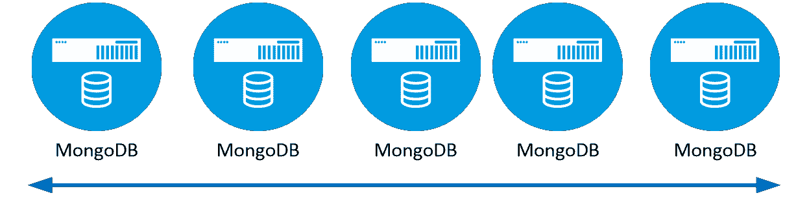
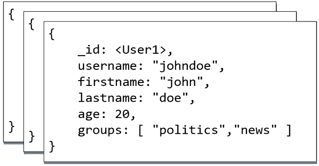
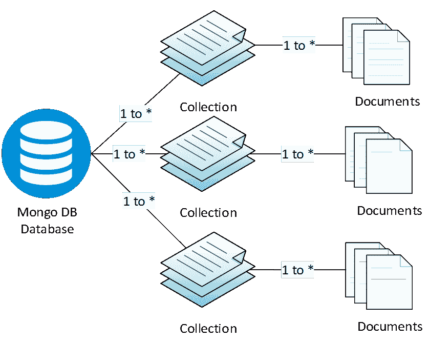
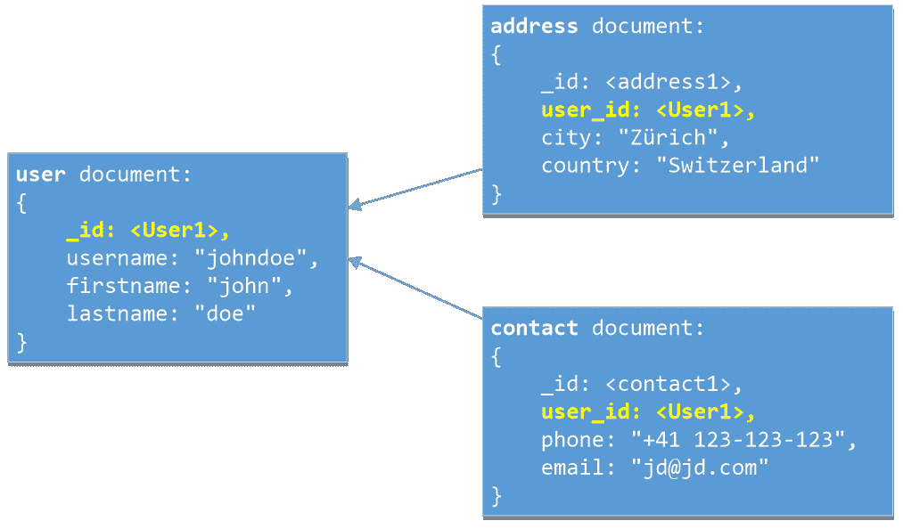
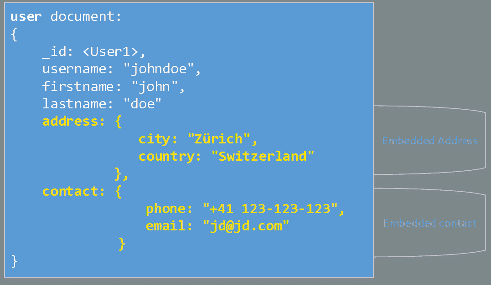
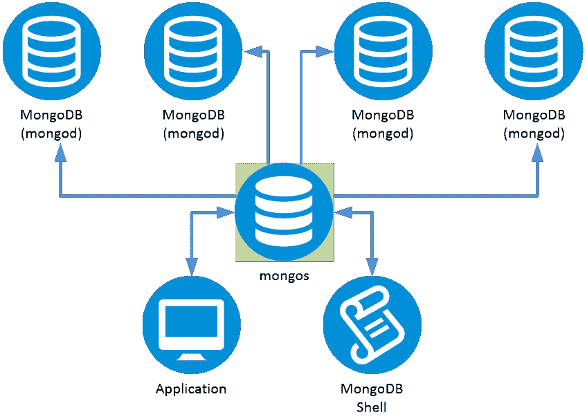

# 一、MongoDB 概述

MongoDB 是一个开源的*文档数据库*，提供高性能、高可用性和自动伸缩。MongoDB 是根据通用公共许可证(GPL)免费提供的，作为公司商业产品的一部分，它也是根据商业许可证提供的。在本书中，我们将讨论免费版本提供的功能。

MongoDB 是所谓的 NoSQL 数据库的许多实现之一，它目前是这一市场领域最大的参与者之一。

## NoSQL 和文件数据库

如果你是 NoSQL 世界的新手，我们需要介绍几个概念。

一般来说，有三类数据库:

*   关系数据库管理系统(关系数据库管理系统)
*   OLAP ( [在线分析处理](https://en.wikipedia.org/wiki/Online_analytical_processing))
*   [NoSQL](https://en.wikipedia.org/wiki/NoSQL)

作为开发人员，我们通常更熟悉关系数据库，如微软的 SQL Server、Oracle、MySQL 和 Postgres，以及这些数据库以表格格式组织数据的方式。从历史上看，关系数据库的使用最为广泛，尤其是在企业领域，这也是事实。

NoSQL(最初指“非 SQL”、“非关系”或“不仅仅是 SQL”)是另一种类型的数据库，它提供了一种存储和检索数据的机制，并且它通常以不同于关系数据库的方式处理数据。

NoSQL 数据库的存在是为了解决特定领域的特定问题，而不是解决任何问题的“灵丹妙药”，因为它们各有利弊。NoSQL 数据库试图解决的一些主要问题是可伸缩性和数据量的问题。

关于 [CAP 定理](https://en.wikipedia.org/wiki/CAP_theorem)，NoSQL 数据库经常为了可用性和分区容差而牺牲一致性。在 NoSQL 世界，“最终一致性”通常用于实现速度和可伸缩性。

### 可扩展性

NoSQL 数据库的优势之一是支持*水平* [可伸缩性](https://en.wikipedia.org/wiki/Scalability)*T5(或*横向扩展)*，这在关系数据库管理系统中是可用的，但更加有限和昂贵。水平可伸缩性意味着我们可以通过增加更多的服务器(节点)来扩展系统的容量。然后，性能几乎与系统中的节点数量成线性比例。*

这种横向可伸缩性的想法不同于*纵向可伸缩性*，通常为了处理更多的数据，我们通过增加更多的内存、HDD 空间、CPU 等来升级服务器本身。

横向扩展通常是更便宜和更灵活的选择，因为它使用常规的商品硬件，而纵向扩展通常要贵得多，因为随着硬件变得越来越复杂，其成本往往会呈指数级增长，最终其扩展会有更多的限制。

图 1:水平可伸缩性。

### 实现

NoSQL 数据库包括各种各样的实现(通常不包括表格格式)，这些实现是为了应对数据量的增加而开发的。这里列出了各种口味:

*   **文档数据库**将每个键与称为文档的复杂数据结构(MongoDB、Couchbase Server、CouchDB、RavenDB 等)配对。
*   **键值存储**是最简单的 NoSQL 数据库。数据库中的每一项都以属性名(或“键”)的形式存储，以及它的值(DynamoDB、Windows Azure 表存储、Riak、Redis、LevelDB、Dynomite)。
*   **宽列**存储如 Cassandra 和 HBase 针对大型数据集上的查询进行了优化，将数据的列存储在一起，而不是行。
*   **图形**商店用于存储关于网络的信息，例如社交联系。图形存储包括 Neo4J 和 HyperGraphDB。

### NoSQL:少了什么？

与关系数据库管理系统相比，NoSQL 数据库通常不支持或很少支持以下内容:

*   **有限或不支持 JOINS (INNER、OUTER 等)**。):对数据的访问是在文档级别完成的，因此对象之间链接的处理必须在应用级别完成。
*   **没有复杂的事务支持** : NoSQL 数据库通常支持最终的一致性事务，并且通常不支持批量更新，而是处理单个项目。
*   **不支持约束** : [约束](https://en.wikipedia.org/wiki/Relational_database#Constraints)不是在数据库级别实现的，而是在应用级别实现的。

## 数据库结构

正如我们前面提到的，MongoDB 是一个文档数据库，在数据表示方面非常简单。最简单的数据库由两项组成:`document`，包含数据，`collection`，是文档的容器。

### 文件

A `document`是由`field`和`value`对组成的数据结构。`Document`基本上是一个 [JSON](http://www.json.org) 对象，MongoDB 以二进制(BSON)格式存储在磁盘上。

图 2 显示了一个代表用户的`document`的例子。它与任何 JSON 表示都没有什么不同，所以您应该熟悉格式。正如我们稍后将看到的，使用了一些约定，例如`_id`字段，它是本文档的主键，从这个意义上说，`<User1>`只是主键的一个值。

图 2:一个非常简单的文档的例子。

BSON 是 JSON 的二进制编码序列化表示。但是，BSON 支持的数据类型比 JSON 多(比如`Date`类型)，可以和谷歌的 [ProtoBuf](https://developers.google.com/protocol-buffers) 相比。(你可以在这里找到更多关于 BSON 格式[的信息。)](http://bsonspec.org/)

|  | 提示:在关系数据库管理系统世界中，我们可以把一个文档看作是一个表的“记录”。 |

文档大小有一个硬限制，最大为 16 兆字节。即使是最新版本的数据库，这个限制也没有改变。这很有意义，因为最大大小限制确保单个文档不能使用过多的内存或带宽。为了存储大于最大大小的文档，MongoDB 提供了`GridFS` API，这将在第 10 章中讨论。

### 收藏

MongoDB 将文档存储在集合中。集合可以看作类似于关系数据库管理系统中的一个表。除非另有说明，否则集合中的每个文档都有一个由数据库自动分配的`_id`。需要注意的一点是，集合不像一个表，其中的一组列(属性)必须是预定义的；集合是无模式的；因此，集合可以包含任何种类的内容。然而，在一个集合中拥有完全不同的数据集是不太实际的(因为这在技术上是可能的)，除非在一些非常特殊的用例中(数据收集、日志等)。通常情况下，对象在应用级别被序列化，然后存储在数据库中。因此，即使模式没有强制实施，对集合中数据的某种控制也将存在。

## 文档中的思考

关系数据库和 MongoDB 之间最大和最基本的区别之一是数据建模和表示数据结构的方式。

图 3: MongoDB 数据结构组织。

在 MongoDB 中，数据关系可以由嵌入的文档或引用来表示。引用相当于 RDMBS 中外键的使用；但是，MongoDB 中对联接的支持是存在的，但是非常有限。

从技术上讲，有一种方法可以通过使用聚合框架中的`lookup`功能，或者通过`LINQ`查询(下面使用聚合框架来构造查询)来连接这两个集合。

### 参考文件

引用文档可以被看作是标准化 RDMBS 中数据的一种标准方式，其中表通过外键链接。从这个意义上来说，MongoDB 并没有什么不同。

简而言之，通过将数据规范化为单个集合，我们能够通过使用主键(作为外键)以非常有效的方式链接数据。

让我们考虑图 4 所示的例子，其中我们有一个链接到地址和联系人的用户文档。我们可以看到`user_id`(用户文档的主键)是如何将文档链接在一起的。

通过使用这种将集合链接在一起的方式，我们被迫发出多个查询来检索信息，因为没有像在 RDMBS 中那样将信息连接在一起的等效方式。(但是，在 MongoDB 的 3.2 版本中引入了`$lookup`命令，该命令充当`LEFT JOIN`。)

图 4:引用文档。

### 嵌入文档

通过嵌入文档，我们能够将所有内容连接成一个文档。

同样的例子可以简单地表示出来，如图 5 所示。MongoDB 提供了一种直接更新地址或联系信息的方法，但这也意味着向文档发布更新。

图 5:嵌入文档。

### 文件设计策略

正如我们所看到的，链接文档的方式主要有两种。然而，需要一个或另一个必须仔细权衡，因为它显然会有一些副作用。以下是一些建议:

*   **尽可能多的嵌入:**文档数据库应该会消除相当多的联接，因此，我们的选择是在单个文档中放置尽可能多的联接。这样，优点是保存和检索文档是原子的，并且非常快。没有必要标准化数据。因此，尽量嵌入，*尤其是其他文档*没有使用的数据。
*   **归一化:**将可以从多个地方引用的数据归一化到自己的集合中。这意味着创建可重用的集合(例如，`country`或`user)`)。这是只在一个地方处理重复值的更有效的方法。
*   **文档大小:**MongoDB 中的最大文档大小为 16 MB。施加限制主要是为了确保单个文档不能使用过多的内存或带宽。这是一个相当大的文本数据量(想想单个网页通常显示多少数据)。在大多数情况下，这个极限不是问题；然而，最好记住这一点，避免过早的优化。
*   **复杂的数据结构和查询** : MongoDB 可以存储任意的、深嵌套的数据结构，但是不能高效的搜索。如果您的数据形成了树、林或图，您实际上需要将每个节点及其边缘存储在单独的文档中。
*   **一致性** : MongoDB 在效率和一致性之间进行权衡。规则是，对单个文档的更改是原子性的，而对多个文档的更新不应被认为是原子性的。设计模式时，考虑如何保持数据的一致性。一般来说，你在文档中保存的越多越好，如这个列表的第一点所述。

## 可插拔存储引擎

由于现代应用需要支持各种具有不同价格和性能特征的工作负载—从低延迟、内存读写应用到实时分析—MongoDB 开始提供对可插拔存储引擎的支持，以实现拥有相同编程 API 模型但实现方式不同的目标。

在撰写本文时，MongoDB 支持以下引擎:

*   **MongoDB 内置引擎** : MMAPv1 引擎，是之前 MongoDB 版本中使用的引擎的改进版本。
*   **MongoDB 内置默认引擎**:全新的 WiredTiger 存储引擎，与相关的 MMAP 引擎相比，它在降低存储成本(更好的压缩)、更高的硬件利用率、更高的吞吐量和更可预测的性能方面提供了显著的优势。一些[基准](https://www.mongodb.com/blog/post/performance-testing-mongodb-30-part-1-throughput-improvements-measured-ycsb?jmp=blog)显示这台发动机的性能提高了 7-10 倍。
*   **MongoDB 引擎(仅限企业版)**:专为超高吞吐量服务的[内存存储引擎](https://docs.mongodb.com/manual/core/inmemory)。
*   脸书正在支持基于脸书 RocksDB 嵌入式数据库项目的 MongoDB 存储引擎“MongoRocks”。

考虑到这些选择，开发人员可以根据他们的应用需求选择合适的引擎。

## 切丁

我们已经看到，NoSQL 数据库的优势之一是能够横向扩展，MongoDB 中使用的技术是*分片*。

图 6:分片。

`Sharding`是一种数据库分区类型，它将大型数据库分成更小、更快、更容易管理的部分(数据碎片)。

换句话说，MongoDB 不需要在一台服务器上运行一个巨大的数据库，而是提供了将负载分开并将数据分割(划分)成可以独立运行的更小块的能力。当从数据库中写入和读取数据时，MongoDB 引擎将确保数据被相应地收集或分发到有问题的节点。

## 结论

在本章中，我们已经了解了 MongoDB 是什么，以及它如何与关系数据库相关联。我们查看了数据库结构，以及数据是如何在数据库中组织的。重点放在文档与普通表格形式有很大不同这一事实上。

最后，我们看到了如何安装数据库以及哪些工具是数据库的一部分。我们现在准备开始使用数据库及其功能。