# 五、数据检索

为了支持创建、删除和更新等操作，我们在上一章中简要提到了如何检索数据。正如您将看到的，MongoDB 在数据检索方面相当丰富。

## 查询集合

数据检索的起点是`db.<collection>.find()`方法。通过快速使用`help()`方法，我们可以看到`find()`方法为在集合上执行任何类型的查询提供了几个其他修饰符。

可以`sort`并将`filters`应用于搜索本身。下图显示了`find()`包含的修改器:

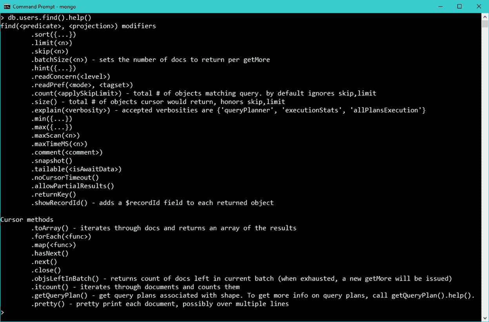

图 26: Find()方法。

根据定义，查询是在单个集合上发出的；因此，如我们在现阶段所预期的那样，加入其他表是不可能的。为了实现这一点，我们需要使用聚合或`MapReduce`机制，这将在后面的章节中讨论。

为了执行查询，我们通常需要指定一个过滤器，除非我们正在检索一个集合的所有文档。MongoDB 使用一些**比较运算符**，这些比较运算符在数据比较和匹配时非常有用:

表 9:查询比较运算符

| 名字 | **描述** |
| --- | --- |
| `$eq` | 将**等于**的值与指定值匹配。 |
| `$gt` | 匹配大于指定值的值。 |
| `$gte` | 将大于或等于的值**与指定值匹配。** |
| [`$lt`](https://docs.mongodb.com/manual/reference/operator/query/lt/#op._S_lt "$lt") | 匹配小于指定值的值。 |
| [`$lte`](https://docs.mongodb.com/manual/reference/operator/query/lte/#op._S_lte "$lte") | 将**小于或等于**的值与指定值匹配。 |
| [`$ne`](https://docs.mongodb.com/manual/reference/operator/query/ne/#op._S_ne "$ne") | 将所有不等于的值与指定值匹配。 |
| [`$in`](https://docs.mongodb.com/manual/reference/operator/query/in/#op._S_in "$in") | 匹配数组中指定的任何值**。** |
| [`$nin`](https://docs.mongodb.com/manual/reference/operator/query/nin/#op._S_nin "$nin") | 与数组中指定的值不匹配。 |

除了这些，我们还有一些**逻辑运算符**，比如:

表 10:逻辑运算符

| 名字 | **描述** |
| --- | --- |
| `$or` | 用逻辑`OR`连接查询子句；返回符合任一子句条件的所有文档。 |
| `$and` | 用逻辑`AND`连接查询子句；返回符合这两个条件的所有文档。 |
| `$not` | 用逻辑`AND`连接查询子句；返回符合两个子句条件的所有文档。 |
| [`$nor`](https://docs.mongodb.com/manual/reference/operator/query/lt/#op._S_lt "$lt") | 用逻辑`NOR`连接查询子句；返回两个子句都不匹配的所有文档。 |

如需更多信息，您可以直接在 MongoDB 网站上查看[参考卡](https://www.mongodb.com/lp/misc/quick-reference-cards?jmp=docs&_ga=1.174940578.1222174542.1479160331)。

使用不带任何参数的方法`find()`将简单地返回给定集合中的任何可用内容。虽然这在一些简单的场景中很有用，但是倾向于通过匹配要返回的文档的一些属性(字段)来搜索特定信息。这是通过指定方法的第一个参数`<query filter>`来实现的。

`find()`方法的基本签名接受两个参数。这两个参数都是可选的:

代码清单 28:集合查找方法签名

```js
  db.collection.find(<query filter> , <projection>)

```

`Query filter`:表示搜索数据时将要应用的过滤器(与 RDBMS 数据库中的`WHERE`子句完全相同)。

`Projection`:提供了一种机制来指定我们想要返回哪些数据。如果我们只想返回一个特定的字段，这里就是指定它的地方。

例如，如果我们要检索其`firstname`和`lastname`匹配给定值的用户，我们将使用以下符号(多行上的格式只是为了更好的可读性):

代码清单 29:查询中 AND 运算符的使用

```js
  db.users.find(
  {
       $and: [
                { firstname: "john" },
                { lastname : "doe" }
             ]

```

方括号将包含一组参数。如图 27 所示，我们可以看到查询返回了与我们指定的值相匹配的文档。

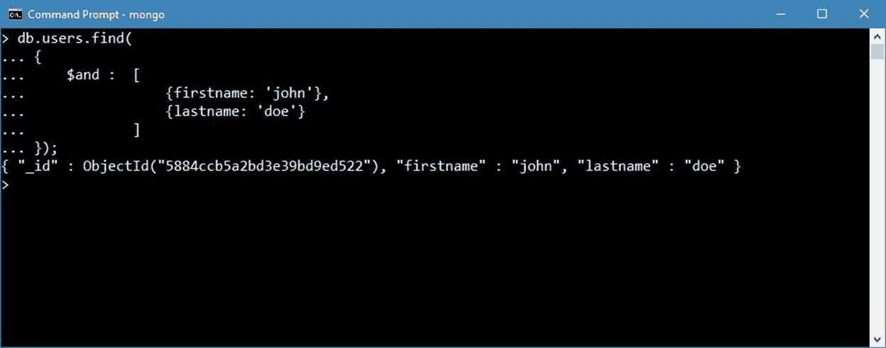

图 27:搜索名字和姓氏。

同时，如果我们将`$and`和`$or`组合起来，会产生以下查询:

代码清单 30:查询中 AND 和 OR 的用法

```js
  db.users.find(
  {
       $and: [
                { firstname: "john" },
                { lastname : "doe" }
             ],
       $or:  [
                { _id : 1 }
             ]
  });

```

当它在 MongoDB shell 中运行时，结果如下:

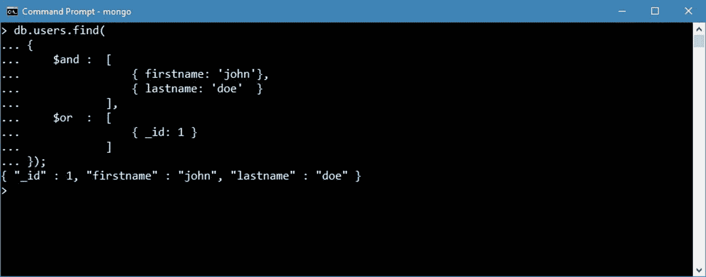

图 28:指定包含“与”和“或”的过滤器。

同时，如果我们想使用一些比较运算符，基本用法是将运算符与有问题的值一起放在花括号内:

代码清单 31:搜索 id 大于 1 的用户

```js
  db.users.find( { _id : {$gt: 1} });

```

该查询搜索`_id` 值大于`1`的项目。

表 11:查询过滤器的例子

| 名字 | **描述** |
| --- | --- |
| `{lastname : “doe”}` | 其中`lastname`等于`doe`的文档，或者包含值`doe`的数组。 |
| `{age: 10, lastname: “doe”}` | 年龄等于`10`、`lastname`等于`doe`的单据。 |
| `{age: {$gt: 10}}` | 年龄大于`10`的单据。还提供:`$lt (<)`、`$gte (>=)`、`$lte (<=)`和`$ne (!=)`。 |
| `{lastname: {$in: [“doe”, “foo”]}}` | `lastname`为`doe`或`foo`的单据。 |
| `{a: {$all: [10, “hello”]}}` | 其中`a`是同时包含`10`和`hello`的数组的文档。 |
| `{“name.lastname": “doe”}.` | 其中`name`是`lastname`等于`doe`的嵌入文档。 |
| `{a: {$elemMatch: {b: 1, c: 2}}}` | 其中`a`是一个数组，该数组包含一个既等于`1`又等于`2`的元素。 |
| `{$or: [{a: 1}, {b: 2}]}` | 其中`a`为`1`或`b`为`2`的单据。 |
| `{a: /^m/}` | `a`以字母 m 开头的单据，也可以使用正则运算符:`{a: {$regex: “^m”}}`。 |
| `{a: {$mod: [10, 1]}}` | 与`10`除后的余数为`1`的单据。 |
| `{a: {$type: 2}}` | `a`为字符串的单据。(详见[bsonspec.org](http://bsonspec.org/)。)`{ $text: { $search: “hello” } }`在文本搜索中包含`hello`的文档。需要文本索引。 |

### 预测

让我们想象这样一种情况:我们有一个包含大量属性(字段)的文档，但我们只需要返回一两个。这可以通过在`find()`方法中指定投影参数来完成。

在本章中，我们已经看到了如何过滤一些数据，我们还看到所有的属性都被返回。

投影其实很简单；我们只需要指定我们希望在输出中包含或排除的属性列表。其工作原理如下:

为了从查询中仅返回`firstname`属性，我们将指定以下内容:

代码清单 32:查找所有用户并只返回名字

```js
  db.users.find( { },  {_id: 0,
  firstname: 1} );

```

本例中的数字`1`实际上是指`true`或包含，`0`是指`false`或排除。

除非明确排除在查询之外，否则将始终返回`_id`字段。

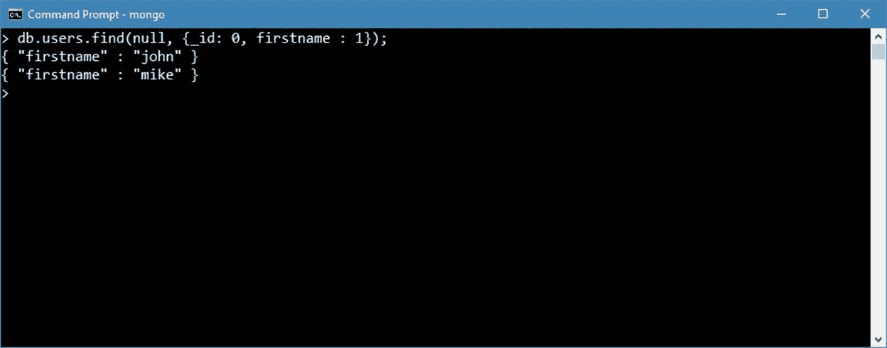

图 29:从查询中只返回名字。

### 排序

为了整理结果，我们可以在`find()`上面使用`sort()`修改器。这看起来如下所示:

代码清单 33:指定排序

```js
  db.users.find({}, {}).sort( { _id :
  -1} );

```

`sort()`修饰符接受一个字段列表，我们可以在上面分配两个值，负(`-1`)或正(`1`)，其中:

*   **负(** `-1` **)** :降序
*   **正(** `1` **)** :升序

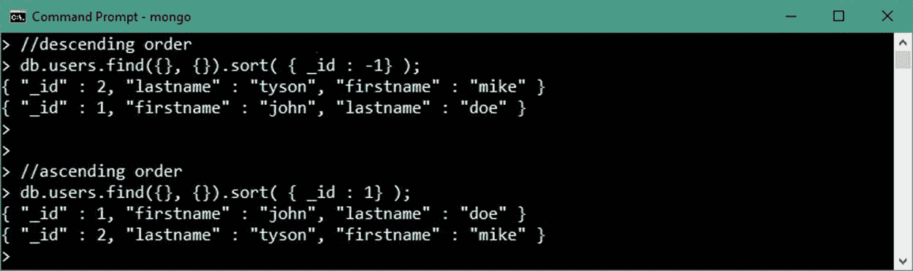

图 30:按降序或升序排序。

### 限制输出

为了限制被退回的单据数量，我们可以使用`limit()`修饰符。通过在`limit()`上指定值，将只返回该数量的文档。

代码清单 34:限制查询返回的文档数量

```js
  db.users.find({}, {}).limit( 10 );

```

在本例中，将只返回前 10 个文档。

### 光标

当调用`find()`方法时，返回一个游标，它可以很容易地用来遍历文档，如代码清单 35 所示。

查询返回所有文档，我们使用游标在文档级别实现一些特定的逻辑。我们这里的例子纯粹是用来演示一些事情:

*   我们可以遍历文档。
*   我们可以实例化一个文档。
*   我们可以访问文档内部值。

代码清单 35:遍历光标

```js
  var cursor = db.users.find({}, {});

  while (cursor.hasNext()) {

      var document = cursor.next();

      if(document) {
          var firstname = document.firstname;
          print (tojson(firstname));
      }
  };

```

在 MongoDB shell 中，我们可以看到`“John”` 和`“Mike”`作为查询的一部分被返回。

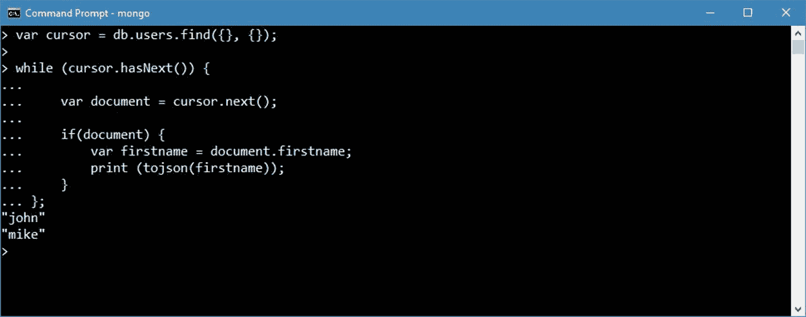

图 31:MongoDB 外壳中的光标。

通过使用`forEach()`函数可以达到同样的效果，该函数将遍历所有文档。它使编码变得稍微容易一些，但与前面的技术基本相同。

代码清单 36:在光标上使用 forEach

```js
  var cursor = db.users.find({}, {});

  cursor.forEach( function(document) {  
          var firstname = document.firstname;
          print (tojson(firstname));
  });

```

## 聚合

我们在前一章中看到的主要是通过过滤和投影从给定的集合中检索文档。我们没有看到的是*聚合*数据的方式；这仅仅是因为`find()`方法没有提供一种方法来做到这一点。

MongoDB 文档对聚合的定义如下:*聚合是处理数据记录并返回计算结果的操作*。

因此，MongoDB 提供了一种方法来执行操作(计算)并将值分组在一起，以便返回一个结果。有了这个功能，我们能够对数据库中的可用数据执行任何类型的分析任务。

如果你来自 RDBMS 世界，这和`GROUP BY` ( `sum()`、`avg()`、`count()`等周围的操作使用方式相当对应。).

MongoDB 提供了三种方法来实现这一点:

*   聚合管道
*   地图缩减功能
*   单用途聚合方法

### 聚合管道

MongoDB 聚合框架提供了一种在不同阶段处理文档的方法(作为管道)。每个阶段在文档通过管道时对其进行转换。

当执行管道时，MongoDB 将操作符相互管道化。如果你熟悉管道的 Linux 概念，那么这是最接近的类比。简而言之，这意味着一个操作者的**输出**变成了下一个操作者的**输入**。每个操作符的结果是一个新的文档集合。例如，一个可能的管道如下:


图 32:聚合管道示例。

我们可以在管道中添加任意多的操作符；我们还可以多次添加同一个操作符，并且在管道中的不同位置添加。


图 33:带有重复运算符的聚合示例。

说到实现，MongoDB 提供了`aggregate()`函数，接受要应用的阶段列表。阶段的应用发生在序列被传递给方法的时候。方法签名如下:

代码清单 37:聚合方法签名。

```js
  db.collection.aggregate([ { <stage 1> }, { <stage 2>}, … ]);

```

可能的阶段在下表中描述，来自 [MongoDB 文档](https://docs.mongodb.com/manual/reference/operator/aggregation/)，所以让我们深入了解更多细节:

表 12:管道操作员

| 操作员 | 描述 | SQL 等价物 |
| --- | --- | --- |
| [`$project`](https://docs.mongodb.com/manual/reference/operator/aggregation/project/#pipe._S_project "$project") | 更改流中的每个文档，例如通过添加新字段或删除现有字段。对于每个输入文档，输出一个文档。 | `SELECT` |
| [`$match`](https://docs.mongodb.com/manual/reference/operator/aggregation/match/#pipe._S_match "$match") | 过滤文档流，只允许匹配的文档不加修改地进入下一个管道阶段。`$match`使用标准 MongoDB 查询。对于每个输入文档，输出一个文档(匹配)或零个文档(不匹配)。 | `WHERE` |
| [`$redact`](https://docs.mongodb.com/manual/reference/operator/aggregation/redact/#pipe._S_redact "$redact") | 通过基于存储在文档本身中的信息来限制每个文档的内容，从而重塑流中的每个文档。集成了`$project`和`$match`的功能。可用于实现字段级编辑。对于每个输入文档，输出一个文档或零个文档。 | 不适用的 |
| [`$limit`](https://docs.mongodb.com/manual/reference/operator/aggregation/limit/#pipe._S_limit "$limit") | 将第一个未修改的`n`文档传递到管道，其中`n`是指定的限制。对于每个输入文档，输出一个文档(对于第一个`n`文档)或零个文档(在第一个`n`文档之后)。 | `LIMIT`或`TOP xxx` |
| [`$skip`](https://docs.mongodb.com/manual/reference/operator/aggregation/skip/#pipe._S_skip "$skip") | 跳过第一个`n`文档，其中`n`是指定的跳过编号，并将其余未修改的文档传递到管道。对于每个输入文档，输出零个文档(对于第一个`n`文档)或一个文档(如果在第一个文档之后)。 | `LIMIT ..OFFSET` |
| [`$unwind`](https://docs.mongodb.com/manual/reference/operator/aggregation/unwind/#pipe._S_unwind "$unwind") | 从输入文档中解构数组字段，为每个元素输出一个文档。每个输出文档用元素值替换数组。对于每个输入文档，输出`n`文档，其中`n`是数组元素的数量，对于空数组可以为零。 | 不适用的 |
| [`$group`](https://docs.mongodb.com/manual/reference/operator/aggregation/group/#pipe._S_group "$group") | 通过指定的标识符表达式对输入文档进行分组，并将累加器表达式(如果指定)应用于每个组。消耗所有输入文档，并为每个不同的组输出一个文档。输出文档只包含标识符字段和(如果指定的话)累积字段。 | **分组依据** |
| [`$sample`](https://docs.mongodb.com/manual/reference/operator/aggregation/sample/#pipe._S_sample "$sample") | 从输入中随机选择指定数量的文档。 | 不适用的 |
| [`$sort`](https://docs.mongodb.com/manual/reference/operator/aggregation/sort/#pipe._S_sort "$sort") | 按照指定的排序关键字对文档流进行重新排序。只有顺序改变；文档保持不变。对于每个输入文档，输出一个文档。 | `ORDER BY` |
| [`$geoNear`](https://docs.mongodb.com/manual/reference/operator/aggregation/geoNear/#pipe._S_geoNear "$geoNear") | 根据地理空间点的邻近度返回有序的文档流。结合了地理空间数据的`$match`、`$sort`和`$limit`功能。输出文档包括附加的距离字段，并且可以包括位置标识符字段。 | 不适用的 |
| [`$lookup`](https://docs.mongodb.com/manual/reference/operator/aggregation/lookup/#pipe._S_lookup "$lookup") | 对同一数据库中的另一个集合执行左向外联接，以从“联接”集合中筛选出文档进行处理。 | `JOIN` |
| [`$out`](https://docs.mongodb.com/manual/reference/operator/aggregation/out/#pipe._S_out "$out") | 将聚合管道的结果文档写入集合。要使用`$out`阶段，它必须是管道中的最后一个阶段。 | `SELECT` |
| [`$indexStats`](https://docs.mongodb.com/manual/reference/operator/aggregation/indexStats/#pipe._S_indexStats "$indexStats") | 返回集合中每个索引使用情况的统计信息。 | `EXPLAIN` |

为了演示聚合的用法，我们需要一些数据来进行操作；因此，我们将致力于收集书籍，这将是一个非常简单的格式:标题，作者，页数和语言。

因此，让我们用一些示例数据填充数据库:

代码清单 38:用于聚合的简单数据

```js
  db.books.insert(
  [
     {_id: 1, title: "Anna Karenina", author: "Leo
  Tolstoy", pages : 500, language: "russian"},
     {_id: 2, title: "Madame Bovary", author:
  "Gustave Flaubert", pages : 450, language: "french"},
     {_id: 3, title: "War and Peace", author: "Leo
  Tolstoy", pages : 470, language: "russian"},
     {_id: 4, title: "The Great Gatsby", author: "F.
  Scott Fitzgerald", pages : 300, language: "english"},
     {_id: 5, title: "Hamlet", author: "William
  Shakespeare", pages : 150, language: "english"}
  ]);

```

让我们试着归还每种语言的最大页数的书。

为了实现这一目标，战略之一是:

1.  通过指定要进行分组的项目，按语言(蓝色)对文档进行分组。
2.  使用`$max`操作符找出哪本书对于给定的语言具有最大的页数(红色)。

代码清单 39:数据聚合(分组)

```js
  db.books.aggregate(
     [
       {
         $group:
           {
             _id: {language:
  "$language"},
             pages: { $max:
  "$pages" }
           }
       }
     ]
  );

```

在这个查询中需要注意的一点是，我们使用`$field`符号来表示正在处理的字段的值(`$max : "$pages"`)。

执行返回如图 34 所示的结果。

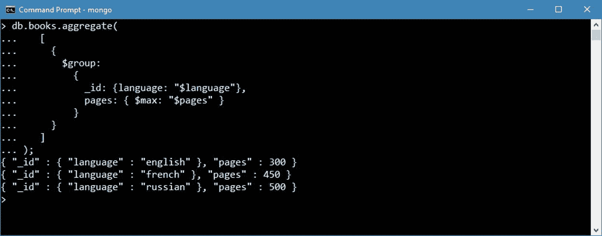

图 34:数据聚合(分组)。

为了应用本章开头描述的阶段概念，让我们简单地再添加一个要求:让我们进行前面的计算，但仅将其应用于英语。这意味着我们对除英语之外的语言一无所知。

我们可以重写查询，并将其分为两个阶段:

1.  `$match`:我们正在过滤掉所有不想进行计算的项目。这意味着在开始计算之前，我们只将数据限制在“英语”范围内。
2.  `$group`:一切如初；唯一不同的是，这一阶段的输入将由只用英语编写的书籍组成。

现在，查询如下所示:

代码清单 40:数据聚合(分组)和过滤($match)

```js
  db.books.aggregate(
        [
              {
                  $match : { language :
  "english" }
              },
              {
                 $group:
                    {
                       _id: {language:
  "$language"},
                       pages: { $max:
  "$pages" },
                       title: { $first:
  "$title"}
                    }
              },
        ]
  );

```

如 MongoDB shell 结果所示，我们只能看到`english`的值。其余的都不可见。

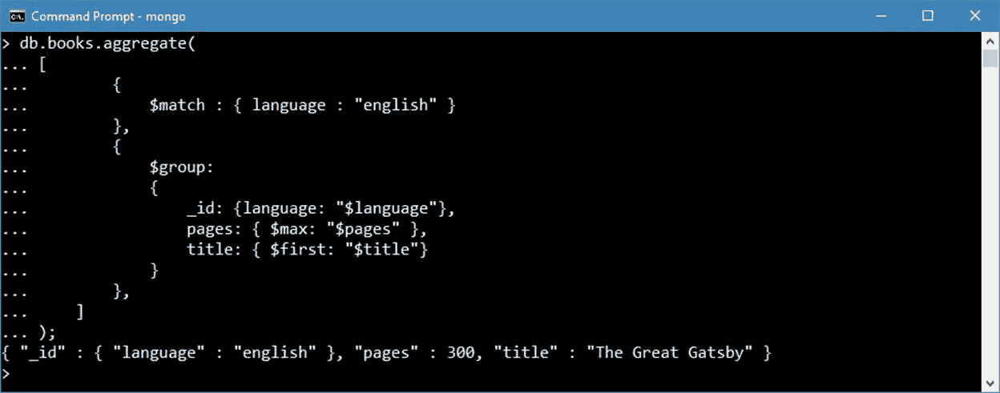

图 35:聚合管道:通过预过滤集合对帐簿进行分组。

上面查询中有趣的一点是我们使用的操作顺序。我们当然可以将`$match`部分移到`$group`之后，在这种情况下，结果将完全相同。将会改变的是阶段之间的数据处理。例如，在执行计算之前，尽可能多地过滤*是有意义的，因为与我们最终只过滤结果相比，引擎要完成的工作量会更小。在编写查询时，应该始终考虑关于效率的这一部分。*

### MapReduce

MapReduce 是另一种聚合数据的方式，它通常用于处理大量数据，以便获得数据的精简视图。

每个 MongoDB 集合都有一个`mapReduce()`命令作为其一部分，具有以下签名:

代码清单 41: MapReduce 方法的签名

```js

  db.<collection>.mapReduce ( 
      mapFunction, 
      reduceFunction, 
      {
          <out>, 
          <query>, 
          <sort>, 
          <limit>, 
          <finalize>, 
          <scope>, 
          <jsMode>, 
          <verbose>,
          <bypassDocumentValidation>
      }
  );

```

`Map`和`reduce`其实都是 JavaScript 函数，我们要定义。

#### 地图

`map`功能负责将每个输入文档转换成零个或多个文档。`map`功能的上下文是集合本身；因此，可以在函数内使用`this`。`Emit()`负责创建输出。`map`功能也可以看作是 RDBM 世界的一种机制。主要目标是返回由公共`key`规范化和分组的值，它可以是集合的任何属性，以及属于该键的一组值。

代码清单 42:基本地图功能

```js
  var
  map = function(){

  /* emit values for each document */

  emit(key, <values>);
  }

```

对于 Microsoft.NET 的开发者来说，`map`函数的输出可以看作是`IDictionary<object, IList<object>>`，或者一个与一组值相关联的键。

如果我们愿意，我们可以多次调用`emit`()或者做任何逻辑来操纵我们想要分组的数据。

|  | 注意:如果在执行 map()命令后一个项目只包含一条记录，MongoDB 将不会执行任何减少功能，因为它已经被认为是减少的。 |

#### 减少

`reduce`功能只是收集结果并对其进行处理，例如根据相同的关键字对项目进行减少或分组，并对值进行处理，例如计算总和或数量。基本签名如下:

代码清单 43:基本的简化函数定义

```js
  var
  reduce = function(key, value){
    /* reduce emitted values into result */

  return {result1: one, result2: two};
  }

```

如果我们使用聚合管道执行与之前相同的示例(以获取具有最大页数的书籍)，则`mapReduce`将类似于以下内容:

代码清单 44: MapReduce 完整示例

```js
  /* 1\. defining the map function */
  var map = function() {   
        emit(this.language, 
        {
              pages: this.pages,
              title: this.title
        });   
  };

  /* 2\. defining the reduce function */
  var reduce = function(key, values) {

        var max = values[0].pages;
        var title = values[0].title;

        values.forEach(function(value) {
              if(value.pages > max){
                    max = value.pages;
                    title = value.title;
              }
        });

        return  {pages: max, title: title} ;
  };

  /* 3\. calling the map reduce against the books collection a*/
  db.books.mapReduce(map, reduce, {out: { reduce:"biggest_books"
  }});

  /* 4\. Retrieving the result */
  db.biggest_books.find();

```

这个查询的输出如下，它与之前获得的结果非常相似:

代码清单 45:返回的 MapReduce 数据(结果)

```js
  { "_id" :
  "english", "value" : { "pages" : 300,
  "title" : "The Great Gatsby" } }
  { "_id" :
  "french",  "value" : { "pages" : 450,
  "title" : "Madame Bovary"    } }
  { "_id" :
  "russian", "value" : { "pages" : 500,
  "title" : "Anna Karenina"    } }

```

关于执行的顺序:

1.  在第一步中，我们定义`map`函数。对于`books`表中的每一行，该函数将返回一个包含`key = language`本身的对象，相关的值将是书名和页数。

代码清单 46:返回的数据示例

```js
  { english } => [
                     { pages: 300, title: "The Great
  Gatsby"}, 
                     { pages: 150, title: "Hamlet"}
                 ]
  { russian } => [
                     { pages: 500, title: "Anna
  Karenina"},    
                      { pages: 470, title: "War and
  Peace"}
                 ]
  { french } =>  [    {pages: 450, title: "Madame
  Bovary"} ]

```

2.  在步骤 2 中，我们定义了一个`reduce`函数。`reduce`函数的职责是循环遍历值数组，找出哪个页数的值最大。为了返回标题的值，我们还必须在每个循环中映射标题。
3.  最后，我们调用`mapReduce()`函数，其中之前声明的函数被设置为参数。这个查询的一个有趣的方面是，它在一个名为`biggest_books`的新表中输出结果。

作为输出选项的一部分，我们还可以选择将结果作为游标返回，在这种情况下，我们会看到如下内容:

代码清单 47:带光标的 MapReduce

```js
  var values = db.books.mapReduce(map, reduce, {out: { inline: 1 }} );

  print(tojson(values));

```

一旦我们填充了`values`游标，我们就可以像上一章讨论游标时那样遍历值。

有关 MongoDB 中`MapReduce`的详细信息，请参见[官方文档](https://docs.mongodb.com/v3.4/reference/method/db.collection.mapReduce)。

### 单用途聚合操作

MongoDB 还提供了一些更多的聚合命令，可以直接对集合执行。

表 13:“简单”聚合命令

| 名字 | 描述 |
| --- | --- |
| `count` | 计算与查询匹配的文档数量；可选参数有:`limit`、`skip`、`hint`、`maxTimeMS`。 |
| `distinct` | 显示集合中特定键的不同值。 |
| `group` | 按指定的键将集合中的文档分组，并执行简单聚合。 |

#### 数数

`Count`是一个针对集合执行的非常简单的函数。只需调用`count()`函数，我们就可以得到结果。

代码清单 48:计数方法签名

```js
  db.books.count(query, options);

```

如图 36 所示，我们还可以指定充当数据过滤器的查询。

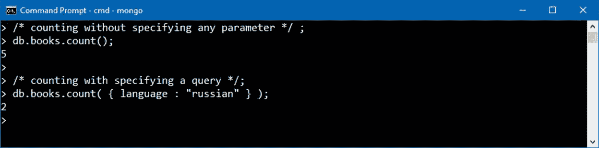

图 36:带或不带查询的帐册计数。

还有几个选项可以指定，比如`limit`、`skip`、`maxTimeMS`(最大时间毫秒)，可以帮助我们进一步指定计数的选项。

请记住，在我们使用`find()`功能后，`count()`也可以在光标上使用。

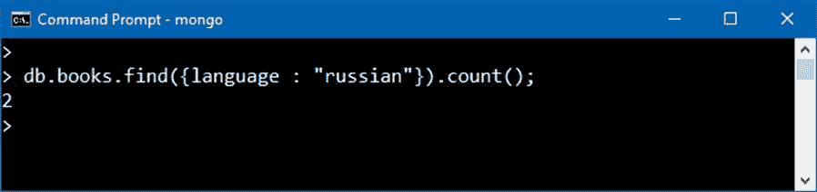

图 37:在搜索数据(光标)后使用 count()。

#### 明显的

`Distinct`将返回在`field`参数中指定的不同值列表。`Query`也可以用来进一步指定数据所针对的对象。

代码清单 49:不同的方法签名

```js
  db.books.distinct(field, query);

```

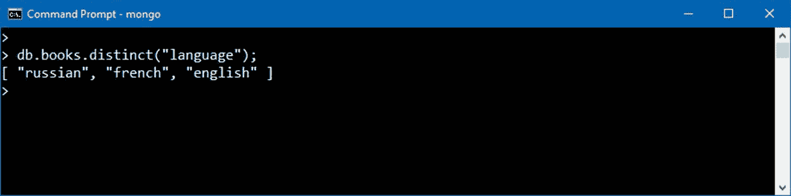

图 38:从集合中返回不同的值。

#### 组

`group`方法通过指定的键将集合中的文档分组，并执行简单的聚合功能，例如计算计数和总和。这个方法类似于`SELECT` <...>SQL 中的`GROUP BY`语句。`group()`方法返回一个数组。

该方法的签名如下:

代码清单 50:分组方法签名

```js
  db.<collection>.group ( { key, reduce, initial [,
  keyf] [, cond] [, finalize]})

```

让我们解释一下这个方法最有用的部分:

表 14:分组方法参数

| 名字 | **描述** |
| --- | --- |
| `key` | 表示要分组的一个或多个字段。这将被用作组的键，所有其他值都将被引用到该键。 |
| `reduce` | 在分组操作过程中对文档进行操作的聚合函数。这些函数可以返回总和或计数。该函数接受两个参数:当前文档和该组的聚合结果文档。 |
| `initial` | 初始化聚合结果文档。 |
| `keyf` | 可选。关键字段的替代项。指定创建用作分组键的“键对象”的函数。使用`keyf`而不是`key`按计算字段而不是现有文档字段分组。 |
| `cond` | 可选。如果我们只想处理数据子集，则包含查询。 |
| `finalize` | 可选。在返回结果之前，它可以对数据进行格式化。这是查询中执行的最后一个方法。 |

让我们看一个例子，如果我们要计算每种给定语言的所有页面的总和:

代码清单 51:分组示例

```js
  db.books.group ( 
  { 
      key : {language: 1 }, 
      reduce : function( currentDocument, result) {
          result.total +=  currentDocument.pages;
      },
      initial: {total: 0}
  });

```

在 shell 中执行时，它看起来如下所示:

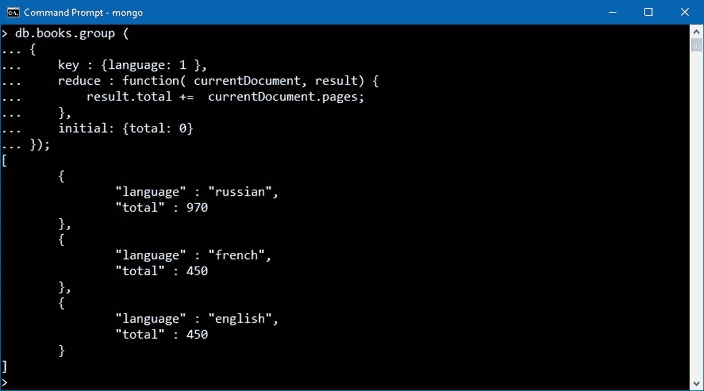

图 39:按语言分组并总结页数。

## 结论

在这一章中，我们简要地了解了 MongoDB 在查询和聚合数据方面是如何丰富功能的。为了简洁起见，我们没有看到所有的案例，因为这可能需要一个文档。然而，我希望读者至少能从中找出可能需要的元素。更多信息，请参阅官方文档或无数解释一些角落案例的博客文章。