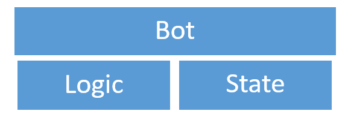
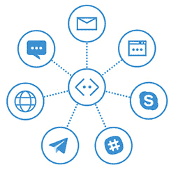
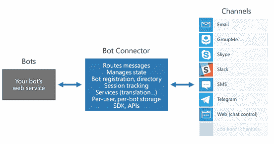
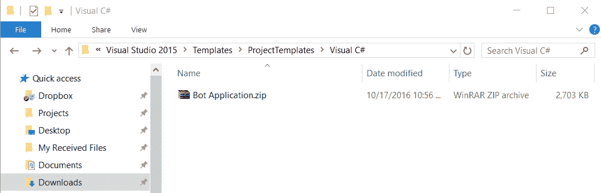
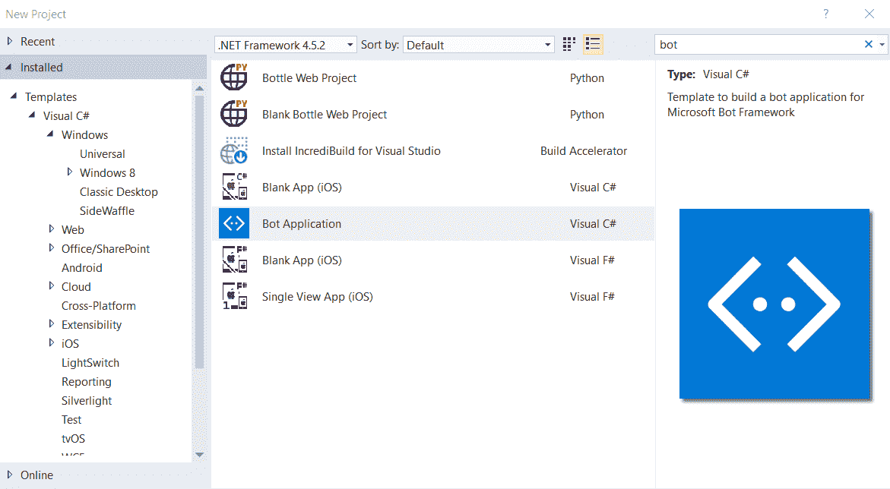
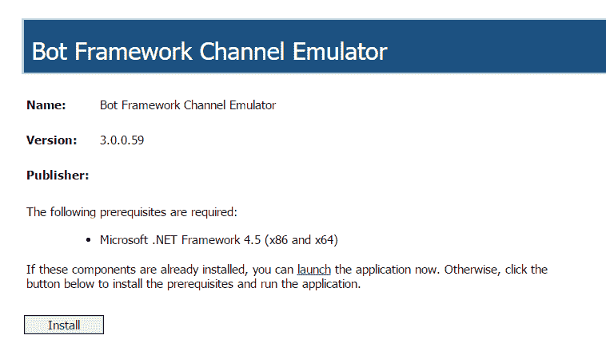
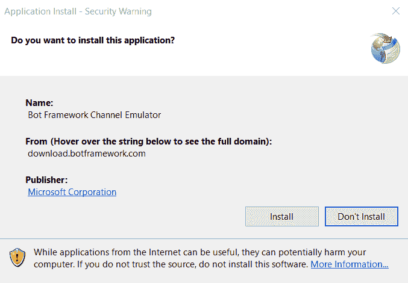
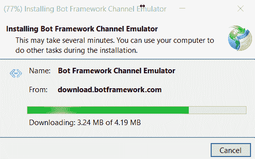
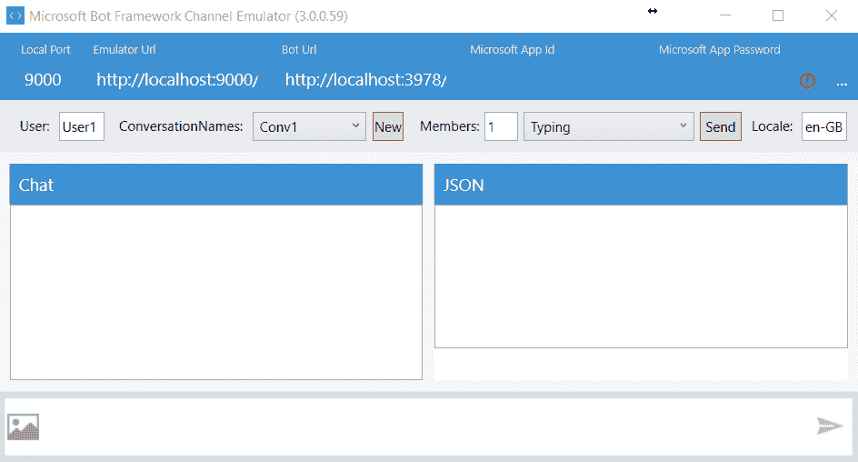
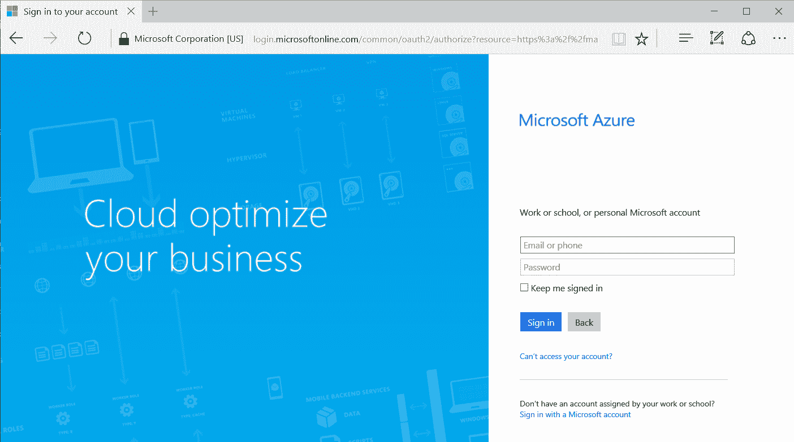

# 一、机器人框架概述

## 简介

微软机器人框架是服务和应用编程接口的集合，允许开发人员通过使用现有的和众所周知的对话平台为他们的用户构建和部署高质量的机器人。

bot 框架的主要目的是帮助开发人员解决他们在编写 Bot 时遇到的最常见的问题——创建基本的输入/输出机制和基础设施，添加语言和对话技能，处理性能、响应能力和可扩展性，并能够以他们选择的任何对话平台和语言与用户连接。

本质上，Bot 框架为开发人员提供了他们需要的东西，以便构建、连接、管理和部署尽可能自然地交互的机器人，无论用户在哪里，例如[【Skype】](https://www.skype.com)[Slack](https://slack.com/)[Messenger](https://www.messenger.com)[Kik](https://www.kik.com/)[Office 365](https://products.office.com/en-us/business/explore-office-365-for-business)mail，以及其他流行的服务。

Bot 框架由几个无缝协作的组件组成，例如 Bot Builder SDK、Bot Connector 和 Bot 开发人员门户。与 Azure 应用服务的集成是现成的。

Bot 框架还与微软[认知服务](https://www.microsoft.com/cognitive-services/)的语言理解智能服务([【LUIS】](https://www.luis.ai/))配合得很好，这是一种通过让用户体验自然对话来为 Bot 提供语言理解能力的好方法。

本章的主要目的是简要介绍其中的一些组件，以便更好地理解 Bot Framework 是如何工作的——每个部分是如何联系在一起的，以及如何以此作为开始使用框架的第一步——特别是如何开始使用并为我们的 Bot 创建基础。

听起来很刺激。我们开始吧！

## 机器人构建器 SDK

Bot Builder 是一个托管在 GitHub 上的[开源 SDK](https://github.com/Microsoft/BotBuilder) ，它为开发人员提供了编写交互式并连接到多个对话平台的机器人的基本构件。

Bot Builder 包括 C# 和 [Node.js](https://nodejs.org/) 中的本机库，它还提供了一个 [RESTful](https://en.wikipedia.org/wiki/Representational_state_transfer) API，可以从任何其他编程语言中使用。

微软已经把机器人框架分成了几个部分，因为正如你将看到的，编写一个机器人是一回事，而编写一个伟大的是另一回事。

能够编写一个优秀的机器人需要能够以相对简单的方式管理对话状态。

生成器软件开发工具包的目标之一是充当对话逻辑提供者。换句话说，当您构建一个机器人时，您将拥有与您的机器人将执行的动作直接相关的逻辑，并且您应该拥有处理对话状态的逻辑。

处理会话的状态不是一个琐碎的任务，这是这个 SDK 解决的主要问题——让开发人员更容易实现会话状态感知。

因此，您的机器人的逻辑应该分为两个部分——一个部分包含机器人自己的逻辑，另一个部分管理对话的状态，并由这个 SDK 处理。

图 1.0:机器人自己的逻辑和对话状态

在其最基本的形式中，机器人应该能够获得输入文本字符串，处理它，并返回输出响应。然而，一个只会这样做的机器人根本不会真正管理任何对话状态。

不处理状态对于非常简单的机器人来说没问题，但是真正有趣的机器人——尤其是那些处理多步导航、收集数据或需要权限的机器人——需要一定程度的复杂性，以至于如果你想自己管理(在机器人自己的逻辑部分内)，这样做可能会变得极其困难和麻烦。

因此，将会话状态管理与机器人的其他逻辑分开是非常重要的，这就是这个 SDK 派上用场的地方。

由于 SDK 还包括处理对话框和表单流的功能，因此侧重于处理会话状态的 SDK 子集通常被称为 Bot State 服务。

在很高的层次上，SDK 提供了以下功能:

*   灵活的对话系统。
*   内置对话框，用于简单的事情，如是/否、字符串、数字和枚举。
*   内置对话框，利用强大的人工智能框架，如 LUIS。
*   内置的无状态帮助机器人按需扩展。
*   表单流:能够从 C# 类生成基于表单流的对话。

要开始使用软件开发工具包，首先我们必须很好地理解机器人框架的另一个主要组成部分，称为机器人连接器。让我们看看这个。

## 机器人连接器

顾名思义，机器人连接器是一种允许您将机器人与多个通信通道连接起来的服务。

当您使用机器人框架编写机器人并使用 Azure 应用服务在互联网上发布它时，机器人连接器的作用是通过使用您可能选择的服务可用并支持的任何通信平台，将来自您的机器人的消息转发给用户，并将来自用户的消息转发回您的机器人。

为了使用机器人连接器，您必须有一个微软帐户(Hotmail，Live，Outlook.com)，这样您就可以登录到机器人开发者门户网站，该网站将用于注册您的机器人。

您还必须有一个 Azure 可访问的 RESTful 端点来公开 bot 连接器服务的回调——这可以通过用 Visual Studio 将 Bot 部署到 Azure 应用服务来实现(我们将在后面讨论)。

最后，您还必须拥有至少一个对话平台(如 Skype)的开发人员帐户，机器人将使用该帐户与用户交流。

为了更好地从视觉上理解机器人连接器，可以把它想象成一个图形中的中心节点，将所有其他节点连接在一起。图中的每个其他节点都是一个由 bot 框架支持的对话平台，您的 Bot 可以与之通信(即发送和接收消息)。

图 1.1:机器人连接器和对话通道(图由[Petri.com](https://www.petri.com/)提供)

这些对话平台是机器人连接器能够连接的通道(服务)，以便路由消息和跟踪机器人将使用的会话。

换句话说，你的机器人只不过是一个通过公共网址公开的网络服务，它依赖于机器人连接器来访问各种通信渠道。

这是理解机器人连接器的另一种视觉方式。

图 1.2:机器人连接器如何将机器人绑定到通道(图由[微软](http://www.microsoft.com)提供)

因此，这给了我们一个明确的指示，机器人连接器如何充当粘合剂，并将通道与机器人联系起来。它就像是各方之间的一种中央通信枢纽。

所有这些听起来都令人兴奋。现在让我们探索一些基本的入门步骤。

## 开始

有两个用 Bot 框架开发机器人的本地库。一个使用 C# 另一个使用 Node.js

在这本电子书中，我们将通过做事情来学习，实现这一点的最佳方式是创建各种类型的机器人的不同示例，每个示例都专注于特定的用例。我们将使用 C#，所有的开发都将使用 Visual Studio 完成。

首先下载安装 [Visual Studio](https://www.visualstudio.com/) 2015 如果你的机器上还没有的话。

在撰写本文时，Visual Studio 2017 处于“发布候选”模式，但尚未发布。我建议你使用 VS 2015，即使当你阅读这篇文章时 VS 2017 是可用的。

安装后，请确保将所有 Visual Studio 扩展更新到最新版本。这可以通过转到**工具** > **扩展和更新** > **更新**来完成。

安装所有 VS 更新后，您需要下载并安装[机器人应用模板](http://aka.ms/bf-bc-vstemplate)。

如果直接点击链接没有开始下载，直接在网页浏览器的地址栏中输入[http://aka.ms/bf-bc-vstemplate](http://aka.ms/bf-bc-vstemplate)。

将此 zip 文件保存到您的 Visual Studio 模板文件夹中，该文件夹通常位于*% user profile % \ Documents \ Visual Studio 2015 \ Templates \ project Templates \ Visual c#*下，如下图所示。请注意，您不应该解压缩文件！

图 1.3:保存在 VS 模板文件夹中的机器人应用模板

如果您现在打开 Visual Studio，并在创建新项目时在搜索栏中键入 **bot** ，您将看到准备好被选择的 bot 应用模板。酷！也可以直接在**已安装** > **模板** > **Visual C#** 区域找到模板。

图 1.4:机器人应用模板在 VS 中就绪

我们现在已经准备好了我们的 Visual Studio Bot 应用模板，您可以用它创建一个测试应用(或者您可以稍后这样做)。

在编写任何代码之前，您还应该安装 [Bot 框架仿真器](http://docs.botframework.com/connector/tools/bot-framework-emulator/#navtitle)，因为它在测试应用时非常有用。

这个模拟器允许我们对我们的应用进行测试调用，就好像它是由 Bot 框架本身调用的一样。相当棒。

有了这个模拟器，我们可以从应用向端点发送请求和接收响应，反之亦然。这是开发过程中非常方便的工具。

Windows 的机器人模拟器可以从[https://aka.ms/bf-bc-emulator](https://aka.ms/bf-bc-emulator)安装。

图 1.5: Bot 框架仿真器安装站点

当您单击“安装”时，会将一个 setup.exe 文件下载到您的计算机上供您运行。请注意，当您运行安装程序时，您应该会看到类似于图 1.6 中的屏幕(尽管当您阅读此内容时，细节可能会有所不同)。

图 1.6: 机器人框架模拟器应用设置

要开始安装过程，点击**安装**。安装过程不到一分钟，您应该会看到如图 1.7 所示的进度。

图 1.7: Bot 框架仿真器应用安装

安装过程完成后，模拟器会自动启动，您应该会看到类似以下屏幕的内容。

图 1.8:机器人框架模拟器正在运行

现在，您可以关闭或最小化此窗口，因为我们稍后会使用它。如果你关闭它，你总能在窗口开始菜单下找到它，名字是机器人框架频道模拟器。

完成这些后，接下来让我们获得一个 Azure 帐户。当我们部署我们的 bot 应用时，您将需要这个。

如果您没有 Azure 帐户，您应该使用微软帐户登录或注册 Azure。你可以通过访问 https://azure.microsoft.com 来实现。

图 1.9:微软 Azure 登录页面

假设 Azure 帐户准备好了，让我们创建第一个 bot 应用。

## 定义机器人应用

达到这种地步是令人兴奋的！我们现在准备创建我们的第一个 bot 应用。那么，我们的机器人会怎么做？问得好。

创建一个机器人最难的部分实际上是弄清楚机器人会做什么。本质上，机器人应该是有用的，即使它可能不一定是健谈的。

我所说的有用，是指机器人应该能够执行一项任务，这项任务要么不容易通过使用搜索引擎来解决，要么它应该执行一项可能被证明是乏味的、劳动密集型的或简单重复的任务。

机器人的基本概念是，如果你给它一个命令，它应该会给出一个结果，这个结果比你自己在网上查找更容易、更快。有很多机器人可以做各种各样的事情，然而并不是所有的机器人都遵守这个基本原则。

几乎任何类型的机器人都可以编写——没有任何技术障碍阻止我们这样做。即使是使用像 [LUIS](https://www.luis.ai/) 这样的应用接口，也比以往任何时候都更容易创建流畅的对话。关键因素是创造一些有用的东西，最终节省用户的时间。考虑到这一点，我们的第一个机器人能做什么？

我有个主意。让我们创建一个机器人，给我们一个我们输入的任何网站的缩略图。

一会儿，让我们假设我们从事市场研究，并希望跟踪竞争对手网站的变化频率。一个很好的方法是在不同的时间点创建主页面的缩略图。

显然，我们可以通过上网和注册无数提供这项服务的网站来手动完成这项工作。然而，手动操作将变得相当乏味，所以这绝对是一个应该用机器人自动完成的任务。现在我们有进展了。太棒了。

因此，我们已经定义了我们的第一个 bot 应用将做什么，这也很好地符合我们已经认识到的有用性原则，我们准备开始构建它。我们将在下一章中这样做。

## 总结

本章介绍了 Bot 框架，解释了它的组成部分以及如何设置它，并定义了使用该框架的自动化代理应用应该达到的基本原则。

有了这个概述，我们就准备深入研究如何编写机器人的技术细节，并使用它们来执行有趣和有用的活动，这些活动可以帮助我们节省时间，防止我们从事重复和繁琐的任务。

在接下来的两章中，我们将创建第一个真正的 bot 应用。它不会像对话一样流畅，但它会解决一个有趣的问题，而且很有用。

接下来，我们将创建一个更加令人兴奋、有趣和有用的机器人应用——一个更加流畅的对话应用。