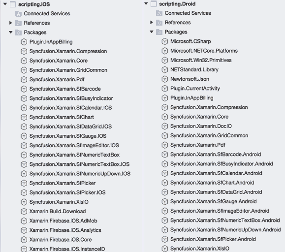
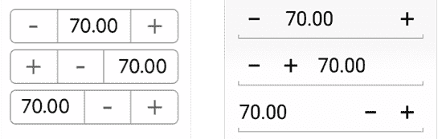
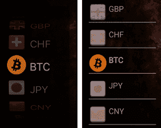
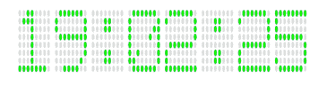
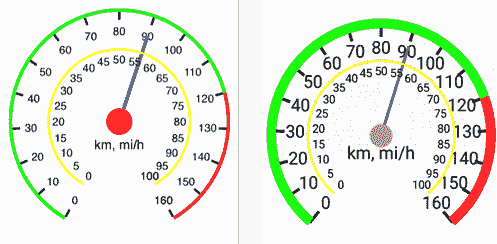
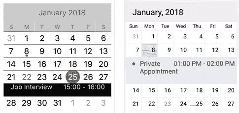
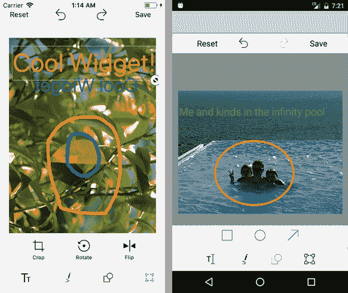
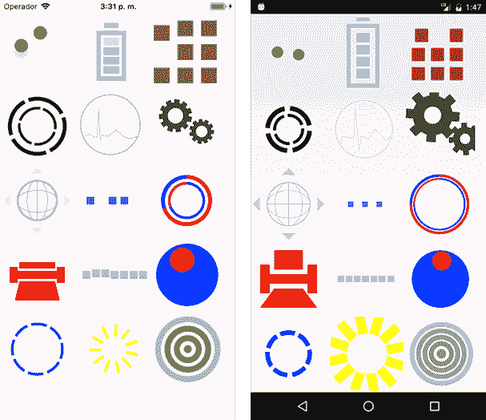
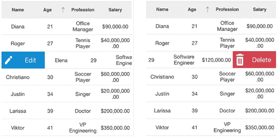
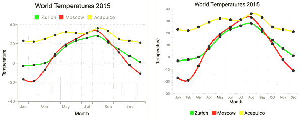

# 五、添加同步融合控件

在本章中，我们将看到如何添加不是由我们开发的控件，而是由其他人开发的控件。举个例子，我决定使用 [Syncfusion 控件](https://www.syncfusion.com/products/xamarin)。为什么呢？

*   它们看起来真的很酷，在 iOS 和安卓上非常相似。
*   它们易于使用和配置。
*   它们很容易被纳入 CSCS 框架，使它们看起来像是 CSCS 的一部分。
*   有一个[社区许可证](https://www.syncfusion.com/products/communitylicense)允许免费使用 Syncfusion 框架，前提是您的收入低于 100 万美元，并且贵公司最多有五个开发人员将使用该框架。
*   甚至社区许可证也包括电子邮件支持。
*   我喜欢用免费的东西。不是吗？(如果你的收入超过 100 万美元或者你有五个以上的开发者，你需要在这里购买许可证[)。](https://www.syncfusion.com/sales/products)

不言而喻，这本书是由 Syncfusion 出版的，不是因为我为他们的控件做广告:他们明确告诉我，我应该使用任何最适合这本书的产品。

##  项目中

了解同步融合控件如何工作的最简单方法是下载[同步融合示例项目](https://www.syncfusion.com/downloads/evalconfirmation)。您可以通过两种不同的方式将 Syncfusion 控件添加到项目中:

*   作为从样本项目到项目的**参考**部分的 dll。
*   作为[通过**获取套餐**](http://nuget.syncfusion.com/package/xamarin)您的项目 > **套餐** > **添加套餐**

图 8 显示了添加 Syncfusion NuGet 包后，您的 Visual Studio 项目的外观。



 8: Syncfusion iOS 和安卓 NuGet 包(在 macOS 上)

为了使用这些控件，我在 Xamarin.iOS 和 Xamarin.Android 中都创建了`SfWidget`类。我不想将公共类放入共享项目中，因为 iOS 和 Android Syncfusion 实现之间有太多的差异(例如，iOS 上的`SFBarcode`和 Android 上的`SfBarcode`等等)。

因此，我将所有 Syncfusion 小部件添加到了`SfWidget`类中，这些小部件来自 iOS 上的`iOSVariable`类，以及安卓上的`DroidVariable`类。iOS 版本的一个片段如代码清单 23 所示。安卓版本看起来非常相似。

23:iOS 上 SfWidget 类的一个片段

```cs
  public class SfWidget : iOSVariable
  {
    SyncFusionType  m_type;
    SFBarcode       m_barcode;

    SFDigitalGauge  m_digitalGauge;
    SFCircularGauge m_circularGauge;
    SFCircularScale m_circularScale;
    SFNeedlePointer m_needlePointer;
    SFRangePointer  m_rangePointer1, m_rangePointer2;
    SFNumericUpDown m_stepper;
    SFBusyIndicator m_busyIndicator;
    SfPicker        m_picker;
    SFChart         m_chart;

    SfDataGrid      m_grid;
    int             m_rowIndex;
    DataModel       m_model;
    UIView          m_detailView;

    string          m_data;
    CGRect          m_rect;

    List<string>    m_strings;
    List<UIImage>   m_pics;

    UITextAlignment m_alignment = UITextAlignment.Left;
    UIColor m_bgColor           = UIColor.Clear;
    UIColor m_fontColor         = UIColor.Black;

    static bool     m_init;

    public enum SyncFusionType {
      NONE, QR_BARCODE, CODE39_BARCODE, CIRCULAR_GAUGE, DIGITAL_GAUGE,
      STEPPER, BUSY_INDICATOR,PICKER, SPLINE_GRAPH, DOUGHNUT_GRAPH, DATA_GRID
    };

    public SyncFusionType SfType { get; set; }
    public SfWidget(SyncFusionType type, string name, string text,
                    CGRect rect) :
        base(UIType.CUSTOM, name)
    {
      m_type = type;
      m_data = text;
      m_rect = rect;
      SfType = type;
      switch (type) {
        case SyncFusionType.BUSY_INDICATOR:
          CreateBusyIndicator();
          break;
        case SyncFusionType.QR_BARCODE:
          CreateQRBarcode();
          break;
        case SyncFusionType.CODE39_BARCODE:
          CreateCode39Barcode();
          break;
        case SyncFusionType.PICKER:
          CreatePicker();
          break;
        case SyncFusionType.STEPPER:
          CreateStepper();
          break;
        case SyncFusionType.CIRCULAR_GAUGE:
          CreateCircularGauge();
          break;
        case SyncFusionType.DIGITAL_GAUGE:
          CreateDigitalGauge();
          break;
        case SyncFusionType.DATA_GRID:
          CreateDataGrid();
          break;
        case SyncFusionType.DOUGHNUT_GRAPH:
        case SyncFusionType.SPLINE_GRAPH:
          CreateGraph();
          break;
      }
      ViewX.Tag = ++m_currentTag;
    }
    public override Variable Clone()
    {
      SfWidget newVar = (SfWidget)this.MemberwiseClone();
      return newVar;
    }

    public override iOSVariable GetWidget(string widgetType,
             string widgetName, string initArg, CGRect rect)
    {
      switch (widgetType) {
        case "SfQRBarcode":
          return new SfWidget(SfWidget.SyncFusionType.QR_BARCODE,
                              widgetName, initArg, rect);
        case "SfCode39Barcode":
          return new SfWidget(SfWidget.SyncFusionType.CODE39_BARCODE,
                              widgetName, initArg, rect);
        case "SfCircularGauge":
          return new SfWidget(SfWidget.SyncFusionType.CIRCULAR_GAUGE,
                              widgetName, initArg, rect);
        case "SfDigitalGauge":
          return new SfWidget(SfWidget.SyncFusionType.DIGITAL_GAUGE,
                              widgetName, initArg, rect);
        case "SfStepper":
          return new SfWidget(SfWidget.SyncFusionType.STEPPER,
                              widgetName, initArg, rect);
        case "SfBusyIndicator":
          return new SfWidget(SfWidget.SyncFusionType.BUSY_INDICATOR,
                              widgetName, initArg, rect);
        case "SfDataGrid":
          return new SfWidget(SfWidget.SyncFusionType.DATA_GRID,
                              widgetName, initArg, rect);
        case "SfDoughnutGraph":
          return new SfWidget(SfWidget.SyncFusionType.DOUGHNUT_GRAPH,
                              widgetName, initArg, rect);
        case "SfSplineGraph":
          return new SfWidget(SfWidget.SyncFusionType.SPLINE_GRAPH,
                              widgetName, initArg, rect);
        case "SfPicker":
          return new SfWidget(SfWidget.SyncFusionType.PICKER,
                              widgetName, initArg, rect);
      }
      return null;
    } 

```

我注册了`CustomInit`类内的所有 Syncfusion 控件和相关功能；请参见代码清单 5。我通知解析器，它需要在`CustomInit`的这个语句中寻找一个特定类型的小部件:

`UIVariable`. widgettype . add(`new`T2 })；

接下来，让我们看看一些 Syncfusion 控件。

图 9 包含一个步进器的截图(或者用 Syncfusion 术语来说是*数字向上向下，*)。根据步进器的配置，有三种步进器:按钮可以在小部件的左侧、右侧或两侧。当按钮位于小部件的两侧时，它们看起来有些不同——在 iOS 中， ***+*** 位于 ***-*** 之前。我猜这更像是 iOS 风格。



9:iOS 和安卓上的 Syncfusion Stepper

图 9 中的控件是使用以下 CSCS 脚本创建的:

步进器 1 = GetLocation( `"ROOT"`、`"CENTER"`、`"ROOT"`、`"CENTER"`)； `AddSfStepper(locStepper1,` `"stepper1"`、`"70:10:120:5"`、`300`、`60`；
SetValue(步进器 1、`"buttons"`、`"both"`)；

步进器 2 = GetLocation( `"ROOT"`、`"CENTER"`、`"BOTTOM"`、`0`、【15
添加式增压器(步进器 2，`"stepper2"`、`"70:10:120:5"`、`300`、【19
SetValue(步进器 2，`"buttons"`，`"left"`)；

步进器 3 = GetLocation( `"ROOT"`、`"CENTER"`、步进器 2、`"BOTTOM"`、`0`、【26
添加式增压器(步进器 3、`"stepper3"`、`"70:10:120:5"`、`300`、【30
SetValue(步进器 3，`"buttons"`，`"right"`)；

`"70:10:120:5"`初始化表示默认值为 70，最小值为 10，最大值为 120，步长为 5。这只是一条捷径；您可以对这些单独的 CSCS 语句执行相同的操作:

SetValue(步进器、`"value"`、`70`)；或 SetValue(步进器，`70`)； `SetValue(stepper,` `"min"``10`)；
设定值(步进器、`"max"`、`120`)；
设定值(步进器、`"step"`、`5`)；

要获取步进器的当前值，请使用以下语句:

stepperValue = GetValue(步进器)；

您也可以通过按加号或减号按钮来订阅用户的事件:

AddAction(步进器，`"stepper_clicked"`)； `function stepper_clicked(sender, arg)`
{
`// arg contains the current stepper value.`
}

现在让我们看看步进器的实现。如代码清单 23 所示，在步进器的情况下调用`CreateStepper()`方法。如代码清单 24 所示。

24:CreateStepper 方法的实现

```cs
  void CreateStepper()
  {
    m_stepper = new SFNumericUpDown();
    m_stepper.Frame = m_rect;

    double minValue = 0, maxValue = 1, currValue = 0, step = 1.0;
    Utils.Extract(m_data, ref currValue, ref minValue,
                          ref maxValue, ref step);
    m_stepper.AllowNull = true;
    m_stepper.PercentDisplayMode = SFNumericUpDownPercentDisplayMode.Value;
    m_stepper.ValueChangeMode = SFNumericUpDownValueChangeMode.OnLostFocus;
    m_stepper.Value = (nfloat)currValue;
    m_stepper.StepValue = (nfloat)step;
    m_stepper.Minimum = (nfloat)minValue;
    m_stepper.Maximum = (nfloat)maxValue;
    m_stepper.Culture = NSLocale.CurrentLocale;

    m_stepper.ValueChanged += (sender, e) =>  {
      ActionDelegate?.Invoke(WidgetName, e.Value.ToString());
    };

    ViewX = m_stepper;
  }

```

就是这样——正如您所看到的，C#实现非常紧凑，因为剩下的工作是由 Syncfusion 的优秀人员完成的。

为了能够使用通用的`SetValue()` CSCS 功能，iOS 的`iOSVariable.SetValue()`功能和安卓的`DroidVariable.SetValue()`功能必须被覆盖。代码清单 25 显示了步进器的`SfWidgetSetValue()`函数的一个片段。

25:SfWidget 的一个片段。设置值方法

```cs
  public override bool SetValue(string value1, string value2 = "")
  {
    double valueNum = Utils.ConvertToDouble(value2);
    if (m_stepper != null) {
      switch (value1) {
        case "min":
          m_stepper.Minimum   = (nfloat)valueNum;
          break;
        case "max":
          m_stepper.Maximum   = (nfloat)valueNum;
          break;
        case "step":
          m_stepper.StepValue = (nfloat)valueNum;
          break;
        case "value":
          m_stepper.Value    
  = (nfloat)valueNum;
          break;
        case "buttons":
          switch(value2) {
            case "left": m_stepper.SpinButtonAlignment =
                         SFNumericUpDownSpinButtonAlignment.Left;
              break;
            case "right":
              m_stepper.SpinButtonAlignment =
                        SFNumericUpDownSpinButtonAlignment.Right;
              break;
            default: m_stepper.SpinButtonAlignment =
                        SFNumericUpDownSpinButtonAlignment.Both;
              break;
          }
          break;
        }
      }
    }
   // Other Syncfusion Widgets.
  }

```

您也可以设置自定义图标来代替 ***+*** 和 ***-*** 按钮，但这不在我们的范围内。

## 条形码

二维码(“快速响应”)[条形码](https://en.wikipedia.org/wiki/QR_code)是二维机器可读矩阵的一种形式。它经常被用来编码网站地址。还有一个 Syncfusion 控件可以创建这些代码。查看图 10 中应用二维码到[谷歌](http://www.google.com/)网站的例子。


10:www.google.com 同步融合二维码

图 10 中的二维码是使用以下 CSCS 码创建的:

locSFWidget = GetLocation( `"ROOT"`、`"CENTER"`、`"ROOT"`、`"CENTER"`)； `AddSfQRBarcode(locSFWidget,` `"QRBarcode"``"http://www.google.com"``450``450`)；

您也可以在单独的 CSCS 声明中设置二维码，例如:

settext(qrbacde，`"http://www.iLanguage.ch"`)；

C#实现也非常紧凑；参见代码清单 26。

 26:创建条形码方法的实现

```cs
  void CreateQRBarcode()
  {
    m_barcode = new SFBarcode();
    m_barcode.Frame = m_rect;

    m_barcode.BackgroundColor = UIColor.Clear;
    m_barcode.Text = (NSString)m_data;
    m_barcode.Symbology = SFBarcodeSymbolType.SFBarcodeSymbolTypeQRCode;
    SFQRBarcodeSettings settings = new SFQRBarcodeSettings();
    settings.XDimension = 5;
    m_barcode.SymbologySettings = settings;

    ViewX = m_barcode;
  } 

```

[Code 39](https://en.wikipedia.org/wiki/Code_39) 是一个一维条码，用于对大写单词、数字和一些特殊字符进行编码。它可以用来为后续扫描编码价格。图 11 显示了一个编码 9.99 美元价格的例子。


 11:同步融合条码 39

图 11 中的条形码是使用以下 CSCS 代码创建的:

addsfcode 39 条码(locSFWidget、`"Code39"`、`"$9.99"`、`600`、`400`)；

请注意，我们可以重用之前使用的`locSFWidget`的相同位置，将它放入不同的小部件中，并隐藏之前存在的小部件。C#代码与代码清单 26 非常相似，因此我们将跳过它。

我们已经在[第 3 章](03.html#_Example%3A_A_Currency)中看到了 Syncfusion Picker 的运行。这个控件最酷的地方在于它很容易配置成多列。然而，这里我们要看一个更难实现的部分——一个包含图像和文本的选择器。请参见图 12 中 iOS 和 Android 上的外观。



12:iOS 和安卓上的 Syncfusion Picker 控件

产生图 12 中的拾取器的 CSCS 代码如下:

AddSfPicker(locSFWidget、`"cbCurrency"`、`"75"`、`200`、`380`)； `currencies = {``"EUR"``"USD"``"GBP"``"CHF"``"BTC"``"JPY"``"CNY"`，

`"MXN"`、`"RUB"`、`"BRL"`、`"SAR"`}； `flags = {``"eu_EU"``"en_US"``"en_GB"``"de_CH"``"BTC"``"ja_JP"``"zh_CN"`，

`"es_MX"`、`"ru_RU"`、`"pt_BR"`、`"ar_SA"`}； `AddWidgetData(cbCurrency, currencies);`
add widgetimages(cbcurrency，flags)；
定序(cbCurrency，`80`，`40`)；
七字(cbCurrency，`"BTC"`)；

我们将看到如何在安卓上实现它，因为它需要更多的努力——我们必须为每个挑选器条目手动创建一个视图。

我们还必须为选中和未选中的条目手动创建不同的视图。最重要的是，我们必须重新加载每个选择的所有视图。有关详细信息，请参见代码清单 27。

 27:安卓 CreatePicker 方法的一个片段

```cs
  void CreatePicker()
  {
    m_picker = new SfPicker(m_context);

    string str1 = "", str2 = "", str3 = "", str4 = "";
    Utils.Extract(m_data, ref str1, ref str2, ref str3, ref str4);
    if (!string.IsNullOrEmpty(str1)) {
      double rowHeight = Utils.ConvertToDouble(str1);
      if (rowHeight > 0) {
        rowHeight = AutoScaleFunction.TransformSize((int)rowHeight,
                                      UtilsDroid.GetScreenSize().Width);
        m_picker.ItemHeight = row 
      }
    }
    m_picker.ShowHeader = !string.IsNullOrEmpty(str2);
    if (m_picker.ShowHeader) {
      m_picker.HeaderHeight = 60;
      m_picker.HeaderText = str2;
      m_picker.HeaderBackgroundColor = Color.Transparent;
      m_picker.HeaderTextColor = Color.Black;
    }
    m_picker.ShowColumnHeader = !string.IsNullOrEmpty(str3);
    if (m_picker.ShowColumnHeader) {
      m_picker.ColumnHeaderHeight = 60;
      m_picker.ColumnHeaderText = str3;
      m_picker.ColumnHeaderBackgroundColor = Color.Transparent;
      m_picker.ColumnHeaderTextColor = Color.Black;
    }

    m_picker.ShowFooter    = false;
    m_picker.SelectedIndex = 0;
    m_picker.PickerMode    = PickerMode.Default;
    m_picker.BorderColor   = Color.Black;
    m_picker.PickerWidth   = m_width;
    m_picker.PickerHeight  = m_ 

    m_picker.OnSelectionChanged += (sender, e) => {
      ActionDelegate?.Invoke(WidgetName, e.NewValue.ToString());
    };

    var linePic = UtilsDroid.String2Pic("grayline");
    m_picker.OnPickerItemLoaded += (sender, e) => {
      if (m_pics == null) {
        return;
      }
      m_picker.HeaderBackgroundColor = Color.Transparent;
      m_picker.HeaderTextColor = Color.Black;
      m_picker.UnSelectedItemTextColor = Color.LightGray;
      m_picker.SelectedItemTextcolor = Color.Black;

      int row = e.Row;
      bool isSelected = row == (int)m_picker.SelectedIndex;
      LinearLayout.LayoutParams layoutParams = new LinearLayout.LayoutParams(
          ViewGroup.LayoutParams.WrapContent,
          ViewGroup.LayoutParams.WrapContent
      );
      layoutParams.Height 
  = (int)m_picker.Item 
      layoutParams.Width  
  = (int)m_picker.Width;
      LinearLayout rowView = new LinearLayout(m_context) {
                             Orientation = Orientation.Vertical };

      LinearLayout rowData = new LinearLayout(m_context);
      rowData.Orientation = Orientation.Horizontal;

      if (m_pics.Count > row) {
        ImageView rowImage = new ImageView(m_context);
        rowImage.SetImageResource(m_pics[row]);
        if (!isSelected) {
          rowImage.SetColorFilter(Color.Argb(200, 128, 128, 128));
        } else {
          rowImage.SetColorFilter(null);
        }
        rowData.AddView(rowImage, ViewGroup.LayoutParams.WrapContent,
                                  ViewGroup.LayoutParams.WrapContent);
      }
      if (m_strings != null && m_strings.Count > row) {
        TextView rowText = new TextView(m_context);
        rowText.Text = " " + m_strings[row];
        rowText.TextAlignment = m_alignment.Item2;
        rowText.SetBackgroundColor(m_bgColor);
        rowText.SetTextColor(isSelected ? m_fontColor : Color.Gray);
        rowText.Gravity = GravityFlags.CenterVertical;
        rowData.AddView(rowText, ViewGroup.LayoutParams.WrapContent,
                                 ViewGroup.LayoutParams.WrapContent);
      }

      ImageView line = new ImageView(m_context);
      line.SetImageResource(linePic);
      line.LayoutParameters = new ViewGroup.LayoutParams(
                                  ViewGroup.LayoutParams.MatchParent,
                                  ViewGroup.LayoutParams.WrapContent);
      rowView.AddView(rowData, ViewGroup.LayoutParams.MatchParent,
                               ViewGroup.LayoutParams.WrapContent);
      rowView.AddView(line,    ViewGroup.LayoutParams.MatchParent,
                               ViewGroup.LayoutParams.WrapContent);
      rowView.LayoutParameters = layoutParams;

      e.CustomView = rowView;
    };

    ViewX = m_picker;
  }

```

## 数字仪表

当显示当前时间时，数字仪表控件看起来特别酷；参见图 13。



 13:同步融合数字量规

产生图 13 所示内容的 CSCS 代码如下:

AddSfDigitalGauge(locSFWidget、`"DigitalGauge"`、`""`、`500`、`200`)； `SetValue(DigitalGauge,` `"value"`、Now(`"HH:mm:ss"`)；
SetFontColor(DigitalGauge，`"green"`)；

附表(`1000`、`"timer_timeout"`、`""`、`"timerId"`、`1`)；
函数 timer_timeout(sender，arg)
{
SetValue(digital gauge，`"value"`，Now(`"HH:mm:ss"`)；

请注意，数字仪表控件中显示的时间每秒都在更新。代码清单 28 显示了 Syncfusion 数字仪表的 C#包装。

28:CreateDigitalGauge 方法的实现

```cs
  void CreateDigitalGauge()
  {
    m_digitalGauge = new SFDigitalGauge();
    m_digitalGauge.Frame = m_rect;

    m_digitalGauge.CharacterHeight = 36;
    m_digitalGauge.CharacterWidth = 17;
    m_digitalGauge.VerticalPadding = 10;
    m_digitalGauge.SegmentWidth = 3;

    m_digitalGauge.CharacterType = SFDigitalGaugeCharacterType.
             SFDigitalGaugeCharacterTypeEightCrossEightDotMatrix;
    m_digitalGauge.StrokeType = SFDigitalGaugeStrokeType.
             SFDigitalGaugeStrokeTypeTriangleEdge;
    m_digitalGauge.Value = (NSString)NSDate.Now.ToString();
    m_digitalGauge.DimmedSegmentAlpha = 0.11f;
    m_digitalGauge.BackgroundColor = UIColor.White;
    m_digitalGauge.CharacterColor = UIColor.Blue;
    m_digitalGauge.DimmedSegmentColor = UIColor.LightGray;

    ViewX = m_digitalGauge;
  }

```

就配置而言，圆形仪表控制可能是最复杂的控制之一。有许多不同的选择。图 14 显示了一个具有两个刻度的示例。



14:iOS 和安卓上的 Syncfusion 圆规

图 14 中的例子是使用代码清单 29 中的 CSCS 代码创建的:

 29:创建同步圆形量规的 CSCS 代码

```cs
  AddSfCircularGauge(locSFWidget, "CircularGauge", "", 400, 400);
  SetValue(CircularGauge, "from",               0);
  SetValue(CircularGauge, "to",                 160);
  SetValue(CircularGauge, "step",               10);
  SetValue(CircularGauge, "value",              90);
  SetValue(CircularGauge, "start_angle",        30);
  SetValue(CircularGauge, "sweep_angle",        330);
  SetValue(CircularGauge, "start_range2",       120);
  SetValue(CircularGauge, "radius_knob",        12);
  SetValue(CircularGauge, "color_needle",       "blue");
  SetValue(CircularGauge, "color_knob",         "rose");
  SetValue(CircularGauge, "color_labels",       "black");
  SetValue(CircularGauge, "color_range1",       "green");
  SetValue(CircularGauge, "color_range2",       "red");
  SetValue(CircularGauge, "color_minorticks",   "gray");
  SetValue(CircularGauge, "color_majorticks",   "black");
  SetValue(CircularGauge, "scale2_from",        0);
  SetValue(CircularGauge, "scale2_to",          100);
  SetValue(CircularGauge, "scale2_interval",    5);
  SetValue(CircularGauge, "scale2_rimcolor",    "yellow");
  SetValue(CircularGauge, "scale2_labelcolor",  "black");

  SetText(CircularGauge,  "km, mi/h");

```

Syncfusion Calendar 是一个很好的小部件，显示一个月或一年(取决于配置)。你可以通过左右滑动获得前一年或后一年或前一个月。您还可以轻松地将约会添加到日历中。请看图 15 的例子。



15:iOS 和安卓上的 Syncfusion 日历

下面是创建图 15 中控件的 CSCS 代码:

add fcalendar(locsfwidget、`"Calendar"`、`""`、`450`、`450`)； `AddSfAppointment(`日历，`"Private Appointment"`，

`"2018/01/08 13:00"`、`"2018/01/08 14:00"`、`"brown"`)； `AddSfAppointment(`历，`"Job Interview"`，

`"2018/01/25 15:00"`、`"2018/01/25 16:00"`、`"green"`)；

这可能是最酷的 Syncfusion 小部件之一。你实际上可以用它来编辑图像！参见图 16 的例子。



16:iOS 和安卓上的 Syncfusion 图像编辑器

同步融合图像编辑器可以从以下 CSCS 代码创建:

AddSfImageEditor(locSFWidget，`"ImageEditor"`，`"library"`，

显示宽度，显示高度)；

是的，只有一句台词！注意`DisplayWidth`和`DisplayHeight`是特殊的 CSCS 变量，表示小部件应该接管整个屏幕。

`library`初始化参数表示用户将从设备库文件中选择图片。另一个选项是`camera`，这意味着图像将从设备摄像头拍摄。

忙碌指示器控件目前包含 15 种不同的动画，可以在应用程序执行其他工作时显示给用户。图 17 包含了这 15 个动画。它是一张静态的图片，但在现实中，所有的图像都是动画的。



17:iOS 和安卓上的 Syncfusion BusyIndicator

图 17 中的指示器是在 CSCS 通过在初始化期间提供不同的参数而设置的。查看代码清单 30 中的 CSCS 代码。

 30:创建同步融合业务指示器的 CSCS 代码

```cs
  SetBackgroundColor("snow"); 
  h = 200;
  w = 200;
  delta = 3;
  locSFWidget1 = GetLocation("ROOT", "LEFT", "ROOT", "TOP", delta,
  12);
  AddSfBusyIndicator(locSFWidget1, "BusyIndicator1", "ball", h, w);

  locSFWidget2 = GetLocation(BusyIndicator1, "RIGHT",
                             BusyIndicator1, "CENTER", delta);
  AddSfBusyIndicator(locSFWidget2, "BusyIndicator2", "battery", h, w);

  locSFWidget3 = GetLocation(BusyIndicator2, "RIGHT",
                             BusyIndicator2, "CENTER", delta);
  AddSfBusyIndicator(locSFWidget3, "BusyIndicator3", "box", h, w);

  locSFWidget4 = GetLocation(BusyIndicator1, "CENTER",
                             BusyIndicator1, "BOTTOM",  0, delta);
  AddSfBusyIndicator(locSFWidget4, "BusyIndicator4", "doublecircle", h, w);

  locSFWidget5 = GetLocation(BusyIndicator2, "CENTER",
                             BusyIndicator2, "BOTTOM", delta, delta);
  AddSfBusyIndicator(locSFWidget5, "BusyIndicator5", "ecg", h, w);

  locSFWidget6 = GetLocation(BusyIndicator3, "CENTER",
                             BusyIndicator3, "BOTTOM", delta, delta);
  AddSfBusyIndicator(locSFWidget6, "BusyIndicator6", "gear", h, w);

  locSFWidget7 = GetLocation(BusyIndicator4, "CENTER",
                             BusyIndicator4, "BOTTOM",  0, delta);
  AddSfBusyIndicator(locSFWidget7, "BusyIndicator7", "globe", h, w);

  locSFWidget8 = GetLocation(BusyIndicator5, "CENTER",
                             BusyIndicator5, "BOTTOM", delta, delta);
  AddSfBusyIndicator(locSFWidget8, "BusyIndicator8", "pulsing", h, w);

  locSFWidget9 = GetLocation(BusyIndicator6, "CENTER",
                             BusyIndicator6, "BOTTOM", delta, delta);
  AddSfBusyIndicator(locSFWidget9, "BusyIndicator9", "movie", h, w);

  locSFWidget10 = GetLocation(BusyIndicator7, "CENTER",
                              BusyIndicator7, "BOTTOM",  0, delta);
  AddSfBusyIndicator(locSFWidget10, "BusyIndicator10", "print", h, w);

  locSFWidget11 = GetLocation(BusyIndicator8, "CENTER",
                              BusyIndicator8, "BOTTOM", delta, delta);
  AddSfBusyIndicator(locSFWidget11, "BusyIndicator11", "rectangle", h, w);

  locSFWidget12 = GetLocation(BusyIndicator9, "CENTER",
                              BusyIndicator9, "BOTTOM", delta, delta);
  AddSfBusyIndicator(locSFWidget12, "BusyIndicator12", "rollingball", h, w);

  locSFWidget13 = GetLocation(BusyIndicator10, "CENTER",
                              BusyIndicator10, "BOTTOM",  0, delta);
  AddSfBusyIndicator(locSFWidget13, "BusyIndicator13", "singlecircle", h, w);

  locSFWidget14 = GetLocation(BusyIndicator11, "CENTER",
                              BusyIndicator11, "BOTTOM", delta, delta);
  AddSfBusyIndicator(locSFWidget14, "BusyIndicator14", "slicedcircle", h, w);

  locSFWidget15 = GetLocation(BusyIndicator12, "CENTER",
                              BusyIndicator12, "BOTTOM", delta, delta);
  AddSfBusyIndicator(locSFWidget15, "BusyIndicator15", "zooming", h, w);

  SetValue(BusyIndicator1,  "color", "green");
  SetValue(BusyIndicator2,  "color", "sky_blue");
  SetValue(BusyIndicator3,  "color", "brown");
  SetValue(BusyIndicator4,  "color", "black");
  SetValue(BusyIndicator5,  "color", "pink");
  SetValue(BusyIndicator6,  "color", "dark_gray");
  SetValue(BusyIndicator7,  "color", "light_blue");
  SetValue(BusyIndicator8,  "color", "deep_sky_blue");
  SetValue(BusyIndicator9,  "color", "blue");
  SetValue(BusyIndicator10, "color", "red");
  SetValue(BusyIndicator11, "color", "silver");
  SetValue(BusyIndicator12, "color", "blue");
  SetValue(BusyIndicator13, "color", "blue");
  SetValue(BusyIndicator14, "color", "yellow");
  SetValue(BusyIndicator15, "color", "gray");
  SetValue(BusyIndicator9,  "secondary_color", "red");
  SetValue(BusyIndicator12, "secondary_color", "red");

```

数据网格控件显示数据条目列表；参见图 18。该列表有不同的配置选项。当用户点击**编辑**按钮时，会显示一个额外的窗口，用户可以在其中编辑该行的条目。



18:iOS 左右滑动一行后同步融合数据网格

在图 18 中创建数据网格的 CSCS 代码如代码清单 31 所示。

 31:创建同步融合数据网格的 CSCS 代码

```cs
  AddSfDataGrid(locSFWidget,      "DataGrid", "", 600, 625);

  listCols   = {"Name", "string", "Age", "number",
                "Profession", "string", "Salary", "currency"};
  person1    = {"Christiano", "30", "Soccer Player",     "60000000"};
  person2    = {"Roger",      "27", "Tennis Player",     "40000000"};
  person3    = {"Sharon",     "47", "Actress",           "30000000"};
  person4    = {"Justin",     "34", "Singer",            "20000000"};
  person5    = {"Sergio",     "52", "CEO TheBank",       "5000000"};
  person6    = {"Viktor",     "41", "VP Engineering",    "350000"};
  person7    = {"Beat",       "44", "Psychiatrist",      "280000"};
  person8    = {"Larissa",    "39", "Doctor",            "200000"};
  person9    = {"Elena",      "29", "Software Engineer", "120000"};
  person10   = {"Pedro",      "41", "Quality Engineer",  "115000"};
  person11   = {"John",       "48", "Nuclear Physicist", "95000"};
  person12   = {"Diana",      "21", "Office Manager",    "90000"};
  person13   = {"Freddy",     "51", "Unemployed",        "20000"};
  AddWidgetData(DataGrid, listCols, "columns");
  AddWidgetData(DataGrid, person1,  "item");
  AddWidgetData(DataGrid, person2,  "item");
  AddWidgetData(DataGrid, person3,  "item");
  AddWidgetData(DataGrid, person4,  "item");
  AddWidgetData(DataGrid, person5,  "item");
  AddWidgetData(DataGrid, person6,  "item");
  AddWidgetData(DataGrid, person7,  "item");
  AddWidgetData(DataGrid, person8,  "item");
  AddWidgetData(DataGrid, person9,  "item");
  AddWidgetData(DataGrid, person10, "item");
  AddWidgetData(DataGrid, person11, "item");
  AddWidgetData(DataGrid, person12, "item");
  AddWidgetData(DataGrid, person13, "item");

  SetValue(DataGrid, "swipe_edit",   true);
  SetValue(DataGrid, "swipe_delete", true);
  SetValue(DataGrid, "allow_drag",   true);
  SetValue(DataGrid, "allow_swap",   true);
  SetValue(DataGrid, "allow_resize", true);
  SetValue(DataGrid, "allow_sort",   true);

```

列名配置发生在:

AddWidgetData(DataGrid，listCols，`"columns"`)；

列表列表的格式如下:

{columnName1， columnType1， columnName2， columnType2， ...}

请注意，我们明确允许用户按列值排序、调整列宽、在不同位置拖放行等等，如代码清单 31 末尾的`SetValue()`函数中所定义的。

样条图从一些数据点创建了一个连续的分段多项式函数:见图 19。当你触摸图上的一个黑色数据点时，你会看到它所代表的精确值。



19:iOS 和安卓上的 Syncfusion 样条图

代码清单 32 显示了创建图 19 中样条曲线图表的 CSCS 代码。

 32:创建同步融合样条图的 CSCS 代码

```cs
  AddSfSplineGraph(locSFWidget, "SplineGraph", "", 600, 500);
  chartData1 = {"Jan",-3, "Feb",-2, "Mar",0, "Apr",7, "May",17,
    "Jun",23, "Jul",26, "Aug", 28, "Sep",21, "Oct",14, "Nov",7, "Dec",1};
  chartData2 = {"Jan",-17, "Feb",-19, "Mar",-7, "Apr",9, "May",19,
    "Jun",25, "Jul",31, "Aug",33, "Sep",23, "Oct",11, "Nov",-2, "Dec",-11};
  chartData3 = {"Jan",23, "Feb",22, "Mar",25, "Apr",29, "May",32,
    "Jun",31, "Jul",31, "Aug",36, "Sep",33, "Oct",25, "Nov",23, "Dec",21};

  AddWidgetData(SplineGraph, chartData1,  "Zurich",   "green:black");
  AddWidgetData(SplineGraph, chartData2,  "Moscow",   "red:black");
  AddWidgetData(SplineGraph, chartData3,  "Acapulco", "yellow:black");

  SetText(SplineGraph,  "World Temperatures 2015");
  SetValue(SplineGraph, "primary_axis",   "Month");
  SetValue(SplineGraph, "secondary_axis", "Temperature");

```

## 图表

同步融合圆环图和半圆环图如图 20 所示。


 20:安卓上的 Syncfusion 甜甜圈和半甜甜圈图

代码清单 33 显示了创建图 20 中图表的 CSCS 代码。请注意，图表可以有百分比值，也可以有绝对值。这是通过`AddWidgetData()`调用中的初始化参数设置的(可以是`values`或`percent`)。

我们还定义了图形从哪个角度显示到哪个角度。`0:360`表示整圆，`180:360`表示上半部分。0 到 360 之间的所有其他值也是可能的。

 33:创建同步融合圆环图和半圆环图的 CSCS 代码

```cs
  AddSfDoughnutGraph(locSFWidget, "DoughnutGraph", "", 600, 500);
  chartDataF = {"USA", 368, "UK", 132, "Germany",
  107, "France", 62,
                "Sweden", 30, "Switzerland", 26, "Japan", 26,
                "Canada", 23, "Russia", 23, "Austria", 21};
  AddWidgetData(DoughnutGraph, chartDataF,  "values", "0:360");
  SetText(DoughnutGraph,     "World Nobel Laureates 2017");

  AddSfDoughnutGraph(locSFWidget, "SemiDoughnutGraph", "", 600, 500);
  chartDataD = {"Italy", 50900, "France", 45200, "Spain", 39300,
                "USA", 23600, "Australia", 13100};
  AddWidgetData(SemiDoughnutGraph, chartDataD,  "percent", "180:360");
  SetText(SemiDoughnutGraph, "World Wine Production 2016");

```

在本章中，我们看到了一些 Syncfusion 控件。还有许多我们没有时间在这里看到的控件，例如计算器、图像旋转器、不同的列表视图、图表创建器以及许多其他控件。

这一章也很重要，因为它可以让您了解如何向 CSCS 添加其他现有的小部件框架。

在下一章中，我们将深入研究 Syncfusion 控件，研究如何创建已知的文件类型。