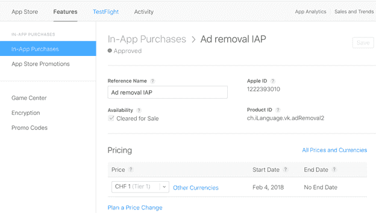
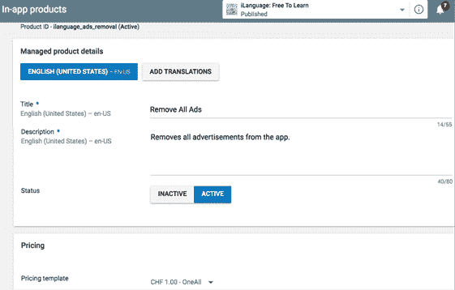
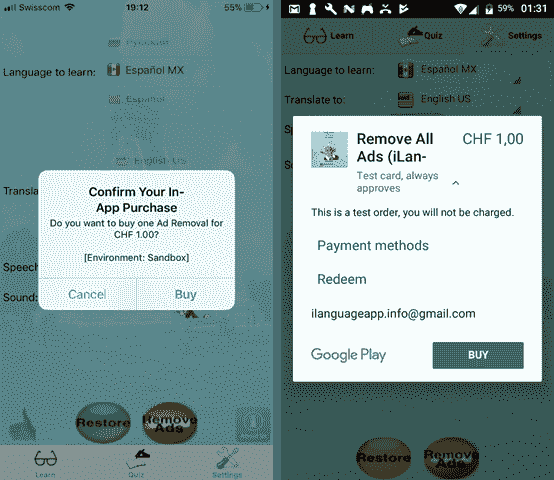

# 八、CSCS 中的应用内购买

在这一章中，我们将看到如何让我们快乐的应用程序用户为我们付费(在前面的章节中，我们看到了如何让他们快乐)。这一概念在 iOS 世界被称为应用内购买，在安卓世界被称为应用内计费。

与其他移动主题相比，设置和测试不那么简单，这是花费时间最多的地方。我们将从设置开始。

首先，你需要在 [iTunes Connect](https://itunesconnect.apple.com/) 中创建你的应用。然后，通过选择**选择您的应用** > **功能** > **应用内购买**，在 iTunes Connect 中创建您的应用购买。

应用内购买的常见用途之一是创建一个免费应用，其中包含一些广告，并让用户付费删除这些广告。

在下一章中，我们将看到如何向应用程序添加广告。在 iTunes Connect 中添加广告移除项目的示例见图 26。



 26:为 iOS 设置应用内购买

接下来，您需要创建测试用户来测试应用内购买功能。这是在 iTunes Connect 中通过选择**用户和角色** > **沙盒测试者**来完成的。

测试应用内购买功能时，您将使用沙盒测试帐户之一。请注意，您必须在 iOS 设备上的**设置** > **iTunes &应用商店**中注销(不要在那里登录任何测试帐户；稍后您将直接从应用程序中执行此操作)。

最后，您需要将应用内购买权利添加到项目中。在 Visual Studio 中打开**授权. plist** 文件，并确保**启用应用内购买**选项已启用。

如果一切设置正确，您应该会看到启用的**应用内购买**勾选这里的。

要添加不同的应用内产品，请前往**谷歌 Play Console** > **选择您的应用** > **商店存在感** > **应用内产品**。查看图 27 中添加广告移除项目的示例。



 27:为安卓设置应用内计费

请注意，在测试应用内计费功能之前，您必须将阿尔法或贝塔 APK 上传到**谷歌游戏控制台** > **选择您的应用** > **发布管理** > **应用发布**。

您还需要在**Google Play Console**>**设置** > **管理测试人员**中为您的应用添加测试账户，在这里您可以为您的应用创建一个测试人员列表。

比如你可以在**谷歌游戏控制台** > **选择你的 App** > **发布管理** > **App 发布** > **管理 Beta** > **管理测试员**。确保您作为这些测试人员之一登录到您的安卓设备上。

还要注意，必须将以下属性添加到您的 **AndroidManifest.xml** 文件中:

`<` `uses-permission` `android` : `name` = `"com.android.vending.BILLING"` `/>`

无法使用模拟器测试应用内计费；你需要一个真正的设备。

|  | 提示:启用安卓设备进行开发和 USB 调试很棘手:转到设置>系统>关于电话>内部版本号，点击七次内部版本号。然后，开发人员选项变得可见。但是您还没有完成:现在您可以在开发人员选项中启用 USB 调试—默认情况下它仍然是禁用的。 |

为了实现，我决定使用[插件。来自 Xamarin 的詹姆斯·蒙特马格诺的《开账单的数字》](https://www.nuget.org/packages/Plugin.InAppBilling)。它隐藏了相当多繁琐的实现细节，使得 C#代码简洁明了。

使用 CSCS 作为包装，代码更加简短，我们将在下一节看到它。

这个插件上有很好的[文档](https://jamesmontemagno.github.io/InAppBillingPlugin/)，所以我将在代码清单 48 中给出它的用法示例，它提取了所有可用的应用内购买项目。

 48:使用应用内计费插件提取所有应用内购买项目

```cs
  public async static Task GetInventory(string productId = "")
  {
    if (!string.IsNullOrEmpty(productId) &&
        m_id2Description.ContainsKey(productId)) {
      return;
    }
    var billing = CrossInAppBilling.Current;
    try {
      var connected = await billing.ConnectAsync();
      if (!connected) {
        ConnectionFailed();
        return;
      }
      var items = await billing.GetProductInfoAsync(ItemType.InAppPurchase,
                                m_availableProducts.ToArray());
      if (items == null) {
        return;
      }
      foreach (var item in items) {
        m_id2Description[item.ProductId] = item.Name;
      }
    } catch (Exception ex) {
      OnIAPError?.Invoke(ex.Message);
    } finally {
      await billing.DisconnectAsync();
    }
  }

```

在 CSCS 的用法甚至更简单:只有三个函数向解析器注册，如下所示:

`ParserFunction`。寄存器功能(`"Purchase"`、`new``PurchaseFunction`)； ``ParserFunction`。寄存器功能(` `"Restore"`、`new``RestoreFunction`)；
`ParserFunction`。寄存器功能(`"ProductIdDescription"`，

`new``ProductIdDescriptionFunction`())；

`PurchaseFunction`、`RestoreFunction`和`ProductIdDescriptionFunction`只是`InAppBilling`插件的薄薄的包装。

`ProductIdDescription`返回用户友好的应用内购买名称——它以代码清单 48 所示的`GetInventory()`方法缓存到`the m_id2Description dictionary`中。

三个 CSCS 函数的签名是:

恢复(`"restore_callback"`、产品 Id1、产品 Id2、...);

采购(`"purchase_callback"`，ProductID)；

productiddescription(productid)；

我们将在下一节看到如何使用它们。

##  例

代码清单 49 包含了 CSCS 代码，用于恢复以前的购买和进行新的购买。

|  | 注意:代码清单 49 中的产品标识必须与图 26 和图 27 中的产品标识完全匹配。 |

 49:在 CSCS 恢复和购买

```cs
  if (_IOS_) {
    productIdAds = "ch.iLanguage.vk.adRemoval2";
  } elif (_ANDROID_) {
    productIdAds = "ilanguage_ads_removal";
  }

  locRestore = GetLocation("ROOT", "CENTER", "ROOT", "BOTTOM", -80,-2);
  AddButton(locRestore, "buttonRestore", "Restore", 130,100);
  AddAction(buttonRestore, "restore");

  locPurchase = GetLocation("ROOT", "CENTER", "ROOT", "BOTTOM", 80,-2);
  AddButton(locPurchase,"buttonPurchase", "Purchase", 130,100);
  AddAction(buttonPurchase, "purchase_ads");

  function restore(sender, arg)
  {
    ShowToast(Localize("Please wait..."), 10, "blue");
    Restore("on_restore", productIdAds);
  }
  function purchase_ads(sender, arg)
  {
    ShowToast(Localize("Please wait..."), 10, "blue");
    Purchase("on_purchase", productIdAds);
  }

  function on_restore(error, productIds)
  {
    if (error != "") {
      ShowToast(Localize("Error Restoring:") + " " + error, 8, "red");
      return;
    }
    if (productIds == "") {
      ShowToast(Localize("Nothing to restore"), 8, "red");
      return;
    }

    restoredIds = tokenize(productIds, ",");
    restoredStr = " ";
    for (productId : restoredIds) {
      description = ProductIdDescription(productId);
      if (restoredStr != " ") {
        restoredStr += ", ";
      }
      restoredStr += description;
    }
    ShowToast(Localize("Restored:") + restoredStr, 6, "blue");
  }

  function on_purchase(error, productId)
  {
    if (error != "") {
      ShowToast(Localize("Error Purchasing:") + " " + error, 6, "red");
      return;
    }

    description = ProductIdDescription(productId);
    ShowToast(Localize("Purchased:") + " " + description, 6, "blue");
  } 

```

|  | 注:`“_IOS_”`、`“_ANDROID_”` CSCS 函数返回`true`对应的平台。 |

对于真实的 iOS 和安卓设备，运行购买部分的结果如图 28 所示。请注意，由于我们在本章开头设置测试用户的方式，这两种设备上的购买都是测试购买。



28:iOS 和安卓系统上的试购

实现应用内购买和应用内计费功能非常耗时，因为有许多事情可能会出错。

使用 CSCS，只有三个功能。但是，您仍然需要非常注意确切的产品标识、应用程序名称、权限以及正在使用的测试用户。在安卓系统上，在测试前上传阿尔法或贝塔 APK 也很重要。

在下一章中，我们将看到如何向应用程序添加广告，以及调试、本地化、用户默认和设置、调度事件和一些其他主题。