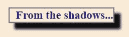
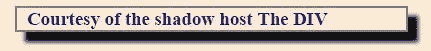

# 一、简介

想象一下，如果你愿意，在一个你可以控制你正在构建的页面的每一个方面的环境中做网络开发，并根据你的内心内容定制它。不喜欢你页面的白色背景？可以使用 CSS 轻松更改。当您的用户进入某个领域时，您想做出反应吗？你可以参加那个活动。这是一个强大的环境——您可以开发您的内容，并且可以保持其演示原样，或者根据需要对其进行自定义。

##  造型

例如，下面一行 CSS 将您的文档设置为具有**海军**字体颜色的**古董白色**背景。

代码清单 1

```js

  body {

  background-color: antiquewhite;

  color: navy;
              }

```

它强大、快速、简单！

通过将事件处理程序附加到您的元素，您可以很容易地连接到事件系统。

代码清单 2

```js
  <button
  id="btn" onclick="ShowBtn();">Hello World!</button>

```

然后，您添加代码来执行您想要的任何功能。

代码清单 3

```js
              function ShowBtn() {
                  theBtn =
  document.getElementById("btn").textContent;                
                  alert(theBtn);
              }

```

一旦你开始在这个环境中工作，你就开始意识到 CSS 和 JavaScript 之间有细微的区别，这取决于用户运行的浏览器。一种方法是尝试围绕这些差异进行编码，但这增加了环境的复杂性。幸运的是，有第三方库可以通过内部处理浏览器差异来隐藏这种复杂性。

因此，为了专注于您的应用，而不是浏览器差异，您开始依赖第三方软件库，如 jQuery、淘汰赛和剑道用户界面。

这些第三方库隐藏了这种复杂性，并提供了强大的功能，使开发变得更加容易。例如，我们可以使用 jQuery 的`on()`函数来隐藏事件处理中的浏览器差异。

但是，这些第三方库可以访问页面上与您相同的元素。所以你的漂亮的白色背景页面可能会变成深色背景，因为一个库用自己的 CSS 类名替换了你的 CSS 类名。哦，还有你点击按钮时写的那个 JavaScript 代码？嗯，有可能第三方库喜欢函数名`ShowBtn()`，所以调用的是它的方法而不是你的方法。

大多数 web 开发人员都熟悉一些变通方法，比如以特定的顺序加载库，给所有的类名和函数调用添加限定符，最后加载 CSS 和 JavaScript，等等。有些甚至不依赖第三方库。

## 是安圭拉？

AngularJS 是由 Google，Inc .和几个开源贡献者开发和维护的开源 JavaScript 框架。它最初发布于 2009 年，主要目的是使 HTML 语法更适合应用开发。它包括数据绑定和 HTML 模板等概念。最简单的形式是，Angular 应用由一个 HTML 页面(嵌入了“变量”)和一个带有属性和方法的 JavaScript 对象(称为控制器)组成。开发人员将操作控制器属性，Angular 将更新 DOM (HTML 页面)以反映变化的值。

Angular 2 于 2014 年发布，并被重写以利用允许组件开发的新功能。这是一种不同的前端开发方法；您不是构建一个页面并希望您的第三方库不与您自己的代码冲突，而是构建将按照您期望的方式工作的组件，然后使用 Angular 向您的用户显示这些组件。

当我们完成这本书时，我们将开发组件并使用现有组件来构建我们的网页。随着 Angular 2 的不断发展，您将会看到许多可以在 Angular 应用中使用的第三方组件。这将允许我们像其他环境一样进行前端 web 开发，选择我们想要使用的组件，并将它们绑定到一个集成产品中。

Angular 2 是 Angular 库的完全重写，并且与 Angular 1 应用不向后兼容。这引起了开发人员的一些担忧，但 Angular 团队希望利用 2009 年没有的许多新功能。Angular 2 是关于充分利用新的浏览器开发来推进和创建更好的应用。

Angular 2 包含的一些新网络功能包括:

ECMAScript 是由 ECMA 国际标准化的脚本语言规范。JavaScript 是客户端 web 应用最流行的 ECMAScript 实现之一。它于 1997 年首次出版，多年来不断发展壮大。最新版本(ES6)为编写复杂的脚本应用增加了大量的语法改进。虽然不是每个浏览器都支持所有的新功能，但 EMCAScript 6 是 JavaScript 的未来。

|  | 注意:你可以在马修·杜菲尔德的书[中阅读关于 ECMA6 的内容，ECMAScript 6 简洁地](https://www.syncfusion.com/resources/techportal/details/ebooks/ECMAScript_6_Succinctly)，可从 Syncfusion 获得。 |

TypeScript 是微软开发和维护的 JavaScript 的超集。它给 JavaScript 增加了一些特性，最显著的是变量的数据类型。它还增加了 ECMAScript 2015(大多数当前浏览器支持的脚本语言)中的许多功能。Angular 2 本身是用 TypeScript 编写的。

TypeScript 文件(**)。ts** 扩展名)被转换成 JavaScript 文件(**)。js** 分机)。这允许开发人员使用 TypeScript 的功能，并且仍然支持浏览器并运行脚本。

我们将在本书的示例中使用 TypeScript，但是如果您不熟悉该语言，这也没关系。了解 JavaScript 和任何面向对象的语言(如 C#)将使您对 TypeScript 有宾至如归的感觉。(另外，Syncfusion 在*简洁地*系列中有[一本书，如果需要的话可以帮助你学习。)](https://www.syncfusion.com/resources/techportal/details/ebooks/typescript)

### 注射

依赖注入是一种软件设计模式，它试图通过改变组件依赖的处理方式来减少紧密耦合的组件。例如，如果日志记录组件需要在出现问题时通知用户，那么访问日志记录组件中的另一个组件(可能是`NotifyUsersByEMail`)可能会很有诱惑力。虽然编码稍微简单一点，但它在日志记录和`NotifyUsersByEMail`组件之间建立了依赖关系。

这些依赖关系使得单独测试和调试组件变得困难。例如，如果您希望记录一个事件，并通知用户，但是没有发生，那么您需要确定是邮件组件失败了，还是日志组件失败了。此外，如果邮件组件发生变化，那么日志记录组件必须更新以适应变化。

解决这个问题的一个常见方法是编写一个接口，描述日志记录组件计划如何与其需要的通知任务进行交互。即定义如何指定用户、主题和消息，以及如何调用`send`方法。日志组件不知道细节，只知道它可以访问与接口匹配的另一个对象。对象本身被传入组件(通常是从构造函数传入)，供基础组件使用。日志记录对象不关心对象的细节，只关心它有没有商定的字段和方法。

这种方法使测试更容易，也适应了变化。例如，如果我们编写了一个`NotifyUsersBySMS`对象，只要它提供与`Logging`组件所期望的相同的方法，我们就可以简单地通过向构造函数传递一个不同的组件来改变通知行为。

## 组件

Web 组件最早是在 2011 年引入的，尽管在此之前的很多年里组件都是软件开发的一部分。W3C 正在研究实现 web 组件所需的标准，它们代表了 web 应用开发的未来。

### 组件

当您开发前端代码时，您通常会使用一些 JavaScript 框架，可能还会使用一些 CSS，将其散布在您的 HTML 中，并希望一些后续的 CSS 或 JavaScript 文件不会出现并更改您编写的所有代码。

最近，在一个网站上工作时，我发现了一个 JavaScript 库，看起来它为一个问题提供了解决方案。我将库和 CSS 文件添加到我的布局页面，并获得了我想要的功能，但有一个讨厌的小副作用:CSS 将我所有的`<p>`标签都改成了`text-align: center`。

前端开发变成了仔细组合 JavaScript 和 CSS 库的问题，希望它们不会相互冲突，并产生我们试图实现的功能。

### 组件

Web 组件本质上是浏览器知道如何显示的完全封装的 HTML 元素。由于 HTML 和 CSS 被封装在组件中，组件将始终显示其设计方式，即使后来加载的一些 CSS 样式表改变了 HTML 元素的表示规则。

当您创建一个网页时，您正在创建文档对象模型。DOM 是您的 HTML(或 XML 等)的表示。)源代码作为嵌套树结构。浏览器使用各种布局引擎(如 WebKit 或 Gecko)来处理将 HTML 解析成 DOM。一旦建立了 DOM，JavaScript 和 CSS 就可以操作 DOM 了。如果您使用过 jQuery 或 CSS，那么您肯定见过像`#` (ID)或`.`(类)这样的选择器来获取特定的 DOM 元素。

#### 影子天赋

影子 DOM 是一个封装的 DOM 对象，可以从任何现有的 DOM 元素中创建。创建阴影 DOM 的 DOM 元素被称为`ShadowHost`。新元素被称为`ShadowRoot`。下面的 JavaScript 片段展示了如何创建一个阴影 DOM 元素。

代码清单 4

```js
          <script>
              var ShadowHost
  = document.querySelector('button');
              var ShadowRoot
  = ShadowHost.createShadowRoot();

  ShadowRoot.innerHTML="Hello from Angular 2";
          </script>

```

阴影根中的标记对于阴影 DOM 之外的脚本是不可见的。Shadow DOM 的目的是提供一个封装的片段，避免被窥探。

如果您研究代码清单 5 中的以下示例，您会看到 HTML 元素包含`Hello, world`。但是，脚本创建了一个`ShadowRoot`(如果它还不存在的话)，并将`innerHTML`设置为`"Hello from Angular 2"`。当浏览器执行这段代码时，按钮的内部内容会被替换为`ShadowRoot`中的任何内容。

代码清单 5

```js
      <body>
          <button
  id="btn" onclick="ShowBtn();" >Hello,
  world!</button>
          <script>
              var ShadowHost
  = document.querySelector('button');
  if
  (ShadowHost.shadowRoot==null)                           
                   {    
                        var
  ShadowRoot = ShadowHost.createShadowRoot();
                        ShadowRoot.innerHTML="Hello
  from Angular 2"; 
                   }
          </script>
          <script>
              function
  ShowBtn() {
                  theBtn =
  document.getElementById("btn").innerHTML;                

  alert(theBtn);
              }
          </script>
      </body>

```

但是，当你点击按钮时，`ShowBtn()`功能显示的是内容`Hello, world`，而不是浏览器从`ShadowRoot`显示的内容。这是构建 web 组件所需的封装和范围的一个示例。

|  | 注意:一些浏览器通过特殊的伪选择器将部分阴影 DOM 暴露给 CSS。此外，组件作者可以选择公开一些内容，特别是主题和样式，如果他们愿意的话。 |

#### 模板标签

组件难题的另一部分是 HTML `<template>`标签。这个标签允许我们构建 HTML 片段供以后使用。模板标签中的内容不会显示，也不会被激活(图像不会被下载，脚本不会运行，等等)。).

模板可以包含 HTML、CSS 样式表，甚至 JavaScript。它们可以与 DOM 一起放置在任何地方，并且在您需要它们之前保持不活动。下面是一个简单的模板，它在一个`<h3>`元素周围绘制了一个边框和阴影，并添加了一些文本。

代码清单 6

```js
          <template>
              <style>
                  h3 { 
                      color:
  darkblue; 

  border:2px solid gray;

  box-shadow: 10px 10px 5px #0f0f0f;

  width:20%;

  margin-left:20px;

  padding-left:10px;
                      }
              </style>
              <h3>From
  the Shadows… </h3>
          </template>

```

现在，当我们创建影子根时，我们将插入模板代码，而不是依赖操纵`innerHTML`属性。我们模板中的`<h3>`样式，因为它在阴影根中，不会影响页面可能使用的任何其他`<h3>`样式。

代码清单 7

```js
  var ShadowHost =
  document.getElementById('HostDiv');   
  if
  (ShadowHost.shadowRoot==null) // See if the
  element has a shadow root?
     {
        var ShadowRoot =
  ShadowHost.createShadowRoot();   
        // Get the template                          
        var tmpl =
  document.querySelector('template');
        ShadowRoot.appendChild(document.importNode(tmpl.content,
  true));
      }

```

我们抓取模板元素(如果有多个不同的模板，我们可以使用`getElementById()`)并将其追加到 Shadow Root 元素中。我们的屏幕现在将在`HostDiv`元素中显示以下内容。



图 1:阴影根

#### 从主机获取内容

通常，我们的模板代码会希望从宿主元素获取其内容，而不是对模板代码中的内容进行硬编码。例如，如果我们的影子主机元素如下所示:

代码清单 8

```js
  <div
  id="HostDiv"><span>The DIV</span></div>

```

我们可以替换模板的 HTML 行:

代码清单 9

```js
  <h3>From the
  Shadows… </h3>

```

带有以下片段:

代码清单 10

```js
  <h3>Courtesy
  of the shadow host <content
  select="span"></content></h3>

```

当模板被插入时，它将抓取影子主机的`<span>`标签的内容并使用它。



图 2:来自影子主机的内容

总的来说，影子 DOM 和模板系统为网页前端开发中的组件打开了大门。这是 Angular 2 提供的最大好处之一。

Angular 2 利用 web 组件和 Shadow DOM 的优势来支持组件驱动的开发。在本书的剩余部分中，我们将使用 Angular 2 框架来创建一个组件驱动的应用，或许还会为其他应用创建一些可重用的组件。

|  | 注:本书代码示例可在[https://bitbucket.org/syncfusiontech/angular-2-succinctly](https://bitbucket.org/syncfusiontech/angular-2-succinctly)下载。 |