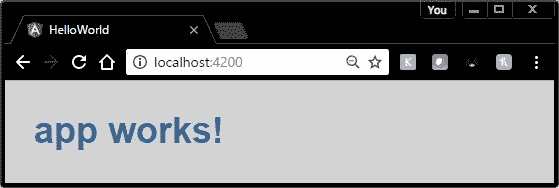

在本章中，我们将查看 Angular CLI 创建的默认文件，看看它们的版本 **Hello World** 是如何工作的。

## 角形 CLI

让我们从使用 Angular CLI 工具创建应用程序开始。

代码清单 36

```
  ng new HelloWorld

```

一旦创建了应用程序，打开 **src\app** 文件夹，让我们看看默认组件( **app.component.ts** )。组件将非常简单，但会让我们开始。它应该有以下(或类似的)代码，这取决于 Angular 更新。

代码清单 37

```
  import { Component } from
  '@angular/core';
    @Component({
      selector: 'app-root',
      templateUrl:
  './app.component.html',
      styleUrls:
  ['./app.component.css']

     })
  export class AppComponent
  {
        title = 'app
  works!';
   }

```

每个 Angular 2 应用程序至少需要一个根组件，按照惯例，它被命名为`AppComponent`。该组件负责填充屏幕的一部分。(如果你还记得我们介绍章节中的 Shadow DOM 和`template`标签，这将会对 Angular 到底在做什么有意义。)

虽然简单，但这段代码说明了 Angular 2 内部的一个基本组件。让我们来看看。

`import`语句用于引用我们需要的模块(类似于 C#程序中的`using`语句)。对于我们的简单程序，我们只需要在角度/核心库中找到的`Component`模块。对于实际应用，您可能会有多个`import`语句。

|  | 提示:输入导入语句时，请先输入文件名，这样 IntelliSense 就可以向您显示它在文件中找到的组件名称。 |

`@Component`语句是一个函数，它获取一组元数据，并将其与我们正在定义的组件相关联。对于这个组件，我们指定 CSS 选择器和我们想要使用的模板。当组件被实例化时，任务听起来应该很熟悉。

*   从选择器(阴影主机)创建阴影根。
*   将所选模板加载到阴影根。

最后一行代码，`export`语句告诉这个模块将提供给其他人的组件的名称。大括号`{}`之间的代码是我们可以存储组件类的属性和方法的地方，尽管我们还不需要简单的`HelloWorld`组件的任何类细节。

这个`export`语句允许其他组件和模块导入，我们将在下一个模块中看到。

**App.module.ts** 文件是描述应用程序元素如何协同工作的根模块。每个应用程序都至少有一个 Angular 模块。这里显示了我们的 **Hello World** 应用程序的根模块。

代码清单 38

```
  import
  { BrowserModule } from '@angular/platform-browser';
  import
  { NgModule }      from '@angular/core';
  import
  { FormsModule }   from '@angular/forms';
  import
  { HttpModule }    from '@angular/http';

  import
  { AppComponent }  from './app.component';
  @NgModule({

  declarations: [ AppComponent ],

  imports:      [ BrowserModule, FormsModule, HttpModule ],

  providers:    [],     

  bootstrap:    [ AppComponent ]
  })
  export class AppModule { }

```

和我们的组件一样，我们从 Angular ( `NgModule`、`BrowserModule`、`FormsModule`、和`HttpModule`)以及我们的应用程序组件(`AppComponent`中导入组件。

|  | 注意:默认模块包含大多数应用程序可能需要的来自 Angular 库的导入。您的应用程序可能不需要这些模块，但同样可能需要导入额外的模块。 |

`@NgModule`装饰器获取一些关于如何编译和运行应用程序的元数据。

`imports`数组列出了应用程序需要的所有模块。在浏览器中运行的每个应用程序都需要`BrowserModule`。默认模块也导入`Forms`和`Http`模块。

这个数组包含我们的应用程序可能需要的组件。在这种情况下，只需要我们之前创建的应用程序组件。在其他应用程序中，阵列中可能指定了多个组件。

`bootstrap`数组包含 Angular 将创建并插入 index.html 主机网页的组件的名称。在这种情况下，它也是我们的应用程序组件。

现在我们已经看到了模块和组件，我们需要另一个程序来启动环境(称为引导)来加载我们的组件。在我们的 **src** 文件夹中(不是 **app** 文件夹)，有一个名为 **main.ts** 的文件。

代码清单 39

```
  import
  './polyfills.ts';
  import { platformBrowserDynamic } from
  '@angular/platform-browser-dynamic';
  import { enableProdMode }         from
  '@angular/core';
  import { environment }            from
  './environments/environment';
  import { AppModule }              from './app/';

  if (environment.production) {
     enableProdMode();
  }
  platformBrowserDynamic().bootstrapModule(AppModule);

```

第一行导入`polyfills`库，该库用于允许较旧的浏览器使用浏览器不支持的某些 TypeScript 功能(不是图形库，顾名思义)。这允许您作为开发人员使用所需的新浏览器功能编写代码，即使浏览器本身不支持这些功能。

接下来的四行允许我们加载组件。平台浏览器模块允许我们在浏览器中运行应用程序。然而，Angular 2 应用程序可能在其他平台上运行，因此这种方法允许相同的代码作为浏览器的引导程序，或者可能是另一个平台。

下一条语句检查我们是在生产模式还是开发模式下运行。由于我们正在导入`environment`模块，我们可以访问`production`标志，并可选地添加一些额外的代码(在本例中，是 enableProdMode()函数)。如果`ProdMode`被启用，一些开发模式特性(如断言检查)被关闭。

最后一行代码调用`bootstrapModule`方法，并将其传递给我们的模块。我们可以创建一个单独的文件来完成组件和引导，但是请记住，我们不想编写紧密耦合的代码。显示视图(`AppComponent.ts`)和引导应用程序(`main.ts`)是两个不同的任务，因此将它们放在不同的组件中是松耦合组件设计的一个很好的例子。

我们需要做的最后一件事是创建 index.html 文件，这应该是 web 开发人员非常熟悉的。Index.html 是你的起点，包含了非常常见的说法。您将声明`<html>`、标题和一些元标签，如代码清单 40 所示。

代码清单 40

```
  <!doctype
  html>
  <html>
    <head>
      <meta
  charset="UTF-8">
      <title>Hello
  World</title>
      <base
  href="/">
      <meta
  name="viewport" content="width=device-width,
  initial-scale=1">
      <link
  rel="icon" type="image/x-icon"
  href="favicon.ico">
    </head>
  ...

```

您可以添加任何标签或其他标题元素作为您的 HTML 的一部分。

如果您想要任何样式表，您也可以在这里加载它们。请记住，这些样式表只会影响主 DOM，而不会影响组件，组件生活在它们自己的封装世界中。

代码清单 41

```
  <link rel="stylesheet"
  href="styles.css">
  ...

```

虽然您可以直接在索引文件中添加样式表，但我建议将它们添加到 **angular-cli.json** 中，并让它们捆绑在一起，作为 angular 构建过程的一部分。

我们现在可以指定我们的主体内容，对于这个应用程序，它只是为要编写的组件创建一个占位符。

代码清单 42

```

  <body>

  <app-root>Loading...</app-root>
    </body>
  </html>

```

加载…是一个占位符，它将在初始化过程完成时出现在网站上。如果您已经向项目中添加了 Font Awesome，那么您可以在加载过程中显示一个微调图标，如代码清单 43 所示。

代码清单 43

```
      <app-root><i
  class='fa fa-spinner fa-spin'></i>Loading...</app-root>

```

您还会发现一个样式表(**style . CSS**)与**index.html**文件位于同一个项目文件夹中。默认的是空的，但是您可以添加任何您想要应用到您的应用程序的样式规则。

代码清单 44

```
  h1
  {

  color: #369;

  font-family: Arial, Helvetica, sans-serif;

  font-size: 250%;
  }
  body
  {

  margin: 2em;

  background-color: lightgrey;
  }

```

最后，让我们看看这是什么样子。

打开命令窗口，切换到应用程序目录，并输入以下内容。

代码清单 45

```
  npm start

```

您将看到许多编译消息滚动而过，最终会看到一条消息，指示“**包现在有效**”出现此消息时，打开浏览器，导航至 [http://localhost:4200](http://localhost:4200) 。如果一切顺利，您将看到我们令人印象深刻的 **Hello World** 应用程序在浏览器窗口中运行。



图 9:你好，世界

对于一个简单的 Hello World 应用程序来说，这看起来像是很多文件和工作，但幸运的是，Angular CLI 为您完成了大部分工作。我们现在有一个基于组件的应用程序在浏览器中运行。虽然听起来不多，但随着我们更详细地探索 Angular，您应该会开始意识到组件在前端开发领域有多么强大。