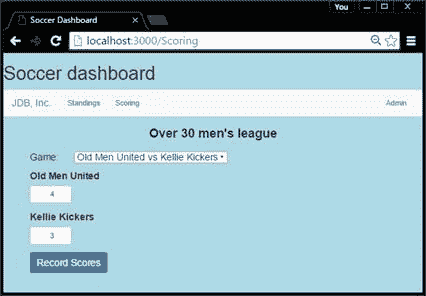

# 十二、我们的应用

在本章中，我们将构建一个名为足球仪表板的简单示例应用，将 Angular 2 应用开发中的所有内容联系在一起。该应用用于显示体育联盟的排名，并允许当分数管理员公布分数时实时更新。

在我的一个足球联赛中，许多球员想知道比赛结束后的排名和结果。通过允许裁判在他们的手机上记录分数，即使他们正在离开球场，显示排名的网站也很有可能在球员离开球场回家之前是最新的。

|  | 注:本书代码示例可在[https://bitbucket.org/syncfusiontech/angular-2-succinctly](https://bitbucket.org/syncfusiontech/angular-2-succinctly)下载。 |

以下是演示应用应该是什么样子的模型(用 Balsamiq 生成)。实体模型的一个好处是，您可以避免“冰山效应”，即客户认为应用走得更远，因为他们看到了屏幕(冰山一角)，而没有意识到仍然需要完成的代码量。

排名页面显示了按积分排序的球队(假设三分获胜，一分平局)。次要排序顺序是总目标。请记住，当设计任何排名系统时，您将需要多个排序标准来处理联系。此外，用最常见的方式表达相应运动的排名。足球用分数，棒球用后面的比赛。

图 12:排名页面

|  | 注意:如果你要运行一个锦标赛，你可以用一个 JavaScript 计时器在一个大显示器上显示排名，以重新轮询服务并每隔几分钟获得更新的分数。 |

这个页面设计得尽可能简单，这样裁判或记分员可以快速更新比赛结果(为排名页面提供信息)。他们从下拉列表中选择游戏，然后添加分数。

图 13:记分员页面

组件代码将更新数据库中的分数，排名页面将在下次刷新时更新。

|  | 注意:记录分数的模块通常需要某种身份验证方法，例如登录密码或 oAuth。 |

这个应用应该提供如何创建模块、菜单、服务等的基本介绍。，在 Angular 2 应用中。重点在前端，数据存储在 SQL 数据库表中。您可以手动更新这些表，或者扩展应用来创建一些额外的 Angular 组件，以允许管理员用户更新基本数据表。