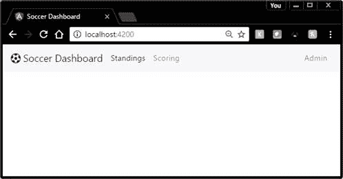
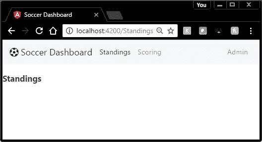

典型的应用程序有多个视图和某种导航方法在它们之间移动。`Router`模块用于处理视图之间的导航。对于我们的足球仪表板，我们需要三个组件:排名页面、评分页面和管理页面。



图 14:示例菜单

我们将使用推特引导作为我们的主要用户界面系统，并为一些图标提供字体。请务必将这些包含在您的 Angular CLI 配置文件中(详情请参见[第 5 章](05.html#_Chapter_5_))。

HTML 5 浏览器通过`pushState()`、`replaceState()`等新方法提供对浏览器历史修改的支持。这些方法允许 Angular 2 为应用内导航创建 URL。为了支持这种导航，您需要遵循几个步骤。首先是在你的主页中声明一个基本引用(**index.html**)。应增加以下一行作为`head`部分的第一行。

代码清单 97

```
  <base
  href="/">         <!-- Used to
  compose navigation URLs -->

```

|  | 注意:Angular CLI 应用程序已经为您包含了 href 行。 |

我们在以前的页面中创建的应用程序组件现在将被调整为导航组件，因此我们需要一个新的组件，该组件带有一个专注于菜单或按钮的模板，以导航到不同的组件。

你可以用任何你喜欢的方式设计你的文件夹结构。我将模板视图放入名为**视图**的文件夹中。这是一种偏好，而不是一种要求，但它使我对业务逻辑和显示的分离更容易管理。这是我们足球仪表板的主要应用程序组件:

代码清单 98

```
  <!--
      Main application component
  -->
  import { Component } from '@angular/core';
    @Component({
      selector: 'app-root',                  
      templateUrl: './views/Main.html'
     })
  export class AppComponent { 
  title = 'Soccer
  Dashboard';
  }

```

### 主菜单

我们的主菜单视图代码，如代码清单 99 所示，是一个 Twitter Bootstrap navbar 设置。系统使用`<a>`标签来指示菜单链接。但是，我们将使用名为`routerLink`的 Angular 2 属性，而不是标准的`href`属性。该属性将用于告诉导航页面当菜单项被选择时要转到哪个“链接”。我们将在本章后面定义这些链接。

代码清单 99:应用/视图/主

```
  /*
      Main menu view
  */
  <nav class="navbar navbar-light
  bg-faded">
    <div class="container-fluid">
      <a class="navbar-brand"
  href="#">
        <i class="fa fa-futbol-o">&nbsp;</i>{{
  title }}
      </a>
      <ul class="nav navbar-nav">
          <li class="nav-item">
            <a class="nav-link active"
  routerLink="/Standings" 
               routerLinkActive="active"
  >Standings</a>
          </li>
          <li>
  <a class="nav-link"
  routerLink="/Scoring" >Scoring</a>
  </li>        
        <li class="nav-item float-xs-right
  ">
          <a class="nav-link"
  routerLink="/Admin">Admin</a>
         </li>
        </ul>
  </nav>
  <router-outlet></router-outlet>

```

最后一行`<router-outlet>`是路由器输出将被写入的占位符。

为了创建和测试菜单，我们将使用相同的代码创建简单的占位符组件。

代码清单 100

```
  /*
      Standings component
  */
  import { Component } from '@angular/core';        
  // Component metadata
  import { ViewEncapsulation } from '@angular/core';
  // Encapsulation enum 
    @Component({
      encapsulation: ViewEncapsulation.Native,      
  // Use Shadow DOM
      template: '<h3>Standings</h3>'
     })
  export class AppStandings {}

```

请注意，该组件中没有指定选择器，因为当使用该组件时，路由器系统将决定将生成的输出放在哪里。为`AppScoring`和`AppAdmin`菜单项创建一个类似的组件。

要配置路由，首先需要定义一系列路由定义。该定义至少包含两个元素:

*   `path`:用户在地址栏看到的名字。
*   `component`:导航到这条路线时调用的组件。

路径是路由器系统将用来链接到我们的组件的“网址”的名称。路径名中没有斜线；路由器将处理名称解析。

组件本身是选择选择路径时应该使用的现有组件的名称。

例如，我们可以使用以下结构来链接到排名页面。

代码清单 101

```
  { path: "Standings",component:
  AppStandings }

```

创建 app.route.ts 文件是为了构建和配置您的`Routes`到各种应用程序组件。

代码清单 102

```
  import { Routes
  }               from '@angular/router';
  import { AppStandings }         from
  './app.standings';
  import { AppScoring }           from
  './app.scoring';
  import { AppAdmin }             from
  './app.admin';

```

代码的第一部分从 Angular 导入路由模块以及应用程序中需要的所有组件。接下来是应用路线的构建。

代码清单 103

```
  export const appRoutes:
  Routes = [
      { path: "Standings",component:
  AppStandings },
      { path: "Scoring",component:
  AppScoring },    
      { path: "Admin",component: AppAdmin
  },
  ];

```

最后一部分创建了我们构建的路线数组的公共常量。我们将在 **app.module.ts** 文件中访问这个数组。

关于路线要记住的几件事:

*   您可以使用`:parameter`语法将参数传递给路线，如以下代码所示。

代码清单 104

```
  { path: 'game/:id', component: GameDetails }

```

*   您可以使用`'**'`作为通配符路径名，这是路由器无法匹配任何路径时使用的默认组件(如 404 错误页面)。

代码清单 105

```
  { path: '**', component: PageNotFound }

```

|  | 注意:需要记住的一点是，数组的顺序很重要，因为路由器会搜索数组，直到找到第一个匹配项。如果在第一个数组中放入一个通配符元素，它将永远不会到达路径中的任何其他路径。 |

**app.module.ts** 模块将提供我们在应用程序中定义的路由之间的链接。

代码清单 106

```
  import { NgModule }     
  from '@angular/core';
  import { BrowserModule } from
  '@angular/platform-browser';
  import { RouterModule }  from '@angular/router';

  import { appRoutes }     from './app.routes';   // Routes defined earlier
  import { AppComponent }  from './app.component';
  import { AppStandings }  from './app.standings';
  import { AppScoring }    from './app.scoring';
  import { AppAdmin }      from './app.admin';

  @NgModule({
    imports:      [
  BrowserModule,RouterModule.forRoot(appRoutes) ],
    declarations: [
  AppComponent,AppStandings,AppScoring,AppAdmin ],
    bootstrap:    [ AppComponent ]
  })
  export class AppModule { }

```

我们导入各种模块(Angular 代码模块和应用程序模块)，然后设置声明来组织我们的应用程序。我们从我们创建的**应用程序路线**文件导入我们的路线，并使用`forRoot`方法将其分配给`RouterModule`。

您可以使用以下语法添加路由，如果找不到页面，将调用该语法。

代码清单 107

```
  {
  path: '**', component: NotFoundComponent }

```

这允许您在用户输入无效网址时显示错误消息。下面的代码显示了一个示例页面`NotFoundComponent`。

代码清单 108

```
  // Angular 2 modules
  import { Component } from
  '@angular/core';          // Component metadata
  import { ViewEncapsulation } from
  '@angular/core';  // Encapsulation Enum
  // Component metadata, defining the
  template code
  @Component({
    encapsulation:
  ViewEncapsulation.Native,          // Shadow DOM
    template: '<h3>Page not found</h3>'
  })
  export class NotFoundComponent {
   }

```

您可以向组件中添加代码来记录 URL 故障，以查看用户是否试图入侵网站，或者网站上的链接是否无效。

|  | 提示:页面未找到条件不是实际条件，只是默认了如果所有路由都用尽了该怎么办。请务必将路线定义添加到“路线”集合的末尾。 |

定义路由并将其集成到我们的应用程序中后，主菜单现在将把我们的组件加载到`<router-output>`部分，如图 15 所示。请注意，网址也会改变，以反映我们的路线名称。



图 15:运行中的路由

通过设置路由器系统和路由，我们现在可以提供导航链接，以便在应用程序的视图之间移动。在下一章中，我们将开始向视图添加一些实际的代码，而不是简单的占位符组件。