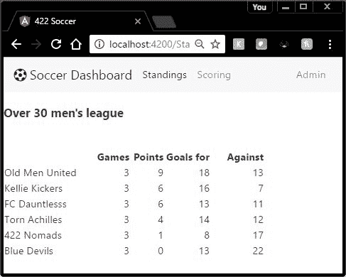

通常在开发应用时，您需要一些代码来向多个组件提供功能或数据。对于这种类型的操作，Angular 2 允许您创建可重用的服务，并将它们传递(注入)到您的组件中以供使用。共享数据或功能应该立即喊“创建服务！”

排名页面将被分成两部分:显示和数据部分。呈现和数据的分离几乎总是构建应用的首选方法。我们将提供获取所需数据的服务和显示数据的表示层。



图 16:排名页面

随着评分组件中评分的更新，排名也会更新，当浏览器重新访问页面时，更新后的排名会出现。

我们的足球仪表板的基本数据模型是日程数据。时间表数据包括已经进行的比赛(对于排名模块)和尚未进行的比赛(对于得分模块)。由于数据模型将服务于这两个组件，我们将创建一个服务来处理它。

我们可以使用微软的数据库来保存我们的表。Angular 2 将依赖某种 web 服务与数据进行通信，因此可以使用任何数据库系统(甚至文本文件)；对 Angular 来说，这是一个黑匣子。

#### 团队表

每个足球队在队桌上都有一排。该表的结构是:

| 圆柱 | 数据类型 | 笔记 |
| `Id` | `int` | 主关键字 |
| `Name` | `varchar(32)` | 不为空 |

你会有更多的字段，如开始日期，团队类型(男女同校，30 岁以上，等等。)，但我们只展示了基本结构。请随意增强。

#### 参考文献表

裁判表记录了俱乐部使用的裁判。每个裁判都有一个用户标识，这样他们就可以登录查看他们需要记录分数的比赛。

| 圆柱 | 数据类型 | 笔记 |
| `Id` | `int` | 主关键字 |
| `RefName` | `varchar(32)` | 不为空 |
| `UserId` | `varchar(20)` | 不为空 |

#### 计划表

计划表包含已安排的游戏和已玩的游戏。任何尚未玩的游戏都将在计分栏中包含 a -1。这允许裁判找到可能已经进行过(在过去的某个日期)、尚未评分(评分为-1)并且被用户裁判的游戏。

| 圆柱 | 数据类型 | 笔记 |
| --- | --- | --- |
| `Id` | `int` | 主关键字 |
| `PlayingDate` | `date` | 不为空 |
| `HomeID` | `integer` | 团队的外来钥匙 |
| `AwayID` | `integer` | 团队的外来钥匙 |
| `HomeScore` | `int` | 默认值为-1 |
| `AwayScore` | `int` | 默认值为-1 |
| `RefID` | `integer` | refs 的外键 |
| `notes` | `varchar(max)` |  |

服务设计过程包括两个步骤。首先，我们设计接口来放入和获取数据库中的数据。然后，我们设计服务，使数据对各种组件可用。在**应用**文件夹中，创建**界面**和**服务**文件夹。

即使数据库设计有三个表，我们也只需要一个接口来读取和更新`games`表。我们还将创建一个接口来保存排名，尽管这将在代码中计算，而不是存储在数据库中。

代码清单 109:调度接口

```js
  /** Schedule interface */
  export interface iSchedule{
      id: number,
      PlayingDate: Date,
      HomeTeam: string,
      AwayTeam: string,
      HomeScore: number,
      AwayScore: number,
      RefName: string,
      notes?: string  }

```

请注意，即使物理表依赖外键将内容链接在一起，我们的界面也有实际的团队和裁判名称。很可能，数据库有一个视图，可以从三个物理表中创建填充的计划。

代码清单 110:排名界面

```js
  /** Rankings interface */
  export interface iRanking {
      TeamName: string,
      GamesPlayed: number,
      Wins: number,
      Ties: number,
      GoalsFor: number,
      GoalsAgainst: number
  }

```

有了我们构建的接口，我们可以将一个提供两个基本功能的服务放在一起。一种是将整个计划作为计划对象的集合返回。第二个功能是更新特定日程标识号的分数和注释。

在本章中，我们将为模型和测试目的创建内部数据。在后面的章节中，我们将从一个 HTTP web 服务调用中获取数据。目前，该文件将存储在**服务**文件夹中。

#### 计划-数据. ts

我们将创建一个名为 Schedule-data.ts 的 TypeScript 文件。该文件的目的是向服务提供数据。

代码清单 111

```js
  import {iSchedule} from
  "../interfaces/schedule";
  import {iTeam} from
  "../interfaces/teams";

  export const SEASON_SCHEDULE: iSchedule[] = 
     [   
      {id:1,PlayingDate:new Date(2016,8,23),
            HomeTeam:'Old Men
  United',AwayTeam:'Kellie Kickers',

  HomeScore:4,AwayScore:3,RefName:'Joanne',notes:'Overtime game'},
      {id:2,PlayingDate:new Date(2016,8,26),
            HomeTeam:'Torn Achilles',AwayTeam:'422
  Nomads',

  HomeScore:7,AwayScore:2,RefName:'Colin',notes:''},
      {id:3,PlayingDate:new Date(2016,8,28),
            HomeTeam:'Blue Devils',AwayTeam:'FC
  Dauntlesss',

  HomeScore:4,AwayScore:6,RefName:'Gene',notes:''},
        ...
    ]
  export 
     const TEAMS: iTeam[] =
     [
         { id:1,name:"Old Menu
  United",type:"Over 30"},
         { id:2,name:"422
  Nomads",type:"Over 30"},
         { id:3,name:"FC
  Dauntless",type:"Over 30"},
         { id:4,name:"Kellie's
  Kickers",type:"Over 30"},
         { id:5,name:"Blue
  Devils",type:"Over 30"},
         { id:6,name:"Torn
  Achilles",type:"Over 30"}       

  ]

```

第一行将计划界面导入组件。组件本身只是导出一组`schedule`对象。我们现在有了需要为我们的服务提供的数据元素(`interface`和`collection`)。

我们现在需要创建一个类，它将被用作其他组件的服务。第一步是使用`@Injectable`方法，这意味着代码可以注入到其他组件中。我们将需要从 Angular 导入`Injectable`模块和提供我们刚刚编写的数据的模块。

代码清单 112

```js
  import
  {Injectable} from 'angular2/core';
  import {SEASON_SCHEDULE, TEAMS } from
  './schedule-data';
  @Injectable()

```

我们用类代码遵循这一点，它将包含服务将提供的各种方法。

代码清单 113

```js
  export class
  SoccerService{   method calls }

```

我们可以在`service`类中同时拥有私有和公共(默认)方法；它遵循 TypeScript 类的规则。

代码清单 114: SoccerService.ts

```js
  /**
    * SoccerService
   * Joe Booth:  Angular 2 Succinctly
   */
  import { Injectable }    from '@angular/core';
  import { SEASON_SCHEDULE, TEAMS } from
  './schedule-data';

  @Injectable()
  export class SoccerService {
      getSchedule() : any {
          return Promise.resolve(SEASON_SCHEDULE);
      }
      getTeams() : any {
          return Promise.resolve(TEAMS);
      }
  private ComputeRankings()
  {
  // To
  compute rankings from the schedule
      }
  }

```

在我们的服务中，我们提供两种方法:`getSchedule()`和`getTeams()`方法。他们承诺返回数据集合(在本例中，来自`schedule-data`类)。因为服务只是返回数据，所以它不关心数据是如何生成的——它期望`schedule-data`类来处理这个问题。在这个例子中，我们可能需要一个私有的方法来根据时间表数据计算排名。(我们将在后面的章节中进行介绍。)

|  | 注意:Promise 是一个允许执行异步操作的 TypeScript/JavaScript 命令。那个。resolve 关键字提供将返回对象的数据源。 |

不是所有的浏览器都支持异步操作，所以您可以通过直接返回数据来进行标准调用，而不是使用承诺。例如:

代码清单 115

```js
  getTeamsAsync() : any {
          return Promise.resolve(TEAMS);
      }
  getTeams() : any {
          return TEAMS;
      }

```

我建议在您的服务中提供这两种方法，这样当浏览器开始支持 ECMAScript 6 时，应该很容易更新服务，开始利用异步操作支持。

现在我们的服务已经创建，我们希望在我们的组件中使用它，在这种情况下，提供组件需要显示的数据。

第一步是使用`import`语句告诉我们的组件在哪里可以找到服务。

代码清单 116

```js
  import
  { SoccerService} from './services/soccerService';
  import { Title } from '@angular/platform-browser';

```

我已经把服务和界面放在单独的文件夹中，离开**应用**文件夹。如果使用不同的结构，请务必调整文件位置。您需要将该服务导入到使用该服务的任何组件中。我还决定从 Angular 导入`Title`服务(允许我设置浏览器的标题栏)。

代码清单 117

```js
  // Our interfaces
  import
  { Team } from './interfaces/Teams';
  import
  { Title } from '@angular/platform-browser';
  import
  { Ranking } from './interfaces/rankings';
  import
  { Schedule } from './interfaces/schedule';
  import { SoccerService} from
  './services/soccerService';

```

下一步是告诉组件它将使用的服务提供商。这是一个名为`providers`的新组件指令。它列出了我们的组件可能需要的服务和其他可注射模块。

代码清单 118

```js
  providers:
  [Title,SoccerService]

```

在这个例子中，我们从`angular/platform-browser`注入`Title`模块，以及我们的`soccerService`模块。您可以根据需要为组件添加任意数量的可注射模块。

您的组件的构造函数将需要更新以接收注入的模块。例如，我们的`soccer`组件将更新浏览器标题，并从`soccerService`获取其数据。下面的代码显示了修改后的构造函数。

代码清单 119

```js
  public constructor(
  private _titleService: Title,
                      private _soccerService:
  SoccerService ) {
         this._titleService.setTitle("422
  Soccer");
         this.getTeams();
       }

```

尽管您可以按照自己选择的任何方式命名注入的模块，但我更喜欢下划线字符，以便将它们与组件中的其他变量区分开来。在代码清单 119 中，我们使用 Angular 中的`Title`服务来更新浏览器的标题，我们将添加自己的方法`GetTeams()`，将服务中的团队数据复制到组件中的集合变量中。

#### 使用服务

我们的服务提供了不同的数据返回方法。我们添加了一个方法来同步和异步获取团队。我在我的组件中添加了一个名为`UsingAsync`的布尔标志(目前默认为`false`)。`GetTeams`方法将使用此标志来确定如何更新内部`Teams`收集对象。请记住，如果方法异步运行，则在方法完成之前，您的代码可能会继续运行。

代码清单 120

```js
       getTeams() {
         if (this.UsingAsync) {
          let xx =
  this._soccerService.getAllTeamsAsync();
              xx.then((Teams:Team[])=>
  this.MyTeams =Teams );
         }
         else
         {
          this.MyTeams =
  this._soccerService.getAllTeams();
         }
       }

```

在本例中，我们对这两种方法都进行了编码，以获取团队数据，但目前只使用同步版本。

`UsingAsync`布尔属性(当`true`使用`xxxAsync()`方法时)。这些方法调用服务并获得承诺。

代码清单 121

```js
          let xx =
  this._soccerService.getTeamsAsync();

```

在第二部分中，`then()`告诉方法一旦服务恢复了该做什么。在这种情况下，我们只是获取服务结果，并用它们更新我们的`MyTeams`变量。

代码清单 122

```js

  xx.then((Teams:Team[])=> this.MyTeams =Teams

```

通过从 Syncfusion 库中下载前面提到的任何书籍，您可以了解更多关于 TypeScript 和 JavaScript 中的承诺和异步编程的信息。

#### App.standings

 `app.standings`组件代码如代码清单 123 所示。

代码清单 123

```js
  import { Component } from '@angular/core';
  import { Title } from
  '@angular/platform-browser';
  // Our interfaces
  import { Team } from
  './interfaces/Teams';
  import { SoccerService} from
  './services/soccerService';
    @Component({
      template:
  '<h3>Standings</h3>',
      providers: [Title,SoccerService]   

     })
  export class AppStandings {
           public UsingAsync: boolean =
  false;
           public MyTeams: Team[];

           public constructor(private
  _titleService: Title,
                            private
  _soccerService: SoccerService ) {

  this._titleService.setTitle("422 Sportsplex");
           this.getTeams();                             

           }

          getTeams() {
          if (this.UsingAsync) {
              let xx =
  this._soccerService.getAllTeamsAsync();

  xx.then((Teams:Team[])=> this.MyTeams =Teams );
          }
          else
          {
                  this.MyTeams =
  this._soccerService.getAllTeams();
          }
       }
  }

```

服务是一个类型脚本类，它根据需要向组件提供数据(或其他功能)。在本章中，我们看了一个向组件返回数据的简单服务，并展示了如何创建服务并将其注入到组件中。我们还介绍了如何在组件中使用服务方法。

当您设计系统时，您应该始终考虑将任何数据提供者作为服务来编写。数据和表示的分离是 Angular 的一部分，使得开发更加健壮。模板处理视图、组件类和特定于组件的逻辑，服务提供数据或全局需要的业务功能。