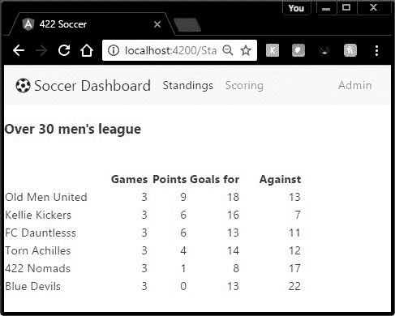

# 十五、排名

在本章中，我们将使用上一章创建的服务在网站上显示排名。

`standings`组件负责在网站上显示排名。一个俱乐部可能会使用一个大的视频监视器，让玩家在比赛间隙看到网站。

代码清单 124

```js
  // Import various modules we might need, 
  // module name and what file/library
  to find them
  import { Component } from '@angular/core';
  import { ViewEncapsulation } from '@angular/core';
  // Our interfaces
  import { Team } from './interfaces/Teams';
  import { Ranking } from './interfaces/rankings';
  import { Schedule } from './interfaces/schedule';
  import { SoccerService} from
  './services/soccerService';

```

我们需要从 Angular 导入一些模块，以及一些我们自己的接口和服务。

代码清单 125:应用组件

```js
  // Component metadata, defining the template code
  @Component({
    templateUrl: './app/views/Standings.html',    // HTML template name
    encapsulation: ViewEncapsulation.Native,      // Use Shadow DOM
    // Set styles for template
    styles: [`
              h3 {text-align:center;color:navy;font-size:x-large;margin:0px;}
              table {
                width:92%;margin:1em
  auto;font-size:large;
                font-family:"Comic Sans
  MS", cursive, sans-serif; }
              th { text-decoration:underline;}
            ` ],
   providers: [SoccerService ]
  })

```

注意在`templateUrl` 属性中，`views`文件夹是相对于`app`文件夹的。如果选择不同的文件夹结构，请务必调整路径。

我通常将模板放在主`app`文件夹下名为**视图**的文件夹中。严格来说，这是一种风格选择——您可以将它们放置在任何地方，并适当地引用它们的位置。然而，我更喜欢将视图、界面和应用代码保存在自己的文件夹中。

代码清单 126:视图/排名

```js
  <h3>{{LeagueName}} </h3>
  <br />
  <table >
      <thead>
          <tr>
              <th
  style="width:35%;"></th>
              <th
  style="width:13%;text-align:right;">Games</th>
              <th
  style="width:13%;text-align:right;">Points</th>
              <th
  style="width:18%;text-align:right;">Goals for</th>
              <th
  style="width:21%;text-align:right;">Against</th>
          </tr>
      </thead>
      <tbody>
          <tr *ngFor="let currentRow of
  Standings">
              <td>{{ currentRow.TeamName
  }}</td>
              <td
  style="text-align:right;">{{ currentRow.GamesPlayed
  }}</td>            
              <td
  style="text-align:right;">
                 {{ currentRow.Wins*3 +
  currentRow.Ties }}</td>
              <td
  style="text-align:right;">{{ currentRow.GoalsFor }}</td>
              <td
  style="text-align:right;">{{ currentRow.GoalsAgainst
  }}</td>
          </tr>    
      </tbody>
  </table>

```

模板代码大部分由 HTML 和插值变量组成，比如页面顶部的`LeagueName`。我们还使用`*ngFor`指令来遍历组件中的`Standings`集合。尽管我们使用插值表达式`currentRow.Wins* 3 + currentRow.Ties`来计算`points`列，但大部分信息直接来自属性。一般来说，您应该让组件执行这样的计算，但是我想提供一个小例子来说明如何在模板中进行计算。

我们的类代码将要声明一个空的`Ranking`数组，然后向服务请求调度数据。一旦返回日程数据，公共方法将遍历日程并计算排名，更新`Ranking`数组。

代码清单 127

```js
  export
  class AppStandings {
       // public properties
  (default is public)
       public LeagueName: string;
       public UsingAsync: boolean = false;
       public MySchedule: Schedule[];
       public Standings: Ranking[];

```

构造函数代码:

代码清单 128

```js
  public constructor(private _soccerService:
  SoccerService ) {
         this.LeagueName = "Over 30 men's
  league";
         this.getSchedule();
   this.ComputeRankings();
       }

```

ComputeRankings 公开的原因是，我们可能希望将调用包装在计时器函数中，以防俱乐部正在举办锦标赛并希望实时更新排名。

#### getSchedule()

该代码从服务中获取日程数据，并将其放入`MySchedule`数组中。

代码清单 129

```js

  private getSchedule() {
         if (this.UsingAsync) {
          let xx =
  this._soccerService.getScheduleAsnyc();
              xx.then((Schedules:iSchedule[])=>
  this.MySchedule =Schedules );
         }
         else
         {
          this.MySchedule =
  this._soccerService.getSchedule();
         }
       }

```

一旦日程数据可用，我们可以调用`ComputeRankings`来更新`Rankings`集合(这是模板显示的)。

#### 计算机银行

`ComputeRankings`是组件中业务逻辑的一个例子。我们将依赖服务来提供日程数据，并让组件来决定排名，而不是让服务来决定排名(这是组件只需要的功能)。

一般来说，足球排名会奖励一场胜利三分，一场平局一分。经常会有决胜局的规则，比如进球得分，狭路相逢等。因此，我们的组件需要阅读时间表，总结胜局、平局、目标和目标。这些数据被放入排名集合，然后排序显示排名页面。

代码清单 130

```js
  public
  ComputeRankings() {
          var curDate: Date = new Date();
          var TeamAt: number;
          this.Standings = [];                     // Empty the array
          this.MySchedule.forEach(element => {
            // If game
  has already been played
            if (element.PlayingDate < curDate
  && element.HomeScore>=0) {
                TeamAt =
  this.FindTeam(element.HomeTeam);
                if (TeamAt<0) 
                {
                  this.Standings.push( 
                      { TeamName: element.HomeTeam,
                        GamesPlayed:0,Wins:0,Ties:0,
                        GoalsFor:0,GoalsAgainst:0 }
  )
                  TeamAt = this.Standings.length-1;
                }
                this.UpdCurrentRow(element,TeamAt,"H");
                TeamAt =
  this.FindTeam(element.AwayTeam);
                if (TeamAt<0) 
                {
                  this.Standings.push( 
  { TeamName: element.AwayTeam,
     GamesPlayed:0,Wins:0,Ties:0,
     GoalsFor:0,GoalsAgainst:0 } )
                  TeamAt = this.Standings.length-1;
                }

  this.UpdCurrentRow(element,TeamAt,"A");
            }
          });

```

代码通读时间表，对于过去已经玩过的任何游戏(其中`-1`的`HomeScore`表示尚未玩过)，它会将关于该游戏的统计数据添加到匹配团队的`Standings`集合中(使用`UpdCurrentRow`私有方法)。

一旦建立了集合，我们使用 TypeScript 代码对集合进行排序，基于总点数，然后`GoalsFor`。

代码清单 131

```js
  // Sort standings
  this.Standings.sort((left, right): number =>
       {
        if
  (left.Wins*3+left.Ties<right.Wins*3+right.Ties) return 1;
        if (left.Wins*3+left.Ties>right.Wins*3+right.Ties)
  return -1;
        // Else, then are tied,
  typically we'd add addition logic to break Ties
        if (left.GoalsFor<right.GoalsFor) return
  1;
        if (left.GoalsFor>right.GoalsFor) return
  -1;
        // Finally, return zero if still
  tied.
              return
  0;                                    
         })
       };

```

`sort`函数比较两个对象(这样我们就可以访问属性)，如果右侧较高，则返回`1`，如果左侧较高，则返回`-1`，如果平局，则返回`0`。

|  | 注意:如果需要，我们可以增加额外的平局决胜规则，尤其是在足球赛季的早期，只有几场比赛。 |

有几个私有例程用来支持`Standings`方法。`UpdCurrentRow`根据时间表中所选游戏的结果更新`Standings`集合。

代码清单 132

```js
  private
  UpdCurrentRow(element:Schedule,TeamAt:number,HomeAway:string) {
                this.Standings[TeamAt].GamesPlayed
  ++;
                if (HomeAway=="H") {
                  this.Standings[TeamAt].GoalsFor +=
  element.HomeScore;

  this.Standings[TeamAt].GoalsAgainst += element.AwayScore;
                  // Win
                  if
  (element.HomeScore>element.AwayScore)
                  {
                    this.Standings[TeamAt].Wins++;
                  }
                }
                if (HomeAway=="A") {
                  this.Standings[TeamAt].GoalsFor +=
  element.AwayScore;

  this.Standings[TeamAt].GoalsAgainst += element.HomeScore;
                  if
  (element.AwayScore>element.HomeScore)
                  {
                    this.Standings[TeamAt].Wins++;
                  }
                }
                if
  (element.HomeScore==element.AwayScore)
                {
                  this.Standings[TeamAt].Ties++;
                } 
       }

```

`FindTeam`方法通过名称在`Standings`集合中搜索团队。

代码清单 133

```js
  // Find the team or -1
       private FindTeam(TeamName:string) : number {
         var FoundAt: number = -1;
         for (var _x=0;_x <
  this.Standings.length;_x++)
         {
              if
  (this.Standings[_x].TeamName==TeamName) {
                return _x;
              }
         }
         return FoundAt;
       }

```

当我们的组件完成并运行时，将出现以下屏幕显示。



图 17:排名页面

本章说明如何将服务(提供日程数据)与计算和显示排名的组件相结合。