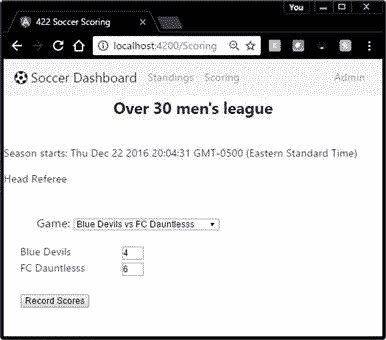

计分组件允许一个人从时间表中选择一场比赛，更新主客场比分，然后将更新后的比分保存回组件。评分屏幕如下图所示。



图 18:评分屏幕

用户选择一个游戏，屏幕更新两个团队名称作为标签，团队得分作为编辑框。然后用户可以更改分数并点击**记录分数**按钮保存更新的分数(并可能更新排名视图)。

代码清单 148

```js
  /*  Scoring component */
  import { Component } from '@angular/core';
  import { Title } from
  '@angular/platform-browser';  
  import { ViewEncapsulation } from
  '@angular/core';  
  // Our application services and
  interfaces
  import { Schedule } from './interfaces/schedule';
  import { SoccerService} from
  './services/soccerService';
  @Component({
      templateUrl:
  './app/views/scoring.html',        // HTML template
  name   
      styles: [` h3 {text-align:center;color:navy;
                    font-size:x-
  large;margin:0px;font-weight:bold;}
              select {
  font-size:large;margin-left:25px;} `],
      providers: [Title,SoccerService]

  })

```

评分模板是一个简单的 HTML 页面，裁判可以在其中记录分数。

代码清单 149

```js
  <h3>{{LeagueName}}
  </h3>
  <br />
  <form>
      <p>Season
  starts:  {{ SeasonStart }} &nbsp;</p>  
          <div
  class="container" [ngSwitch]="CurrentRole*10">
              <div
  *ngSwitchCase=10>Head Referee</div>            
              <div
  *ngSwitchCase=20>Referee</div>
              <div
  *ngSwitchCase=30>Scorekeeper</div>            
              <div
  *ngSwitchCase=40>Admin</div>
              <div
  *ngSwitchDefault>End User</div>
          </div>

  <br/>

```

这段代码只是根据当前角色更改了标题，因此显示了运行页面的用户类型。根据用户管理级别，您可以使用类似的方法来使某些功能或选项可见或不可见。

代码清单 150

```js
  <p
  style="font-size:large;margin-left:50px;">Game: 
      <select
  (change)="onSchedChange($event.target.value)">
          <option
  *ngFor="let currentRow of MySchedule" 

  value={{currentRow.id}}>
              {{
  currentRow.HomeTeam +" vs "+ currentRow.AwayTeam }} 
          </option>
      </select>

  </p>

```

这段代码使用`*ngFor`指令通过迭代数组来填充下拉框。它还将`select`元素的`change`事件绑定到类代码中的一个事件。

代码清单 151

```js
      <div
  class="form-group">
           <label
  for="HomeTeam">{{HomeTeam}}</label>
           <input
  type="number" (input)="HomeScore = $event.target.value"

  class="form-control" id="HomeGoals"
  [value]="HomeScore">
      </div>
      <div
  class="form-group" >
          <label
  for="AwayTeam">{{AwayTeam}}</label>
          <input
  type="number"  [(ngModel)]="AwayScore"
  name="AwayScore"

  class="form-control" id="AwayGoals"
  [value]="AwayScore">
      </div>

```

然后我们有代码显示主队和客场球队的名字，使用插值和属性绑定。这将编辑框值与组件中的变量相链接。

模板的最后一部分是将`button` `click`事件链接到组件内部的一个方法(必须是公共的)。

代码清单 152

```js
      <button
  type="button" (click)="onRecordScores()" 

  class="btn btn-primary">Record Scores</button>
  </form>

```

HTML 模板中有几个数据绑定元素来收集数据和触发组件代码中的事件。`(click)`绑定将调用组件内部的`onRecordScores()`方法。

您还会注意到一些简单的插值，例如`HomeTeam`和`AwayTeam`，用于将选定的团队名称显示为屏幕显示的一部分。

评分组件的类代码执行几个操作:它填充时间表数组，检测用户何时更改下拉框，并根据时间表信息填写分数。当用户点击按钮时，它还具有处理记录分数选项的代码。

#### 变量

我们在组件内部声明了几个变量，这些变量既用于组件本身，也用于模板页面的公共变量。

代码清单 153

```js
  private
  UsingAsync: boolean = false;
       private CurGame: number = 0;
       public MySchedule: Schedule[];
       public LeagueName: string;
       public HomeTeam : string;
       public AwayTeam : string;
       public HomeScore : number =0;
       public AwayScore : number =0;
       public SeasonStart: Date = new Date;
       public CurrentRole: number=1;

```

#### 构造器

构造函数代码更新一些变量，并指定要在整个组件中使用的服务。

代码清单 154

```js

  public constructor(private _soccerService: SoccerService ) {
      this.LeagueName = "Over 30 men's
  league";
      this.getSchedule();
      this.SeasonStart.setTime(
  this.SeasonStart.getTime() +4 * 86400000 );       
      if (this.MySchedule.length>0) {
           this.UpdVariables(0);    // Default to first game
           this.CurGame = 1;
        }
    }

```

#### 公共方法

模板代码引用的任何方法都必须声明为`public`。我们需要两种公共方法:一种用于选择框更改，另一种用于用户单击按钮记录分数。

代码清单 155

```js

  public onSchedChange(GameValue:number) {
         if (GameValue>0) 
         {
           this.UpdVariables(GameValue);
           this.CurGame = GameValue;
         } 
       }
       // Get the score
  from the form and update it
       public onRecordScores() {
         this.MySchedule[this.CurGame-1].AwayScore =
  Number(this.AwayScore);
         this.MySchedule[this.CurGame-1].HomeScore =
  Number(this.HomeScore);       
       }

```

#### 私有方法

`private`方法一般是支撑构件所需的方法，不需要在构件体外使用。这个组件中有几个私有方法。

代码清单 156

```js

  // Update screen variable based on current game
       private UpdVariables(GameID: number) {
            // Need to
  search Schedule array, looking for game ID
            var x : number = 0;
            if (GameID >0) {
              x = GameID-1;
            }  
            this.HomeTeam =
  this.MySchedule[x].HomeTeam;
            this.AwayTeam =
  this.MySchedule[x].AwayTeam;
            this.HomeScore = this.MySchedule[x].HomeScore;
            this.AwayScore =
  this.MySchedule[x].AwayScore;
       } 
       // Get the
  schedule (only showing games not yet scored)     
       private getSchedule() {
         if (this.UsingAsync) {
          let xx = this._soccerService.getScheduleAsnyc();
              xx.then((Schedules:Schedule[])=>
  this.MySchedule =Schedules );
         }
         else {
          this.MySchedule =
  this._soccerService.getSchedule();
         }
       }

```

如果您更新了分数，然后返回到排名页面，您将看到排名、目标和目标的变化。对于实际的应用程序，您很可能会编写一个 web 服务，并使用 HTTP 模块将更改保存到后端数据库中。

在本章中，我们看了一个简单的例子，从表单到组件来回获取数据，并响应表单事件和按钮点击。