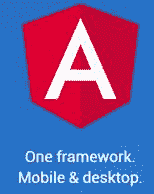
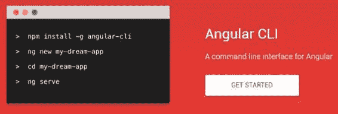

# 十九、总结

Angular 2 是开发应用的强大框架。在本书中，我们探索了足够多的框架来创建一个简单的应用，但我希望它能激起你对可能发生的事情的兴趣。我建议保留以下网站的书签，并定期访问它们，以掌握 Angular 2 和 Angular CLI 的新功能。

图 19:[https://Angular . io](https://angular.io)的 Angular 主页

图 20:位于[的 Angular CLI 主页](https://cli.angular.io)

当然，保留 [Syncfusion 网站](http://www.syncfusion.com/)的书签，以找到一个大型的免费电子书库，从而保持在不断变化的应用开发世界的顶端。

**享受！**