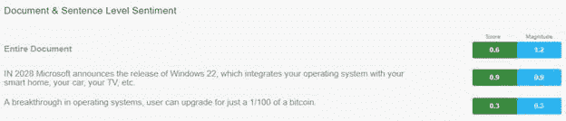
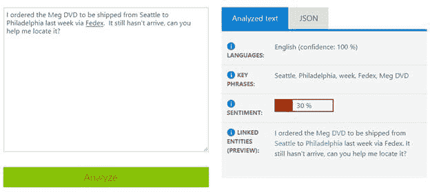

# 十二、其它 NLP 用法

在前面的章节中，我们探索了一些基本功能和代码来创建一个简单的问答式 NLP 应用。这本书的目标是让读者轻松理解如何解析句子来创建一个标记单词列表，然后使用该标记单词列表来回答英语问题。

回答问题只是冰山一角。了解单词和一组合理的标签有助于程序尝试辨别意义。下面是自然语言处理的一些其他应用，可以通过我们在前面几章中讨论的各种 API 来访问。

随着世界变得越来越小，大多数应用不能简单地假设用户正在输入英文文本。例如，如果任何应用允许用户通过电子邮件或文本消息发送技术支持请求，您可能会收到如下文本:

*   我的电子邮件团队一直挂着
*   我的电子邮件电脑一直挂着

既然你想给说这种语言的人提供支持，你首先需要辨别这种语言。大多数 API 通过返回它认为文本所使用的语言来为您处理这个任务。许多欧洲语言源自拉丁语，因此辨别实际语言是一项棘手的任务。把这个留给大人物。😊

微软认知服务应用编程接口可以检测 100 多种不同的语言。例如，假设我们给 API 一个如清单 57 所示的请求。

清单 57–语言识别请求

```cs
"documents": [

{"id":"1","text": "Hello world"     },
    {"id":"2","text":
"Bonjour tout le monde"     },

{"id":"3","text": "La carretera estaba
atascada. 
                       Había mucho
tráfico el día de ayer."    } ]

```

该应用编程接口将返回清单 58 所示的结果。

清单 58–语言检测的结果

```cs
"documents": [
  { "id": "1",
 "detectedLanguages": 
   [{ "name":
"English", "iso6391Name": "en",
"score": 1.0 }] }, 
  { "id": "2",
"detectedLanguages": 
   [{ "name":
"French", "iso6391Name": "fr",  "score":
1.0 }] }, 
  { "id": "3",
"detectedLanguages": 
   [{ "name":
"Spanish", "iso6391Name": "es",
"score": 1.0 }]
]

```

该应用编程接口返回语言、语言代码和一个分数，该分数表示对其语言确定的信心。

情感分析试图发现一段文字表达的态度。是正面文字还是负面文字？这种知识对于试图与客户保持联系的企业非常有帮助。社交媒体和在线评论是客户反馈的一个很好的来源，公司听听会很好。

不幸的是，这不是一项简单的任务。虽然有些句子很清楚，但很多时候意思并不清楚。比如下面这句话是肯定的还是否定的？

我真的很喜欢这部电影，但结局令人不安。

即使是特定的单词也可以通过领域知识得到更好的解释。比如我看到“瘦”这个字，我说的是手机，这大概是正面的评价。然而，如果我指的是我的酒店房间，薄床单或薄墙通常是负面的评论。

微软认知服务和谷歌云 NLP 都提供情感分析 API 调用。

你可以在这里演示一下谷歌的情绪分析[。](https://cloud.google.com/natural-language/)

图 26 显示了一个示例新闻稿和谷歌对它的分析。

图 26–谷歌情绪分析



分数范围从-1 到 1；数字越低，一般来说，文本被认为越负面。在这种情况下，得分为 0.6 表示新闻稿相当积极。幅度从 0 到无穷大，表示情绪有多强烈。基于谷歌的分析，我等不及 Windows 22 了。

想象一个销售许多不同产品和服务的公司。他们有一个 NLP 系统来处理收到的电子邮件。了解电子邮件讨论的一般类别有助于他们将邮件导向适当的部门进行处理。领域空间(即产品和服务的数量)越大，从短信中提取类别就越困难。

微软认知服务提供了一种方法来通读文本并提取文档所讨论的各种对象。图 27 显示了一个客户投诉电子邮件的例子，以及认知服务应用编程接口从中收集的信息。

图 27–工作中的认知服务



您可以使用第 11 章中的代码将这些信息收集到 JSON 对象中，这样您的代码就可以决定采取什么操作。

使用接下来几章中讨论的 API 将有助于您将 NLP 添加到应用中。本章中提到的问题是通过应用编程接口来处理的，所以尽管思考起来很有趣也很有挑战性，但如果你的目标只是通过允许英语问题来增强你的应用，我建议让大人物来处理细微差别。