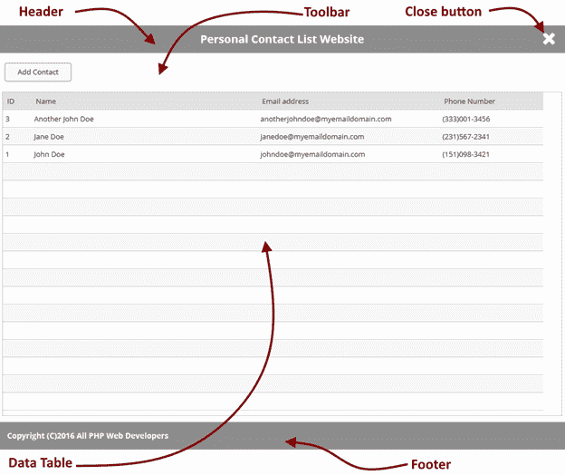
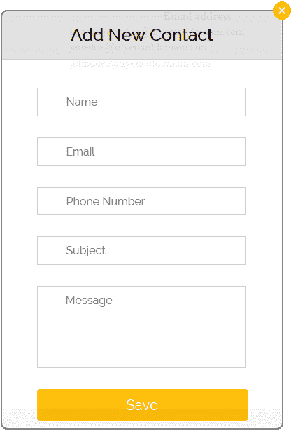
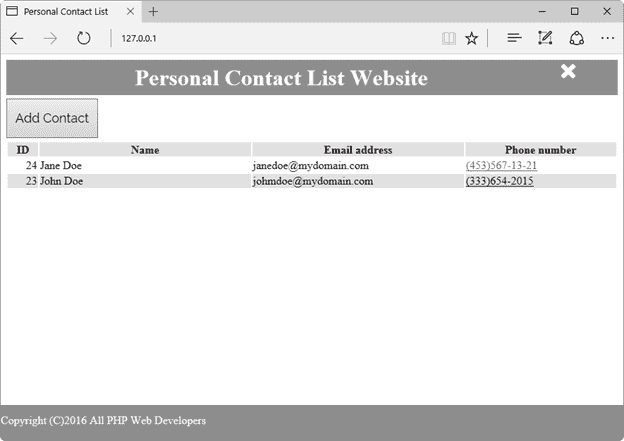

# 六、联系人列表网站

本章的目的是收集前面讨论的所有主题，并使用联系人数据库将它们转化为一个简单的联系人列表网站。最终结果应该如下图所示。



图 45:个人联系人列表网站

正如在之前的设计中注意到的，网站主页被分为四个部分:一个标题，显示网站的名称；一个工具栏，其中包含一个按钮，允许您将联系人添加到表格中；数据表，显示数据库中存储的所有联系人；和显示一些版权信息的页脚。此外，标题部分的右侧应显示一个**关闭**按钮。

这种设计意味着复杂的编程。将这个网站编码成一个文件似乎非常不切实际，也很难维护。因此，我们将采用第 4 章中讨论的文件包含技术。因此，我们将为设计中描述的每个部分创建一个主程序文件和一个程序文件。我们还将在另一个单独的文件中对数据库连接进行编码。

## 网站入口点:index.php

在第 2 章解释的 PHP 部署过程中，我们定义了一个名为**index.php**的默认文档。换句话说，我们将该文档建立为已部署网站的入口点之一，因此每次我们在网络浏览器的地址栏中键入 http://127.0.0.1 时，服务器都会自动执行**index.php**，如果它存在的话。因此，出于本节中详细介绍的练习的目的，我们将把主文件的代码保存为**index.php**。

### 创建一个基本的 HTML 结构

我们要编程的第一件事是一个基本的 HTML 文档结构。一个名为**contactswebsitehtmlsections.php**的文件将存储一些函数来创建这个结构。

代码清单 43:contactswebsitehtmlsections.php

```php
  <?php

    function
  GetHtmlHeader()
    {
          $result =
  "<!DOCTYPE html>\n<html>\n<head>\n<title>Personal
  Contact List</title>\n";
          $result .=
  '<link rel="stylesheet" type="text/css"
  href="css/contactform.css">';
          $result .=
  '<script
  src="https://ajax.googleapis.com/ajax/libs/jquery/3.1.1/jquery.min.js"></script>';
          $result .=
  '<script src="js/contactform.js"></script>';
          $result .=
  "\n</head>\n<body>\n";
          $result .=
  '<div class="container">' . "\n";

          return $result;
    }

    function
  GetHtmlFooter()
    {
         $result =
  "</div>\n</body>\n</html>";
       return $result;    

    }

  ?>

```

这段代码的`GetHtmlHeader()`和`GetHtmlFooter()`函数分别返回一个字符串，带有创建一个空的 HTML 文档所需的开始和结束标签。现在，我们将在**index.php**中使用这个文件，如下面的代码示例所示。

代码清单 44:index.php

```php
  <?php

  require("contactswebsitehtmlsections.php");

    echo GetHtmlHeader();
    echo GetHtmlFooter();

  ?>

```

注意`require()`功能的使用。该功能包括将**contactswebsitehtmlsections.php**T4 文件的内容转化为**index.php**。之后，`echo`语句调用包含文件中编码的每个函数。现在，如果我们在地址栏中输入 **http://127.0.0.1** ，网页浏览器会显示一个空白页。但是，如果我们询问网页的源代码，我们会看到下面的 HTML 文档。

代码清单 45:基本的 HTML 文档结构

```php
  <!DOCTYPE html>
  <html>
  <head>
  <title>Personal
  Contact List</title>
  </head>
  <body>
  <div class="container">
  </div>
  </body>
  </html>

```

### 创建网站标题

现在，我们将创建网站标题。这个标题将显示网站的标题和关闭网页浏览器窗口的按钮。这样做的代码将保存在名为**websiteheader.php**的文件中。

代码清单 46:websiteheader.php

```php
  <?php

    function
  GetWebSiteHeader()
    {
         $result =
  '<header style="width:100%; height:50px; background-color: #8D8D8D;
  color: white;">';
         $result .=
  '<div style="display: inline-block; width:90%; text-align:
  center;"><h1 style="margin: 0px 0px 0px
  0px;">Personal Contact List Website</h1></div>';
         $result .=
  '<div style="display: inline-block; width:10%;"><a
  href="#" onclick="window.close();return
  false;"></a></div></header>';
       return $result;    

    }

  ?>

```

这段代码构建了一个带有`<header>` HTML 标签的字符串。这个标签用于定义我们网页的标题部分。让我们看看标签中定义的`style`属性。此属性通过为任何元素分配一系列用双引号括起来的属性来控制元素在 web 浏览器中的显示方式。在这种情况下，`width`属性告诉网络浏览器，标题将覆盖浏览器窗口的整个宽度(100%)。`height`属性告诉浏览器标题高度为 50 像素(50px)。`background-color`属性为页眉背景设置灰度颜色，`color`属性为所有显示的文本设置白色。

根据本章开头显示的设计，网站的标题将显示网站的标题和关闭网页浏览器窗口的按钮。为此，`header`部分需要分为两个小节。`<div>`标签用于完成该任务。

第一个`<div>`标签创建了标题将被显示的子部分。该子部分的`style`属性告诉浏览器，标题将覆盖网页浏览器窗口宽度的 90%，文本将在该子部分的边界内居中，并且该子部分属于显示关闭按钮的同一行(`display: inline-block;`)。

第二个`<div>`标签将显示关闭按钮。为此，保存在**图像**文件夹(位于网站的根文件夹中)中的名为**closebutton.png**的图像被用作超链接(`<a>`标签)。两行代码被分配给`onclick`超链接事件的属性。当用户单击关闭按钮的图像时，将执行该代码。第一行调用窗口对象的`close()`方法(窗口对象等于 web 浏览器的窗口)，第二行代码返回`false`值，以防止浏览器跳转到不存在的链接。

### 创建网站工具栏

在`header`部分之后，网站应该显示一个带有一个命令按钮的工具栏:添加联系人。通过点击该按钮，用户可以显示一个对话框，以便在数据库中插入新联系人的数据。

代码清单 47:websitetoolbar.php

```php
  <?php

      function
  GetWebSiteToolbar()
        {
              $result =
  '<section style="margin-top: 5px; height: 60px;"><div
  class="container">';
              $result .=
  '<button type="button" style="height: 56px;"
  onclick="div_show(); return false;">Add Contact</button>';
              $result .=
  '</div></section>';
              return
  $result;
        }
  ?>

```

创建工具栏的代码以`<section>`标记开始。在 HTML 中，这个标记用于定义文档中的部分，如页眉、页脚，当然还有自定义部分，如工具栏。在`<section>`标签中定义的`style`属性将使用`margin-top`属性从上一节的末尾(网站的标题)开始应用五像素的页边距。`height`属性为`<section>`指定 60 像素的高度。

现在，为了在工具栏中显示命令按钮，我们将使用`<div>`标记创建一个子部分。然后，使用`<button>`标签和`type="button"`属性创建命令按钮。使用`style`属性和`height`属性将按钮设置为 56 像素的高度，并且使用`onclick`属性分配处理点击事件的功能。

### 创建网站页脚

尽管数据表部分被放在网站页脚之前，但我们将首先查看创建网站页脚的代码，因为数据表部分需要我们大部分的注意力。

网站页脚的目的是显示版权信息。设计中考虑了页脚，以便包含网页的所有主要元素。我们将把这段代码保存在一个名为**websitefooter.php**的文件中。

代码清单 48:websitefooter.php

```php
  <?php

     function
  GetWebSiteFooter()
     {
          $result =
  '<footer style="clear: both; position: fixed; left: 0; bottom: 0;
  height: 50px; margin-top: -50px; width: 100%; background-color: #8D8D8D;
  color: white;">';
        $result .=
  '<div style="display: inline-block; width:80%; text-align:
  left;"><p style="margin: 12px 0px 0px 0px;">Copyright
  (C)2016 All PHP Web Developers</p></div>';
        $result .=
  "</footer>";

        return $result;    

     }

  ?>

```

同样，在网站页眉的代码中，我们有一个`<footer>`标签来定义网页的页脚部分。查看本章开头显示的设计，我们可以看到网页的页脚应该放在浏览器窗口的底部。为了完成这个任务，我们应该给一系列属性赋值，并将它们赋给`style`属性。这些属性是:

*   `clear`–防止声明元素旁边的浮动元素。在这种情况下，该值将避免在`<footer>`部分的左右两侧出现浮动元素。
*   `position`–指定用于定位元素的方法。固定值相对于浏览器窗口定位`<footer>`部分。
*   `left`–指定放置元素的左坐标。
*   `bottom`–指定放置元素的 y 坐标，从浏览器窗口底部开始。在这种情况下，`0`表示页脚将从窗口底部开始绘制。
*   `height`–定义页脚部分的 50 像素高度。
*   `margin-top`–负值等于页脚高度，并确保页脚部分始终向上拉，从浏览器窗口底部开始。

为了显示版权信息，我们使用了一个`<div>`部分，它覆盖了`<footer>`部分的 80%。邮件段落的上边距为 12 像素。

此时，**index.php**的代码应该如下例所示。

代码清单 49:index.php，到目前为止

```php
  <?php

  require("contactswebsitehtmlsections.php");

  require("websiteheader.php");
    require("websitetoolbar.php");

  require("websitefooter.php");

    echo GetHtmlHeader();
    echo
  GetWebSiteHeader();
    echo
  GetWebSiteToolbar();
    echo
  GetWebSiteFooter();
    echo GetHtmlFooter();

  ?>

```

如果我们在网页浏览器的地址栏中输入 **http://127.0.0.1** ，输出应该如下图所示。


图 46:个人联系人列表网站，到目前为止

|  | 注意:右上角的 X 图标是图像文件 closebutton.png，您必须自己生成或从本电子书附带的文件中获取。 |

## 创建数据表部分

数据表部分使用 HTML 表格显示联系人信息。要完成这项任务，应满足以下要求:

*   创建一个`<section>`标签来包含数据表部分。
*   创建一个`<div>`标签来包含 HTML 表格。
*   使用`<table>`标签创建 HTML 表格。
*   使用`<th>`标签创建 HTML 表格标题。
*   使用`mysqli`类连接到联系人数据库。
*   使用`query()`方法执行 SQL `SELECT`查询。
*   使用`<tr>`和`<td>`标记迭代返回数据集中的所有行，以创建每个 HTML 表行。

我们将创建一个脚本来执行所有这些步骤。脚本将保存在名为**datatablesection.php**的文件中。

代码清单 50:datatablesection.php

```php
  <?php

  require("contactsquery.php");

     function
  GetDataTableSection()
     {
        $result  =
  "<section>\n";
        $result .=
  '<div style="width: 100%; height: 90%; overflow: auto;">';
        $result .=
  "\n";
          $result .=
  '<table width="100%">';
          $result .=
  "\n";
        $result .=
  '<tr style="background-color: #E1E1E1; color: #000000; text-align:
  center;">';
          $result .=
  "\n";
        $result .=
  '<th width="5%">ID</th>';
        $result .=
  "\n";
        $result .=
  '<th width="35%">Name</th>';
        $result .=
  "\n";
        $result .=
  '<th width="35%">Email address</th>';
        $result .=
  "\n";
        $result .=
  '<th width="25%">Phone number</th>';
        $result .=
  "\n</tr>\n";

          $resultset =
  ContactsDataSet();

          if ($resultset
  != null)
          {
           if
  ($resultset->num_rows > 0)
            {

  $rownumber = 0;

                  while
  ($datarow = $resultset->fetch_assoc())
                   {

  $rownumber++;

  if ($rownumber % 2 == 0)

  {
                            $result
  .= '<tr style="background-color: #E1E1E1; color: #000000;">';

  }

  else

  {
                            $result
  .= '<tr style="background-color: #FFFFFF; color: #000000;">';

  }

  $result .= '<td style="text-align: right;">' .
  $datarow["ID"] . '</td>';

  $result .= '<td>' . $datarow["NAME"] . '</td>';

  $result .= '<td>' . $datarow["EMAIL"] . '</td>';

  $result .= '<td>' . $datarow["PHONENUMBER"] . '</td>';
                            $result
  .= '</tr>'; 

  $result .= "\n"; 
                   }
            }
          }

        $result .=
  "</table>\n";
        $result .=
  "</div>\n";
        $result .=
  "</section>\n";

        return $result;    

     }

  ?>

```

代码清单 50 的第一行包含一个名为**contactsquery.php**的文件。该文件包含一个名为`ContactsDataSet()`的函数脚本，该脚本连接到联系人数据库，并返回一个用于填充表格的数据集。文件包含后，脚本定义了一个名为`GetDataTableSection()`的函数。该函数将返回必要的 HTML 代码来创建显示联系人数据库中所有行的表。这张桌子建在`<section>`和`<div>`标签内。`<section>`标签将`DataTable`部分划入网页。`<div>`标签用于包含表格。在`style`属性中定义的`overflow`属性告诉网络浏览器，如果表格的内容大于节高(`overflow: auto`)，则应该显示滚动条。然后，创建表头，脚本调用`ContactDataSet()`函数，将结果存储在`$resultset`变量中。如果函数返回空值，或者`$resultset`变量不包含行，则不会发生表填充。否则，脚本遍历所有行并填充表。

代码清单 51:contactsquery.php

```php
  <?php
    function
  ContactsDataSet()
    {
       $dbhost =
  'localhost';
       $dbuser = 'root';
       $dbpass = 'userpassword';

       $database =
  'contactinfo';
       $mysqli = new
  mysqli($dbhost, $dbuser, $dbpass, $database);

       if
  ($mysqli->connect_errno) {
               return
  null;
       }

       $sql =
  "SELECT contacts.* FROM contacts ORDER BY contacts.name";
       $resultset =
  $mysqli->query($sql);
       $mysqli->close();
       return $resultset; 

    }
  ?>

```

此时，**index.php**应该看起来像下面的代码示例。

代码清单 52:index.php，到目前为止

```php
  <?php

  require("contactswebsitehtmlsections.php");
    require("websiteheader.php");

  require("websitetoolbar.php");

  require("datatablesection.php");

  require("websitefooter.php");

    echo GetHtmlHeader();
    echo
  GetWebSiteHeader();
    echo
  GetWebSiteToolbar();
    echo
  GetDataTableSection();
    echo
  GetWebSiteFooter();
    echo GetHtmlFooter();

  ?>

```

## 创建添加新联系人对话框

现在，我们将添加创建对话框以添加新联系人所需的 HTML 代码。该对话框应该如下图所示。



图 47:添加新联系人对话框

包含该对话框的代码应保存在名为**getcontactform.php**的文件中。

代码清单 53: getcontactform.php

```php
  <?php

    function
  GetContactForm()
    {
         $result =
  '<div id="newcontact" style="display: none;">';
         $result .=
  "\n";
       $result .=
  '<div id="popupContact">';
         $result .=
  "\n";
       $result .=
  '<form action="#" id="form" method="post"
  name="form">';
         $result .=
  "\n";
       $result .=
  '';
         $result .=
  "\n";
         $result .=
  '<h2>Add New Contact</h2>';
         $result .=
  "\n";
         $result .=
  '<hr>';
         $result .=
  "\n";
         $result .=
  '<input id="name" name="name"
  placeholder="Name" type="text">';
         $result .=
  "\n";
         $result .=
  '<input id="email" name="email"
  placeholder="Email" type="text">';
         $result .=
  "\n";
         $result .=
  '<input id="phonenumber" name="phonenumber"
  placeholder="Phone Number" type="text">';
         $result .=
  "\n";
         $result .=
  '<input id="subject" name="subject" placeholder="Subject"
  type="text">';
         $result .=
  "\n";
         $result .=
  '<textarea id="message" name="message"
  placeholder="Message"></textarea>';
         $result .=
  "\n";
         $result .=
  '<button type="button" name = "submit"
  id="submit" onclick="savecontact()">Save</button>';
         $result .=
  "\n";
         $result .=
  '</form>';
         $result .=
  "\n";
         $result .=
  '</div>';
         $result .=
  "\n";
         $result .=
  '</div>';
         $result .=
  "\n";

      return $result;     

    }

  ?>

```

正如在前面的代码中注意到的，对话框是一个放置在`<div>`部分的 HTML 表单。对话框的显示方式是通过使用 CSS 样式属性建立的。这些属性保存在名为 **css/contactform.css** 的文件中。`style`属性中的`display: none`属性阻止我们第一次加载网站时显示对话框。

此时，为了管理**添加联系人**按钮的点击事件、**保存**按钮的点击事件、**关闭**按钮、数据条目的验证以及在数据库中插入联系人信息的过程，网站增加了一些 JavaScript 功能。

代码清单 54

```php
  function savecontact()
  {
    if (  
  document.getElementById('name').value == "" 
        ||
  document.getElementById('email').value == ""
          ||
  document.getElementById('subject').value == ""
          ||
  document.getElementById('message').value == ""
          ||
  document.getElementById('phonenumber').value == "")
    {
          alert("You
  must fill all entries!");
          return;
    }

    document.getElementById('submit').disabled
  = true;

  $.post("insertcontact.php",
      {
          name:
  document.getElementById('name').value,
          email:
  document.getElementById('email').value,
              phone:
  document.getElementById('phonenumber').value,
              subject:
  document.getElementById('subject').value,
              message:
  document.getElementById('message').value
      },
      function(data,
  status){
          if (data ==
  "OK")
              {
                    window.location.reload();
              }
              else
              {

  alert(data);           
              }

  }).fail(function(data,status){alert("Error " + status);});

  document.getElementById('submit').disabled = false;

  }

  //Function to Display
  Popup
  function div_show() {
  document.getElementById('newcontact').style.display
  = "block";
  }
  //Function to Hide
  Popup
  function div_hide(){
  document.getElementById('newcontact').style.display
  = "none";
  }

```

在前面的代码中有三个函数。最后两个允许您显示或隐藏**添加新联系人**对话框。诀窍很简单:要显示对话框，在执行`div_show()`功能后，`'newcontact' div`部分的`display`属性会收到一个值`"block"`。通过将`display`属性的值设置为`"none"`，隐藏对话框由`div_hide()`功能执行。

|  | 注意:当用户单击位于工具栏上的“添加联系人”按钮时，将执行 div_show()函数；当用户单击位于“添加新联系人”对话框右上角的“关闭”按钮时，将执行 div_hide()函数。 |

现在，让我们回顾一下`savecontact()`功能。首先，该函数检查所有条目中存储的值。如果这些条目中有一个没有值，函数将触发警报并完成执行。否则，该功能禁用**保存**按钮，并使用`$.post` jQuery 方法执行**insertcontact.php**脚本，将其名称和位置作为该方法的第一个参数。`$.post`方法的第二个参数是带有变量及其值的数组，这些变量及其值将被传递给脚本。`$.post`方法的第三个参数是脚本执行成功时执行的功能。此功能将用于了解联系人是否已添加到数据库中。如果传递给函数的数据变量有一个`"OK"`值，就会发生这种情况。在这种情况下，我们使用`window.location.reload()`方法刷新网页浏览器窗口并显示新数据。

在数据库中插入联系信息的脚本显示在下面的代码示例中。

代码清单 55:insertcontact.php

```php
  <?php

    $name =
  $_POST['name'];
    $email =
  $_POST['email'];
    $phone =
  $_POST['phone'];
    $subject =
  $_POST['subject'];
    $message =
  $_POST['message'];

    $dbhost =
  'localhost';
    $dbuser = 'root';
    $dbpass =
  'Netdevserver'; 
    $database =
  'contactinfo';
    $mysqli = new
  mysqli($dbhost, $dbuser, $dbpass, $database);

  if
  ($mysqli->connect_errno) {
      echo "We're
  sorry. The website can not connect to the database <br />";
      echo "Error:
  MySQL connection failed: <br />";
      echo "Errno: " .
  $mysqli->connect_errno . "<br />";
      echo
  "Error: " . $mysqli->connect_error . "<br />";

      exit;
  }

  $sql = "INSERT
  INTO contacts (name,email,phonenumber,subject,message) VALUES ('$name',
  '$email', '$phone','$subject','$message')";

  if ($mysqli->query($sql)
  === TRUE) {
      echo "OK";
  } else {
      echo
  "Error: " . $sql . "<br>" . $mysqli->error;
  }

  $mysqli->close();

  ?>

```

该脚本类似于第 5 章中解释的脚本，只是要插入到联系人数据库中的值取自`$_POST`关联数组。在这种情况下，`$.post`方法发送的参数名称被用作检索每个参数对应值的关键字。这些值被传递给一组变量，这些变量后来被用作`INSERT` SQL 语句的一部分。如果数据插入成功，`echo`语句发送`"OK"`作为响应。否则，响应是一条错误消息。

## 结果:一个功能齐全的个人联系人列表网站

最后，我们应该得到一个功能性的网站，如下图所示。



图 48:个人联系人列表网站

## 章节总结

本章的目的是收集之前讨论过的所有主题，将它们变成一个简单的联系人列表网站。网站的设计将主页分为四个部分:一个标题，旨在显示网站的名称；一个工具栏，用于保存向表格中添加联系人的按钮；数据表，用于显示数据库中存储的所有联系人；和显示一些版权信息的页脚。此外，一个**关闭**按钮位于收割台部分的右侧。这种设计采用了复杂的编程，因此我们使用了第 4 章中讨论的文件包含技术来开发这个网站。

我们使用**index.php**文档作为网站入口。然后，我们将网站主页的每个部分都编入一个单独的文件中。之后，我们使用`require()`语句将所有这些文件包含在**index.php**中。