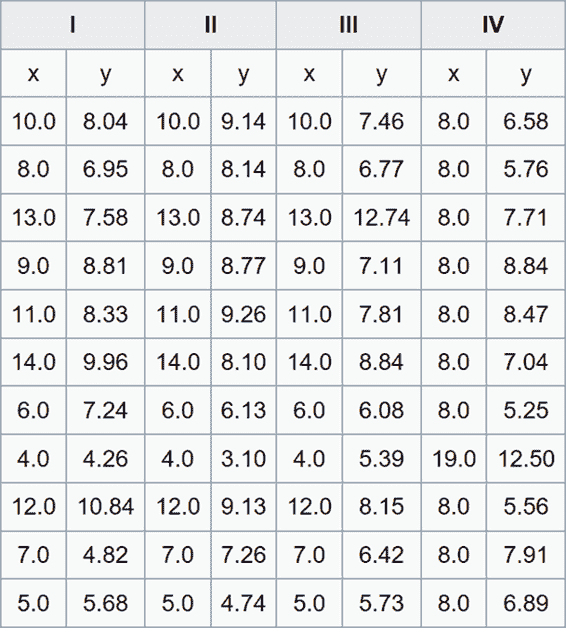
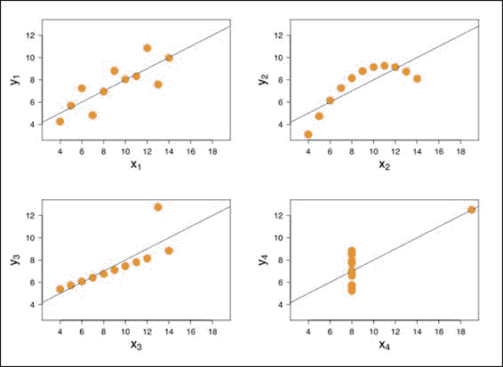
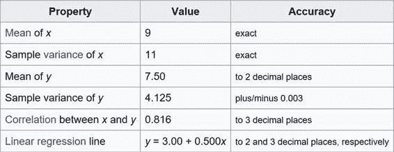

# 一、什么是 Power BI？

Power BI 是一项基于云的业务分析服务，它为我们提供了最关键业务数据的单一视图。Power BI 使用实时仪表板并创建丰富的交互式报告，允许访问数据以监控企业的健康状况。本质上，它是一个创建我们自己的商业智能报告和仪表板的工具。力量商业智能并不复杂——它强大、简单，而且对每个人都适用。

随着时间的推移，出现了三次 BI 浪潮。

第一波—技术 BI (IT 人员对最终用户):为了实现 BI 结果，在过去，公司必须依靠顾问和 IT 专业人员来开发分析服务器模型。这些专业人员将开发一个数据仓库，然后创建报告和分析，以便为最终用户做出合理的业务决策提供选择。然而，有一个问题:没有足够的信息技术人员。事实上，这是我们今天仍然面临的问题。由于缺乏信息技术专业人员，通常总是在寻找报告的公司必须等待太长时间，同时承担最终获得的信息仍然无效的额外风险。

第二波——自助 BI(分析师对终端用户):这一波包括 PowerPivot Excel，允许用户自己进行数据分析。这个效果很好。数据分析和数据科学家顾问开始活跃在商业智能领域。然而，这一波并不像最初预期的那样具有创新性，因为尽管有所改进，数据分析仍然很困难。

数据分析需要一种灵活的心态，这种心态来自于对我们的思维和数据方法的长期反思。

第三波——商业智能波(终端用户商业智能)。目的是向所有人提供商业情报。第一波和第二波有什么区别？首先，我们有 ClickView 和 PowerPivot 等工具。在第三次浪潮中，终端用户不仅有工具，还有工具系列。针对不同用户的不同工具。这个想法是每个用户都有一个独特的平台，有许多选择可以满足他们的独特需求。

负责 ops 集成的开发人员；负责数据分析的数据科学家；负责数据可视化并选择最佳可视化选项的可视化专家—在 Power BI 中，每个专业人员都有一个开发数据分析的角色。

然而，一些问题仍然存在。

第一个问题涉及数据访问。数据通常存储在数据库中，内部数据会随着时间的推移而减少。数据通常存储在云中、Excel 文件中或网站上。我们需要收集信息，并将其纳入我们自己的分析系统。为了做到这一点，我们还需要数据访问和正确的工具。

一般来说，我们的数据存储在数据库中，但通常我们不知道它的确切位置。如果我们使用 web 服务，我们将拥有门户的访问凭证，但是我们仍然不知道数据保存在哪里。例如，谷歌分析允许我们分析网站的数据访问，但我们不知道数据库在哪里。我们不能将直接电缆插入谷歌数据库，收集或选择数据。我们需要一个工具来简化这个过程，一个从谷歌分析开始并使用自己的过程或应用的工具。

第二个问题涉及安全性和可访问性。我们需要将数据存储在虚拟机中，否则这些数据对某些用户(或用户组)可用，但对所有人都不可用。为了实现这一安全目标，我们需要实施安全机制和规则——允许特定群体查看不同信息的用户机制。

我们可以用 Power BI 解决所有这些问题。

## 电力商业智能场景

为了理解 Power BI 场景，我们必须清楚地了解谁是内容创作者，谁使用内容。

通常，组织中存在以下职位:

**高管**需要大量汇总信息，才能看到公司状态或特定职能领域的高级图像。这种针对高管的信息通常以仪表板或记分卡的形式呈现，这必然会引发战略问题。

**分析师**需要原始的或稍微汇总的数据，目的是对特定的问题或业务机会进行详细的分析。分析师以电子表格、演示文稿或特别报告的形式呈现数据，这些报告侧重于他们被要求解决的特定问题。

**经理**需要数据，数据提供了对一个区域、特定业务或功能的详细分析。经理的数据用于评估过去的表现或计划未来的活动。数据必须具有可以定义特定操作的详细级别，例如产品发布的销售计划或营销活动。经理的数据通常以报告或记分卡详细信息的形式提供。

**操作用户**在事务级别处理数据。例如，一种经营报告，其中发票登记了来自簿记或日常生产计划的信息。运营数据通常以报告的形式共享。运营用户的数据越来越多地通过内部网或直接通过移动设备在线共享。

这些职位上的所有人都使用商业智能工具进行工作和合作。

数据可视化和发现工具很重要，原因有几个。首先，它允许我们使用一个非常强大和敏感的器官——我们的眼睛。通过我们的眼睛，我们正确地解读信息。它是一种复杂的工具，以至于机器学习算法仍然依赖它。

第二，数据有时会欺骗我们。

1973 年，弗兰克·安斯科姆制作了四套他称之为“四重奏”的资料来证明这个想法。他在图表的每个象限画了 11 个点。这些点具有非常相似的统计特征，它们代表方差、平均值、相关性和线性回归。数值相差几个百分点。这些点给我们提供完全不同信息的方式显示在这些图表中。这些图表让我们能够识别异常值——与其他点有意义的不同点，从而为我们提供撰写分析所需的信息。

图 1:安斯科姆的四重奏(来源:[维基百科](https://en.wikipedia.org/wiki/Anscombe%27s_quartet))

图 2:安斯科姆的四重奏(来源:[维基百科](https://en.wikipedia.org/wiki/Anscombe%27s_quartet))

图 3:已用属性(来源:[维基百科](https://en.wikipedia.org/wiki/Anscombe%27s_quartet))

我们可以推断，一旦我们的数据达到数百万或数十亿行，拥有一个表达式能力(如 Power BI)将有助于分析。这种乐于助人是 Power BI 工具取得巨大成功的另一个原因。用户更喜欢 Power BI，因为它易于使用，可视化效果好，并且能够集成来自不同来源的数据。

Power BI 可以说是两三个最强大、最复杂的数据分析程序之一。研究公司高德纳将其列为商业智能、交易系统、数据仓库和高级分析领域魔力象限的领导者。在撰写本文时，微软数据平台在所有关于安全性、性能和“就地”进行高级分析的能力的报告中排名第一(即，在数据库中包含的数据内部)。通过增加内存和在内部系统或云中以及混合环境中工作的能力，我们可以充分利用这一工具的丰富性和强大功能。

有两个 Power BI 许可证可供使用:

*   力量商业智能:免费
*   Power BI Pro:目前每月 9.99 美元，按年订阅