# 三、桌面

## 电力商业智能网站概述

网站[www.powerbi.com](http://www.powerbi.com/)是了解这款产品的起点。你会发现:

*   产品:展示产品差异以及许可和服务政策。
*   解决方案:Power BI 如何在某些行业和部门中使用的示例。这些例子是交互式的，可供下载。
*   合伙人:专门为合伙人开设的画廊。您可以搜索并找到已经开发出解决方案或对您的问题有经验的合作伙伴。
*   学习:学习相关课题的一套资源；一个我们可以比较工作或寻找新信息的社区。

如果我们看一下网站的底部，我们会发现一个提供一系列工具的部分。在此之下，有一系列可供开发人员使用的资源以及一系列示例，这样我们就可以开发应用，并在网站、移动应用或仪表板中嵌入 Power BI。我们还会找到重要的例子和深入的视频。第二个资源是 Power BI 的 YouTube 频道。在 user/mspowerbi 中可以访问，该渠道信息非常丰富，并且由产品组直接不断更新。

## 智能商务桌面

Power BI 桌面应用可以通过 [Power BI](https://powerbi.microsoft.com/en-us/desktop/) 免费下载。

Power BI Desktop 是一个可视化工具，用于报告和详细说明数据。它有 32 位或 64 位版本，并针对 Power BI 服务进行了优化。它完成了整合的微软技术，例如 Excel，其中有一个插件:Power Query、PowerPivot 和 Power View。

该应用允许我们连接到不同的数据源，并且通常每月更新一次。它简化了数据模型的构建，用作将在 Power BI 上发布的报告设计的基础。

## 开发方法

开发方法包括以下简单步骤:

1.  创建查询以过滤、格式化或改进数据。
2.  建立关系以创建数据模型的基础。
3.  使用计算逻辑和格式增强数据模型。
4.  通过拖放画布以新模式浏览数据。
5.  从各种数据可视化类型中为报表选择交互式设计。
6.  直接在 Power BI 服务上发布解决方案。

该过程总结在以下数据流中:

查询创建→关系设置→数据模型定义→报表设计→电力商业智能发布

开发方法由一系列必要的步骤组成，并使用查询的创建来处理我们的数据源、过滤数据、确定数据的正确格式以及我们希望在其上构建报告的信息。一旦我们导入了不同的数据源并确定了对这些数据源的查询，我们就可以识别或建立数据之间的关系。可能的关系类型是 1 对 1 或 1 对 N 关系，就像在关系(即 SQL)世界中一样。可以通过定义计算列或度量来增强数据模型。我们可以通过使用拖放功能来探索数据模型，这正是我们在使用在线 Power BI 时所做的。我们从数据集开始，拖动与表相关的列(数据集的一部分)，并建立最合适的可视化来构建我们的报告。

步骤 4 和 5 实际上是相同的步骤，与我们在网上执行的技术相同。不同的是，我们在应用上执行它们。最终，通过直接在 Power BI 上发布报告和数据集，我们的工作成果可以与同事和组织中的其他用户共享。之后，我们将能够在线构建仪表板。

查询被定义为“数据检索”，数据源类型包括文件、数据库和 Azure，以及其他服务和数据源。

要创建查询，请执行以下操作:

1.  指定数据源(文件、数据库、Azure 等)。).
2.  为查询指定唯一的名称。
3.  使用“M”语言定义查询的行为(高级逻辑可以选择性地传递给程序定义的函数)。
4.  调用查询将数据加载到数据模型的表中。

这些步骤是使用电源查询执行的。

在应用中，查询创建使用了一个模块，该模块可以轻松链接到 Excel 中的 Power Query 体验。Power Query 在 2013 版之前是 Excel 的一个插件，后来集成到 2016 版。使用了相同的技术——定义数据源并进行必要的阐述，这些阐述稍后将通过一种特定的语言“M”语言进行描述，这是 Power Query Formula Language 的非正式名称。通过这种语言，我们可以优化我们的数据源和表。支持的数据源很多，它们在 Power Query 中同样受支持。

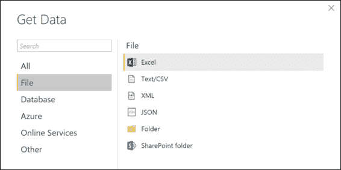

图 52:商务智能台式机—获取数据

图 52 显示了如何获取数据，如 Excel、CSV、XML、文本文件或其他文件。

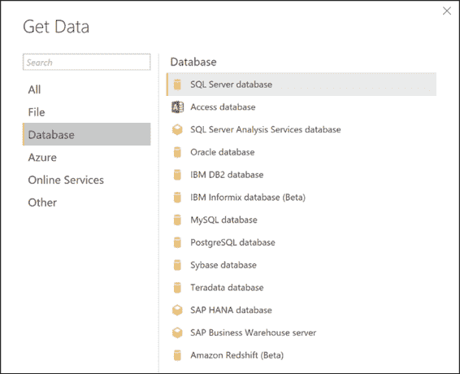

图 53:商务智能台式机—获取数据

图 53 显示，随着应用更新的发布，诸如 SQL Server、分析服务、Oracle 和许多其他来源被添加进来。

它支持 Azure 上的在线数据服务，如 SQL Azure 数据库和 SQL Azure 数据仓库。

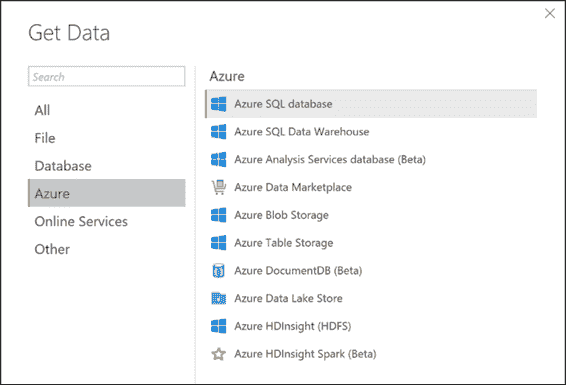

图 54:商务智能台式机—获取数据

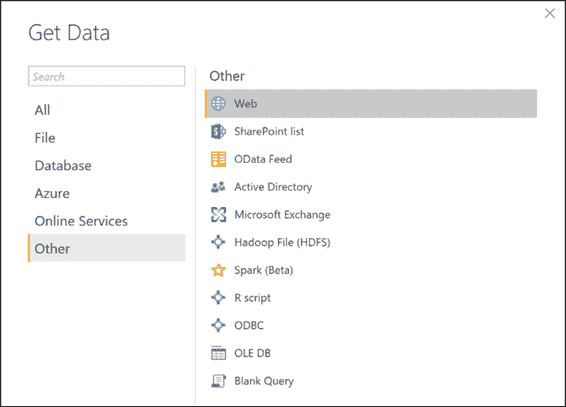

图 55:商务智能台式机—获取数据

受支持的数据连接器允许我们访问从脸书到谷歌分析、销售力量、ODBC 等各种数据源。

如图 56 所示，我们可以通过右键单击加载的表来打开查询编辑器。

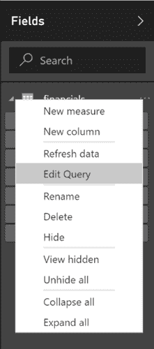

图 56:字段—上下文菜单

在这个编辑器中，我们可以管理列和公式，我们可以过滤，我们可以加载其他数据(图 57)。

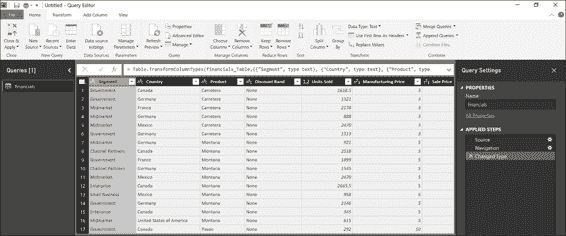

图 57:查询编辑器

通过点击这些列，我们可以应用过滤器，对数据进行排序，或者移除空值(图 58)。

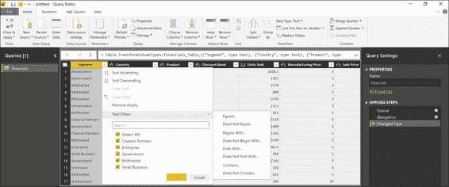

图 58:查询编辑器—文本过滤器

查询的创建允许我们过滤数据、格式化和细化它们，以便获得期望的结果。通过使用功能区中可用的控件或通过查询或列的上下文菜单对列应用筛选器，可以轻松创建步骤。我们可以选择一个步骤并预览结果数据。步骤也可以删除，公式步骤可以在公式栏中显示或编辑。

当这些源被保存并且我们执行查询的编辑步骤时，它们被保存在一个描述性面板中，如图 59 所示。

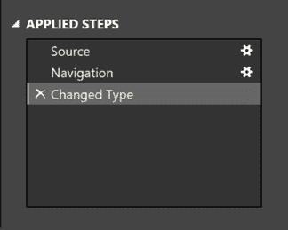

图 59:应用的步骤—描述性面板

我们还可以随时删除或编辑中间步骤。例如，如果我们意外地删除了所有行，只留下了前 10 行，当我们打算删除除前 20 行之外的所有行时，我们可以取消删除操作，然后更正该操作。以下所有步骤将识别在中间步骤中进行的修改。

## 查询的步骤定义:控件

在查询编辑器的功能区和上下文菜单中有许多可用的控件，因此我们可以管理列。例如，我们可以:

*   删除行并删除任何错误。
*   转换数据。
*   分割数据。
*   使用公式添加列。

因为查询编辑器是所见即所得的，所以我们可以轻松地测试和回滚修改。

我们还可以对要定义的查询使用不同的控件，我们所做的一切都将反映在以表格格式显示的数据中。当我们执行这些步骤时，我们会准确地显示它们的结果。可以管理列、更改数据类型、删除或添加列、拆分表(列)以及采取许多其他操作。

可以通过合并两个查询(连接在一个公共列中)或附加两个查询(联合)来创建新查询。

图 60:查询编辑器功能区—组合部分

如图 61 所示，合并和连接的操作包括:

*   左外部(第一个表中的所有数据，与第二个表匹配)
*   右外部(第二个表中的所有数据，与第一个表匹配)
*   完全外部(报告的两个表中的所有行)
*   内部(仅匹配行)
*   左反(仅与第一个表中的数据相关的行)
*   右反(仅与第二个表中的数据相关的行)

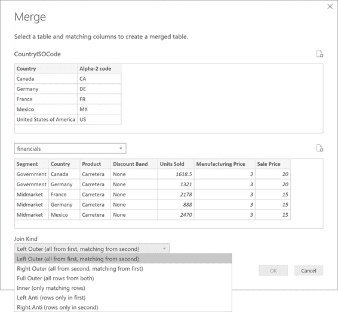

图 61:查询编辑器-合并选项

我们可以定义多个查询。通常使用大量的查询，它们可以连接到异构数据源。一旦定义了查询，就可以通过执行合并或追加来组合它们。在合并的情况下，定义了一个连接。事实上，我们连接了两个查询。在追加的情况下，两个不同查询的结果放在一起并连接起来。最好确保这些表既紧凑又可靠，并且它们具有相同的列名，以便可以在两个表中识别列。

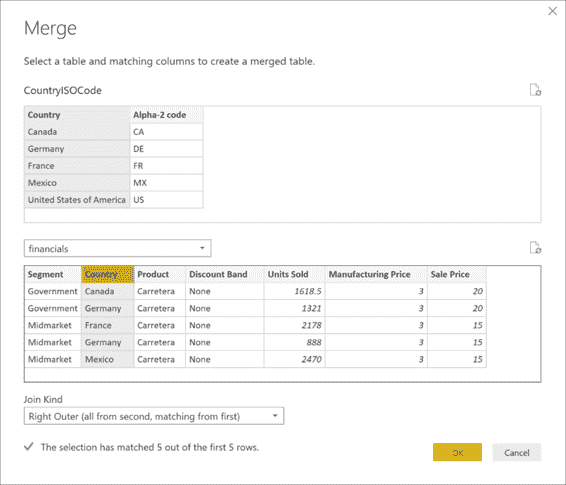

图 62:查询编辑器-合并选项

图 63 展示了您可以通过合并查询图标编辑这个合并。

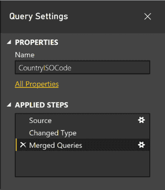

图 63:查询设置—描述性面板

## 配置关系

通过定义一个关系，我们创建了一个隐含的过滤器，可以跨两个或更多的表进行操作。筛选关系与外键约束不同，外键约束用于确保数据完整性。可以在任意两个表之间定义关系，而与它们的数据连接或数据源类型无关，但是它们必须基于具有匹配数据类型的单个列。不支持自引用关系。

事实上，通过合并两个查询，我们建立了一个关系，在这个关系上我们可以执行进一步的步骤。存在不能在单个表中创建关系的限制(因此不支持所谓的自引用关系)。但是，在外键级别没有限制。

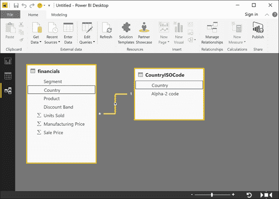

图 64:商务智能桌面—关系部分

以这种方式，我们通过获得例如如图 64 所示的模型来定义我们的关系，其中我们有 N 个关系，可以是 1 对 1 或 1 对 N。事实上，我们正在构建我们的数据模型。

## 数据模型定义

数据模型表可以通过计算进行扩展，也可以隐藏已经创建的计算字段(换句话说，它们不可用于报告)。我们可以设置数据模型列的这些特性:

*   数据类型
*   格式
*   类别(即空间或网络网址)
*   系统(基于表格的另一列)
*   能见度

从关系出发，我们有一个数据模型。在这个阶段，一旦定义了数据模型，我们就可以定义将要使用的类型和格式，并且我们可以决定哪些列可见或不可见，定义数据之间的系统，等等。

### 数据模型定义:计算

我们还可以通过使用数据分析表达式语言来增强数据模型。熟悉 PowerPivot 模型的人会熟悉 DAX 语言，它允许我们实现计算列和度量。

DAX 包括:

*   Excel 函数(约 80 个函数)
*   表格功能
*   聚合函数
*   关系的上网功能
*   上下文的修改功能
*   时间智能功能

我们必须在我们使用的任何数据模型中插入计算列或度量值。没有它我们几乎无法生存。对 DAX 语言的所有支持也存在于 Power BI 中。

有两种不同类型的计算，都是通过使用 DAX 定义的:

*   计算列
*   措施

### 计算栏

我们使用公式来定义计算列。从其他列开始，我们添加一个新列，这是我们之前定义的公式的结果。模型中的计算列在运行时使用内存空间。我们应该记住这一点，以避免 Power BI 内存不足错误。

有已定义的计算列可以向表中添加新列。每行的每个列值都会在数据模型中创建和保存数据。请注意，它们会耗尽数据模型中的空间。当表中发生刷新以及对公式的依赖项进行刷新时，将重新计算列值。

### 测量

与计算列不同，度量值不会占用存储空间。通过使用公式来定义度量。它们可用于 Power BI 的数据集，但它们是实时计算的，因此不会占用空间。公式是通过使用组函数来定义的，如求和、计数、相异计数、平均值、最小值和最大值。

有一些定义好的方法可以将组逻辑添加到数据模型中。数据模型中既不会创建也不会保存这些值。这些公式在查询时间模式下得到增强。

## 设计报告

一旦建立了数据模型，我们就可以通过浏览器界面使用 Power BI 服务进行报告设计，就像在网上一样。我们还可以使用 Power BI 应用构建报告。

可以基于可视数据模型的界面来设计报告。也可以添加文本框和图片。

设计体验与 Power BI 的在线服务非常相似。

## 电力商业智能出版物

最终，我们的作品可以直接在线发布在 Power BI 上，并可以与其他用户共享。从我们发布的报告和数据集开始，我们还可以定义某些仪表板。

Power BI 桌面文件可以加载到 Power BI 服务上，也可以直接发布。在覆盖现有数据集的情况下，我们必须考虑到，如果有两个或多个数据集同名，则必须删除一个数据集，并且必须重命名 Power BI Desktop 文件。

请记住，当重命名列或度量时，报表或仪表板可能会损坏。

## 【Power BI 桌面应用的工作示例

我们启动 Power BI 桌面并导入在线数据源。

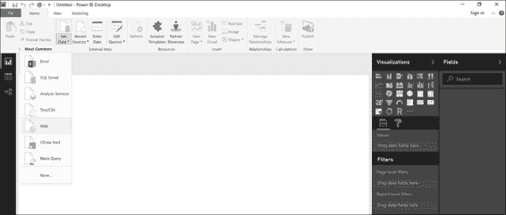

图 65:商务智能台式机—获取数据

特别是，我们将使用以下数据源:

[http://www . bankrate . com/finance/retirement/best-places-retire-how-state-ranks . aspx](http://www.bankrate.com/finance/retirement/best-places-retire-how-state-ranks.aspx)

该链接包括一篇关于美国退休的文章——具体来说，哪些州最适合退休。它用不同的指数显示各州，如生活成本、犯罪率等。让我们用这篇文章的一个表格来写一份报告。

请注意，在图形表示中，使用状态的全名可能是一个问题。一般来说，最好使用维基百科记录的标准缩写。特别是，我们将使用 ANSI 缩写。

参考网站是:

[https://en . Wikipedia . org/wiki/List _ of _ u . s _ state _ 缩写](https://en.wikipedia.org/wiki/List_of_U.S._state_abbreviations)

因此，我们通过获取数据功能导入数据。

如果我们点击更多条目，我们可以显示当前支持的所有源数据。我们选择条目**网页**，点击网址中的**连接**，指定状态统计的页面，点击**确定**。

图 66:商务智能台式机—从网络获取数据

正如我们在图 67 中看到的，页面上有两种类型的内容(文档和表格)。通过搜索，我们可以看到内容并选择包含我们感兴趣的数据的表格。

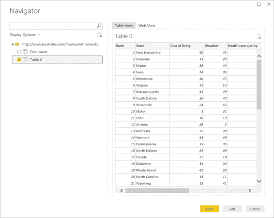

图 67:智能商务桌面—获取数据，导航器

请注意，图 68 显示了如何单击编辑来编辑和处理表中的数据。

名为 Rank 的列不相关，我们可以将其删除(右键单击)。

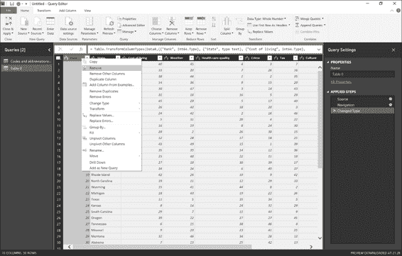

图 68:查询编辑器

如果一个字段被识别为一个数字整数，我们必须通过替换值接口用空格纠正这个字符串，如图 69 所示。

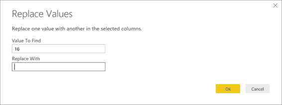

图 69:查询编辑器—替换为

请注意，当所有目标值都被替换后，可以通过右键单击并从上下文菜单中进行选择，将它们转换为整数(无小数点)。

图 70:查询编辑器——公式栏

图 71 显示了如何在查询部分的功能区中使用高级编辑器，以便获得所有可重复步骤的摘要。

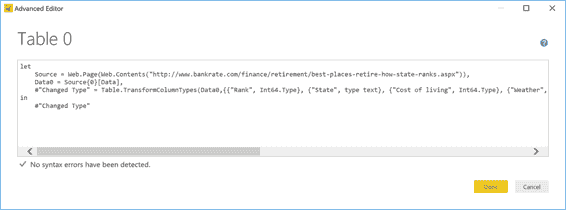

图 71:查询编辑器—高级编辑器

接下来，通过命名来保存查询。

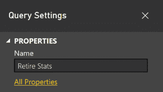

图 72:查询编辑器-查询设置

查询被自动导入，并且在右侧面板上可见，如图 73 所示。

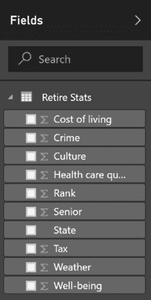

图 73:报告-字段

我们还导入了有关维基百科中缩写的数据。我们使用“获取数据”功能，然后我们点击**网页**并指定包含信息的地址。

在图 74 中，您可以看到我们想要的地址——包含状态缩写表的地址——并且我们进行了编辑。

图 74:商务智能台式机—从网络获取数据

接下来，点击**确定**。

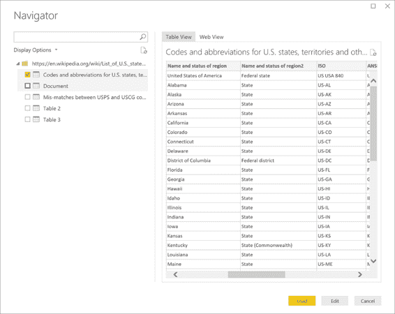

图 75:智能商务桌面—获取数据，导航器

在图 75 中，我们点击**加载**。

我们通过功能区上的行删除功能删除行:减少行、删除行和删除顶行。

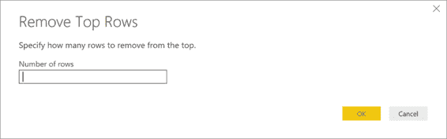

图 76:查询编辑器—移除顶行表单

接下来，我们指定要删除的列数(本例中为两列)。

我们只对统计数据中的州感兴趣，因此所有其他领域在这里都无关紧要。通过使用图 77 中的移除底部行按钮，我们将从数字 54 到 78 中移除 25 行。

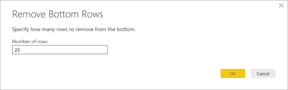

图 77:查询编辑器—移除底部行表单

请记住，我们只对带有 ANSI 两个字母代码的缩写感兴趣，因此选择我们感兴趣的两列并删除所有其他列是有意义的。

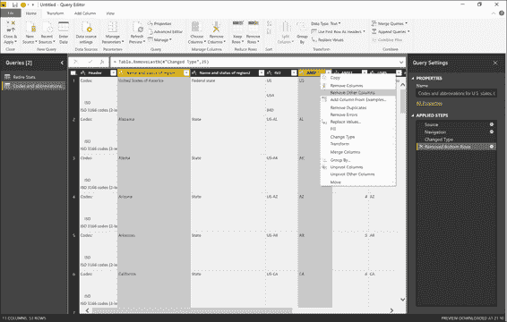

图 78:查询编辑器—列选项

因此，我们有了用于构建数据模型的表。

我们可以重命名该表，并用**关闭并应用**保存，这是功能区左上角的第一个条目。

这两个表现在都可以报告了。

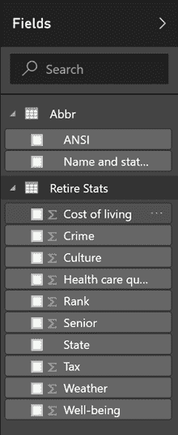

图 79:报告-字段

我们使用功能区“关系”中的“管理关系”功能来获取关系。

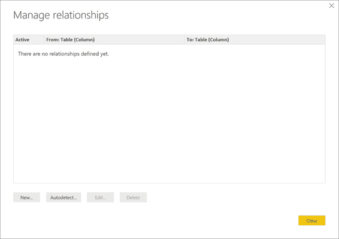

图 80:关系—管理关系

我们也可以尝试实现自动检测，以便根据列的名称进行自动测量。

图 81:关系—自动检测

图 81 显示了一个不起作用的例子，它展示了为什么在手动模式下创建报告是明智的。

接下来，我们点击条目**新建**并识别第一个表。如图 82 所示，自动选择另一个表。

我们使用州名来创建 1 对 1 的关系。请注意，过滤器的方向可以双向工作。

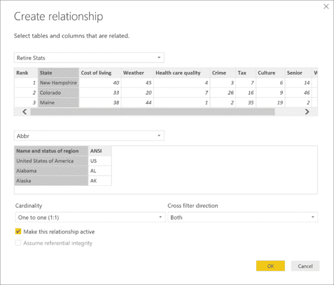

图 82:关系—创建关系

根据修改，图 83 显示了关系图。

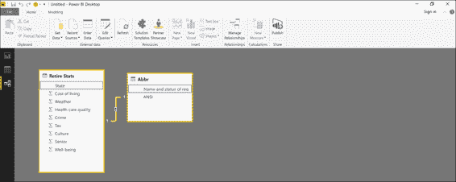

图 83:关系

现在数据模型已经建立。我们可以随时显示查询的数据(见图 84)。

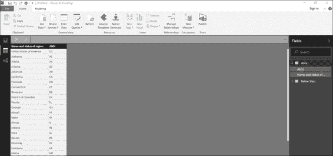

图 84:数据部分

我们完全按照在线方式创建报告。

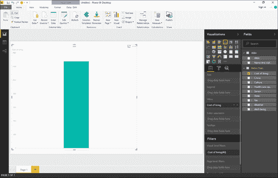

图 85:可视化

图 86 显示我们可以创建一个关于生活成本的图表。再次注意，我们没有使用州名，而是使用了两个字母的 ANSI 代码。

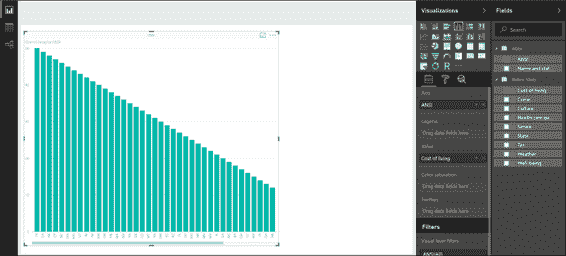

图 86:可视化

图 87 显示了我们如何通过使用更合适的可视化来改变我们的图表。

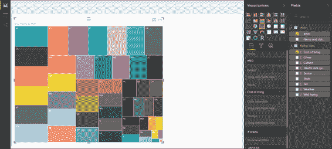

图 87:可视化

接下来，我们以 PBIX 格式保存我们的工作结果。

图 88:节能商业智能文件

现在我们继续出版。

单击功能区共享部分的条目**发布**(图 89)。

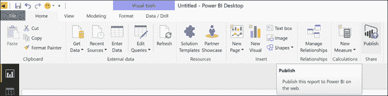

图 89:发布

现在转到“登录”

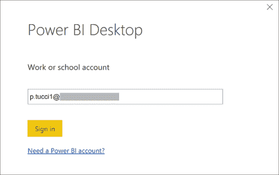

图 90:发布—登录

图 91 描述了如何通过向 Power BI 提供我们的访问凭证来进行身份验证。

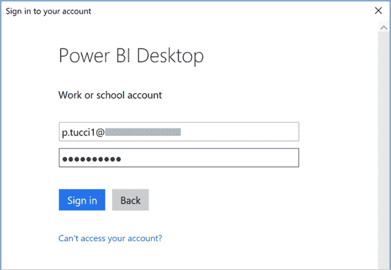

图 91:发布—登录

此时，发布开始。

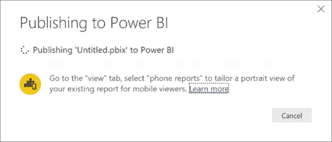

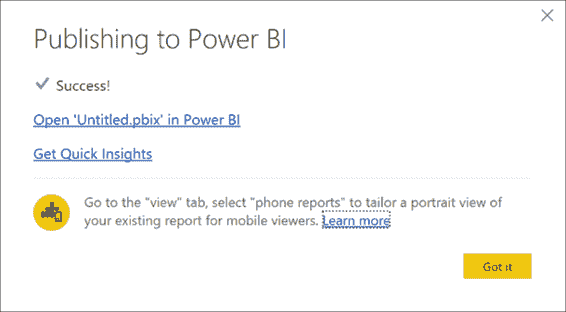

图 92:完成发布—序列

现在我们通过浏览器显示 Power BI，看看上次操作的效果。

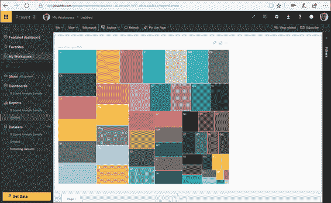

图 93:发布结果

正如我们在左侧面板中看到的，我们有数据集和报告选项。数据集正是我们使用应用用数据模型构建的数据集。包含我们选择的可视化的报告也在这里。

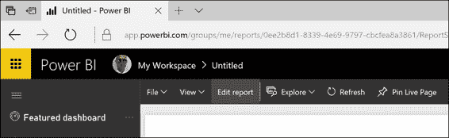

图 94:电力商业智能服务—编辑报告

我们可以随时创建仪表板。

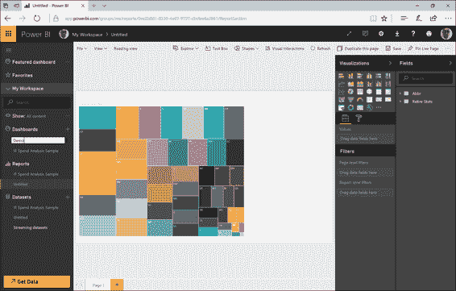

图 95:电力商业智能服务—创建仪表板

图 96 提醒我们，像往常一样，我们需要将可视化固定在仪表板上。

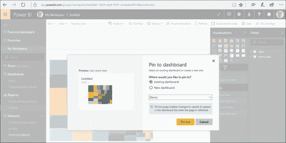

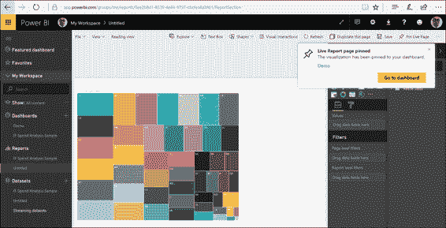

图 96:固定到仪表板—顺序

我们的报告是通过应用在内部构建的，可以编辑以增强其信息。任何修改将保持在线。

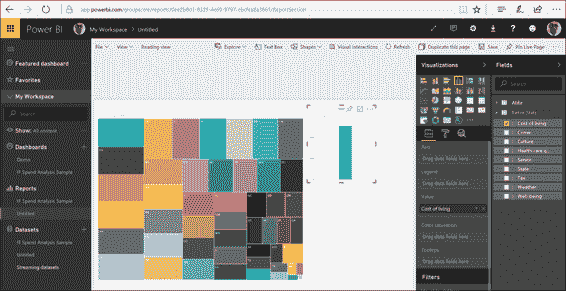

图 97:新图表