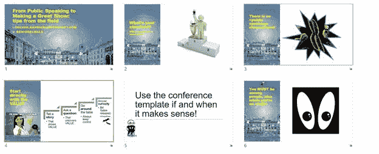
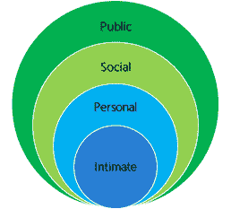
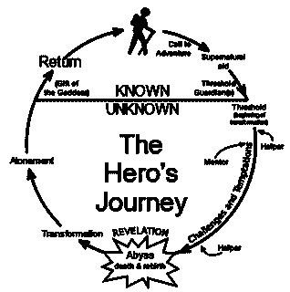

# 二、选题和创作流程

比方说，你必须在一个会议上，在与客户或同事的会议上，或者向一位教授做报告。

你从哪里开始？通常，人们会打开他们的演示工具并开始创建幻灯片，或者他们会去一些网站(公司内部或外部，如幻灯片共享)找到一些幻灯片，并开始组装演示文稿。

这种技术导致了充满细节的演示，但由于没有事先考虑，无法提供一些价值。

让我们假设您有一个(或多个)幻灯片，可以用来进行演示。公司往往就是这种情况。它可以节省你很多时间，但是如果你感觉幻灯片不像你的*，如果你不同意内容，或者如果你可以使用不同的顺序或不同的例子，人们会立即知道。*

 *如果你赶时间(因为你的老板前一天告诉你关于演示的事情)，或者如果幻灯片是强制性的，你可以不加修改地使用它们。试着想象你脑海中的流动，做一个预演，看看你是否能讲出正确的故事，或者你是否需要一些不同的例子(例如，替换在你的文化中效果不佳的幻灯片)。

幻灯片很重要，但是如果你没有好的幻灯片，你仍然可以做一个很棒的会议。如果您在开始时没有支持幻灯片，您可以在演示文稿的开头，甚至在标题幻灯片上描述其价值。通过这种方式，您已经设置了竞争环境，然后您可以跟随幻灯片，使用正确的故事来传递价值。

如果您可以创建新的幻灯片，或者重新排列现有的幻灯片，那么您的工作就是创建正确的流程。

总是从值开始，并尝试删除所有不重要的细节。不要立即删除幻灯片；你可以把它们藏起来，或者移到阑尾。如果幻灯片太复杂或太冗长，尝试应用您将在[第 4 章](4.html#_Chapter_4_Preparing)中看到的技巧来简化它们。

使用右侧缩放的幻灯片浏览来可视化演示文稿的流程。

图 1:幻灯片排序器

在图 1 中，演示的核心价值是“做一场精彩的表演”要做到这一点，一切从定义你的标准开始。演示继续说，如果每个人都遵循正确的建议，他们可以改进，比如避免一开始就介绍自己，而不是立即从价值开始。(人们应该问你的名字，因为他们感兴趣。)等等。

您可以通过下载关于您知道的主题的现有演示文稿，并尝试制作您的幻灯片，来锻炼您组织和重新排列幻灯片的能力。你总是可以通过让一个演示文稿成为你的来改进它，甚至是一个好的演示文稿。有时你无法做出修改；在这种情况下，您仍然可以从该演示中学习一些东西。

你也可以在会议期间锻炼:试着想象你是如何完成正在进行的演示的。

在从头开始创建新的演示文稿之前，您应该已经交付了许多演示文稿，其中包含由您修改或重新排列的其他人创建的幻灯片。研究他人的工作并加以改进是锻炼和培养你创造力的好方法。 [2](Public_Speaking_for_Geeks_0012.htm#_ftn2)

当你准备从头开始创建你的第一个演示文稿时，我的建议是打开一个文本编辑器，写下演示文稿的价值，这可能是你演讲后观众应该记住的唯一一句话。

然后你可以开始头脑风暴想法和故事，围绕你的核心价值研究事实，并把它们写下来。你了解你的观众吗？试着想象他们，帮助你理解他们的需求，以及为什么你的价值对他们来说很重要。试着集思广益，想出能引起他们共鸣的故事。

一旦你完成了这个活动，你就可以查看你写的项目，并尝试对它们进行优先排序，给它们一个逻辑顺序。此时，您可以开始创建幻灯片。你不必去适应所有你头脑风暴过的事情；您应该只添加最重要的一个，它允许您传递您的故事，以支持您的演示的核心价值。

故事(真实的或虚构的)是最有用的工具之一，你可以用它来改善你的演讲。你可以用一个故事来解释你演讲的价值。你可以用一个故事来介绍你的产品，或者创造更多了解它的需求。

您可以在技术演示中使用故事来解释为什么使用特定的技术，为什么优化一些代码的性能，或者为什么关注可用性很重要。

如果我们还没有一个*位置*，事实就不会停留在我们的大脑中。你可以向你的听众抛出很多事实，但是如果过了一段时间人们不记得了，你的陈述的有效性就很低了。

情绪是回忆储存在记忆中的事实的有力方式。故事通常被用来创造情绪或将情绪与接下来的事实联系起来。

作为一个极客，你可能会想用事实作为打动观众的唯一武器，制作幻灯片和演示来展示你的作品有多好，以及你对特定技术的了解程度。那不坚持。

你还记得迪士尼/皮克斯电影*里的冰峰吗？ [3](Public_Speaking_for_Geeks_0012.htm#_ftn3) 在某个时刻，他和所有消失的记忆一起迷失在记忆垃圾堆里。这是一个极好的形象 [4](Public_Speaking_for_Geeks_0012.htm#_ftn4) 帮助你记住，没有一个好的故事，事实就会消失。*

考虑到许多提高记忆力的课程使用强烈的情绪来连接事实并使它们坚持下去。

有一本名为*生活区* [5](Public_Speaking_for_Geeks_0012.htm#_ftn5) 的好书，其中解释了我们生活中有*四个区*。

图 2:四个生命区

*公众*T2 区对任何人开放。当你环顾四周寻找信息和刺激时，当你完全匿名时，或者当你和很多人在一起并与他们互动时，你就在公共区域。

*社交* *区*是你和与你互动的人一起进行活动的地方，比如工作或运动。

个人**区域*是你与你信任的人分享你的感受的地方。在个人区域，你会因为这种分享而感到脆弱。*

 *亲密的**区域*是最里面的区域，在这里你更容易受到伤害，因为你和你最在乎的人在一起。*

 *您可以将这些区域与您所提供的性能联系起来。

如果你向完全陌生的人陈述事实，没有互动，也没有来自有力位置的问题(例如，作为讲台后面的教授)，你可能在公共区域，在那里你不脆弱(或者只是一点点)。

如果你向你认识的人展示，或者你打开自己，与与会者互动，分享信息和一般的故事，你就在社交区域。这是你更容易受到伤害的地方，但是人们开始感觉到更好的联系。

如果你是用个人故事来展示，比如你是如何和你的儿子一起使用一个产品的，那么你就处于个人区域，在这里你更容易受到伤害，因为很难把批评和我们的个人经历分开。

演示文稿可以包含这些故事的混合；你可以从公共区域开始，转向社交或个人区域。

小心:如果你在个人区域，而观众(或部分观众)在公共或社交区域，你可以把产品评论当成个人批评。为了成为一个更好的演讲者，你需要处理这个区域不匹配。总是向朋友和其他与会者询问关于你觉得粗鲁的言论的反馈；也许其他人没有同样的感觉。

故事无处不在，无处不在。只要关注人们，关注陌生人——在上班的路上，在公园，任何地方。

一个好的故事可以是真实的，或者你可以以某种方式修改它来支持你的观点。如果有与会者问，一定要说实话。

你需要帮助吗？詹姆斯·惠特克(James Whittaker)[6](Public_Speaking_for_Geeks_0012.htm#_ftn6)的《说书人魔法书》是一本帮助你构思故事的好书。

如果你需要一个故事却找不到，那么*《英雄之旅》* [7](Public_Speaking_for_Geeks_0012.htm#_ftn7) 就是创造新故事的好模板。如您所见，许多电影都遵循下图中突出显示的路径。

图 3:英雄的旅程。来源:维基百科。

《哈利·波特》系列、《星球大战》和《T2》以及《指环王》只是其中的几个例子。此外，斯科特·亚当斯的一幅特别的“T4”呆伯特(T5)漫画的灵感来自于几年前主人公的旅程。 [8](Public_Speaking_for_Geeks_0012.htm#_ftn8)

让我们探索一个在大多数情况下都很关键的话题。有时，你需要向与你同级或比你高的人展示，你的展示应该会影响他们采取一些行动，比如赞助你的项目、采用你的产品或改变公司的某些东西。

为了准备这样一个演示，你可以选择或创造一些故事，这些故事对于让你的信息持续下去至关重要。

你需要理解人们为什么抵制变革(例如，你向一家仍在内部部署所有服务器的公司提议云)，以及他们何时接受变革。你需要找到正确的情绪和动机来理解不同的观点。

另一个重要的事情是理解利益相关者的挑战和动机。有时候，金钱不是唯一的动力；一个好的项目可能会得到其他同事或经理的尊重。

你需要接受他们的需求，讨论改变的好处。如果他们能对你开诚布公，你就能理解他们的观点。

亚当·格兰特的书《给予和索取》、《T2》、《T3》、《T4》、《T5》中有整整一章是关于使用正确的动机来诱导人或组织的改变。有时候你需要先质疑现状，然后再提出解决方案，因为如果你没有感受到痛苦，保持静态会更容易。

## 开始

介绍自己和公司，然后转到议程幻灯片，然后围绕他们想要解释的主题开始一次长途旅行的演讲者通常会这样做，因为这是开始演示的典型方式——当他们焦虑时，他们会回到自己的舒适区。

能够直接从价值开始需要一些准备。有很多可能的方法可以做到:

*   **讲一个说明价值的故事**。我们已经讨论了为什么故事很重要，所以没有必要解释这个。
*   **问一个能让你发现价值的问题**。如果你能处理所有可能的答案，而不仅仅是你期望的答案，问题就是一个强大的工具。
*   **围着桌子走**。如果少于十到十五个人，你可以从让人们回答一个与价值相关的简单问题开始。你*必须*控制时间，你不应该让一个与会者偷走你的注意力。
*   **激起好奇心**。如果你能在演讲中使用一个道具，它可以帮助你激起对其价值的好奇心。比尔·盖茨在一次 TED 演讲中发布了蚊子，以提高人们对疟疾的认识。[T3】10T5】](Public_Speaking_for_Geeks_0012.htm#_ftn10)

|  | 提示:尝试用多种方式开始演示。你需要掌握所有这些，选择一个更适合你的心情或你的观众。演讲的前几分钟对于吸引人们的注意力并在会议的剩余时间里保持注意力至关重要。尽可能以最好的方式利用这段时间！ |***