# 一、入门

R 编程语言被设计用来进行统计分析。对编程语言的调查显示，R 的使用正在迅速增加，这显然与数据收集的增加有关。

r 有两种不同的用法。最常见的是，R 被用作交互工具。例如，在控制台外壳中，用户可以键入命令，例如:

`> my_df <- read.table(“C:\\Data\\AgeIncome.txt”, header=TRUE)
> m <- lm(Income ~ Age, data=my_df)
> summary(m)`

这些命令将对存储在 AgeIncome.txt 文件中的年龄和收入数据执行线性回归数据分析，并显示分析结果。r 有数百个内置函数，可以执行数千个统计任务。

但是，您也可以通过将 R 命令和 R 语言控制结构(如 for 循环)放入文本文件、保存文件和执行文件来编写 R 程序(即脚本)。例如，用户可以键入命令，例如:

`> setwd(“C:\\Data\\MyScripts”)
> source(“neuralnet.R”)`

这些命令将运行一个名为 neuralnet 的 R 程序。r，它位于 C:\Data\MyScripts 目录中。通过编写 R 程序来扩展基本的 R 交互功能，您获得了巨大的能力和灵活性。

在这本电子书中，我将解释如何编写 R 程序。我对你的背景和经验不做任何假设——即使你完全没有编程经验，你也应该能够通过一点努力跟上。

我将在每个部分展示一个完整的演示程序。程序员学习如何用一种新的语言编程，方法是启动并运行一个示例程序，然后通过改变进行实验。所以，如果你想学习 R 编程，复制粘贴一个演示程序的源代码，运行程序，然后对程序进行修改。

我不会给出数百个单行的 R 例子。相反，我将展示简短(但完整)的程序，说明关键的 R 语法示例和技术。所有演示程序的代码可以在[https://github.com/jdmccaffrey/r-programming-succinctly](https://github.com/jdmccaffrey/r-programming-succinctly)找到。

根据我的经验，学习任何编程语言或技术最困难的部分是让第一个程序运行。之后，就是细节了。但是开始可能会令人沮丧，第一章的目的是确保您可以安装 R 并运行程序。

已经聊够了。我们开始吧。

## 1.1 安装 R

众所周知，学习一门编程语言或技术的最好方法就是使用它。虽然你可以通过阅读这本书来学习很多关于 R 的知识，但是如果你安装了 R 并运行了每个部分的演示程序，你会学到更多。

安装 R 相对来说既快捷又容易，我将为您介绍 Windows 系统安装过程的每一步。如果您使用的是 Linux 系统，安装过程会根据您运行的 Linux 版本而有所不同，但是互联网上有许多分步安装指南。对于 Mac 系统，R 安装与 Windows 安装非常相似。

启动浏览器，在互联网上搜索“安装”，你会找到一个窗口安装程序的链接。撰写本文时，Windows 安装 URL 为[https://cran.r-project.org/bin/windows/base](https://cran.r-project.org/bin/windows/base)。单击链接会将您的浏览器指向类似于图 1 的页面。

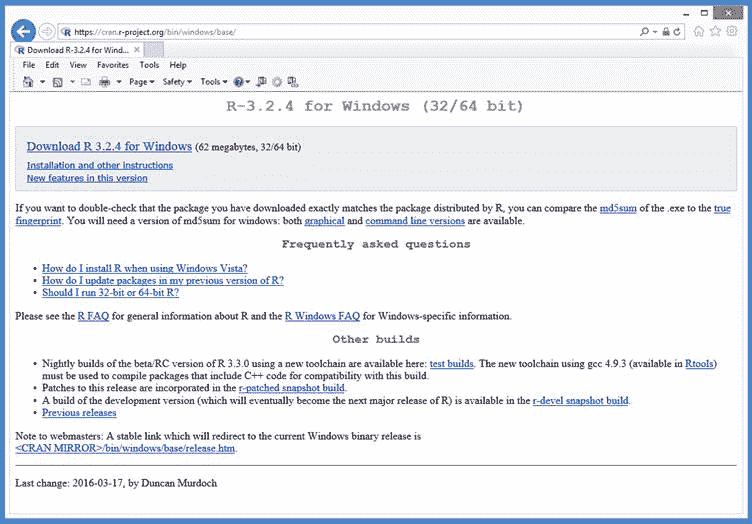

图 1:窗口安装页面

截图显示我打算安装 R 版本 3.2.4。当您阅读本文时，R 的最新版本可能会有所不同——然而，基本的 R 语言相当稳定，本电子书中的代码示例旨在与较新版本的 R 一起工作。

请注意，网页标题为“(32/64 位)。”默认情况下，在 64 位系统上(几乎可以肯定你正在使用)，R 安装程序会给你一个 32 位版本的 R 和一个 64 位版本。32 位版本适用于旧机器，并向后兼容只能使用 32 位版本 R 的旧 R 附加包。

接下来，点击“为 Windows 下载 R 3.x.y”的链接该链接指向一个自解压可执行安装程序。您的浏览器会询问您是否要将安装程序下载到您的机器上，以便以后运行安装程序，或者询问您是否要立即运行安装程序。单击“运行”启动安装程序。


图 2:立即或稍后运行安装程序

安装程序将启动并显示一个小对话框，要求您选择一种语言。R 的优势之一是它支持许多不同的口语。从下拉列表中选择您的语言，然后单击“确定”


图 3:选择语言

接下来，安装程序将显示一个欢迎窗口。请注意，您需要在计算机上拥有管理权限才能安装 r。单击“下一步”

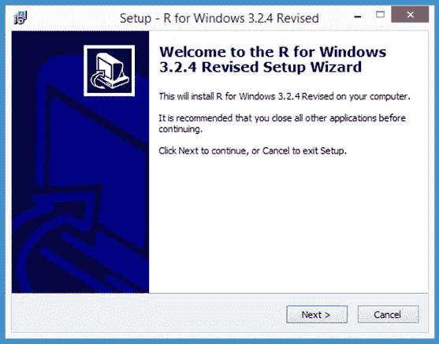

图 4:安装欢迎窗口

安装程序将显示许可信息。如果你看看窗口滚动条，你会发现有很多信息。r 在几种不同的开源许可下运行。如果你是一个不怕法律惩罚的人，请阅读所有信息，或者点击“下一步”

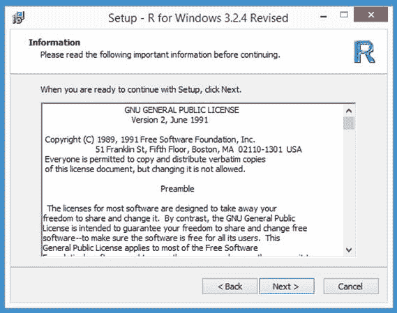

图 5:许可信息

接下来，安装程序将要求您指定安装目录。默认位置是 C:\Program Files\R\R-3.x.y，我建议您使用默认位置，除非您有充分的理由不这样做。单击“下一步”


图 6:指定安装位置

接下来，安装程序将要求您从四个组件中进行选择。默认情况下，所有组件都处于选中状态。除非您的机器内存不足，否则您可以选择所有组件，然后单击“下一步”您至少需要核心文件以及 32 位文件或 64 位文件组件。

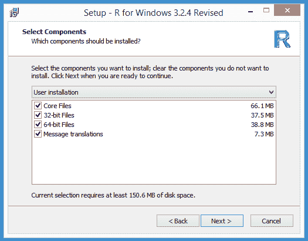

图 7:选择要安装的组件

接下来，安装程序将为您提供自定义启动选项的选项。这些选项包含在名为 Rprofile.site 的文件中，它们控制默认编辑器等项目。我建议接受所有默认值，然后单击“下一步”


图 8:指定启动选项

接下来，安装程序将询问程序快捷方式的位置。接受“R”的默认位置，然后单击“下一步”

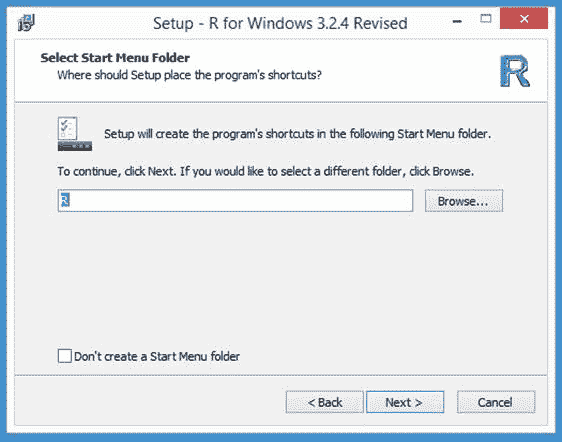

图 9:选择开始菜单文件夹

接下来，安装程序将询问您一些最终选项。选定的默认选项没有问题—只需单击“下一步”

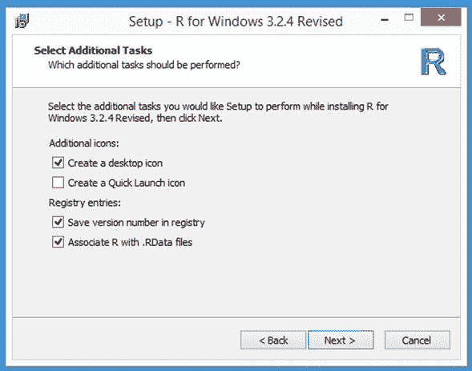

图 10:附加安装选项

接下来，将开始实际的安装过程。您将看到一个显示安装进度的窗口。安装非常快，应该不超过一两分钟。

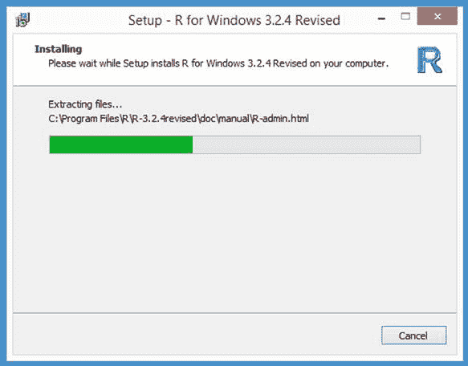

图 11:安装进度

安装过程完成后，您将看到最后一个窗口。单击“完成”，您就可以开始使用 r 了


图 12:安装完成

如果您接受默认安装位置，R 安装过程会将大部分密钥文件放在 C:\ Program Files \ R \ R-3 . x . y \ bin \ x64。我建议你快速看一下那里。

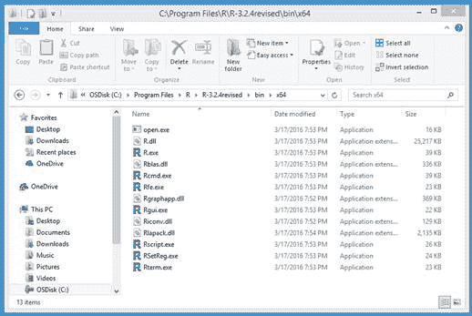

图 13:密钥文件

总的来说，安装 R 还是比较快捷容易的。在 Windows 系统上，安装程序是一个自解压可执行文件。您可以接受所有安装默认选项。安装过程将为您提供 32 位版本(主要是为了向后兼容旧的附加软件包)和 64 位版本。

## 1.2 编辑和运行 R 程序

您可以通过几种方式编辑和执行 R 程序。如果您不熟悉 R 语言，我建议您使用随 R 一起安装的 Rgui.exe 程序。打开文件资源管理器窗口，导航到 C:\ Program Files \ R \ R-3 . x . y \ bin \ x64 目录(如果您使用的是旧的 32 位机器，则为\i386)。

找到 Rgui.exe 文件。您可以双击 Rgui.exe 启动它，或者右键单击该文件，然后选择“以管理员身份运行”选项。对于编辑和运行简单的程序，您可以简单地双击。但是，如果您需要安装附加软件包，您必须以管理权限运行 Rgui.exe。

Rgui.exe 启动后，您将看到一个外壳窗口，其中包含一个控制台窗口。RConsole 窗口允许您直接向 R 发出交互命令。要创建 R 程序，请转到菜单栏并选择**文件|新脚本**。这将在外壳窗口内创建一个 R 编辑器窗口，在这里你可以编写一个 R 程序。

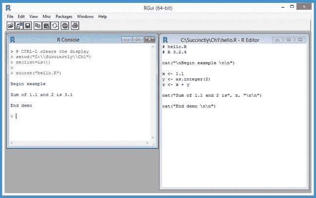

图 14:使用 Rgui.exe 程序

在编辑器窗口中，键入或复制粘贴以下代码:

`# hello.R
# R 3.2.4`

`cat(“\nBegin example \n\n”)`

`x <- 1.1
y <- as.integer(2)
z <- x + y`

`cat(“Sum of 1.1 and 2 is”, z, “\n\n”)
cat(“End demo \n\n”)`

在运行程序之前，您必须保存它。**点击文件|另存为**，然后导航到任意方便的目录，将程序另存为 hello.R .我把程序保存在 C:\简洁\Ch1。

要运行该程序，请单击 RConsole 窗口上的任意位置，这将使它具有焦点。如果您希望删除所有有点烦人的启动消息，您可以通过键入 CTRL-L 来实现。接下来，在 RConsole 窗口中键入以下命令:

`> setwd(“C:\\Succinctly\\Ch1”)
> rm(list=ls())
> source(“hello.R”)`

`setwd()`命令将工作目录设置到 R 程序的位置。请注意所需的双反斜杠的 C 族语言语法。因为 R 是多平台的，如果你愿意，你也可以使用单个正斜杠。

`rm(list=ls())`命令可以被认为是一个神奇的 R 咒语，删除当前内存中的所有 R 对象。在运行 R 程序之前，您应该总是发出这个命令。如果不这样做，可能会导致非常难以追踪的错误。

`source()`命令用于执行一个 R 程序。从技术上讲，R 程序是脚本，因为 R 是被解释的，而不是被编译的。然而，我在这本电子书中交替使用术语“程序”和“脚本”。

更改代码后，可以使用标准快捷键 CTRL-S 或选择**文件|保存**选项进行保存。当您关闭 Rgui.exe 程序时，会出现一个对话框，询问您是否要“保存工作区图像？”你可以点击“否”

工作空间图像由内存中当前的 R 对象组成。因为程序会重新创建对象，所以没有必要保存图像。通常，当您已经交互使用了 R 并键入了几十个甚至上百个命令时，您会保存一个图像，并且您不想丢失您创建的所有对象的状态。如果您确实保存了一个 R 图像，该图像将以. RData 文件扩展名保存。可以使用**文件|加载工作空间**菜单选项恢复工作空间图像。

总之，我建议使用 Rgui.exe 程序来编写和执行一个 R 程序。您可以在编辑器窗口中编写和编辑程序，并通过在 RConsole 窗口中发出`source()`命令来运行程序。编辑 R 程序有几十种选择。我有时用开源的 Notepad++程序来写 R 程序，因为它给我很好的源代码着色。我的一些同事使用开源 RStudio 程序。

### 资源

`source()`功能有很多有用的选项来控制 R 程序的运行。参见:
[https://stat . ethz . ch/R-manual/R-dev/library/base/html/source . html](https://stat.ethz.ch/R-manual/R-devel/library/base/html/source.html)。

## 1.3 使用附加包

R 语言被组织成包。当你安装 R 的时候，你会得到大约 30 个包，它们的名字像基本，图形和统计。这些内置包允许您执行许多编程任务，但是您也可以安装和使用由 R 社区创建的数百个包。

附加包是 R 的一个优点也是一个缺点，因为任何人都可以写一个 R 包，所以质量可以相差很大。而且因为包可以依赖于其他包，如果你安装了很多包，你可能会遇到版本问题。为了避免这种情况，在这本电子书中，我只使用了 R 安装附带的内置 R 包。

您可以在控制台窗口中发出命令`installed.packages()`，以查看您的系统中当前安装了哪些软件包。请注意，与大多数编程语言不同，R 经常使用“.”字符而不是“_”字符作为函数名的一部分，这使得函数名更易读。如果你是一个有经验的程序员，这个语法一开始可能会非常困难。

要安装软件包，您可以使用`install.packages()`功能。例如，有 BigInteger 数据类型。安装 gmp 附加包时，请确保您已连接到互联网，然后键入命令`install.packages(“gmp”)`。这将启动一个小窗口，让你选择一个网站，从中安装 gmp 包。

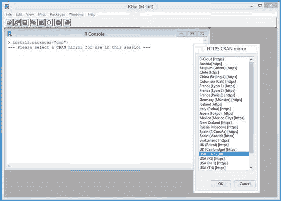

图 15:安装附加软件包时选择镜像

您可以选择任何镜像网站，然后单击“确定”软件包安装过程是无声的，通常相对较快。在极少数情况下，安装过程会失败，这通常是因为镜像网站关闭或镜像网站没有请求的软件包。如果发生这种情况，您将收到一条错误消息。您可以通过发出命令`chooseCRANmirror()`来尝试不同的镜像站点。

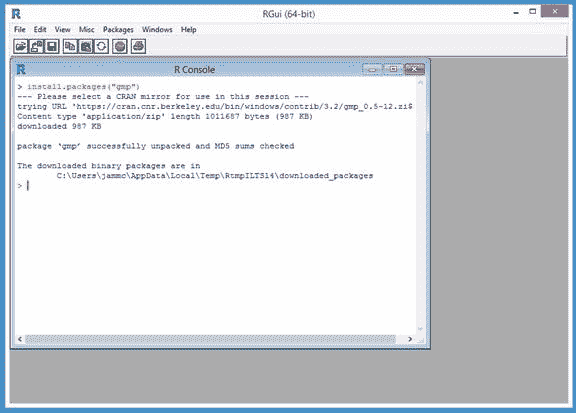

图 16:软件包安装成功

您的附加软件包安装成功后，您可以使用`library()`或`require()`功能访问该软件包。例如，在交互模式下，您可以键入命令`library(gmp)`，然后您可以使用 gmp 包中定义的所有功能和类。例如，这些命令将显示 20 阶乘的值(如图 17 所示):

`> library(gmp)
> f = factorialZ(20)
> f`

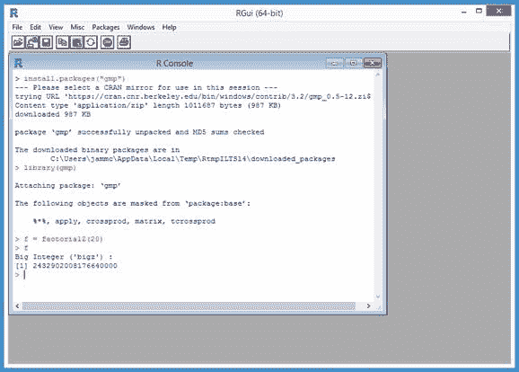

图 17:访问插件包

`library()`函数和`require()`函数都将已安装的包加载到当前上下文中，但是如果目标包未安装，`library()`将返回错误并停止执行。但是，`require()`将返回值`FALSE`，如果没有安装目标包，将尝试继续执行。使用完附加软件包后，您应该考虑卸载该软件包，以防止您的系统被软件包淹没。

要删除软件包，首先使用`installed.packages()`功能列出已安装的软件包。在大多数情况下，删除软件包时，您会希望列出所有已安装的软件包，因为同一软件包可能有多个包含不同版本的实例。通过指定输出中的行数和列数，您可以只列出几个已安装的软件包，或者只列出每个软件包的一些信息。例如，命令`installed.packages()[1:5,1:3]`将列出已安装软件包表的第 1-5 行，以及表信息的第 1-3 列。要取出包装，使用`remove.packages()`功能；比如`remove.packages(“gmp”)`或者`remove.packages(“gmp”, version=“0.5-12”)`。

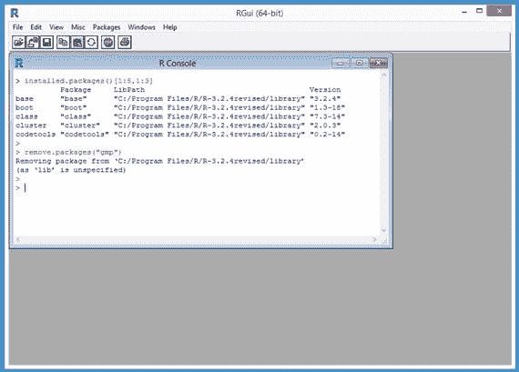

图 18:移除包

总之，安装 R 可以为您提供大约 30 个内置包，这些包包含了常见编程任务所需的大部分功能。为了管理附加软件包，您可以使用`installed.packages()`、`install.packages()`和`remove.packages()`功能。要访问附加软件包，您可以使用`library()`功能，如果您的系统上没有安装请求的软件包，该功能将会失败；也可以使用`require()`功能。

### 资源

`library()`和`require()`功能的区别详见:
[https://stat . ethz . ch/R-manual/R-dev/library/base/html/library . html](https://stat.ethz.ch/R-manual/R-devel/library/base/html/library.html)。

## 1.4 R 语法和风格参考程序

代码清单 1 中的程序为常见的 R 语言特性(如 if-then 和 for-loop 语句)的语法提供了快速参考。

代码清单 1: R 语言语法示例

```r
  # syntaxdemo.R                                # comments start
  with ‘#’
  # R 3.2.4                                     # filename and
  version

  tri_max = function(x, y, z) {                 # program-defined
  function          
    if (x > y && y > z) {                       # logical AND
      return(x)                                 # return() requires
  parens
    }
    else if (y > z) {                           # C-style braces OK here
      return(y)
    }
    else {
      return(z)
    }                                           
  }

  my_display = function(v, dec=2) {             # default argument
  value
    # display vector v to console
    n <- length(v)                              # built-in length()

    for (i in 1:n) {                            # for-loop
      x <- v[i]                                 # 1-based indexing
      xf <- formatC(x,                          # built-in
  formatC() 
        digits=dec, >format=“f”)                 # you can break
  long lines         
      cat(xf, “ “)                              # basic display function
    }
    cat(“\n\n”)                                 # print two
  newlines                                 
  }

  my_binsearch = function(v, t) {               # program-defined
  function
    # search sorted integer vector v for t
    lo <- 1
    hi <- length(v)
    while (lo <= hi) {                          # while loop
      mid <- as.integer(round((lo + hi) / 2))   # built-in round()
      if (v[mid] == t) {                        # equality
        return(mid)
      } else if (v[mid] < t) {                  # R-style braces optional
        lo <- mid + 1
      } else {
        hi <- mid - 1
      }
    }
    return(0) # not found                       # could
  just use 0 here
  }

  # -----                                       # functions must
  be defined

  cat(“\nBegin R program syntax demo \n\n”)

  xx <- 4.4; yy <- 6.6; zz <- 2.2               # multiple values, one line
  mx <- tri_max(xx, yy, zz)                     # function call
  cat(“Largest value is”, mx, “\n\n”)           # use ‘,’ or
  paste()

  v <- c(1:4)                                   # make vector of integers
  decimals <- 3                                 # ‘<-’ or ‘=‘
  assignment
  my_display(v, decimals)                       # override default
  2 value

  v <- vector(>mode=“integer”, length=4)         # make vector of
  integers
  v[1] <- 9; v[2] <- 6; v[3] <- 7; v[4] <- 8    # multiple statements
  t <- 7                                        
  idx <- my_binsearch(v, >t)
  if (idx >= 1) {                               # R-style braces required here
    cat(“Target “, >t, “in cell”, idx, “\n\n”)
  } else {
    cat(“Target”, t, “not found \n\n”)
  }

  cat(“End syntax demo \n\n”)

```

如果你是 R 的新手，一些语法上的怪癖可能会让人困惑。R 中有两个赋值运算符:`<-`运算符和`=`运算符。在大多数情况下，可以使用任一赋值运算符。

R 语言是少数几种使用基于 1 的索引而不是基于 0 的索引的语言之一。

在 if-then-else 语句中，即使是单个 then-语句也需要大括号。在函数定义中，您可以使用更容易阅读的 C 风格，其中`else`关键字和来自`if`的右花括号出现在单独的行中。但是，在函数定义之外，当`else`和右花括号在同一行时，必须使用 R 样式。

尽管已经提出并发布了几个 R 语言风格指南，但是在 R 社区中对于什么是好的 R 语言风格几乎没有一致的意见。在我看来，一致性和常识比盲目关注任何风格指南更重要。

总之，R 语言的语法与 C 语言非常相似。r 使用`<-`和`=`运算符进行赋值(还有一个专门的`<<-`运算符用于引用类)。r 集合从 1 开始，而不是从 0 开始。您可以在函数定义中使用易于阅读的 if-then C 风格语法，但必须在代码块定义之外使用 R 风格语法。

### 资源

官方 R 语言定义见:
[https://cran . R-project . org/doc/manuals/R-release/R-lang . html](https://cran.r-project.org/doc/manuals/r-release/R-lang.html)。