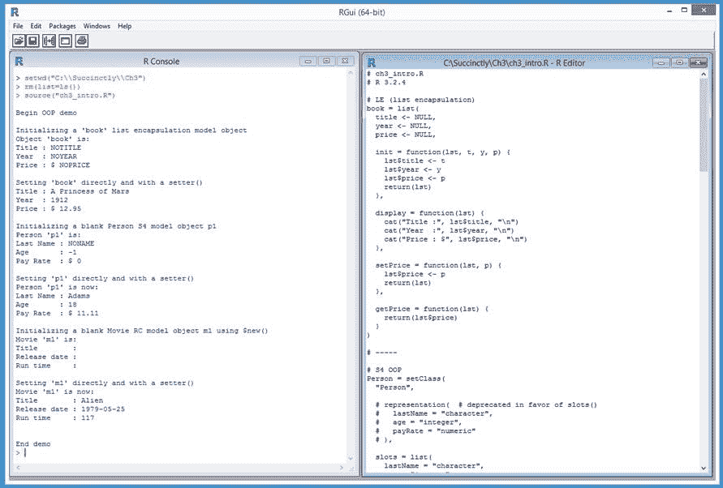

# 三、面向对象编程

许多编程语言，包括 Java、C# 和 Python，都支持面向对象编程模型。与大多数编程语言不同，R 支持三种不同的面向对象模型，分别叫做 S3、S4 和参考类。S3 和 S4 模型之所以如此命名，是因为这些模型是用 S 语言开发的，也就是 r 语言的前身

除了 R 的三个正式的 OOP 模型之外，您还可以创建一个非正式的模型，该模型使用一个列表对象来封装数据字段和相关联的函数(当作为 OOP 类的一部分时，通常称为方法)。图 20 中的截图给出了本章的方向。



图 20:面向对象编程演示

在本章的每一节中，我们将研究如何使用不同的模型。在 3.1 节中，您将学习如何使用 R 列表类型创建一个非正式的轻量级 OOP 形式，称为列表封装。在 3.2 节中，我们将看到如何使用旧的(但仍然有用的)S3 模型创建 OOP 代码。

在 3.3 节中，您将学习如何使用 S4 模型创建 OOP 代码。在 3.4 节中，我们将了解如何使用 RC 模型创建 OOP 代码。

## 3.1 列表封装 OOP

因为 R 列表对象可以同时容纳变量和函数，所以实现 OOP 最基本的方法就是将相关数据和函数封装在一个列表中。与 S3、S4 和 RC OOP 相比，列表封装 OOP 的主要优势在于简单。因为列表封装没有避免名称冲突的机制，所以该技术通常对您的个人代码库有用，而不是用于其他人的代码。

代码清单 7:列表封装模型

```r
  # books.R
  # R 3.2.4

  # LE (list encapsulation)
  book = list(
    title <- NULL,
    year <- NULL,
    price <- NULL,

    init = function(lst, >t, y, p) {
      lst$title <- t
      lst$year <- y
      lst$price <- p
      return(lst)  
    },

    display = function(lst) {
      cat(“Title :”, lst$title, “\n”)
      cat(“Year  :”, lst$year, “\n”)
      cat(“Price : $”, lst$price, “\n”)
    },

    setPrice = function(lst, p) {
      lst$price <- p
      return(lst)
    },

    getPrice = function(lst) {
      return(lst$price)
    }
  )

  # -----

  cat(“\nBegin OOP with list encapsulation demo \n\n”)

  # initialization
  cat(“Initializing a ‘book’ object \n”) 
  book <- book$init(book, “NOTITLE”, “NOYEAR”, “NOPRICE”)
  cat(“Object ‘book’ is: \n”)
  book$display(book)
  cat(“\n\n”)

  # set fields
  cat(“Setting ‘book’ directly and with a setter() \n”) 
  book$title <- “A Princess of Mars”
  book$year <- as.integer(1912) 
  book <- book$setPrice(book, 12.95)
  book$display(book)
  cat(“\n”)

  # get fields
  cat(“Getting title and price fields \n”)
  ti <- book$title
  pr <- book$getPrice(book) 
  cat(“Price of ‘“)
  cat(ti)
  cat(“‘ is “, pr, “\n”)
  cat(“\n\n”)

  # assignment
  cat(“Calling ‘tome <- book’ \n”)
  tome <- book
  cat(“Object ‘tome’ is: \n”)
  tome$display(tome)
  cat(“\n”)

  cat(“Modifying title of object ‘tome’ \n”)
  tome$title <- “xxxxxxxx”
  cat(“Object ‘tome’ is: \n”)
  tome$display(tome)

  cat(“\n”)
  cat(“Original object ‘book’ is unchanged: \n”)
  book$display(book)

  cat(“\nEnd demo \n”)

```

```r
  >
  source(“books.R”)

  Begin
  OOP with list encapsulation demo 

  Initializing
  a ‘book’ object 
  Object
  ‘book’ is: 
  Title
  : NOTITLE 
  Year 
  : NOYEAR 
  Price
  : $ NOPRICE 

  Setting
  ‘book’ directly and with a setter() 
  Title
  : A Princess of Mars 
  Year 
  : 1912 
  Price
  : $ 12.95 

  Getting
  title and price fields 
  Price
  of ‘A Princess of Mars’ is  12.95 

  Calling
  ‘tome <- book’ 
  Object
  ‘tome’ is: 
  Title
  : A Princess of Mars 
  Year 
  : 1912 
  Price
  : $ 12.95 

  Modifying
  title of object ‘tome’ 
  Object
  ‘tome’ is: 
  Title
  : xxxxxxxx 
  Year 
  : 1912 
  Price
  : $ 12.95 

  Original
  object ‘book’ is unchanged: 
  Title
  : A Princess of Mars 
  Year 
  : 1912 
  Price
  : $ 12.95 

  End
  demo 

```

演示程序将一个`book`对象定义为一个列表，该列表包含一个标题、一年(出版时间)、一个价格和四个相关功能。请注意，没有明确的方法来强制数据类型，例如，年份字段可以是字符、整数或数字:

`book = list(
title <- NULL,
year <- NULL,
price <- NULL,
. . .`

使用列表封装，您可以定义对象的特定实例，而不是用于创建对象的模板。但是，正如我稍后将展示的，您可以使用按值复制来创建多个对象。 **`book`** 对象定义了一个显示自身的函数:

`display = function(lst) {
cat(“Title :”, lst$title, “\n”)
cat(“Year :”, lst$year, “\n”)
cat(“Price : $”, lst$price, “\n”)
},`

`book`对象有一个初始化函数，为三个字段提供值:

`init = function(lst, t, y, p) {
lst$title <- t
lst$year <- y
lst$price <- p
return(lst)
},`

每个`book`对象函数，包括`init()`函数，都有一个名为`lst`的参数，代表`book`对象。调用语句说明了这样做的目的:

`cat(“Initializing a ‘book’ object \n”)
book <- book$init(book, “NOTITLE”, “NOYEAR”, “NOPRICE”)
cat(“Object ‘book’ is: \n”)
book$display(book)`

注意`book`对象在对`init()`的调用中出现了三次。任何修改源对象的函数调用都会在列表封装 OOP 中使用这种三重引用模式。对`display()`函数的调用只需要`book`对象两次，因为`book`没有被函数调用改变。

演示程序定义了修改`book`对象价格字段的功能:

`setPrice = function(lst, p) {
lst$price <- p
return(lst)
},`

函数`setPrice()`是这样调用的:

`cat(“Setting ‘book’ directly and with a setter() \n”)
book$title <- “A Princess of Mars”
book$year <- as.integer(1912)
book <- book$setPrice(book, 12.95)
book$display(book)`

在列表封装中，所有字段都有公共范围，这意味着可以使用`$`运算符直接访问它们，如这里修改标题和年份字段时所示。或者，您可以编写一个集合函数，并使用三重引用模式调用它。

该演示为价格字段定义了一个访问器 get 函数:

`getPrice = function(lst) {
return(lst$price)
}`

这是调用`getPrice()`的演示程序代码:

`cat(“Getting title and price fields \n”)
ti <- book$title
pr <- book$Price(book)
cat(“Price of ‘“); cat(ti); cat(“‘ is “, pr, “\n”)`

列表封装对象字段可以直接访问，也可以使用 get 函数访问。使用`$`运算符直接设置字段值和获取字段值比编写和调用设置函数和获取函数简单得多。那么为什么要用函数呢？我个人的经验法则是，只有当一个列表封装 OOP 函数使用两个或更多字段或执行非平凡计算时，我才会编写该函数。

在这个例子中，如果代码是为了实际使用而不是作为演示，我会编写`display()`函数，因为它使用了所有三个 book 字段，但是我不会编写`setPrice()`和`getPrice()`函数，因为它们只访问一个字段。

为了创建多个对象，可以使用这种普通的赋值:

`cat(“Calling ‘tome <- book’ \n”)
tome <- book
cat(“Object ‘tome’ is: \n”)
tome$display(tome)`

因为 R 是通过值而不是引用来赋值的，所以对象`tome`将是`book`对象的完整、独立的副本。在演示中，这些调用语句展示了独立性:

`cat(“Modifying title of object ‘tome’ \n”)
tome$title <- “xxxxxxxx”
cat(“Object ‘tome’ is: \n”)
tome$display(tome)`

`cat(“Original object ‘book’ is unchanged: \n”)
book$display(book)`

对象`tome`的标题被更改，但是因为`tome`不是参照对象`book`关联的，所以对`tome`的更改对`book`对象没有影响。

总之，在 R 中实现一种面向对象编程形式的最简单的方法是创建一个保存相关数据和函数的列表对象。如果想访问数据，可以直接使用`$`操作符或者通过编写 get-functions 和 set-functions 来实现。对改变源对象的封装函数的调用将引用该对象三次。对不改变源对象的封装函数的调用将使用该对象两次。列表封装创建一个对象的特定实例，但是您可以通过使用普通赋值创建具有相同数据字段和函数定义的其他对象。

### 资源

使用列表封装 OOP 本质上就是使用 R 列表。有关列表类型的信息，请参见:
[。](https://stat.ethz.ch/R-manual/R-devel/library/base/html/list.html) 

一个程序定义的函数实际上在 R 中叫做闭包参见:
[https://stat . ethz . ch/R-manual/R-dev/library/base/html/function . html](https://stat.ethz.ch/R-manual/R-devel/library/base/html/list.html)。

## 3.2 OOP 使用 S3

R 语言支持一个叫做 S3 的面向对象模型。大多数基本的 R 语言都是使用 S3 模型编写的。尽管 S3 在某种程度上已经被 S4 和 RC OOP 模型所取代，但 S3 是完全可行的，也是我的许多同事的首选模型。

代码清单 8: S3 面向对象模型

```r
  # students.R
  # R 3.2.4

  # S3 OOP
  Student = function(ln=“NONAME”, un=0, gpa=0.00) {
    this <- list(
      lastName = ln,
      units = un,
      gradePoint = gpa
    )
    class(this) <- append(>class(this), “Student”)
    return(this)
  }

  display = function(obj) {
    UseMethod(“display”, obj)
  }

  display.Student = function(obj) {
    cat(“Last name : “, obj$lastName, “\n”)
    cat(“Units     : “, obj$units, “\n”)
    cat(“GPA       : “, obj$gradePoint, “\n”)
  }

  setUnits = function(obj, u) {
    UseMethod(“setUnits”, obj)
  }

  setUnits.Student = function(obj, un) {
    obj$units <- un
    return(obj)
  }

  getUnits = function(obj) {
    UseMethod(“getUnits”, obj)
  }

  getUnits.Student = function(obj) {
    return(obj$units)
  }

  # -----

  cat(“\nBegin OOP with S3 demo \n\n”)

  # initialization
  cat(“Initializing a default Student object s1 \n”) 
  s1 <- Student()  # default param values
  cat(“Student ‘s1’ is: \n”)
  display(s1)
  cat(“\n”)

  cat(“Initializing a Student object s2 \n”)
  s2 <- Student(“Barker”, 27, 2.87)
  cat(“Student ‘s2’ is: \n”)
  display(s2)
  cat(“\n”)

  # set fields
  cat(“Setting s1 directly and with a setter() \n”) 
  s1$lastName <- “Archer”
  s1 <- setUnits(s1, 19)
  s1$gradePoint <- 1.99
  cat(“Student ‘s1’ is now: \n”)
  display(s1)
  cat(“\n”)

  # get fields
  cat(“Getting lastName and units for ‘s1’ \n”)
  ln <- s1$lastName
  units <- getUnits(s1) 
  cat(“Units for Student ‘“)
  cat(ln)
  cat(“‘ are “, units, “\n”)
  cat(“\n”)

  # assignment
  cat(“Calling ‘s3 <- s1’ \n”)
  s3 <- s1
  cat(“Object ‘s3’ is: \n”)
  display(s3)
  cat(“\n”)

  cat(“Modifying all fields of object ‘s3’ \n”)
  s3$lastName <- “Coogan”
  s3 <- setUnits(s3, 38)
  s3$gradePoint <- 3.08
  cat(“Object ‘s3’ is now: \n”)
  display(s3)
  cat(“\n”)

  cat(“Original object ‘s1’ is unchanged: \n”)
  display(s1)

  cat(“\nEnd demo \n”)

```

```r
  >
  source(“students.R”)

  Begin
  OOP with S3 demo 

  Initializing
  a default Student object s1 
  Student
  ‘s1’ is: 
  Last
  name :  NONAME 
  Units    
  :  0 
  GPA      
  :  0 

  Initializing
  a Student object s2 
  Student
  ‘s2’ is: 
  Last
  name :  Barker 
  Units    
  :  27 
  GPA      
  :  2.87 

  Setting
  s1 directly and with a setter() 
  Student
  ‘s1’ is now: 
  Last
  name :  Archer 
  Units    
  :  19 
  GPA      
  :  1.99 

  Getting
  lastName and units for ‘s1’ 
  Units
  for Student ‘Archer’ are  19 

  Calling
  ‘s3 <- s1’ 
  Object
  ‘s3’ is: 
  Last
  name :  Archer 
  Units    
  :  19 
  GPA      
  :  1.99 

  Modifying
  all fields of object ‘s3’ 
  Object
  ‘s3’ is now: 
  Last
  name :  Coogan 
  Units    
  :  38 
  GPA      
  :  3.08 

  Original
  object ‘s1’ is unchanged: 
  Last
  name :  Archer 
  Units    
  :  19 
  GPA      
  :  1.99 

  End
  demo 

```

S3 面向对象模型与其他编程语言甚至其他面向对象模型使用的模型有很大的不同。如果您检查代码清单，您会看到 S3 本质上是一个逻辑相关但物理独立的函数的集合。

演示程序定义了一个学生类。核心定义是一个名为`Student()`的单一函数，定义为:

`Student = function(ln=“NONAME”, un=0, gpa=0.00) {
this <- list(
lastName = ln,
units = un,
gradePoint = gpa
)
class(this) <- append(class(this), “Student”)
return(this)
}`

`Student()`函数包含一个保存`lastName`、`units`和`gradePoint`字段变量的列表。该列表被分配了一个名为`this`的对象，但是在 S3，您可以为字段列表使用任何合法的名称。`this`的常见替代是`self`(如 Python 中所用)和`me`(如 Visual Basic 中所用)。

函数`Student()`定义中的最后两个语句使用了关键词`class`和`append`，在我看来，最好认为是一个 S3 魔法咒语。

演示程序用以下代码创建了第一个名为`s1`的`Student`:

`cat(“Initializing a default Student object s1 \n”)
s1 <- Student()
cat(“Student ‘s1’ is: \n”)
display(s1)`

创建一个 S3 对象看起来就像调用一个普通的 R 函数。由于没有参数值传递给`Student()`，因此`s1`字段`lastName`、`units`和`gradePoint`将使用默认参数值“NONAME”、“0”和 0.0。

请注意，`display()`函数的调用就好像它是 R 语言的内置部分，而不是像您在其他编程语言中看到的那样调用`s1.display()`。S3 模型向全局 R 运行时环境注册函数，这样就可以像调用内置函数一样调用它们。

首先注册`display()`功能，然后定义，这样:

`display = function(obj) {
UseMethod(“display”, obj)
}`

`display.Student = function(obj) {
cat(“Last name : “, obj$lastName, “\n”)
cat(“Units : “, obj$units, “\n”)
cat(“GPA : “, obj$gradePoint, “\n”)
}`

注册机制使用`UseMethod()`函数告诉 R 将定义一个名为`display()`的自定义函数。`display()`函数通过使用 functionName.className 的命名约定与 S3 学生类相关联。如果您在其他语言中使用过 OOP，那么 S3 模型一开始可能会显得有些奇怪。

演示程序定义了一个名为`setUnits()`的函数，用于修改 **`Student`** 对象的单位字段:

`setUnits = function(obj, un) {
UseMethod(“setUnits”, obj)
}`

`setUnits.Student = function(obj, un) {
obj$units <- un
return(obj)
}`

再次使用寄存器定义模式。请注意，因为函数`setUnits()`修改了它的源`Student`对象，所以函数必须返回该对象。函数`setUnits()`是用这些语句调用的:

`cat(“Setting s1 directly and with a setter() \n”)
s1$lastName <- “Archer”
s1 <- setUnits(s1, 19)
s1$gradePoint <- 1.99
cat(“Student ‘s1’ is now: \n”)
display(s1)`

S3 对象可以直接使用`$`操作符或使用设置功能进行修改。请注意，为了调用改变对象的函数，必须使用`object <- function(object, value)`模式。

S3 对象是按值复制的，因此如果使用赋值，新对象将是一个独立的副本，对其中一个对象所做的任何更改都不会影响另一个对象。例如:

`s3 <- s1 # create a copy of s1
s3$lastName <- “Coogan” # modify s3
s3 <- setUnits(s3, 38)
s3$gradePoint <- 3.08
display(s1) # s1 has not been affected`

总之，S3 对象被定义为相关函数的集合。每个对象都有一个初始化函数，该函数包含一个保存字段的列表。辅助函数成对定义，一个函数注册辅助函数，一个函数定义函数的行为。S3 对象上的函数被调用，就像它们是内置函数一样。必须使用对象

### 资源

`UseMethod()`功能详情见:
[https://stat . ethz . ch/R-manual/R-dev/library/base/html/usemethod . html](https://stat.ethz.ch/R-manual/R-devel/library/base/html/UseMethod.html)。

## 3.3 OOP 使用 S4

2001 年，R 语言引入了一个叫做 S4 的面向对象模型，它比早期的 S3 模型要复杂得多。然而，对于许多编程场景，S4 提供的高级特性(例如一种继承形式和检查输入有效性)是可选的，并且不是必需的。

代码清单 9: S4 面向对象模型

```r
  # persons.R
  # R 3.2.4

  # S4 OOP
  Person = setClass(
    “Person”,

    slots = list(
      lastName = “character”,
      age = “integer”,
      payRate = “numeric”
    ),

    prototype = list(
      lastName = “NONAME”,
      age = as.integer(-1),
      payRate = 0.00
    )

    # could define validity() here
  )

  setGeneric(name=“display”,
   def=function(obj) {
    standardGeneric(“display”)
   }
  )

  setMethod(f=“display”,
   signature=“Person”,
   definition=function(obj) {
     cat(“Last Name :”, obj@lastName, “\n”)
     cat(“Age       :”, obj@age, “\n”)
     cat(“Pay Rate  : $”, obj@payRate, “\n”)
   }
  )

  setGeneric(name=“setPayRate”,
   def=function(obj, pRate) {
    standardGeneric(“setPayRate”)
   }
  )

  setMethod(f=“setPayRate”,
   signature=“Person”,
   definition=function(obj, pRate) {
     obj@payRate <- pRate
     return(obj)
   }
  )

  setGeneric(name=“getPayRate”,
   def=function(obj) {
    standardGeneric(“getPayRate”)
   }
  )

  setMethod(f=“getPayRate”,
   signature=“Person”,
   definition=function(obj) {
     return(obj@payRate)
   }
  )

  # -----

  cat(“\nBegin OOP with S4 demo \n\n”)

  # initialization
  cat(“Initializing a blank Person object p1 \n”) 
  p1 <- new(“Person”)  # calls prototype()
  # p1 <- Person()  # non-preferred
  cat(“Person ‘p1’ is: \n”)
  display(p1)
  cat(“\n”)

  cat(“Initializing a Person object p2 \n”) 
  p2 <- new(“Person”, lastName=“Baker”, age=as.integer(22), payRate=22.22)
  cat(“Person ‘p2’ is: \n”)
  display(p2)
  cat(“\n”)

  # set fields
  cat(“Setting ‘p1’ directly and with a setter() \n”) 
  p1@lastName <- “Adams”
  p1@age <- as.integer(18)
  p1 <- setPayRate(p1, 11.11)
  cat(“Person ‘p1’ is now: \n”)
  display(p1)
  cat(“\n”)

  # get fields
  cat(“Getting lastName and payRate of ‘p1’ \n”)
  ln <- p1@lastName
  pr <- getPayRate(p1) 
  cat(“Pay rate of ‘“)
  cat(ln)
  cat(“‘ is “, pr, “\n”)
  cat(“\n”)

  # assignment
  cat(“Calling ‘p3 <- p1’ \n”)
  p3 <- p1
  cat(“Object ‘p3’ is: \n”)
  display(p3)
  cat(“\n”)

  cat(“Modifying lastName, payRate of object ‘p3’ \n”)
  p3@lastName <- “Chang”
  p3 <- setPayRate(p3, 33.33)
  cat(“Object ‘p3’ is now: \n”)
  display(p3)
  cat(“\n”)

  cat(“Original object ‘p1’ is unchanged: \n”)
  display(p1)

  cat(“\nEnd demo \n”)

```

```r
  >
  source(“persons.R”)

  Begin
  OOP with S4 demo 

  Initializing
  a blank Person object p1 
  Person
  ‘p1’ is: 
  Last
  Name : NONAME 
  Age      
  : -1 
  Pay
  Rate  : $ 0 

  Initializing
  a Person object p2 
  Person
  ‘p2’ is: 
  Last
  Name : Baker 
  Age      
  : 22 
  Pay
  Rate  : $ 22.22 

  Setting
  ‘p1’ directly and with a setter() 
  Person
  ‘p1’ is now: 
  Last
  Name : Adams 
  Age      
  : 18 
  Pay
  Rate  : $ 11.11 

  Getting
  lastName and payRate of ‘p1’ 
  Pay
  rate of ‘Adams’ is  11.11 

  Calling
  ‘p3 <- p1’ 
  Object
  ‘p3’ is: 
  Last
  Name : Adams 
  Age      
  : 18 
  Pay
  Rate  : $ 11.11 

  Modifying
  lastName, payRate of object ‘p3’ 
  Object
  ‘p3’ is now: 
  Last
  Name : Chang 
  Age      
  : 18 
  Pay
  Rate  : $ 33.33 

  Original
  object ‘p1’ is unchanged: 
  Last
  Name : Adams 
  Age      
  : 18 
  Pay
  Rate  : $ 11.11 

  End
  demo 

```

S4 OOP 模型与其他编程语言使用的模型有很大不同，但 S4 确实与 S3 模型有一些相似之处。如果你检查代码清单，你会看到 S4，像 S3 一样，本质上是一个逻辑上相关但物理上独立的函数的集合。

演示程序使用`setClass()`函数定义了一个 S4 人类:

`Person = setClass(
“Person”,`

`slots = list(
lastName = “character”,
age = “integer”,
payRate = “numeric”
),`

`prototype = list(
lastName = “NONAME”,
age = as.integer(-1),
payRate = 0.00
)
)`

类字段在名为`slots`的列表对象中定义。您可以指定每个字段的类型，这将允许 R 执行验证检查。使用`representation`参数提供了`slots`的替代方案，但是 R 文档推荐使用`slots`。

可选的`prototype`参数用于为对象指定默认值。例如，演示程序使用`new()`功能创建了一个名为`p1`的 **`Person`** 对象，方法如下:

`cat(“Initializing a blank Person object p1 \n”)
p1 <- new(“Person”)`

因为没有为`lastName`、`age`和`payRate`字段指定值，所以将使用原型中指定的默认值“NONAME”，-1 和 0.00。对象`p1` 可以用语句`p1 <- Person()`创建，但是我建议使用`new()`功能。

创建与 S4 类相关联的函数需要调用`setGeneric()`来注册函数名，并调用`setMethod()`来定义相关联的函数:

`setGeneric(name=“setPayRate”,
def=function(obj, pRate) {
standardGeneric(“setPayRate”)
}
)`

`setMethod(f=“setPayRate”,
signature=“Person”,
definition=function(obj, pRate) {
obj@payRate <- pRate
return(obj)
}
)`

这个两步的过程有点麻烦，语法也不明显。请注意，因为`setPayRate()`函数修改了源 **`Person`** 对象，所以该函数必须返回对该对象的引用。`setPayRate()`功能可以这样调用:

`p1@lastName <- “Adams”
p1@age <- as.integer(18)
p1 <- setPayRate(p1, 11.11)`

S4 对象的字段可以通过使用`@`操作符或定义一个集合函数来直接访问。S4 对象是按值复制的，因此赋值会创建一个独立的副本:

`p2 <- new(“Person”, lastName=“Baker”, age=as.integer(22), payRate=22.22)
p1 <- p2 # any change to p1 or p2 leaves the other unchanged`

总之，使用`setClass()`函数定义了一个 S4 类，该函数可以接受一个定义类字段及其类型的`slots`对象，以及一个定义默认字段值的可选`prototype`对象。使用`new()`方法实例化 S4 对象。您可以使用`@`运算符或通过编写 get-functions 和 set-functions 直接访问字段。与一个类相关联的每个函数由一个注册相关函数的`setGeneric()`函数和一个包含相关函数行为定义的`setMethod()`函数定义。

### 资源

有关使用`setClass()`函数创建 S4 类的详细信息，请参见:
[。](https://stat.ethz.ch/R-manual/R-devel/library/methods/html/setClass.html) 

有关 S4 对象初始化的 S4 `prototype()`函数的更多信息，请参见:
[。](https://stat.ethz.ch/R-manual/R-devel/library/methods/html/representation.html)

## 使用参考类的 3.4 OOP

请记住，R 语言有一个称为引用类(RC)的面向对象模型。RC 与 C#、Python 和 Java 等语言使用的 OOP 模型非常相似。在我看来，RC 模式明显优于老 S3 和 S4 模式；事实上，当我使用 OOP 时，RC 是我对大多数 R 编程场景的首选模型。

代码清单 10:参考类模型

```r
  # movies.R
  # R 3.2.4

  # RC (Reference Class) OOP
  Movie <- setRefClass(
    “Movie”,

    fields = list(
      title = “character”,
      released = “character”, # release date
      runTime = “integer”
    ),

    methods = list(
      display = function() {
        cat(“Title        :”, title, “\n”)
        cat(“Release date :”, released, “\n”)
        cat(“Run time     :”, runTime, “\n”)
      },

      getAge = function() {
        rd = as.POSIXlt(released)
        today = as.POSIXlt(Sys.Date())

        age = today$year - rd$year
        if (today$mon < rd$mon ||
         (today$mon == rd$mon && today$mday < rd$mday)) {
          return(age - 1)
        } else {
          return(age)
        }
      },

      setReleased = function(rd) {
        released <<- rd
        # .self$released <- rd
      }
    ) # methods
  )

  # -----

  cat(“\nBegin OOP using RC demo \n\n”)

  # initialization
  cat(“Initializing a blank Movie object using $new() \n”)
  m1 <- Movie$new()
  cat(“Movie ‘m1’ is: \n”)
  m1$display()
  cat(“\n”)

  cat(“Initializing a Movie object m2 \n”) 
  m2 <- Movie$new(title=“Blade Runner”,
   released=“1982-06-25”, runTime=as.integer(117))
  cat(“Movie ‘m2’ is: \n”)
  m2$display()
  cat(“\n”)

  # set fields
  cat(“Setting ‘m1’ directly and with a setter() \n”) 
  m1$title <- “Alien”
  m1$setReleased(“1979-05-25”)
  m1$runTime <- as.integer(117)
  cat(“Movie ‘m1’ is now: \n”)
  m1$display()
  cat(“\n”)

  # get fields
  cat(“Getting title and age of ‘p1’ \n”)
  ti <- m1$title
  age <- m1$getAge() 
  cat(“The age of ‘“)
  cat(ti)
  cat(“‘ is “, age, “years\n”)
  cat(“\n”)

  # assignment
  cat(“Calling m3 <- m1$copy() to make a copy \n”)
  m3 <- m1$copy()
  cat(“Object ‘m3’ is: \n”)
  m3$display()
  cat(“\n”)

  cat(“Modifying all fields of object ‘m3’ \n”)
  m3$title <- “Cube”
  m3$setReleased(“1997-09-09”)
  m3$runTime <- as.integer(90)
  cat(“Object ‘m3’ is now: \n”)
  m3$display()
  cat(“\n”)

  cat(“Original object ‘m1’ is unchanged: \n”)
  cat(“Object m1 is: \n”)
  m1$display()
  cat(“\n”)

  cat(“Calling ‘m4 <- m1’ (probably wrong!) \n”)
  m4 <- m1
  cat(“Object ‘m4’ is: \n”)
  m4$display()
  cat(“\n”)

  cat(“Modifying all fields of object ‘m4’ \n”)
  m4$title <- “Dark City”
  m4$setReleased(“1998-02-27”)
  m4$runTime <- as.integer(100)
  cat(“Object ‘m4’ is now: \n”)
  m4$display()
  cat(“\n”)

  cat(“BUT original object ‘m1’ has changed too: \n”)
  cat(“Object m1 is: \n”)
  m1$display()

  cat(“\nEnd demo \n”)

```

```r
  >
  source(“movies.R”)

  Begin
  OOP using RC demo 

  Initializing
  a blank Movie object using $new() 
  Movie
  ‘m1’ is: 
  Title       
  :  
  Release
  date :  
  Run
  time     :  

  Initializing
  a Movie object m2 
  Movie
  ‘m2’ is: 
  Title       
  : Blade Runner 
  Release
  date : 1982-06-25 
  Run
  time     : 117 

  Setting
  ‘m1’ directly and with a setter() 
  Movie
  ‘m1’ is now: 
  Title       
  : Alien 
  Release
  date : 1979-05-25 
  Run
  time     : 117 

  Getting
  title and age of ‘p1’ 
  The
  age of ‘Alien’ is  36 years

  Calling
  m3 <- m1$copy() to make a copy 
  Object
  ‘m3’ is: 
  Title       
  : Alien 
  Release
  date : 1979-05-25 
  Run
  time     : 117 

  Modifying
  all fields of object ‘m3’ 
  Object
  ‘m3’ is now: 
  Title       
  : Cube 
  Release
  date : 1997-09-09 
  Run
  time     : 90 

  Original
  object ‘m1’ is unchanged: 
  Object
  m1 is: 
  Title       
  : Alien 
  Release
  date : 1979-05-25 
  Run
  time     : 117 

  Calling
  ‘m4 <- m1’ (probably wrong!) 
  Object
  ‘m4’ is: 
  Title       
  : Alien 
  Release
  date : 1979-05-25 
  Run
  time     : 117 

  Modifying
  all fields of object ‘m4’ 
  Object
  ‘m4’ is now: 
  Title       
  : Dark City 
  Release
  date : 1998-02-27 
  Run
  time     : 100 

  BUT
  original object ‘m1’ has changed too: 
  Object
  m1 is: 
  Title       
  : Dark City 
  Release
  date : 1998-02-27 
  Run
  time     : 100 

  End
  demo  

```

演示程序使用`setRefClass()`功能定义了一个 RC 电影类。对`setRefClass()`的调用结构是:

`Movie <- setRefClass(
“Movie”,`

`fields = list(
# fields go here
),`

`methods = list(
# class functions go here
)
)`

与 S3 和 S4 类不同，RC 类函数(技术上称为方法)是在类定义中物理定义的。电影类字段包括:

`fields = list(
title = “character”,
released = “character”, # release date
runTime = “integer”
),`

指定了 RC 类中字段的数据类型，这允许 R 执行运行时错误检查。

### RC 类函数/方法

电影类有三个相关的函数/方法。第一个是显示功能，定义为:

`display = function() {
cat(“Title :”, title, “\n”)
cat(“Release date :”, released, “\n”)
cat(“Run time :”, runTime, “\n”)
},`

类字段`title`、`released`和`runTime`可以通过`display()`功能直接访问。您可以通过使用特殊的`.self`变量和`$`运算符来明确字段成员资格。例如:

`cat(“Title :”, .self$title, “\n”)`

电影类有一个`getAge()`函数，通过计算当前日期和发布日期之间的差异，返回一个 **`Movie`** 对象的年龄(以年为单位):

`getAge = function() {
rd = as.POSIXlt(released)
today = as.POSIXlt(Sys.Date())

age = today$year - rd$year
if (today$mon < rd$mon || (today$mon == rd$mon && today$mday < rd$mday)) {
return(age - 1)
} else {
return(age)
}
},`

`getAge()`功能使用内置的`as.POSIXlt()`功能将`released`字段和系统日期时间转换为具有`year`、`mon`和`mday`字段的结构。减去`year`字段以获得 **`Movie`** 对象的年龄，尽管如果发行日期的月和日小于系统日期的月和日，年龄必须递减一年(因为电影的“生日”还没有发生)。

第三个电影类功能允许您设置发行日期:

`setReleased = function(rd) {
released <<- rd
}`

要通过成员函数修改 RC 类字段，必须使用特殊的`<<-`运算符，而不是常规的`<-`或`=`赋值运算符。这非常重要——忘记使用`<<-`是 RC 类实现错误的常见来源。

### RC 对象实例化

演示程序使用以下语句创建一个`Movie`对象:

`cat(“Initializing a blank Movie object using $new() \n”)
m1 <- Movie$new()
cat(“Movie ‘m1’ is: \n”)
m1$display()`

创建钢筋混凝土对象的模式是`object <- className$new()`。这里，因为没有值传递给`new()`，对象`m1`没有值给`title`、`released`和`runTime`字段。这些值必须稍后提供，或者直接提供，或者通过使用 set-function 提供，我将很快演示。

调用钢筋混凝土对象的成员函数/方法使用模式`object$function()`。这种模式明显不同于 S3 和 S4 的呼叫模式。例如，如果使用 S3 或 S4 模型定义电影类，显示函数将被称为`display(m1)`。

该演示使用字段值创建第二个`Movie`对象:

`cat(“Initializing a Movie object m2 \n”)
m2 <- Movie$new(title=“Blade Runner”, released=“1982-06-25”, runTime=as.integer(117))
cat(“Movie ‘m2’ is: \n”)
m2$display()`

实例化 RC 对象时，如果没有定义可选的`initialize()`函数，就不能将未命名的参数传递给`new()`。例如:

`m2 <- Movie$new(“Blade Runner”, “1982-06-25”, as.integer(117)) # wrong`

这段代码将运行，但它将生成一条逐渐减弱的消息，即“$new()的未命名参数必须是来自引用类的对象”，并且类字段将不会获得值。

演示程序以这种方式为实例化但未初始化的`m1`对象赋值:

`cat(“Setting ‘m1’ directly and with a setter() \n”)
m1$title <- “Alien”
m1$setReleased(“1979-05-25”)
m1$runTime <- as.integer(117)`

所有钢筋混凝土对象字段都具有公共可见性，这意味着可以使用`$`运算符直接访问字段。一些编程语言，如 Java 和 C#，允许您定义私有字段和函数，但其他语言，包括 R 和 Python，则不允许。最近发布的一个名为 R6 的插件包允许你定义可以有私有字段和函数的类。

### 钢筋混凝土对象分配

与所有其他 R 对象和变量不同，RC 对象是通过引用而不是通过值复制的。这意味着在对钢筋混凝土对象使用赋值时必须小心——你通常会希望使用内置的`copy()`函数。这个想法最好用例子来解释。假设 **`Movie`** 对象`m1`已经被实例化和初始化。这段代码可能不是您想要的:

`m4 <- m1 # probably not what you intend
m4$title <- “Dark City”
m4$setReleased(“1998-02-27”)
m4$runTime <- as.integer(100)
# all fields of object m1 have also been changed too!`

所有钢筋混凝土对象都继承了一个内置的`copy()`函数，该函数将生成一个值副本，而不是一个引用副本:

`m4 <- m1$copy() # probably what you want to do
m4$title <- “Dark City”
m4$setReleased(“1998-02-27”)
m4$runTime <- as.integer(100)
# m1 is not affected`

总之，参考类面向对象模型与 C#、Java 和 Python 等语言使用的面向对象模型有一些相似之处。您可以使用`setRefClass()`函数定义一个钢筋混凝土类。所有字段和类函数/方法都封装在类定义中。这意味着您使用`object$function()`模式调用类函数，而不是 S3 和 S4 对象使用的`function(object)`模式。定义修改字段的类函数时，必须使用特殊的`<<-`赋值运算符，而不是`<-`运算符。所有钢筋混凝土对象字段都具有公共可见性，可以使用`$`运算符进行访问。RC 对象是通过引用而不是通过值来复制的，因此在大多数情况下，在执行对象分配时，您会希望使用内置的`copy()`功能。

### 资源

关于 RC 类的详细信息，包括类继承，参见:
[https://stat . ethz . ch/R-manual/R-dev/library/methods/html/refclass . html](https://stat.ethz.ch/R-manual/R-devel/library/methods/html/refClass.html)。

有关创建 RC 类时可用的许多选项的更多信息，请参见:
[。](https://stat.ethz.ch/R-manual/R-devel/library/methods/html/setClass.html)