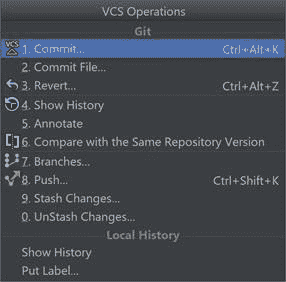
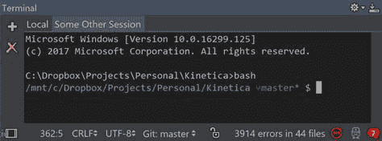
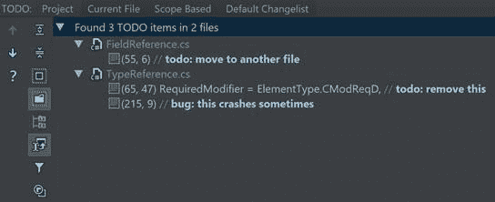
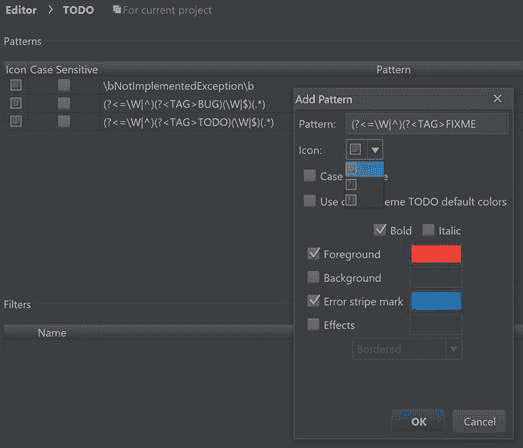
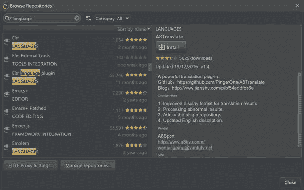

# 八、IDEA 平台特性

由于 Rider 构建在 IntelliJ 平台上，它自动获得了自 JetBrains 早期以来一直在开发的丰富功能。此外，Rider 的许多功能，如 NuGet 浏览器，都有与 Visual Studio 中包含的功能明显不同的体现。

IntellJ 平台支持多种源代码控制系统，包括 VCS、Subversion、Git、Mercurial 和 TFS。支持级别各不相同，但在所有情况下都支持核心源代码管理操作。

最常见的与 VCS 相关的操作被组合在一个 *VCS 操作弹出菜单*下:

图 92

除了典型的提交、推送和拉取操作，IDEA 平台还通过在必要时提供一个有用的合并窗口来为您处理合并。

集成开发环境包括一个内置的集成终端。它会打开运行它的操作系统的默认命令提示符。

但是，很容易将其重新配置为使用不同的命令提示符。例如，如果您正在使用 Windows 并运行 WSL (Windows System for Linux)，您可以键入`bash`，这会立即打开 WSL 命令提示符，假设您正在运行 Windows 10 并安装了该组件。

图 93

如图 93 所示，终端工具窗口(可以使用**视图>工具窗口>终端**显示)可以同时主持多个会话。因此，如果你需要，你可以有不同的标签，专用于，比如说，Windows 命令行，bash 以及 SSH，Telnet，或者一些其他的终端。

## 所有导航

有时候你想在代码中需要做一些工作的地方留下永久的注释。例如，有些东西需要修复，或者你留下了一个黑客在适当的位置，以便稍后替换。当然，在所有地方留下这样的评论很容易，但找到它们并不容易——当然，除非你使用 Rider！

在 Rider 中，代码分析器能够索引匹配特定正则表达式的注释(例如，以`todo:`开头的注释)，并呈现单独的**待办事项**工具窗口(通过**视图>工具窗口>待办事项**显示)，其中所有注释都被列为可点击项:

图 94

正如您在顶部看到的，有一些可用的筛选选项:您可以列出当前项目中的所有项，只列出当前文件或当前范围。

Rider 用来搜索的正则表达式也可以在 Rider 设置的待办事项部分配置:

图 95

您可以添加和删除正则表达式，并且对于每个表达式，您可以指定 Rider 使用的图标以及搜索是否区分大小写。即使 Rider 为 TODO 项设置了一组默认颜色，您也可以覆盖这些颜色，以便匹配该正则表达式的注释以不同的方式呈现。

## 插件

插件在 Rider 中是很棘手的事情。毕竟，插件的后端可以用. NET 语言编写，在功能上相当于为 ReSharper 编写的插件——以至于一些 ReSharper 插件可以在没有修改的情况下在 Rider 中工作。然而，有一个障碍:由于莱德使用了 JVM 前端，所有的视觉效果(比如对话窗口)都必须使用基于 IDEA 的 API 而不是 WPF 重新创建。JetBrains 正在跨不同的生态系统进行统一用户界面开发。

图 96

有些插件与完全无关。NET 的一面。例如，Rider 就像其他基于 IDEA 的 IDE 一样，支持 **Python 社区版**插件，该插件为您提供了 PyCharm 的免费部分，这是 JetBrains 的 Python IDE。由于 IDEA 的支持，Rider 中支持了更多的技术:这包括数据库导航器、Docker 支持、Protobuf 支持以及许多其他技术。