# 一、简介

Scala 是一种通用语言，设计了面向对象和功能机制。Scala 可以作为一种独立的应用程序语言使用，但是它也可以用来为基于 Java 的程序开发模块。开发该语言是为了表达难以用 Java 表达的范例。Scala 编译器(一个叫做 scalac.exe 的程序)使用 Java 虚拟机(JVM)将源代码编译成 Java 字节码来执行。

如果您还不熟悉 Scala，我建议您首先学习 Java 语言的基础知识。这两种语言共享强大的链接——所有的 Java 库都在 Scala 中可用，Scala 无缝集成到现有的 Java 应用程序中。图 1 描述了 Java 和 Scala 之间的密切关系。

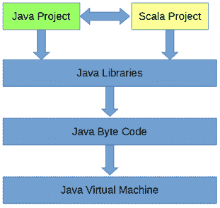

图 Scala 和 Java 之间的关系

可以使用控制台对 Scala 进行编程，但这并不是一种编程大型项目的实用方法。编写有用模块的最佳方法是安装 Eclipse Scala 集成开发环境(IDE)，这是一套旨在帮助用一种或多种编程语言进行开发的工具。

Eclipse Scala IDE 可从[http://scala-ide.org/](http://scala-ide.org/)获得。访问并下载最新版本。

|  | 注意:在这本电子书中，我将专门使用 Scala Eclipse IDE，但是还有其他选项可用于开发 Scala 应用程序和与现有的 Java 应用程序集成。IntelliJ IDEA 是另一个流行的 Java IDE，可以用来开发 Scala 模块和项目。您也可以使用命令行，在没有 IDE 的情况下开发 Scala 模块。 |

下载完成后，创建或定位要存储应用程序的文件夹，例如，在 C:\Program Files\。创建一个名为 Scala Eclipse 的新文件夹，将下载的文件复制到这个新文件夹中，并提取归档的内容。您最终应该得到一个文件夹，其中充满了图 2 中描述的文件和文件夹。

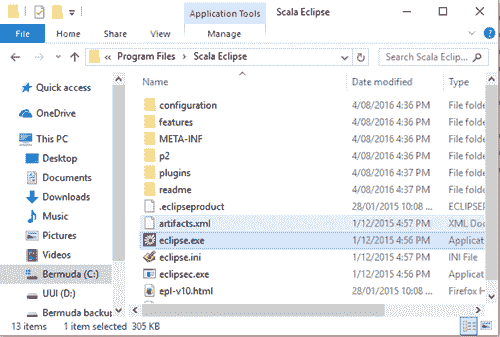

图 2:安装 Eclipse Scala 集成开发环境

最后，为了方便地运行 Scala Eclipse IDE，您可能想要创建一个快捷方式。右键单击名为**eclipse.exe**的文件，选择**创建快捷方式**。Eclipse.exe 是集成开发环境的主要可执行文件。在桌面或其他方便的位置创建快捷方式。要运行 IDE，请双击**clipse.exe**(或您新创建的快捷方式)。

当您运行 Eclipse 时，工作区选择对话框打开(如图 3 所示)。这允许您指定要使用的工作空间。工作区只是一个保存项目集合的文件夹，您可以通过点击**浏览来创建一个新的工作区文件夹...**例如，您可以将项目放入名为 Scala Workspace 的子文件夹中的文档文件夹中。当您选择了工作区或决定使用默认工作区时，单击**确定**。

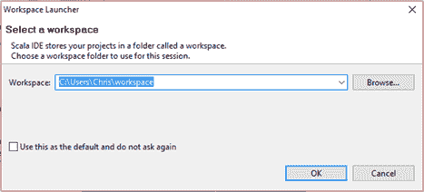

图 3:选择工作空间

对于我们的第一个项目，我们将制作一个简单的 Hello World 程序，以测试一切是否设置正确。为了开始一个新项目，启动 Eclipse Scala IDE。在 Scala Eclipse 的文件菜单中点击**文件→新建**，从子菜单中选择 **Scala 项目**(如图 4)。

|  | 注意:Scala 要求在机器上设置 Java 运行时环境(简称 JRE)。这可能已经安装好了。该机最新版本可在[http://www . Oracle . com/tech network/Java/javase/downloads/Jr E8-downloads-2133155 . html](http://www.oracle.com/technetwork/java/javase/downloads/jre8-downloads-2133155.html)从甲骨文下载。最好在您的开发机器上维护一个最新的 JRE，以便您的 Scala 应用程序获得最新 JVM 的所有好处和优化。Scala 还需要 Java SE 开发套件，可以从[http://www . Oracle . com/TechNet work/pt/Java/javase/downloads/JDK 8-downloads-2133151 . html](http://www.oracle.com/technetwork/pt/java/javase/downloads/jdk8-downloads-2133151.html)下载。 |

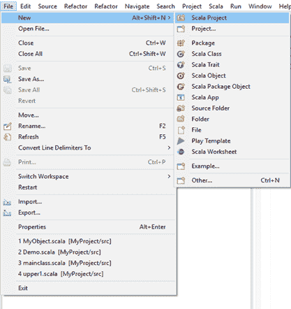

图 4:开始一个新项目

Eclipse 将显示新的 Scala 项目窗口。在项目名称框中输入项目名称，点击**完成**。在图 5 中，我将我的新项目称为 HelloWorld。


图 5:创建项目

项目是类、对象、文件和资源的集合，将由 scalac.exe 编译并由 JVM 执行。项目名称在工作区内必须是唯一的。它们还必须遵循操作系统定义的任何约定。例如，我们应该避免在我们的项目名称中使用特殊的符号，比如& an $，并坚持使用字母和数字。

点击**完成**后，Eclipse Scala IDE 会为你创建一个简单的项目。接下来，我们需要添加主对象，它将保存一个程序入口点。右键单击包浏览器窗口中的 **src** 文件夹。如果该窗口在文件菜单上不可见，单击**窗口>显示视图>其他> Java >包浏览器**。接下来，选择**新建> Scala 对象**(见图 6)。Eclipse 将打开新建文件向导窗口，如图 7 所示。

|  | 注意:窗口和面板的布局以及调试选项在 Scale Eclipse IDE 和 Java Eclipse IDE 之间都是相同的。简单阅读 Java，了解 Eclipse 中可用的基本面板、窗口和调试工具。 |

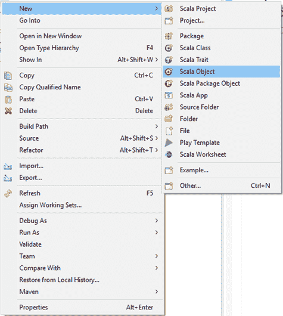

*图 6:创建新的 Scala 对象*

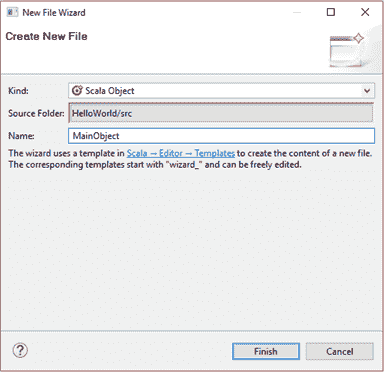

图 7:打开新建文件向导窗口

在新建文件向导窗口中，给你的对象起一个名字(我已经把我的叫做`MainObject`)然后点击**完成**。Eclipse 将用代码清单 1 中的代码为您创建一个新文件。

代码清单 1:主对象

```scala
  object MainObject {
  }

```

Scala 是一种面向对象的语言，具有类似于 C++、C# 和 Java 的特性。它操作由类构建的对象集合。但是 Scala 也允许我们定义单例对象。单例对象是从类构建的唯一实例。代码清单 1 中名为`MainObject`的对象实际上是一个单例。我们不是用关键字`class`定义蓝图，而是用关键字`object`定义单例。

为了让 JVM 知道从哪里开始执行我们的新应用程序，我们必须创建一个入口点——一个主方法。JVM 将调用我们的主方法一次。它永远不会创建超过一个类型为`MainObject`的对象，这就是为什么我们可以将类创建为单例对象，而不是可继承或可实例化的类。代码清单 2 显示了 HelloWorld 应用程序的完整代码。

|  | 注意:我们不必指定主方法。我们可以在没有主方法的情况下创建可用的模块。主要方法仅在我们打算创建可执行应用程序时使用。 |

代码清单 2: HelloWorld 应用程序

```scala
  // Main
  object definition
  object MainObject {
         // Main method definition
         def main(args: Array[String]): Unit = {

                // Print greeting:
                println("Hello world!")

         }      // Close main method
  }      // Close MainObject

```

如果您了解 Java 编程，代码清单 2 可能看起来很熟悉。首先，Scala 是一种大括号语言。这意味着它使用`{`和`}`来指定代码块。注意每个`{`有一个匹配的`}`。此外，请注意，有几种用于跳转的约定旨在使代码阅读更容易。

|  | 注意:Scala 可能是一种大括号语言，但它与其他 C 族语言有很大不同。您可能会注意到语句的末尾没有分号。您可以输入分号，但在 Scala 中几乎没有必要。大多数情况下，当我们需要在一行中放置多个语句时，我们使用分号；在这种情况下，分号用于分隔语句。 |

在代码清单 2 中，我们定义了一个名为 **`main`** 的方法。该方法以 **`def`** 关键字开始，然后是方法的名称(本例中为`main`)。这里`main`这个名字是保留字，注意 Scala 是区分大小写的。该方法的输入在括号中注明: `(args: Array[String])`。这种特殊的方法期望将类型为`String`的`Array`作为参数传递，而`args`是变量名或标识符(我们将详细了解如何定义变量和传递参数)。我们将忽略这本电子书中的`args`数组，但它实际上是可选的命令行参数；当从控制台、批处理文件或提供参数的快捷方式运行我们的应用程序时，我们可以读取`args`的元素并响应用户传递的任何命令行参数。

在我们定义了一个函数的参数列表之后，我们在函数的输出类型后面加上一个冒号——在本例中为`: Unit`。请注意，我或多或少地互换使用了“函数”和“方法”这两个词。Scala 函数和 Scala 方法之间的技术差异是非常微妙的，但是就这本电子书中的例子而言，这些差异很重要。有关血淋淋的细节，请参见 Scala 文档。`main`方法不向调用者返回任何东西，所以我们将关键字`Unit`作为输出(这相当于其他语言中的 void 返回类型)。然后，我们使用 equals 运算符(`=`)并打开代码块来指定方法的主体。

|  | 提示:Scala 的语法中通常有许多可选元素。例如，如果一个函数不返回任何东西，那么“:Unit”是可选的。“=”符号也是。在代码清单 1 中，我们可以使用行“`def` `main` ( `args`:数组[`String`){”来定义我们的主方法。Scala 非常擅长推断数据类型等信息。 |

在方法体内部，我们使用 **`println`** 内置函数将一串文本打印到屏幕上。我们关闭`main`方法和`MainObject`的代码块。

当我们有一个带有主入口点的 Scala 项目时，我们可以通过单击文件菜单中的 **Scala Application** ，运行>调试为下的**来运行应用程序——如图 8 所示。您将看到一个选择首选启动器对话框窗口。勾选**使用配置特定设置**选项，然后选择 **JVM** 或**新调试器**选项，点击**确定**。您可以稍后通过**运行>调试配置>通用>选择其他>(选项)**来更改该选项。**

第一次使用 Scala Eclipse 时，您可能会收到防火墙警告。如果是，请选择允许 eclipse.exe 在您的网络上运行的选项。

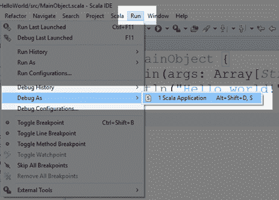

图 8:调试 Scala 应用程序

当你运行应用程序时，它会打印出一行“你好，世界！”到控制台。在 Scala Eclipse 中，控制台由屏幕下端的一个小窗口表示——参见图 9。

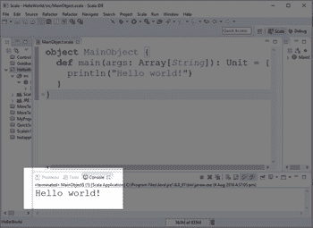

图 9:控制台

|  | 注意:在这本电子书中，我们将完全使用控制台，但是 Scala 拥有完整的 Java 库。您可以使用图形用户界面用 Java 创建应用程序，也可以使用 Java 图形用户界面类库在 Scala 中构建图形用户界面。我不会在这里讨论构建图形用户界面的细节，但我建议您参考 Java 简洁 2，其中我们将了解如何使用 Java 构建图形用户界面。 |

使用这里描述的方法运行一次 Scala 应用程序后，Scala Eclipse 将为您创建运行配置。当您的项目有运行配置时，您可以通过点击**调试**或**运行**来运行和调试应用程序，如图 10 所示。

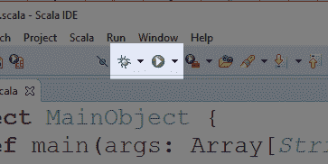

图 10:调试和运行按钮

可以通过点击**运行→调试配置**或**运行→运行配置**来更改调试和运行配置。单击这些选项将打开调试配置框，如图 11 所示。如果您需要为您的程序提供命令行参数(这将作为`main`方法的`args` `Array`参数传递)或者使用不同的 JRE 测试项目，您可以使用此框来完成。我们将在这本电子书中使用默认配置。

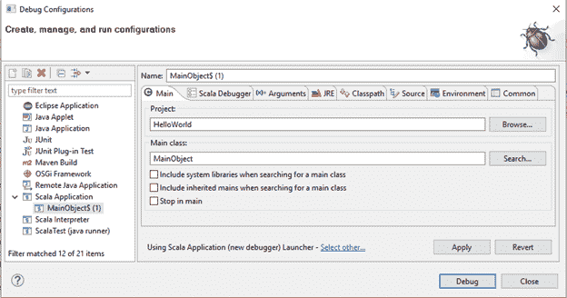

图 11:运行和调试配置框

最后，如果你的项目没有运行和打印“你好世界！”对于控制台，Eclipse 可能会显示一个错误框。如果是，它会询问您是否要继续启动。你应该回答**不**。如果您回答**是**，Eclipse 将运行已知工作的程序的最后一个版本，这对调试没有帮助。

当选择**否**时，点击屏幕下端的**问题**选项卡可以找到错误列表，如图 12 所示。

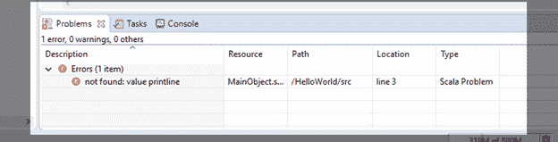

图 12:问题选项卡

|  | 注意:Eclipse Java 中的许多调试技术在 Eclipse Scala 中也是可用的。我将重点介绍 Java 和 Scala 之间的主要区别，这意味着我将不讨论调试的细节。如果你想了解更多关于调试机制和工具的知识，请参考 Java 简洁 1。 |