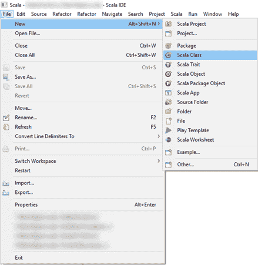
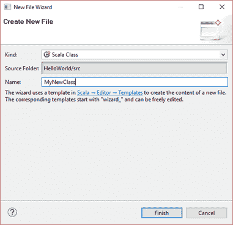
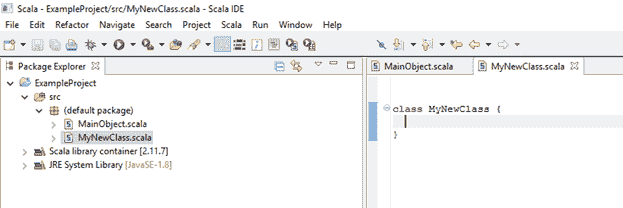

# 七、类和对象

Scala 是一种结合了功能和面向对象范例的语言。面向对象的机制被设计成允许我们创建称为类的可重用代码模块。类是数据和对数据进行操作的方法的集合。我们会看到类与我们一直使用的对象非常相似——例如`MainObject`。一个类和一个对象之间的主要区别是，一个类被设计成有多个从它创建的对象实例，而一个对象是它的类的唯一实例。

如果您不熟悉 Java 的面向对象编程机制，我强烈建议您阅读它们。Scala 是一种旨在解决 Java 语言的许多缺点的语言。面向对象编程就是定义我们自己的数据结构，以减少我们项目中的总代码量，并允许我们的项目具有可维护性和可伸缩性。

类是创建对象的蓝图。对象被称为类的实例。Scala 中所有的数据类型都是对象，包括**`Int`****`Double`**。当我们指定新的 **`var`** 或 **`val`** 时，我们使用的是对象。我们的对象的字段必须被初始化，与 Java 不同，在 Scala 中，我们不能用未初始化的字段创建对象。

面向对象编程允许我们将数据和对这些数据进行操作的函数结合起来。在 Java 语言中，这些被称为成员变量和成员方法。成员变量是属于对象的变量，成员方法是对象能够执行的函数。这些可以使用“ **`.`** ”操作符访问，如 **`someString.length`** 。或者，如果您有一个带有名为 **`height`** 的成员变量的对象，您可以使用 **`someClass.height`** 来访问该变量。

变量名用于指向对象。它们是对对象的引用。因此，一个对象，如数字 100，可能被许多变量引用。

我们可以将类添加到现有的文件中，但是如果类很复杂并且包含大量代码，有时最好将一个单独的代码文件添加到我们的项目中。我们将研究两种向项目中添加新类的方法——在第一种方法中，我们为类添加一个新文件。这使得我们类的代码与其他类分开，但这意味着我们的项目有多个文件。使用第二种方法，我们向现有文件添加新的类。在 Scala 中，我们可以为每个文件定义多个类。这样做的好处是最大限度地减少了我们项目中的文件数量，但是类都混合在一起，这有时会变得难以维护。作为一般的经验法则，如果一个类是其他类所需要的，或者如果一个类很复杂并且需要很多方法，那么这个类应该在一个单独的文件中定义。否则，如果类非常简单，并且只被我们项目中的另一个类使用，我们可能会在与现有类相同的文件中定义新类。

### 添加新类

#### 方法 1:添加一个新的类文件

要在项目中添加一个新的类文件，点击**文件>新建> Scala 类**，如图 17 所示。您也可以通过在包浏览器中右键单击项目并选择**新建> Scala 类**来添加新类。



图 17:添加新的类文件

您将看到新文件框，如图 18 所示。在此框中，您可以在提供的框中命名您的班级，然后单击**完成**。用大写字母来命名类是很常见的，因为这使得区分类名标识符和函数或变量标识符变得很容易。



图 18:添加新类步骤 2

Eclipse 将在您的项目中创建一个新文件，并用提供的名称编写一个新类的基本框架，如代码清单 65 所示。

代码清单 65:一个空白类

```scala
  class MyNewClass {
  }

```

在包资源管理器中，您会注意到我们现在有一个新文件被添加到 src 文件夹中(如图 19 所示)。我们可以通过双击新类的名称来编辑它的代码，从而在代码视图中打开代码。



图 19:包资源管理器中的类文件

#### 方法 2:向现有文件添加类

我们还可以将一个新类直接编码到任何现有的对象或类文件中。代码清单 66 假设我们没有在一个单独的文件中添加名为`MyNewClass`的类，并向我们展示了一个新程序的`MainObject`的基本代码文件，其中包含了在`MainObject`的代码之上定义的`MyNewClass`类的代码。

代码清单 66:在现有文件中定义一个类

```scala
  //
  Definition of a new class
  class MyNewClass {
  }

  //
  Definition of the MainObject
  object MainObject {

    def main(args: Array[String]): Unit = {
      println("All good?")
    }
  }

```

Scala 在定义新类方面相当灵活。代码清单 67 显示了在我们的`MainObject`文件中不同点定义的新类的三个例子。

代码清单 67:向现有文件添加类

```scala
  //
  Define a new class outside:
  class Class1 {
  }

  //
  Definition of the MainObject
  object MainObject {
    // Define a new class local to
  MainObject
    class Class2 {
    }

    def main(args: Array[String]): Unit = {
      // Define a new class local to
  MainObject.main
      class Class3 {
      }
    }
  }

```

代码清单 67 显示了三个类的声明，每个类都有不同的作用域。`Class1`是在`MainObject`对象的主体之外定义的，它具有程序范围(与将类添加到新文件中完全相同)。`Class2`被定义在`MainObject`物体的体内。这个类不能被外部类访问，但是它可以在`MainObject`中的任何方法中使用。`Class3`定义在`main`方法的主体内部。这意味着类不存在于`main`方法之外。

类的语法以关键字 **`class`** 开始，后面是类的名称和由 **`{`** 和 **`}`** 包围的代码块。代码清单 68 显示了无所事事类的基本框架。这是当我们向项目中添加一个新类时，Eclipse 将为我们编写的基本类，或者是定义一个新类所需编写的最小代码量。

|  | 注意:在 Java 中，类文件和其中的类应该共享同一个名称。然而，这种限制不是 Scala 的一部分，我们可以自由地为我们的类命名任何我们喜欢的东西(在合理的范围内)，并为每个文件定义多个类和对象。 |

代码清单 68:类的框架

```scala
  class ClassName {
    // Body
  of the class
  }

```

一个班级只是一个蓝图。它定义了由它构建的对象将具有哪些类型的变量和函数。当我们从类蓝图创建一个对象(实例化类)时，该对象被称为类的实例。为了实例化一个类，我们使用`new`关键字的方式类似于 Java。代码清单 69 显示了从名为`ClassName`的类创建实例的两个例子(该代码清单不完整，不会编译和运行)。

代码清单 69:从类创建实例

```scala
  // Two ways
  to create an instance from a class
  //
  called ClassName:

  //
  Shorthand method:
  var classInstance = new ClassName

  //
  Verbose method:
  var classInstance: ClassName = new
  ClassName

```

在代码清单 69 中，创建实例的第一种方法是指定`var`或`val`(取决于您想要更改变量还是创建常量对象)。接下来，我们为新对象使用一个标识符，在本例中为`classInstance`，我们将该标识符设置为等于`new` `ClassName`。这是创建实例的一种速记方法，看起来应该很熟悉。这与我们定义其他基本对象如`Int`、`Boolean`时完全一样。

第二种方法比第一种稍微详细一些。我们可以选择为新对象指定数据类型。在前面的例子中，这并不是特别有用，但是代码清单 70 显示了这个冗长方法的另一个例子，这次是使用继承。代码清单 70 定义了一个名为`myInstance`的`SomeChild`实例，但是数据类型是`SomeParent`。我们将很快更详细地研究继承。

代码清单 70:带有继承的详细方法示例

```scala
  //
  Define a parent class:
  class SomeParent {

  }

  //
  Define a child class:
  class SomeChild extends SomeParent {

  }

  //
  Definition of the MainObject
  object MainObject {
    def main(args: Array[String]): Unit = {

      // Define a SomeParent object,
  which is
      // presently an instance of
  SomeChild
      var myInstance: SomeParent = new SomeChild
    }
  }

```

代码清单 71 显示了一个包含几个字段的类的基本示例。清单还显示我们使用点语法访问字段。

代码清单 71:包含一些字段的基本类

```scala
  //
  Definition of the Atom class
  class Atom {
    // Three fields, or member
  variables:
    var electronCount: Int = 0
    var name: String = "Unknown"
    var symbol: String = "NoSymbol"
  }

  object MainObject {
    def main(args: Array[String]): Unit = {

      // Instantiate a new member of
  Atom class:
      val hydrogen = new Atom

      // Set the fields/member variables:
      hydrogen.electronCount = 1
      hydrogen.name = "Hydrogen"
      hydrogen.symbol = "H" 

      // Access the fields/member
  variables:
      println("Name: " + hydrogen.name +
  " (" +
  hydrogen.symbol + ")")
      println("Electrons: " + hydrogen.electronCount)
    }
  }

```

请注意，在代码清单 71 中，“`.`”表示“属于”字段，因此`hydrogen.symbol`表示属于`hydrogen` 对象的`symbol` 字段。类的每个实例都有自己的字段；例如，如果我们从`Atom`类`iron`创建第二个对象，字段`hydrogen.symbol`和`iron.symbol`将是两个不同的字段，它们不一定具有相同的值。

在 Scala 中，我们有抽象类，就像在 Java 中一样。与 Java 不同，Scala 有抽象变量。如果类定义中没有为类变量赋值，则该类必须标记为抽象类。方法也是如此。方法在 Scala 中可以是抽象的(或者没有定义)，任何有一个或多个抽象方法的类本身就是抽象的。在代码清单 71 中，所有变量在`Atom`类中都被赋予了默认值。还要注意，变量在默认情况下是公共的，这意味着它们可以在主方法内部访问，而无需将它们标记为公共的(而在 Java 中，类的所有成员在默认情况下都是私有的)。稍后我们将更详细地了解抽象类，但这是我将`Atom`类的每个成员都设置为默认值`0`、`Unknown`和`NoSymbol`的原因。

作为第二个例子，代码清单 72 显示了一个基本的`Box`类。这个类由两个字段组成，`sideLen1`和`sideLen2`，我们将使用它们来定义一个大小为`sideLen1*sideLen2`的盒子。我们将通过添加一些成员方法来扩展这个类。

代码清单 72:基本盒子类

```scala
  class Box {
    var sideLen1: Int = 0
    var sideLen2: Int = 0
  }

```

#### 面向对象编程中的 var 与 var

值得指出的是`val`与`var`机制的一个特别详细的细微差别。如果我们有一个引用某个对象的`val`，并且该类有标记为`var`的字段，那么即使对象本身是不可变的，我们也可以更改该对象的字段。`val`表示对象本身的赋值是不可变的——它不引用对象的成员字段(可能是也可能不是`val`本身)。代码清单 73 显示了这个行为的一个例子。

代码清单 73:值与变量和对象

```scala
  class Box {
    var sideLen1: Int = 0
    var sideLen2: Int = 0
  }

  object MainObject {
    def main(args: Array[String]): Unit = {
      // Define a new val: 
      val immutableBox = new Box

      // Define a new var:
      var mutableBox = new Box

      // Set the fields of mutableBox
      mutableBox.sideLen1 = 12
      mutableBox.sideLen2 = 13

      // Set the fields of the
  immutableBox
      immutableBox.sideLen1 = 23
      immutableBox.sideLen2 = 14

      // Set the mutableBox to point to
  another Box.
      // This is fine because mutableBox
  is var:
      mutableBox = immutableBox

      // But the following illegal, we
  cannot reassign the
      // immutableBox, because it is val!
      immutableBox = mutableBox
     }
  }

```

请注意，在代码清单 73 中，我们可以更改名为`immutableBox`的对象的字段，即使该对象是`val`。但是我们不能将对象重新分配给另一个`Box`(这种重新分配由最后一行说明，我用红色突出显示，因为它是非法的)。当我们在项目中使用术语时，理解`val`和`var`指的是什么是非常重要的。

### 私人修饰词

当我们在一个类中声明一个字段时，我们可以将其标记为`private`。这可以防止任何外部对象与该字段交互。在 Scala 中，没有修饰符的成员被认为是公共的，因此外部对象可以与字段交互。在面向对象编程中，建议我们隐藏类工作方式的细节，因为这样可以灵活地改变类的工作方式，而不必担心其他对象直接访问字段。

代码清单 74 显示了我们的`Box`类的代码，但是现在`sideLen1`和`sideLen2`字段已经被标记为`private` (用黄色突出显示)。请注意，我们无法从`main`方法设置`sideLen1`字段，因为`MainObject`对象不是`Box`类的一部分，字段是`private`。所以`main`方法的最后一行是不合法的，我已经用红色突出显示了。

代码清单 74:私有字段

```scala
  class Box {
    private var sideLen1: Int = 0
    private var sideLen2: Int = 0
  }

  object MainObject {
    def main(args: Array[String]): Unit = {

      // Create an instance from the box
  class:
      var myBox = new Box

      // It is no longer legal to access
  the sideLen1
      // or sideLen2 fields outside the
  Box class.
      // The following line is illegal!
      myBox.sideLen1 = 100
     }
  }

```

### 成员方法

成员方法是类的实例能够执行的功能。当我们为一个类定义成员方法时，我们访问该类的所有私有字段。为了给类增加一个成员方法，我们使用`def`在类体内部定义一个方法。我们已经见过很多次了，尤其是当`main`方法是我们为`MainObject`对象定义的方法时。

代码清单 75:基本成员方法

```scala
  class Box {
    private var sideLen1: Int = 0
    private var sideLen2: Int = 0

    // Member method called area:
    def area(): Int = {
      return sideLen1 * sideLen2
    }

    // Member method called perimeter:
    def perimeter: Int = { // No params, brackets are
  optional
      2*(sideLen1 +
  sideLen2) // Implicit return
    }
  }

```

|  | 注意:当我们在方法中使用参数时，从方法的角度来看是`val`，所以不能更改。这意味着，即使从方法体中将`var`传递给方法，该值也是不可变的。换句话说，Scala 不支持 C# 样式输出或引用参数。 |

|  | 注意:函数中的返回语句是不需要的。函数返回或计算最后一个计算值。在 Scala 中，典型的情况是，我们试图编写函数，以便只有一行返回结果。这意味着我们倾向于确保 Scala 函数评估为单个返回语句，并且经常不使用 return 关键字。 |

代码清单 75 显示了我们的`Box`类的两个示例方法。方法`area`返回`Int`，不取参数。同样，方法`perimeter`不带参数，返回`Int`。当函数没有参数时，我们可以省略参数括号，如`perimeter`方法。

如果一个函数只有一条语句，我们也可以省略代码块。这意味着`Box`类的`area`函数可以写成下面一行代码(周长方法也可以是一行):`def area(): Int = sideLen1 * sideLen2` `.`

如果一个方法返回`Unit`，即没有返回值，我们可以用与 Java 类似的方式使用括号，将`Unit`的返回类型全部省略。代码清单 76 显示了一个我们可以添加到我们的`Box`类中的新方法。这个方法打印出`sideLen1`和`sideLen2`字段，但是不返回任何东西，我省略了`Unit`的返回类型。

代码清单 76:单元是可选的

```scala
  def printMe() {
    println("Box Sides: " + sideLen1 + " " +
        sideLen2)
  }

```

### 构造器

构造函数是一种特殊的成员方法，我们在使用`new`运算符时会调用它。在 Scala 中，类的构造函数是通过在类的声明中指定参数列表来定义的。代码清单 77 展示了我们的`Box`类的一个例子，它包含一个接受两个整数`side1`和`side2`的构造函数。我们将成员字段`sideLen1`和`sideLen2`设置为传递的参数。然后，在主方法中，当我们使用`new`操作符创建类的实例时，我们可以将长度作为参数传递。

代码清单 77:构造函数

```scala
  // Box
  class with constructor:
  class Box(side1: Int, side2: Int) {

    // Set the member fields to the
  values
    // passed as paramaters:
    private var sideLen1: Int = side1
    private var sideLen2: Int = side2

  }

  object MainObject {
     def main(args: Array[String]): Unit = {

       // Call the Box constructor and
  pass parameters:
       var myBox: Box = new Box(10, 12)     

     }
  }

```

为了定义多个构造函数，我们使用`this`关键字重载构造函数。这对于定义采用不同参数列表的几个构造函数非常有用。代码清单 78 显示了我们的`Box`类的一个例子，它有三个不同的构造函数。

代码清单 78:定义多个构造函数

```scala
  //
  Class with 3 constructors:
  class Box(side1: Int, side2: Int) {

    private var sideLen1: Int = 0
    private var sideLen2: Int = 0

    def this() {
      this(-1,
  -1)  // Call main constructor with -1
    }

    // This constructor takes one
  parameter,
    // it sets both sideLen fields to
  the
    // same value:
    def this(side: Int) {
      this    // Call the constructor which takes no arguments

      // After we have called any fully
  defined constructor
      // inside the body of a new
  constructor, we are free to
      // reassign the values of the
  fields:
      sideLen1 = side
      sideLen2 = side
    }
  }

  object MainObject {
     def main(args: Array[String]): Unit = {

       // Create a box by calling the
  main constructor:
       var box1 = new Box(10, 10)

       // Create some boxes by calling
  the parameter-less constructor
       var box2 = new Box
       var box3 = new Box()

       // Create a box by calling the
  constructor which takes one
       // parameter:
       var box4 = new Box(100)
     }
  }

```

请注意，在代码清单 78 中，附加构造函数中的第一件事是调用其他一些完全定义的构造函数。我们的类的主构造函数用类声明定义为需要两个`Int`参数。这意味着当我们定义新的构造函数时，它们必须以某种方式提供对这个主构造函数的调用。我们可以直接调用主构造函数，例如`this(-1, -1)`，也可以调用其他一些构造函数，这些构造函数反过来调用主构造函数，例如第三个构造函数中的`this`。请注意，第三个构造函数调用无参数构造函数，无参数构造函数又调用主构造函数。

|  | 注意:函数重载是一种我们创建多个同名函数的技术。我们可以有任意多的同名函数，但是这些函数必须有唯一的参数列表。 |

|  | 注意:在不同的范围内，我们可以有两个或更多同名的字段。这与 Java 中的相同，但是在 Scala 中，我们也可以在嵌套的作用域中定义两个或多个同名的变量。内部变量被称为隐藏外部变量，因为在外部范围中定义的变量在内部变量超出范围之前是不可用的。 |

|  | 注意:Scala 没有静态成员变量。然而，我们可以创建单例对象——这些对象是从只有实例的类中构建的。单件只是 Scala 对象。我们可以像在程序中添加对象一样，添加任意数量的对象。单例在各方面都与类相似——除了我们没有实例化它们，因为它们已经代表了单例的唯一实例。 |

|  | 除了允许单例对象，在 Scala 中我们还可以创建伴随对象。伴随对象是一个与类同名的对象，并且定义在与该类相同的文件中。伴随对象的使用方式类似于 Java 中的静态成员方法和字段。 |

在继承方面，Scala 提供了类似于 Java 的机制。我们可以创建一个包含函数和字段的父类，然后从这个父类继承到一个更具体的子类。代码清单 79 显示了一个继承的例子。为了从父类继承，我们使用`extends`关键字。

代码清单 79:继承

```scala
  // Main
  parent class:
  class GameObject(objName: String, xPos: Int, yPos: Int) {

    val name = objName

  var x = xPos

  var y = yPos

  def print {
       println("Name: " + name + " Pos: " + x
  + "x" + y)
    }
  }

  //
  PointObject class is a child class inheriting from
  //
  GameObject, but it adds a score, which is the amount
  // of
  points the player receives for collecting the object.
  class PointsObject(objName: String, xPos: Int, yPos: Int, scoreValue:
  Int)
    extends GameObject(objName, xPos, yPos) {

    // Define an extra field to record
  the score
    // this object is worth:
    var
  score: Int = scoreValue 

  }

  //
  Another example class, the MoveableObject also inherits from the
  //
  GameObject parent, but it defines several methods for moving
  //
  around.
  class MoveableObject(objName: String, xPos: Int, yPos: Int)
    extends GameObject(objName, xPos, yPos) {

    def moveUp = y = y
  - 1
    def moveDown = y = y
  + 1
    def moveLeft = x = x
  - 1
    def moveRight = x = x
  + 1
  }

  // We
  can also inherit from other child classes:
  class Player extends MoveableObject("Player", 100, 100) {

  }

  object MainObject {

    def main(args: Array[String]): Unit = {

      // Create a GameObject:
      val gameObject = new GameObject("Some generic object", 54, 123)

      // Create a Points object:
      val pointsObject = new PointsObject("Coin", 65, 18, 500)

      // Create a Player object:
      val player: Player = new
  Player

      // All objects inherit from the
  GameObject class, so
      // we can call any methods from
  that class or access any
      // public member fields:
      player.print
      pointsObject.x
  = 90

      // In addition, the pointsObject
  has a score field, and
      // the player has several extra
  methods defined for moving
      // which it inherited from the MoveableObject
  parent:
      pointsObject.score = 1000

      player.moveUp
      player.moveLeft
      player.moveLeft

      player.print
    }
  }

```


图 20:代码清单 79 的继承层次结构

图 20 展示了代码清单 79 定义的层次结构。主要家长是`GameObject`班。`PointsObject`和`MoveableObject`类都继承自该父类。这意味着他们可以从父节点访问`x`和`y`整数，也可以访问`print`方法。`Player` 类继承自`MoveableObject`类，因此它继承了`MoveableObject`父类的`x`和`y`以及为`MoveableObject`类定义的附加方法。在这个例子中，`Player` 类没有指定任何额外的字段或方法，但是它可以。

请注意，在代码清单 79 中，当我们指定新类扩展现有类时，我们必须调用父类的构造函数`class Player extends MoveableObject("Player", 100, 100)`。这意味着`Player` 类可以访问父类的所有公共成员，我们应该用参数的值`"Player", 100, 100` 调用父类的构造函数。

我们可以像在 Java 中一样，使用`super`关键字访问父方法和字段。所以，从`Player`类的本体中，我们可以通过调用`super.moveUp`来访问`moveUp`方法。

### 抽象类

我将简要解释什么是抽象类以及它们是如何在 Scala 中定义的，但是如果您还不熟悉其他面向对象语言(C++、Java、C# 等)。)，我强烈建议你至少熟悉其中一个。面向对象编程涉及很多技术，这本电子书必须只关注 Scala 以及它与其他语言的不同之处。

抽象类是不能实例化的类。它可以用作父类，子类可以为父类的抽象部分定义含义。例如，我们可以用`computePerimiter`和`computeArea`方法创建一个泛型`Shape`类，但是泛型父类本身并没有定义这些方法。然后我们可以从父类继承一个子类，比如`Circle`和`Square`，在这个子类中我们定义了父类的函数体。

代码清单 80:抽象类

```scala
  abstract class Shape {

    // Define an abstract field
    type id  

    // Define some abstract methods
    def computeArea: Float
    def computePerimeter: Float
  }

  //
  Define a Child Class
  class Circle(radius: Float) extends Shape {
    var id: Int = 0

    def computeArea: Float = {
      return 3.14159265359f * radius * radius 
    }

    def computePerimeter: Float = {
      return 2
  * 3.14159265359f * radius
    }
  }

  object MainObject {

    def main(args: Array[String]): Unit = {

      var circle: Circle = new
  Circle(6)

      println("Area of Circle: " +
  circle.computeArea)
    }
  }

```

代码清单 80 显示了一个名为`Shape`的抽象父类。该类包含一个名为`id`的未定义字段，使用`type`关键字和两个抽象方法— `computeArea`和`computePerimiter`。请注意，该类标记为`abstract`。当我们从这个父类扩展时，我们必须在子类中定义所有这些抽象元素，否则子类本身必须被标记为抽象的。`Circle`类继承自`Shape`类，并为父类的每个抽象元素提供一个定义。这意味着`Circle`不是`abstract`，我们可以根据它创建一个实例，如代码清单 80 的`main`方法所示。

|  | 注意:Scala 还提供了一种类似于 Java 接口的机制，称为特征。感兴趣的读者应该在 Scala 文档中查找特征。在 http://docs.scala-lang.org/tutorials/tour/traits.查找更多信息 |