# 三、QnA 机器人

## 快速介绍

到目前为止，我们已经探索了如何创建一个基于正则表达式的基本 Skype bot，然后使用 LUIS 为它添加自然语言处理功能——这确实给了我们的 bot 一些不错的超能力，并简化了路由用户请求的过程。

但是如果我们想根据一系列的问题和答案来建造一个机器人呢？来自微软的 [QnA Maker 服务](http://qnamaker.ai/)与 LUIS 一样，是认知服务套件的一部分，它允许我们基于常见问题 URL 或结构化问答列表快速构建、训练和发布问答机器人。

就像 LUIS 一样，QnA Maker 服务公开了可以被用 bot 框架构建的 Bot 应用程序使用的端点，比如我们的 Skype bot。

即使有了 LUIS，制作一个流畅的对话机器人也不容易。创建一个会话流畅的机器人需要输入大量的意图、实体和话语，这些都需要在代码中通过对话框和特定的 FormFlow 逻辑来跟进。这逐渐形成了复杂性。

尽管机器人应用程序可以为任何感兴趣的特定主题开发——比如检查机票的可用性，或者在线商店的助手——但许多人倾向于将机器人视为自动应答代理。本质上，你问一个问题，期待一个答案。

QnA Maker 服务将这一过程提升到了一个新的水平，因为它通过构建在 LUIS 之上，从我们身上抽象出了一层额外的复杂性。这使我们能够基于获取知识库并将其转换为常见问题网址或文档中的成对问题和答案的概念来创建机器人。

通过能够自动提取问题和答案(QnA)对，并使用 LUIS 从这些对中推断出各种话语，QnA 制造者服务使得创建充当回答代理的机器人变得容易。

这听起来非常令人兴奋——正如您将很快看到的，这比您想象的要容易。

## 创建知识库

创建 QnA bot 的第一步是创建一个知识库，它只不过是一个问答列表。

创建一个知识库就像将工具指向一个现有的来源并获取 QnA 内容一样简单。

QnA Maker 能够从大多数常见问题网址和文档中自动提取 QnA 对。如果它不能自动提取，它可以选择手动添加和编辑 QnA 对。所以，让我们试一试。

使用您的微软账户，进入 [QnA Maker](https://qnamaker.ai/) 网站，点击**登录**。

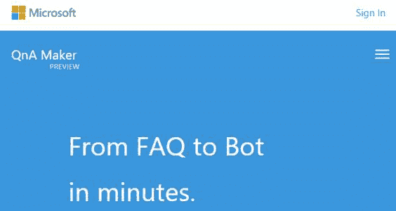

图 3-a: QnA 制造商网站

一旦您提供了您的凭据，您可能会被要求确认 QnA Maker 是否可以访问您的一些微软帐户配置文件详细信息。出现提示时，点击**是**继续。

鉴于 QnA Maker 是根据认知服务条款提供的，在撰写时免费预览提供了每分钟最多 10 笔交易(每月 10K 交易)，因此您可能需要同意这些服务条款才能继续。

接下来，点击**创建新服务**选项。我们将创建一个机器人来回答与[知识共享空间](https://creativecommons.org/faq/)相关的问题；但是，您可以选择使用完全不同的 FAQ 网站或上传自己的内容。

出现提示时，在**服务名称**字段中输入一个名称，在**常见问题解答网址**字段中输入一个网址，如下所示:

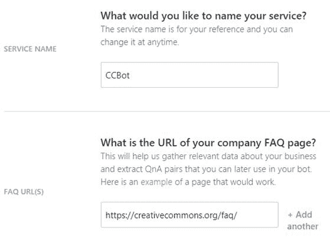

图 3-b:新的合格中介机构服务

还有一个选项可以手动上传一个必须包含 QnA 对的文档——如果没有提供 URL 的话。在写的时候，QnA 可以消耗。tsv，。txt，。docx 和。pdf 文件。

QnA Maker 服务将做的是抓取内容——无论是提供的网址还是文档——创建一个知识库，作为我们机器人的大脑。可以在以下步骤中编辑已爬网的信息。

要创建知识库，点击**创建**。QnA Maker 爬虫将索引所提供的信息，并几乎立即提供它能够识别的问题和答案的列表，该列表应该类似于下图。

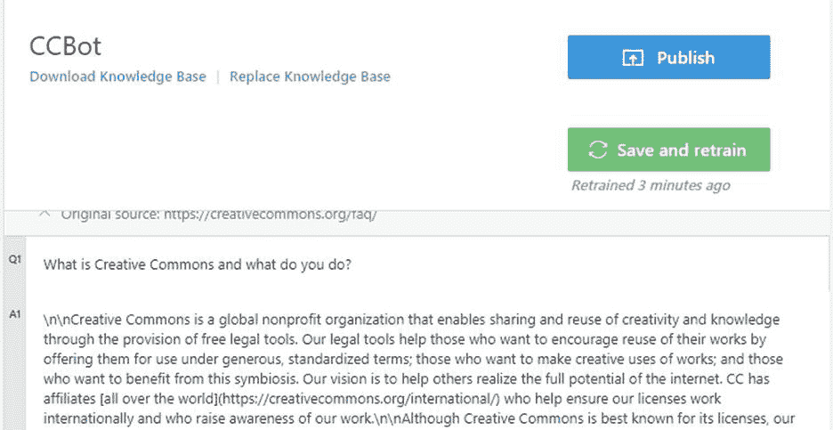

图 3-c:质量保证服务结果

如果您向下滚动结果，您将看到 QnA Maker 服务能够在相对较短的时间内抓取、识别并成功解析的所有 QnA 对。相当令人印象深刻。

请注意，在这个例子中，提取的答案包含一些标记。在我们单击**发布**之前，可以浏览每个答案，并手动编辑和删除这些标记条目。然而，这可能是一个漫长、乏味和耗时的过程——尤其是在有很多答案的情况下，就像在这种情况下。

因此，我们要做的是保持内容不变，删除标记，以防我们需要通过代码。大多数对话平台能够自动解析标记，所以这应该不是问题。

如果还有什么需要手动添加的，可以在这个阶段进行。发布前需要点击**保存并重新训练**按钮。点击**发布**后，会出现以下信息。

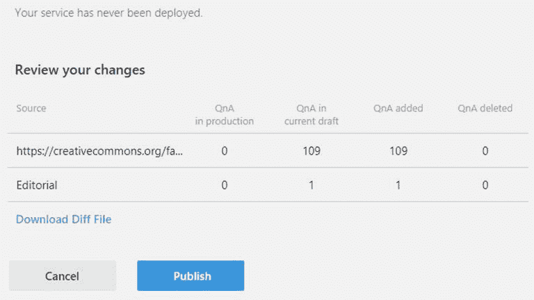

图 3-d:质量保证服务结果摘要

要完成这些 QnA 对的发布，请单击**发布**。您将看到一个类似于图 3-e 的屏幕

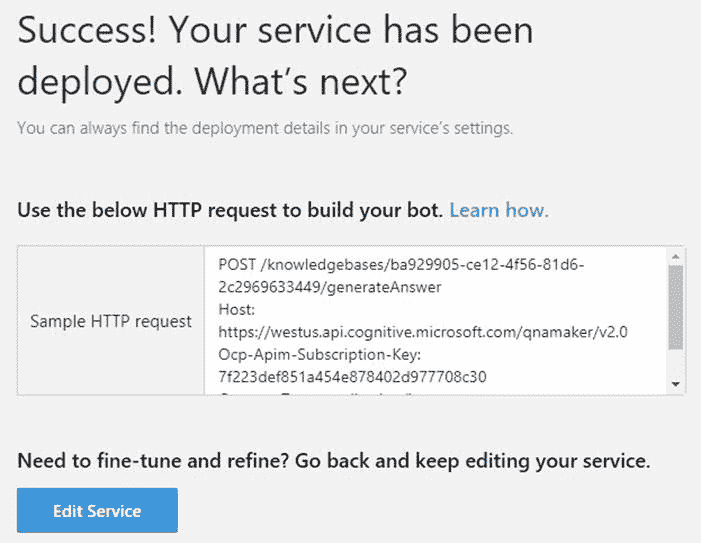

图 3-e:部署的质量保证服务结果

我们现在有了一个 QnA 服务，可以用来创建一个知识共享机器人。

我们也可以在**我的服务**选项下找到这个服务，如下图所示。

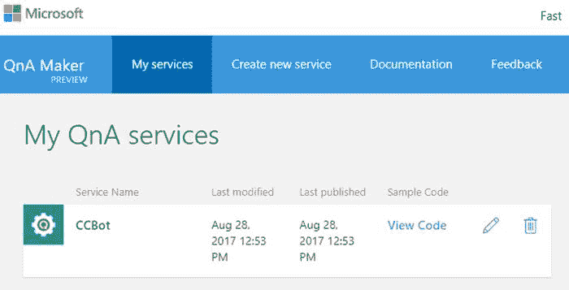

图 3-f:合格中介机构服务列表

## QnA 制造商对话框

现在我们已经准备好了一个知识库，可以用来创建我们的机器人，我们需要将注意力转移到编写一些代码上。

QnA Maker 对话框是 NuGet 上可用的库，它充当 QnA Maker 服务端点的包装器。使用 QnA Maker Dialog 库要容易得多，而不是通过发布的 HTTP 端点直接与我们的 QnA 服务通信。

打开 Visual Studio，使用以前安装的机器人模板创建一个新的机器人应用程序。让我们命名这个新的机器人应用程序 **CCBot** (使用图 1-a 中描述的相同步骤)。

项目创建完成后，转到**解决方案资源管理器**，右键单击**参考**，然后选择**管理 NuGet 包**。

一旦 NuGet 包管理器窗口打开，点击**恢复**恢复 Visual Studio 项目中丢失的所有 NuGet 包。

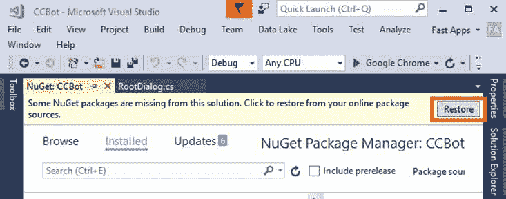

图 3-g:获取中的恢复按钮

一旦恢复了所有丢失的包，在搜索框中输入**QnA**—您可能需要再次打开“获取包管理器”窗口，因为当恢复丢失的包时，它可能已经关闭了。选择加里·普莱特的 **QnAMakerDialog** 。

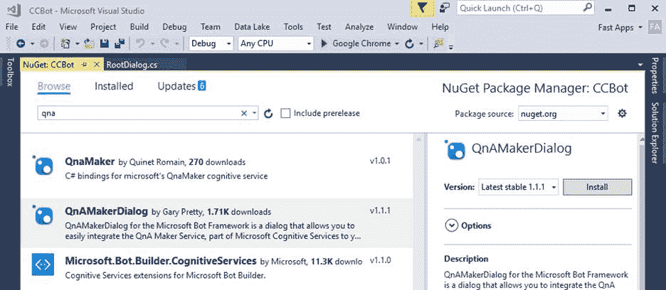

图 3-h:QnAMakerDialog 包

一旦安装了包，构建项目并添加任何缺少的引用。对于这个例子，我们将在 *RootDialog.cs* 文件中编写代码。

所以，让我们打开 *RootDialog.cs* ，以便对使用这个库进行必要的调整。删除开箱即用的代码，并替换为以下代码。

代码清单 3-a:新的根对话类

```cs
  using System;
  using System.Threading.Tasks;
  using Microsoft.Bot.Builder.Dialogs;
  using QnAMakerDialog;

  namespace CCBot.Dialogs
  {
      [Serializable]
      [QnAMakerService("SUBSCRIPTION_KEY", "KNOWLEDGE_BASE_ID")]
      public class RootDialog : QnAMakerDialog<object>
      {
          public override async Task NoMatchHandler(
              IDialogContext context, string originalQueryText)
          {
              await context.PostAsync(
              $"Couldn't find an answer for
  '{originalQueryText}'.");

  context.Wait(MessageReceived);
          }

          [QnAMakerResponseHandler(50)]
          public async Task LowScoreHandler(IDialogContext context, string 

  originalQueryText, QnAMakerResult result)
          {
              await context.PostAsync(
              $"Found an answer that could
  help...{result.Answer}.");

  context.Wait(MessageReceived);
          }
      }
  }

```

让我们试着了解这里发生了什么。这个新的`RootDialog`类现在继承自`QnAMakerDialog<object>`。

QnA Maker Dialog 库允许我们接收来自机器人的传入文本消息，将其发送到已发布的 QnA Maker 服务，并将服务发回的答案作为回复发送给机器人。它基本上充当了 QnA 服务端点的包装器，以及 bot 和知识库之间的桥梁。

当知识库中找不到匹配答案时，执行`NoMatchHandler`方法。这可以被覆盖(正如我们在代码清单 3-a 中所做的)，以便发送我们自己定制的消息。

虽然默认实现对于大多数开发人员来说已经足够好了，但是也可以通过定义一个自定义处理程序并用`QnAMakerResponseHandler`属性修饰它来提供一种稍微强大的处理方式，指示处理程序应该响应的最大分数。

代码清单 3-a 包含一个自定义处理程序，当置信度得分低于 50 时执行——这就是`LowScoreHandler`方法的作用。我们可以根据需要添加任意多的自定义处理程序。任何高于 50 分的分数都将以默认方式处理，由 QnA 服务确定的适当响应将返回给用户。

这就是它的全部。我们只需要做一件事——添加订阅密钥和知识库标识符。

我们可以通过点击**查看代码**链接找到两者，如图 3-f 所示，一旦你点击**查看代码**，你会看到类似这样的内容。

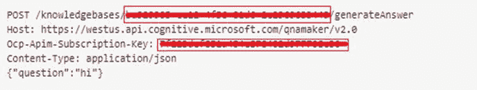

图 3-I:QnA HTTP 请求示例

突出显示的第一个框对应于知识库标识符，第二个框对应于订阅密钥。将它们复制到前面的代码列表中，并替换每个相应的占位符。

让我们构建我们的 Visual Studio 项目，运行它，然后打开模拟器进行测试。知识共享常见问题页面上的第二个问题是关于版权的，如下图所示。

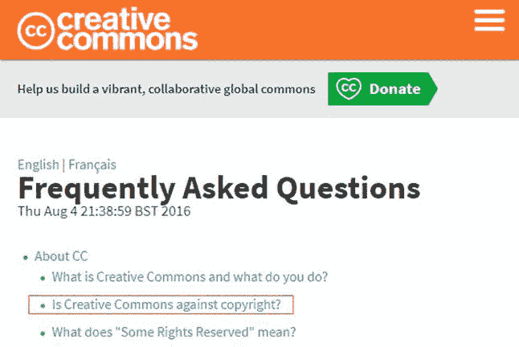

图 3-j:知识共享常见问题页面

让我们输入一个使用“版权”这个词(或者这个词本身)的问题，看看 QnA Maker Dialog 通过机器人返回什么结果作为响应。

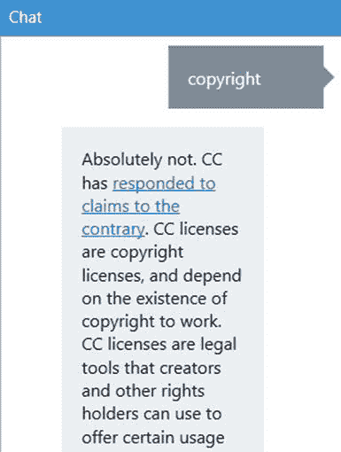

图 3-k:使用 QnA 服务测试机器人

正如我们所看到的，QnA 服务能够返回实际上对应于图 3-j 中突出显示的问题的答案

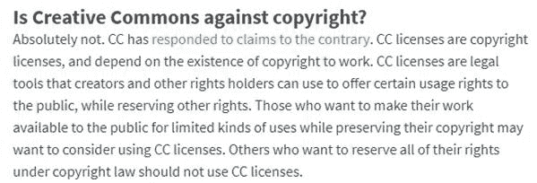

图 3-1:用机器人测试的问题的回答

这有多酷？几乎没有任何代码，我们设法创建了一个机器人，它从知识共享常见问题中获取数据，并创建了一个知识库，可以通过使用机器人的对话进行查询。

假设我们想知道 Creative Common 用它的钱做了什么。让我们试试这个例子，看看我们是否得到正确的结果。

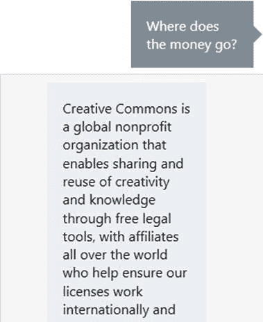

图 3-m:使用 QnA 服务的另一个机器人测试

现在让我们看看常见问题网站，看看机器人的回答是否与网站上的答案相匹配。

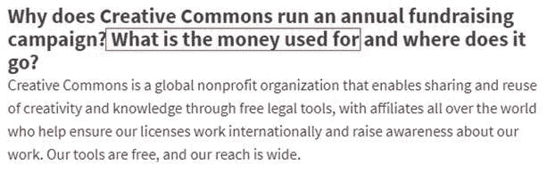

图 3-n:用机器人测试的问题的回答

我们可以看到，QnA 服务已经能够返回正确的答案，因为它能够推断出问题*钱去哪里了？*其实和*是一样的东西，钱是用来干嘛的，去哪了？*—这本身就是一个更大问题的一部分。

## 总结

我们可以开始意识到，QnA 服务确实让 LUIS 向前迈进了几步，并为我们抽象出了更多的复杂性，使得基于知识库创建会话代理变得简单易行，而且几乎不需要任何代码。在我看来，这是一个相当了不起的壮举。

像任何事情一样，总是有可能改进事情并添加额外的逻辑，这可以使这个 bot 应用程序更加健壮，并能够处理更多的场景。然而，这个简单的例子足以证明这项技术已经取得了多大的进展，以及创建这样一个解决方案有多容易。

最后，我必须指出，事实上，微软对 QnA 服务的营销口号可能是我读过的最准确的口号之一:“几分钟内从常见问题到 Bot。”

在下一章中，我们将探索如何通过使用 Scorables 进行全局消息处理和在需要时中断对话框来将这个例子提升到下一个层次。这是一项伟大的技术，可以让我们在设计 Skype 对话解决方案时获得很大的灵活性。

本章的完整源代码可以在[这里](https://1drv.ms/u/s!AgBX7xIEoO8BkPMFzIHhjZGWj_wsqQ)找到。