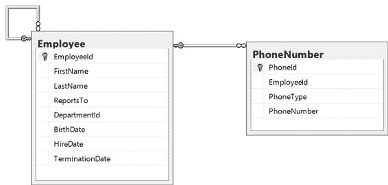
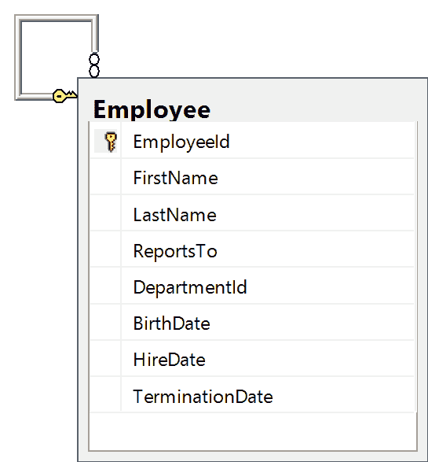

# 五、来自你自己的选择

在第 2 章中，我们逐步介绍了连接不同表的各种选项。我们研究了内部连接、外部连接和交叉连接的不同之处。在本章中，我们将研究将表连接到它们自己。

有时使用规范化的数据模型，您会发现需要多次连接一个表才能获得完整的细节。让我们扩展`Employee`模型来跟踪多个电话号码。为您想要跟踪的每种电话号码添加新列是没有意义的。相反，我们将添加一个新表，该表将为我们想要跟踪的每个电话号码都有一个单独的记录。这简化了添加新类型的电话号码，但查询以获取所有电话号码可能会更复杂一些。



图 5-1:员工及其电话号码的数据模型

这个数据模型是一个很好的设计，并且被普遍实现，但也不是没有问题。我们最初尝试检索所有员工的家庭电话号码可能如下所示:

代码清单 5-1:雇员和电话号码之间的初始连接

```sql
  SELECT  Employee.EmployeeId
  ,

  FirstName ,

  LastName ,

  PhoneType ,

  PhoneNumber
  FROM    dbo.Employee
          JOIN dbo.PhoneNumber
  ON PhoneNumber.EmployeeId
  = Employee.EmployeeId
  WHERE   PhoneType = 4
  ORDER BY LastName ,

  FirstName

```

浏览结果集，我们可以很快看到这个查询的问题。作为一个内部成员，没有家庭电话的员工会失踪。另一个问题是，这个数据模型允许多个家庭电话号码。

|  | 提示:为了确保员工没有重复的电话类型，您可以在员工标识、电话类型组合上添加唯一的约束。但是，如果您已经有许多副本，这可能不是一个选项。 |

解决第一个问题很简单:将内部连接转换为外部连接。

代码清单 5-2:雇员和电话号码表之间的外部连接

```sql
  SELECT  Employee.EmployeeId
  ,

  FirstName ,

  LastName ,

  PhoneType ,

  PhoneNumber
  FROM    dbo.Employee
          LEFT OUTER JOIN dbo.PhoneNumber

  ON PhoneNumber.EmployeeId =
  Employee.EmployeeId

  AND PhoneType =
  4
  ORDER BY LastName ,

  FirstName

```

|  | 注意:我们还必须将 PhoneType 检查从 WHERE 子句移到 JOIN 子句，以便将其作为外部连接条件包含在内。 |

消除多余的电话号码更具挑战性。我们希望每张`EmployeeId`都有一张唱片。这就是`TOP`表达式有用的地方。通过这个表达式，我们可以明确指定在结果集中应该返回多少条记录。我们希望确保从`PhoneNumber`表中只提取一条匹配记录。

为此，我们需要一个相关的子查询。这意味着子查询将引用外部查询中包含的数据。这也意味着子查询将对包含查询的每条记录执行一次。否则`TOP`表达式就没有意义，并且总是只返回一行。这也意味着我们需要一种新类型的`JOIN`逻辑来连接到这个子查询。

代码清单 5-3:用交叉应用连接雇员和电话号码表

```sql
  SELECT  Employee.EmployeeId
  ,

  FirstName ,

  LastName ,
          PhoneType
  ,

  PhoneNumber
  FROM    dbo.Employee
          CROSS  APPLY ( SELECT TOP 1

  PhoneNumber ,

  PhoneType ,

  EmployeeId

  FROM      dbo.PhoneNumber

  WHERE     PhoneType =
  4

  AND EmployeeId =
  Employee.EmployeeId )
  p
  ORDER BY EmployeeId;

```

|  | 注意:每当您有像代码清单 5-3 中的子查询时，您必须给它一个别名，以便您可以在查询的其他地方引用它。在这种情况下，您以后不必引用它，但您仍然必须提供一个别名；在这种情况下，p。 |

`CROSS APPLY`类似于我们之前用来创建笛卡尔乘积的`CROSS JOIN`，除了我们知道我们在第二个表中只有一条记录。这也不是我们想要的，因为任何没有`PhoneNumber`的`Employee`记录都将被排除在列表之外。幸运的是，`CROSS APPLY`有一个名为`OUTER APPLY`的伙伴操作，它允许我们显示除了相关子查询中丢失数据的记录之外的所有记录。就像外部联接一样，丢失的数据将被替换为空值或指定为该列默认值的任何值。

所以我们最后的查询是获得`Employee`记录以及相关联的家庭成员，如果他们有一个的话，是:

代码清单 5-4:用外部应用程序连接雇员和电话号码表

```sql
  SELECT  Employee.EmployeeId
  ,

  FirstName ,

  LastName ,

  PhoneType ,

  PhoneNumber
  FROM    dbo.Employee
          OUTER   APPLY ( SELECT TOP 1

  PhoneNumber ,

  PhoneType ,

  EmployeeId

  FROM      dbo.PhoneNumber

  WHERE     PhoneType =
  4

  AND EmployeeId =
  Employee.EmployeeId )
  p
  ORDER BY EmployeeId;

```

还不错，但是需要显示一条`Employee`记录以及任何家庭电话号码信息的查询可能还需要包括其他电话号码，例如手机、办公室电话、传真号码等。为这些类型中的每一种添加一个相关的子查询将增加最终查询的复杂性，并使其更难执行。

这是可以使用表值函数的地方。表值函数允许我们创建参数化视图或公共表表达式，并返回一个结果集，在这种情况下，返回一条记录。这意味着它可以在任何可以使用表的地方使用，包括作为相关子查询。

|  | 注意:即使我们的表值函数将返回一条记录，它仍然返回一个结果集。 |

我们的表值函数很容易定义，因为它看起来很像我们的相关子查询:

代码清单 5-5:定义表值函数

```sql
  CREATE FUNCTION
  EmployeePhoneNumberByType

  (

  @EmployeeId INT ,

  @PhoneType INT
      )
  RETURNS TABLE
  AS
  RETURN
      SELECT  TOP 1

  PhoneId ,

  EmployeeId ,

  PhoneType ,

  PhoneNumber
      FROM    dbo.PhoneNumber
      WHERE   EmployeeId =
  @EmployeeId
              AND PhoneType =
  @PhoneType;

```

它也很容易使用:

代码清单 5-6:使用表值函数

```sql
  SELECT  Employee.EmployeeId
  ,

  FirstName ,

  LastName ,
          Home.PhoneNumber AS
  Home,
              Office.PhoneNumber AS
  Office,
              cell.PhoneNumber AS
  Cell,
              fax.PhoneNumber AS Fax
  FROM    dbo.Employee
          OUTER APPLY dbo.EmployeePhoneNumberByType(Employee.EmployeeId, 4) AS Home
          OUTER APPLY dbo.EmployeePhoneNumberByType(Employee.EmployeeId, 1) AS Office

  OUTER APPLY
  dbo.EmployeePhoneNumberByType(Employee.EmployeeId, 2) AS Cell

  OUTER APPLY
  dbo.EmployeePhoneNumberByType(Employee.EmployeeId, 3) AS Fax
  ORDER BY EmployeeId;

```

根据数据库中的数据量，此时您可能会发现这种方法有问题。

|  | 注意:因为我们在四个单独的 OUTER APPLY 语句中调用这个表值函数，所以对于返回的每个记录，我们都要调用四次。随着记录数量的增长，这可能会变得非常昂贵。 |

如果您没有导致这种性能问题的数据量，那么这个查询可能是您所需要的全部，但是如果您确实遇到了性能问题，那么我们可能需要更有创意地优化这个查询来提高性能。

|  | 提示:除非你有性能问题，否则不要优化清晰度。难以遵循的巧妙解决方案将难以维护，并且可能存在难以检测或解决的错误。 |

为了优化每条记录调用相关子查询(或者更糟，调用四个相关子查询)的需求，我们需要一种更好的方法来将自己限制在单个记录中，而不必使用`TOP`子句。我们可能需要向这个组合中添加几个额外的子查询，但是只要它们不相关，我们就会看到很好的性能提升。

代码清单 5-7:消除相关子查询的优化查询

```sql
  SELECT  Employee.EmployeeId
  ,

  FirstName ,

  LastName ,

  PhoneNumber AS HomePhone
  FROM    dbo.Employee
          LEFT OUTER JOIN ( ( SELECT 
  EmployeeId ,

  MAX(PhoneId) AS PhoneId

  FROM    dbo.PhoneNumber

  WHERE   PhoneType =
  4

  GROUP BY
  EmployeeId ) HomePhoneId

  INNER JOIN
  dbo.PhoneNumber 

  ON HomePhoneId.PhoneId
  = PhoneNumber.PhoneId
  ) 

  ON PhoneNumber.EmployeeId
  = Employee.EmployeeId;

```

在加载了 10，000 条`Employee`记录和 6，000 条`PhoneNumber`记录的本地数据库上的性能测试中，返回家庭电话号码的原始查询平均需要 3，421 毫秒。优化版本平均需要 48 毫秒

这是一个实质性的改进。运行查询的三秒钟很少是可以接受的，尤其是当它可以缩短到几分之一秒的时候。

现在，我们已经看到这种优化确实产生了性能提升，让我们来看看如何实现这种神奇的细节。

让我们从查询中间的嵌套连接开始。

|  | 提示:当分解查询时，中间通常是开始的最佳位置。 |

第一部分，我们称之为`HomePhoneId`，将给出最后一条记录的电话号码，并为每个员工输入一个`PhoneType`。这将允许我们为每个员工筛选出一条记录，但是它没有给我们`PhoneNumber`，而是给了我们获取该电话号码的完整记录的主键。

代码清单 5-8:为每个员工找到家庭电话号码的主键

```sql
  SELECT  EmployeeId ,
          MAX(PhoneId) AS PhoneId
  FROM    dbo.PhoneNumber
  WHERE   PhoneType = 4
  GROUP BY EmployeeId 

```

从本身来看，我们可以看到这是一个使用`MAX`聚合函数和单个`GROUP BY`的简单查询。让我们来看看返回的一些记录。

| 员工 Id | 电话 ID |
| --- | --- |
| one | Three hundred and thirty-four thousand and seventy-one |
| Two | Three hundred and fifteen thousand nine hundred and nine |
| three | Three hundred and ninety-three thousand nine hundred and thirty-eight |
| four | Three hundred and ninety-three thousand seven hundred and fifteen |
| five | Three hundred and fifty-two thousand six hundred and seventy-three |
| six | Three hundred and twenty-seven thousand one hundred and fifty-two |
| seven | Three hundred and eighty-five thousand two hundred and twenty-seven |
| eight | Three hundred and forty-two thousand five hundred and fifty-five |
| nine | Three hundred and eighty-three thousand one hundred and sixteen |
| Ten | Three hundred and forty-two thousand eight hundred and five |

结果集 5-1:为每个员工找到家庭电话的电话号码

在查看这个结果集时，我们需要记住，不能保证结果会包含每个`EmployeeId`的记录。`MAX`聚合功能会将多条记录减少到一条记录，但对没有家庭电话记录的员工记录没有帮助。

如果在`HomePhoneId`子查询中没有`EmployeeId`的记录，我们在`PhoneNumber`表中也没有任何匹配的记录。通过嵌套这个连接，我们能够在作用域之外作为一个整体处理连接的结果。在这种情况下，我们获取子查询`HomePhoneId`与`PhoneNumber`表的连接结果，然后对`Employee`表进行外部连接。如果没有嵌套连接，我们将不得不进行两级外部连接，这实际上是不可能的，因为第一级外部连接将使用空值填充空白，而第二级连接没有匹配的内容。

嵌套连接允许我们通过将两个连接视为一个来避免这个问题。

*树*和*图*是我们给任何层次表结构取的通称。这是一个自身带有外键的表。只要关系中没有循环，我们就称之为树。如果关系中有循环，它就是一个图。

这两种类型的数据结构都有许多用途，并在各种场景中出现。我们已经在`Employee`表中看到了一个。它包括对自身的引用，以显示每个员工向谁报告。

|  | 注:层次结构表可用于跟踪从组织结构图到销售层次结构、操作层次结构、问卷上的嵌套问题或物料清单的所有层次结构数据。不管存储数据的目的是什么，这些技术中的许多都是有用的。 |

让我们重温一下`Employee`表，这次关注到目前为止我们忽略的`ReportsTo`列。



图 5-2:使用“报告”引用重新访问“员工”表

`ReportsTo`列形成了返回到另一个记录的`EmployeeId`的外键。如果结构正确，只有一条记录应该缺少`ReportsTo`列的值。在大多数组织中，除了图表顶部的老板，每个人都有一个老板。

我们可以很容易地跟踪任何由于早期的`DELETE`语句而成为孤儿的记录，让它们没有人可以报告。

代码清单 5-9:查找孤立记录

```sql
  SELECT  EmployeeId ,

  FirstName ,

  LastName ,

  ReportsTo ,

  DepartmentId ,

  BirthDate ,

  HireDate ,

  TerminationDate
  FROM    dbo.Employee
  WHERE   ReportsTo IS NULL
          AND ( TerminationDate >
  GETDATE()
                OR TerminationDate IS
  NULL );

```

如果员工被解雇了，你可能会也可能不会关心他们曾经向谁汇报过。

|  | 提示:定期运行这样的查询，以尽快跟踪潜在的数据完整性问题。如果员工缺少其“报告到”值，我们需要提供一个占位符来进行跟踪。 |

为任何给定的员工找到直接主管相对简单。将`Employee`表连接回自身，将其中一个别名为`Manager`，将其中一个别名为`Employee`。

代码清单 5-10:将经理加入员工

```sql
  SELECT  Employee.EmployeeId
  ,

  Employee.FirstName EmployeeFirstName,

  Employee.LastName EmployeeLastName,

  Manager.EmployeeId ManagerId,

  Manager.FirstName ManagerFirstName,

  Manager.LastName ManagerLastName
  FROM    dbo.Employee
          INNER JOIN dbo.Employee Manager ON
  Manager.EmployeeId =
  Employee.ReportsTo
  WHERE   Employee.TerminationDate
  IS NULL
  ORDER BY
  ManagerLastName ,

  ManagerFirstName ,

  EmployeeLastName ,

  EmployeeFirstName;

```

|  | 注意:每当您多次引用同一个表时，您都需要通过别名为每个引用指定一个唯一的名称。 |

有时候你需要更多的细节，而不仅仅是直接主管。您可能需要跟踪特定员工在层次结构中的级别，查看两个员工之间有多少个级别，或者一次报告两个以上的级别。

在每种情况下，我们都需要利用分层表的递归特性。递归公共表表达式(CTEs)将允许我们利用这种能力。

递归公共表表达式有三个组成部分:

*   **主播**:这将是对构成 CTE 的查询的第一次调用。锚通常会通过`UNION`语句调用递归调用。
*   **递归调用**:这将是一个后续查询，引用正在定义的 CTE。
*   **终止检查**:这种检查经常被暗示。当上一次调用没有返回记录时，递归调用结束，这要求数据中没有任何循环。例如，如果员工向自己或下属报告，我们会遇到问题。我们将很快看到如何检测并避免这个问题。

现在让我们将这些部分放在一起，以显示直接下属及其在层次结构中的级别。

代码清单 5-11:显示直接下属的递归 CTE

```sql
  WITH    DirectReports
            AS (
  --
  Anchor member definition

  SELECT   e.ReportsTo
  ,

  e.EmployeeId ,

  e.FirstName ,

  e.LastName ,

  CAST (' ' AS VARCHAR(50))
  ManagerFirstName ,

  CAST (' ' AS VARCHAR(50))
  ManagerLastName ,

  0 AS Level
                 FROM     dbo.Employee
  AS e

  WHERE    e.ReportsTo
  IS NULL

  UNION ALL
  --
  Recursive member definition

  SELECT   e.ReportsTo
  ,

  e.EmployeeId ,

  e.FirstName ,

  e.LastName ,

  m.FirstName ,

  m.LastName ,

  d.Level + 1

  FROM     dbo.Employee
  AS e

  INNER JOIN
  dbo.Employee AS
  m ON e.ReportsTo
  = m.EmployeeId

  INNER JOIN
  DirectReports AS d ON
  e.ReportsTo =
  d.EmployeeId )
      SELECT  DirectReports.ReportsTo
  ,

  DirectReports.EmployeeId ,

  DirectReports.FirstName ,

  DirectReports.LastName ,

  DirectReports.ManagerFirstName ,

  DirectReports.ManagerLastName ,

  DirectReports.Level
      FROM    DirectReports
        ORDER BY LEVEL,
  managerlastname, lastname

```

| 向...报告 | 员工 Id | 西方人名的第一个字 | 姓 | 经理的名字 | 经理姓氏 | 水平 |
| --- | --- | --- | --- | --- | --- | --- |
| 空 | one | 尼科尔(女子名ˌ等于 Nichole) | 巴特利特梨 |  |  | Zero |
| one | Thirteen | 卡特里娜 | 射箭运动员 | 尼科尔(女子名ˌ等于 Nichole) | 巴特利特梨 | one |
| one | Two thousand and fifty-one | 吉伯 | 小河 | 尼科尔(女子名ˌ等于 Nichole) | 巴特利特梨 | one |
| one | four | (Darnell)人名 | 卡尔德龙 | 尼科尔(女子名ˌ等于 Nichole) | 巴特利特梨 | one |
| one | Twelve | 林赛 | 测试者 | 尼科尔(女子名ˌ等于 Nichole) | 巴特利特梨 | one |
| one | Seven thousand two hundred and seventy-six | 以利亚 | 克鲁兹（男性名字） | 尼科尔(女子名ˌ等于 Nichole) | 巴特利特梨 | one |
| one | Four thousand one hundred and fifty-one | 布莱克 | 杜阿尔特 | 尼科尔(女子名ˌ等于 Nichole) | 巴特利特梨 | one |
| one | nine | 达芙尼 | 达德利 | 尼科尔(女子名ˌ等于 Nichole) | 巴特利特梨 | one |
| one | five | 粉皮黄心土豆 | 农民 | 尼科尔(女子名ˌ等于 Nichole) | 巴特利特梨 | one |
| one | six | 冬青 | 费尔南德斯 | 尼科尔(女子名ˌ等于 Nichole) | 巴特利特梨 | one |

结果集 5-2:谁是老板？

我们还可以将虚拟`Level`列合并到过滤器中:

代码清单 5-12:级别过滤

```sql
      SELECT  DirectReports.ReportsTo
  ,

  DirectReports.EmployeeId ,

  DirectReports.FirstName ,

  DirectReports.LastName ,

  DirectReports.ManagerFirstName ,

  DirectReports.ManagerLastName ,

  DirectReports.Level
      FROM    DirectReports
        WHERE DirectReports.Level BETWEEN 7 AND 9
        ORDER BY LEVEL,
  managerlastname, lastname

```

除了跟踪级别之外，我们可能还想了解员工个人的完整路径。这是可以显示和使用的有用信息，但更重要的是，我们可以用它来检测数据中的周期:

代码清单 5-13:显示整个层次结构完整路径的层次结构

```sql
  WITH    EmployeeReportingPath
            AS (
  --
  Anchor member definition

  SELECT   e.ReportsTo
  ,

  e.EmployeeId ,

  e.FirstName ,

  e.LastName ,

  '.' + CAST(e.EmployeeId AS VARCHAR(99)) + '.' AS [Path] ,

  0 AS Level

  FROM     dbo.Employee
  AS e

  WHERE    e.ReportsTo
  IS NULL

  UNION ALL
  --
  Recursive member definition

  SELECT   e.ReportsTo
  ,

  e.EmployeeId ,

  e.FirstName ,

  e.LastName ,

  CAST(d.Path + '.' 

  + CAST(e.EmployeeId AS VARCHAR(100)) AS VARCHAR(100))

  + '.' AS [Path] ,

  d.Level + 1

  FROM     dbo.Employee
  AS e

  INNER JOIN
  EmployeeReportingPath AS d 

  ON e.ReportsTo
  = d.EmployeeId
  )
      SELECT  EmployeeReportingPath.ReportsTo ,

  EmployeeReportingPath.EmployeeId ,

  EmployeeReportingPath.FirstName ,

  EmployeeReportingPath.LastName ,

  EmployeeReportingPath.Level ,

  EmployeeReportingPath.Path
      FROM    EmployeeReportingPath
      ORDER BY
  EmployeeReportingPath.Level ,

  EmployeeReportingPath.LastName;

```

这将产生如下输出:

| 向...报告 | 员工 Id | 西方人名的第一个字 | 姓 | 水平 | 小路 |
| --- | --- | --- | --- | --- | --- |
| One hundred and fourteen | Five hundred and forty-nine | 唐尼 | 卡尔德龙 | three | .1.12.114.549. |
| One hundred and fourteen | Five hundred and fifty | 路易斯（号外乐团成员） | 运煤船 | three | .1.12.114.550. |
| One hundred and fourteen | Five hundred and forty-eight | 纳撒尼尔（m.） | 迪克森 | three | .1.12.114.548. |
| One hundred and fourteen | Five hundred and forty-three | 庞丹晶 | 富兰克林 | three | .1.12.114.543. |
| One hundred and fourteen | Five hundred and fifty-two | 弗兰基 | 格伦 | three | .1.12.114.552. |
| One hundred and fourteen | Five hundred and fifty-one | 罗伯特 | 帕切科 | three | .1.12.114.551. |
| One hundred and fourteen | Five hundred and forty-four | 女子名 | 帕里什 | three | .1.12.114.544. |
| One hundred and fourteen | Five hundred and forty-one | Micheal | 帕茨 | three | .1.12.114.541. |
| One hundred and fourteen | Five hundred and forty-seven | 斯潘塞 | 罗 | three | .1.12.114.547. |
| One hundred and fourteen | Five hundred and forty-five | 莉莲 | 牧师 | three | .1.12.114.545. |

结果集 5-3:显示员工完整路径的组织结构图层次结构

如果一个数字在`Path`列重复，那么就是一个循环，最终会导致问题。我们可以在输出中添加一个`CASE`语句，使这些更容易发现。

代码清单 5-14:层次查询标记周期

```sql
  DECLARE @root INT;
  SET @root = 5095;
  WITH    EmployeeReportingPath
            AS (
  --
  Anchor member definition

  SELECT   e.ReportsTo
  ,

  e.EmployeeId ,

  e.FirstName ,

  e.LastName ,

  '.' + CAST(e.EmployeeId AS VARCHAR(99)) + '.' AS [Path] ,

    0 AS Level ,

  0 AS Cycle

  FROM     dbo.Employee
  AS e

  WHERE    --
  e.EmployeeId = @root--

  e.ReportsTo IS
  NULL

  UNION ALL
  --
  Recursive member definition

  SELECT   e.ReportsTo
  ,

  e.EmployeeId ,

  e.FirstName ,

  e.LastName ,

  CAST(d.Path + '.' 

  + CAST(e.EmployeeId AS VARCHAR(100)) AS VARCHAR(100))

  + '.' AS [Path] ,

  d.Level + 1 ,

  CASE WHEN d.Path LIKE '%.'

  + CAST(e.EmployeeId AS VARCHAR(10)) + '.%'

  THEN 1

  ELSE 0

  END

  FROM     dbo.Employee
  AS e

  INNER JOIN
  EmployeeReportingPath AS d 

  ON e.ReportsTo
  = d.EmployeeId

  WHERE    d.Cycle
  = 0  

  )
      SELECT  EmployeeReportingPath.ReportsTo ,

  EmployeeReportingPath.EmployeeId ,

  EmployeeReportingPath.FirstName ,

  EmployeeReportingPath.LastName ,

  EmployeeReportingPath.Level ,

  EmployeeReportingPath.Path ,

  EmployeeReportingPath.Cycle
      FROM    EmployeeReportingPath
      WHERE   EmployeeReportingPath.Cycle = 1
      ORDER BY 

  EmployeeReportingPath.Level ,

  EmployeeReportingPath.LastName;

```

在这个最新的查询中，我们添加了一个名为`Cycle`的新列，如果没有检测到周期，该列的值为 0，如果检测到周期，该列的值为 1。您可以看到，当检测到循环时，我们指示递归调用不要继续沿着一条路径前进。最后，在`CALLING`查询的`WHERE`子句中，我们添加了一个过滤器，只显示循环中找到的记录。对于检测到的任何周期，我们都可以通过`Path`往回走，以跟踪周期的形成位置，并根据需要重新安排员工的路线。

清理这些数据通常会导致层次数据的另一个常见问题:如果没有从`Employee`记录返回到层次根的路径，那么`Employee`记录将不会包含在这些结果中。丢失的数据更难追踪，因为我们不知道我们没有看到什么。幸运的是，我们可以使用一些集合概念来识别丢失的记录:

代码清单 5-15:查找层次视图中缺失的员工记录

```sql
  WITH    EmployeeReportingPath
            AS (
  --
  Anchor member definition

  SELECT   e.ReportsTo
  ,

  e.EmployeeId ,

  e.FirstName ,

  e.LastName ,

  CAST(e.EmployeeId AS VARCHAR(100)) AS [Path] ,

  0 AS Level ,

  0 AS Cycle

  FROM     dbo.Employee
  AS e

  WHERE    e.ReportsTo
  IS NULL

  UNION ALL
  --
  Recursive member definition

  SELECT   e.ReportsTo
  ,

  e.EmployeeId ,

  e.FirstName ,

  e.LastName ,

  CAST(d.Path + '.' + CAST(e.EmployeeId AS VARCHAR(100))

  + '.' AS VARCHAR(100)) AS [Path] ,

  d.Level + 1 ,

  CASE WHEN d.Path LIKE '%.'

  + CAST(e.EmployeeId AS VARCHAR(10)) + '.%'

  THEN 1

  ELSE 0

  END

  FROM     dbo.Employee
  AS e

  INNER JOIN EmployeeReportingPath
  AS d 

  ON e.ReportsTo
  = d.EmployeeId

  WHERE    d.Cycle
  = 0

  )
      SELECT  EmployeeId ,

  FirstName ,

  LastName ,

  ReportsTo 
      FROM    dbo.Employee
      WHERE   EmployeeId NOT
  IN ( SELECT 
  EmployeeReportingPath.EmployeeId

  FROM    EmployeeReportingPath )
      ORDER BY LastName ,

  FirstName;

```

这将向我们显示递归查询中未包含的任何`EmployeeId`的员工详细信息。

| 员工 Id | 西方人名的第一个字 | 姓 | 向...报告 |
| --- | --- | --- | --- |
| One hundred and fourteen | 布兰登（男子名） | 拉姆齐 | One hundred and fourteen |
| Five hundred and forty-one | Micheal | 帕茨 | One hundred and fourteen |
| Five hundred and forty-two | 底波拉 | 文森特 | One hundred and fourteen |
| Five hundred and forty-three | 庞丹晶 | 富兰克林 | One hundred and fourteen |
| Five hundred and forty-four | 女子名 | 帕里什 | One hundred and fourteen |
| Five hundred and forty-five | 莉莲 | 牧师 | One hundred and fourteen |
| Five hundred and forty-six | [人名]卡拉 | 维拉纽瓦 | One hundred and fourteen |
| Five hundred and forty-seven | 斯潘塞 | 罗 | One hundred and fourteen |
| Five hundred and forty-eight | 纳撒尼尔（m.） | 迪克森 | One hundred and fourteen |
| Five hundred and forty-nine | 唐尼 | 卡尔德龙 | One hundred and fourteen |

结果集 5-4:层次视图中缺少员工

在这种情况下，问题是员工 114 被标记为向自己报告，因此没有通向他的路径。这也意味着向该员工汇报的所有人也无法联系到。

在处理分层数据时，还有最后一个有用的技巧。有时，不是从根，而是从结果树中的特定节点来查看层次结构可能是有用的。例如，我们可能想要查看向导致此类问题的员工 114 报告的所有员工的层次结构详细信息。

代码清单 5-16:开始根下面的层次结构

```sql
  DECLARE @root INT;
  SET @root = 114;
  WITH    EmployeeReportingPath
            AS (
  --
  Anchor member definition

  SELECT   e.ReportsTo
  ,

  e.EmployeeId ,

  e.FirstName ,

  e.LastName ,

  '.' + CAST(e.EmployeeId AS VARCHAR(99)) + '.' AS [Path] ,

  0 AS Level ,

  0 AS Cycle

  FROM     dbo.Employee
  AS e

  WHERE     e.EmployeeId
  = @root

  UNION ALL
  --
  Recursive member definition

  SELECT   e.ReportsTo
  ,

  e.EmployeeId ,

  e.FirstName ,

  e.LastName ,

  CAST(d.Path 

  +  CAST(e.EmployeeId AS VARCHAR(100)) AS VARCHAR(100))

  + '.' AS [Path] ,

  d.Level + 1 ,

  CASE WHEN d.Path LIKE '%.'
                                    + CAST(e.EmployeeId AS VARCHAR(10)) + '.%'

  THEN 1

  ELSE 0

  END

  FROM     dbo.Employee
  AS e

  INNER JOIN
  EmployeeReportingPath AS d 

  ON e.ReportsTo
  = d.EmployeeId

  WHERE    d.Cycle
  = 0

  )
      SELECT  EmployeeReportingPath.ReportsTo ,

  EmployeeReportingPath.EmployeeId ,

  EmployeeReportingPath.FirstName ,

  EmployeeReportingPath.LastName ,

  EmployeeReportingPath.Level ,

  EmployeeReportingPath.Path ,

  EmployeeReportingPath.Cycle
      FROM    EmployeeReportingPath 
      ORDER BY 

  EmployeeReportingPath.Level ,

  EmployeeReportingPath.ReportsTo,

  EmployeeReportingPath.LastName 

```

我们所要做的就是改变递归 CTE 中的锚点，从一个特定的`EmployeeId`开始，而不是从`ReportsTo`为空的地方开始。

在这一章中，我们重点讨论了当一个表与自身连接时会发生什么。我们看到了`CROSS APPLY`和`OUTER APPLY`的实际应用。当我们探索为每个员工显示多个电话号码的问题时，我们研究了一个 SQL 查询的高级优化。

我们还花了一些时间来探索分层数据，以及如何处理处理分层数据时出现的一些常见问题，例如孤立记录和数据中的循环。我们已经看到递归公共表表达式在起作用，以及如何从这些查询中导出额外的数据，例如跟踪级别和构建特定记录的完整路径。

分层数据显示在许多地方，了解如何查询和维护这些数据很重要。