# 二、感知机

## 演示

感知机是弗兰克·罗森布拉特在 1957 年发明的一种算法，比第一个 SVM 早几年。它之所以广为人知，是因为它是一个简单神经网络的组成部分:多层感知机。感知机的目标是找到一个能够分离线性可分数据集的超平面。一旦找到超平面，它就被用于执行二进制分类。

给定增广向量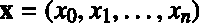和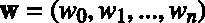，感知机使用我们在上一章中看到的相同假设函数对数据点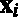进行分类:

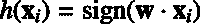

## 感知机学习算法

给定【3】维训练示例的训练集，**感知机学习算法** (PLA)试图找到正确预测每个的标签的假设函数。

感知机的假设函数是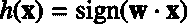，我们看到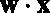只是一个超平面的方程。然后，我们可以说假设函数的集合是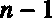维超平面的集合(，因为超平面比它的环境空间少一维)。

这里重要的是要明白，唯一未知的值是。这意味着算法的目标是为找到一个值。你找到；你有一个超平面。超平面有无限个(你可以给任何值)，所以假设函数有无限个。

这可以更正式地这样写:

给定一个训练集: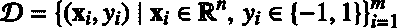和一组假设函数。

找到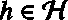这样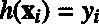对于每一个。

这相当于:

给定一个训练集:和一组假设函数。

找到这样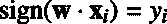对于每一个。

PLA 是一个非常简单的算法，可以这样总结:

1.  从一个随机超平面(由向量定义)开始，用它对数据进行分类。
2.  挑选一个错误分类的例子，通过更新的值来选择另一个超平面，希望它能更好地对这个例子进行分类(这被称为**更新规则**)。
3.  用这个新的超平面对数据进行分类。
4.  重复步骤 2 和 3，直到没有错误分类的示例。

一旦这个过程结束，你就有了一个分离数据的超平面。
算法如代码清单 11 所示。

代码清单 11

```py
import numpy as np
  def  perceptron_learning_algorithm(X,
  y):
      w = np.random.rand(3)   # can also be initialized at zero.
      misclassified_examples = predict(hypothesis, X, y, w)

      while misclassified_examples.any():
          x, expected_y = pick_one_from(misclassified_examples, X, y)
          w = w + x * expected_y  # update rule
          misclassified_examples = predict(hypothesis, X, y, w)

      return  w

```

让我们详细看看代码。

`perceptron_learning_algorithm` 使用几个函数(代码清单 12)。`hypothesis`函数只是用 Python 代码写的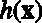；正如我们之前看到的，当用定义的超平面分类时，返回标签作为例子的函数。`predict`函数对每个例子应用假设，并返回被错误分类的例子。

代码清单 12

```py
def  hypothesis(x, w):
      return  np.sign(np.dot(w, x))

  # Make predictions on all data points
  # and return the ones that are misclassified.
  def  predict(hypothesis_function,
  X, y, w):
      predictions = np.apply_along_axis(hypothesis_function, 1, X, w)
      misclassified = X[y != predictions]
      return  misclassified

```

一旦我们用`predict`做了预测，我们就知道哪些例子被错误分类了，所以我们使用函数`pick_one_from`随机选择其中一个(代码清单 13)。

代码清单 13

```py
# Pick one misclassified example
  randomly
  # and return it with its expected label.
  def  pick_one_from(misclassified_examples,
  X, y):
      np.random.shuffle(misclassified_examples)
      x = misclassified_examples[0]
     index = np.where(np.all(X == x, axis=1))
      return  x, y[index]

```

然后我们到达算法的核心:更新规则。现在，只要记住它改变了的值。它为什么这样做将在后面详细解释。我们再次使用`predict`功能，但是这次，我们给它更新了。它让我们可以看到我们是否正确地分类了所有数据点，或者我们是否需要重复这个过程，直到我们这样做。

代码清单 14 展示了如何将`perceptron_learning_algorithm`函数用于玩具数据集。请注意，我们需要和向量具有相同的维度，因此我们在将每个向量赋予函数之前，将其转换为增广向量。

代码清单 14

```py
#
See Appendix A for more information about the dataset 
  from succinctly.datasets import get_dataset, linearly_separable as ls
  np.random.seed(88)

X, y =
  get_dataset(ls.get_training_examples)

  # transform X into an array of augmented
  vectors.
  X_augmented = np.c_[np.ones(X.shape[0]),
  X]

  w = perceptron_learning_algorithm(X_augmented, y)

  print (w) #
  [-44.35244895   1.50714969   5.52834138]

```

### 了解更新规则

为什么我们要使用这个特殊的更新规则？回想一下，我们随机挑选了一个错误分类的例子。现在我们想让感知机正确分类这个例子。为此，我们决定更新向量。这里的想法很简单。由于和之间的点积符号不正确，通过改变它们之间的角度，我们可以使其正确:

*   如果预测标签为 1，和的夹角小于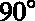，我们要增加。
*   如果预测标签为-1，和之间的角度大于，我们要减小。

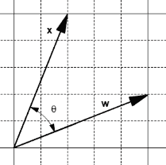

图 15:两个向量

让我们看看两个向量和会发生什么，它们之间有一个角度(图 15)。

一方面，将它们相加会产生一个新的矢量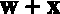，和之间的角度小于(图 16)。

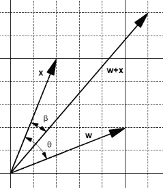

图 16:加法产生了一个更小的角度

另一方面，减去它们会产生一个新的向量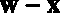，并且和之间的角度大于(图 17)。

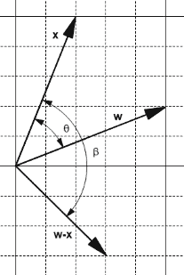

图 17:减法产生了更大的角度

我们可以用这两个观察来调整角度:

*   如果**预测标签**为 1，则角度小于。我们想增加角度，所以设置。
*   如果**预测标签**为-1，则角度大于。我们想减小角度，所以设置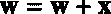。

因为我们只在错误分类的例子中这样做，所以当预测的标签有值时，期望的标签是相反的。这意味着我们可以重写前面的语句:

*   如果**预期标签**是-1:我们想增加角度，所以设置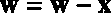。
*   如果**期望标签**是+1:我们想减小角度，所以设置。

当翻译成 Python 时，它给出了代码清单 15，我们可以看到它严格地等同于代码清单 16，这就是更新规则。

代码清单 15

```py
def  update_rule(expected_y,
  w, x):
      if  expected_y == 1:
          w = w + x
      else:
          w = w - x
      return  w

```

代码清单 16

```py
def  update_rule(expected_y,
  w, x):

      w = w + x * expected_y
      return  w

```

我们可以通过在应用之前和之后检查假设的值来验证更新规则是否如我们所期望的那样工作(代码清单 17)。

代码清单 17

```py
import numpy as np

  def  hypothesis(x, w):
      return  np.sign(np.dot(w, x))

  x = np.array([1, 2,
  7])
  expected_y = -1
  w = np.array([4, 5, 3])

  print(hypothesis(w, x))             # The predicted y is 1.

  w = update_rule(expected_y, w, x)   # we apply
  the update rule.

  print (hypothesis(w,
  x))             # The predicted y is -1.

```

请注意，更新规则不一定会第一次改变示例的假设符号。有时需要在更新规则发生之前应用几次，如代码清单 18 所示。这不是问题，因为我们在错误分类的示例中循环，所以我们将继续使用更新规则，直到示例被正确分类。这里重要的是，每次使用更新规则时，我们都会在正确的方向上更改角度值(增加或减少角度值)。

代码清单 18

```py
import numpy as np 
   x =
  np.array([1,3])
  expected_y = -1
  w = np.array([5, 3])

  print (hypothesis(w, x))            # The predicted y is 1.

  w = update_rule(expected_y, w, x)  #
  we apply the update rule.

   print(hypothesis(w, x))             # The predicted y is 1.

  w = update_rule(expected_y, w, x)   # we apply
  the update rule.

  print (hypothesis(w,
  x))             # The predicted y is -1.

```

还要注意，有时更新特定示例的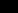值会改变超平面，使得之前正确分类的另一个示例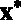变得错误分类。因此，假设在更新后可能会在分类方面变得更差。图 18 说明了这一点，它向我们展示了每个迭代步骤中分类示例的数量。避免这个问题的一个方法是在更新之前记录的值，并且只有当它减少了错误分类的例子的数量时才使用更新后的。PLA 的这种修改被称为**口袋算法**(因为我们把放在口袋里)。

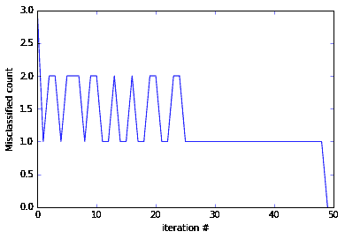

图 18:PLA 更新规则振荡

### 算法的收敛性

我们说我们用更新规则不断更新向量，直到没有错误分类的点。但是我们怎么能如此确定这种情况会发生呢？幸运的是，数学家们研究了这个问题，我们可以非常肯定，因为感知机收敛定理*保证了*如果两个集合 P 和 N(分别是正的和负的例子)是线性可分的，那么向量只更新有限次，这是诺维科夫在 1963 年首次证明的(Rojas，1996)。

### 了解解放军的局限性

PLA 算法需要理解的一点是，因为权重是随机初始化的，错误分类的例子是随机选择的，所以每次运行时，算法都有可能返回不同的超平面。图 19 显示了在同一数据集上运行 PLA 四次的结果。如你所见，解放军发现了四个不同的超平面。


图 19:PLA 每次都找到不同的超平面

起初，这似乎不是一个问题。毕竟，这四个超平面完美地对数据进行了分类，所以它们可能同样好，对吗？然而，当使用像 PLA 这样的机器学习算法时，我们的目标不是找到一种方法来完美地分类我们现在拥有的数据。我们的目标是找到一种方法来正确分类我们未来将收到的新数据。

让我们介绍一些术语来明确这一点。为了训练一个模型，我们从现有数据中选取一个**样本**，称之为**训练集**。我们训练模型，它会提出一个**假设**(在我们的例子中是一个超平面)。我们可以测量假设在训练集上的表现:我们称之为**样本内误差**(也称为训练误差)。一旦我们对假设感到满意，我们就决定在看不见的数据上使用它(测试集**)来看看它是否真的学到了什么。我们衡量假设在测试集上的表现，我们称之为**样本外误差**(也称为泛化误差)。**

 ****我们的目标是具有最小的样本外误差**。

就 PLA 而言，图 19 中的所有假设都完美地对数据进行了分类:它们的样本内误差为零。但我们真的很担心它们的样本外误差。我们可以使用如图 20 所示的测试集来检查它们的样本外错误。


图 20:测试数据集

如图 21 所示，右边的两个假设，尽管对训练数据集进行了完美的分类，但在测试数据集上却出现了错误。

现在我们更好地理解为什么它是有问题的。当使用具有线性可分数据集的感知机时，我们可以保证找到样本内误差为零的假设，但是我们不能保证它将**推广**到看不见的数据有多好(如果一个算法推广得好，它的样本外误差将接近它的样本内误差)。如何才能选择一个很好概括的超平面？正如我们将在下一章中看到的，这是支持向量机的目标之一。

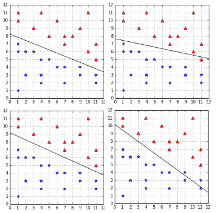

图 21:并非所有假设都有完美的样本外误差

## 总结

在这一章中，我们学习了什么是感知机。然后，我们详细了解了感知机学习算法是如何工作的，以及更新规则背后的动机是什么。在得知 PLA 保证收敛后，我们看到，并不是所有的假设都是平等的，有些假设会比其他假设更好地概括。最终，我们看到感知机无法选择哪个假设具有最小的样本外误差，而是随机选择一个样本内误差最小的假设。**