# 四、优化问题的求解

## 拉格朗日乘数

意大利-法国数学家朱塞佩·洛多维科·拉格朗日(Giuseppe Lodovico Lagrangia)，也被称为**约瑟夫·路易斯·拉格朗日**，发明了一种寻找等式约束下函数的局部最大值和最小值的策略。这被称为拉格朗日乘数法。

### 拉格朗日乘数法

拉格朗日注意到，当我们试图解决一个优化问题的形式:

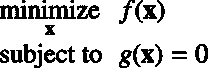

当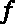的梯度点与的梯度方向相同时，找到的最小值。
换句话说，当:


所以如果我们想在约束下找到的最小值，我们只需要求解为:

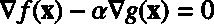

这里，常数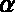被称为拉格朗日乘数。

为了简化方法，我们观察到如果我们定义一个函数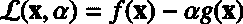，那么它的梯度就是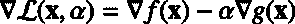。因此，求解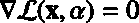可以让我们找到最小值。

拉格朗日乘数法可以用这三个步骤来概括:

1.  通过为每个约束引入一个乘数来构造拉格朗日函数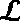
2.  得到拉格朗日的梯度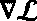
3.  求解

### SVM 拉格朗日问题

我们在上一章看到，SVM 优化问题是:

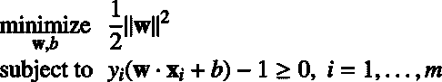

让我们回到这个问题上来。我们有一个目标函数要最小化:

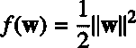

和约束函数:

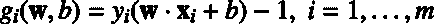

我们引入拉格朗日函数:

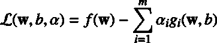

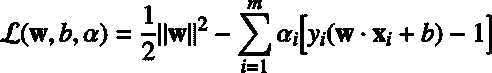

注意，我们为每个约束函数引入了一个**拉格朗日乘数** 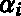。

我们可以尝试为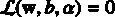求解，但问题只能在例子数量少的情况下才能解析求解(泰森·史密斯，2004)。所以我们将再次用对偶原理改写问题。

为了得到原始问题的解，我们需要求解下面的**拉格朗日问题**:


这里有趣的是，我们需要相对于和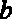最小化，同时相对于最大化。

|  | 提示:你可能已经注意到拉格朗日乘子的方法是用来解决等式约束的问题，这里我们用的是不等式约束。这是因为如果满足一些附加条件(KKT 条件)，该方法仍然适用于不等式约束。我们稍后将讨论这些条件。 |

## 沃尔夫对偶问题

拉格朗日问题具有不等式约束(其中是训练示例的数量)，通常使用其对偶形式求解。**对偶原理**告诉我们，优化问题可以从两个角度来看。第一个是原始问题，在我们的例子中是最小化问题，另一个是对偶问题，它将是最大化问题。有趣的是对偶问题的最大值总是小于或等于原始问题的最小值(我们说它提供了原始问题解的下界)。

在我们的例子中，我们试图解决一个凸优化问题，对于仿射约束**斯莱特条件**成立(Gretton，2016)，所以**斯莱特定理**告诉我们**强对偶**成立。这意味着对偶问题的最大值等于原始问题的最小值。解对偶和解原始是一样的，只是更容易。

回想一下拉格朗日函数是:

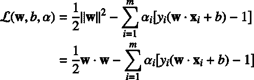

拉格朗日原始问题是:


解决最小化问题涉及到取相对于和的偏导数。

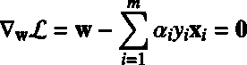

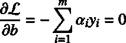

从第一个方程，我们发现:

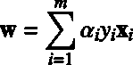

让我们用这个值代替进入:

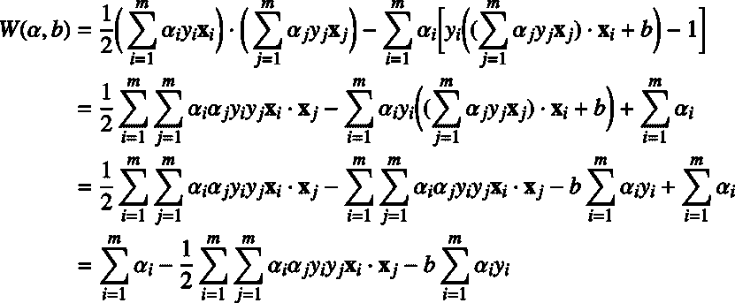

所以我们成功的去掉了，但是还用在函数的最后一项:

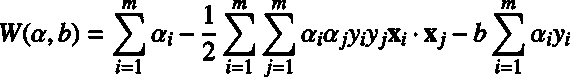

我们注意到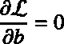意味着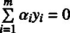。因此，最后一项等于零，我们可以写:

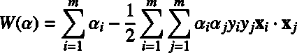

这就是**沃尔夫对偶拉格朗日函数**。

优化问题现在被称为**沃尔夫对偶问题**:

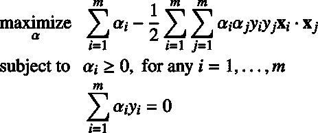

传统上，沃尔夫对偶拉格朗日问题受梯度等于零的约束。理论上我们应该加上约束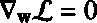和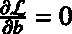。然而，我们只添加了后者。事实上，我们添加了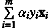，因为从功能中移除是必要的。但是，我们可以在没有约束的情况下解决问题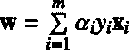。

沃尔夫对偶问题相对于拉格朗日问题的主要优点是目标函数现在只依赖于拉格朗日乘子。此外，这个公式将在下一节帮助我们解决 Python 中的问题，并且在我们稍后定义内核时非常有帮助。

## 卡鲁什-库恩-塔克条件

因为我们处理的是不等式约束，所以还有一个额外的要求:解也必须满足卡鲁什-库恩-塔克(KKT)条件。

KKT 条件是最优化问题的解是最优的一阶**必要条件**。此外，该问题应满足一定的正则性条件。幸运的是，规律性条件之一是**斯莱特条件**，我们刚刚看到它适用于支持向量机。因为我们试图解决的原始问题是凸问题，所以 KKT 条件也是点是原始和对偶最优的**充分条件**，并且存在零对偶间隙。

**综上所述，如果一个解满足 KKT 条件，我们保证它是最优解。** 

卡鲁什-库恩-塔克条件是:

*   平稳条件:


*   原始可行性条件:

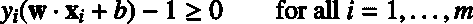

*   双重可行性条件:

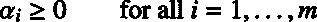

*   互补松弛条件:

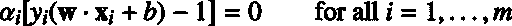

|  | 注:“[...]解决 SVM 问题相当于找到 KKT 条件的解决方案。”(伯吉斯，1988 年) |

请注意，我们之前已经看到了大多数这些情况。让我们一个接一个地检查它们。

### 平稳条件

平稳性条件告诉我们选择的点必须是**平稳点**。这是函数停止增加或减少的点。当没有约束时，平稳性条件就是目标函数梯度为零的点。当我们有约束时，我们使用拉格朗日的梯度。

### 原始可行性条件

看这个条件，你应该认识到原始问题的约束。有意义的是，它们必须被强制执行，以便在约束条件下找到函数的最小值。

### 双重可行性条件

同样，这个条件代表了双重问题必须遵守的约束。

### 互补松弛条件

从互补松弛条件，我们看到要么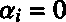要么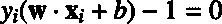。

**支持向量**是具有正拉格朗日乘数的例子。他们是约束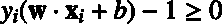活跃**的对象**。(我们说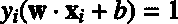时约束有效)。

|  | 提示:从互补松弛条件，我们看到支持向量是具有正拉格朗日乘子的例子。 |

## 一旦我们有了乘数怎么办？

当我们求解 Wolfe 对偶问题时，我们得到一个包含所有拉格朗日乘子的向量。然而，当我们第一次陈述原始问题时，我们的目标是找到和。让我们看看如何从拉格朗日乘数中检索这些值。

### 计算 w

计算非常简单，因为我们从梯度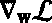推导出公式:。

### 计算 b

一旦我们有了，我们就可以用原始问题的一个约束来计算:


事实上，这个约束仍然是正确的，因为我们以新公式等价的方式转换了原始问题。它说的是，离超平面最近的点将具有 1 的函数余量(值 1 是我们在决定如何缩放时选择的值):

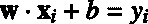

从那里，我们知道所有其他变量，很容易得出的值。我们将等式的两边乘以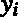，因为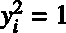，它给我们:


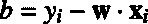

然而，正如*模式识别和机器学习* (Bishop，2006)中所指出的，取平均值为我们提供了一个数值上更稳定的解决方案，而不是取随机支持向量:

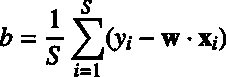

其中为支持向量的个数。

其他作者，如(cristiani & Shawe-Taylor，2000)和(Ng)，使用了另一个公式:

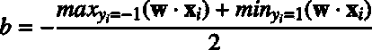

它们基本上取最近正支持向量和最近负支持向量的平均值。这个最新的公式是*统计学习理论* (Vapnik V. N .，1998)在定义最优超平面时最初使用的公式。

### 假设函数

支持向量机使用与感知机相同的假设函数。一个例子的类别由下式给出:

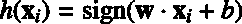

当使用对偶公式时，仅使用支持向量进行计算:

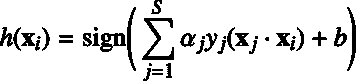

## 用 QP 解算器求解支持向量机

QP 解算器是用于解决二次规划问题的程序。在下面的例子中，我们将使用名为 [CVXOPT](http://cvxopt.org/) 的 Python 包。

这个包提供了一种能够解决以下形式的二次问题的方法:

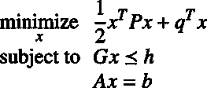

它看起来不像我们的优化问题，所以我们需要重写它，这样我们就可以用这个包来解决它。

首先，我们注意到，在 Wolfe 对偶优化问题的情况下，我们试图最小化的是，因此我们可以用而不是重写二次问题，以更好地了解这两个问题是如何关联的:

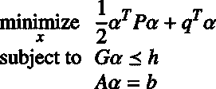

这里符号代表分量向量不等式。意思是矩阵的每一行代表一个必须满足的不等式。

我们将改变沃尔夫对偶问题。首先，我们转换最大化问题:

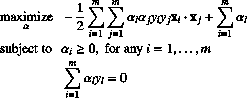

通过乘以-1 变成最小化问题。


然后我们引入向量和以及向量的所有可能点积的 Gram 矩阵:


我们用它们来构造沃尔夫对偶问题的矢量化版本，其中表示的外积。


我们现在能够找出 CVXOPT `qp`功能所需的每个参数、、、、和的值。代码清单 24 演示了这一点。

代码清单 24

```py
# See
  Appendix A for more information about the dataset
  from succinctly.datasets import get_dataset, linearly_separable as ls

 import cvxopt.solvers
X, y = get_dataset(ls.get_training_examples)
m = X.shape[0]# Gram matrix - The matrix of all possible inner products of X.
  K = np.array([np.dot(X[i], X[j])
              for  j in range(m)
              for  i in range(m)]).reshape((m, m))

P = cvxopt.matrix(np.outer(y, y) * K)
q = cvxopt.matrix(-1 * np.ones(m))

  # Equality constraints
  A = cvxopt.matrix(y, (1, m))
b = cvxopt.matrix(0.0)

  # Inequality constraints
  G = cvxopt.matrix(np.diag(-1 * np.ones(m)))
h = cvxopt.matrix(np.zeros(m))

  # Solve the problem
  solution = cvxopt.solvers.qp(P, q, G, h, A, b)

  # Lagrange multipliers
  multipliers = np.ravel(solution['x'])

  # Support vectors have positive multipliers.
  has_positive_multiplier = multipliers > 1e-7
  sv_multipliers = multipliers[has_positive_multiplier]

support_vectors = X[has_positive_multiplier]
support_vectors_y = y[has_positive_multiplier]

```

代码清单 24 初始化了所有需要的参数，并将它们传递给`qp`函数，该函数返回给我们一个解决方案。该解包含许多元素，但我们只关心`x`，在我们的例子中，它对应于拉格朗日乘数。

正如我们之前看到的，我们可以使用所有的拉格朗日乘数来重新计算。代码清单 25 显示了计算的函数的代码。

代码清单 25

```py
def  compute_w(multipliers, X, y):
    return  np.sum(multipliers[i] * y[i] * X[i]
                  for  i in  range(len(y)))

```

因为非支持向量的拉格朗日乘数几乎为零，所以我们也可以只使用支持向量数据及其乘数来计算，如代码清单 26 所示。

代码清单 26

```py
w
  = compute_w(multipliers, X, y)
  w_from_sv = compute_w(sv_multipliers, support_vectors, support_vectors_y)
  print (w)          # [0.44444446 1.11111114]
  print (w_from_sv)  # [0.44444453 1.11111128]

```

我们用平均法计算 b:

代码清单 27

```py
def  compute_b(w, X, y):
    return  np.sum([y[i] - np.dot(w, X[i]) 
                   for  i in  range(len(X))])/len(X)

```

代码清单 28

```py
b = compute_b(w, support_vectors, support_vectors_y) # -9.666668268506335

```

当我们在图 32 中绘制结果时，我们看到超平面是最优超平面。与感知机相反，SVM 总是返回相同的结果。


图 32:用 CVXOPT 找到的超平面

SVM 的这个提法叫做**硬缘 SVM** 。当数据不能线性分离时，它就不能工作。有几种支持向量机公式。在下一章中，我们将考虑另一种称为**软边际 SVM** 的公式，当数据由于异常值而非线性分离时，该公式将能够工作。

## 总结

最小化的范数是一个**凸优化问题**，可以用拉格朗日乘子法求解。当有多个例子时，我们更喜欢使用凸优化包，它会为我们做所有的艰苦工作。

我们看到原来的优化问题可以用拉格朗日函数重写。然后，由于对偶理论，我们把拉格朗日问题转化为沃尔夫对偶问题。我们最终使用了 CVXOPT 包来求解 Wolfe 对偶。