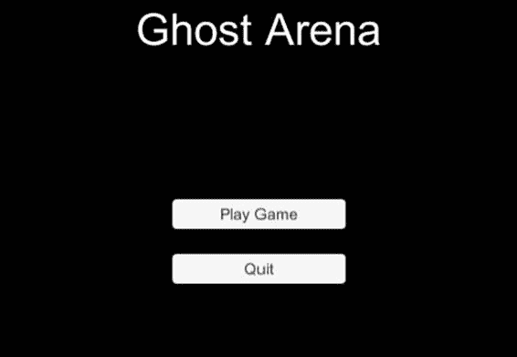
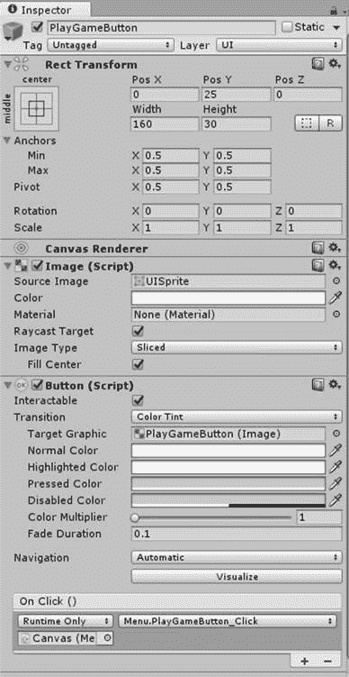
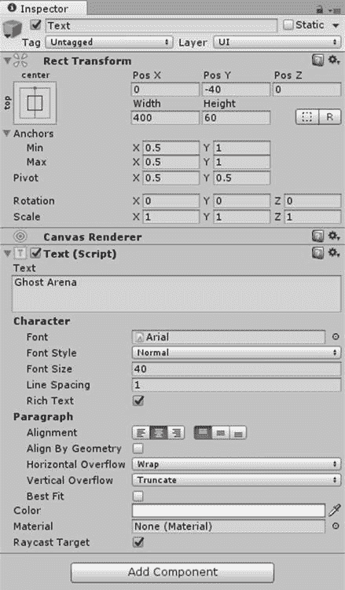
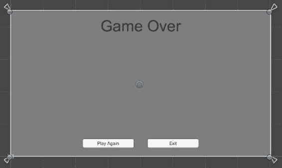
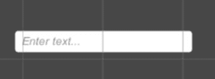
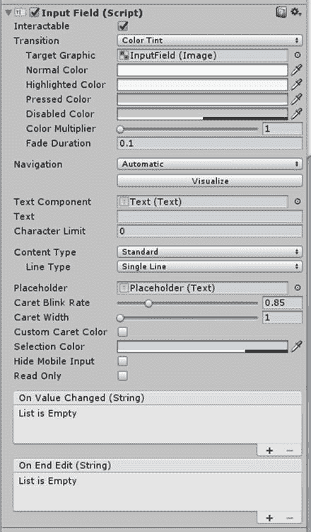
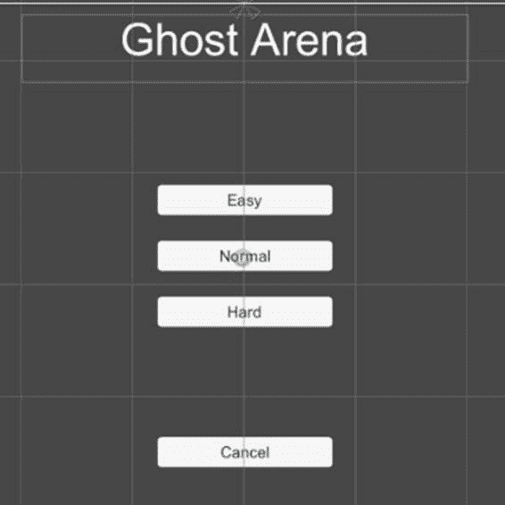
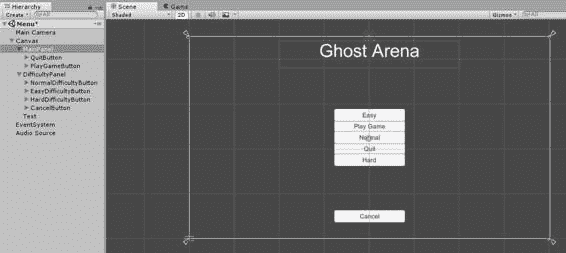
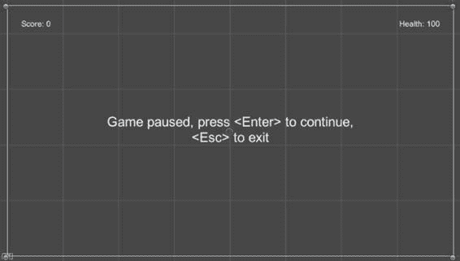
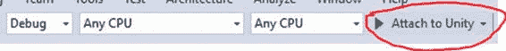

# 三、用户界面

用户界面是游戏中用户直接交互的部分，用户可以通过鼠标点击、通过键盘输入数据或使用其他输入设备进行交互。在本节中，我们将看看我们在示例游戏中使用的特定用户界面元素，以及您可能想要考虑的其他一些元素。

## 按钮

我们从按钮开始，因为它是最容易用于主菜单的东西，这通常是玩家与游戏的第一次互动。图 11 显示了我们的菜单是什么样子的。



图 11:主菜单

菜单只是两个按钮和一个文本对象。显然不是 AAA 质量，但我们只是在寻找一些东西来完成工作，一个按钮提供了我们需要的所有交互，而不会实现得过于复杂。这两个按钮后面还有一点，我们很快就会看到，但这是玩家第一次开始游戏时看到的。

按钮类有很多可配置性。您可以修改显示文本、组成按钮的图像等的属性，如图 12 所示。



图 12:按钮属性

最顶部的复选框(或 Unity 称之为切换)将显示和隐藏按钮，可交互复选框将启用和禁用允许用户单击它，这是您应该了解的几个属性。

另一个重要的属性是“点击”部分，它允许您将代码附加到按钮上，以便允许它做一些事情。该部分底部的+和–图标允许您为代码添加和移除处理程序。添加处理程序后，“仅运行时”下拉列表下方的部分用于链接到包含脚本的对象，该脚本包含要用于 click 事件的方法。通常，您只需按住按钮将脚本放在画布中，然后将画布从层次结构拖到控件中(如上所示)。这将使用脚本中的方法填充右侧的下拉列表。只需选择要使用的方法。

通常，Click 事件只有一个处理程序，但是您可以有任意多个处理程序。它们将按照添加到点击部分的顺序被调用。

## 文本

文本控件是一个简单的标签，没有任何用户交互。我们用这个作为我们主菜单场景的标题。您可以更改文本属性，如图 13 中的按钮所示。



图 13:文本属性

## 面板

有时，您会希望将用户界面元素组合在一起，以便可以轻松地一次更改所有元素。面板允许您这样做。我们用它来保存游戏结束时显示的控件，如图 14 所示。



图 14:游戏结束面板

默认情况下，面板处于停用状态，这将隐藏它包含的按钮和文本对象。我们还将在菜单中使用一个面板来允许玩家选择游戏的难度。

## 输入字段

当您希望允许用户为登录、输入高分姓名等项目输入文本时。，您将需要使用一个输入字段，如图 15 所示。



图 15:输入字段

这个控件比我们以前看到的有更多的属性。图 16 显示了特定于控件的属性。



图 16:输入字段属性

您可能会发现许多其他有用的控件:

*   切换(或复选框)
*   滑块
*   卷动条
*   下拉列表(或组合框)
*   图像

如果你有任何应用开发经验，掌握这些控件应该不会太难。

## 完成游戏界面

除了主菜单中的按钮和文本对象，我们还有允许玩家选择游戏难度的元素。这些 UI 元素位于一个面板中，该面板在玩家开始游戏之前是隐藏的。

如果您已经将“播放”和“退出”按钮以及“标题”的文本组件添加到主菜单场景中，请添加一个面板并将按钮拖到其中。如果还没有，现在添加一个面板，然后向其中添加按钮。您可能应该命名面板，就像您应该命名所有组件一样。我称之为主面板。

向场景添加另一个面板，并将其命名为困难面板。接下来，再添加四个按钮。这些将是容易，中等和困难的难度水平，以及一个取消按钮。通过隐藏主面板，您可能会发现使用此面板中的元素更容易。将控件布局成类似于图 17 的样子，边走边设置按钮的文本:



图 17:主菜单难度控制

完成后，您应该有类似于图 18 的东西(当两个面板都可见时)。



图 18:主菜单场景

游戏场景中的 UI 并不比菜单复杂多少。有三个文本组件和我们之前看到的游戏结束面板。图 19 显示了三个文本组件。



图 19:游戏场景文本组件

暂停文本的宽度和高度分别设置为 500 和 60。文本字体大小为 24，水平居中，水平溢出设置为环绕。

乐谱文本设置为 25/-25 的 X/Y 位置，锚点预设设置为左上角。矩形变换属性集左上角的框是锚点预设。点击锚定预设将扩大框，以显示所有的可能性。设置 X 和 Y 值后，按住 Shift 和 Alt 键，同时单击左上角的预设。文本将移动到位。

健康文本设置为-25/-25，锚点预置设置为右上角。只需重复乐谱文本中的步骤，点击右上角的预设。

游戏结束的文本设置为 Y 值 166，宽度 400，高度 75。“再次播放”按钮的宽度为 160，高度为 30，并设置为-100/25 的 X/Y 位置。退出按钮设置为 100/25 的 X/Y 位置。

## 对用户界面进行编码

不添加一些代码，UI 元素什么也做不了，所以我们现在就添加它。

将脚本添加到名为菜单的脚本文件夹中，将该脚本从项目拖到层次结构中的画布上，然后在代码编辑器中打开它。将代码清单 4 中的代码添加到文件中。

代码清单 4:主菜单代码

```cs
  using UnityEngine;
  using UnityEngine.SceneManagement;

  public class Menu : MonoBehaviour 
  {
        public GameObject MainPanel;
        public GameObject DifficultyPanel;

        public void PlayGameButton_Click() 
        {
              DifficultyPanel.SetActive(true);

      MainPanel.SetActive(false);
        }

        public void CancelButton_Click ()
        {
              DifficultyPanel.SetActive(false);

      MainPanel.SetActive(true);
        }

    public void
  DifficultyButton_Click(int index)

    {

      Globals.DifficultyLevel = index;

          SceneManager.LoadScene("Game");

    }

        public void QuitButton_Click()
        {
              Application.Quit();      
        }
  }

```

如果你看看这些方法，你会发现难度按钮只有一个。这三个按钮都会调用这个方法。索引参数会告诉我们哪个被点击了。那么，我们如何让按钮向方法传递一些东西呢？我们现在来复习一下。

选择层次结构中的所有三个按钮，并通过单击检查器中按钮属性点击部分右下角的 **+** 向它们添加一个处理程序。将“画布”从“层次结构”拖到处理程序左下角的控件上，该控件应显示“无(对象)”从处理程序右上角的下拉列表中为所有三个按钮选择**困难按钮 _ 点击**方法。在处理程序部分的右下角，您现在将看到一个文本框，您可以在其中指定要传递给方法的参数值。按从容易到困难的顺序选择每个按钮，并将值分别设置为 0、1 和 2。

您可以通过在方法的第一行放置断点并检查参数的值来进行测试，以确保一切正常工作。如果您正在使用 Visual Studio，这将需要一些额外的步骤将其链接到 Unity 进行调试。如果 VS 设置正确，您应该会在 IDE 的工具栏上看到一个带有文本“附加到 Unity”的按钮，如图 20 所示。



图 20: Visual Studio IDE 统一调试

如果您在安装 Unity 时没有安装 Visual Studio Tools for Unity，您可以相对轻松地安装。这里可以单独安装[。](https://visualstudiogallery.msdn.microsoft.com/8d26236e-4a64-4d64-8486-7df95156aba9)

菜单代码使用一个全局变量来保存难度的选择。创建一个名为 Globals 的新脚本文件，并从代码清单 5 中添加以下内容。

代码清单 5:难度变量

```cs
  public class Globals
  {

  public static int DifficultyLevel;
  }

```

游戏场景的脚本在一个名为“游戏”的脚本文件中。创建脚本后，将脚本文件夹中的图标拖到层次结构中的对象上。我使用了水平精灵而不是普通的画布对象，只是因为水平精灵总是显示。如果你愿意，你可以使用画布。其中只有少量与用户界面相关的代码。

代码清单 6:游戏场景用户界面声明

```cs
  using UnityEngine;
  using UnityEngine.UI;
  using UnityEngine.SceneManagement;

  public class Game : MonoBehaviour
  {

  public GameObject GameOverPanel;

  public Text ScoreText;

  public Text HealthText;

  public Text PauseText;

```

第一个 using 语句是在 Unity IDE 中创建脚本时自动添加的，但是您必须手动添加另外两个语句，以便代码将场景改回主菜单。

`GameOverPanel`成员应该是不言自明的。将面板从“层次”窗口拖到检查器中的相应位置。接下来的三个成员是用于评分、玩家健康和暂停文本的文本对象。将它们从“层次”窗口拖到检查器中的相应位置。

剩下的就是添加`Update`方法代码和按钮处理程序，如代码清单 7 所示。

代码清单 7:游戏面板代码

```cs
  void Update()

  {

  if (Input.GetKeyDown(KeyCode.Escape))

  {

  if (Globals.CurGameState == GameState.PlayingGame)

  {

  Globals.CurGameState = GameState.PauseGame;

  PauseText.gameObject.SetActive(true);

  }

  else if
  (Globals.CurGameState == GameState.PauseGame)

  SceneManager.LoadScene("Menu");

  }

  if (Input.GetKeyDown(KeyCode.Return) && Globals.CurGameState == GameState.PauseGame)

  {

  PauseText.gameObject.SetActive(false);

  Globals.CurGameState = GameState.PlayingGame;

  }
      }

  public void
  ExitButton_Click()

  {

  SceneManager.LoadScene("Menu");

  }

  public void
  PlayAgainButton_Click()

  {

  GameOverPanel.SetActive(false);

  ResetGame();
      }

```

如果玩家按下 Esc 键，游戏还没有暂停，我们设置一个开关变量来停止任何游戏相关代码的运行。然后显示让玩家知道游戏暂停的文本对象。如果游戏已经暂停，Esc 键退出游戏，我们加载菜单场景。如果在游戏暂停时按下回车键，我们将取消游戏并隐藏暂停文本对象。

游戏结束时会显示退出和再次播放按钮。单击退出按钮加载菜单场景。单击“再次播放”按钮隐藏“游戏结束”面板并重置游戏。

我们现在有了游戏的框架。在下一章，我们将添加精灵，这样玩家就有东西可以看了。