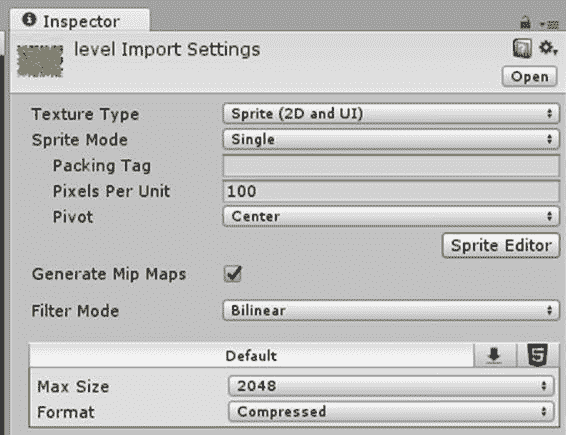
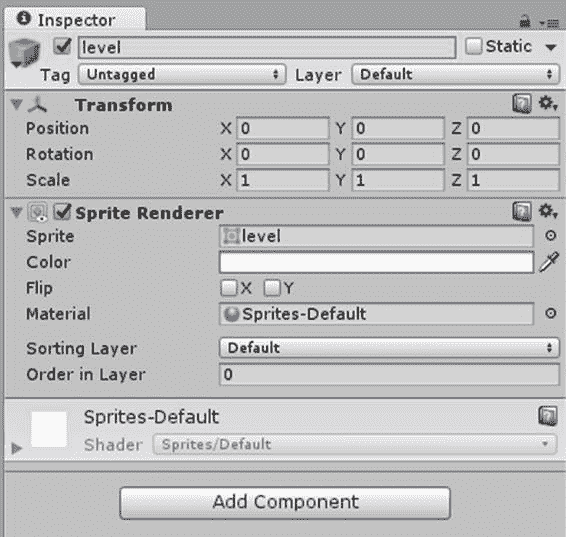
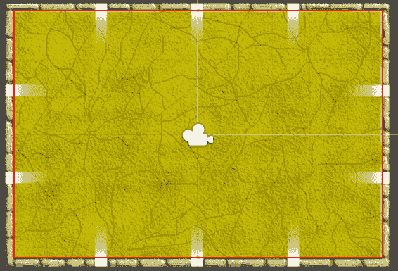
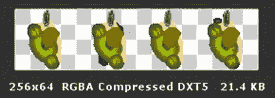
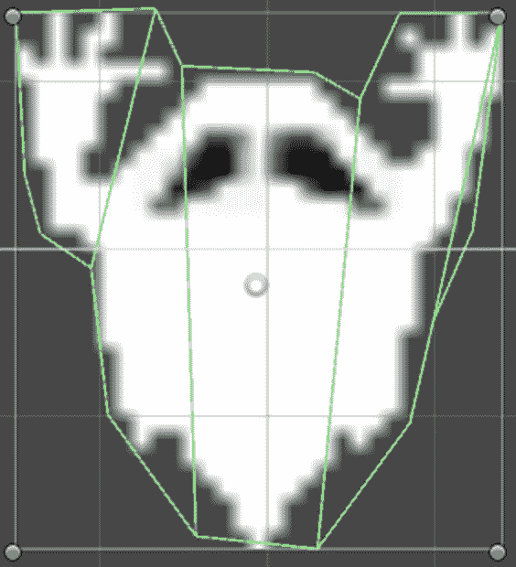
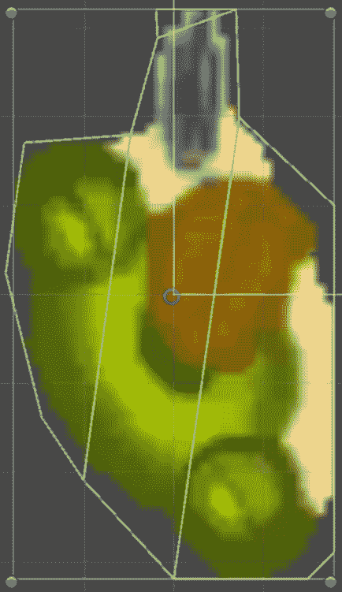

# 四、二维图形和精灵

没有图形组件，任何游戏都无法存在。无论是拼图、奇幻生物、某种交通工具，还是人类跑来跑去互相射击，毫无疑问，图形组件是游戏最重要的方面。我能想到的游戏中只有一个没有图形部分——一个只使用音频的游戏。然而，这是规则的例外。你需要一些东西让玩家在你的游戏中看到和操纵。

我们游戏的目标将是玩家在房间或竞技场中四处奔跑，被从竞技场墙壁的开口中随机出现的鬼魂攻击。如果你仔细想想，你可能会很容易地猜测出图形片段是什么:

*   容纳玩家的竞技场。
*   玩家将控制的角色。
*   鬼魂。
*   角色会发射的子弹。

还有其他几个项目我们可以添加，但对于一个基本的游戏，这是我们所需要的。这些部分中的每一个都将在场景中由精灵表示。

## 雪碧

精灵只是一个二维图像，带有一些附加的功能，以便于操作和使用。图像是从图形文件(通常是. png 或类似的图形格式)中提取的，并由 SpriteRenderer 渲染到屏幕上。请注意，图形文件可以包含多个图像，而不仅仅是用于精灵的图像。在通常所说的地图集中，图像可以是相关的，也可以是不相关的，或者它们可以是一个精灵的动画帧。我们将多个图像放在一个文件中是为了降低内存成本(文件中实际上不包含部分图像的区域可能会丢失大量内存)，或者是为了更容易地组织您的精灵。您可以有一个由多个部分组成的大型精灵，其中一些部分将被动画化——当您试图拼凑精灵时，将所有这些部分放在它们自己的文件中可能会令人困惑。

我们的两个精灵将有动画——角色和鬼魂——而另外两个将只有单一的图像——子弹和竞技场。

我们将从实现竞技场精灵开始。首先，将关卡图形文件添加到 Sprites 文件夹中。单击 Sprites 文件夹中的项目应该会显示图像将被视为 sprite，如下图 21 中的检查器屏幕截图所示。



图 21:精灵属性

将精灵从精灵文件夹拖到层次窗口。图 22 描述了检查员将显示的内容。



图 22:关卡精灵属性

精灵会自动定位在场景的中间。

你可以点击颜色栏，看看改变 RGB 值会有什么效果。

翻转 X 和 Y 值的作用和预期的一样——它在 X 轴和 Y 轴上翻转精灵。

SpriteRenderer 的 Material 属性与我们没有特别的关系，您不应该更改默认值。在三维渲染中，材质通常与着色器一起使用，以改变三维对象的外观。例如，你可以拿一个空白的球体，根据你对它应用的材料，让它看起来像棒球或篮球。

“排序图层”和“图层顺序”属性允许您更改子画面从后向前渲染的顺序。同一层内的子画面从低到高渲染，这意味着层顺序为 0 的子画面将被层顺序为 1 的相同位置的子画面覆盖。具有相同值的精灵将按照它们添加到场景中的顺序进行渲染。

既然我们有东西让角色跑进来，我们需要确保他跑不出去。如果角色能够穿过竞技场的墙壁，那看起来会很奇怪。这就是鬼魂的行为。我们这样做的方法是用盒子对撞机。该组件将防止二维对象超出其边界。

在层次结构中选择**级别**对象。在检查器中，单击**添加组件**。选择**物理二维**项目，然后选择**箱式对撞机二维**项目。Unity 会尽最大努力使碰撞器适合放置的物体，但通常必须对其进行编辑才能获得想要的效果。在检查器的盒子碰撞器二维部分点击**编辑碰撞器**将显示定义盒子界限的绿色线条。这些线条刚开始可能有点难看。您可以在检查器中单击该级别的“显示者”部分的复选框来查看它们。当然，你必须确保 SpriteRenderer 被选中，这样你就可以看到图像，以便正确对齐碰撞器。你应该看到每条线中间的方块，即使图像是可见的。只需拖动它们，使线条位于竞技场墙壁的内侧，如图 23 中的红色方框所示。



图 23:箱式对撞机的放置

当碰撞器就位后，确保在检查器的“长方体碰撞器 2-D”部分为“水平”对象选中了**是触发器**复选框。我们需要这样做，因为碰撞器不仅能让角色留在竞技场，当我们试图繁殖鬼魂时，它还能把它们挡在外面。鬼魂会在代表竞技场入口的 10 个白色区域之外产卵。如果我们不设置碰撞器作为触发器，鬼魂在试图向玩家移动时会撞到这个，并且无法更进一步。通过设置碰撞器作为触发器，我们可以控制当物体撞击碰撞器时会发生什么。我们可以让鬼魂通过，但要限制角色。稍后我们会在场景中添加一个脚本来控制玩家。

## 子弹、角色和幽灵精灵

现在我们有了一个供角色奔跑的竞技场，我们需要让角色和幽灵精灵进入场景。将两个文件都添加到图形文件夹中。

单击播放器精灵。您还会注意到，在检查器的底部，文件包含多个精灵图像，如图 24 所示。



图 24:玩家精灵框架

细微的差别旨在表明角色在屏幕上移动时是在行走，而不是简单地漂浮或飞行。幽灵精灵包含类似的帧。虽然它确实会随着移动而浮动，但只有一个框架会让事情变得有点无聊。让它在移动时有动画效果会让精灵看起来更真实一点。让精灵随着时间在每一帧中移动被称为动画。在我们正确设置了精灵之后，我们将稍后介绍如何做到这一点。

为了让角色和鬼魂相互作用，我们需要添加一个碰撞器以及另一个物理对象。然而，我们想添加一个 2-D 多边形碰撞器，而不是盒子碰撞器。我们这样做是为了使碰撞检测更加准确。使用多边形碰撞器计算成本更高，但在某些情况下，它要精确得多。如果我们要添加一个盒子碰撞器，盒子里面会有被检测为碰撞的区域，这些区域并不是真正的碰撞。玩家将会看到碰撞检测没有按照它应该的那样工作，这会让你的游戏看起来很糟糕。看看图 25 中的幽灵精灵。



图 25:幽灵精灵方块碰撞器与多边形碰撞器

蓝点是用于盒子对撞机的区域。绿线表示多边形碰撞器的区域。对于幽灵，如果我们使用盒子碰撞器，在顶部、中间和底部会有一些区域被错误地检测为碰撞。玩家精灵几乎和我们在图 26 中看到的一样糟糕。



图 26:玩家精灵方块碰撞器与多边形碰撞器

使用检查器中的“编辑碰撞器”按钮来收紧每个精灵周围的多边形。您可以单击两点之间的多边形，以便添加一个点来创建更紧密的多边形。除了对撞机组件，我们还需要一个刚体二维组件。我们会用这个来帮助建立我们的运动。将这两个组件添加到玩家和幽灵精灵中。

角色、幽灵和子弹精灵的工作方式与关卡精灵有所不同。关卡精灵停留在屏幕上，不会改变。屏幕上可以同时出现多个幽灵和子弹精灵的实例，这意味着我们将把它们设置为预置，以便轻松创建多个实例。角色精灵在屏幕上只有一个实例，但是角色可以被鬼魂杀死，从而结束游戏。发生这种情况时，我们将移除精灵。如果玩家决定再次玩这个游戏，我们将重新创建这个精灵——我们也将把它做成一个预制的。

从精灵中创建一个预设是非常容易的。将每个精灵从精灵文件夹拖到层次结构中，然后将每个精灵拖到预设文件夹中。从层次结构中删除精灵，我们就完成了。

创建预置的实例比创建预置本身需要更多的工作，但是并不是很困难。我们先处理角色。在游戏脚本文件中，添加代码清单 8 中的代码。

代码清单 8:玩家创建代码

```cs
  public GameObject Player;

  private GameObject _player;

  void Start ()
  {

  _player = (GameObject)GameObject.Instantiate(Player, new Vector3(0, 0, 0), Quaternion.identity);

  ResetGame();
  }

  void ResetGame()
  {

  _player.transform.position = new Vector3(0, 0, 0);
  }

```

公共`Player`成员将让我们引用代码中的字符预设。`Player`成员是我们预设的实例。当场景加载时，自动调用`Start`方法。然后我们创建预置的实例，把它放在屏幕的中央。

我们将有更多的代码来处理字符实例，但我们稍后会添加。让我们继续创建幽灵预制的实例。我们需要更多的代码，因为我们有多个 sprite 实例，它们可以在不同的时间出现在不同的位置。代码清单 9 显示了我们将如何处理这个问题。

代码清单 9:幽灵创建代码

```cs
  public GameObject Ghost;

  private void
  SpawnGhost()
  {

  int index = Globals.RandomNum.Next(Globals.StartingPoints.Length);

  Vector3 vec = Globals.StartingPoints[index];

  GameObject ghost = (GameObject)Instantiate(Ghost, vec, Quaternion.identity);

  ghost.GetComponent<Ghost>().Player = _player;

  //rotate as necessary

  switch (index)

  {

  //rotate 180

  case 0:

  case 1:

  case 2:

  {

  ghost.transform.Rotate(0.0f, 0.0f, 180.0f);

  break;

  }

  // rotate 90
  counterclockwise

  case 3:

  case 4:

  {

  ghost.transform.Rotate(0.0f, 0.0f, 90.0f);

  break;

  }

  // rotate 90 clockwise

       case 8:

  case 9:

  {

  ghost.transform.Rotate(0.0f, 0.0f, -90.0f);

  break;

  }

  }
  }

```

因为有 10 个地方可能出现幽灵，所以我们生成一个随机数，作为可能开始位置列表的索引。这些仅仅是通过观察场景中的水平精灵来确定的。

当我们有了起始位置，我们创建一个幽灵预设的实例，并给它一个玩家角色实例的引用，这样幽灵预设就可以追逐玩家角色。

根据鬼实例的起始位置，我们可能需要旋转鬼实例，使其面向它应该穿过的开口。

这种方法依赖于一些全局变量。将以下代码添加到`Globals`类。

代码清单 10:幽灵创建全局变量

```cs
  public static System.Random RandomNum;

  public static Vector3[] StartingPoints = new Vector3[] {

  new Vector3(-2.575f, 3.4f, 0f), new Vector3(0f, 3.4f, 0f), new Vector3(2.575f, 3.4f, 0f),

  new Vector3(5.0f, 1.2f, 0f), new Vector3(5.0f, -1.14f, 0f),

  new Vector3(2.575f, -3.4f, 0), new Vector3(0f, -3.4f, 0f),new Vector3(-2.575f, -3.4f, 0f),

  new Vector3(-5.0f, -1.14f, 0f), new Vector3(-5.0f, 1.2f, 0f)};

```

随机数变量将在游戏脚本的`Start`方法中初始化。将以下代码添加到方法的开头。

代码清单 11:随机数初始化

```cs
  if (Globals.RandomNum == null)
       Globals.RandomNum = new System.Random();

```

我们有一个角色和鬼魂去追他，所以现在我们需要一个玩家消灭鬼魂的方法。将项目符号图形文件添加到 Sprites 文件夹，将其拖到层次窗口中，然后将其拖到 Prefabs 文件夹中。删除层次窗口中的项目符号，我们就完成了。通过响应玩家的输入来创建子弹预制体的实例。继续读下去，我们会看到如何做到这一点。