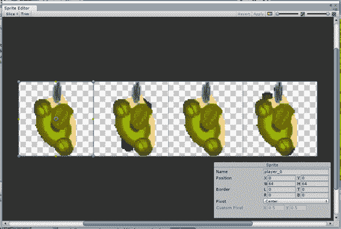
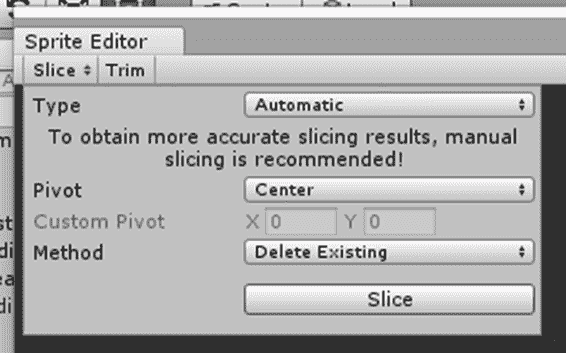
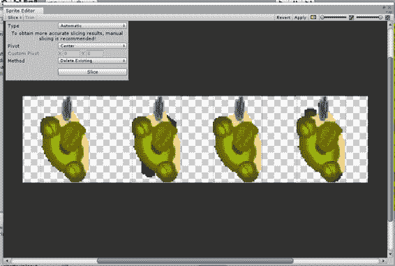
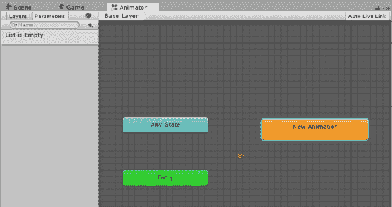
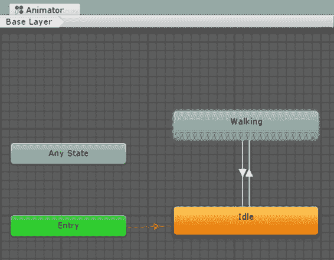
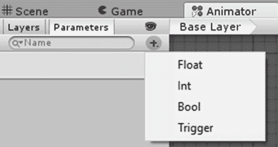
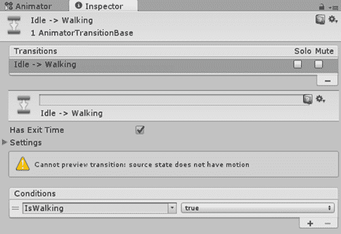
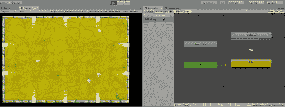

# 六、动画

现在我们已经让我们的角色四处移动，接下来让他看起来像是在移动，而不仅仅是漂浮(这是当前的样子)。这就是雪碧动画的用武之地。

首先，我们需要将我们的角色和幽灵精灵分离到帧中，以便它们能够正确地制作动画。在项目窗口中选择播放器精灵，然后在检查器中点击**精灵编辑器**。您应该会看到图 29 中的截图。



图 29:精灵编辑器窗口

使用**切片**菜单项显示下拉窗口，点击**切片**，如图 30 所示。



图 30:精灵编辑器切片窗口

图像应该显示现在分成四个独立帧的精灵(你应该看到每个图像周围的方框)。



图 31:切片雪碧

关闭精灵编辑器窗口，您应该会得到一个确认对话框，将更改应用到精灵。单击**应用**，然后在项目窗口中选择幽灵精灵并执行相同的步骤。

现在我们已经有了动画的框架，是时候为每个精灵创建动画了。我们希望将动画应用到我们现有的预设中，所以让我们将播放器预设从项目中的文件夹拖到层次窗口中。如果“项目”窗口中的播放器子画面的帧不可见，请点按子画面右侧的图标以显示它们。选择播放器精灵的四帧(单击第一帧并按住 **Shift** 键，同时单击第四帧)并将它们拖到层次结构中的播放器上。你应该得到一个创建新的动画文件窗口。在“资源”文件夹中创建一个名为“动画”的新文件夹，并将动画保存在新文件夹中。动画窗口也应该自动打开。如果没有，请从“窗口”菜单中打开它。您将看到类似图 32 的内容。



图 32:动画师窗口中的新动画

动画师中只有一种状态，动画会立即开始。虽然这对鬼魂来说没问题，但我们不希望玩家也这样。我们不希望玩家在静止不动时播放行走动画。为了解决这个问题，右击窗口的空白区域，选择**创建状态|空白**菜单项。将添加一个没有动画的新状态。通过点击并在检查器中更改名称来重命名此空闲状态(更改名称后确保按下**进入**以确保其实际更改)，然后右键单击它并选择**设置为图层默认状态**。您将看到该行从进入状态移动到新的空闲状态。重命名第一个动画“行走”。

为了改变状态，需要在空闲和行走状态之间添加转换。过渡用于指示何时切换到不同的动画。它们有您用代码设置的参数，参数的变化将被自动检测到。该更改的动画将成为当前动画。

右击**空闲**动画，选择**过渡**菜单项。将光标移动到行走动画。当您这样做时，您会注意到空闲动画中有一条线附加到光标上。点击**行走**动画，你将设置两者之间的过渡。线中间的箭头显示了过渡的方向。右键点击**行走**动画，然后点击**空闲**动画。现在，您应该可以在两个动画之间切换，如图 33 所示。



图 33:带过渡的行走和闲置玩家动画

现在我们需要为转换设置参数。点击动画网格左侧的 **+** ，选择**布尔**，如图 34 所示。



图 34:添加动画过渡条件

将参数命名为对话。单击从空闲到行走的过渡线，您将在检查器窗口的条件部分看到该参数。将旁边的下拉项设置为 true。单击从**步行到空闲**的转换，并将 IsWalking 值设置为 false，如图 35 所示。



图 35:动画师参数条件设置

为了保存对预置的更改，我们需要将播放器对象从层次结构拖回到项目窗口中的预置上。任何时候你想改变一个预制构件，你都需要这样做。将更改保存回预设后，删除层次结构中的播放器对象。

现在我们已经在 Animator 中设置好了所有内容，我们只需要添加几行代码就可以根据玩家的输入来更改 IsWalking 参数的值。那是在`PlayerController`类`Update`方法中完成的。在设置`vel`变量的行之后，添加代码清单 14 中的以下内容。

代码清单 14:动画转换代码

```cs
  if (vel != Vector3.zero &&
  !CharacterAnimator.GetBool("IsWalking"))

  CharacterAnimator.SetBool("IsWalking", true);
  else if
  (CharacterAnimator.GetBool("IsWalking") && vel == Vector3.zero)

  CharacterAnimator.SetBool("IsWalking", false);

```

在代码清单 15 中，`CharacterAnimator`对象被添加到类的成员中。

代码清单 15:角色动画师声明代码

```cs

  public Animator CharacterAnimator;

```

选择玩家预设，将动画师拖入脚本的`CharacterAnimator`成员。脚本现在将更新动画师，当玩家在屏幕上移动角色时，动画师将触发动画，按住移动键时，您应该会在游戏窗口中看到动画。当角色不移动时，动画应该停止。

如果您在游戏运行时选择层次结构中的 Player 对象，并且 Animator 窗口打开，您应该会看到参数被更改，动画被触发，如图 36 所示。



图 36:运行游戏时动画师更新

这照顾到了玩家的动画。我们需要对鬼魂做同样的事情。幸运的是，幽灵稍微容易一点——幽灵动画不需要任何条件，也不需要有空闲状态。鬼魂会不停地移动。

将幽灵预设拖回到层次结构中，选择幽灵动画的帧，并将其拖到幽灵对象上。保存动画，将 Ghost 对象拖回预设，就完成了。每一个产生的鬼魂都会被动画化。

随着动画的加入，游戏朝着更加专业的方向迈进了一步，但它仍然没有包括一个你可能已经注意到缺失的功能——声音。