# 一、简介

在过去，微软和视窗之间的联系是自动的。毫无疑问，Windows 是雷德蒙软件公司创造的最著名的产品(和 Office 一起)。今天，尽管计算世界发生了各种变化，但无论是消费者还是企业，Windows 仍然是世界上采用最广泛的操作系统。

如今，微软不再仅仅意味着 Windows。新的数字化转型深刻改变了微软的使命。公司最初的目标是把一台电脑带到每个家庭和每个办公室，但世界已经改变了。计算机不再仅仅用于技术和商业目的。此外，新的计算体验已经出现，如手机和虚拟现实。因此，在新任首席执行官塞特亚·纳德拉的领导下，微软的使命发生了变化，以拥抱数字世界中正在发生的快速转变:增强世界上所有人和每家公司的权能，以实现更多目标。这个目标仅靠传统计算机是无法实现的。移动、云、物联网和商业智能只是每天打开新的和令人兴奋的场景的几项技术。因此，近年来，微软开始接受一种新的、大胆的方法来迎接一场深刻的变革。他们推动了云，将 Azure 变成了世界上最具生产力的云平台之一；他们开始与开源世界合作，通过与社区合作来改进开发工具和框架；他们开始在竞争激烈的平台上发布产品和服务，如安卓、iOS 和 OS X，因为微软希望帮助人们提高工作效率，无论他们选择哪个平台。

尽管有这些变化，Windows 仍然是公司的关键产品之一，也是让人们和公司实现目标的最佳环境，无论我们谈论的是玩最新的三 A 游戏还是与工作团队合作编写文档。

Windows 10 是当前一代的 Windows，同时也是一段旅程的终点和起点。这是一条融合之路的终点，目标是统一所有努力，创建一个在现代设备上运行的现代操作系统；这是操作系统新概念的开始，它更加敏捷，能够更快地适应数字世界正在发生的持续变化。

这本书献给开发人员和通用视窗平台，这是一个新的开发平台，可以用来创建现代和强大的应用程序，不仅能够在传统桌面上运行，而且能够在各种现代设备上运行，从最传统的设备(如手机或平板电脑)到最创新的技术，如 2 合 1、物联网或虚拟现实。

Windows 一直是一个非常保守的生态系统，非常注重生产力和长期的承诺和支持，而不是以其创新的用户体验或颠覆性的功能而闻名。

然而，随着 2010 年 Windows Phone 7 的发布，情况发生了变化。从消费者和开发者的角度来看，微软第一次采取了大胆的方法，发布了一个具有全新用户体验和新 UI 语言的平台。这是移动世界中的新事物，提供了与其前身 Windows Mobile 完全不同的体验。

Windows Phone 中引入的变化慢慢开始在微软家族的所有其他产品中传播。起初，重点是用户体验的统一:随着 Windows 8 的发布，独特的功能开始出现在其他微软平台上，如 Xbox 和 Windows，如磁贴和寻找应用程序和游戏的商店。

与此同时，微软也从技术角度开启了融合之旅。目标是在开发类似产品(操作系统)的团队之间创造更多的协同效应，最终，他们只是在不同的设备上运行。

Windows 8 是这种融合的第一步，共享 Xbox One 和 Windows Phone 8 使用的相同内核。对于最终用户或开发人员来说，这一变化并没有产生如此大的影响。然而，在幕后，它对原始设备制造商和工程团队产生了巨大的影响，因为一个内核意味着同一组驱动程序可以跨多个设备使用，从而减少了支持所有不同视窗平台所需的工作量。

与此同时，Windows 8 还引入了一个名为 Windows Runtime (WinRT)的开发平台，它利用了一种与传统完全不同的方法。NET 框架。视窗运行时不是一个可以安装在多个视窗版本上的托管环境，而是一个可以直接与视窗内核对话的本机应用编程接口层。当我们谈论通用视窗平台时，我们将进入更多细节。Windows Runtime 为应用程序开发人员带来了很多好处。它比托管环境更快，并且它提供了一套更广泛的 API 来解决开发人员在现代世界中遇到的许多挑战，例如云访问、与传感器和蓝牙设备的集成、电池电量和性能的优化等。然而，Windows Runtime 的原始版本有一个缺点:它只受 Windows 8 支持。因此，尽管 Windows 8 和 Windows Phone 8 共享许多相同的功能，但它们以不同的方式实现。Windows 8 基于 Windows Runtime，而 Windows Phone 8 仍然基于 Silverlight 和传统。NET 框架。因此，这种趋同更多的是理论上的，而不是实践上的。为了支持这两个平台，开发人员仍然需要编写两个完全不同的应用程序。

两种操作系统(Windows 8.1 和 Windows Phone 8.1)的新更新将旅程推进到下一步，最终，最终用户和开发人员开始从这种融合中获得一些好处。Windows 8.1 扩展了 Windows 运行时，增加了许多开发人员所需的缺失功能。此外，Windows Runtime 的改进版本首次出现在带有 Windows Phone 8.1 的移动平台上。仍然有一些差异需要处理(由于手机和台式机或平板电脑的不同性质)，但是大多数代码库可以在两个平台之间共享，这使得开发人员更容易将两个平台作为同一个应用程序的目标。

这一变化也给最终用户带来了好处。由于通用的用户体验和一套通用的应用程序，在 Windows 和 Windows Phone 之间切换轻而易举。Windows Runtime 的新功能(如漫游存储的概念)使开发人员更容易在不同平台之间保持数据和信息的同步。

然而，融合还没有完成。得益于**共享项目**的概念(允许用户在多个项目之间轻松共享代码)，共享代码变得很容易，但最终，开发人员仍然不得不处理两个不同的平台，这意味着在 Visual Studio 中处理两个不同的项目、两个不同的构建包、两个不同的商店来发布他们的应用程序，并加倍努力以达到两个平台。


图 1:平台融合之旅。

Windows 10 是融合之旅的最后一步，最终，它将所有部分带到了正确的位置。借助 Windows 10，微软通过消除过去让开发人员的生活变得更加复杂的所有特质，实现了跨多个平台拥有通用操作系统、通用内核和通用开发体验的目标。

Windows 10 是一个能够在多个设备上运行的单一操作系统。无论是手机、平板电脑、传统台式机还是游戏控制台，它们都共享同一个内核、同一个内核和同一套应用编程接口，这要归功于被称为通用视窗平台的视窗运行时的发展。这些设备之间的唯一区别在于外壳，这是用户用来与设备交互的界面。传统的桌面提供了一个为鼠标和键盘优化的外壳；手机或平板电脑的外壳针对触摸交互进行了优化；一个 Xbox One 有一个为游戏控制器优化的外壳。

app 体验也得到了统一。作为一名开发人员，您将不再需要处理多个项目，每个平台一个项目。相反，您将拥有一个能够在任何设备上运行的单个项目，并且由于开发平台中添加了新功能(如我们将在其他章节中探讨的自适应触发器和功能检测)，通过处理屏幕大小或输入控制等关键因素，可以轻松针对各种外壳对应用程序进行优化。这种统一也体现在商场上。现在，每个平台的发现和下载体验都是一样的，这意味着在手机上购买的应用程序也将自动出现在电脑或控制台上，因为在兜帽下，用户将下载相同的应用程序。

最后但同样重要的是，Windows 10 还通过支持新的创新设备扩展了微软生态系统:

**IoT Core** 是 Windows 10 版本，专门面向希望利用通用 Windows 平台和 Windows Core 的力量在物联网世界创造新体验的厂商，这是时下的一个热门话题。Windows 10 IoT Core 可以在像树莓 PI 这样的微型计算机和板上运行，树莓 PI 在制造商和制造商中非常受欢迎，可以将传统对象连接到互联网上，以便收集和分析数据。

**Surface Hub** 是一款专为商业和企业打造的设备，可以轻松成为会议室和协作场景中的游戏规则改变者。这是一台带有巨大触摸屏(55 英寸或 84 英寸屏幕)和 100 点多点触摸传感器的电脑。它配备了一个能够运行 UWP 应用程序的 Windows 10 外壳，以及一套内置的生产力工具，这些工具针对协作场景(如电话会议、共享画板等)进行了优化。).

**HoloLens** 是虚拟现实和增强现实领域八年研发的成果，在一个名为混合现实的新类别中，这是同类产品中的第一个。这是一套特殊的眼镜，能够在不连接电脑或电话的情况下运行。他们可以在现有的环境中投射全息图，在消费者和企业世界中开辟一系列新的场景和可能性。全息透镜能够运行基于通用视窗平台的应用程序。在这种情况下，开发人员将能够利用一组特定的 API 来创建一种新的体验，例如，通过检测用户的眼睛或手势的移动。如果你想了解更多，我建议你访问 HoloLens 团队的官方 [YouTube 频道。](https://www.youtube.com/channel/UCT2rZIAL-zNqeK1OmLLUa6g)

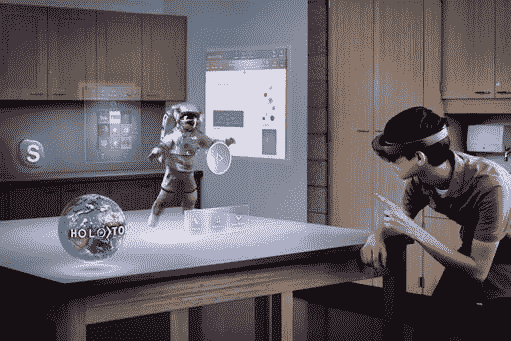

图 2:全息镜头带来的混合现实体验。

Windows 10 也是一个新旅程的开始，因为它引入了一个全新的生命周期模型。在过去，微软通常每 3-4 年发布一个新版本的操作系统，其间有一系列服务包。这些主要是补丁和安全修复的集合，以使计算机更加安全，并支持可能已经发布的新技术(如 USB 3.0)。

这种方法不再适合当前的数字世界，在这个世界里，事物的变化速度要快得多。每年我们都会看到新的趋势和新的颠覆性技术，所以 3-4 年的时间太长了，无法跟上所有这些变化。

正因如此，Windows 10 推出了一个名为 **Windows 即服务**的新模式，这让许多科技记者将其定义为“Windows 的最后一个版本。”从技术上来说，这个定义是对的，但不是因为微软要在 Windows 10 发布后退出操作系统业务，而是因为随着时间的推移，Windows 10 将通过添加新功能不断发展。

更新频率将高于传统的 service pack 方法(大约，微软将每年发布两次更新)，每次更新不仅会带来通常的补丁和安全更新(需要时将继续定期提供)，还会为用户带来新功能，为开发人员带来新的 API。

每个主要更新对应于一个特定的内部版本号和一个特定的 SDK 版本。让我们看看目前为止发布的版本。

Windows 10 的原始版本于 2015 年 7 月 29 日全面向公众发布，并以内部版本号 10240 进行了标识。这个版本专用于传统的桌面和平板设备:在发布的时候，Windows 10 的移动版本还没有准备好。

第一个版本的目标是使视窗 8 成为一个更现代的操作系统，也针对触摸设备进行了优化，同时仍然保持用户自视窗 XP 以来一直欣赏的熟悉的视窗体验。

以下是一些最重要的新增或改进功能。

#### “开始”菜单

Windows 8 引入了一个完全改进的开始菜单，灵感来自 Windows Phone 开始屏幕，并针对触摸设备进行了极大的优化，提供了全屏体验、实时切片等。

然而，许多 Windows 用户发现使用起来很有挑战性，因为这是一种与其前辈完全不同的方法。此外，全屏体验迫使用户在需要打开新应用程序或执行另一项任务时，不断将注意力从桌面上的任务转移到“开始”菜单。

Windows 10 引入了一个新的“开始菜单”，提供了两全其美的体验:熟悉的视觉体验，它只占屏幕的一小部分，并显示计算机上安装的所有应用程序的字母列表，以及一个额外的工作区，用于显示切片、联系人、音乐播放列表等。

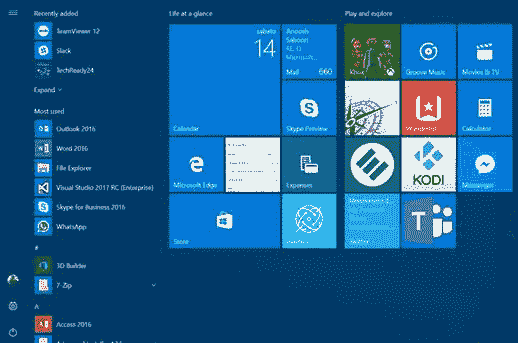

图 Windows 10 中新的开始菜单。

但是，Windows 10 还提供了一个名为**平板模式**的功能，可以使用操作中心中的选项手动激活，或者一些二合一设备(如 Surface)可以在检测到键盘已被卸下时自动启用。启用此模式后，您可以获得完全优化的触控设备体验，这更像是 Windows 8.1 中的体验。“开始屏幕”和“通用视窗平台”应用程序都以全屏显示，如下图所示。

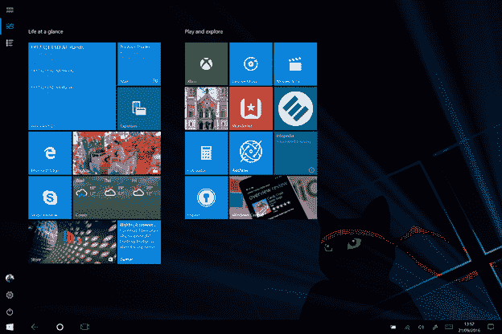

图 Windows 10 在平板电脑模式下运行时的开始菜单。

Windows 8 已经引入了 Windows 商店应用程序的概念。它们构建在 Windows Runtime 之上，可以从集中的 Store 下载，使整个安装/卸载/升级体验变得更简单，更像我们在所有主要移动平台上找到的体验。

然而，在 Windows 8 和 8.1 上，Windows 商店应用程序有一个缺点:它们只能在全屏模式下运行，当用户想要从传统的桌面应用程序(如 Word 或 Photoshop)切换到新的现代应用程序时，会迫使他们无法专注于当前的任务。正因为如此，这些新应用确实受到了拥有平板电脑或二合一设备(配备触摸屏)的用户的青睐，但拥有传统鼠标和键盘的电脑的用户并不经常使用它们。

视窗商店应用程序(称为通用视窗平台应用程序)现在能够在窗口内运行，就像其他传统桌面应用程序一样。因此，这些现代应用程序可以与传统应用程序并行使用，使它们在传统台式计算机上更容易使用。此外，运行在桌面上的通用视窗平台应用程序可以利用桌面世界特有的一些功能，比如支持在窗口中拖放内容。

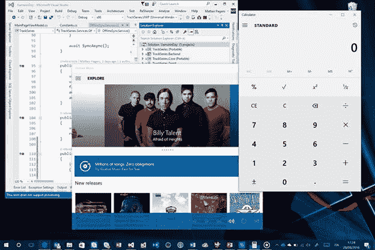

图 5: Visual Studio，这是一个传统的桌面应用程序，与两个通用 Windows 平台应用程序并行运行:Calculator 和 Groove Music。

这个功能直接继承自 Windows Phone 8.1，它也被称为通知中心。每当我们的一个应用程序向我们发送通知时(例如，当我们在推特上收到新的电子邮件或新的提及时)，它都会存储在行动中心，这样它就不会因为我们在收到时没有注意屏幕而丢失。此外，行动中心包含一组快速行动按钮，可快速打开或关闭蓝牙、飞机模式、虚拟专用网设置等功能。

在桌面上，通过单击屏幕右下角的图标或在触摸屏设备上从屏幕右侧轻扫来激活动作中心；在 mobile 上，它是通过从屏幕顶部滑动到底部来显示的。

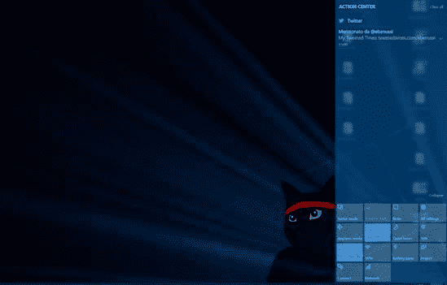

图 6:桌面版 Windows 10 中的操作中心。

Cortana 是 Windows Phone 8.1 中首次引入的另一项新功能，后来扩展到所有设备的 Windows 10。Cortana 是一个数字助手，我们可以使用它来快速获取关于某个主题的信息(例如从家到办公室需要多长时间)，根据时间或位置设置提醒，获取与我们相关的主题的通知，跟踪我们白天的约会等等。只需在搜索框中输入我们的请求，一切都可以实现，但我们也可以利用更自然的方式，如语音和墨迹。随着周年纪念的更新，Cortana 得到了进一步的扩展，即使电脑被锁定，用户也可以与她互动。

Cortana 对开发人员来说也很重要，因为我们有一套 API 可以将她集成到我们的应用程序中，允许用户只通过说话来执行任务，而不必打开应用程序或解锁他们的设备。

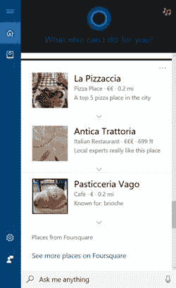

图 Windows 10 上的 Cortana 正在显示当前位置附近最好的餐馆的信息。

微软边缘是一个新的浏览器，它取代了互联网浏览器作为 Windows 10 中的默认浏览器。Edge 是从零开始构建的，目标是支持所有现代网络技术，并消除所有遗留代码和插件，这些代码和插件通常是安全和性能问题的原因。Edge 背后的理念和 Windows 10 背后的理念是一样的:虚拟世界发展很快，所以每 2-3 年发布一个新版本的浏览器已经不可持续了，尤其是当竞争对手每周都发布他们浏览器的新版本时。

Edge 提供了出色的性能，支持最新的网络标准，尽管它使用了自己的开源引擎(Chakra)，但它与其他引擎(如 WebKit)提供的所有功能完全兼容，WebKit 是非常受欢迎的浏览器，如 Chrome 和 Safari。

在这种情况下，Edge 不仅仅是一个消费者功能。开发人员还可以利用其引擎创建基于网络的应用程序，或将网络功能集成到他们的通用视窗平台应用程序中。

11 月的更新由内部版本号 10586 确定，于 2015 年 11 月发布，标志着移动设备平台的首次正式发布。它没有添加任何主要的新消费功能，但它通过完善“开始”菜单和平板电脑模式，通过将 Cortana 扩展到新市场，以及通过为开发人员添加具有新 API 和功能的新 SDK(如新的动画系统)，继续改善 Windows 10 体验。

周年更新是在最初的 Windows 10 版本发布一年后发布的，其版本号为 14393。此次更新扩大了开发人员可以瞄准的设备系列。事实上，这个版本也是为 Xbox One 发布的，它带来了其他版本(如 Cortana)和通用视窗平台的一些功能，并允许应用程序在游戏控制台上运行。跨设备发布的唯一例外是游戏。如果你是游戏开发者，你的游戏还是需要通过 ID@Xbox 程序提交得到微软的认可(可以在[官网](http://www.xbox.com/en-us/Developers/id)找到更多信息)。

从消费者的角度来看，周年更新增加了一些值得注意的功能，如对 Edge 的扩展支持、多个跨平台设备之间的通知同步(不仅支持 Windows 10 Mobile，还支持 Android)，以及新的和改进的内置应用程序，如新版本的 Skype。墨迹支持也得到了极大的改进，一系列新功能(对开发人员和消费者都是如此)使得 Windows 10 非常适合在支持的设备上与数字笔一起使用，比如 Surface 系列。

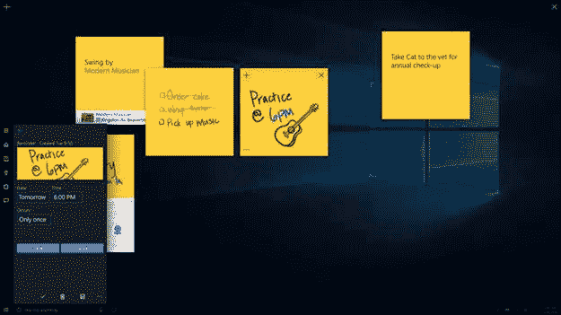

图 Windows 10 周年更新中的 Windows 墨迹工作区。

从开发人员的角度来看，除了发布带有一组新 API 的新 SDK(将在本书中详细讨论)之外，它还引入了两个新的重要特性:

*   【Linux 的 Windows 子系统是由 Ubuntu 开发的用户空间，在 Windows 内部原生运行，允许开发人员使用 BASH shell 的原生版本。该特性遵循微软所采用的开源方法，允许熟悉 UNIX 工具的开发人员以本机方式使用它们，而不必使用 Linux 创建单独的虚拟机。这个特性尤其受到 web 开发人员的欢迎，它允许您使用 UNIX 命令行工具创建 web 项目，但使用像 Visual Studio 这样的 Windows 工具进行编辑，从而有助于两全其美。
*   **桌面桥**，以前被代号为 Project Centennial 所知，是一系列允许传统 Win32 应用程序(基于像。NET 框架、VB6、Java 等。)打包成 UWP 应用程序，以传统方式分发，但也可以在商店中与标准 UWP 应用程序一起分发。多亏了桌面桥，您将能够将传统的桌面应用程序带到商店，同时开始利用 Win32 应用程序中的一些 UWP 应用程序接口和功能，而不必从头重写为通用 Windows 平台应用程序。

Windows 10 Creators Update 是最新版本的操作系统，于 2017 年 4 月 11 日<sup>开始正式上线。顾名思义，这个新版本的主要目标受众是创作者:除了通常对整体操作系统的改进(比如更好地支持高 DPI 设备；一种夜间模式，使电脑在夜间使用时眼睛不那么疲劳；更一致的设置体验等。)，它增加了一套专门针对制造商、设计师、游戏玩家和游戏开发者的新应用程序和工具。</sup>

一些最有趣的新功能包括:

*   **绘制 3D** ，这是世界上最著名的图形应用之一的新版本。顾名思义，3D 绘画可以用来创建 3D 模型，这些模型可以很容易地导出，并使用流行的工具在三维应用程序中重用。
*   **Windows Mixed Reality** :这是一个面向消费者和开发者的全新平台，它汇集了探索全新 Mixed Reality 生态系统的所有努力，最初由 HoloLens 推出，现在由于微软合作伙伴生产的新一代设备而被推向大众，这将使全息和沉浸式体验融合在一起。混合现实将现实世界和虚拟内容融合在一起，创造引人入胜的交互体验，无论您是要利用沉浸式体验还是全息体验，这两种体验都由同一个平台提供，允许:

*   开发人员创建三维体验，可以很容易地适应和消费这两类设备。
*   用户，无论是游戏还是教育应用，都能在每个耳机上获得共同的虚拟体验和混合现实体验。

*   **游戏:**Creators Update 是游戏玩家的完美操作系统，提供了 Game DVR(记录游戏会话)、Broadcasting(将游戏会话流式传输给其他 spectactors)或 Game Mode(将机器的所有硬件能力集中在游戏上，使其能够以最佳方式运行)等一系列功能。开发人员也可以利用这些游戏功能，在 Xbox One 和 PC 上提供相同的游戏；通过添加一个 SDK 来集成 Xbox Live 功能，如成就、排行榜等。

这本书基于创作者更新，因此，将涵盖 15063 构建软件开发工具包中引入的大多数功能和应用编程接口。

与此版本 Windows 相关的另一个重要公告是 **Windows 10 S** 的发布，这是 Windows 10 的一个特殊版本(基于 Creators Update)，从 2017 年夏天开始，将在许多计算机和二合一设备上发布(包括微软制造的名为 **Surface 笔记本电脑**的新设备)。它特别致力于教育领域和希望系统尽可能安全和快速的用户，即使在使用多年后。事实上，Windows 10 S 只支持从 Windows Store 获取应用程序，这使得普通用户几乎不可能安装广告软件、恶意软件或经典桌面应用程序，因为它们会降低系统速度。然而，桌面应用程序仍然可以从商店获得和下载，这要归功于桌面桥，这是在 Windows 10 周年更新的描述中引入并已经提到的技术。

Windows 10 还引入了定价模式的重大变化。首次向所有现有的微软客户免费提供了 Windows 版本的更新。在一年的有限时间内(从 2016 年 7 月 29 日至 2017 年 7 月 29 日)，Windows 10 已通过 Windows Update 免费提供给所有现有的 Windows Vista、Windows 7 或 Windows 8.1 用户。

如前所述，从用户体验的角度来看，Windows 8 并不是对过去的突破，对开发者来说也是如此。它引入了视窗商店应用程序的概念，基于一个名为视窗运行时的新框架，而不是依赖。NET 框架，开发人员几年前已经学会使用它来创建桌面和网络应用程序。这是一个构建在 Windows 内核之上的本机运行时，提供了一组应用程序可以用来与硬件和操作系统交互的 API。它使用了与基于组件对象模型的旧方法相似的方法，组件对象模型创建于 1993 年，目标是定义一个可以用不同语言访问的单一平台。

Windows Runtime 采用了类似的方法，引入了语言投影，这是在运行时之上添加的层，允许开发人员使用众所周知和熟悉的语言与 Windows Runtime 进行交互，而不是强迫他们只学习和使用 C++。现有的预测是:

*   **XAML 和 C# 或 VB.NET**:**这个投影允许你使用 C# 或 VB.NET 为逻辑创建应用程序，而 XAML 定义布局。它是用。NET 框架。**
***   **HTML 和 JavaScript** :这是网络开发者最欣赏的投影，因为它允许他们使用网络技术来创建应用。应用程序的布局是使用 HTML5 定义的，而逻辑是基于一个名为 WinJS 的特殊库，该库允许使用 JavaScript 访问 Windows Runtime APIs。*   **XAML 和 C++** :这个投影可以使用一个叫做 C++ / CX 的 C 扩展来创建原生应用程序，这使得开发人员更容易使用 C++与 Windows Runtime 进行交互。*   **C++和 Direct X** :这个投影对于游戏特别有用，因为它允许你创建本地应用程序，利用 Direct X 库提供的所有强大功能来渲染二维和三维图形。**

 **视窗运行时库(称为**视窗运行时组件**)是使用特殊元数据文件描述的，这使得开发人员可以使用他们正在使用的语言的特定语法来访问应用编程接口。这样，投影也可以尊重语言约定和类型，如使用 C# 时使用大写，使用 JavaScript 时使用 camel 大小写。此外，Windows 运行时组件可以跨多种语言使用。例如，用 C++编写的 Windows Runtime 组件可以被用 C# 和 XAML 开发的应用程序使用。

通用视窗平台可以被认为是视窗运行时的继承者，它建立在相同的技术之上。事实上，如果你已经对 Windows 8.1 和 Windows Phone 8.1 的 Windows Store 应用开发有一定的经验，你会发现自己就像在家里一样。通用视窗平台增加了许多新功能，并带来了所有平台的统一，但大多数应用编程接口和功能与您在视窗商店应用程序开发中学习使用的相同。这是一个好消息，因为它有助于保持从 Windows 8.1 到 Windows 10 的学习曲线非常平缓，不像在带有 Silverlight 的 Windows Phone 8 和带有 Windows Runtime 的 Windows Phone 8.1 之间的转换中发生的情况。事实上，在当时，这两种技术之间的转变是相当激进的，尽管共享相同的基本概念，但基本上所有的 API 和 XAML 控件都是不同的，这迫使开发人员重写大部分现有的代码库以瞄准新平台。

通用视窗平台最重要的特点是，它在每个平台上都提供了一套通用的应用编程接口。无论应用程序运行在桌面、手机还是全息镜头上，您都可以使用相同的应用编程接口来实现相同的目标。下图显示了通用视窗平台在整个视窗 10 架构中的位置:每个设备，尽管有不同的外壳，但都共享相同的内核，即视窗核心。在核心之上，通用视窗平台提供了一套一致的应用编程接口来访问核心公开的所有功能，如网络访问、存储、传感器等。视窗应用程序运行在通用视窗平台之上，是一个单一的二进制包，不像视窗 8.1，你必须处理一个手机包和一个电脑包。

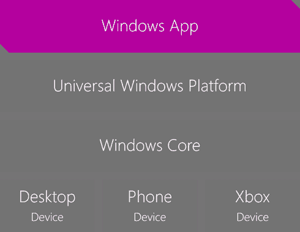

图 9:面向开发者的 Windows 10 生态系统。

通用视窗平台的另一个重要变化是，当涉及到 C# 和 XAML 项目时，它没有利用标准。NET 框架，而是一个新的现代框架，叫做。NET 核心。

。NET Core 可以被认为是。NET 框架。它是遵循微软新原则从零开始构建的:[开源](http://github.com/dotnet/corefx)跨平台。采纳。NET Core 使代码库中不特定依赖于平台的部分(如网络通信)与其他项目的重用变得更加容易，无论它是网络应用程序还是传统的桌面应用程序。然而，重要的是要理解，这并不意味着通用视窗平台应用程序也可以在安卓和 iOS 等竞争平台上运行。事实上，通用视窗平台是建立在。它利用了它的公共基础，但是增加了一组特定于窗口的应用编程接口和特性。

的跨平台性质。在撰写本文时，NET Core 尤其可以被 web 开发人员利用。由于有了这个新框架，您将能够创建基于 ASP.NET 的网络应用程序，这些应用程序不再被迫只在运行 IIS 的 Windows 服务器上运行，但也可以托管在 Linux 和 OS X 上

本系列书籍致力于探索用 C# 和 XAML 开发通用视窗平台应用程序。将在接下来的章节中描述的所有概念和特性都可以被任何支持的语言所利用，但是本书中发布的所有代码示例都将使用 C# 和 XAML 语言。

有一组通用的 API 作为目标是很好的，因为它有助于在每个平台上最大限度地重用代码。然而，即使它们共享相同的 Windows Core，每台设备都有一些独特的优势。例如，桌面通常由鼠标和键盘控制，因此桌面应用程序的典型要求是支持拖放；相反，手机可以有一个专用的摄像头按钮来快速拍照，这是 PC 或平板电脑通常没有的；树莓 Pi 3 提供了一个集成电路(称为 GPIO)，您可以在其中连接各种传感器和设备，如 led、温度传感器或湿度传感器，但这是只有 IoT 设备才能提供的功能，在 PC 或手机上找不到。

Windows 10 如何处理这样一个事实，即它为每个平台(通用 Windows 平台)都有一套通用的 API，但仍然必须允许开发人员利用每个平台提供的特定功能？

答案是**扩展 SDKs** ，这是一组额外的库，可以直接通过 Visual Studio 添加到 UWP 应用程序中，并且包含一组特定于每个平台的 API。因此，你会发现一个**视窗桌面扩展**库，一个**视窗物联网扩展**库等。

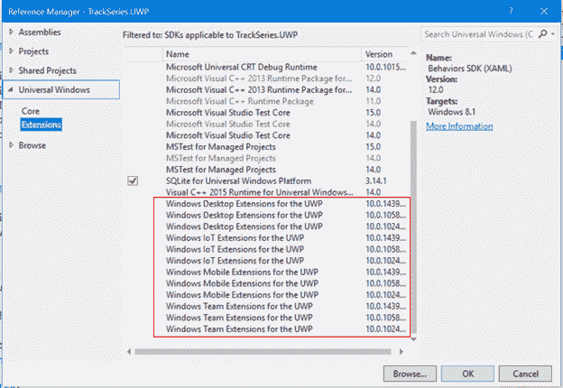

图 10:通用视窗平台可用的各种扩展软件开发工具包。

这些扩展中包含的应用编程接口可在基本的通用视窗平台上获得。因此，即使您要将其中一个或多个添加到您的项目中，您也总是能够毫无问题地编译它。然而，在所有不支持这些 API 的平台上，它们并没有真正实现:你可以把它们看作是存根 API。它们是声明的，各种类和方法都是可用的，但是它们并没有真正实现。因此，它们只能在为其设计的平台上工作。如果你试图在一个不支持它的平台(比如桌面计算机)上执行一些特定于平台的代码(比如访问相机按钮)，你会在运行时得到一个异常。

为了正确处理扩展 SDK，我们需要引入另一个概念，这个概念对于那些对 web 开发有一定经验的人来说是熟悉的:**能力检测**。在新 web 时代的开始，当像 JavaScript、HTML5 和 CSS3 这样的技术打开了强大的新可能性时，开发人员开始利用浏览器检测等技术来测试是否有可能执行一些代码或使用特定的 HTML5 功能。然而，这种方法很快开始显示出它的局限性:浏览器开始快速发展，像谷歌和火狐这样的公司每周都会发布一个新版本。对于网络开发者来说，维护一个需要检查所有可用的浏览器和版本组合的网站是不可能的。因此，web 已经开始从版本检测方法转向能力检测方法。开发人员不再检测浏览器的类型和版本，而是开始检查是否支持特定的功能(例如，没有插件的视频播放)。这样，网站开始独立于浏览器。如果微软 Edge 或谷歌 Chrome 的新版本决定实现该网站正在使用的功能，它将自动开始工作。

同样的方法现在也可以应用于 Windows 10。在“视窗即服务”模式下，检查应用程序是否在特定版本上运行不再有意义，因为功能和应用程序接口实现可以在每个版本之间快速变化。因此，开发人员现在需要检查应用程序接口是否在运行该应用程序的平台上正确实现。

例如，假设您创建了一个强大的照片编辑应用程序，只有当它在手机上运行时，才应该能够利用物理相机按钮来快速允许用户拍摄照片。在旧的 Windows 世界中，我们会编写如下代码:

代码清单 1

```cs
Windows.Phone.UI.Input.HardwareButtons.CameraPressed += CameraButtonPressed;
```

UWP 的**视窗移动扩展提供了一个名为`HardwareButtons`的类，它是`Windows.Phone.UI.Input`T2 命名空间的一部分，允许你处理手机上的不同按钮。其中一个是相机按钮，所以我们可以简单地订阅`CameraPressed`事件，并声明一个事件处理程序，该程序将包含触发时获取照片的代码。**

但是，如果您的应用程序运行在桌面或 Xbox One 上，它一启动，就会引发如下异常:

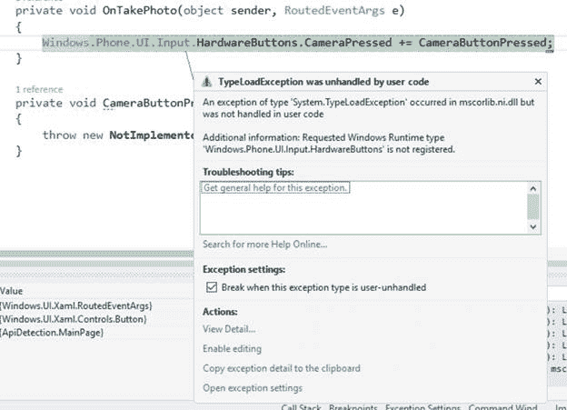

图 11:当您试图使用当前设备不支持的应用编程接口时引发的异常。

这是因为`HardwareButtons`类在 Universal Windows 平台中是可用的(否则，您的项目将无法编译，因为二进制包是通用的)，但是它没有在桌面上实现。

这就是能力检测概念的由来。通用视窗平台包括一组应用编程接口，可用于在运行时检测应用编程接口是否可用和实现。因此，在使用特定于平台的应用编程接口之前，您总是必须调用这些应用编程接口来检测该功能是否真正得到支持。

这个应用编程接口被称为`ApiInformation`，它是`Windows.Foundation.Metadata`命名空间的一部分。它提供了许多方法来检查各种类型的实现和条件。在前一个简单 API 的情况下，我们需要使用一个名为`IsTypePresent()`的方法，将一个字符串作为参数传递，该字符串带有我们试图使用的类的完整命名空间。下面是我们之前的代码在一个合适的 UWP 应用程序中应该是什么样子:

代码清单 2

```cs
  string api = "Windows.Phone.UI.Input.HardwareButtons";
  if (Windows.Foundation.Metadata.ApiInformation.IsTypePresent(api))
  {

  Windows.Phone.UI.Input.HardwareButtons.CameraPressed += CameraButtonPressed;
  }
```

该方法(像其他由`ApiInformation`类提供的方法一样)返回一个`bool`，它将告诉你你所请求的特性是否被实现。在前面的示例中，只有当应用程序运行在实现了`HardwareButtons`类的平台上时，我们才会订阅`CameraPressed`事件处理程序。

如果您再次考虑前面提到的 web 场景，应该很清楚这种方法的优势。在任何时候，如果另一个 Windows 10 平台决定开始支持一个应用编程接口，您的应用程序将准备好处理它，而不需要您更改代码和发布更新。

作为开发人员，窗口即服务方法引入了一个我们以前不必面对的挑战。过去，当我们开始创建一个应用程序时，通常我们针对的是特定版本的 Windows。如果我们创建了一个 Windows Phone 8.1 应用程序，它就不能在 Windows Phone 8.0 上运行。此外，我们确切地知道允许我们使用哪些特性和应用编程接口，因为我们针对的是具有自己的软件开发工具包和一组应用编程接口的特定版本的操作系统。

相反，新的 Windows 10 方法引入了潜在的碎片化问题。当我们创建一个应用程序时，我们以特定的 Windows 10 SDK 为目标，但是我们事先不知道用户的设备上有哪个版本的 Windows 10。

同样在这种情况下，就像我们使用扩展 SDK 一样，我们可以利用能力检测来解决这个问题。当您在 Visual Studio 中创建新的通用 Windows 平台应用程序时，您将看到以下消息对话框:

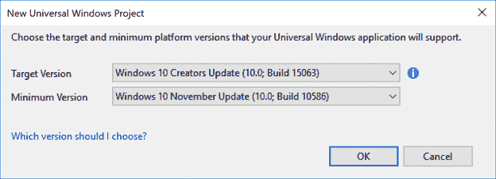

图 12:在 Visual Studio 中创建新的通用 Windows 平台应用程序时显示的对话框。

如您所见，您可以为您的应用程序设置一个**最低版本**和一个**目标版本**。第一个参数定义了应用程序支持的最小 Windows 10 版本。如果用户的版本比最低版本旧，他们将根本无法安装应用程序。相反，第二个参数定义了应用程序可以利用的一组 API。如果应用程序运行在与目标软件开发工具包版本相同(或更新)的设备上，它将能够利用软件开发工具包中包含的所有功能。

上图显示了在安装了 Creators Update SDK 的 Visual Studio 2017 中创建新项目时的默认配置:

*   最低版本设置为 Windows 10 版本 15063(创建者更新)。
*   目标版本设置为 Windows 10 版本 10586(11 月更新)。

这意味着该应用程序可以在具有 11 月更新的设备上运行，但是如果它在已经使用 Creators Update 的设备上运行，您可以利用该版本中包含的新 API 和功能。从代码的角度来看，您可以用与我们之前使用扩展 SDK 相同的方式来处理这个场景。在使用仅在创建者更新中可用的功能之前，您将使用`ApiInformation`类，否则仍在运行 11 月更新的人一旦尝试使用该功能将面临崩溃。

例如，以下示例代码显示了如何利用与周年更新中添加的动画相关联的功能，但避免应用程序在旧设备上运行时崩溃。

代码清单 3

```cs
  if (ApiInformation.IsTypePresent("Windows.UI.Xaml.Media.Animation.ConnectedAnimationService"))
  {

  ConnectedAnimationService cas =
  ConnectedAnimationService.GetForCurrentView();

  cas.PrepareToAnimate("ImageSeries", imgSeries);
  }
```

此外，为了缓解碎片问题，微软采用了新的更新策略。过去，Windows 用户可以禁用 Windows Update，并决定不使其计算机保持最新的补丁和修复程序。微软一直不鼓励这种方法，尤其是出于安全考虑。在一个恶意开发人员不断试图窃取用户数据或侵犯其隐私的世界里，保持操作系统始终与所有最新补丁保持同步至关重要。

有了 Windows 10，只有企业用户(安装了 Windows 10 Enterprise)才能控制更新节奏，因为我们通常谈论的是通常安装在大型企业等复杂环境中的 Windows 版本，它有许多遗留问题，但关键应用程序需要针对每个 Windows 更新进行测试，以确保一切继续正常运行。Windows 10 Home 和 Pro 用户可以推迟更新，但只能推迟很短的时间；他们可以选择最符合自己需求的日期和时间(避免更新过程在重要任务中间开始)；然而，他们不能决定不安装 Windows 10 更新。因此，可能需要一段时间才能让每个用户在同一个版本上保持一致(因为通常情况下，微软会逐步部署 Windows 10 更新，以最大限度地减少潜在的部署问题)，但在某个时候，每个 Windows 10 用户都将在同一个版本上。这种方法让开发人员有信心，在新更新发布后的短时间内，他们将能够利用应用程序中的所有新功能和应用编程接口。

通用视窗平台引入的另一个重要功能是。NET 原生语言。在旧的 Windows Phone 时代，应用程序的构建过程是。NET 框架，它利用了即时编译。这意味着 Visual Studio 输出是一个包含中间代码的包，该包在应用程序第一次执行时直接在设备(在平台的初始版本中)或云(使用 Windows Phone 8.1 版本)上转换为本机代码。

。NET Native 是一项新技术，它允许您直接用本机代码编译您的通用 Windows 平台应用程序，引入了许多优势:

*   更好的性能
*   更快的启动时间
*   更小的内存占用

的坏处。NET Native 是因为它使调试体验更加复杂，因为代码不再被管理，因此堆栈跟踪更难破译。此外，本机编译比托管编译需要更长的构建时间。因此，默认情况下，当一个项目在 Visual Studio 中设置为调试模式时，它将按照传统方式进行编译，从而为您提供通常的出色调试体验和快速构建时间。。NET Native 将仅在您准备以发布模式执行编译时启动，这通常发生在您准备在存储上发布应用程序或在您的企业环境中分发它的时候。

然而，有一个重要的方面。请记住。如果你以前有过一些开发 Windows 商店应用程序的经验，你会记得你可以使用任何中央处理器作为目标平台来构建你的应用程序。通过这种配置，您最终得到了一个针对多种体系结构交叉编译的包，并且可以在任何设备上运行，无论它是基于 x86、x64 还是 ARM 体系结构。

这是托管架构允许的特定功能。相反，本机代码不能交叉编译。正因为如此，在 Universal Windows Platform 应用程序中，您将无法再在项目的配置中找到 **Any CPU** 平台，但您必须根据您部署应用程序的位置选择正确的平台(例如，如果您在桌面上测试它，则选择 x86 如果您在手机或树莓 Pi 上启动它，则选择 ARM)。

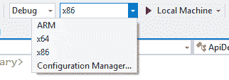

图 13:通用视窗平台应用程序不再支持 AnyCPU 配置。

然而，正如我们将在本书系列的最后一部分中看到的，这一要求并没有改变我们在商店中分发应用程序的方式。得益于名为**包捆绑包**的功能，我们将能够创建一个包，其中包括针对每个架构编译的应用程序，然后由商店根据用户的设备向用户分发适当的版本。

开发通用视窗平台应用的工具，已经被多次提及，就是 **Visual Studio。**最近的版本是 **Visual Studio 2017** ，如果你想针对创作者更新 SDK，这是你需要的版本。Visual Studio 2015 也支持通用视窗平台应用程序的开发，但支持的最大软件开发工具包是周年更新(14393)。Visual Studio 2015 和 Visual Studio 2017 都有不同的版本:

*   **社区版**，可从[http://www . visualstudio . com/en-us/products/visual studio-Community-vs](http://www.visualstudio.com/en-us/products/visual-studio-community-vs)下载。这是一个完全免费的版本，具有专业版提供的相同功能，个人开发者、学生、开源项目开发者和小公司都可以使用。
*   两个版本专门面向专业开发人员和公司，称为**专业**和**企业**，可以单独购买，也可以通过 MSDN 订阅购买。这些不仅让您可以访问 Visual Studio，还可以访问用于开发和测试目的的所有微软产品，此外还有许多其他好处(如 Azure 上的每月点数、为商店创建开发人员帐户的免费令牌等)。)

但是，关于通用视窗平台应用程序的开发体验，您不会在社区版本中发现任何差异或限制。您将能够像使用专业版的 Visual Studio 一样创建和发布应用程序。如果你是学生，还可以查看 [DreamSpark 程序](https://www.dreamspark.com/)，可以免费获得所有微软专业工具。

由于本书讲述的是最新版本的 Windows 10，即 Creators Update，我们将使用最新版本的 Visual Studio 作为参考，即 2017 版。与以前的版本相比，这个新版本向前迈进了一大步，这要归功于更轻量级的安装程序(这很容易允许开发人员只安装他需要的工具)和更敏捷的开发方法(这意味着更频繁的更新，以便更快地修复社区发现的错误)。

[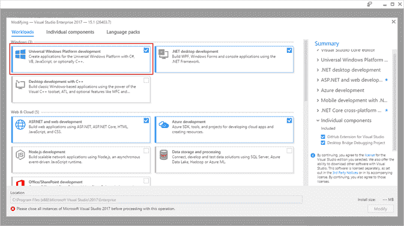](../../mpagani/AppData/Local/Temp/OpenLiveWriter-1477819595/supfiles12AF57C4/sdk5.png)

图 14:确保在 Visual Studio 2017 安装程序中检查通用 Windows 应用程序开发工具，以安装开始开发 UWP 应用程序所需的一切。

当然，开始开发通用视窗平台应用程序的最佳环境是视窗 10。但是，通用 Windows 应用程序开发工具也可以安装在 Windows 8.1 或 Windows 7 上，但有以下限制:

*   在 Windows 8.1 上，XAML 设计器不起作用，您必须在远程设备(如 Windows 10 平板电脑或树莓 PI 3)、通过 USB 电缆连接的 Windows 10 移动电话或 Windows 10 移动模拟器上部署该应用程序。您不能在本地启动该应用程序，因为 Windows 8.1 不包括通用 Windows 平台。
*   在 Windows 7 上，除了与 Windows 8.1 相同的限制之外，您不能使用 Windows 10 Mobile 模拟器，因为它基于一种技术(Hyper-V)，该技术是在 Windows 8.1 的消费版 Windows 上首次引入的。

最低硬件要求是一台具有 1.6 千兆赫处理器、1 GB 内存和至少 4 GB 硬盘可用空间的计算机。但是，如果您计划使用 Windows Mobile 模拟器，您还需要:

*   专业版或企业版 Windows 10 64 位版本。
*   能够支持 SLAT 的处理器，SLAT 是 Hyper-V 所需的硬件芯片，Hyper-V 是微软开发的微软虚拟化技术，用于运行仿真器。发布在[http://blogs . msdn . com/b/dev fish/archive/2012/11/06/you-are-slat-compatible-wp8-SDK-tip-01 . aspx](http://blogs.msdn.com/b/devfish/archive/2012/11/06/are-you-slat-compatible-wp8-sdk-tip-01.aspx)上的帖子将向您展示如何检测您的 CPU 是否支持此功能。
*   至少 4 GB 内存(如果您计划同时运行多个仿真器，建议使用 8 GB 内存)。

此外，微软还发布了名为 **Visual Studio Preview** 的 Visual Studio 2017 特别版，其中包含了所有仍处于测试阶段的新功能和扩展。此版本可以与常规版本并排安装，允许您测试新功能，同时保持生产的开发环境干净稳定。您可以从[https://www.visualstudio.com/vs/preview/](https://www.visualstudio.com/vs/preview/)下载预览版

假设您遵循最简单的方法来配置开发环境，即直接在 Windows 10 机器上安装 Visual Studio 2017，那么根据目标设备，有多种方法可以测试您的应用程序。

要在传统的台式机或平板电脑上测试您的应用程序，最简单的方法就是在安装 Visual Studio 的同一台机器上启动调试器。要使用这种方法，需要解锁电脑进行开发，只需打开 Windows 设置，选择**更新&安全**，启用【开发人员的 T4】部分下的**开发人员模式**选项即可。完成这一步后，您只需在 Visual Studio 的调试器下拉列表中选择**本地机器**作为目标，即可在本地启动您的应用程序。


图 15:如何在 Windows 10 中启用开发者模式。

如果你想测试一些你的开发机器没有的功能(例如，如果你没有像 Surface Pro 这样的支持触摸的设备)，你可以在另一个设备(比如 Windows 10 平板电脑)上安装该应用，并使用 Visual Studio 2017 的**远程工具，该工具可以从 Visual Studio 2017** 部分的**工具下的[https://www.visualstudio.com/downloads/](https://www.visualstudio.com/downloads/)下载。一旦您安装了它，您将能够从您的开发机器连接到这个设备。唯一的要求是它们应该在同一个网络上。要使用这种方法，您必须在调试器下拉列表中选择选项**远程机器**作为目标。系统会询问您一些关于目标设备的信息，如其 IP 地址或网络名称。**

另一个选择是使用**模拟器**，这是一个特殊的应用程序，将针对您现有的 Windows 安装启动远程桌面会话。模拟器的优势在于，它提供了一套工具来模拟难以用物理机器测试的场景，如网络速度、地理位置或不同的分辨率和比例因子。

如果你想测试你的应用的移动版本，你可以使用一个物理的 Windows 10 Mobile 设备，比如 Lumia 950 或者 Lumia 550。您必须首先解锁设备进行开发。由于 Windows 10 在每个平台上共享相同的核心和相同的用户体验，您可以按照针对桌面描述的相同步骤在手机上启用开发人员模式。

只有用 USB 线将手机连接到开发机上，才支持部署和调试；然后，可以在 Visual Studio 2015 的调试器下拉菜单中选择**设备**。

如果您的机器支持，另一个选择是使用 Windows 10 Mobile 模拟器，它支持一组附加功能，使某些场景更容易测试。例如，您可以伪造设备的位置(以测试利用地理定位服务的应用程序)，您可以模拟传入的通知或 SD 卡，您可以测试不同的网络条件等。

要在 Windows 10 Mobile 模拟器上部署和调试应用程序，可以在调试器下拉列表中选择一个可用的映像。模拟器有多个版本来模拟不同的屏幕尺寸和硬件功能(如高分辨率屏幕或低内存设备)。

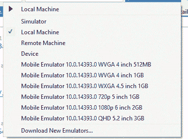

图 16:可用于在 Windows 10 移动设备上测试应用程序的各种仿真器。

Windows 10 IoT Core 自带已经安装的 Visual Studio 2017**远程工具**的特殊版本，默认在你启动设备时启动。因此，要在 Windows 10 物联网核心上部署和调试 UWP 应用，您必须在调试器下拉菜单中选择**远程机器**目标，并指定您的物联网设备的 IP 地址或网络名称，该设备需要连接到开发机器的同一网络。

从测试的角度来看，全息透镜是我们目前看到的所有其他测试模式的混合:

*   通过使用 USB 电缆将应用程序连接到电脑，您可以直接在设备上部署应用程序。在这种情况下，您可以选择**设备**作为目标，就像使用 Windows 10 手机一样。
*   您可以通过选择**远程机器**作为目标并指定全息镜头的 IP 地址来远程部署您的应用程序。
*   您也可以在模拟器上测试它们。但是，与移动仿真器不同的是，HoloLens one 不会自动安装在 Visual Studio 中，因此您必须从[https://developer . Microsoft . com/en-us/windows/全息/install_the_tools](https://developer.microsoft.com/en-us/windows/holographic/install_the_tools) 中单独安装。

开发人员模式不是内置在控制台中，而是需要在控制台上直接安装和启动一个单独的应用程序。这个应用叫做**开发模式激活**，你必须在 Xbox One 商店上搜索它。一旦您第一次安装并启动了它，应用程序就会给你一个代码，如下图所示:


图 17:在 Xbox One 上激活开发模式的代码。

一旦你有了代码，你就可以在你的电脑上打开你的浏览器，前往网址:[https://developer.microsoft.com/xboxactivate](https://developer.microsoft.com/xboxactivate)。它将带您进入开发中心的一个特定页面(您提交和管理应用程序的门户，我们将在本书的第二部分讨论它)，您可以在那里插入代码。

此时，您的 Xbox One 将被解锁，通过使用开发模式激活应用程序，您将能够从标准零售模式(在该模式下，您可以玩游戏、使用应用程序、与朋友聊天等)切换您的控制台。)到开发模式，这将启动 Visual Studio 2017 的**远程工具。**之后，在控制台上调试您的 UWP 应用程序的过程与我们看到的相同，例如，使用物联网核心设备。您必须从调试下拉菜单中选择**远程机器**选项，并指定您的 Xbox One 的 IP 地址(一旦您的控制台处于开发模式，该地址将与其他信息一起直接显示在您的电视屏幕上)。


图 18:Xbox One 上的开发模式主页。

在 Surface Hub 上测试和调试应用程序就像在物联网核心设备上一样。此外，Surface Hub 还配备了 Visual Studio 2017 的**远程工具**，该工具在设备启动时自动启动。因此，您必须从调试下拉菜单中选择**远程机器**选项，并指定 Surface Hub 的 IP 地址。

NuGet 是一个流行的包管理器，它简化了开发人员的生活。当涉及到向我们的项目添加第三方库时，我们可以使用 NuGet 为我们执行所有这些操作，而不是搜索网页，然后下载并手动添加项目中的引用。NuGet 将负责下载库，添加对适当的 DLL(或多个 DLL)的引用，并使用所有必需的文件和配置来设置项目。

NuGet 越来越成为微软集成开发体验的一部分，目标是减少平台对其库和工具的依赖。事实上，NuGet 包可以更频繁地更新，并且独立于窗口和 Visual Studio。比如说基地。通用 Windows 平台所基于的 NET Core 版本是一个 NuGet 包本身，Windows 团队可以独立于 Windows 10 和 Visual Studio 进行更新。事实上，当你创建一个新的通用视窗平台项目时，你很可能会立即找到微软的更新包**。应用**(强烈推荐，因为它将使您受益于已经进行的所有改进。NET 核心)。

我们将在这些书中的许多场景中使用 NuGet 来安装第三方库，这可以简化我们的工作。使用 NuGet 很简单:右键单击您的项目并选择**管理 NuGet 包**选项。您将看到 NuGet 主窗口，您可以使用该窗口在核心存储库中查找新包、卸载已安装的包或更新现有包。您也可以通过右键单击解决方案来访问名为**管理解决方案的新包**的选项。在这种情况下，您将能够管理安装在每个项目上的包。

要添加包，只需在**浏览**选项卡中按名称或关键字搜索即可。找到后，点击包装说明旁的**安装**按钮即可。NuGet 会为你打理一切。

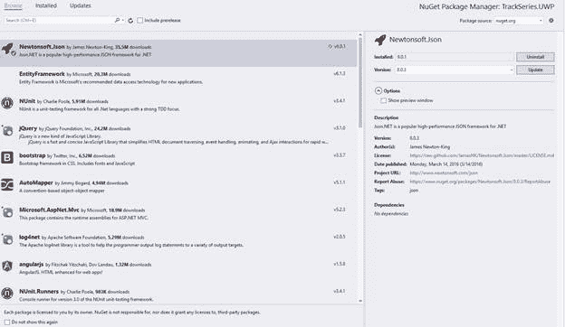

图 19:用于处理安装在 Visual Studio 项目中的库的 NuGet 窗口。

包管理器还有两个附加标签: **Installed** 将列出所有已安装到当前项目或解决方案的包，而 **Updates** 将显示比当前安装的版本更新的可用版本。

借助 Windows 10，微软还通过启动 Windows Insider 程序开始了一种获取操作系统新版本反馈的新方法，该程序适用于许多平台(更新最频繁的两个是桌面和移动平台，但您会发现 Insider 构建也适用于 IoT Core)。

当您将您的设备订阅到 Windows Insider 程序时，您有机会获得操作系统新版本的早期版本，并在最终版本发布之前测试所有即将推出的功能。这个项目不仅针对消费者，也针对开发者。事实上，订阅它的开发人员有机会尽早获得新 SDK 的初步版本，开始试验新的 API 和场景。

该计划帮助热情的用户和开发人员始终了解最新的功能和公告，但它也帮助微软以更好的方式塑造 Windows 10。工程团队在开发各种 Windows 10 更新过程中做出的许多决定都是内部用户通过**反馈中心**报告的反馈的直接结果，该中心是一个内置应用程序，以前仅在内部版本中可用，但从周年更新开始，每个用户都可以利用它来分享关于平台的反馈。

要订阅内部程序，只需打开设备上的设置，在**更新&安全**部分，选择 **Windows 内部程序**选项卡即可。从那里，您可以将您的微软帐户连接到该程序，将您的 Windows 安装变成一台 Windows Insider 机器。Windows Insider 程序提供三种不同的铃声，您可以在同一分支的下拉菜单中选择:

*   **快速戒指:**有了这个戒指，你大约每周都会收到一个新的构建。一旦引入新特性，您将是第一个测试它们的人，但是您也很可能会遇到一些问题，因为这些构建可能是非常初步的，并且没有经过完全测试。
*   **慢环**:有了这个环，你大概每个月都会收到一个新的构建。您需要一段时间(与快速环相比)才能开始看到新的特性，但是这些构建的平均质量会更高，因为它们已经经历了多个测试周期，并且已经在快速环中发布了一段时间。
*   **发布预览**:有了这个戒指，你不会收到新的主要版本，只会收到你当前版本的累积更新，通常是在发布给所有其他用户的前几周。

前两个环和发布预览环的主要区别在于:

*   快环和慢环以全新的构建号发布 Windows 10 版本，这意味着它们将触发全面升级体验。例如，在撰写本文时，快速环包含下一个 Windows 10 版本的第一批版本，在 BUILD 会议期间宣布的名称将是**秋季创作者更新**。这些版本的内部版本号从 16100 开始。
*   发布预览环仅包含更改构建的小版本的更新，这些更新在 PC 上作为常规修补程序应用，并且只需要重新启动。相反，在手机上，更新过程总是相同的，不管它是大版本还是小版本。例如，在编写本文时，发布预览环包含 build 15063。 **296** (大家会注意到，大改版号还是 15063，和官方创作者更新有关的那个)。更改的数字指的是较小的修订，我已经用粗体突出显示了它。

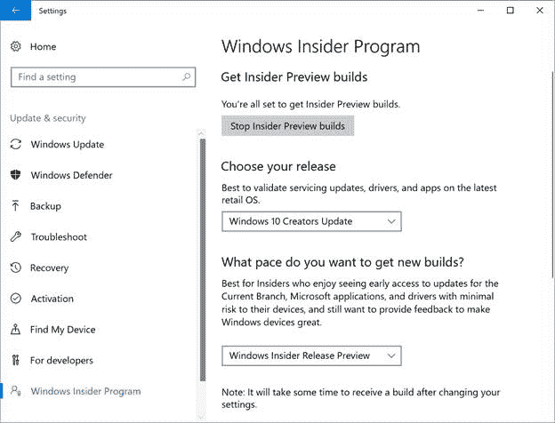

图 20:窗口设置中的窗口内部程序页面。

在 5 月初西雅图的 BUILD 大会上，微软为开发者发布了一些重要的公告，这些公告将对 Universal Windows 平台产生重要影响。主要有:

1.  **XAML 标准 1.0:** 我们将在下一章详细学习，XAML 是通用 Windows 平台应用程序用来设计用户界面的标记语言。然而，在撰写本文时，这种语言的特性和语法在各种微软技术中有点支离破碎。例如，使用这种语言的另一个重要的微软平台是 Xamarin Forms，这是一种开发人员可以用来编写跨平台应用程序(适用于 Windows、Android 和 iOS)的技术，共享相同的用户界面和代码。然而，目前，尽管这两个平台都基于 XAML，但它们在语法上有一些命名差异，使得从一种技术转移到另一种技术时不可能重用相同的代码。
2.  **。NET 标准库 2.0** : 。NET 标准库是可移植类库的发展，它们实现了。NET 生态系统(通常是独立于平台的部分)，允许开发人员跨多个微软平台共享同一个库(像后端库一样与云服务交互)。这项技术的 2.0 版本将增加对通用视窗平台的支持，允许开发人员将视窗 10 应用程序的部分代码与用 Xamarin 构建的安卓应用程序、用 ASP.NET 核心开发的运行在 Linux 上的网站或用 WPF 创建的经典视窗桌面应用程序共享。**