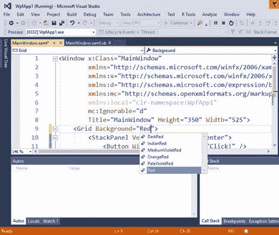
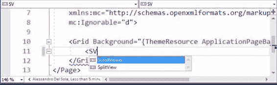
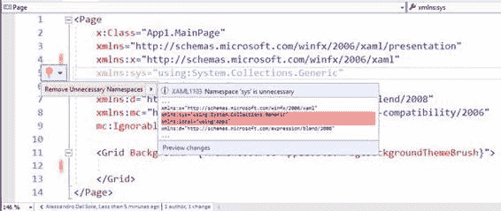
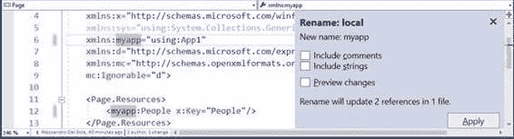
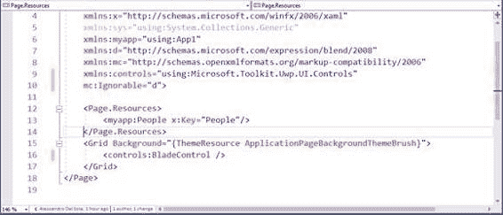
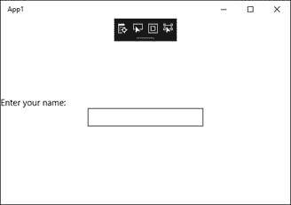
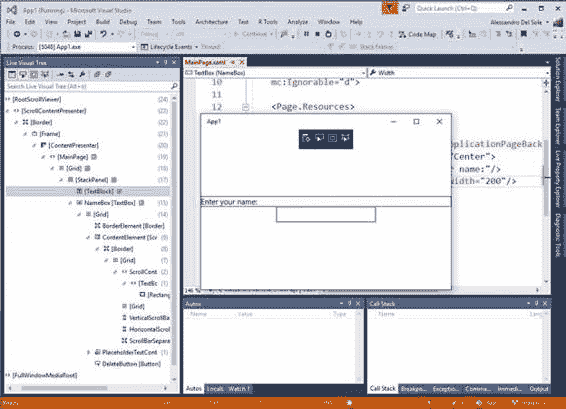
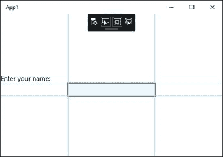

# 四、XAML 的改进

*可扩展应用程序标记语言* (XAML)是设计 Windows Presentation Foundation(WPF)和 Universal Windows Platform (UWP)应用程序的用户界面的语言。因此，这对微软来说至关重要。在 Visual Studio 2017 中，XAML 的工具得到了显著增强。在性能方面，在某些情况下，在 XAML 代码编辑器中的选项卡之间切换的速度要快 90%以上，为了避免在编辑器中键入 XAML 标记时出现延迟，已经进行了许多投资。此外，还对编码体验和诊断工具进行了许多其他改进。本章将描述这些改进，展示您在 Visual Studio 2017 中可以提高多少工作效率。如果您想亲自尝试，只需创建一个空白的 UWP 或 WPF 项目，并打开一个. xaml 文件。

|  | 注:本章介绍了 WPF 和 UWP 的共同特点。[第 8 章“面向移动开发的 Visual Studio 2017”](8.html#_Chapter_8_)将介绍针对 UWP 的其他改进。本章讨论的主题不适用于 XAML 的 Xamarin.Forms |

Visual Studio 2017 中 XAML 工具最重要的新增功能之一是 XAML 编辑和继续。此功能允许我们在应用程序以调试配置运行时编辑 XAML 代码。应用程序将立即反映这些编辑，而不需要中断应用程序的执行，并在进行一些编辑后重新启动。图 33 显示了如何在调试模式下编辑属性值(由 Visual Studio 主外壳底部状态栏的橙色显示)。

图 33:使用编辑并继续在运行时修改 XAML

您不仅限于编辑控件或面板的属性值，还可以添加新控件、新面板以及改进用户界面所需的一切。您可以将此功能与实时可视化树和实时属性资源管理器窗口结合使用，以获得增强的体验。“编辑并继续”是一项被大量请求的功能，最终可用于所有版本的 Visual Studio 2017。

通常，你会手动编写 XAML 代码，以便设计或至少微调 WPF 或 UWP 应用程序的用户界面。为此，微软对 XAML 代码编辑器进行了额外的改进，这将极大地改善您的编码体验。其中，XAML 编辑器现在具有我们在[第 3 章](3.html#structureGuideLines)中研究的**结构引导线**功能。其他功能涉及智能感知和代码重构，将在以下段落中介绍。

|  | 注:本章中的数字来自 UWP 的一个项目，但同样适用于 WPF。 |

在[第 3 章](3.html#navigatingCodewGoTo)中，我们看到了转到功能，它使导航代码变得更容易和更快。这也适用于 XAML 代码编辑器，可以通过按 Ctrl+G 来启用

XAML 的智能感知已经更新，只显示那些与您键入的内容最匹配的成员。此外，如果您只键入控件名称的大写字母，IntelliSense 将显示与这些大写字母匹配的完整控件名称列表。例如，如果您在 UWP 输入`SV`，智能感知将过滤仅显示`ScrollViewer`和`SplitView`元素名称的完成列表(见图 34)。

图 34:智能感知过滤

为了更好地管理 XAML 名称空间，引入了许多改进。其中包括 C# 和 Visual Basic 以前提供的功能，如内联重命名、解析缺失的命名空间和删除冗余命名空间。

#### 移除和排序命名空间

XAML 代码编辑器通过用较轻的语法着色来检测冗余的名称空间，这与自 Visual Studio 2015 以来的 C# 和 Visual Basic 完全一样。您可以在灯泡的帮助下轻松移除冗余的名称空间，如图 35 所示。

图 35:删除冗余命名空间

您还可以通过右键单击 XAML 代码，然后选择**移除和排序命名空间**，或者按 Ctrl+R，然后按 Ctrl+G，快速移除冗余命名空间并对剩余的命名空间进行排序

#### 内联命名空间重命名

内联重命名功能最初是在 Visual Studio 2015 中为 C# 和 Visual Basic 语言引入的，它允许直接在编辑器中重命名符号，而无需任何模态对话框。在 Visual Studio 2017 中，这项功能现在出现在 XAML 代码编辑器中，提供了一个更有效地重命名命名空间的选项。您可以右键单击名称空间的名称，然后选择**重命名**。这也将突出显示对所选名称空间的所有引用，如图 36 所示。

图 36:在名称空间上启用内联重命名

只需在任何突出显示的位置键入新名称，它将应用于整个解决方案中的所有引用(参见图 37)。

图 37:键入时重命名名称空间

与 C# 和 Visual Basic 一样，您也可以在注释和字符串中包含命名空间引用，以实现一致的重命名。

#### 解析缺少的命名空间

|  | 注意:为了演示这个功能，我添加了微软。控制一个空白的 Uwp 项目。但是，它适用于任何库和命名空间中的任何控件，包括 UWP 和 WPF。 |

我们经常需要添加对提供一些控件的库的引用，该库可以是微软或第三方库。但是，您可能不知道哪个 XAML 命名空间公开了控件，这可能会导致浪费时间来搜索正确的命名空间并添加其声明。在 Visual Studio 2017 中，代码编辑器可以轻松解析缺失的命名空间，代表您添加适当的声明。图 38 显示了如何用灯泡键入控件的名称，然后建议一个快速操作来添加适当的、缺少的名称空间声明。

图 38:灯泡建议对丢失的名称空间采取快速行动

作为快速操作的结果，Visual Studio 添加了适当的 XAML 命名空间。在这种特殊情况下，它添加了一个`xmlns:controls`指令，指向一个名为微软的命名空间。如图 39 所示。

图 39:添加了名称空间并修复了问题

请注意，指令的标识符(在本例中为`control`)是基于。NET 命名空间名称。然后，您可以使用内联重命名来提供不同的标识符，并自动更新所有引用。

Visual Studio 2017 包含一个名为“XAML 诊断”的功能。这项功能最初是在 Visual Studio 2015 Update 2 中以“XAML 应用程序内菜单”的名称引入的，但它值得一些解释，尤其是如果您是 Visual Studio 开发环境的新手。XAML 诊断由一个黑色的可折叠工具栏组成，当您调试 WPF 或 UWP 应用程序时会出现该工具栏。图 40 在一个非常简单的应用程序上显示了这个工具栏。

图 40:XAML 诊断工具栏

|  | 提示:默认情况下，应用程序内菜单处于启用状态。如果要禁用它，请转到工具>选项>调试，并清除在应用程序中显示运行时工具选项。 |

应用程序内菜单可以最小化，这有助于避免覆盖用户界面的部分——但目前，让它保持打开状态。菜单有四个按钮，每个按钮在下面的段落中描述(从左到右)。

#### 转到实时视觉树

顾名思义，该按钮只是打开实时可视化树工具窗口。我建议您停靠实时可视化树窗口，这样您将立即看到其他按钮的结果。更多关于实时视觉树的信息可以在 [MSDN 文档](https://msdn.microsoft.com/en-us/library/mt270227.aspx)中找到。

#### 启用选择

此按钮允许您在用户界面上选择控件。当您选择一个控件时，它会被红色边框包围，并且“实时可视化树”窗口会自动在可视化树中显示所选控件。图 41 显示了一个例子。

图 41:在 XAML 诊断中启用元素选择

这对于更精确地关注特定的控件或用户界面元素(包括视觉树中的基本元素)非常有用。

#### 显示布局装饰

此按钮允许您突出显示控件或用户界面元素的表面。如果与“启用选择”结合使用，则会高亮显示并选择一个元素。选择也反映在实时可视化树窗口中。这对于理解控件的分隔符很有用。图 42 显示了一个基于两个按钮组合的示例。

图 42:显示布局装饰

#### 轨迹聚焦元素

“轨迹聚焦”元素与“启用选择”类似，它允许选择一个控件并在实时视觉树中反映选择，但您应该注意，它只允许选择可以接收焦点的控件(例如，`TextBox`控件)。

由于其在通用视窗平台和视窗演示基金会中的重要性，XAML 代码编辑器在 Visual Studio 2017 中得到了许多改进。使用“编辑并继续”，您现在可以在应用程序处于调试模式时修改可视化树并查看更改。IntelliSense 改进了过滤，Go To 允许您快速导航标记，并且引入了新的重构来支持命名空间管理。但是 Visual Studio 2017 不仅仅是托管语言和 XAML 的环境。它是任何平台上任何开发的开发环境。在下一章中，您将为不使用 MSBuild 解决方案和项目的开发人员发现惊人的新功能。