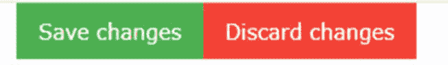
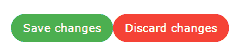
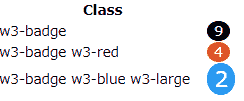
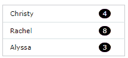
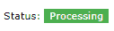
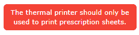

# 十、按钮和标签

网页上的按钮元素通常用于启动动作或切换功能。基本的 HTML 语法如下。

代码清单 50

```html
  <input type="button" 
    value="button
  text" 
    href="#"
    onclick="javascript function">

```

如果指定了`href`属性，则表示用户单击按钮时将进入的链接。单击按钮时，还可以调用一个 JavaScript 函数。注意，如果功能返回`FALSE`，则`href`链接不会被激活。

按钮的另一种方法是`<button>`元素或`<a>`锚元素。你可以使用任何方法在屏幕上创建一个可点击的区域。

## CSS 按钮

在框架中有两个基本类可以用来设计按钮的外观。`w3-button`类创建一个按钮，当你悬停在它上面时，它会改变颜色。`w3-btn`类创建一个按钮，当你悬停在它上面时，它会显示一个轻微的阴影效果。两个按钮类都默认为带有灰色悬停效果的黑色按钮。此外，将光标悬停在按钮上会将光标变为指针，表示用户可以单击该按钮。

### 按钮变化

您可以使用`w3-color`属性来更改按钮的背景和悬停颜色。例如，以下代码片段可能用于允许用户保存或放弃更新。

代码清单 51

```html
  <a href="save.aspx" class="w3-btn w3-green">Save changes</a>
  <a href="discard.aspx" class="w3-btn w3-red">Discard changes</a>

```

图 38 显示了彩色按钮示例。



图 38:示例按钮

#### 按钮颜色

您可以添加`w3-color`或`w3-hover-color`类来设置按钮颜色或悬停颜色(默认悬停颜色为灰色)。

#### 按钮形状

按钮的默认形状是矩形。您可以使用`w3-round`类为按钮添加圆角。下面的代码片段将产生如图 39 所示的圆形按钮。

代码清单 52

```html
  <div class="w3-container w3-margin">
   <a href="#" class="w3-btn
  w3-green w3-round-xxlarge">
    Save changes</a>
   <a href="#" class="w3-btn
  w3-red w3-round-xxlarge">
    Discard changes</a>
  </div>

```



图 39:圆形按钮

#### 禁用的按钮

按钮有视觉效果，背景颜色改变或阴影，以及光标改变以指示按钮是可点击的。如果某个按钮需要禁用，可以给按钮添加`w3-disabled`类。这将导致按钮呈现灰色外观，并在用户将鼠标移到按钮上时禁用光标。

|  | 提示:当点击按钮时，您可能希望通过 JavaScript 动态添加`w3-disabled`类。这可以提供按钮已经被按下并且动作正在被执行的视觉指示。工作完成后，删除该类。 |

#### 连锁反应

涟漪效应是一种视觉效果，表明按钮已被点击，为用户提供一些反馈。确保用户知道按钮已经被点击被认为是好的 UX 设计。您可以将`w3-ripple`类添加到任何按钮来提供这种效果。

## CSS 徽章

徽章是一个圆形标签，通常包含一个数字，表示在某个集合中找到了多少个项目。W3CSS 框架只有一个类`w3-badge`，它会创建一个黑色背景的圆形徽章。

您可以使用`w3-color`和`w3-size`类来控制徽章元素的颜色和大小。下面的代码片段创建了如图 40 所示的徽章。

代码清单 53

```html
  <div class="w3-container w3-margin" style="width:18%;">
   <p>w3-badge <span class="w3-badge w3-right">9</span></p>
   <p>w3-badge w3-red 
     <span
  class="w3-badge w3-red w3-right">4</span></p>
   <p>w3-badge w3-red w3-large
     <span
  class="w3-badge w3-blue w3-right
  w3-large">2</span></p>
  </div>

```



图 40:徽章示例

### 其他元素内的徽章

使用`<span>`标签可以在其他元素中使用`w3-badge`类。例如，我们可能有一个客户列表，并使用徽章来指示订单数量。

代码清单 54

```html
  <div class="w3-container w3-margin" style="width:18%;">
   <ul class="w3-ul w3-border">
    <li>Christy
     <span
  class="w3-badge w3-right
  w3-margin-right">4</span></li>
    <li>Rachel
     <span
  class="w3-badge w3-right
  w3-margin-right">8</span></li>
    <li>Alyssa
     <span
  class="w3-badge w3-right
  w3-margin-right">3</span></li>
   </ul>
  </div>

```

这段代码片段产生了如图 41 所示的列表。



图 41:带有列表元素的徽章

## CSS 标签

标签是网站上的标签，通常用于标记屏幕上的某些元素。W3CSS 框架提供了`w3-tag`类来格式化标签。下面的代码片段显示了一个显示当前操作状态的标记。

代码清单 55

```html
  <div class="w3-container>
    <p>Status:  <span class="w3-tag w3-green">Processing</span></p>
  </div>

```



图 42:处理标签

### 定制标签

您可以使用各种`w3`助手类来自定义标签的外观。例如，下面的代码片段添加了几个帮助器类来生成一个警告标记。

代码清单 56

```html
  <div class="w3-container">
     <span
  class="w3-tag w3-red w3-center
  w3-round-large w3-padding">
      The thermal printer should only be<br/>
      used to print prescriptions sheets.
     </span>
  </div>

```



图 43:警告标签

## 总结

按钮、徽章和标签类使您可以轻松地设置内容的样式，总结如下:

*   `w3-button`:悬停时灰色背景的基本按钮。
*   `w3-btn`:悬停时有阴影效果的按钮。
*   `w3-badge`:打造圆形“徽章”效果。
*   `w3-tag`:创建标签或标签效果。