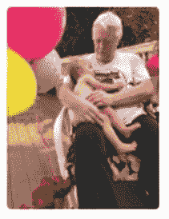
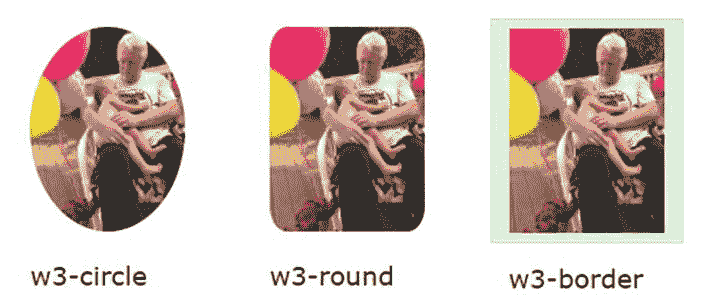
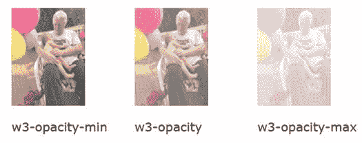
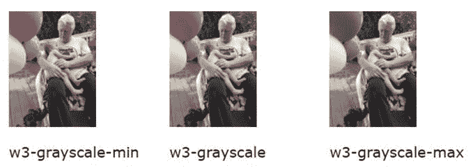
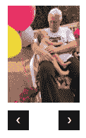

# 十四、图像

您可以使用``标签在网站上显示图片。W3CSS 框架提供了几个可以用来控制图像边框和外观的类。

## CSS 图像

这里是显示图像的 HTML。

代码清单 69

```html
     <div class="w3-container w3-margin">
    
    </div> 

```

这将产生如图 51 所示的图像。



图 51:爷爷拥抱

我们可以使用以下类来控制图像在页面上的显示方式:

*   `w3-circle`:将图像放置在一个圆圈中。
*   `w3-rounded`:增加圆角。
*   `w3-bordered`:在整个图像周围添加边框。



图 52:示例图像类

### 响应图像

您可以将`w3-image`类添加到``标签中，以创建响应图像。图像大小将根据屏幕进行调整，但绝不会大于原始图像大小。

|  | 注意:如果您想要一个完整的响应图像(意味着它可以比原始大小更大)，您需要将 width 属性设置为 100%(通过内嵌样式)。 |

### 图像不透明度

您可以使用不透明度类别将图像的不透明度从 25%设置为 75%。类名是:

*   `w3-opacity-min`:75%不透明度
*   `w3-opacity`:50%不透明度
*   `w3-opacity-max`:25%不透明度

图 53 显示了各种不透明度效果。



图 53:图像不透明度

### 灰度

您可以使用灰度等级来设置图像的灰度级别。类名是:

*   w3-灰度-最小值:最小灰度效果。
*   w3-灰度:主要是灰度图像。
*   w3-灰度:全灰度效果。

图 54 显示了图像的灰度效果。



图 54:灰度

### CSS 幻灯片

你可以使用 W3CSS 框架和一点 JavaScript 来创建一个图像幻灯片。图 55 显示了幻灯片的基本外观。用户可以点击按钮在幻灯片中的图像间移动。



图 55:幻灯片显示

### 设置图像

第一步是添加您想要查看的图像，并为它们分配相同的类名。下面的代码片段显示了图像设置和两个导航按钮。

代码清单 70

```html
   <div class="w3-display-container w3-content" style="width:8%;">
    
    
    <p>
     <button
  class="w3-button w3-black"
      onclick="plusDivs(-1)">&#10094;</button>
     <button
  class="w3-button w3-black"
      onclick="plusDivs(1)">&#10095;</button>
    </p>
  </div> 

```

HTML 实体用于按钮，以提供导航箭头。我们需要一个名为`plusDivs()`的 JavaScript 函数在图像间移动。

### JavaScript 代码

以下是需要添加到网站`<head>`部分的脚本标签中的代码，以允许图像之间的导航。

代码清单 71

```html
  <script>
    var slideIndex
  =1;
   showDivs(1);

   function
  plusDivs(n) { 
    showDivs(slideIndex += n) ;
    }  

    function
  showDivs(n) {
      var x = document.getElementsByClaseName('mySlides');
   if (n >
  x.length) { xslideIndex =1;} 
   if (n <
  1) { slideIndex =x.length;} 
   for (var
  i=0; i < x.length; i++) {
         x[i].style.display  ="none";
    } 
      x[i].style.display  ="block";
   }       
  </script>

```

脚本声明一个变量(`slideIndex`)来跟踪当前选择的图像，并将其初始化为第一个图像。按钮将调用`plusDivs()`功能，参数指示要显示的下一个图像。

`ShowDivs()`会简单地将所有图像的显示样式设置为`none`，然后将选中图像的样式设置为`block`，使其显示。

## 总结

W3CSS 提供了一些类来控制图像的外观和形状，并且使得用小的 JavaScript 创建图像集合的幻灯片显示变得非常容易。