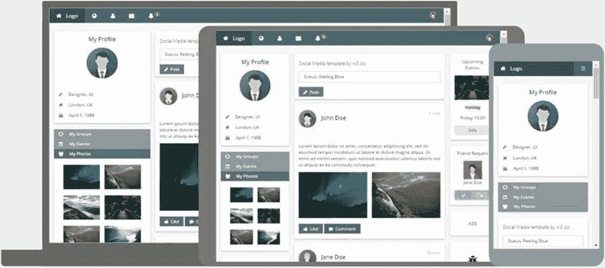

# 十七、总结

W3CSS 是一个简单快速的框架，使得应用 CSS 样式创建响应性网站变得更加容易。它的颜色支持和响应设计，以及一致和简单的类名，使它成为一个易于使用的框架，可以舒适地与其他框架和库一起使用。

访问 [W3CSS 网站](https://www.w3schools.com/w3css/default.asp)为框架和颜色库和主题的更新，以及在线文档和互动示例，让你尝试框架。

## 场地

W3CSS 站点提供了如何用类创建各种元素的例子。此外，还有几个演示网站可用，如相册、报纸版面和博客。

有几个可用的模板，这是各种类型的企业的完整网站。如果你正在为一家企业创建网站，这些可以为你节省一些启动时间。这些模板是响应性的，从图 58 所示的社交媒体网站模板快照中可以看出。

图 58: W3CSS 社交媒体模板

如果您正在寻找一个易于使用的免费 CSS 框架，其中包含大量的示例、模板和在线文档，请访问 W3CSS 当然是一个值得的竞争者。